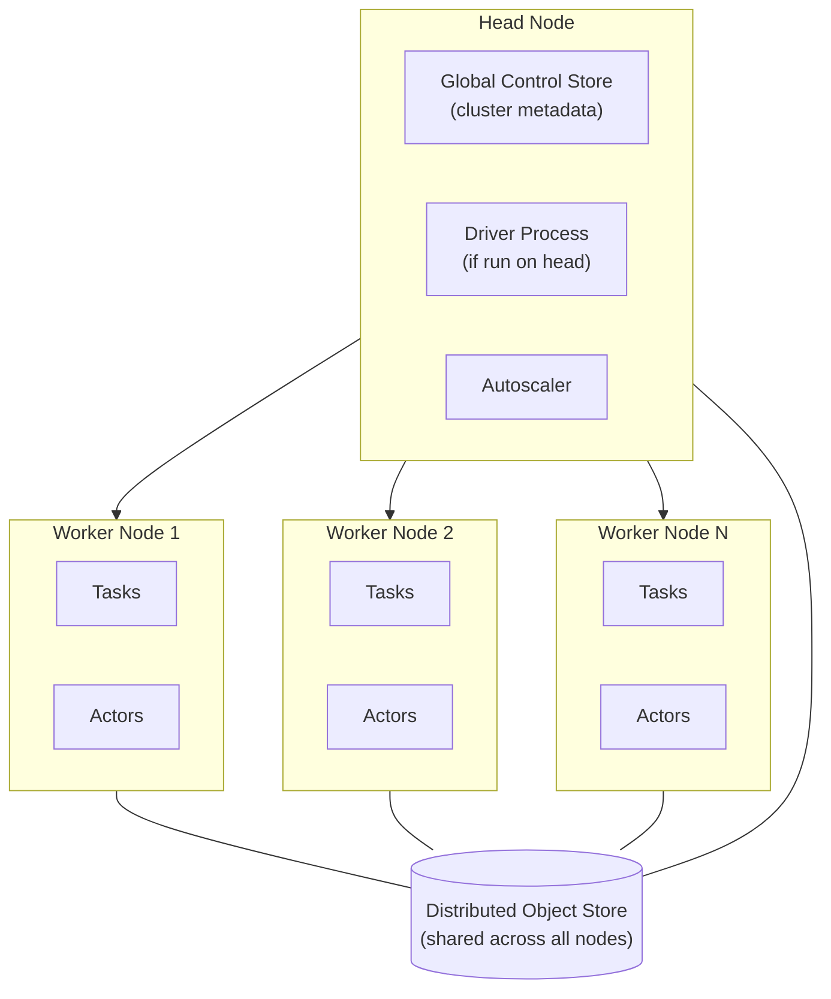

# パート 1: Ray アーキテクチャ

> **サポート対象バージョン**: Ray 2.57.0
> **最終更新**: August 20, 2026

## ラボ環境のセットアップ

このドキュメントの例に沿って進めるには、次のツールと環境が必要です。

### 必要なツール

* Python 3.10 以降
* `pip install ray[default]`（`default` extra は、後の例で使用する dashboard と cluster-launcher の依存関係を導入します。通常の `pip install ray` では、このドキュメントで紹介するコア API のみが導入されます）
* 以下の例を実行するには、いくつかの空き CPU コアを持つローカルマシンまたは VM で十分です。パート 1 では cluster は必要ありません

## Ray とは？

Ray は、Python ワークロードをスケールさせるためのオープンソースの分散コンピューティングフレームワークです。training 専用または serving 専用のツールのように、特定の 1 つのワークロード向けに構築されたフレームワークではありません。代わりに Ray は、汎用的なプリミティブの小さなセットを提供します。これにより、通常の Python コードを大幅に書き換えることなく、多数の CPU コアや多数のマシンにわたって実行できます。

これらのプリミティブは、幅広いユースケースをカバーするほど汎用的です。たとえば、その場限りの関数呼び出しバッチの並列化、分散モデル training の実行、多数の trial にわたる hyperparameter search、スケーラブルな inference endpoint の背後でのモデル serving などです。以下で簡単に紹介し、本シリーズの後半で詳しく扱う Ray Train、Ray Tune、Ray Serve などの Ray の上位レベルライブラリはすべて、独立して無関係なツールではなく、同じ基盤プリミティブ上に構築されています。この共有基盤こそが、それぞれ独自の実行モデルを持ちながらまとめてバンドルされた point tool のエコシステムと Ray を区別する、重要なアーキテクチャ上の特徴です。

## コアプリミティブ

Ray のプログラミングモデルは、task、actor、object store という 3 つのプリミティブに基づいています。

### Task

**task** は、呼び出し元プロセス内ではなく、Ray がリモートで実行するステートレスな関数です。通常の Python 関数に `@ray.remote` decorator を適用すると、task に変換できます。decorator を適用した関数を呼び出すと、関数が完了するまでブロックするのではなく、future（`ObjectRef`）がすぐに返されます。Ray は実際の実行を cluster の resource pool 内にある worker にスケジュールします。task は呼び出し間で state を持たないため、Ray は空き容量のある任意の worker で特定の呼び出しを実行できます。これが task を容易に scale out できる理由です。

Task は、embarrassingly parallel な作業に自然に適しています。たとえば、多数の独立した input への同一関数の適用、多数の独立した simulation の実行、多数のデータ shard の前処理などです。各 task 呼び出しは独立しておりステートレスであるため、Ray はある呼び出しと次の呼び出しの関係を追跡する必要なく、cluster 全体に多数の task をスケジュールできます。

### Actor

**actor** は、task に対応するステートフルなプリミティブです。Python class に `@ray.remote` を適用すると actor になります。Ray は worker 上で class をインスタンス化し、1 回の呼び出し後に返って消えるのではなく、そのインスタンスを長期間存続するリモート process として維持します。actor handle に対する method 呼び出しは、その同じ存続中のインスタンスにルーティングされるため、インスタンスに保存された state（モデルの weight、counter、開いている connection）は呼び出し間で保持されます。

Actor は、呼び出し間で state を保持する必要がある場合に適したプリミティブです。たとえば、累積する counter、リクエストごとに再ロードするのではなく memory に常駐させる loaded model、呼び出しごとに進行するステートフルな simulation などです。task と actor は競合する選択肢ではなく補完関係にあります。一般的な Ray application では両方を組み合わせ、ステートレスな並列作業には task を、state を保持する必要がある箇所には actor を使用します。

### Object Store

**object store** は、task と actor が相互に渡す object（関数の argument、return value、明示的に配置されたその他すべて）を保持する、分散型 shared-memory store です。cluster 内の各 node は独自のローカル object store を実行し、ある worker 上で実行中の task が別の worker で生成された object を読み取れるよう、必要に応じて Ray がそれらの間のデータ移動を調整します。

object store が最も重要になるのは、大きな object を扱う場合です。たとえば、大きな NumPy array、dataset shard、モデルの weight などです。このような object を必要とする各 process に serialize してコピーする代わりに、Ray は node 上の shared memory に 1 つのコピーを保持し、複数のローカル process が各 process 固有の memory に複製せずに読み取れるようにします。これにより Ray は、呼び出しごとに serialization と copy のコストを負担するのではなく、task と actor 間で大きなデータを効率的に移動できます。

## Cluster アーキテクチャ: Head Node と Worker Node

Ray cluster は、1 つの **head node** と任意の数の **worker node** で構成されます。head と worker を問わず、すべての node は Ray process を実行し、CPU、GPU、memory を cluster の共有 resource pool に提供します。

head node は、worker が担う機能に加えて、いくつかの追加の責務を実行します。

* **Global Control Store (GCS)**: cluster の metadata store。どの actor と object が存在し、どこに配置されているかに加え、scheduling と fault recovery が依存するその他の cluster state を追跡します。
* **Driver process**: 最上位の Ray script または interactive session を head node で実行する場合、その script を実行する driver はそこに存在し、task と actor 呼び出しを cluster に送信します。
* **Autoscaler**: cluster の保留中の workload がより多くの resource を必要とする場合に追加の worker node を要求し、不要になった idle worker を削除する process です。

worker node は、task と actor を実行し、cluster 全体で利用する pool に CPU、GPU、memory を追加するために存在します。Ray の scheduling model の重要な特性は、ここから導かれます。Ray は task と actor を、個別の node の resource を単独で対象にするのではなく、cluster 全体で結合された resource pool を対象にスケジュールします。2 CPU を要求する task は、2 CPU が空いている cluster 内の任意の node に配置できます。scheduler は、特定の machine に作業を手動で配置する場合のように、事前に node を選択するわけではありません。

すべての node は分散 object store に参加しているため、ある worker node 上の task によって生成された object は、別の worker node 上で実行される task または actor が読み取れます。これらの間のデータ移動は Ray が処理します。

## 同じ基盤上に構築された上位レベルライブラリ

Ray には、特定の ML workload に対応する複数の上位レベルライブラリが含まれています。これらはすべて、独自の別の実行モデルを導入するのではなく、前述の task、actor、object store の上に構築されています。

* **Ray Train** は多くの worker にわたってモデル training を分散します。本シリーズの[パート 3: Ray Train と Ray Tune](./03-ray-train-tune.md)で扱います。
* **Ray Tune** は、多数の trial にわたって hyperparameter search を並列実行します。こちらもパート 3 で扱います。
* **Ray Serve** は、スケーラブルな serving layer の背後にモデルを deploy します。本シリーズの[パート 4: Ray Serve](./04-ray-serve.md)で扱います。

この共有基盤は明示的に強調する価値があります。各 workload type のために scheduling、fault tolerance、data movement を個別に再実装する別々の tool をバンドルするのではなく、Ray はこれらの関心事をコアプリミティブで 1 回だけ実装し、各上位レベルライブラリがそれらを再利用できるようにします。分散 training と hyperparameter tuning は、根本的には Ray actor または task として実行される worker であり、通常の `@ray.remote` 関数が使用するのと同じ object store を介してデータを交換します。

本稿執筆時点で、Ray 2.57.0 は最新の安定版リリースです。将来の文脈として知っておく価値のある Ray 3.0 development line は存在しますが、まだリリースされていないため、このドキュメントはそれに固有の内容には依存していません。

## Kubernetes でこれが重要な理由

Ray には、head node、worker node、worker fleet を拡大または縮小する autoscaler という独自の cluster 概念があります。これは Kubernetes 自身の scheduling と autoscaling とは異なる layer です。Kubernetes 上で Ray を実行する場合、Ray cluster の構成（1 つの head、一定数の worker、それぞれの resource requirement）を、Kubernetes scheduler が実際に理解し EKS node に配置できる Pod や Deployment などの Kubernetes object に変換する必要があります。この変換こそが、本シリーズの次の[パート 2: KubeRay Operator](./02-kuberay-operator.md)で扱う問題です。

## 次のステップ

このドキュメントでは、Ray とは何か、その 3 つのコアプリミティブ（task、actor、object store）、そして Ray cluster の head node と worker node が共有 resource pool 全体で作業をスケジュールするためにどのように連携するかを説明しました。[パート 2: KubeRay Operator](./02-kuberay-operator.md)では、KubeRay operator がこの Ray cluster model を EKS 上の native Kubernetes resource にどのようにマッピングするかを扱います。[パート 3: Ray Train と Ray Tune](./03-ray-train-tune.md)および[パート 4: Ray Serve](./04-ray-serve.md)では、それぞれ training workload と serving workload のために、ここで紹介したプリミティブをさらに活用します。

[メインページに戻る](./README.md)

## クイズ

この章で学んだ内容を確認するには、[トピッククイズ](../../quizzes/ai-ml/ray/01-architecture-quiz.md)に挑戦してください。
