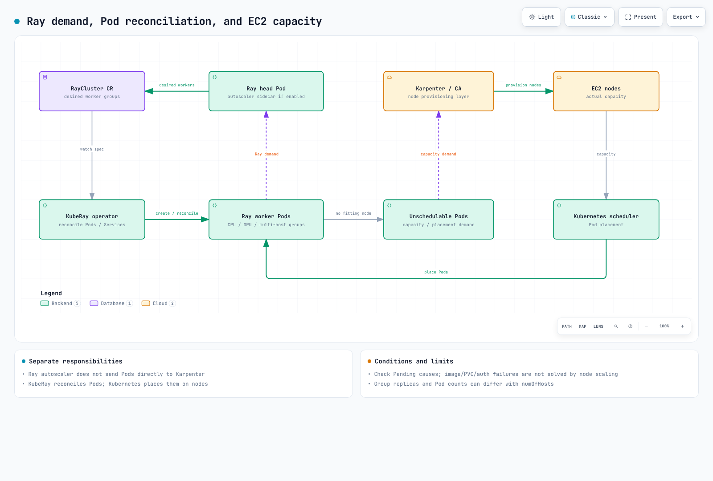

# Part 2: KubeRay Operator

> **レビュー基準**: KubeRay 1.7.0 · Ray 2.58.0 · 2026-09-12

## ラボ環境のセットアップ

サポートされている Kubernetes、互換性のある kubectl、および Helm 3 を準備してください。CPU 構成をレビューするうえで、GPU ハードウェアと Karpenter は前提条件ではありません。実際の EKS のキャパシティは、既存のマネージドノードグループ、Karpenter、Cluster Autoscaler、またはクラスターで選択したプロビジョニング構成から供給できます。

ここでの検証は、公式 chart のダウンロードとネイティブな Helm レンダリング、CRD スキーマの確認、および Ray 2.58.0 の autoscaler 設定ジェネレーターを対象としています。**API server の admission/CEL、controller の reconciliation、実際の autoscaling、GPU 実行は確認していません。**

## KubeRay の役割

KubeRay は Ray の CR を Pod、Service、および関連リソースに reconcile します。通常の RayCluster の worker group が必ず Deployment や StatefulSet であると想定しないでください。Ray ノードは通常 Ray Pod に対応し、その Pod をホストする Kubernetes/EC2 ノードとは異なります。

operator をインストールしても Ray ワークロードは開始されません。RayCluster、RayJob、RayService などのリソースは別途作成してください。また、すべての spec 変更が既存の Pod にその場で自動適用されるわけでもありません。更新パスを確認してください。

## CRD と feature gate

1.7.0 の chart には **RayCluster、RayJob、RayService、RayCronJob** の CRD が含まれます。いずれも `ray.io/v1` を提供します。最初の 3 つは非推奨の `v1alpha1` も保持していますが、新しい例では `v1` を使用します。

| リソース | 役割と境界 |
|---|---|
| RayCluster | head Pod と worker group を管理する。head のみの構成も可能 |
| RayJob | バッチ送信と任意の RayCluster ライフサイクル。既存クラスターとクリーンアップポリシーを区別する |
| RayService | RayCluster と Serve アプリケーションを管理する。アップグレードとトラフィック移行の条件を確認する |
| RayCronJob | スケジュールに従って RayJob を作成する。CRD はインストールされるが、その controller の feature gate はデフォルトで無効 |

chart のデフォルトでは、beta の `RayServiceIncrementalUpgrade` gate が有効です。mTLS、RayCluster NetworkPolicy、History collector の自動注入に関する alpha gate は無効です。History Server の beta ステータスは、alpha の collector 自動注入とは異なります。feature gate が利用可能であっても、リソースがその機能を設定済みであるという意味ではありません。

### RayJob のクリーンアップ

`shutdownAfterJobFinishes` のデフォルト値は false です。デフォルトの `ttlSecondsAfterFinished: 0` によって有効になるわけではありません。クリーンアップ、retry、実行前/実行中の deadline は明示的に設定してください。バージョン 1.7 には `deletionStrategy` もあり、従来の onSuccess/onFailure ポリシーと deletionRules を混在させないなどの制約があります。

共有クラスターの選択と、controller が作成したクラスターのクリーンアップを区別し、まず結果、checkpoint、ログを保全してください。RayCluster を削除しても、外部のアーティファクト/PVC やすべての EC2 料金が自動的にクリーンアップされるわけではありません。

### RayService のアップグレード

`NewCluster` と `NewClusterWithIncrementalUpgrade` は新しいクラスターを作成します。後者は Kubernetes Gateway API と適切な GatewayClass 実装を使用して、トラフィックを段階的に移行します。これは、いくつかの Pod をその場でローリング更新するだけの動作とは異なります。

1.7 では incremental の gate はデフォルトで有効ですが、それでも strategy、Gateway の設定、予備キャパシティ、readiness、draining の要件は重要です。ゼロダウンタイムは目標であり、すべてのアプリケーションに対する保証ではありません。Serve の動作については [Part 4](04-ray-serve.md) で詳しく説明します。

## Autoscaling のレイヤー

`enableInTreeAutoscaling: true` で Ray の autoscaling を有効にします。KubeRay は head Pod の autoscaler サイドカーと必要な権限を設定します。この例では、バージョンに依存するデフォルト値に頼らず、`autoscalerOptions.version: v2` を明示的に設定しています。

Ray autoscaler は task、actor、placement/リソース要求、および worker group の望ましいサイズを検査し、KubeRay が Pod を調整します。`numOfHosts` を使用すると、1 つの group replica が複数の Ray Pod に対応する場合があるため、`replicas == Pod 数` は普遍的ではありません。

Kubernetes は Pod を配置し、Karpenter などのプロビジョナーはスケジュール不可能な要件に対して EC2 キャパシティを供給します。イメージ pull、PVC、権限、クォータが原因の Pending Pod は、ノードを追加すれば必ず解決するというものではありません。Karpenter の consolidation と drift の処理も、別個の制御動作です。

Ray 2.58.0 の設定ジェネレーターは、グローバルな idle timeout をデフォルトで 60 秒にします。group レベルの idle timeout は動作を上書きできます。min/max replicas、アクティビティ、polling、draining の条件があるため、正確に 60 秒後に Pod を削除する約束ではありません。



[インタラクティブ図](https://www.atomai.click/kubernetes-docs/archmaps/en-ai-ml-ray-02-kuberay-operator-0.html)

## CPU/GPU リソースの宣言

**Pod の GPU limit が常に唯一の設定ソースであるとは限りません。** レビュー対象のコードは、構造化された group の `resources`、`rayStartParams`、および最初の Ray コンテナの limits/requests に対して優先順位を適用します。明示的な `num-gpus` が、コンテナの GPU limit で無条件に上書きされることはありません。

Ray 2.58.0 のネイティブな設定チェックでは、limit 1 から GPU 1、`rayStartParams.num-gpus=2` で GPU 2、構造化された group の `resources.GPU=3` で GPU 3 が生成されました。これは**物理 GPU を増やすものではありません**。Kubernetes の limit、device plugin、ドライバー、Ray の論理リソース、および可視のハードウェアを整合させてください。

min replicas と CPU/placement の要件も GPU group のサイズに影響し得ます。GPU Pod は、GPU task が pending のときにのみ現れるとは限りません。Ray の論理 CPU 設定とコンテナによる強制も区別してください。

## Operator のインストールとアップグレード

```bash
helm repo add kuberay https://ray-project.github.io/kuberay-helm/
helm repo update kuberay
helm pull kuberay/kuberay-operator --version 1.7.0 --untar --untardir ./vendor
helm template kuberay-operator ./vendor/kuberay-operator \
  --namespace kuberay-system --include-crds > operator.rendered.yaml
```

CRD、RBAC、namespace の監視スコープ、および feature gate を確認してください。chart のデフォルトでは leader election が有効で、クラスター全体を監視します。スコープを狭めるには、`singleNamespaceInstall`、`watchNamespace`、および関連する RBAC 設定をまとめてレビューしてください。

context と管理者権限を検証したうえで、実際のインストールを実行します。

```bash
helm upgrade --install kuberay-operator kuberay/kuberay-operator \
  --version 1.7.0 --namespace kuberay-system --create-namespace
kubectl rollout status deployment/kuberay-operator -n kuberay-system
```

Helm の `crds/` メカニズムは、**既存の CRD を自動的にアップグレードまたは削除しません**。chart のアップグレードによってスキーマが更新されたと想定しないでください。保存されている CR と API バージョンの互換性を確認したうえで、リリースに適した CRD 更新を別途実行してください。CRD を削除すると、その custom resource も削除される可能性があります。

## 最小構成の CPU 設定

この例では `ray-demo` namespace が存在することを前提としています。CRD スキーマは検証済みですが、controller の実行、イメージの起動、autoscaling は実行していません。

```yaml
apiVersion: ray.io/v1
kind: RayCluster
metadata:
  name: ray-cpu-demo
  namespace: ray-demo
spec:
  rayVersion: '2.58.0'
  enableInTreeAutoscaling: true
  autoscalerOptions:
    version: v2
    idleTimeoutSeconds: 60
  headGroupSpec:
    serviceType: ClusterIP
    rayStartParams:
      num-cpus: '0'
    template:
      spec:
        containers:
          - name: ray-head
            image: rayproject/ray:2.58.0-py312
            resources:
              requests:
                cpu: '1'
                memory: 2Gi
              limits:
                cpu: '1'
                memory: 2Gi
  workerGroupSpecs:
    - groupName: cpu
      replicas: 0
      minReplicas: 0
      maxReplicas: 2
      rayStartParams: {}
      template:
        spec:
          containers:
            - name: ray-worker
              image: rayproject/ray:2.58.0-py312
              resources:
                requests:
                  cpu: '1'
                  memory: 2Gi
                limits:
                  cpu: '1'
                  memory: 2Gi
```

完全なスキーマ fixture では、`rayproject/ray:2.58.0-py312` と、head および worker に対する CPU 1/メモリ 2 GiB の requests と limits を使用しています。`rayVersion` を設定しても、それ自体でコンテナイメージがアップグレードされるわけではありません。ランタイム、Python、イメージの互換性も検証してください。

dashboard、Ray Client、および job 送信のエントリポイントは、信頼できる利用者に限定してください。トークン認証は個別の設定であり、すべてのアプリケーションエンドポイントに対する TLS やアクセス制御ではありません。secret の配布方法を組織のポリシーに照らして確認し、機密性の高いトークンは公開マニフェストやログに残さないでください。

## 主な情報源

- [KubeRay 1.7.0 リリース](https://github.com/ray-project/kuberay/releases/tag/v1.7.0)
- [1.7.0 chart の values](https://github.com/ray-project/kuberay/blob/v1.7.0/helm-chart/kuberay-operator/values.yaml)
- [Pod/リソースの構築](https://github.com/ray-project/kuberay/blob/v1.7.0/ray-operator/controllers/ray/common/pod.go)
- [Ray 2.58.0 の autoscaler 設定](https://github.com/ray-project/ray/blob/ray-2.58.0/python/ray/autoscaler/_private/kuberay/autoscaling_config.py)
- [RayJob API](https://github.com/ray-project/kuberay/blob/v1.7.0/ray-operator/apis/ray/v1/rayjob_types.go)
- [RayService API](https://github.com/ray-project/kuberay/blob/v1.7.0/ray-operator/apis/ray/v1/rayservice_types.go)
- [Helm の CRD ライフサイクル](https://helm.sh/docs/chart_best_practices/custom_resource_definitions/)

[次へ: Train/Tune](03-ray-train-tune.md) · [メインページ](README.md) · [クイズ](../../quizzes/ai-ml/ray/02-kuberay-operator-quiz.md)
