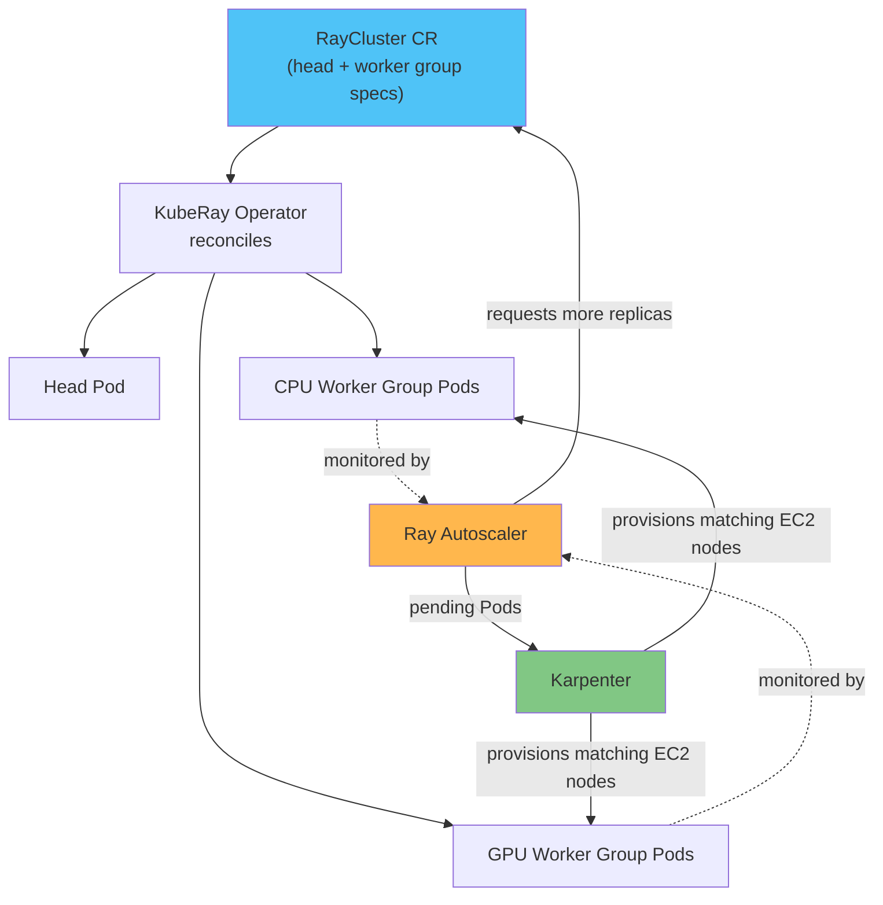

# パート 2: KubeRay Operator

> **対応バージョン**: KubeRay v1.6.1, Ray 2.57.0
> **最終更新**: August 20, 2026

## ラボ環境のセットアップ

このドキュメントの例を実行するには、次のツールと環境が必要です。

### 必要なツール

* 動作中の Amazon EKS cluster を参照する kubectl v1.34 以降
* Helm v3
* GPU worker group をテストする場合は、Karpenter によってプロビジョニングされた GPU 対応の `NodePool`/`EC2NodeClass` ペア

## KubeRay の機能

[パート 1](01-architecture.md)では、Ray cluster を head node と 1 つ以上の worker node group で構成されるものとして説明しました。この構成は Ray 固有の概念であり、Kubernetes の概念ではないため、実際の Pod、Service、および Kubernetes が理解するその他のオブジェクトへ変換する仕組みが必要です。その仕組みが KubeRay です。

KubeRay は、Ray cluster をネイティブ Kubernetes custom resource として管理する Kubernetes operator です。head node と各 worker group のために Deployment、StatefulSet、Service を手作業で記述する代わりに、operator のユーザーは YAML manifest で望ましい Ray cluster 構成を宣言します。KubeRay の controller は、その宣言された spec と cluster の実行中の状態を継続的に reconcile します。これにより「Kubernetes 上の Ray」が宣言的になります。望ましい状態は custom resource に置かれ、operator がそれに合わせて基盤となる Pod を作成、更新、削除します。

このドキュメントは **KubeRay v1.6.1** を対象としています。KubeRay はこのドキュメントとは独立したリリースサイクルで提供されるため、現在のバージョンは [KubeRay releases page](https://github.com/ray-project/kuberay/releases) で確認してください。KubeRay v1.6 では、Ray の認証 token mode（実行中の cluster の dashboard および client port へのアクセスを保護）の完全サポートが追加され、RayJob のデフォルト submitter image がより軽量なものに変更されたことで、従来のデフォルトより RayJob の起動パフォーマンスが向上しました。それ以前の v1.5 リリースでは、RayService 向けの段階的な rolling upgrade がすでに追加されています。これは cluster 全体を完全に blue-green 置換する場合より少ないリソースオーバーヘッドで、ダウンタイムゼロの更新を目指すものです。ただし、プロジェクトの成熟に伴い、このような機能は opt-in で feature gate によって有効化する状態からデフォルト有効へ移行する可能性があるため、利用する前に現在の release note を確認してください。

## コア CRD

KubeRay は、その機能の大部分を 3 つの Custom Resource Definition を通じて提供します。各 CRD は Kubernetes 上で Ray を実行する異なる方法を対象としています（KubeRay Helm chart は、新しく現在も進化中の機能のための CRD もインストールします。そのため、この 3 つですべてだと判断する前に、現在の release note で完全な一覧を確認してください）。

**RayCluster** は基盤となる resource です。これは 1 つの head Pod と 1 つ以上の worker group で構成される、素の Ray cluster です。各 worker group は均質な worker Pod のセットです。たとえば、一般的な Ray task のための CPU worker group と、model training または inference のための別の GPU worker group です。KubeRay operator は、実行中の Pod と RayCluster spec を継続的に reconcile し、spec（または後述する autoscaler）によって group の希望 replica 数が変更されると worker Pod を作成または削除します。

**RayJob** は batch job を Ray cluster に送信し、必要に応じてその cluster のライフサイクル全体を管理します。RayCluster を作成し、送信された job をそれに対して実行し、job の完了後に cluster を削除します。実行の合間に idle 状態の cluster にコストを払い続けることを避けられるため、単発またはスケジュールされた batch workload に自然に適しています。

**RayService** は本番の model serving を対象とします。RayCluster と、その上にデプロイされた Ray Serve application をまとめて管理し、ダウンタイムゼロを目指して基盤となる cluster と application の rolling upgrade を実行できます。本番で利用する前に、この upgrade パスの成熟度および前提条件について現在の release note を確認してください。



## 2 層の Autoscaling: Ray Autoscaler と Karpenter

EKS 上で Ray を実行する場合、2 つの異なる autoscaling control loop を扱うことになります。このドキュメントサイトでは Flink や Katib など、他の autoscale する workload についてもこのパターンを取り上げています。各 loop は異なる問いに答えるもので、どちらも他方の問いには答えられません。

**Ray autoscaler** は、KubeRay を通じて Ray cluster 自体の一部として実行されます。これは Ray 独自の scheduling state、すなわち現在の worker に配置できない pending task と actor を監視し、必要な Ray worker Pod の数を決定します。そして関連する RayCluster worker group の replica 数を調整してその決定を反映し、KubeRay operator に worker Pod の作成（または削除）を指示します。autoscaler には、デフォルトで 60 秒の `idleTimeoutSeconds` 設定もあります。これは task、actor、または参照されている object がない idle 状態の worker Pod を autoscaler が scale down するまでの時間です。

**Karpenter**（または Karpenter を使用していない cluster では Kubernetes Cluster Autoscaler）は、Kubernetes node レベルで 1 層下を動作します。Ray task や actor については認識しません。node に Pod を収容する空きがなく pending 状態になった Pod にのみ反応し、それらの pending Pod に合うサイズの新しい EC2 node をプロビジョニングします。

まとめると、Ray autoscaler は cluster が必要とする *Ray worker Pod の数* を決定し、Karpenter はそれらを実際に実行するために必要な *EC2 node の数* を決定します。一方の control loop が Pod 数を担当し、別の control loop が node 数を担当します。両者は pending Pod という通常の Kubernetes scheduling state を介して間接的にのみ通信します。この loop の node provisioning 側の仕組みについては、このリポジトリの [Karpenter documentation](../../autoscaling/02-karpenter.md) を参照してください。

## GPU Scheduling

GPU worker group の Pod spec は、その group の Ray worker が認識できる GPU 数の唯一の信頼できる情報源です。worker group の container spec で GPU resource limit、たとえば `nvidia.com/gpu: 1` を設定すると、KubeRay はその limit を読み取り、生成される worker Pod 上の GPU capacity として Ray scheduler と Ray autoscaler の両方に通知します。また KubeRay は、その worker の Ray process の `--num-gpus` flag を Pod spec の GPU limit と一致するよう自動的に設定するため、GPU 数を手作業で同期させる別の場所は必要ありません。

これは、GPU 対応 scheduling と GPU 対応 autoscaling の両方が、同じ Kubernetes ネイティブの宣言から得られることを意味します。Ray autoscaler は、GPU に束縛された task が実際に pending 状態のときにのみ GPU worker replica の追加を要求します。Karpenter は、[Karpenter](../../autoscaling/02-karpenter.md) で説明している node pool および node class configuration を用いて、それらの Pod を満たす GPU 搭載 EC2 node をプロビジョニングします。このドキュメントでは、その仕組みを改めて導出しません。

## Operator のインストール

KubeRay をインストールする標準的な方法は、`ray-project/kuberay-helm` repository から公開されている公式 Helm chart を使用することです。

```bash
helm repo add kuberay https://ray-project.github.io/kuberay-helm/
helm repo update
helm install kuberay-operator kuberay/kuberay-operator --version 1.6.1
```

これにより、上で説明した RayCluster、RayJob、RayService を含む operator の controller とその CRD が cluster にインストールされます。operator Pod が実行されると、cluster 全体（または installation flag に応じて namespace）にあるこれらの object を監視し、reconcile を開始します。

## 次のステップ

このパートでは、KubeRay、そのコア CRD、および 2 層の autoscaling model が Karpenter とどのように作業を分担するかを説明しました。次のパートでは、cluster の仕組みから、KubeRay 管理下の cluster 上で実行される Ray の ML library に移ります。[パート 3: Ray Train と Ray Tune](03-ray-train-tune.md) を参照してください。

[メインページに戻る](./README.md)

## クイズ

この章で学んだ内容を確認するには、[トピッククイズ](../../quizzes/ai-ml/ray/02-kuberay-operator-quiz.md) に挑戦してください。
