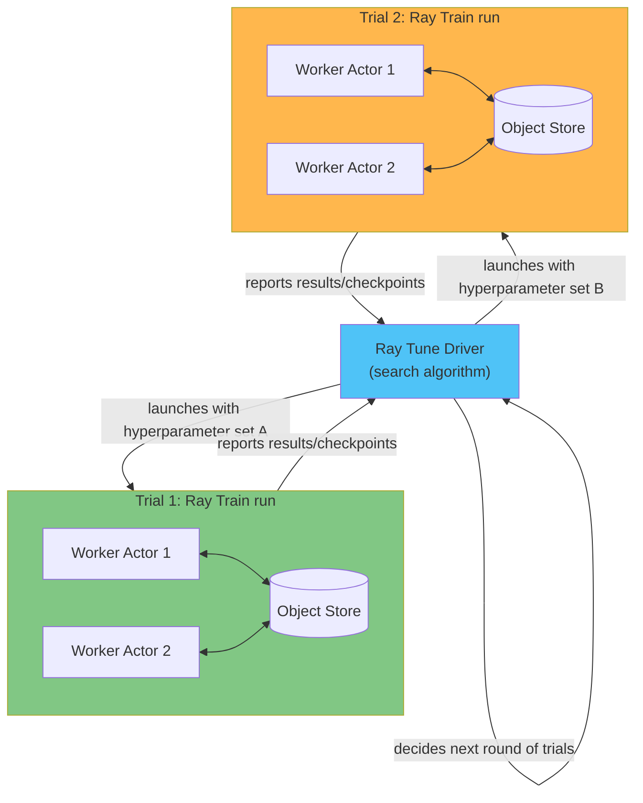

# パート 3: Ray Train と Ray Tune

> **対応バージョン**: Ray 2.57.0
> **最終更新**: August 20, 2026

## ラボ環境のセットアップ

このドキュメントの例に沿って進めるには、以下のツールと環境が必要です。

### 必要なツール

* Python 3.10 以降
* `pip install "ray[train,tune]"`
* Ray クラスターへのアクセス（EKS 上で起動する方法は [パート 2: KubeRay Operator](02-kuberay-operator.md) を参照するか、このドキュメントの例ではローカルで `ray.init()` を実行してください）

## Ray Train: Ray のプリミティブを使用した分散トレーニング

[パート 1](01-architecture.md) では、Ray のコアプリミティブであるタスク、Actor、Object Store を紹介しました。これらのプリミティブに対して直接分散トレーニングジョブを書くことも可能ですが、多くの定型処理を自ら実装する必要があります。具体的には、GPU ごとに 1 つの Worker プロセスを起動し、Worker が勾配を同期するために使用する通信グループを設定し、すべての Worker 間で一貫して Checkpoint を調整することです。

**Ray Train** は、Ray のタスクおよび Actor プリミティブ上に構築されたライブラリで、この定型処理を担います。一般的なフレームワーク API（最も一般的なのは PyTorch ですが、Ray Train は他のフレームワークもサポートします）に対して書かれたトレーニング関数を受け取り、要求した数の分散 Worker にわたって実行します。トレーニング関数の作成者は、Worker の起動、Worker 間通信、または Checkpoint の調整を直接管理する必要がありません。

### Ray Train V2

Ray Train のパブリック API は、プロジェクトの歴史の中で進化してきました。PyTorch トレーニング向けのユーザー向けインポートパスは依然として `ray.train.torch.TorchTrainer` ですが、そのパスの背後にある実装は書き直されています。この書き直し（「Train V2」）により、以前の世代の Trainer クラスが内部でどのように動作するかが統合・簡素化され、現在は同じインポートから取得されるデフォルト実装です。この書き直しが導入される前の Ray リリースに固定された古いコードベースに遭遇した場合は、壊れていると考えるのではなく、以前の実装上で動作しているものとして扱ってください。デフォルトが切り替わった正確なバージョンのような詳細は Ray リリースごとに変わるため、詳細については docs.ray.io の Ray ドキュメントを参照してください。

## Ray Train の中核概念

### Trainer

`TorchTrainer` などの **Trainer** は、ユーザー提供のトレーニング関数をラップします。トレーニング関数には、選択したフレームワークにおける通常のモデルトレーニングロジック、すなわちモデルの構築、バッチの反復処理、損失の計算、Optimizer の実行が含まれます。Trainer は、基盤フレームワークのデータ並列トレーニングが期待する分散プロセスグループ（たとえば PyTorch DDP プロセスグループ）内で、Worker ごとに 1 回この関数を起動する役割を担うため、トレーニング関数自体がそれを手作業で設定する必要はありません。

### ScalingConfig

**ScalingConfig** は、起動する Worker 数と各 Worker に必要なリソース（たとえば、実行する Worker 数や各 Worker に GPU が必要かどうか）を Trainer に伝えます。Trainer は、この設定を使用して、他の Ray タスクや Actor と同様に、基盤となる Ray クラスターに対応するリソースを要求します。

### Checkpointing

Ray Train Worker は、トレーニング中に Checkpoint を報告できます。Checkpoint は、通常はモデルの重みと Optimizer の状態など、その時点から最初からではなくトレーニングを再開するのに十分な状態をキャプチャします。これは 2 つの目的に役立ちます。Worker 障害後に、それまでの進捗をすべて失わずに長時間実行される分散トレーニングジョブを復旧できること、そしてワークフローの次の段階（以下で説明する後続のハイパーパラメータチューニングの判断、または結果をモデルバージョンとして登録すること）にトレーニング済みモデルを引き渡せることです。後者は、このドキュメントサイトの MLflow Model Registry 資料で扱う内容と概念的に似ていますが、その資料は Ray 固有ではありません。

## Ray Tune: クラスター全体でのハイパーパラメータ検索

**Ray Tune** は、Ray 上にも構築されたハイパーパラメータチューニングライブラリです。クラスター全体で多数のトレーニング Trial を並列実行し、プラグイン可能な検索アルゴリズムを使用して、次に試すハイパーパラメータの組み合わせを決定します。各 Trial は特定のハイパーパラメータセットでモデルをトレーニングし、Tune の検索アルゴリズムが次に試す内容を決定するために使用できる結果を返します。

これは、このドキュメントサイトの Kubeflow サブツリーが Katib について説明している内容と概念的には並列していますが、Tune は個別の Kubernetes CRD ベースのシステムではなく、Ray エコシステムにネイティブなライブラリです。

## Ray Train と Ray Tune の組み合わせ

Ray Tune が実行する Trial は、単一プロセスの関数である必要はありません。一般的なパターンは、Tune が検索対象とする trainable として Ray Train の `Trainer` を渡すことです。すると各ハイパーパラメータ Trial は、それ自体が分散 Ray Train 実行となり、複数の GPU または複数のノードにまたがる可能性があります。

この組み合わせが重要になるのは、1 回の Trial 自体が妥当な時間内に完了するために分散トレーニングを必要とするほど、モデルのトレーニングコストが高い場合です。これがなければ、チームは扱いにくい選択を迫られます。分散トレーニングジョブに対してハイパーパラメータを直列にチューニングするか、検索フェーズ中の分散トレーニングをあきらめるかです。両方のライブラリは同じ基盤 Ray プリミティブを共有しているため、Tune は、多数の同時実行 Ray Train を、それぞれ独自の分散 Worker セットとともに実行できます。どちらのライブラリにも、もう一方のための特別な統合コードは必要ありません。

## リソース割り当てとクラスターオートスケーラー

Ray Train と Ray Tune はいずれも、[パート 1](01-architecture.md) で説明した Ray の通常のタスクおよび Actor のリソース要求メカニズムを通じて、Worker の CPU と GPU を要求します。トレーニングまたはチューニング専用の個別のリソース要求パスはありません。これは EKS で重要です。なぜなら、[パート 2](02-kuberay-operator.md) で扱った KubeRay 管理のオートスケーラーが、トレーニングまたはチューニングジョブの実際のリソース需要に応答できるのは、まさにこのためです。クラスターを、これまでに実行する最大のジョブ向けにあらかじめサイジングする必要はありません。Ray Tune のスイープがより多くの同時 Trial を起動すると、オートスケーラーはさらに Worker ノードを要求でき、Trial の完了後にはスケールダウンできます。

## 実践上の注意: EKS における Co-Scheduling と GPU ノードのリードタイム

単一の Ray Train 実行を構成する分散 Worker プロセスは、通常 Co-Scheduling される必要があります。つまり、Worker が形成する通信グループを確立する前に、すべての Worker が同時に起動し、割り当てられた GPU を保持している必要があります。これは、このドキュメントサイトの他の分散トレーニングシステムで扱う Gang Scheduling の必要性と似ています。クラスターのオートスケーラーが妥当な時間内に要求されたすべての GPU Worker をプロビジョニングできない場合、トレーニング実行は最後の数個の Worker の起動を待って停止する可能性があります。

これは GPU ノードプールのプロビジョニングリードタイムと直接関係します。ノードプールから新しい GPU キャパシティを取得するには時間がかかり、その時間は一般用途の CPU ノードよりも長く、予測しにくいことがよくあります。このドキュメントサイトの [Karpenter ガイド](../../autoscaling/02-karpenter.md) では、ノードプロビジョニングの仕組みを詳しく扱っています。Ray Train/Tune の計画において押さえるべき点は、EKS 上のトレーニングジョブの実際の開始時刻は、ジョブが送信された時刻だけでなく、クラスターが要求されたすべての Worker をどれだけ速やかに Co-Scheduling できるかにも依存するということです。

## 次のステップ

パート 3 では、Ray Train の Trainer、ScalingConfig、Checkpointing、Ray Tune の Trial ベースのハイパーパラメータ検索、およびチューニング Trial 自体が分散トレーニングを必要とする場合に両者を組み合わせる方法を扱いました。[パート 4: Ray Serve](04-ray-serve.md) では、トレーニングからサービングへ進みます。トレーニング済み（およびチューニング済みの可能性がある）モデルを取得し、スケーラブルな推論エンドポイントの背後で公開します。

[メインページに戻る](./README.md)

## クイズ

[Ray Train と Ray Tune のクイズ](../../quizzes/ai-ml/ray/03-ray-train-tune-quiz.md) で理解度を確認してください。
