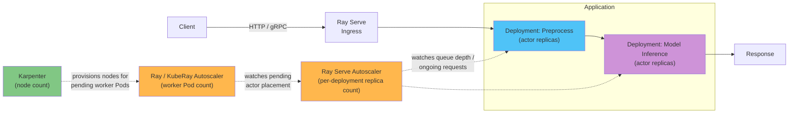

# 第4部: Ray Serve

> **対応バージョン**: Ray 2.57.0
> **最終更新**: August 20, 2026

## ラボ環境のセットアップ

このドキュメントの例を実行するには、次のツールと環境が必要です。

### 必要なツール

* Python 3.10+
* 一般的な Ray Serve Deployment には `pip install "ray[serve]"`、または下記の Ray Serve LLM セクションを実行する場合は `pip install "ray[llm]"`。後者は、`ray[serve]` に含まれない vLLM と関連依存関係を導入します
* RayService の手順をテストする場合は、稼働中の Amazon EKS cluster を対象に設定した kubectl v1.34 以降
* GPU 対応モデルを提供する場合は、Karpenter 経由でプロビジョニングされた GPU 対応 `NodePool`/`EC2NodeClass` ペア

## Ray Serve とは

[第1部](01-architecture.md)では、呼び出しの間もメモリ内の状態を保持する、stateful かつアドレス指定可能な Python object のための Ray のプリミティブである actor を紹介しました。Ray Serve はこのプリミティブ上に直接構築されたモデル提供ライブラリです。Serve Deployment は Ray actor、または actor replica のグループとして実装され、Ray Serve は受信した HTTP または gRPC request をそれらの replica にルーティングします。replica のメモリに一度ロードされたモデルは、再ロードすることなく多数の request に応答できます。これはまさに actor が設計されたパターンです。

1 つの Deployment は、Ray Serve の request router の背後に actor replica を追加するだけで水平方向にスケールします。これは Ray における任意の actor ベースの service と同じスケーリング方法です。さらに重要なのは、Ray Serve により複数の Deployment を application と呼ばれる 1 つの serving pipeline に組み合わせられることです。一般的な例は 2 段階の pipeline です。1 つ目の Deployment が前処理（tokenization、image resizing、feature extraction）を処理し、その出力を実際のモデル inference を実行する 2 つ目の Deployment に渡します。基盤ではそれぞれが actor replica のグループであるため、この pipeline 内の各 Deployment は個別にスケール、バージョン管理、リソース設定できます。

## Ray Serve LLM

大規模言語モデルの提供には、continuous batching、token streaming、OpenAI 互換 request 形式という十分に異なるパターンがあります。そのため Ray は専用の構成要素セットである `ray.serve.llm` module を提供しています。vLLM engine instance 自体を管理する Deployment を手作業で組み立てるのではなく、`ray.serve.llm` は、上記の Ray Serve の一般的な Deployment model 上に重ねた、LLM 提供に特化した高水準の構成要素を提供します。

`ray.serve.llm` は vLLM を対応 inference engine として文書化しており、その OpenAI 互換 API は vLLM 自体の OpenAI 互換 server と密接に対応するよう設計されています。そのため、通常の `vllm serve` invocation で機能するほとんどの `engine_kwargs` を引き継げます。実際には、autoscaling、multi-model serving、Ray の通常の distributed-actor placement といった本番向け Ray Serve 機能が LLM の提供にも適用される一方、LLM 固有の処理（vLLM engine のロードと設定、OpenAI 互換 endpoint の公開）は手作業で構築するものではなく `ray.serve.llm` が処理します。これは Ray Serve の中でも特に活発に進化している領域の 1 つであるため、特定の field name に依存する前に、正確な設定項目について現在の `docs.ray.io/en/latest/serve/llm/` documentation を確認してください。

## Serve Deployment の Autoscaling

Ray Serve Deployment には、[第2部](02-kuberay-operator.md)で扱った cluster レベルの autoscaling とは別の autoscaling layer があります。Ray/KubeRay autoscaler が RayCluster に必要な worker Pod 数を決定するのに対し、Ray Serve の autoscaler はその 1 層上で、より限定的な問いに答えます。実際に受信している request load に基づき、*この特定の Deployment* には現在いくつの actor replica が必要か、という問いです。Ray Serve は、キュー待ちと処理中を合わせた replica あたりの進行中 request 数を target value と比較し、設定済みの最小・最大 replica 数の範囲内で、実際の load をその target に近づけるよう replica を増減します。

これにより、この documentation site でおなじみとなった、EKS 上で動作する Serve application の 3 層 autoscaling 構成が得られます。

1. **Ray Serve の autoscaler** は、request load に基づいて Deployment に必要な actor replica 数を決定します。
2. **Ray/KubeRay autoscaler**（[第2部](02-kuberay-operator.md)で扱う）は、Ray Serve の autoscaler が要求した replica を含む pending actor placement に基づき、基盤となる RayCluster に必要な Ray worker Pod 数を決定します。
3. **Karpenter** は、これらの worker Pod を実際に実行するために必要な EC2 node 数を決定します。これは [Karpenter](../../autoscaling/02-karpenter.md)で説明したものと同じメカニズムです。

各 layer は、その直下の layer しか見ません。Ray Serve の autoscaler は、新しい replica が既存の node に配置されるのか、新しい node を必要とするのかを認識しません。必要な replica を要求するだけです。その要求が新しい EC2 node になるかどうか、またそれに要する時間は、さらに 1 層下にある Karpenter の役割です。

## GPU Inference

GPU を必要とする model-inference Deployment は、ほかの Ray workload と同じ方法で GPU を要求します。すなわち、Ray Train および Ray Tune worker に対して[第3部](03-ray-train-tune.md)で扱ったものと同じ、Ray の通常の actor 単位 resource request を使用します。Ray Serve は、要求された GPU 数を満たせる worker にこの Deployment の actor replica をスケジュールします。また、[第2部](02-kuberay-operator.md)で扱ったように、Ray scheduler に GPU capacity を実際に通知するのは、そもそも worker group の Pod spec です。

ここでは、Ray Serve の autoscaling と Karpenter の node-provisioning lead time が、この site におけるほかの GPU workload とまったく同じように相互作用します。Ray Serve の autoscaler が inference Deployment に別の replica が必要だと判断し、既存の GPU worker Pod のどれにも空きがない場合、その replica request は pending Pod になります。そして、replica が実際に traffic の提供を開始するには、Karpenter が新しい GPU 対応 EC2 node をプロビジョニングする必要があります。GPU replica 数を積極的にスケールする serving application では、この provisioning lead time を考慮する必要があります。GPU instance type の node provisioning latency の仕組みについては、[Karpenter](../../autoscaling/02-karpenter.md)を参照してください。

## 本番環境の RayService

Kubernetes の外部で Serve application 単体を実行することはローカル開発には適していますが、EKS 上の本番 Deployment では、[第2部](02-kuberay-operator.md)で紹介した `RayService` CRD を使用します。RayService は、基盤となる RayCluster と、その上に Deployment された Serve application を 1 つの unit として管理します。また、in-flight request を落とさないことを目指して新しい application version や変更された RayCluster spec を rollout することをサポートする resource です。この upgrade path の成熟度と前提条件については、現在の KubeRay release note を確認してください。このドキュメントでは RayService の CRD mechanics を改めて説明しません。詳細は第2部を参照してください。

実際には、先にこのドキュメントで説明した Deployment topology、すなわち 1 つ以上の Deployment で構成され、それぞれが自らの actor replica 数を autoscaling する application の lifecycle を、実際の EKS cluster では `RayService` object が管理します。その下では、Ray/KubeRay と Karpenter の autoscaling tier が、ほかのすべての RayCluster とまったく同じように動作し続けます。

## 次のステップ

これで 4 部構成の Ray series は終了です。[第1部](01-architecture.md)では、Ray の core primitive、すなわち task、actor、object store を扱いました。[第2部](02-kuberay-operator.md)では、KubeRay の `RayCluster`、`RayJob`、`RayService` CRD を通じて Kubernetes 上で Ray cluster を declarative に実行する方法、および Ray/KubeRay と Karpenter による autoscaling の分担を扱いました。[第3部](03-ray-train-tune.md)では、その cluster 上での distributed training と hyperparameter tuning を扱いました。この部では Ray Serve で締めくくりました。第1部の actor primitive 上に構築され、application に組み合わされ、それぞれの request-load metric によって autoscaling され、本番環境では第2部の RayService CRD を通じて end to end で管理される Deployment です。

[メインページに戻る](./README.md)

## クイズ

この章で学んだ内容を確認するには、[トピッククイズ](../../quizzes/ai-ml/ray/04-ray-serve-quiz.md)に挑戦してください。
