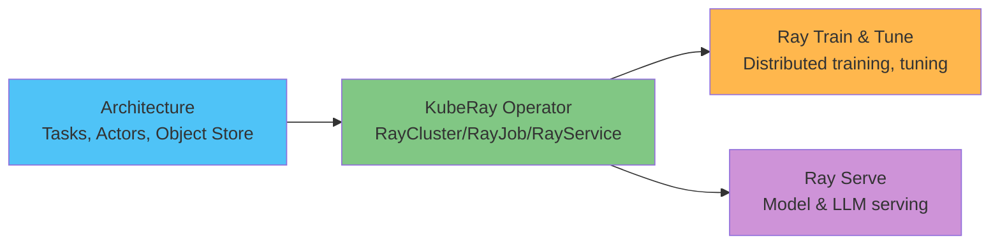

# EKS 上の Ray 詳細解説

> **サポート対象バージョン**: Ray 2.57.0, KubeRay v1.6.1
> **最終更新**: August 20, 2026

## 概要

Ray は、アドホックな並列タスクから分散トレーニング、ハイパーパラメータチューニング、モデルサービングまで、Python ワークロードをスケーリングするためのオープンソースの分散コンピューティングフレームワークです。ワークロードの種類ごとに別のツールを用意するのではなく、少数のコアプリミティブ（tasks、actors、共有 Object Store）を中心に構築されています。Kubernetes では、KubeRay Operator が Ray Cluster の head/worker-node 構成をネイティブ Kubernetes リソースに変換するため、Ray Cluster を宣言的に管理でき、他のワークロードですでに利用しているのと同じデプロイおよびオートスケーリングの仕組みを EKS でも利用できます。

## コンポーネントマップ

| 概念 | 解決する課題 | 詳細解説 |
|---------|--------------------|-----------|
| **アーキテクチャ** | すべての基盤となる tasks、actors、Object Store | [Part 1](01-architecture.md) |
| **KubeRay Operator** | Ray Cluster をネイティブ Kubernetes リソースとして実行（`RayCluster`/`RayJob`/`RayService`） | [Part 2](02-kuberay-operator.md) |
| **Ray Train & Tune** | 分散モデルトレーニングとハイパーパラメータ検索 | [Part 3](03-ray-train-tune.md) |
| **Ray Serve** | 専用の LLM サービングビルディングブロックを含むモデルサービング | [Part 4](04-ray-serve.md) |

## EKS で実行する理由

トレードオフは、このドキュメントサイトのデータ/ML セクションの他の箇所で扱っているものと同じです。すでに EKS を運用しているチームは、Karpenter を介した同一の node-pool オートスケーリング、IAM、オブザーバビリティのパターンを、Cluster 上の他のすべてのワークロードと同様に Ray ワークロードにも再利用できます。その代わりに、マネージドな代替手段を利用するのではなく、KubeRay Operator とその RayCluster/RayJob/RayService リソースを直接運用します。

## 現在扱っている内容

1. [Part 1: Ray アーキテクチャ](01-architecture.md) — tasks、actors、Object Store、および head/worker Cluster モデル
2. [Part 2: KubeRay Operator](02-kuberay-operator.md) — RayCluster、RayJob、RayService、ならびに Karpenter を使用した二層のオートスケーリングパターン
3. [Part 3: Ray Train と Ray Tune](03-ray-train-tune.md) — 分散トレーニングとハイパーパラメータチューニング
4. [Part 4: Ray Serve](04-ray-serve.md) — モデルサービング、Ray Serve LLM、RayService ベースの本番デプロイ
