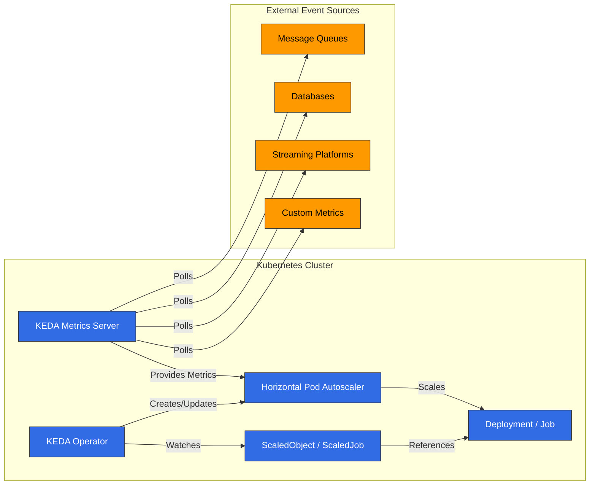

# KEDA (Kubernetes Event-driven Autoscaling)

## Table of Contents
- [Introduction](#introduction)
- [Architecture](#architecture)
- [Installation and Configuration](#installation-and-configuration)
- [Scalers](#scalers)
- [Custom Metric Scaling](#custom-metric-scaling)
- [Twitter Metric Scaling](#twitter-metric-scaling)
- [Google Calendar Scaling](#google-calendar-scaling)
- [Istio Metric Scaling](#istio-metric-scaling)
- [Cron-based Scaling](#cron-based-scaling)
- [Integration with Amazon EKS](#integration-with-amazon-eks)
- [Best Practices](#best-practices)
- [Troubleshooting](#troubleshooting)
- [Conclusion](#conclusion)

## Introduction

KEDA (Kubernetes Event-driven Autoscaling) は、Kubernetes アプリケーション向けにイベント駆動型の autoscaling を可能にするオープンソースプロジェクトです。KEDA は Kubernetes ネイティブの Horizontal Pod Autoscaler (HPA) を拡張し、CPU や memory 使用量だけでなく、さまざまなイベントソースや metrics に基づいて workload をスケーリングできるようにします。

### Key Benefits of KEDA

1. **Event-driven Scaling**: message queues、databases、streams など、さまざまなイベントソースに基づく scaling
2. **Zero Scaling**: アクティビティがない場合に replicas を 0 までスケールダウンしてコストを削減
3. **Diverse Scaler Support**: 50 を超える組み込み scalers と custom scaler のサポート
4. **Kubernetes Native**: 既存の Kubernetes HPA との統合
5. **Cloud Neutral**: 任意の Kubernetes 環境で動作
6. **Simple Deployment Model**: 単一の operator による簡単な deployment

### Comparison with Existing Scaling Methods

| Feature | KEDA | Kubernetes HPA | Cloud Provider Autoscaler |
|---------|------|----------------|---------------------------|
| Metric Sources | 50+ scalers | CPU, Memory, Custom metrics | Limited metrics |
| Zero Scaling | ✅ | ❌ | Partial support |
| Event-driven | ✅ | ❌ | Partial support |
| Cloud Neutral | ✅ | ✅ | ❌ |
| Deployment Complexity | Low | Very Low | Medium |
| Custom Metrics | Easy | Complex | Limited |

## Architecture

KEDA は Kubernetes operator パターンに基づいており、外部 metric sources を監視し、Kubernetes HPA を自動的に管理します。




### Key Components

1. **KEDA Operator**: ScaledObject と ScaledJob resources を監視し、HPA を管理します
2. **KEDA Metrics Server**: 外部 metric sources から metrics を収集し、Kubernetes API に公開します
3. **ScaledObject**: Deployments、StatefulSets などの scaling configuration を定義します
4. **ScaledJob**: Kubernetes Jobs の scaling configuration を定義します
5. **Triggers/Scalers**: さまざまなイベントソースに対する scaling logic を実装します

### How It Works

1. ユーザーが ScaledObject または ScaledJob を作成し、scaling targets と triggers を定義します
2. KEDA Operator がこれを検出し、対応する HPA を作成します
3. KEDA Metrics Server が外部 metric sources をポーリングして metrics を収集します
4. HPA が metrics server から提供される metrics に基づいて workloads をスケーリングします
5. アクティビティがない場合、KEDA は replicas を 0 までスケールダウンします（これは HPA ではできません）

## Installation and Configuration

### Prerequisites

- Kubernetes cluster (v1.16 以上)
- kubectl configured
- Helm (任意)

### Installation Methods

#### 1. Installation Using Helm

```bash
# Add Helm repository
helm repo add kedacore https://kedacore.github.io/charts

# Update Helm repository
helm repo update

# Install KEDA
helm install keda kedacore/keda --namespace keda --create-namespace
```

#### 2. Installation Using YAML Manifests

```bash
# Download latest KEDA release
kubectl apply -f https://github.com/kedacore/keda/releases/download/v2.10.1/keda-2.10.1.yaml
```

#### 3. Verify Installation

```bash
kubectl get pods -n keda
```

期待される出力:
```
NAME                                      READY   STATUS    RESTARTS   AGE
keda-operator-5c6d85d76c-vr4fj            1/1     Running   0          1m
keda-operator-metrics-apiserver-65f8f8d4d8-9mzrk   1/1     Running   0          1m
```

### Basic Configuration

KEDA はデフォルトで最小限の configuration で動作しますが、必要に応じてさまざまな設定を調整できます。

#### Custom Configuration Using Helm Values File

```yaml
# values.yaml
operator:
  replicaCount: 2
  resources:
    limits:
      cpu: 100m
      memory: 128Mi
    requests:
      cpu: 50m
      memory: 64Mi

metricsServer:
  replicaCount: 2
  resources:
    limits:
      cpu: 100m
      memory: 128Mi
    requests:
      cpu: 50m
      memory: 64Mi

logging:
  operator:
    level: info
  metricServer:
    level: info
```

```bash
helm install keda kedacore/keda --namespace keda --create-namespace -f values.yaml
```

## Scalers

KEDA はさまざまなイベントソース向けの scalers を提供します。各 scaler は特定のイベントソースから metrics を収集し、それに基づいて workloads をスケーリングします。

### Major Scalers

KEDA は 50 を超える scalers をサポートしており、主なものには次があります:

1. **Message Queues**:
   - Apache Kafka
   - RabbitMQ
   - AWS SQS
   - Azure Service Bus
   - Google Cloud Pub/Sub

2. **Databases**:
   - MySQL
   - PostgreSQL
   - MongoDB
   - Redis

3. **Streaming Platforms**:
   - Apache Kafka
   - AWS Kinesis
   - Azure Event Hubs

4. **Cloud Services**:
   - AWS CloudWatch
   - Azure Monitor
   - Google Cloud Monitoring

5. **Others**:
   - Prometheus
   - InfluxDB
   - Cron
   - CPU/Memory

### Basic ScaledObject Example

```yaml
apiVersion: keda.sh/v1alpha1
kind: ScaledObject
metadata:
  name: rabbitmq-scaledobject
  namespace: default
spec:
  scaleTargetRef:
    apiVersion: apps/v1
    kind: Deployment
    name: rabbitmq-consumer
  pollingInterval: 15
  cooldownPeriod: 30
  minReplicaCount: 0
  maxReplicaCount: 30
  triggers:
  - type: rabbitmq
    metadata:
      protocol: amqp
      queueName: hello
      host: rabbitmq
      queueLength: "5"
```

### Basic ScaledJob Example

```yaml
apiVersion: keda.sh/v1alpha1
kind: ScaledJob
metadata:
  name: rabbitmq-scaledjob
  namespace: default
spec:
  jobTargetRef:
    template:
      spec:
        containers:
        - name: rabbitmq-worker
          image: rabbitmq-worker:latest
          imagePullPolicy: Always
  pollingInterval: 15
  maxReplicaCount: 30
  successfulJobsHistoryLimit: 5
  failedJobsHistoryLimit: 5
  triggers:
  - type: rabbitmq
    metadata:
      protocol: amqp
      queueName: hello
      host: rabbitmq
      queueLength: "5"
```
## Custom Metric Scaling

KEDA は、さまざまな組み込み scalers に加えて、custom metrics に基づいてスケーリングする柔軟性を提供します。これにより、ビジネス要件に合わせた独自の scaling logic を実装できます。

### Using External Metrics API

Prometheus のような外部 metric sources を使用して、custom metric ベースの scaling を実装できます:

```yaml
apiVersion: keda.sh/v1alpha1
kind: ScaledObject
metadata:
  name: custom-metrics-scaler
  namespace: default
spec:
  scaleTargetRef:
    apiVersion: apps/v1
    kind: Deployment
    name: my-app
  minReplicaCount: 1
  maxReplicaCount: 10
  triggers:
  - type: prometheus
    metadata:
      serverAddress: http://prometheus-server.monitoring.svc.cluster.local
      metricName: custom_metric_total
      threshold: "100"
      query: sum(custom_metric_total{namespace="default",pod=~"my-app-.*"})
```

### Using HTTP Scaler

HTTP endpoint から metrics を取得して scaling に利用できます:

```yaml
apiVersion: keda.sh/v1alpha1
kind: ScaledObject
metadata:
  name: http-scaler
  namespace: default
spec:
  scaleTargetRef:
    apiVersion: apps/v1
    kind: Deployment
    name: my-app
  minReplicaCount: 1
  maxReplicaCount: 10
  triggers:
  - type: metrics-api
    metadata:
      targetValue: "100"
      url: "http://api.example.com/metrics"
      valueLocation: "value"
      method: "GET"
```

### Developing Custom Scalers

独自の scaler を開発して KEDA と統合できます。これには External Metrics API を実装する service の開発が必要です:

1. Metrics Server の実装:

```go
package main

import (
    "net/http"
    "encoding/json"

    "k8s.io/apimachinery/pkg/api/resource"
    metav1 "k8s.io/apimachinery/pkg/apis/meta/v1"
    "k8s.io/metrics/pkg/apis/external_metrics"
)

func metricsHandler(w http.ResponseWriter, r *http.Request) {
    // Calculate metric value with custom logic
    metricValue := calculateMetricValue()

    metric := external_metrics.ExternalMetricValue{
        TypeMeta: metav1.TypeMeta{
            Kind:       "ExternalMetricValue",
            APIVersion: "external.metrics.k8s.io/v1beta1",
        },
        MetricName: "custom_metric",
        Value:      *resource.NewQuantity(metricValue, resource.DecimalSI),
        Timestamp:  metav1.Now(),
    }

    metricList := external_metrics.ExternalMetricValueList{
        Items: []external_metrics.ExternalMetricValue{metric},
    }

    json.NewEncoder(w).Encode(metricList)
}

func main() {
    http.HandleFunc("/metrics", metricsHandler)
    http.ListenAndServe(":8080", nil)
}
```

2. KEDA との統合:

```yaml
apiVersion: keda.sh/v1alpha1
kind: ScaledObject
metadata:
  name: custom-scaler
  namespace: default
spec:
  scaleTargetRef:
    apiVersion: apps/v1
    kind: Deployment
    name: my-app
  minReplicaCount: 1
  maxReplicaCount: 10
  triggers:
  - type: metrics-api
    metadata:
      targetValue: "100"
      url: "http://custom-metrics-server:8080/metrics"
      valueLocation: "items.0.value"
```

## Twitter Metric Scaling

この例では、Twitter API を使用して特定の hashtags や keywords の mentions 頻度に基づき、applications をスケーリングする方法を示します。

### Prerequisites

- Twitter API keys と access tokens
- metrics を収集して公開する service

### Implementation Steps

1. Twitter Metrics Collector Service を実装します:

```python
import os
import time
import tweepy
from flask import Flask, jsonify

app = Flask(__name__)

# Twitter API credentials
consumer_key = os.environ.get("TWITTER_CONSUMER_KEY")
consumer_secret = os.environ.get("TWITTER_CONSUMER_SECRET")
access_token = os.environ.get("TWITTER_ACCESS_TOKEN")
access_token_secret = os.environ.get("TWITTER_ACCESS_TOKEN_SECRET")

# Tweepy authentication
auth = tweepy.OAuthHandler(consumer_key, consumer_secret)
auth.set_access_token(access_token, access_token_secret)
api = tweepy.API(auth)

# Metrics storage
metrics = {
    "tweet_count": 0,
    "last_updated": 0
}

# Background tweet collection
def collect_tweets():
    while True:
        try:
            # Search for specific hashtag
            tweets = api.search_tweets(q="#kubernetes", count=100)
            metrics["tweet_count"] = len(tweets)
            metrics["last_updated"] = time.time()
        except Exception as e:
            print(f"Error collecting tweets: {e}")

        # Update every 15 minutes (considering Twitter API limits)
        time.sleep(900)

# Metrics endpoint
@app.route("/metrics", methods=["GET"])
def get_metrics():
    return jsonify({
        "tweet_count": metrics["tweet_count"]
    })

if __name__ == "__main__":
    import threading
    # Start background tweet collection
    thread = threading.Thread(target=collect_tweets)
    thread.daemon = True
    thread.start()

    # Start API server
    app.run(host="0.0.0.0", port=8080)
```

2. Metrics Collector Service をデプロイします:

```yaml
apiVersion: apps/v1
kind: Deployment
metadata:
  name: twitter-metrics-collector
  namespace: default
spec:
  replicas: 1
  selector:
    matchLabels:
      app: twitter-metrics-collector
  template:
    metadata:
      labels:
        app: twitter-metrics-collector
    spec:
      containers:
      - name: collector
        image: twitter-metrics-collector:latest
        ports:
        - containerPort: 8080
        env:
        - name: TWITTER_CONSUMER_KEY
          valueFrom:
            secretKeyRef:
              name: twitter-api-secrets
              key: consumer-key
        - name: TWITTER_CONSUMER_SECRET
          valueFrom:
            secretKeyRef:
              name: twitter-api-secrets
              key: consumer-secret
        - name: TWITTER_ACCESS_TOKEN
          valueFrom:
            secretKeyRef:
              name: twitter-api-secrets
              key: access-token
        - name: TWITTER_ACCESS_TOKEN_SECRET
          valueFrom:
            secretKeyRef:
              name: twitter-api-secrets
              key: access-token-secret
---
apiVersion: v1
kind: Service
metadata:
  name: twitter-metrics-collector
  namespace: default
spec:
  selector:
    app: twitter-metrics-collector
  ports:
  - port: 80
    targetPort: 8080
```

3. KEDA ScaledObject を設定します:

```yaml
apiVersion: keda.sh/v1alpha1
kind: ScaledObject
metadata:
  name: twitter-scaler
  namespace: default
spec:
  scaleTargetRef:
    apiVersion: apps/v1
    kind: Deployment
    name: twitter-processor
  minReplicaCount: 1
  maxReplicaCount: 20
  pollingInterval: 15
  cooldownPeriod: 30
  triggers:
  - type: metrics-api
    metadata:
      targetValue: "10"
      url: "http://twitter-metrics-collector/metrics"
      valueLocation: "tweet_count"
```

## Google Calendar Scaling

この例では、Google Calendar API を使用してスケジュールされた events に基づき、applications をスケーリングする方法を示します。

### Prerequisites

- Google Calendar API credentials
- metrics を収集して公開する service

### Implementation Steps

1. Google Calendar Metrics Collector Service を実装します:

```python
import os
import time
import datetime
from flask import Flask, jsonify
from google.oauth2 import service_account
from googleapiclient.discovery import build

app = Flask(__name__)

# Google Calendar API credentials
SCOPES = ['https://www.googleapis.com/auth/calendar.readonly']
SERVICE_ACCOUNT_FILE = '/etc/secrets/service-account.json'
CALENDAR_ID = os.environ.get("CALENDAR_ID")

# Metrics storage
metrics = {
    "upcoming_events": 0,
    "last_updated": 0
}

# Create Google Calendar API client
def create_calendar_client():
    credentials = service_account.Credentials.from_service_account_file(
        SERVICE_ACCOUNT_FILE, scopes=SCOPES)
    return build('calendar', 'v3', credentials=credentials)

# Background event collection
def collect_events():
    while True:
        try:
            service = create_calendar_client()

            # Current time
            now = datetime.datetime.utcnow()
            # 1 hour later
            one_hour_later = now + datetime.timedelta(hours=1)

            # Query events within the next hour
            events_result = service.events().list(
                calendarId=CALENDAR_ID,
                timeMin=now.isoformat() + 'Z',
                timeMax=one_hour_later.isoformat() + 'Z',
                singleEvents=True,
                orderBy='startTime'
            ).execute()

            events = events_result.get('items', [])
            metrics["upcoming_events"] = len(events)
            metrics["last_updated"] = time.time()
        except Exception as e:
            print(f"Error collecting events: {e}")

        # Update every 5 minutes
        time.sleep(300)

# Metrics endpoint
@app.route("/metrics", methods=["GET"])
def get_metrics():
    return jsonify({
        "upcoming_events": metrics["upcoming_events"]
    })

if __name__ == "__main__":
    import threading
    # Start background event collection
    thread = threading.Thread(target=collect_events)
    thread.daemon = True
    thread.start()

    # Start API server
    app.run(host="0.0.0.0", port=8080)
```

2. Metrics Collector Service をデプロイします:

```yaml
apiVersion: v1
kind: Secret
metadata:
  name: google-calendar-secrets
  namespace: default
type: Opaque
data:
  service-account.json: <BASE64_ENCODED_SERVICE_ACCOUNT_JSON>
---
apiVersion: apps/v1
kind: Deployment
metadata:
  name: calendar-metrics-collector
  namespace: default
spec:
  replicas: 1
  selector:
    matchLabels:
      app: calendar-metrics-collector
  template:
    metadata:
      labels:
        app: calendar-metrics-collector
    spec:
      containers:
      - name: collector
        image: calendar-metrics-collector:latest
        ports:
        - containerPort: 8080
        env:
        - name: CALENDAR_ID
          value: "primary"
        volumeMounts:
        - name: google-calendar-credentials
          mountPath: "/etc/secrets"
          readOnly: true
      volumes:
      - name: google-calendar-credentials
        secret:
          secretName: google-calendar-secrets
---
apiVersion: v1
kind: Service
metadata:
  name: calendar-metrics-collector
  namespace: default
spec:
  selector:
    app: calendar-metrics-collector
  ports:
  - port: 80
    targetPort: 8080
```

3. KEDA ScaledObject を設定します:

```yaml
apiVersion: keda.sh/v1alpha1
kind: ScaledObject
metadata:
  name: calendar-scaler
  namespace: default
spec:
  scaleTargetRef:
    apiVersion: apps/v1
    kind: Deployment
    name: calendar-processor
  minReplicaCount: 1
  maxReplicaCount: 10
  pollingInterval: 15
  cooldownPeriod: 30
  triggers:
  - type: metrics-api
    metadata:
      targetValue: "1"
      url: "http://calendar-metrics-collector/metrics"
      valueLocation: "upcoming_events"
```
## Istio Metric Scaling

この例では、Istio service mesh から収集された metrics に基づいて applications をスケーリングする方法を示します。ここでは、requests per second (RPS) に基づく scaling を見ていきます。

### Prerequisites

- Istio service mesh installed
- Prometheus installed and integrated with Istio

### Implementation Steps

1. Istio Service Mesh をセットアップします:

```bash
# Install Istio
istioctl install --set profile=default -y

# Enable Istio sidecar injection on namespace
kubectl label namespace default istio-injection=enabled
```

2. Sample Application をデプロイします:

```yaml
apiVersion: apps/v1
kind: Deployment
metadata:
  name: sample-app
  namespace: default
spec:
  replicas: 1
  selector:
    matchLabels:
      app: sample-app
  template:
    metadata:
      labels:
        app: sample-app
    spec:
      containers:
      - name: sample-app
        image: nginx:latest
        ports:
        - containerPort: 80
---
apiVersion: v1
kind: Service
metadata:
  name: sample-app
  namespace: default
spec:
  selector:
    app: sample-app
  ports:
  - port: 80
    targetPort: 80
---
apiVersion: networking.istio.io/v1alpha3
kind: VirtualService
metadata:
  name: sample-app
  namespace: default
spec:
  hosts:
  - "*"
  gateways:
  - istio-system/ingressgateway
  http:
  - route:
    - destination:
        host: sample-app
        port:
          number: 80
```

3. KEDA ScaledObject を設定します:

```yaml
apiVersion: keda.sh/v1alpha1
kind: ScaledObject
metadata:
  name: istio-scaler
  namespace: default
spec:
  scaleTargetRef:
    apiVersion: apps/v1
    kind: Deployment
    name: sample-app
  minReplicaCount: 1
  maxReplicaCount: 10
  pollingInterval: 15
  cooldownPeriod: 30
  triggers:
  - type: prometheus
    metadata:
      serverAddress: http://prometheus.istio-system:9090
      metricName: istio_requests_per_second
      threshold: "10"
      query: sum(rate(istio_requests_total{destination_service="sample-app.default.svc.cluster.local"}[1m]))
```

この configuration は、Istio から収集された requests per second に基づいて `sample-app` Deployment をスケーリングします。requests per second が 10 を超えると、KEDA は replicas を追加し、request count が減少すると replicas を減らします。

### Advanced Configuration

より複雑なシナリオでは、特定の paths や HTTP methods の request counts に基づいてスケーリングできます:

```yaml
apiVersion: keda.sh/v1alpha1
kind: ScaledObject
metadata:
  name: istio-path-scaler
  namespace: default
spec:
  scaleTargetRef:
    apiVersion: apps/v1
    kind: Deployment
    name: sample-app
  minReplicaCount: 1
  maxReplicaCount: 10
  pollingInterval: 15
  cooldownPeriod: 30
  triggers:
  - type: prometheus
    metadata:
      serverAddress: http://prometheus.istio-system:9090
      metricName: istio_requests_per_second_path
      threshold: "5"
      query: sum(rate(istio_requests_total{destination_service="sample-app.default.svc.cluster.local",request_path="/api/v1/products"}[1m]))
```

error rate や latency など、他の Istio metrics に基づいてスケーリングすることもできます:

```yaml
# Error rate based scaling
apiVersion: keda.sh/v1alpha1
kind: ScaledObject
metadata:
  name: istio-error-scaler
  namespace: default
spec:
  scaleTargetRef:
    apiVersion: apps/v1
    kind: Deployment
    name: sample-app
  minReplicaCount: 1
  maxReplicaCount: 10
  pollingInterval: 15
  cooldownPeriod: 30
  triggers:
  - type: prometheus
    metadata:
      serverAddress: http://prometheus.istio-system:9090
      metricName: istio_error_rate
      threshold: "0.05"
      query: sum(rate(istio_requests_total{destination_service="sample-app.default.svc.cluster.local",response_code=~"5.*"}[1m])) / sum(rate(istio_requests_total{destination_service="sample-app.default.svc.cluster.local"}[1m]))
```

## Cron-based Scaling

KEDA は Cron expressions を使用した time-based scaling をサポートします。これにより、予測可能な traffic patterns や schedules に合わせて applications を事前にスケーリングできます。

### Basic Cron Scaler

```yaml
apiVersion: keda.sh/v1alpha1
kind: ScaledObject
metadata:
  name: cron-scaler
  namespace: default
spec:
  scaleTargetRef:
    apiVersion: apps/v1
    kind: Deployment
    name: sample-app
  minReplicaCount: 0
  maxReplicaCount: 10
  pollingInterval: 15
  cooldownPeriod: 30
  triggers:
  - type: cron
    metadata:
      timezone: Asia/Seoul
      start: 30 * * * *
      end: 45 * * * *
      desiredReplicas: "5"
```

この configuration は、毎時 30 分に `sample-app` Deployment を 5 replicas までスケールアップし、45 分にスケールダウンします。

### Multi-timezone Scaling

複数の Cron triggers を使用して、さまざまな時間に異なる scaling behaviors を設定できます:

```yaml
apiVersion: keda.sh/v1alpha1
kind: ScaledObject
metadata:
  name: multi-cron-scaler
  namespace: default
spec:
  scaleTargetRef:
    apiVersion: apps/v1
    kind: Deployment
    name: sample-app
  minReplicaCount: 1
  maxReplicaCount: 10
  pollingInterval: 15
  cooldownPeriod: 30
  triggers:
  # High replica count during business hours
  - type: cron
    metadata:
      timezone: Asia/Seoul
      start: 0 9 * * 1-5
      end: 0 18 * * 1-5
      desiredReplicas: "5"
  # Low replica count during nights and weekends
  - type: cron
    metadata:
      timezone: Asia/Seoul
      start: 0 18 * * 1-5
      end: 0 9 * * 1-5
      desiredReplicas: "2"
  # Low replica count on weekends
  - type: cron
    metadata:
      timezone: Asia/Seoul
      start: 0 0 * * 0,6
      end: 0 0 * * 1
      desiredReplicas: "2"
```

### Combining Cron with Other Scalers

Cron scalers を他の scalers と組み合わせて baseline scaling behavior を設定し、さらに実際の load に基づいてスケーリングできます:

```yaml
apiVersion: keda.sh/v1alpha1
kind: ScaledObject
metadata:
  name: combined-scaler
  namespace: default
spec:
  scaleTargetRef:
    apiVersion: apps/v1
    kind: Deployment
    name: sample-app
  minReplicaCount: 1
  maxReplicaCount: 20
  pollingInterval: 15
  cooldownPeriod: 30
  triggers:
  # Set baseline replica count during business hours
  - type: cron
    metadata:
      timezone: Asia/Seoul
      start: 0 9 * * 1-5
      end: 0 18 * * 1-5
      desiredReplicas: "5"
  # Additional scaling based on actual load
  - type: prometheus
    metadata:
      serverAddress: http://prometheus.monitoring.svc.cluster.local:9090
      metricName: http_requests_per_second
      threshold: "10"
      query: sum(rate(http_requests_total{app="sample-app"}[1m]))
```

## Integration with Amazon EKS

KEDA は Amazon EKS とシームレスに統合し、AWS service ベースの scaling を提供します。

### Installing KEDA on EKS

```bash
# Installation using Helm
helm repo add kedacore https://kedacore.github.io/charts
helm repo update
helm install keda kedacore/keda --namespace keda --create-namespace
```

### AWS Service-based Scaling

#### SQS Queue-based Scaling

```yaml
apiVersion: keda.sh/v1alpha1
kind: TriggerAuthentication
metadata:
  name: aws-credentials
  namespace: default
spec:
  podIdentity:
    provider: aws-eks
---
apiVersion: keda.sh/v1alpha1
kind: ScaledObject
metadata:
  name: aws-sqs-scaler
  namespace: default
spec:
  scaleTargetRef:
    apiVersion: apps/v1
    kind: Deployment
    name: sqs-consumer
  minReplicaCount: 0
  maxReplicaCount: 10
  pollingInterval: 15
  cooldownPeriod: 30
  triggers:
  - type: aws-sqs-queue
    metadata:
      queueURL: https://sqs.us-west-2.amazonaws.com/123456789012/my-queue
      queueLength: "5"
      awsRegion: "us-west-2"
    authenticationRef:
      name: aws-credentials
```

#### CloudWatch Metric-based Scaling

```yaml
apiVersion: keda.sh/v1alpha1
kind: TriggerAuthentication
metadata:
  name: aws-credentials
  namespace: default
spec:
  podIdentity:
    provider: aws-eks
---
apiVersion: keda.sh/v1alpha1
kind: ScaledObject
metadata:
  name: aws-cloudwatch-scaler
  namespace: default
spec:
  scaleTargetRef:
    apiVersion: apps/v1
    kind: Deployment
    name: cloudwatch-app
  minReplicaCount: 1
  maxReplicaCount: 10
  pollingInterval: 15
  cooldownPeriod: 30
  triggers:
  - type: aws-cloudwatch
    metadata:
      namespace: "AWS/SQS"
      dimensionName: "QueueName"
      dimensionValue: "my-queue"
      metricName: "ApproximateNumberOfMessages"
      targetValue: "5"
      minMetricValue: "0"
      awsRegion: "us-west-2"
    authenticationRef:
      name: aws-credentials
```

### IRSA (IAM Roles for Service Accounts) Integration

EKS で KEDA を使用する際、IRSA を活用して AWS services の permissions を管理できます:

```bash
# IRSA setup
eksctl create iamserviceaccount \
  --name keda-operator \
  --namespace keda \
  --cluster my-cluster \
  --attach-policy-arn arn:aws:iam::aws:policy/AmazonSQSReadOnlyAccess \
  --attach-policy-arn arn:aws:iam::aws:policy/CloudWatchReadOnlyAccess \
  --approve
```

```yaml
# Helm values file
serviceAccount:
  annotations:
    eks.amazonaws.com/role-arn: arn:aws:iam::123456789012:role/keda-operator-role
```

## Best Practices

### Performance Optimization

1. **Set Appropriate Polling Intervals**: workload の特性に合った polling intervals を設定します
2. **Optimize Cooldown Periods**: 不要な scaling oscillation を防ぎます
3. **Set Resource Requests and Limits**: KEDA components に適切な resources を割り当てます
4. **Write Efficient Queries**: metric queries を最適化します

```yaml
apiVersion: keda.sh/v1alpha1
kind: ScaledObject
metadata:
  name: optimized-scaler
spec:
  pollingInterval: 30  # Poll every 30 seconds (default: 30)
  cooldownPeriod: 300  # 5-minute cooldown period (default: 300)
  # Other configuration...
```

### Improving Reliability

1. **Use Multiple Triggers**: 複数の metric sources に基づいてスケーリングします
2. **Set Appropriate Min and Max Replicas**: workload の要件に合った範囲を設定します
3. **Failure Handling Strategy**: metric source failures に対する response plans を準備します
4. **Set Up Monitoring and Alerts**: KEDA operational status を監視します

```yaml
apiVersion: keda.sh/v1alpha1
kind: ScaledObject
metadata:
  name: reliable-scaler
spec:
  minReplicaCount: 2  # Maintain minimum 2 replicas
  maxReplicaCount: 20  # Limit to maximum 20 replicas
  fallback:
    failureThreshold: 3  # Apply fallback behavior after 3 failures
    replicas: 5  # Set to 5 replicas on metric source failure
  # Other configuration...
```

### Security Hardening

1. **Apply Least Privilege Principle**: 必要な permissions のみを付与します
2. **Secret Management**: sensitive information を安全に管理します
3. **Apply Network Policies**: KEDA components への access を制限します
4. **Configure RBAC**: 適切な role-based access control を設定します

```yaml
apiVersion: keda.sh/v1alpha1
kind: TriggerAuthentication
metadata:
  name: secure-auth
spec:
  secretTargetRef:
  - parameter: connectionString
    name: db-secret
    key: connection-string
---
apiVersion: networking.k8s.io/v1
kind: NetworkPolicy
metadata:
  name: keda-network-policy
  namespace: keda
spec:
  podSelector:
    matchLabels:
      app.kubernetes.io/name: keda-operator
  ingress:
  - from:
    - namespaceSelector:
        matchLabels:
          kubernetes.io/metadata.name: kube-system
  egress:
  - {}
```

## Troubleshooting

### Common Issues

#### 1. Scaling Not Working

**Symptom**: metrics が threshold を超えても Pods がスケーリングしない

**Solution**:
- KEDA logs を確認します
- metric source connectivity を検証します
- authentication configuration を検証します

```bash
# Check KEDA operator logs
kubectl logs -n keda -l app=keda-operator

# Check KEDA metrics server logs
kubectl logs -n keda -l app=keda-metrics-apiserver

# Check ScaledObject status
kubectl get scaledobject -n <namespace> <name> -o yaml
```

#### 2. Zero Scaling Issues

**Symptom**: アクティビティがない場合でも 0 までスケールダウンしない

**Solution**:
- minReplicaCount setting を確認します
- metric values を検証します
- HPA status を確認します

```bash
# Check HPA status
kubectl get hpa -n <namespace>

# Check metric values directly
kubectl get --raw "/apis/external.metrics.k8s.io/v1beta1/namespaces/<namespace>/<metric-name>" | jq
```

#### 3. Authentication Issues

**Symptom**: metric source に接続できない

**Solution**:
- TriggerAuthentication configuration を検証します
- secrets または environment variables を確認します
- permissions を検証します

```bash
# Check TriggerAuthentication
kubectl get triggerauthentication -n <namespace> <name> -o yaml

# Check secrets
kubectl get secret -n <namespace> <name> -o yaml
```

### Debugging Tools

```bash
# Check KEDA version
kubectl get deployment -n keda keda-operator -o jsonpath="{.spec.template.spec.containers[0].image}"

# Check ScaledObject status
kubectl describe scaledobject -n <namespace> <name>

# Check HPA status
kubectl describe hpa -n <namespace> <name>

# Check metric values
kubectl get --raw "/apis/external.metrics.k8s.io/v1beta1/namespaces/<namespace>/<metric-name>"

# Check KEDA logs
kubectl logs -n keda -l app=keda-operator --tail=100
```

## Conclusion

KEDA (Kubernetes Event-driven Autoscaling) は、Kubernetes 環境で event-driven autoscaling を提供する強力な tool です。基本的な Kubernetes HPA を拡張し、さまざまな event sources や metrics に基づく workload scaling を可能にします。

この document では、KEDA の基本概念、installation methods、さまざまな scaler usage、custom metric scaling、Twitter や Google Calendar などの external services との integration、Istio metric-based scaling、Cron-based scaling、Amazon EKS との integration、best practices、troubleshooting について説明しました。

KEDA を使用することで、applications をより効率的にスケーリングし、resource usage を最適化して、costs を削減できます。event-driven architectures や serverless patterns を実装する場合に特に有用です。

### Next Steps

- KEDA を使用して serverless architectures を実装する
- さまざまな event sources との integration を検討する
- custom scalers を開発する
- multi-cluster environments で KEDA を活用する
- KEDA を他の cloud-native tools と統合する

## References

- [KEDA Official Documentation](https://keda.sh/docs/)
- [KEDA GitHub Repository](https://github.com/kedacore/keda)
- [KEDA Scaler List](https://keda.sh/docs/latest/scalers/)
- [KEDA Operator Hub](https://operatorhub.io/operator/keda)
- [AWS EKS Workshop - KEDA](https://www.eksworkshop.com/advanced/autoscaling/keda/)

## Quiz

この章で学んだ内容を確認するには、[topic quiz](../quizzes/autoscaling/05-keda-quiz.md) に挑戦してください。
