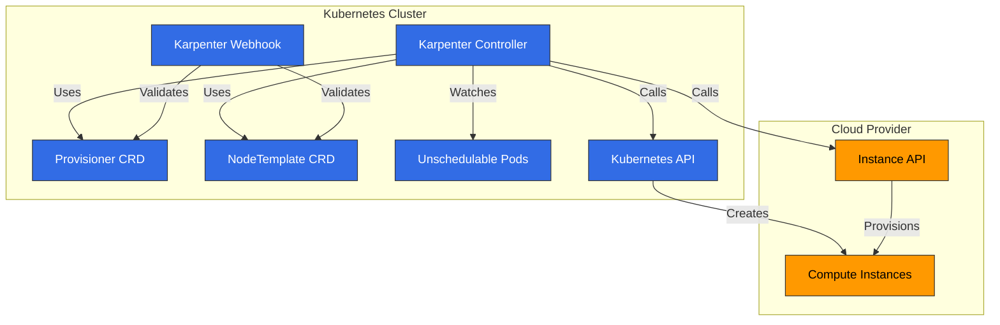
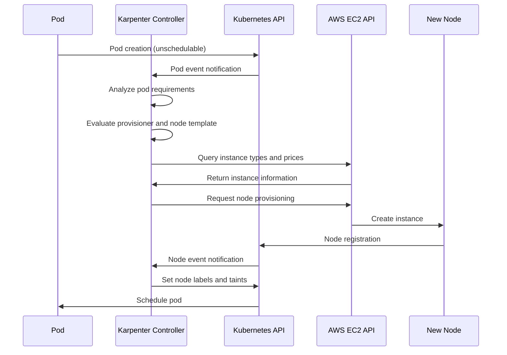
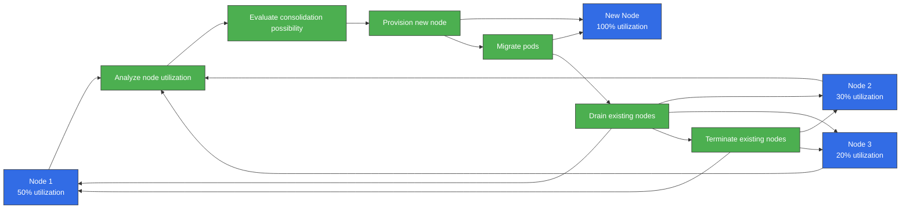
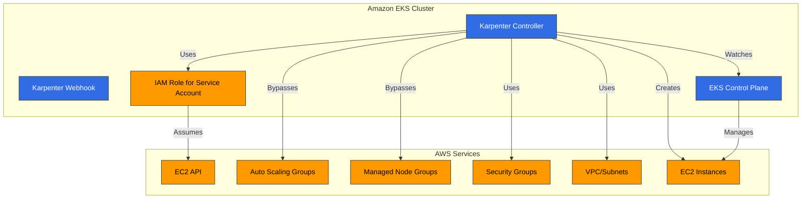

# Karpenter

> **対応バージョン**: Karpenter 1.6 - 1.14, Kubernetes 1.29+ (v1.14 時点)
> **最終更新**: July 21, 2026

## 目次
- [概要](#introduction)
- [アーキテクチャ](#architecture)
- [インストールと設定](#installation-and-configuration)
- [Provisioner](#provisioner)
- [Node Template](#node-templates)
- [中断処理](#interruption-handling)
- [統合](#integration)
- [Amazon EKS との統合](#integration-with-amazon-eks)
- [ベストプラクティス](#best-practices)
- [トラブルシューティング](#troubleshooting)
- [まとめ](#conclusion)

## 概要

Karpenter は、Kubernetes クラスターの Node プロビジョニングを自動化するオープンソースのクラスターオートスケーラーです。Karpenter はワークロード要件に基づいて適切なコンピューティングリソースを動的にプロビジョニングし、アプリケーションの可用性を確保するとともに、クラスター効率を最適化します。

### Karpenter の主な利点

1. **高速スケーリング**: ワークロード要件に基づき数秒以内に Node をプロビジョニング
2. **コスト最適化**: ワークロードに最も適したインスタンスタイプを選択
3. **シンプルな設定**: 宣言的 API による容易な設定
4. **ワークロード中心の設計**: Pod 要件に基づく Node プロビジョニング
5. **クラウド統合**: クラウドプロバイダーの機能を活用
6. **効率的な Bin Packing**: リソース使用率を最適化
7. **柔軟な Node 管理**: Node ライフサイクル管理と統合された中断処理

### 既存のオートスケーラーとの比較

| 機能 | Karpenter | Cluster Autoscaler | クラウドプロバイダー管理 Node Group |
|---------|-----------|-------------------|---------------------------|
| スケーリング速度 | 非常に高速（秒） | 中程度（分） | 低速（分） |
| インスタンスタイプの選択 | 動的 | Node Group ベース | Node Group ベース |
| Bin Packing 効率 | 高 | 中 | 低 |
| 設定の複雑さ | 低 | 中 | 低 |
| クラウド統合 | ネイティブ | 限定的 | ネイティブ |
| Node Group 管理 | 不要 | 必要 | 必要 |
| 中断処理 | 統合済み | 限定的 | 限定的 |

> **注**: Karpenter ではなく従来の EKS Managed Node Group と Cluster Autoscaler を使用し続ける場合、EC2 Auto Scaling Warm Pool（2026 年 4 月から利用可能）により、コールドスタートなしのスケールアウトに備えて初期化済みインスタンスを待機させておけます。Stopped 状態（低コスト）または Running 状態（より高速な移行）を選択でき、Cluster Autoscaler と自動的に統合されます。ただし、これは Managed Node Group の機能であり、Karpenter が使用するものではありません。

## アーキテクチャ

Karpenter は Kubernetes controller として動作し、スケジュール不能な Pod を検出して適切な Node をプロビジョニングします。



### Karpenter のワークフロー

次の図は、EKS クラスターで Karpenter がどのように動作するかを示しています。



### 主なコンポーネント

1. **Karpenter Controller**: スケジュール不能な Pod を検出し、Node プロビジョニングを管理
2. **Karpenter Webhook**: Karpenter リソースを検証
3. **Provisioner CRD**: Node プロビジョニングポリシーを定義
4. **NodeTemplate CRD**: プロビジョニングする Node の設定を定義
5. **Cloud Provider Integration**: クラウドプロバイダー API と統合し、コンピューティングリソースを管理

### 動作の仕組み

1. Karpenter Controller がスケジュール不能な Pod を検出します
2. Pod 要件（リソース、Node Selector、Toleration など）を分析します
3. Provisioner と Node Template の設定に基づいて適切な Node タイプを決定します
4. クラウドプロバイダー API を呼び出して Node をプロビジョニングします
5. Node がクラスターに参加すると Pod をスケジュールします
6. 不要になった Node は、統合された中断処理によって削除します

## インストールと設定

### 前提条件

- Kubernetes クラスター（v1.19 以降）
- kubectl の設定済み
- クラウドプロバイダーの認証情報とアクセス許可
- Helm（任意）

### AWS EKS へのインストール

#### 1. IAM Role と Policy の設定

```bash
# IRSA setup using eksctl
eksctl create iamserviceaccount \
  --cluster=my-cluster \
  --name=karpenter \
  --namespace=karpenter \
  --attach-policy-arn=arn:aws:iam::aws:policy/AmazonEKSClusterPolicy \
  --attach-policy-arn=arn:aws:iam::aws:policy/AmazonEC2ContainerRegistryReadOnly \
  --approve

# Create instance profile
aws iam create-instance-profile --instance-profile-name KarpenterNodeInstanceProfile

# Create node role
aws iam create-role --role-name KarpenterNodeRole --assume-role-policy-document file://node-trust-policy.json

# Attach policies to node role
aws iam attach-role-policy --role-name KarpenterNodeRole --policy-arn arn:aws:iam::aws:policy/AmazonEKSWorkerNodePolicy
aws iam attach-role-policy --role-name KarpenterNodeRole --policy-arn arn:aws:iam::aws:policy/AmazonEKS_CNI_Policy
aws iam attach-role-policy --role-name KarpenterNodeRole --policy-arn arn:aws:iam::aws:policy/AmazonEC2ContainerRegistryReadOnly
aws iam attach-role-policy --role-name KarpenterNodeRole --policy-arn arn:aws:iam::aws:policy/AmazonSSMManagedInstanceCore

# Add role to instance profile
aws iam add-role-to-instance-profile --instance-profile-name KarpenterNodeInstanceProfile --role-name KarpenterNodeRole
```

#### 2. Helm を使用したインストール

```bash
# Add Helm repository
helm repo add karpenter https://charts.karpenter.sh
helm repo update

# Install Karpenter
helm install karpenter karpenter/karpenter \
  --namespace karpenter \
  --create-namespace \
  --set serviceAccount.annotations."eks\.amazonaws\.com/role-arn"=arn:aws:iam::${ACCOUNT_ID}:role/KarpenterControllerRole \
  --set clusterName=${CLUSTER_NAME} \
  --set clusterEndpoint=${CLUSTER_ENDPOINT} \
  --set aws.defaultInstanceProfile=KarpenterNodeInstanceProfile
```

#### 3. インストールの確認

```bash
kubectl get pods -n karpenter
```

想定される出力:
```
NAME                         READY   STATUS    RESTARTS   AGE
karpenter-6f4f46d855-5lqx7   1/1     Running   0          1m
```

### 基本的な Provisioner 設定

```yaml
apiVersion: karpenter.sh/v1
kind: NodePool
metadata:
  name: default
spec:
  disruption:
    consolidationPolicy: WhenEmpty
    consolidateAfter: 30s
  limits:
    cpu: 1000
    memory: 1000Gi
  template:
    spec:
      requirements:
        - key: karpenter.sh/capacity-type
          operator: In
          values: ["on-demand"]
        - key: kubernetes.io/arch
          operator: In
          values: ["amd64"]
        - key: node.kubernetes.io/instance-type
          operator: In
          values: ["m5.large", "m5.xlarge", "m5.2xlarge"]
      nodeClassRef:
        group: karpenter.k8s.aws
        kind: EC2NodeClass
        name: default
---
apiVersion: karpenter.k8s.aws/v1
kind: EC2NodeClass
metadata:
  name: default
spec:
  subnetSelectorTerms:
    - tags:
        karpenter.sh/discovery: "true"
  securityGroupSelectorTerms:
    - tags:
        karpenter.sh/discovery: "true"
  tags:
    karpenter.sh/discovery: "true"
  blockDeviceMappings:
    - deviceName: /dev/xvda
      ebs:
        volumeSize: 100Gi
        volumeType: gp3
        deleteOnTermination: true
```

## NodePool

NodePool は、Karpenter が Node をプロビジョニングする方法を定義する Kubernetes カスタムリソースです。以前の Provisioner を置き換えます。

### 基本的な NodePool 設定

```yaml
apiVersion: karpenter.sh/v1
kind: NodePool
metadata:
  name: default
spec:
  # Node requirements
  template:
    spec:
      requirements:
        - key: karpenter.sh/capacity-type
          operator: In
          values: ["on-demand"]
        - key: kubernetes.io/arch
          operator: In
          values: ["amd64"]
        - key: node.kubernetes.io/instance-type
          operator: In
          values: ["m5.large", "m5.xlarge", "m5.2xlarge"]

  # Resource limits
  limits:
    cpu: 1000
    memory: 1000Gi

  # Node class reference
  template:
    spec:
      nodeClassRef:
        group: karpenter.k8s.aws
        kind: EC2NodeClass
        name: default

  # Node expiration settings
  disruption:
    consolidationPolicy: WhenEmpty
    consolidateAfter: 30s
    expireAfter: 720h  # 30 days

  # Taints and labels
  template:
    spec:
      taints:
        - key: example.com/special-taint
          value: "true"
          effect: NoSchedule
      labels:
        environment: production
        app: web

  # Startup template
  template:
    spec:
      startupTaints:
        - key: node.kubernetes.io/not-ready
          effect: NoSchedule
```

### Requirements の設定

Requirements は、Karpenter がプロビジョニングする Node の特性を定義します。

```yaml
template:
  spec:
    requirements:
      # Capacity type (on-demand or spot)
      - key: karpenter.sh/capacity-type
        operator: In
        values: ["on-demand", "spot"]

      # Architecture
      - key: kubernetes.io/arch
        operator: In
        values: ["amd64", "arm64"]

      # Instance types
      - key: node.kubernetes.io/instance-type
        operator: In
        values: ["m5.large", "m5.xlarge", "c5.large"]

      # Availability zones
      - key: topology.kubernetes.io/zone
        operator: In
        values: ["us-west-2a", "us-west-2b", "us-west-2c"]

      # Operating system
      - key: kubernetes.io/os
        operator: In
        values: ["linux"]
```

### Limits の設定

Limits は、Karpenter がプロビジョニングできるリソースの最大量を定義します。

```yaml
limits:
  cpu: 1000
  memory: 1000Gi
  nvidia.com/gpu: 10
```

### Dynamic Resource Allocation (DRA) サポート（v1.13）

Karpenter v1.13（2026 年 6 月リリース）以降、Karpenter は Kubernetes Dynamic Resource Allocation (DRA) に基づくデバイス割り当て追跡をサポートしています。Karpenter は GPU や特殊アクセラレーターなどの Claim ベースのリソースを認識し、プロビジョニングの判断に考慮できるようになりました。これにより、`nvidia.com/gpu` のような拡張リソースだけでなく、DRA `ResourceClaim`/`DeviceClass` オブジェクトを使用する AI/HPC ワークロードでも正確なスケーリングが可能になります。DRA ベースの追跡には Kubernetes 1.29 以降が必要です。

### Node 有効期限の設定

Node の有効期限設定は、Karpenter が Node を削除するタイミングを定義します。

```yaml
disruption:
  # Consolidate (remove) when node is empty
  consolidationPolicy: WhenEmpty

  # Time until consolidation (removal) after node becomes empty
  consolidateAfter: 30s

  # Maximum time before removing node after creation
  expireAfter: 720h  # 30 days
```

### NodeReadinessController による初期化 Taint の自動無視（v1.13）

Karpenter v1.13 で追加された NodeReadinessController は、不要なスケジューリングブロックを減らすため、Node の初期化中などに適用される readiness 関連の Taint を自動的に無視します。これにより、以前は `startupTaints` で手動対応が必要だった初期化遅延の問題が緩和され、新しい Node が Ready になる間のスケジューリングの安定性とプロビジョニングの信頼性が向上します。

### 2026 年 7 月の更新: v1.14 リリース

2026 年 7 月 11 日にリリースされた Karpenter v1.14 では、次の機能が導入されました。

- **CapacityBuffers API サポート**: 急激なスケールアウトのスパイクを吸収するための余剰キャパシティを宣言的に予約
- **プレビューインスタンスタイプのサポート**: まだ一般提供されていないインスタンスタイプもプロビジョニング対象として選択可能
- **Nitro Enclaves サポート**: Launch Template で `EnclaveOptions.Enabled` を設定可能。機密コンピューティングワークロードに有用
- バグ修正: セカンダリ ENI のプライマリ IP の考慮、Zonal Shift キャッシュの確実な hydrate、AWS SDK クライアントのタイムアウトの operator 設定への接続など

詳細については、[v1.14.0 リリースノート](https://github.com/aws/karpenter-provider-aws/releases/tag/v1.14.0)を参照してください。

続いて 2026 年 7 月 17 日には、保守対象のすべてのマイナーラインに対して、アップストリームの `sigs.k8s.io/karpenter` バージョンを更新する協調的なパッチリリース群（v1.3.8 から v1.11.3）が公開されました。古いラインを使用している場合は、そのラインの最新パッチへの更新を推奨します（[リリース一覧](https://github.com/aws/karpenter-provider-aws/releases)）。

## Node Class

Node Class は、Karpenter がプロビジョニングする Node の設定を定義します。AWS では、EC2NodeClass CRD を使用します。

### AWS EC2NodeClass の設定

```yaml
apiVersion: karpenter.k8s.aws/v1
kind: EC2NodeClass
metadata:
  name: default
spec:
  # Subnet selection
  subnetSelectorTerms:
    - tags:
        karpenter.sh/discovery: "true"

  # Security group selection
  securityGroupSelectorTerms:
    - tags:
        karpenter.sh/discovery: "true"

  # Instance tags
  tags:
    karpenter.sh/discovery: "true"
    environment: production

  # Block device mappings
  blockDeviceMappings:
    - deviceName: /dev/xvda
      ebs:
        volumeSize: 100Gi
        volumeType: gp3
        deleteOnTermination: true
        encrypted: true

  # Detailed instance configuration
  role: KarpenterNodeRole
  amiFamily: AL2
  userData: |
    #!/bin/bash
    echo "Hello from Karpenter node!"

  # Metadata options
  metadataOptions:
    httpEndpoint: enabled
    httpProtocolIPv6: disabled
    httpPutResponseHopLimit: 2
    httpTokens: required
```

### Subnet と Security Group の選択

Subnet と Security Group は Label Selector を使用して選択できます。

```yaml
# Subnet selection
subnetSelector:
  karpenter.sh/discovery: "true"
  Name: "private-*"

# Security group selection
securityGroupSelector:
  karpenter.sh/discovery: "true"
  aws:eks:cluster-name: "my-cluster"
```

### AMI の設定

Karpenter はさまざまな AMI Family をサポートしています。

```yaml
# Amazon Linux 2
amiFamily: AL2

# Bottlerocket
amiFamily: Bottlerocket

# Ubuntu
amiFamily: Ubuntu

# Custom AMI
amiSelector:
  aws:ec2:image:id: "ami-0123456789abcdef0"
```

### Block Device の設定

Node のストレージ設定を定義できます。

```yaml
blockDeviceMappings:
  # Root volume
  - deviceName: /dev/xvda
    ebs:
      volumeSize: 100Gi
      volumeType: gp3
      iops: 3000
      throughput: 125
      deleteOnTermination: true
      encrypted: true
      kmsKeyID: "arn:aws:kms:us-west-2:111122223333:key/1234abcd-12ab-34cd-56ef-1234567890ab"

  # Additional volume
  - deviceName: /dev/xvdb
    ebs:
      volumeSize: 500Gi
      volumeType: gp3
      deleteOnTermination: true
```

### User Data の設定

Node の起動時に実行する User Data スクリプトを定義できます。

```yaml
userData: |
  #!/bin/bash
  echo "Hello from Karpenter node!"

  # System configuration
  sysctl -w vm.max_map_count=262144

  # Package installation
  yum update -y
  yum install -y amazon-cloudwatch-agent

  # Start CloudWatch agent
  systemctl enable amazon-cloudwatch-agent
  systemctl start amazon-cloudwatch-agent
```

### Node 統合プロセス

次の図は Karpenter の Node 統合プロセスを示しています。この機能は、クラスター効率の最適化とコスト削減に重要です。



## 中断処理

Karpenter は、ワークロードの可用性を確保するために Node の中断を自動的に処理します。

### 統合された中断処理

Karpenter は以下の中断イベントを処理します。

1. **Spot Instance の中断**: AWS Spot Instance の中断通知を処理
2. **Node の有効期限**: TTL ベースの Node 置換
3. **スケールダウン**: 不要になった Node を削除
4. **Node 統合**: より効率的な Node 構成へ統合

### 中断処理の設定

```yaml
apiVersion: karpenter.sh/v1
kind: NodePool
metadata:
  name: default
spec:
  # Other configuration...

  # Node expiration settings
  disruption:
    consolidationPolicy: WhenEmpty
    consolidateAfter: 30s
    expireAfter: 720h  # 30 days
```

### Drain の設定

Karpenter は Node を削除する前に安全に Pod を Drain します。

```yaml
apiVersion: v1
kind: ConfigMap
metadata:
  name: karpenter-global-settings
  namespace: karpenter
data:
  aws:
    enablePodENI: "true"
  batchMaxDuration: "10s"
  batchIdleDuration: "1s"
  featureGates:
    driftEnabled: "true"
  nodePool:
    disruptionBudget:
      maxUnavailablePercentage: "30"
    disruption:
      consolidationPolicy: WhenEmpty
      consolidateAfter: 30s
      expireAfter: 720h
```

### PDB (PodDisruptionBudget) との統合

Karpenter は、アプリケーションの可用性を確保するために PDB を遵守します。

```yaml
apiVersion: policy/v1
kind: PodDisruptionBudget
metadata:
  name: app-pdb
spec:
  minAvailable: 2
  selector:
    matchLabels:
      app: my-app
```

## 統合

Karpenter はさまざまな Kubernetes およびクラウドサービスと統合できます。

### Kubernetes との統合

#### 1. Pod Topology Spread Constraints

Karpenter は Node をプロビジョニングする際に Pod Topology Spread Constraints を考慮します。

```yaml
apiVersion: apps/v1
kind: Deployment
metadata:
  name: web-server
spec:
  replicas: 10
  template:
    spec:
      topologySpreadConstraints:
        - maxSkew: 1
          topologyKey: topology.kubernetes.io/zone
          whenUnsatisfiable: DoNotSchedule
          labelSelector:
            matchLabels:
              app: web-server
```

#### 2. Pod Affinity/Anti-Affinity

Karpenter は Pod Affinity および Anti-Affinity ルールを考慮します。

```yaml
apiVersion: apps/v1
kind: Deployment
metadata:
  name: web-server
spec:
  replicas: 10
  template:
    spec:
      affinity:
        podAntiAffinity:
          requiredDuringSchedulingIgnoredDuringExecution:
            - labelSelector:
                matchExpressions:
                  - key: app
                    operator: In
                    values:
                      - web-server
              topologyKey: "kubernetes.io/hostname"
```

#### 3. Taint と Toleration

Karpenter は Node をプロビジョニングする際に Taint と Toleration を考慮します。

```yaml
apiVersion: karpenter.sh/v1alpha5
kind: Provisioner
metadata:
  name: gpu
spec:
  requirements:
    - key: node.kubernetes.io/instance-type
      operator: In
      values: ["g4dn.xlarge", "g4dn.2xlarge"]
  taints:
    - key: nvidia.com/gpu
      value: "true"
      effect: NoSchedule
---
apiVersion: apps/v1
kind: Deployment
metadata:
  name: gpu-app
spec:
  replicas: 3
  template:
    spec:
      tolerations:
        - key: nvidia.com/gpu
          operator: Exists
          effect: NoSchedule
      nodeSelector:
        karpenter.sh/provisioner-name: gpu
```

### AWS との統合

#### 1. EC2 Spot Instance

Karpenter はコストを最適化するために EC2 Spot Instance をサポートしています。

```yaml
apiVersion: karpenter.sh/v1alpha5
kind: Provisioner
metadata:
  name: spot
spec:
  requirements:
    - key: karpenter.sh/capacity-type
      operator: In
      values: ["spot"]
  providerRef:
    name: spot
---
apiVersion: karpenter.k8s.aws/v1alpha1
kind: AWSNodeTemplate
metadata:
  name: spot
spec:
  subnetSelector:
    karpenter.sh/discovery: "true"
  securityGroupSelector:
    karpenter.sh/discovery: "true"
```

#### 2. EC2 Instance Profile

Karpenter は、Node に IAM 権限を付与するために EC2 Instance Profile を使用します。

```yaml
apiVersion: karpenter.k8s.aws/v1alpha1
kind: AWSNodeTemplate
metadata:
  name: default
spec:
  instanceProfile: KarpenterNodeInstanceProfile
```

#### 3. Launch Template

Karpenter は EC2 Launch Template をサポートしています。

```yaml
apiVersion: karpenter.k8s.aws/v1alpha1
kind: AWSNodeTemplate
metadata:
  name: custom-launch-template
spec:
  launchTemplate:
    name: my-launch-template
    version: "1"
```
## Amazon EKS との統合

Karpenter は Amazon EKS とシームレスに統合し、クラスターオートスケーリングを提供します。



### EKS クラスターの準備

#### 1. クラスター Tag の設定

Karpenter がクラスターリソースを識別できるように Tag を設定します。

```bash
# Set cluster name
CLUSTER_NAME="my-cluster"

# VPC tag setup
aws ec2 create-tags \
  --resources $(aws eks describe-cluster \
    --name ${CLUSTER_NAME} \
    --query "cluster.resourcesVpcConfig.vpcId" \
    --output text) \
  --tags Key=karpenter.sh/discovery,Value=${CLUSTER_NAME}

# Subnet tag setup
for SUBNET in $(aws eks describe-cluster \
  --name ${CLUSTER_NAME} \
  --query "cluster.resourcesVpcConfig.subnetIds[]" \
  --output text); do
  aws ec2 create-tags \
    --resources ${SUBNET} \
    --tags Key=karpenter.sh/discovery,Value=${CLUSTER_NAME}
done

# Security group tag setup
aws ec2 create-tags \
  --resources $(aws eks describe-cluster \
    --name ${CLUSTER_NAME} \
    --query "cluster.resourcesVpcConfig.clusterSecurityGroupId" \
    --output text) \
  --tags Key=karpenter.sh/discovery,Value=${CLUSTER_NAME}
```

#### 2. IAM Role の設定

Karpenter Controller と Node に必要な IAM Role を設定します。

```bash
# Create controller role
cat <<EOF > controller-trust-policy.json
{
  "Version": "2012-10-17",
  "Statement": [
    {
      "Effect": "Allow",
      "Principal": {
        "Federated": "arn:aws:iam::${ACCOUNT_ID}:oidc-provider/${OIDC_PROVIDER}"
      },
      "Action": "sts:AssumeRoleWithWebIdentity",
      "Condition": {
        "StringEquals": {
          "${OIDC_PROVIDER}:sub": "system:serviceaccount:karpenter:karpenter",
          "${OIDC_PROVIDER}:aud": "sts.amazonaws.com"
        }
      }
    }
  ]
}
EOF

aws iam create-role \
  --role-name KarpenterControllerRole-${CLUSTER_NAME} \
  --assume-role-policy-document file://controller-trust-policy.json

# Create controller policy
cat <<EOF > controller-policy.json
{
  "Version": "2012-10-17",
  "Statement": [
    {
      "Effect": "Allow",
      "Action": [
        "ec2:CreateLaunchTemplate",
        "ec2:CreateFleet",
        "ec2:RunInstances",
        "ec2:CreateTags",
        "ec2:TerminateInstances",
        "ec2:DescribeLaunchTemplates",
        "ec2:DescribeInstances",
        "ec2:DescribeSecurityGroups",
        "ec2:DescribeSubnets",
        "ec2:DescribeInstanceTypes",
        "ec2:DescribeInstanceTypeOfferings",
        "ec2:DescribeAvailabilityZones",
        "ec2:DescribeSpotPriceHistory",
        "pricing:GetProducts",
        "ssm:GetParameter"
      ],
      "Resource": "*"
    },
    {
      "Effect": "Allow",
      "Action": "iam:PassRole",
      "Resources": "arn:aws:iam::${ACCOUNT_ID}:role/KarpenterNodeRole-${CLUSTER_NAME}",
      "Condition": {
        "StringEquals": {
          "iam:PassedToService": "ec2.amazonaws.com"
        }
      }
    }
  ]
}
EOF

aws iam put-role-policy \
  --role-name KarpenterControllerRole-${CLUSTER_NAME} \
  --policy-name KarpenterControllerPolicy-${CLUSTER_NAME} \
  --policy-document file://controller-policy.json
```

### EKS クラスターへの Karpenter のインストール

```bash
# Installation using Helm
helm install karpenter karpenter/karpenter \
  --namespace karpenter \
  --create-namespace \
  --set serviceAccount.annotations."eks\.amazonaws\.com/role-arn"=arn:aws:iam::${ACCOUNT_ID}:role/KarpenterControllerRole-${CLUSTER_NAME} \
  --set clusterName=${CLUSTER_NAME} \
  --set clusterEndpoint=$(aws eks describe-cluster --name ${CLUSTER_NAME} --query "cluster.endpoint" --output text) \
  --set aws.defaultInstanceProfile=KarpenterNodeInstanceProfile-${CLUSTER_NAME}
```

### EKS Managed Node Group との使用

Karpenter は EKS Managed Node Group と併用できます。

```yaml
# Provisioner for EKS Managed Node Groups
apiVersion: karpenter.sh/v1alpha5
kind: Provisioner
metadata:
  name: managed-ng
spec:
  requirements:
    - key: karpenter.sh/capacity-type
      operator: In
      values: ["on-demand"]
    - key: node.kubernetes.io/instance-type
      operator: In
      values: ["m5.large", "m5.xlarge"]
  labels:
    managed-by: karpenter
  taints:
    - key: managed-by
      value: karpenter
      effect: NoSchedule
  providerRef:
    name: managed-ng
  ttlSecondsAfterEmpty: 30
---
apiVersion: karpenter.k8s.aws/v1alpha1
kind: AWSNodeTemplate
metadata:
  name: managed-ng
spec:
  subnetSelector:
    karpenter.sh/discovery: "${CLUSTER_NAME}"
  securityGroupSelector:
    karpenter.sh/discovery: "${CLUSTER_NAME}"
  tags:
    karpenter.sh/discovery: "${CLUSTER_NAME}"
```

### EKS Fargate との使用

Karpenter は EKS Fargate とともに使用して、ハイブリッドクラスターを設定できます。

```yaml
# Create Fargate profile
aws eks create-fargate-profile \
  --cluster-name ${CLUSTER_NAME} \
  --fargate-profile-name fp-default \
  --pod-execution-role-arn arn:aws:iam::${ACCOUNT_ID}:role/AmazonEKSFargatePodExecutionRole \
  --selectors namespace=default,namespace=kube-system

# Karpenter NodePool configuration
apiVersion: karpenter.sh/v1
kind: NodePool
metadata:
  name: ec2
spec:
  template:
    spec:
      requirements:
        - key: karpenter.sh/capacity-type
          operator: In
          values: ["on-demand"]
      nodeClassRef:
        group: karpenter.k8s.aws
        kind: EC2NodeClass
        name: ec2
  disruption:
    consolidationPolicy: WhenEmpty
    consolidateAfter: 30s
---
apiVersion: karpenter.k8s.aws/v1
kind: EC2NodeClass
metadata:
  name: ec2
spec:
  subnetSelectorTerms:
    - tags:
        karpenter.sh/discovery: "${CLUSTER_NAME}"
  securityGroupSelectorTerms:
    - tags:
        karpenter.sh/discovery: "${CLUSTER_NAME}"
```

### AZ 障害への対応: Amazon ARC Zonal Shift 統合（2026 年 5 月）

Karpenter は Amazon ARC（Application Recovery Controller）の Zonal Shift をサポートしています。Availability Zone（AZ）で障害が発生すると、Karpenter はその AZ での新しい Node のプロビジョニングを自動的に停止し、代わりに健全な AZ にワークロードをスケジュールします。AWS が AZ の健全性を自動検出し、トラフィック移行と復旧を処理する Zonal Autoshift もサポートされています。

障害が検出されると、Karpenter は任意の disruption（統合、drift 処理など）も自動的に停止します。これにより、障害中に不要な Node の置換がクラスターをさらに不安定にすることを防ぎます。既存の EKS ARC リソースを直接使用するため、カスタムリソースは不要であり、`ENABLE_ZONAL_SHIFT` オプションで有効化します。

### EKS のコスト最適化

Karpenter を使用して EKS クラスターのコストを最適化できます。

```mermaid
flowchart TD
    %% Node definitions
    CA[Cluster Autoscaler]
    KA[Karpenter]

    %% Cost optimization strategies
    CA1[Node group-based scaling]
    CA2[Same instance types]
    CA3[Slow scaling speed]
    CA4[Limited bin packing]

    KA1[Workload-based scaling]
    KA2[Diverse instance types]
    KA3[Fast scaling speed]
    KA4[Efficient bin packing]
    KA5[Node consolidation]
    KA6[Spot instance utilization]

    %% Results
    CAR[Cost savings: Medium]
    KAR[Cost savings: High]

    %% Connection definitions
    CA --> CA1 & CA2 & CA3 & CA4
    CA1 & CA2 & CA3 & CA4 --> CAR

    KA --> KA1 & KA2 & KA3 & KA4 & KA5 & KA6
    KA1 & KA2 & KA3 & KA4 & KA5 & KA6 --> KAR

    %% Style definitions
    classDef k8sComponent fill:#326CE5,stroke:#333,stroke-width:1px,color:white;
    classDef awsService fill:#FF9900,stroke:#333,stroke-width:1px,color:black;
    classDef userApp fill:#00C7B7,stroke:#333,stroke-width:1px,color:white;
    classDef dataStore fill:#3B48CC,stroke:#333,stroke-width:1px,color:white;
    classDef prometheus fill:#E6522C,stroke:#333,stroke-width:1px,color:white;
    classDef victoriaMetrics fill:#4285F4,stroke:#333,stroke-width:1px,color:white;
    classDef grafana fill:#F8B52A,stroke:#333,stroke-width:1px,color:black;
    classDef alerting fill:#EB6E85,stroke:#333,stroke-width:1px,color:white;
    classDef strategy fill:#4CAF50,stroke:#333,stroke-width:1px,color:white;
    classDef result fill:#E91E63,stroke:#333,stroke-width:1px,color:white;
    classDef default fill:#f9f9f9,stroke:#333,stroke-width:1px,color:black;

    %% Class application
    class CA,KA k8sComponent
    class CA1,CA2,CA3,CA4,KA1,KA2,KA3,KA4,KA5,KA6 strategy
    class CAR,KAR result
```



#### 1. Spot Instance の使用

```yaml
apiVersion: karpenter.sh/v1alpha5
kind: Provisioner
metadata:
  name: spot
spec:
  requirements:
    - key: karpenter.sh/capacity-type
      operator: In
      values: ["spot"]
    - key: kubernetes.io/arch
      operator: In
      values: ["amd64", "arm64"]
  providerRef:
    name: spot
  ttlSecondsAfterEmpty: 30
---
apiVersion: karpenter.k8s.aws/v1alpha1
kind: AWSNodeTemplate
metadata:
  name: spot
spec:
  subnetSelector:
    karpenter.sh/discovery: "${CLUSTER_NAME}"
  securityGroupSelector:
    karpenter.sh/discovery: "${CLUSTER_NAME}"
```

#### 2. 多様なインスタンスタイプの使用

```yaml
apiVersion: karpenter.sh/v1alpha5
kind: Provisioner
metadata:
  name: flexible
spec:
  requirements:
    - key: karpenter.sh/capacity-type
      operator: In
      values: ["on-demand", "spot"]
    - key: kubernetes.io/arch
      operator: In
      values: ["amd64", "arm64"]
    - key: node.kubernetes.io/instance-type
      operator: In
      values: [
        "m5.large", "m5.xlarge", "m5.2xlarge",
        "m6g.large", "m6g.xlarge", "m6g.2xlarge",
        "c5.large", "c5.xlarge", "c5.2xlarge",
        "c6g.large", "c6g.xlarge", "c6g.2xlarge",
        "r5.large", "r5.xlarge", "r5.2xlarge",
        "r6g.large", "r6g.xlarge", "r6g.2xlarge"
      ]
  providerRef:
    name: flexible
  ttlSecondsAfterEmpty: 30
```

#### 3. Node 統合の有効化

```yaml
apiVersion: karpenter.sh/v1alpha5
kind: Provisioner
metadata:
  name: default
spec:
  consolidation:
    enabled: true
  # Other configuration...
```

## ベストプラクティス

```mermaid
flowchart TD
    %% Key areas
    P[Performance Optimization]
    C[Cost Optimization]
    A[Availability Improvement]
    S[Security Hardening]

    %% Performance optimization strategies
    P1[Select appropriate instance types]
    P2[Allow diverse instance types]
    P3[Set appropriate TTL]
    P4[Enable node consolidation]

    %% Cost optimization strategies
    C1[Utilize Spot instances]
    C2[Select appropriate instance sizes]
    C3[Utilize zero scaling]
    C4[Set node expiration]

    %% Availability improvement strategies
    A1[Use multiple availability zones]
    A2[Mix on-demand/Spot instances]
    A3[Set appropriate PDBs]
    A4[Optimize interruption handling]

    %% Security hardening strategies
    S1[IAM role least privilege]
    S2[Security group restrictions]
    S3[Encrypted EBS volumes]
    S4[Require IMDSv2]

    %% Connection definitions
    P --> P1 & P2 & P3 & P4
    C --> C1 & C2 & C3 & C4
    A --> A1 & A2 & A3 & A4
    S --> S1 & S2 & S3 & S4

    %% Style definitions
    classDef k8sComponent fill:#326CE5,stroke:#333,stroke-width:1px,color:white;
    classDef awsService fill:#FF9900,stroke:#333,stroke-width:1px,color:black;
    classDef userApp fill:#00C7B7,stroke:#333,stroke-width:1px,color:white;
    classDef dataStore fill:#3B48CC,stroke:#333,stroke-width:1px,color:white;
    classDef prometheus fill:#E6522C,stroke:#333,stroke-width:1px,color:white;
    classDef victoriaMetrics fill:#4285F4,stroke:#333,stroke-width:1px,color:white;
    classDef grafana fill:#F8B52A,stroke:#333,stroke-width:1px,color:black;
    classDef alerting fill:#EB6E85,stroke:#333,stroke-width:1px,color:white;
    classDef category fill:#9C27B0,stroke:#333,stroke-width:1px,color:white;
    classDef performance fill:#4CAF50,stroke:#333,stroke-width:1px,color:white;
    classDef cost fill:#FF9800,stroke:#333,stroke-width:1px,color:black;
    classDef availability fill:#2196F3,stroke:#333,stroke-width:1px,color:white;
    classDef security fill:#F44336,stroke:#333,stroke-width:1px,color:white;
    classDef default fill:#f9f9f9,stroke:#333,stroke-width:1px,color:black;

    %% Class application
    class P,C,A,S category
    class P1,P2,P3,P4 performance
    class C1,C2,C3,C4 cost
    class A1,A2,A3,A4 availability
    class S1,S2,S3,S4 security
```



### パフォーマンス最適化

1. **適切なインスタンスタイプの選択**: ワークロードに適したインスタンスタイプを選択する
2. **多様なインスタンスタイプの許可**: 可用性とコスト最適化のためにさまざまなインスタンスタイプを許可する
3. **適切な TTL の設定**: ワークロードパターンに合った TTL を設定する
4. **Node 統合の有効化**: リソース使用率を最適化するために Node 統合を有効にする

```yaml
apiVersion: karpenter.sh/v1
kind: NodePool
metadata:
  name: optimized
spec:
  # Allow diverse instance types
  template:
    spec:
      requirements:
        - key: node.kubernetes.io/instance-type
          operator: In
          values: [
            "m5.large", "m5.xlarge", "m5.2xlarge",
            "c5.large", "c5.xlarge", "c5.2xlarge",
            "r5.large", "r5.xlarge", "r5.2xlarge"
          ]
      nodeClassRef:
        group: karpenter.k8s.aws
        kind: EC2NodeClass
        name: optimized

  # Set appropriate TTL
  disruption:
    consolidationPolicy: WhenEmpty
    consolidateAfter: 30s
    expireAfter: 720h  # 30 days
```

### コスト最適化

1. **Spot Instance の活用**: コスト削減のために Spot Instance を使用する
2. **適切なインスタンスサイズの選択**: ワークロードに適したインスタンスサイズを選択する
3. **ゼロスケーリングの活用**: アクティビティがない場合は Node 数を 0 に減らす
4. **Node 有効期限の設定**: 定期的な Node 置換を通じて最新のインスタンスタイプを活用する

```yaml
apiVersion: karpenter.sh/v1
kind: NodePool
metadata:
  name: cost-optimized
spec:
  # Use Spot instances
  template:
    spec:
      requirements:
        - key: karpenter.sh/capacity-type
          operator: In
          values: ["spot"]
      nodeClassRef:
        group: karpenter.k8s.aws
        kind: EC2NodeClass
        name: cost-optimized

  # Zero scaling and node expiration settings
  disruption:
    consolidationPolicy: WhenEmpty
    consolidateAfter: 30s
    expireAfter: 168h  # 7 days
```

### 可用性の向上

1. **複数の Availability Zone の使用**: 複数の Availability Zone に Node をデプロイする
2. **On-demand と Spot Instance の混在**: 可用性とコストのバランスを取る
3. **適切な PDB の設定**: アプリケーションの可用性を確保する
4. **中断処理の最適化**: Node 中断時のワークロード可用性を確保する

```yaml
apiVersion: karpenter.sh/v1
kind: NodePool
metadata:
  name: high-availability
spec:
  # Use multiple availability zones
  template:
    spec:
      requirements:
        - key: topology.kubernetes.io/zone
          operator: In
          values: ["us-west-2a", "us-west-2b", "us-west-2c"]
        - key: karpenter.sh/capacity-type
          operator: In
          values: ["on-demand", "spot"]
      nodeClassRef:
        name: high-availability

  # Optimize interruption handling
  disruption:
    consolidationPolicy: WhenEmpty
    consolidateAfter: 60s
  ttlSecondsUntilExpired: 2592000  # 30 days

  # Node consolidation settings
  consolidation:
    enabled: true
```

## トラブルシューティング

### よくある問題

#### 1. Node プロビジョニングの失敗

**症状**: Pod が Pending 状態のままで、Node がプロビジョニングされない

**解決策**:
- Karpenter のログを確認する
- IAM 権限を確認する
- Provisioner の設定を確認する

```bash
# Check Karpenter logs
kubectl logs -n karpenter -l app.kubernetes.io/name=karpenter -c controller

# Check provisioner status
kubectl describe provisioner <name>

# Check pod events
kubectl describe pod <name>
```

#### 2. Node 削除の問題

**症状**: Node が想定どおりに削除されない

**解決策**:
- TTL 設定を確認する
- Node 統合設定を確認する
- Pod Drain の状態を確認する

```bash
# Check node status
kubectl describe node <name>

# Check node labels
kubectl get node <name> --show-labels

# Check Karpenter logs
kubectl logs -n karpenter -l app.kubernetes.io/name=karpenter -c controller | grep "node termination"
```

#### 3. インスタンスタイプ選択の問題

**症状**: 想定外のインスタンスタイプがプロビジョニングされる

**解決策**:
- Provisioner の Requirements を確認する
- Pod のリソースリクエストを確認する
- Availability Zone の制約を確認する

```bash
# Check provisioner requirements
kubectl get provisioner <name> -o yaml

# Check pod resource requests
kubectl describe pod <name>

# Check node information
kubectl describe node <name>
```

### デバッグツール

```bash
# Check Karpenter version
kubectl get deployment -n karpenter karpenter -o jsonpath="{.spec.template.spec.containers[0].image}"

# Check Karpenter logs
kubectl logs -n karpenter -l app.kubernetes.io/name=karpenter -c controller

# Check provisioner list
kubectl get provisioners

# Check node template list
kubectl get awsnodetemplates

# Check events
kubectl get events --sort-by='.lastTimestamp'

# Enable debug logs
kubectl patch configmap -n karpenter karpenter-global-settings --type merge -p '{"data":{"logLevel":"debug"}}'
```

## まとめ

Karpenter は、Kubernetes クラスターの Node プロビジョニングを自動化する強力なオートスケーラーです。ワークロード要件に基づいて適切なコンピューティングリソースを動的にプロビジョニングし、アプリケーションの可用性を確保するとともに、クラスター効率を最適化します。

このドキュメントでは、Karpenter の基本概念、インストール方法、Provisioner と Node Template の設定、中断処理、さまざまな統合、Amazon EKS との統合、ベストプラクティス、トラブルシューティングについて扱いました。

Karpenter を使用すると、クラスター管理を簡素化し、リソース使用率を最適化して、コストを削減できます。特に Amazon EKS のようなクラウド管理型 Kubernetes 環境では、Karpenter の利点を最大限に活用できます。

### 次のステップ

- Karpenter を使用したコスト最適化戦略を実装する
- さまざまなワークロードタイプ向けに Provisioner を設定する
- ハイブリッドクラスターアーキテクチャを設計する
- Karpenter を他の Kubernetes ツールと統合する
- 高度な Node ライフサイクル管理戦略を開発する

## 参考資料

- [Karpenter 公式ドキュメント](https://karpenter.sh/)
- [Karpenter GitHub リポジトリ](https://github.com/aws/karpenter)
- [Amazon EKS Workshop - Karpenter](https://www.eksworkshop.com/docs/autoscaling/compute/karpenter/)
- [AWS Blog - Karpenter](https://aws.amazon.com/blogs/containers/introducing-karpenter-an-open-source-high-performance-kubernetes-cluster-autoscaler/)
- [Karpenter ベストプラクティス](https://aws.github.io/aws-eks-best-practices/karpenter/)
- [Karpenter GitHub リリース](https://github.com/aws/karpenter-provider-aws/releases)
- [AWS What's New - Karpenter ARC Zonal Shift サポート](https://aws.amazon.com/about-aws/whats-new/2026/05/karpenter-arc-zonal-shift/)
- [AWS What's New - Amazon EKS Managed Node Group Warm Pool サポート](https://aws.amazon.com/about-aws/whats-new/2026/04/amazon-eks-managed-node-groups-ec2-warm-pools/)

## クイズ

この章で学んだ内容を確認するには、[トピッククイズ](../quizzes/autoscaling/06-karpenter-quiz.md)に挑戦してください。
