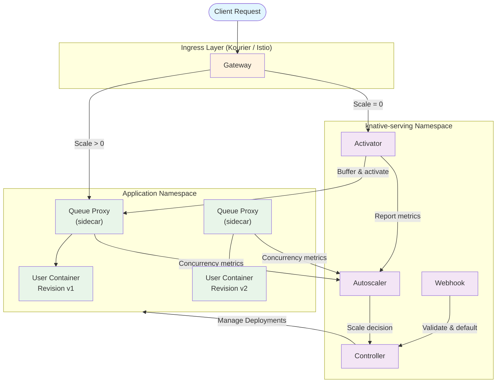
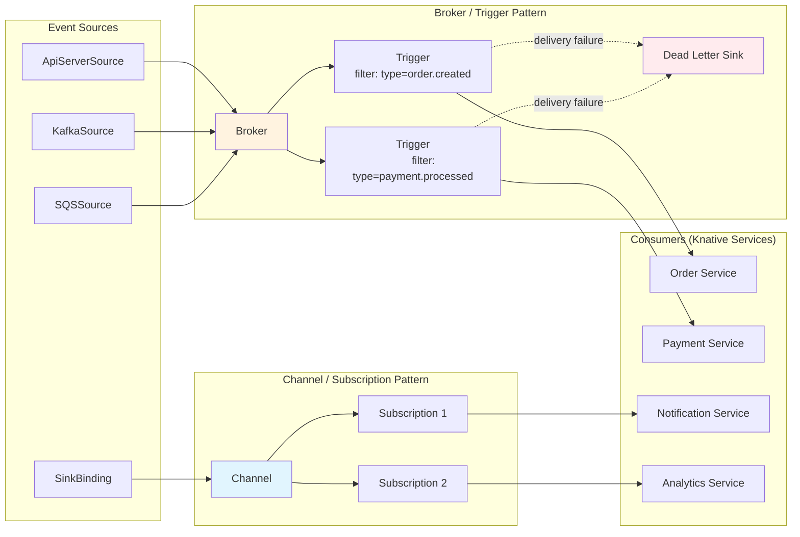
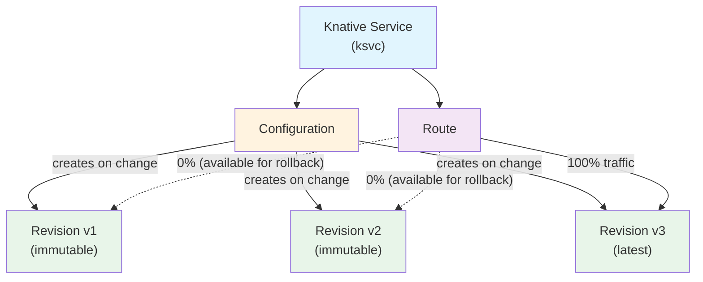
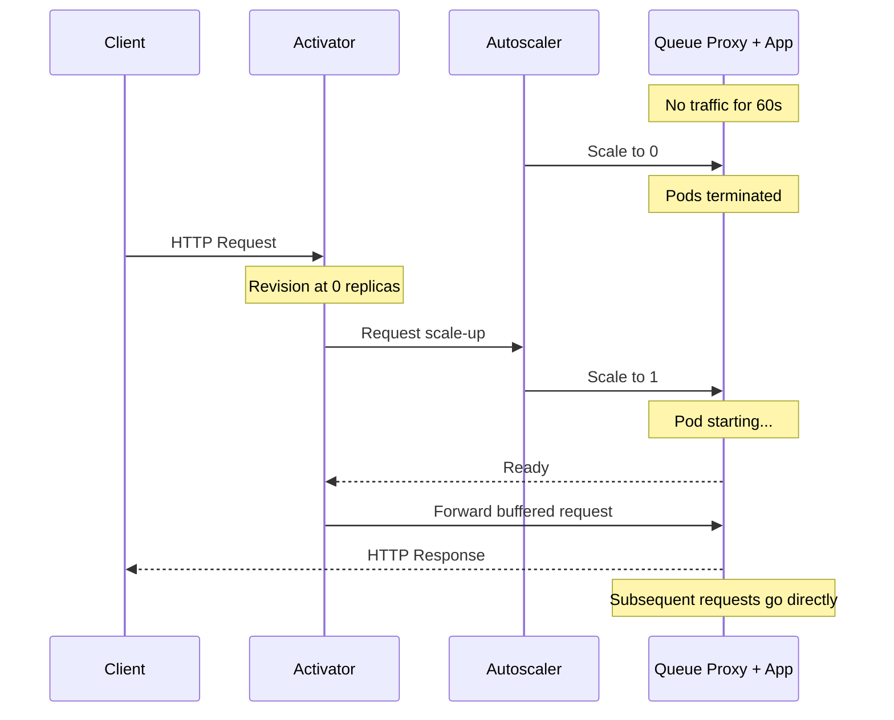
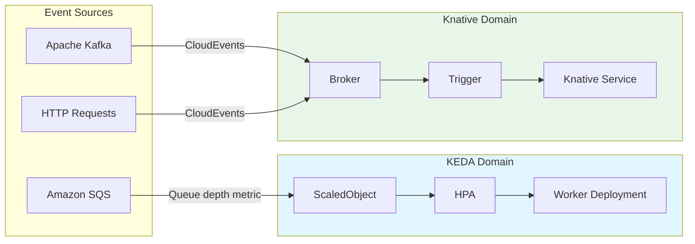

# Knative

> **Supported Versions**: Knative v1.16+, Kourier v1.16+
> **最終更新**: June 2025

## Table of Contents

- [Overview and Learning Objectives](#overview-and-learning-objectives)
- [Knative Architecture](#knative-architecture)
- [EKS Installation and Configuration](#eks-installation-and-configuration)
- [Knative Serving Deep Dive](#knative-serving-deep-dive)
- [Knative Eventing Deep Dive](#knative-eventing-deep-dive)
- [KEDA vs Knative Comparison](#keda-vs-knative-comparison)
- [Production Operations](#production-operations)
- [Best Practices](#best-practices)
- [References](#references)

---

## Overview and Learning Objectives

### What Is Knative?

Knative は、Kubernetes を拡張し、現代的な serverless workloads の構築、deploy、管理のための middleware components セットを提供する **CNCF Graduated** project です。Kubernetes primitives を置き換えるのではなく、その上に構築され、request-driven autoscaling、event delivery、traffic management などの一般的なパターンを簡素化する高レベルの abstractions を提供します。

Knative は、独立して install 可能な 2 つの components で構成されています。

- **Knative Serving** -- serverless workloads の lifecycle を管理します。Deployment、scaling（scale-to-zero を含む）、revision tracking、traffic routing を自動化します。
- **Knative Eventing** -- CloudEvents specification に従って events を生成、routing、消費するための infrastructure を提供します。event producers と consumers を分離し、疎結合な event-driven architectures を実現します。

### Serverless on Kubernetes

従来の Kubernetes Deployments では、operators が replica counts、HPA thresholds、resource budgets を事前に設定する必要があります。Knative はこの負担を移します。

1. Workloads は、incoming request concurrency または RPS に基づいて、zero から多数の replicas まで自動的に scale します。
2. Revisions は各 deployment の immutable snapshots を取得し、即時 rollback と段階的な traffic shifts を可能にします。
3. Event sources と triggers により、polling や custom glue code なしで reactive architectures を実現できます。

その結果、Kubernetes の全機能（scheduling、RBAC、networking、storage）を保持しながら、完全 managed serverless platform に近い developer experience を提供する platform になります。

### Knative Serving vs Eventing

| Aspect | Knative Serving | Knative Eventing |
|--------|----------------|-----------------|
| Primary purpose | Request-driven workload lifecycle | Event routing and delivery |
| Scaling trigger | HTTP request concurrency / RPS | Event volume (via Broker/Trigger) |
| Scale-to-zero | Yes (built-in) | Depends on consumer (Serving-backed consumers can) |
| Core resources | Service, Configuration, Revision, Route | Broker, Trigger, Channel, Subscription, Source |
| Typical use case | APIs, web apps, microservices | Async pipelines, webhooks, CDC streams |

### Knative vs AWS Lambda and AWS Fargate

| Feature | Knative on EKS | AWS Lambda | AWS Fargate |
|---------|---------------|------------|-------------|
| Runtime environment | Any OCI container | Lambda runtimes or container images | Any OCI container |
| Maximum execution time | No hard limit | 15 minutes | No hard limit |
| Scale-to-zero | Yes | Yes | No (minimum tasks) |
| Cold start control | Configurable (minScale, initialScale) | Limited (SnapStart, provisioned concurrency) | N/A |
| Custom networking | Full VPC / CNI control | VPC attachment required | VPC native |
| GPU support | Yes (via node selectors) | No | No |
| Event sources | CloudEvents, Kafka, SQS, custom | Native AWS event sources | N/A (pull-based) |
| Vendor lock-in | Low (CNCF standard, portable) | High (AWS proprietary) | Medium (ECS/Fargate API) |
| Kubernetes-native | Yes | No | Partially (EKS on Fargate) |
| Observability | Prometheus, OpenTelemetry, any k8s tooling | CloudWatch, X-Ray | CloudWatch, X-Ray |
| Cost model | Cluster resources consumed | Per-invocation + duration | Per vCPU/memory-second |

### Learning Objectives

この document の最後までに、次のことができるようになります。

1. Knative の architecture と、Serving と Eventing が互いにどのように補完するかを説明する。
2. Kourier、DNS、TLS を使用して Amazon EKS 上に Knative を install および configure する。
3. fine-grained な concurrency-based autoscaling を使用して serverless workloads を deploy する。
4. Revisions と Routes を使用して traffic splitting strategies（canary、blue-green）を実装する。
5. Brokers、Triggers、CloudEvents を使用して event-driven pipelines を構築する。
6. KEDA と Knative を比較し、それぞれ（または両方）をいつ使うべきか判断する。
7. monitoring、high availability、garbage collection policies を使って production で Knative を運用する。

---

## Knative Architecture

### Serving Architecture

Knative Serving は、`knative-serving` namespace 内に 5 つの主要 components を deploy します。これらは together で、initial request の受信から application の scaling と traffic routing まで、serverless workload の full lifecycle を管理します。



**Component responsibilities:**

| Component | Role |
|-----------|------|
| **Activator** | Receives requests when a Revision is scaled to zero. Buffers requests, triggers scale-up, then proxies the buffered requests once pods are ready. Also acts as a load balancer when the system is in "burst capacity" mode. |
| **Autoscaler** | Collects concurrency and RPS metrics from Queue Proxy sidecars. Computes the desired replica count using the Knative Pod Autoscaler (KPA) algorithm or delegates to the Kubernetes HPA. Communicates scaling decisions to the Controller. |
| **Queue Proxy** | Injected as a sidecar into every Knative pod. Enforces `containerConcurrency` limits, reports real-time concurrency to the Autoscaler, performs health checking, and handles graceful shutdown during scale-down. |
| **Controller** | Reconciles Knative CRDs (Service, Configuration, Revision, Route) into underlying Kubernetes resources (Deployments, Services, Ingress objects). Manages revision creation and garbage collection. |
| **Webhook** | Validates and defaults Knative resource specifications on admission. Ensures that invalid configurations are rejected before they reach the Controller. |

### Eventing Architecture

Knative Eventing は、event sources を consumers に bind する declarative な方法を提供します。2 つの delivery patterns をサポートします: **Broker/Trigger**（content-based routing）と **Channel/Subscription**（direct pub-sub）。



**Eventing core concepts:**

| Concept | Description |
|---------|-------------|
| **Event Source** | A resource that generates or imports events. Knative provides built-in sources (ApiServerSource, PingSource) and the community maintains sources for Kafka, AWS SQS, GitHub, and more. |
| **Broker** | An event mesh that receives events and fans them out to matching Triggers. Backed by an in-memory channel (default) or Kafka for durability. |
| **Trigger** | A filter attached to a Broker. Each Trigger selects events by CloudEvent attributes (type, source, extensions) and routes matches to a subscriber. |
| **Channel** | A durable or in-memory event transport. Unlike Brokers, Channels do not filter -- every Subscription receives every event. |
| **Subscription** | Connects a Channel to a subscriber and optionally a reply destination. |
| **Dead Letter Sink** | A fallback destination for events that cannot be delivered after exhausting retry policies. |
| **CloudEvents** | The CNCF standard envelope format (v1.0) used by all Knative Eventing components. Provides interoperability across sources and consumers. |

---

## EKS Installation and Configuration

### Prerequisites

- Kubernetes 1.28 以降で稼働している EKS cluster。
- cluster admin access で configure された `kubectl`。
- （Optional）Helm-based installations 用の `helm` v3.12+。

### Step 1: Install Knative Operator

Knative Operator は、Knative Serving と Eventing components の installation と lifecycle を管理します。Operator を使用すると、version upgrades と configuration management が簡素化されます。

```bash
# Install the Knative Operator v1.16
kubectl apply -f https://github.com/knative/operator/releases/download/knative-v1.16.0/operator.yaml

# Verify the Operator is running
kubectl get deployment knative-operator -n default
```

### Step 2: Install Knative Serving via the Operator

Serving components を deploy するために `KnativeServing` custom resource を作成します。

```yaml
apiVersion: operator.knative.dev/v1beta1
kind: KnativeServing
metadata:
  name: knative-serving
  namespace: knative-serving
spec:
  version: "1.16.0"
  ingress:
    kourier:
      enabled: true
  config:
    network:
      ingress-class: kourier.ingress.networking.knative.dev
    autoscaler:
      # KPA is the default; set to "hpa" to use Kubernetes HPA
      class: kpa.autoscaling.knative.dev
      # Target 70% average concurrency per pod
      target-utilization-percentage: "70"
    defaults:
      # All new Revisions default to these values
      revision-timeout-seconds: "300"
      container-concurrency: "0"
    deployment:
      # Queue proxy resource requests
      queue-sidecar-cpu-request: "25m"
      queue-sidecar-memory-request: "50Mi"
```

```bash
# Create the namespace and apply
kubectl create namespace knative-serving
kubectl apply -f knative-serving.yaml

# Wait for all Serving pods to become ready
kubectl wait --for=condition=Ready pods --all -n knative-serving --timeout=300s
```

### Step 3: Install Kourier (Lightweight Ingress)

Kourier は、EKS 上の Knative に推奨される lightweight ingress です。Istio よりもシンプルで、resource footprint が小さくなります。

上記の `kourier` section を使用して Operator 経由で Serving を install した場合、Kourier は自動的に install されます。manual installation の場合:

```bash
# Install Kourier
kubectl apply -f https://github.com/knative/net-kourier/releases/download/knative-v1.16.0/kourier.yaml

# Patch the config-network ConfigMap to use Kourier
kubectl patch configmap/config-network \
  --namespace knative-serving \
  --type merge \
  --patch '{"data":{"ingress-class":"kourier.ingress.networking.knative.dev"}}'

# Verify Kourier is running
kubectl get pods -n kourier-system
kubectl get svc kourier -n kourier-system
```

EKS では、Kourier service は `LoadBalancer` として公開され、default で AWS Network Load Balancer (NLB) を provision します。代わりに Application Load Balancer (ALB) を使用するには、service に適切な annotation を付与します。

```yaml
apiVersion: v1
kind: Service
metadata:
  name: kourier
  namespace: kourier-system
  annotations:
    service.beta.kubernetes.io/aws-load-balancer-type: "external"
    service.beta.kubernetes.io/aws-load-balancer-nlb-target-type: "ip"
    service.beta.kubernetes.io/aws-load-balancer-scheme: "internet-facing"
spec:
  type: LoadBalancer
```

### Step 4: DNS Configuration

Knative は各 Service に対して `<service>.<namespace>.<domain>` 形式の URLs を生成します。これらの URLs が Ingress gateway に resolve されるように DNS を configure する必要があります。

#### Option A: Magic DNS (sslip.io) -- Development Only

Magic DNS は `sslip.io` を使用して、任意の hostname を埋め込まれた IP address に自動的に resolve します。これは development と testing のみに適しています。

```bash
# Configure Knative to use sslip.io
kubectl apply -f https://github.com/knative/serving/releases/download/knative-v1.16.0/serving-default-domain.yaml

# Verify: a service "my-app" in namespace "default" would get the URL:
# http://my-app.default.<EXTERNAL-IP>.sslip.io
```

#### Option B: Real DNS with Amazon Route 53 -- Production

production では、Route 53 で real domain を configure します。

```bash
# 1. Get the Kourier external IP / hostname
KOURIER_LB=$(kubectl get svc kourier -n kourier-system \
  -o jsonpath='{.status.loadBalancer.ingress[0].hostname}')

# 2. Create a wildcard CNAME record in Route 53
#    *.knative.example.com -> $KOURIER_LB
aws route53 change-resource-record-sets \
  --hosted-zone-id Z0123456789ABCDEFGHIJ \
  --change-batch '{
    "Changes": [{
      "Action": "UPSERT",
      "ResourceRecordSet": {
        "Name": "*.knative.example.com",
        "Type": "CNAME",
        "TTL": 300,
        "ResourceRecords": [{"Value": "'$KOURIER_LB'"}]
      }
    }]
  }'

# 3. Configure Knative to use this domain
kubectl patch configmap/config-domain \
  --namespace knative-serving \
  --type merge \
  --patch '{"data":{"knative.example.com":""}}'
```

### Step 5: TLS with cert-manager

cert-manager を統合して、Knative Services 用の TLS certificates を自動的に provision および renew します。

```bash
# Install the Knative cert-manager integration
kubectl apply -f https://github.com/knative/net-certmanager/releases/download/knative-v1.16.0/release.yaml
```

Knative が certificates を自動的に request するように configure します。

```yaml
apiVersion: v1
kind: ConfigMap
metadata:
  name: config-network
  namespace: knative-serving
data:
  ingress-class: kourier.ingress.networking.knative.dev
  auto-tls: "Enabled"
  http-protocol: "Redirected"
---
apiVersion: v1
kind: ConfigMap
metadata:
  name: config-certmanager
  namespace: knative-serving
data:
  issuerRef: |
    kind: ClusterIssuer
    name: letsencrypt-prod
```

ClusterIssuer を作成します（cert-manager がすでに install されていることを前提とします）。

```yaml
apiVersion: cert-manager.io/v1
kind: ClusterIssuer
metadata:
  name: letsencrypt-prod
spec:
  acme:
    server: https://acme-v02.api.letsencrypt.org/directory
    email: platform-team@example.com
    privateKeySecretRef:
      name: letsencrypt-prod-key
    solvers:
      - dns01:
          route53:
            region: us-west-2
            hostedZoneID: Z0123456789ABCDEFGHIJ
```

### Step 6: HPA vs KPA Autoscaler Selection

Knative は 2 つの autoscaler implementations をサポートします。この選択は scaling behavior に大きく影響します。

| Feature | KPA (Knative Pod Autoscaler) | HPA (Kubernetes HPA) |
|---------|------------------------------|----------------------|
| Scale-to-zero | Yes | No |
| Metrics | Concurrency, RPS | CPU, Memory, Custom metrics |
| Scaling speed | Fast (panic/stable windows) | Standard HPA intervals |
| Configuration | Knative annotations | Standard HPA spec |
| Best for | HTTP workloads, latency-sensitive | CPU/memory-bound workloads |

cluster 全体の default autoscaler class を configure します。

```yaml
# In config-autoscaler ConfigMap
apiVersion: v1
kind: ConfigMap
metadata:
  name: config-autoscaler
  namespace: knative-serving
data:
  # "kpa.autoscaling.knative.dev" or "hpa.autoscaling.knative.dev"
  class: "kpa.autoscaling.knative.dev"

  # KPA-specific settings
  stable-window: "60s"
  panic-window-percentage: "10"
  panic-threshold-percentage: "200"
  scale-to-zero-grace-period: "30s"
  scale-to-zero-pod-retention-period: "0s"

  # Target defaults
  target-burst-capacity: "200"
  requests-per-second-target-default: "200"
  container-concurrency-target-default: "100"
```

annotations を使用して per-Revision で override します。

```yaml
metadata:
  annotations:
    autoscaling.knative.dev/class: "hpa.autoscaling.knative.dev"
    autoscaling.knative.dev/metric: "cpu"
    autoscaling.knative.dev/target: "70"
```

### Step 7: Install Knative Eventing

```yaml
apiVersion: operator.knative.dev/v1beta1
kind: KnativeEventing
metadata:
  name: knative-eventing
  namespace: knative-eventing
spec:
  version: "1.16.0"
  config:
    default-ch-webhook:
      default-ch-config: |
        clusterDefault:
          apiVersion: messaging.knative.dev/v1
          kind: InMemoryChannel
```

```bash
kubectl create namespace knative-eventing
kubectl apply -f knative-eventing.yaml
kubectl wait --for=condition=Ready pods --all -n knative-eventing --timeout=300s
```

---

## Knative Serving Deep Dive

### Resource Model

Knative Serving は、serverless workload の complete lifecycle を管理するために連携する 4 つの primary custom resources を導入します。



| Resource | Description |
|----------|-------------|
| **Service** (`ksvc`) | The top-level resource. Manages the entire lifecycle by owning a Configuration and a Route. Most users interact only with Services. |
| **Configuration** | Describes the desired state of a workload (container image, environment variables, resource limits). Each update to a Configuration creates a new Revision. |
| **Revision** | An immutable, point-in-time snapshot of a Configuration. Revisions are named automatically (e.g., `my-app-00001`). Old Revisions are retained for traffic splitting and rollback. |
| **Route** | Maps network traffic to one or more Revisions. Enables canary deployments, blue-green releases, and percentage-based traffic splitting. |

### Complete Knative Service YAML

次の example は、explicit autoscaling、resource limits、health checks、scaling boundaries を備えた production-grade の Knative Service を deploy します。

```yaml
apiVersion: serving.knative.dev/v1
kind: Service
metadata:
  name: order-api
  namespace: production
  labels:
    app.kubernetes.io/name: order-api
    app.kubernetes.io/part-of: ecommerce
    app.kubernetes.io/managed-by: knative
spec:
  template:
    metadata:
      annotations:
        # Autoscaling configuration
        autoscaling.knative.dev/class: "kpa.autoscaling.knative.dev"
        autoscaling.knative.dev/metric: "concurrency"
        autoscaling.knative.dev/target: "100"
        autoscaling.knative.dev/target-utilization-percentage: "70"
        autoscaling.knative.dev/min-scale: "2"
        autoscaling.knative.dev/max-scale: "50"
        autoscaling.knative.dev/initial-scale: "3"
        autoscaling.knative.dev/scale-down-delay: "15m"
        autoscaling.knative.dev/window: "60s"
    spec:
      containerConcurrency: 0
      timeoutSeconds: 300
      containers:
        - image: 123456789012.dkr.ecr.us-west-2.amazonaws.com/order-api:v1.2.3
          ports:
            - containerPort: 8080
              protocol: TCP
          env:
            - name: DB_HOST
              valueFrom:
                secretKeyRef:
                  name: db-credentials
                  key: host
            - name: LOG_LEVEL
              value: "info"
          resources:
            requests:
              cpu: "250m"
              memory: "512Mi"
            limits:
              cpu: "1000m"
              memory: "1Gi"
          readinessProbe:
            httpGet:
              path: /healthz
              port: 8080
            initialDelaySeconds: 5
            periodSeconds: 10
          livenessProbe:
            httpGet:
              path: /healthz
              port: 8080
            initialDelaySeconds: 15
            periodSeconds: 20
      serviceAccountName: order-api-sa
```

### Traffic Splitting: Canary Deployments

Traffic splitting により、Revisions 間で traffic を段階的に shift できます。これは canary と blue-green deployment strategies の foundation です。

#### Canary Deployment

traffic の小さな percentage を new Revision に routing し、時間をかけて増やします。

```yaml
apiVersion: serving.knative.dev/v1
kind: Service
metadata:
  name: order-api
  namespace: production
spec:
  template:
    metadata:
      # The new Revision is created from this template
      annotations:
        autoscaling.knative.dev/min-scale: "2"
    spec:
      containers:
        - image: 123456789012.dkr.ecr.us-west-2.amazonaws.com/order-api:v1.3.0
          ports:
            - containerPort: 8080
  traffic:
    # 90% to the current stable Revision
    - revisionName: order-api-00005
      percent: 90
    # 10% canary to the latest Revision
    - latestRevision: true
      percent: 10
      tag: canary
```

canary traffic を段階的に増やします。

```bash
# Increase canary to 50%
kubectl patch ksvc order-api -n production --type merge --patch '
spec:
  traffic:
    - revisionName: order-api-00005
      percent: 50
    - latestRevision: true
      percent: 50
      tag: canary
'

# Promote canary to 100%
kubectl patch ksvc order-api -n production --type merge --patch '
spec:
  traffic:
    - latestRevision: true
      percent: 100
'
```

各 tagged traffic target には独自の URL が割り当てられます: `https://canary-order-api.production.knative.example.com`。これにより canary Revision を直接 test できます。

#### Blue-Green Deployment

blue-green strategy では、両方の Revisions が full capacity で実行され、traffic が atomically に切り替えられます。

```yaml
apiVersion: serving.knative.dev/v1
kind: Service
metadata:
  name: order-api
  namespace: production
spec:
  template:
    spec:
      containers:
        - image: 123456789012.dkr.ecr.us-west-2.amazonaws.com/order-api:v2.0.0
          ports:
            - containerPort: 8080
  traffic:
    # Blue (current) receives 100% of production traffic
    - revisionName: order-api-00005
      percent: 100
      tag: blue
    # Green (new) is deployed but receives 0% traffic; accessible via tag URL
    - latestRevision: true
      percent: 0
      tag: green
```

`https://green-order-api.production.knative.example.com` 経由で green environment を validate した後、traffic を切り替えます。

```bash
# Instant switch to green
kubectl patch ksvc order-api -n production --type merge --patch '
spec:
  traffic:
    - revisionName: order-api-00005
      percent: 0
      tag: blue
    - latestRevision: true
      percent: 100
      tag: green
'
```

### Scale-to-Zero Behavior

Scale-to-zero は Knative Serving を特徴づける機能です。Revision が traffic を受信しない場合、configurable grace period の後にその pods は terminate されます。new request が到着すると、Activator がそれを buffer し、scale-up を trigger し、pod が ready になると request を proxy します。



scale-to-zero を制御する主な parameters:

| Annotation / Config | Default | Description |
|---------------------|---------|-------------|
| `scale-to-zero-grace-period` (global) | 30s | Time the system waits after the last pod in a Revision becomes idle before removing it. |
| `scale-to-zero-pod-retention-period` (global) | 0s | Minimum time a pod is kept after last request, even if already idle. |
| `autoscaling.knative.dev/scale-to-zero-pod-retention-period` (per-Revision) | inherited | Per-Revision override of the global retention period. |
| `enable-scale-to-zero` (global) | true | Master toggle. Set to false to disable scale-to-zero cluster-wide. |

### Concurrency-Based Scaling

Knative の KPA は、observed concurrency（in-flight requests）または requests per second (RPS) に基づいて scale します。この algorithm は 2 つの windows を維持します。

- **Stable window**（default 60s）: この期間の average concurrency が steady-state の scale decision を決定します。
- **Panic window**（default 6s、つまり stable の 10%）: この window の average concurrency が panic threshold（default は target の 200%）を超えると、system は aggressive に scale up します。

**Key annotations:**

| Annotation | Example | Description |
|------------|---------|-------------|
| `autoscaling.knative.dev/metric` | `"concurrency"` or `"rps"` | Which metric to scale on. |
| `autoscaling.knative.dev/target` | `"100"` | Target value for the metric (e.g., 100 concurrent requests per pod). |
| `autoscaling.knative.dev/target-utilization-percentage` | `"70"` | The Autoscaler aims to keep average utilization at this percentage of the target. Effective target = target * utilization / 100. |
| `spec.containerConcurrency` | `0` (unlimited) | Hard limit on concurrent requests per container. The Queue Proxy enforces this and queues excess requests. Set to 0 for no limit. A value of 1 enables single-threaded processing. |

**Scaling formula:**

```
desiredReplicas = ceil( observedConcurrency / (target * targetUtilization / 100) )
```

たとえば、`target=100`、`targetUtilization=70%`、observed concurrent requests が 350 の場合:

```
desiredReplicas = ceil(350 / (100 * 0.70)) = ceil(350 / 70) = ceil(5.0) = 5
```

### Cold Start Optimization

Cold starts -- zero から scale するときの latency penalty -- は一般的な懸念事項です。Knative はこれらを軽減するための複数の mechanisms を提供します。

| Strategy | Configuration | Trade-off |
|----------|---------------|-----------|
| **minScale** | `autoscaling.knative.dev/min-scale: "2"` | Keeps a minimum number of pods running. Eliminates cold starts but incurs baseline cost. |
| **initialScale** | `autoscaling.knative.dev/initial-scale: "3"` | Number of pods created when a new Revision is first deployed. Does not prevent scale-to-zero later. |
| **scale-down-delay** | `autoscaling.knative.dev/scale-down-delay: "15m"` | Delays scale-down decisions. Useful for bursty workloads to avoid frequent cold starts. |
| **Container image caching** | Use EKS node-level image caching or pre-pull DaemonSets | Reduces container pull time during cold start. |
| **Lightweight base images** | Use distroless or Alpine-based images | Reduces image size and pull time. |
| **Application warmup** | Implement readiness probes that wait for caches/connections | Ensures the pod reports ready only after it can handle traffic at full speed. |

```yaml
# Example: latency-sensitive service with cold start mitigation
apiVersion: serving.knative.dev/v1
kind: Service
metadata:
  name: latency-critical-api
  namespace: production
spec:
  template:
    metadata:
      annotations:
        autoscaling.knative.dev/min-scale: "3"
        autoscaling.knative.dev/initial-scale: "5"
        autoscaling.knative.dev/scale-down-delay: "10m"
        autoscaling.knative.dev/target: "50"
        autoscaling.knative.dev/window: "30s"
    spec:
      containerConcurrency: 100
      containers:
        - image: 123456789012.dkr.ecr.us-west-2.amazonaws.com/api:v1.0.0
          ports:
            - containerPort: 8080
          readinessProbe:
            httpGet:
              path: /ready
              port: 8080
            initialDelaySeconds: 3
            periodSeconds: 5
```

### Private and Public Services

Default では、Knative Services は ingress gateway を通じて external に公開されます。Service を cluster-internal のみにすることができます。

```yaml
apiVersion: serving.knative.dev/v1
kind: Service
metadata:
  name: internal-processor
  namespace: production
  labels:
    networking.knative.dev/visibility: cluster-local
spec:
  template:
    spec:
      containers:
        - image: 123456789012.dkr.ecr.us-west-2.amazonaws.com/processor:v1.0.0
```

`cluster-local` label により、Knative は publicly routable な URL ではなく internal URL（例: `http://internal-processor.production.svc.cluster.local`）を生成します。これは、cluster の外部から access されるべきでない internal microservices に有用です。

cluster 全体の default visibility を設定することもできます。

```yaml
# config-network ConfigMap
data:
  default-external-scheme: "https"
  visibility: "cluster-local"  # All services are private by default
```

---

## Knative Eventing Deep Dive

### Event Sources

Event Sources は external systems を eventing mesh に接続する Knative resources です。各 Source は、configured sink（Broker、Channel、または Knative Service へ直接）に CloudEvents を emit します。

#### ApiServerSource

Kubernetes API server で resource events を監視し、それらを CloudEvents として forward します。

```yaml
apiVersion: sources.knative.dev/v1
kind: ApiServerSource
metadata:
  name: pod-event-source
  namespace: production
spec:
  serviceAccountName: event-watcher-sa
  mode: Resource
  resources:
    - apiVersion: v1
      kind: Pod
    - apiVersion: apps/v1
      kind: Deployment
  sink:
    ref:
      apiVersion: eventing.knative.dev/v1
      kind: Broker
      name: default
```

#### SinkBinding

environment variables（特に `K_SINK`）を任意の Kubernetes workload に inject し、destination を hardcode せずに sink へ events を送信できるようにします。

```yaml
apiVersion: sources.knative.dev/v1
kind: SinkBinding
metadata:
  name: order-producer-binding
  namespace: production
spec:
  subject:
    apiVersion: apps/v1
    kind: Deployment
    name: order-producer
  sink:
    ref:
      apiVersion: eventing.knative.dev/v1
      kind: Broker
      name: default
  ceOverrides:
    extensions:
      source: order-system
```

application は `K_SINK` を読み取り、CloudEvents をそこへ POST します。

```python
import os, requests, json
from datetime import datetime

sink_url = os.environ["K_SINK"]

event = {
    "specversion": "1.0",
    "type": "com.example.order.created",
    "source": "/orders/api",
    "id": "order-12345",
    "time": datetime.utcnow().isoformat() + "Z",
    "datacontenttype": "application/json",
    "data": {"orderId": "12345", "amount": 99.99}
}

headers = {
    "Content-Type": "application/cloudevents+json",
    "ce-specversion": event["specversion"],
    "ce-type": event["type"],
    "ce-source": event["source"],
    "ce-id": event["id"],
}

requests.post(sink_url, json=event["data"], headers=headers)
```

#### KafkaSource

Apache Kafka topics から messages を consume し、それらを CloudEvents として deliver します。

```yaml
apiVersion: sources.knative.dev/v1beta1
kind: KafkaSource
metadata:
  name: payment-events
  namespace: production
spec:
  consumerGroup: knative-payment-consumer
  bootstrapServers:
    - kafka-bootstrap.kafka.svc.cluster.local:9092
  topics:
    - payment-events
  sink:
    ref:
      apiVersion: eventing.knative.dev/v1
      kind: Broker
      name: default
  # Optional: configure SASL/TLS for MSK
  net:
    sasl:
      enable: true
      type:
        secretKeyRef:
          name: kafka-credentials
          key: sasl-type
      user:
        secretKeyRef:
          name: kafka-credentials
          key: username
      password:
        secretKeyRef:
          name: kafka-credentials
          key: password
    tls:
      enable: true
```

#### SQSSource (AWS)

Amazon SQS queues から messages を consume します。これには AWS event source controller が必要です。

```bash
# Install AWS event sources
kubectl apply -f https://github.com/triggermesh/aws-event-sources/releases/latest/download/aws-event-sources.yaml
```

```yaml
apiVersion: sources.triggermesh.io/v1alpha1
kind: AWSSQSSource
metadata:
  name: order-queue-source
  namespace: production
spec:
  arn: arn:aws:sqs:us-west-2:123456789012:order-events
  receiveOptions:
    visibilityTimeout: 60s
  auth:
    credentials:
      accessKeyID:
        valueFromSecret:
          name: aws-credentials
          key: access-key-id
      secretAccessKey:
        valueFromSecret:
          name: aws-credentials
          key: secret-access-key
  sink:
    ref:
      apiVersion: eventing.knative.dev/v1
      kind: Broker
      name: default
```

EKS の production では、static credentials の代わりに IAM Roles for Service Accounts (IRSA) を推奨します。

### Broker/Trigger Pattern

Broker/Trigger pattern は content-based event routing を提供します。Broker は event hub として機能し、Triggers は CloudEvent attributes で events を filter して subscribers に route します。

#### Complete Broker/Trigger Example

```yaml
# 1. Create the Broker
apiVersion: eventing.knative.dev/v1
kind: Broker
metadata:
  name: default
  namespace: production
  annotations:
    eventing.knative.dev/broker.class: MTChannelBasedBroker
spec:
  config:
    apiVersion: v1
    kind: ConfigMap
    name: config-br-default-channel
    namespace: knative-eventing
  delivery:
    retry: 5
    backoffPolicy: exponential
    backoffDelay: "PT2S"
    deadLetterSink:
      ref:
        apiVersion: serving.knative.dev/v1
        kind: Service
        name: dead-letter-handler
---
# 2. Trigger for order.created events -> Order Service
apiVersion: eventing.knative.dev/v1
kind: Trigger
metadata:
  name: order-created-trigger
  namespace: production
spec:
  broker: default
  filter:
    attributes:
      type: com.example.order.created
      source: /orders/api
  subscriber:
    ref:
      apiVersion: serving.knative.dev/v1
      kind: Service
      name: order-processor
---
# 3. Trigger for payment.processed events -> Payment Service
apiVersion: eventing.knative.dev/v1
kind: Trigger
metadata:
  name: payment-processed-trigger
  namespace: production
spec:
  broker: default
  filter:
    attributes:
      type: com.example.payment.processed
  subscriber:
    ref:
      apiVersion: serving.knative.dev/v1
      kind: Service
      name: payment-reconciler
  delivery:
    retry: 10
    backoffPolicy: exponential
    backoffDelay: "PT5S"
    deadLetterSink:
      ref:
        apiVersion: serving.knative.dev/v1
        kind: Service
        name: payment-dead-letter
---
# 4. Trigger for all events -> Analytics (no filter = catch-all)
apiVersion: eventing.knative.dev/v1
kind: Trigger
metadata:
  name: analytics-trigger
  namespace: production
spec:
  broker: default
  subscriber:
    ref:
      apiVersion: serving.knative.dev/v1
      kind: Service
      name: analytics-collector
```

### CloudEvents Standard

すべての Knative Eventing components は [CloudEvents](https://cloudevents.io/) specification (v1.0) を使用して通信します。CloudEvents は required および optional attributes を持つ共通 envelope を定義します。

| Attribute | Required | Example | Description |
|-----------|----------|---------|-------------|
| `specversion` | Yes | `"1.0"` | CloudEvents specification version. |
| `type` | Yes | `"com.example.order.created"` | Event type. Used for routing by Triggers. |
| `source` | Yes | `"/orders/api"` | Event origin. Combined with type for filtering. |
| `id` | Yes | `"evt-abc123"` | Unique event identifier for deduplication. |
| `time` | No | `"2025-06-15T10:30:00Z"` | Timestamp of event occurrence. |
| `datacontenttype` | No | `"application/json"` | Content type of the `data` attribute. |
| `subject` | No | `"order-12345"` | Subject of the event in context of the source. |
| `data` | No | `{"orderId": "12345"}` | Event payload. |

### Channel/Subscription Pattern

Channel/Subscription pattern は、content-based filtering なしの direct pub-sub を提供します。Channel 上のすべての Subscription はすべての event を受信します。

```yaml
# 1. Create a Channel backed by Kafka for durability
apiVersion: messaging.knative.dev/v1beta1
kind: KafkaChannel
metadata:
  name: audit-events
  namespace: production
spec:
  numPartitions: 6
  replicationFactor: 3
  retentionDuration: PT168H  # 7 days
---
# 2. Subscription: forward to audit logging service
apiVersion: messaging.knative.dev/v1
kind: Subscription
metadata:
  name: audit-log-subscription
  namespace: production
spec:
  channel:
    apiVersion: messaging.knative.dev/v1beta1
    kind: KafkaChannel
    name: audit-events
  subscriber:
    ref:
      apiVersion: serving.knative.dev/v1
      kind: Service
      name: audit-logger
  reply:
    ref:
      apiVersion: serving.knative.dev/v1
      kind: Service
      name: audit-response-handler
---
# 3. Subscription: forward to compliance service
apiVersion: messaging.knative.dev/v1
kind: Subscription
metadata:
  name: compliance-subscription
  namespace: production
spec:
  channel:
    apiVersion: messaging.knative.dev/v1beta1
    kind: KafkaChannel
    name: audit-events
  subscriber:
    ref:
      apiVersion: serving.knative.dev/v1
      kind: Service
      name: compliance-checker
  delivery:
    deadLetterSink:
      ref:
        apiVersion: serving.knative.dev/v1
        kind: Service
        name: dead-letter-handler
    retry: 3
    backoffPolicy: linear
    backoffDelay: "PT10S"
```

### Dead Letter Sink

event delivery がすべての retries を使い切った後に失敗すると、event は Dead Letter Sink (DLS) に forward されます。DLS は通常、後続の analysis や replay のために failed events を永続化する Knative Service です。

```yaml
apiVersion: serving.knative.dev/v1
kind: Service
metadata:
  name: dead-letter-handler
  namespace: production
spec:
  template:
    metadata:
      annotations:
        autoscaling.knative.dev/min-scale: "1"
    spec:
      containers:
        - image: 123456789012.dkr.ecr.us-west-2.amazonaws.com/dead-letter:v1.0.0
          env:
            - name: S3_BUCKET
              value: "failed-events-production"
            - name: AWS_REGION
              value: "us-west-2"
```

Broker level（すべての Triggers に適用）または個別の Trigger/Subscription level で DLS を configure し、fine-grained control を行います。

### Event Filtering

Triggers は CloudEvent attributes と extensions に対する filtering をサポートします。

#### Attribute Filtering

```yaml
spec:
  filter:
    attributes:
      type: com.example.order.created
      source: /orders/api
```

この Trigger は `type` と `source` の両方が一致した場合にのみ発火します（logical AND）。

#### Extension Filtering

producers によって設定された custom CloudEvent extensions で filter できます。

```yaml
spec:
  filter:
    attributes:
      type: com.example.order.created
      myextension: priority-high
```

#### Multiple Triggers for OR Logic

single Trigger filter は AND-only であるため、OR logic には同じ subscriber 上の multiple Triggers を使用します。

```yaml
# Trigger 1: react to order.created
apiVersion: eventing.knative.dev/v1
kind: Trigger
metadata:
  name: order-created
spec:
  broker: default
  filter:
    attributes:
      type: com.example.order.created
  subscriber:
    ref:
      apiVersion: serving.knative.dev/v1
      kind: Service
      name: notification-service
---
# Trigger 2: also react to order.cancelled
apiVersion: eventing.knative.dev/v1
kind: Trigger
metadata:
  name: order-cancelled
spec:
  broker: default
  filter:
    attributes:
      type: com.example.order.cancelled
  subscriber:
    ref:
      apiVersion: serving.knative.dev/v1
      kind: Service
      name: notification-service
```

---

## KEDA vs Knative Comparison

KEDA と Knative はどちらも Kubernetes 上で event-driven scaling を可能にしますが、異なる abstraction levels で動作し、相補的な役割を担います。

### Scaling Model Differences

| Aspect | KEDA | Knative |
|--------|------|---------|
| **Abstraction level** | Extends HPA with custom metric sources | Full serverless platform (deployment, routing, scaling) |
| **Scaling mechanism** | Creates/manages HPA resources | Custom KPA controller or HPA delegation |
| **Primary metric** | External metrics (queue depth, DB rows, custom) | HTTP concurrency / RPS |
| **Workload type** | Any Deployment, StatefulSet, Job | Knative Service (manages its own Deployment) |
| **CRDs** | ScaledObject, ScaledJob, TriggerAuthentication | Service, Configuration, Revision, Route |
| **Built-in routing** | No | Yes (traffic splitting, revisions, canary) |
| **Built-in eventing** | No (focuses on scaling only) | Yes (Broker/Trigger, Channel/Subscription) |

### Scale-to-Zero Behavior Differences

| Behavior | KEDA | Knative (KPA) |
|----------|------|---------------|
| Scale-to-zero trigger | Metric value drops to 0 or below threshold | No HTTP requests for configurable grace period |
| Activation mechanism | KEDA Operator sets replicas from 0 to `minReplicaCount` when metric > 0 | Activator buffers HTTP requests and triggers scale-up |
| Request buffering | No (not HTTP-aware) | Yes (Activator buffers during cold start) |
| Cool-down period | `cooldownPeriod` on ScaledObject | `scale-to-zero-grace-period` + `stable-window` |
| Scale-to-zero for Jobs | Yes (ScaledJob) | No (Serving only handles long-running processes) |

### Roles in Event-Driven Architecture



### When to Use KEDA vs Knative

| Use Case | Recommended | Reason |
|----------|-------------|--------|
| Scale workers based on SQS queue depth | **KEDA** | KEDA has a native SQS scaler; no HTTP routing needed. |
| Deploy HTTP APIs with auto-scaling and traffic splitting | **Knative** | Serving provides revision management, traffic splitting, and HTTP-aware autoscaling. |
| Scale based on Prometheus metrics | **KEDA** | KEDA's Prometheus scaler is mature and well-tested. |
| Event-driven microservices with CloudEvents | **Knative** | Eventing provides Broker/Trigger, dead letter handling, and CloudEvents support. |
| Scale CronJobs or batch workloads | **KEDA** | ScaledJob is designed for this. Knative Serving is for long-running processes. |
| Scale based on CPU/memory with scale-to-zero | **KEDA** | Knative's KPA focuses on concurrency/RPS, not CPU/memory. |
| Serverless platform for developers | **Knative** | Higher-level abstraction; developers deploy with `kn service create`. |

### Using KEDA and Knative Together

KEDA と Knative は mutually exclusive ではありません。一般的な architecture では次を使用します。

- **Knative Serving**: HTTP-facing services（APIs、web applications）向けに concurrency-based autoscaling とともに使用。
- **KEDA**: external-metric-based autoscaling を使用する background workers（queue consumers、batch processors）向け。
- **Knative Eventing**: SinkBinding を通じた KEDA-scaled workers を含む、services 間の events routing 向け。

```yaml
# Knative Service: receives HTTP events from Broker
apiVersion: serving.knative.dev/v1
kind: Service
metadata:
  name: event-enricher
spec:
  template:
    spec:
      containers:
        - image: event-enricher:v1
---
# KEDA ScaledObject: scales a Deployment based on SQS queue depth
apiVersion: keda.sh/v1alpha1
kind: ScaledObject
metadata:
  name: sqs-worker-scaler
spec:
  scaleTargetRef:
    name: sqs-worker
  minReplicaCount: 0
  maxReplicaCount: 100
  triggers:
    - type: aws-sqs-queue
      metadata:
        queueURL: https://sqs.us-west-2.amazonaws.com/123456789012/enriched-events
        queueLength: "5"
        awsRegion: us-west-2
      authenticationRef:
        name: keda-aws-credentials
```

---

## Production Operations

### Resource Limits and QoS

production では、application container と Queue Proxy sidecar の両方に必ず resource requests と limits を設定します。これにより、pods は `Guaranteed` または `Burstable` QoS class を取得し、OOM kills や noisy-neighbor issues を防げます。

```yaml
# Global Queue Proxy resources (config-deployment ConfigMap)
apiVersion: v1
kind: ConfigMap
metadata:
  name: config-deployment
  namespace: knative-serving
data:
  queue-sidecar-cpu-request: "50m"
  queue-sidecar-cpu-limit: "500m"
  queue-sidecar-memory-request: "100Mi"
  queue-sidecar-memory-limit: "256Mi"
  # Enforce resource limits on all revisions
  queue-sidecar-token-audiences: ""
```

### Revision Garbage Collection

時間の経過とともに old Revisions が蓄積します。retained Revisions の数を制限するように garbage collection を configure します。

```yaml
# config-gc ConfigMap
apiVersion: v1
kind: ConfigMap
metadata:
  name: config-gc
  namespace: knative-serving
data:
  # Minimum number of non-active Revisions to retain
  min-non-active-revisions: "2"
  # Maximum number of non-active Revisions to retain
  max-non-active-revisions: "10"
  # Duration to retain non-active Revisions (Go duration format)
  retain-since-create-time: "48h"
  retain-since-last-active-time: "24h"
  # Minimum staleness before a Revision is eligible for GC
  min-stale-revision-create-delay: "24h"
```

### High Availability Configuration

production workloads では、high availability のために Knative Serving components を configure します。

```yaml
apiVersion: operator.knative.dev/v1beta1
kind: KnativeServing
metadata:
  name: knative-serving
  namespace: knative-serving
spec:
  version: "1.16.0"
  high-availability:
    replicas: 3
  ingress:
    kourier:
      enabled: true
  workloads:
    - name: activator
      replicas: 3
      resources:
        requests:
          cpu: "300m"
          memory: "256Mi"
        limits:
          cpu: "1000m"
          memory: "512Mi"
    - name: controller
      replicas: 2
    - name: webhook
      replicas: 2
```

さらに、Knative system components 用に Pod Disruption Budgets を configure します。

```yaml
apiVersion: policy/v1
kind: PodDisruptionBudget
metadata:
  name: activator-pdb
  namespace: knative-serving
spec:
  minAvailable: 2
  selector:
    matchLabels:
      app: activator
---
apiVersion: policy/v1
kind: PodDisruptionBudget
metadata:
  name: controller-pdb
  namespace: knative-serving
spec:
  minAvailable: 1
  selector:
    matchLabels:
      app: controller
```

topology constraints を使用して system pods を Availability Zones に分散させます。

```yaml
apiVersion: apps/v1
kind: Deployment
metadata:
  name: activator
  namespace: knative-serving
spec:
  template:
    spec:
      topologySpreadConstraints:
        - maxSkew: 1
          topologyKey: topology.kubernetes.io/zone
          whenUnsatisfiable: DoNotSchedule
          labelSelector:
            matchLabels:
              app: activator
```

### Monitoring with Prometheus

Knative Serving と Eventing は Prometheus metrics を expose します。ServiceMonitor（Prometheus Operator 用）または scrape config を configure して、それらを collect します。

```yaml
# ServiceMonitor for Knative Serving components
apiVersion: monitoring.coreos.com/v1
kind: ServiceMonitor
metadata:
  name: knative-serving
  namespace: monitoring
  labels:
    release: prometheus
spec:
  namespaceSelector:
    matchNames:
      - knative-serving
  selector:
    matchLabels:
      app.kubernetes.io/part-of: knative
  endpoints:
    - port: metrics
      interval: 15s
      path: /metrics
---
# ServiceMonitor for application-level metrics (Queue Proxy)
apiVersion: monitoring.coreos.com/v1
kind: ServiceMonitor
metadata:
  name: knative-revisions
  namespace: monitoring
  labels:
    release: prometheus
spec:
  namespaceSelector:
    any: true
  selector:
    matchLabels:
      serving.knative.dev/service: ""
  endpoints:
    - port: http-usermetric
      interval: 10s
      path: /metrics
    - port: http-queueadm
      interval: 10s
      path: /metrics
```

**Key metrics to monitor:**

| Metric | Component | Description |
|--------|-----------|-------------|
| `revision_app_request_count` | Queue Proxy | Total request count per Revision. |
| `revision_app_request_latencies` | Queue Proxy | Request latency histogram. |
| `revision_request_concurrency` | Queue Proxy | Current in-flight request count per pod. |
| `activator_request_count` | Activator | Requests handled by the Activator (indicates cold starts). |
| `autoscaler_desired_pods` | Autoscaler | Desired replica count per Revision. |
| `autoscaler_actual_pods` | Autoscaler | Current actual replica count. |
| `autoscaler_panic_mode` | Autoscaler | Whether the Autoscaler is in panic mode (1 = yes). |
| `controller_reconcile_count` | Controller | Reconciliation count by resource type and result. |
| `broker_event_count` | Eventing | Events processed by each Broker. |
| `trigger_filter_event_count` | Eventing | Events that passed/failed Trigger filter. |

### Grafana Dashboard

上記の Knative metrics を可視化する Grafana dashboard を import または作成します。以下は basic Knative overview dashboard の JSON model です。

```json
{
  "dashboard": {
    "title": "Knative Overview",
    "panels": [
      {
        "title": "Request Rate by Revision",
        "type": "graph",
        "targets": [
          {
            "expr": "sum(rate(revision_app_request_count[5m])) by (revision_name)",
            "legendFormat": "{{revision_name}}"
          }
        ]
      },
      {
        "title": "Request Latency P99",
        "type": "graph",
        "targets": [
          {
            "expr": "histogram_quantile(0.99, sum(rate(revision_app_request_latencies_bucket[5m])) by (le, revision_name))",
            "legendFormat": "{{revision_name}}"
          }
        ]
      },
      {
        "title": "Concurrency per Pod",
        "type": "graph",
        "targets": [
          {
            "expr": "avg(revision_request_concurrency) by (revision_name)",
            "legendFormat": "{{revision_name}}"
          }
        ]
      },
      {
        "title": "Desired vs Actual Pods",
        "type": "graph",
        "targets": [
          {
            "expr": "autoscaler_desired_pods",
            "legendFormat": "desired - {{revision_name}}"
          },
          {
            "expr": "autoscaler_actual_pods",
            "legendFormat": "actual - {{revision_name}}"
          }
        ]
      },
      {
        "title": "Activator Requests (Cold Starts)",
        "type": "graph",
        "targets": [
          {
            "expr": "sum(rate(activator_request_count[5m])) by (revision_name)",
            "legendFormat": "{{revision_name}}"
          }
        ]
      },
      {
        "title": "Autoscaler Panic Mode",
        "type": "stat",
        "targets": [
          {
            "expr": "autoscaler_panic_mode",
            "legendFormat": "{{revision_name}}"
          }
        ]
      }
    ]
  }
}
```

### Troubleshooting

#### Cold Start Latency Is Too High

**Symptoms:** idle period 後の first request に数秒かかります。

**Diagnosis:**

```bash
# Check if the Revision is scaled to zero
kubectl get ksvc order-api -n production -o jsonpath='{.status.conditions}' | jq .

# Check Activator logs for buffering duration
kubectl logs -l app=activator -n knative-serving --tail=50

# Check pod startup time
kubectl get pods -l serving.knative.dev/service=order-api -n production \
  -o jsonpath='{range .items[*]}{.metadata.name}{"\t"}{.status.conditions}{"\n"}{end}'
```

**Solutions:**
1. 少なくとも 1 つの pod を warm に保つため、`autoscaling.knative.dev/min-scale: "1"` を設定します。
2. container image size を削減します。
3. short intervals の readiness probes を使用します。
4. DaemonSet を使用して images を pre-pull します。

#### Scaling Is Too Slow or Oscillating

**Symptoms:** Pod count が load に追いつかない、または繰り返し scale up/down します。

**Diagnosis:**

```bash
# Check Autoscaler metrics
kubectl logs -l app=autoscaler -n knative-serving --tail=100

# View current scale decisions
kubectl get podautoscaler -n production
kubectl describe podautoscaler order-api-00001 -n production
```

**Solutions:**
1. より速い reactions のために `stable-window` を短くします（例: `30s`）。
2. scale up 前の headroom を増やすため、`target-utilization-percentage` を増やします。
3. burst handling のために `panic-window-percentage` と `panic-threshold-percentage` を調整します。
4. HPA class を使用している場合は、`--horizontal-pod-autoscaler-sync-period` を増やします。

#### Events Not Being Delivered

**Symptoms:** Events は produce されていますが、Triggers が発火しません。

**Diagnosis:**

```bash
# Verify Broker is ready
kubectl get broker default -n production -o yaml

# Check Trigger status
kubectl get triggers -n production
kubectl describe trigger order-created-trigger -n production

# Inspect Eventing controller logs
kubectl logs -l app=eventing-controller -n knative-eventing --tail=100

# Check dead letter sink for failed events
kubectl logs -l serving.knative.dev/service=dead-letter-handler -n production --tail=50
```

**Solutions:**
1. Trigger filter attributes が CloudEvent attributes と正確に一致していることを確認します（case-sensitive）。
2. subscriber Service が ready で reachable であることを確認します。
3. Broker の backing channel が healthy であることを確認します。
4. RBAC が event source の ServiceAccount に Broker への events 送信を許可していることを確認します。

#### DNS Resolution Failures

**Symptoms:** Knative Service URLs が `NXDOMAIN` を返す、または connection timeouts になります。

**Diagnosis:**

```bash
# Verify Kourier service has an external address
kubectl get svc kourier -n kourier-system

# Check config-domain
kubectl get cm config-domain -n knative-serving -o yaml

# Test DNS resolution
nslookup order-api.production.knative.example.com

# Check the Knative Service URL
kubectl get ksvc order-api -n production -o jsonpath='{.status.url}'
```

**Solutions:**
1. sslip.io の場合: external IP が reachable で、port 80/443 が security groups によって block されていないことを確認します。
2. Route 53 の場合: wildcard CNAME record が Kourier load balancer に resolve されることを確認します。
3. `config-domain` に正しい domain entry があることを確認します。

---

## Best Practices

### Service Design Patterns

1. **One container per Knative Service.** Knative Services は、単一の application container と Queue Proxy sidecar を前提に設計されています。絶対に必要でない限り multi-container pods は避けてください（Knative はそれらもサポートしますが、scaling model は単一の primary container を前提としています）。

2. **Use `containerConcurrency` deliberately.** 多くの concurrent requests を処理する thread-safe applications では `0`（unlimited）に設定します。concurrent requests によって performance が低下する single-threaded processors（例: single GPU 上の ML inference）では `1` に設定します。

3. **Separate read and write paths.** read-heavy APIs と write-heavy processors を、異なる scaling profiles を持つ separate Knative Services として deploy します。Read services は高い `target`（100+ concurrency）を持てますが、write services は database に過負荷をかけないよう低い `target`（10-20）が必要な場合があります。

4. **Tag Revisions for rollback.** いつでも即座に rollback できるよう、最後に確認済みの known-good Revision に必ず tag を付けます。

```bash
kn service update order-api --tag order-api-00005=stable --tag @latest=canary
```

5. **Use private services for internal communication.** internet-facing にすべきでない services には `networking.knative.dev/visibility: cluster-local` を適用します。これにより attack surface を減らし、不要な load balancer costs を避けられます。

### Event-Driven Microservices Patterns

1. **Use Brokers for multi-consumer routing.** 複数の services が同じ event type に反応する必要がある場合は、event source を複製するのではなく、単一の Broker と複数の Triggers を使用します。

2. **Always configure Dead Letter Sinks.** deliver できない events を silent に drop してはいけません。safety net として Broker level で DLS を configure し、critical paths では個別の Trigger levels でも configure します。

3. **Adopt a CloudEvents naming convention.** event types には reverse-DNS notation を使用します: `com.<company>.<domain>.<action>`（例: `com.example.order.created`）。これにより naming collisions を防ぎ、Trigger filters を明確にします。

4. **Idempotent consumers.** events は複数回 deliver される可能性があるため（at-least-once semantics）、consumers は idempotent になるように設計します。deduplication には CloudEvent `id` attribute を使用します。

5. **Use Kafka-backed Channels for durability.** default の InMemoryChannel は pod restart で events を失います。production では KafkaChannel を install し、default として configure します。

```yaml
# config-br-default-channel ConfigMap
data:
  channel-template-spec: |
    apiVersion: messaging.knative.dev/v1beta1
    kind: KafkaChannel
    spec:
      numPartitions: 6
      replicationFactor: 3
```

### Cost Optimization with Scale-to-Zero

1. **Enable scale-to-zero for non-critical services.** Development、staging、low-traffic production services は idle 時に zero へ scale すべきです。これにより、sporadic traffic の environments で compute costs を 60-80% 削減できる場合があります。

2. **Use `scale-down-delay` for bursty workloads.** 短い idle periods を挟んで bursts で traffic が来る場合、scale-down delay（例: 5-15 minutes）を設定すると、pods を無期限に実行し続けることなく繰り返し cold starts を避けられます。

3. **Combine with Karpenter for node-level efficiency.** Knative が pods を zero に scale すると、解放された capacity により Karpenter が underutilized nodes を consolidate または terminate できます。

| Layer | Tool | Action |
|-------|------|--------|
| Application (Pods) | Knative Serving | Scale pods to zero on idle |
| Infrastructure (Nodes) | Karpenter | Consolidate and terminate empty nodes |
| Cost visibility | AWS Cost Explorer / Kubecost | Track savings from scale-to-zero |

4. **Set `minScale` only where needed.** `minScale > 0` は latency-critical paths のみに予約します。それ以外は pods を zero に scale させます。

### Knative with GPU Workloads

Knative は、GPU nodes 上に pods を schedule することで GPU-accelerated workloads（例: ML inference）を serve できます。主な considerations:

```yaml
apiVersion: serving.knative.dev/v1
kind: Service
metadata:
  name: llm-inference
  namespace: ai
spec:
  template:
    metadata:
      annotations:
        autoscaling.knative.dev/class: "kpa.autoscaling.knative.dev"
        autoscaling.knative.dev/metric: "concurrency"
        autoscaling.knative.dev/target: "1"
        autoscaling.knative.dev/min-scale: "1"
        autoscaling.knative.dev/max-scale: "4"
    spec:
      # Single-request processing for GPU workloads
      containerConcurrency: 1
      timeoutSeconds: 600
      containers:
        - image: 123456789012.dkr.ecr.us-west-2.amazonaws.com/llm-server:v1
          ports:
            - containerPort: 8080
          resources:
            requests:
              cpu: "4"
              memory: "16Gi"
              nvidia.com/gpu: "1"
            limits:
              cpu: "8"
              memory: "32Gi"
              nvidia.com/gpu: "1"
      nodeSelector:
        node.kubernetes.io/instance-type: g5.xlarge
      tolerations:
        - key: nvidia.com/gpu
          operator: Exists
          effect: NoSchedule
```

**GPU-specific tips:**
- model が concurrent requests を batch できない場合は、`containerConcurrency: 1` を設定します。serving framework が dynamic batching（例: vLLM、Triton Inference Server）をサポートする場合は増やします。
- GPU container images は大きく、model loading が遅いため、cold starts を避けるには `min-scale: 1` 以上を設定します。
- Knative が scale up するときに GPU nodes を動的に provision するため、GPU NodePools とともに Karpenter を使用します。
- DCGM Exporter と NVIDIA GPU Operator metrics で GPU utilization を monitor します。

---

## References

### Official Documentation

- [Knative Official Documentation](https://knative.dev/docs/)
- [Knative GitHub Organization](https://github.com/knative)
- [Knative Serving API Reference](https://knative.dev/docs/reference/api/serving-api/)
- [Knative Eventing API Reference](https://knative.dev/docs/reference/api/eventing-api/)
- [Kourier GitHub Repository](https://github.com/knative-extensions/net-kourier)
- [CloudEvents Specification](https://cloudevents.io/)
- [CNCF Knative Project Page](https://www.cncf.io/projects/knative/)

### AWS and EKS Resources

- [AWS Blog: Serverless Containers with Knative and EKS](https://aws.amazon.com/blogs/containers/)
- [EKS Best Practices Guide](https://aws.github.io/aws-eks-best-practices/)
- [Amazon Route 53 Developer Guide](https://docs.aws.amazon.com/Route53/latest/DeveloperGuide/)
- [cert-manager on EKS](https://cert-manager.io/docs/installation/compatibility/)

### Related Internal Documentation

- [KEDA -- Kubernetes Event-driven Autoscaling](./01-keda.md)
- [Karpenter -- Cluster Autoscaler](./02-karpenter.md)
- [EKS Cost Optimization](../eks/07-eks-cost-optimization.md)

---

**前:** [Karpenter](./02-karpenter.md) | **次:** なし
