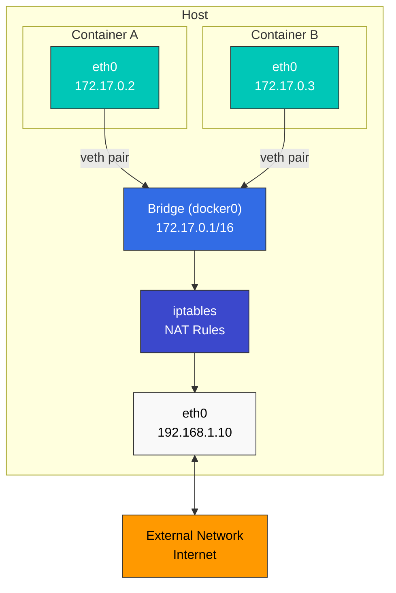

# Linux Basics

> **サポート対象バージョン**: 主要なすべてのLinuxディストリビューション (Ubuntu 20.04+, CentOS/RHEL 8+, Debian 11+) **最終更新**: February 11, 2026

Linuxの基礎を理解することは、Kubernetesとcontainer技術を理解するうえで不可欠です。このドキュメントでは、Kubernetes環境で特に重要となるLinuxの中核概念を扱います。

## Lab Environment Setup

このドキュメントの例に沿って進めるには、次の環境が必要です。

### Required Environment

* Linux operating system（Ubuntu 20.04+、CentOS/RHEL 8+、Debian 11+を推奨）
* Terminal access
* sudo privileges

### Cloud Environment Setup (Optional)

AWS EC2インスタンスを使用する場合:

```bash
# Start an Amazon Linux 2 instance
aws ec2 run-instances \
  --image-id ami-0c55b159cbfafe1f0 \
  --instance-type t3.micro \
  --key-name your-key-pair \
  --security-group-ids sg-12345678 \
  --subnet-id subnet-12345678

# SSH connection
ssh -i your-key.pem ec2-user@your-instance-public-ip
```

### Local Environment Setup (Optional)

ローカルで練習する場合は、次のいずれかを使用できます。

* **VirtualBox + Vagrant**: 仮想マシン環境をセットアップします
* **WSL2**: Windows上でLinux環境を使用します
* **Docker**: container環境で練習します

## Table of Contents

* [Linux Kernel and User Space](01-linux-basics.md#linux-kernel-and-user-space)
* [Process Management](01-linux-basics.md#process-management)
* [Namespaces](01-linux-basics.md#namespaces)
* [cgroups (Control Groups)](01-linux-basics.md#cgroups-control-groups)
* [File System](01-linux-basics.md#file-system)
* [Networking Basics](01-linux-basics.md#networking-basics)
* [Security Context](01-linux-basics.md#security-context)
* [systemd and Service Management](01-linux-basics.md#systemd-and-service-management)
* [Kernel Parameters and Modules](01-linux-basics.md#kernel-parameters-and-modules)
* [System Resource Limits](01-linux-basics.md#system-resource-limits)
* [Log Management](01-linux-basics.md#log-management)
* [DNS and Network Configuration](01-linux-basics.md#dns-and-network-configuration)
* [Time Synchronization](01-linux-basics.md#time-synchronization)
* [Package Management](01-linux-basics.md#package-management)
* [Essential Linux Commands](01-linux-basics.md#essential-linux-commands)
* [Container-Related Linux Features](01-linux-basics.md#container-related-linux-features)

## Linux Kernel and User Space

### Role of the Kernel

> **重要概念**: Linux kernelはオペレーティングシステムの中核であり、ハードウェアとソフトウェアの仲介役として機能します。

Linux kernelはオペレーティングシステムの中核であり、ハードウェアとソフトウェアの仲介役として機能します。主な機能は次のとおりです。

* **Process Management**: プロセスの作成、スケジューリング、終了
* **Memory Management**: 仮想メモリと物理メモリの割り当て
* **Device Management**: ハードウェアデバイスとの通信
* **System Call Interface**: user spaceプログラムがkernelサービスにアクセスするための方法を提供します

### User Space

User spaceは、通常のアプリケーションが実行されるメモリ領域です。User spaceプログラムはsystem callを通じてkernelサービスにアクセスします。

### System Call Examples

| System Call | Description           | Related Commands    |
| ----------- | --------------------- | ------------------- |
| `fork()`    | Create new process    | `ps`, `top`         |
| `exec()`    | Execute program       | `bash`, `sh`        |
| `open()`    | Open file             | `cat`, `less`       |
| `read()`    | Read data from file   | `cat`, `grep`       |
| `write()`   | Write data to file    | `echo`, `tee`       |
| `socket()`  | Create network socket | `netstat`, `ss`     |
| `clone()`   | Create namespace      | `unshare`, `docker` |

### Linux Kernel Architecture

## Process Management

### Processes and Threads

* **Process**: 独立したメモリ空間を持つ、実行中プログラムのインスタンス
* **Thread**: プロセス内で実行される作業単位。同じプロセス内のthreadはメモリ空間を共有します

### Process States

* **Running**: 現在CPU上で実行中
* **Waiting**: I/O完了またはイベント発生を待機中
* **Ready**: 実行可能だがCPU割り当てを待機中
* **Zombie**: 終了済みだが、親プロセスがその状態を確認していない
* **Stopped**: 一時停止状態

### Key Process Management Commands

```bash
# View process list
ps aux

# Real-time process monitoring
top

# Enhanced real-time process monitoring
htop

# Terminate process
kill <PID>
killall <process-name>

# Background execution
command &

# Job management
jobs
fg %<job-number>
bg %<job-number>
```

## Namespaces

Namespacesは、各グループがシステムリソースを独立して見られるようにプロセスグループを分離するLinux kernel機能です。これはcontainer技術の中核要素です。

### Main Namespace Types

* **PID Namespace**: プロセスIDの分離。containerが独自のPID 1 (init)を持てるようにします
* **Network Namespace**: ネットワークスタックの分離（interface、IP address、routing table、firewallなど）。container networkingの基盤です
* **Mount Namespace**: ファイルシステムのmount point分離。containerごとに独立したファイルシステムを提供します
* **UTS Namespace**: hostnameとdomain nameの分離。各containerに一意のhost識別子を与えます
* **IPC Namespace**: プロセス間通信リソースの分離（shared memory、semaphore、message queueなど）。microservices architectureでのservice分離に重要です
* **User Namespace**: user IDとgroup IDの分離。セキュリティ強化のためのrootless container実行をサポートします
* **cgroup Namespace**: cgroup root directoryの分離。container内でresource limitの可視性を提供します
* **Time Namespace**: system clockの分離。containerごとに独立した時刻設定を可能にします (Linux 5.6+)

### Namespace-Related Commands

```bash
# Check process namespaces
ls -la /proc/<PID>/ns/

# Execute command in new namespace
unshare --net --pid --fork --mount-proc bash

# Enter existing process's namespace
nsenter --target <PID> --net --pid bash

# Create and manage network namespaces
ip netns add <name>
ip netns exec <name> <command>

# Using user namespace for rootless container execution
unshare --user --map-root-user --mount --net bash

# Using time namespace (Linux 5.6+)
unshare --time bash
```

## cgroups (Control Groups)

cgroupsは、プロセスグループのリソース使用量を制限し分離するLinux kernel機能です。containerのresource limitを実装するために使用されます。cloud-native環境とKubernetesにおけるリソース管理の中核技術です。

### Main cgroups Features

* **CPU Time Limiting**: プロセスグループが使用できるCPU時間を制限し、CPU coreを割り当てます
* **Memory Limiting**: プロセスグループが使用できるメモリを制限し、OOM (Out of Memory) 動作を制御します
* **Block I/O Limiting**: ディスクI/O bandwidthの制限とpriority設定
* **Network Bandwidth Limiting**: ネットワークtrafficの制限（tcと組み合わせて使用）
* **Device Access Control**: 特定デバイスへのアクセス制御と権限管理
* **PIDs Control**: fork bombを防ぐためにプロセス作成数を制限します
* **Freezer**: プロセスグループの一時停止と再開（containerの一時停止に使用）
* **cpuset**: プロセスを特定のCPU coreとNUMA nodeに結び付けます

### cgroups v1 and v2

* **cgroups v1**: リソース種別ごとに別々のhierarchyを持ち、legacy systemで今も使用されています
* **cgroups v2**: より一貫した管理のための統合された単一hierarchyで、現代的なディストリビューションではdefaultです
* **Hybrid Mode**: 新機能を活用しながら互換性を維持するためにv1とv2を併用します

### cgroups-Related Commands

```bash
# Check cgroups
ls -la /sys/fs/cgroup/                     # cgroups v2
ls -la /sys/fs/cgroup/cpu /sys/fs/cgroup/memory  # cgroups v1

# cgroups management through systemd (modern approach)
systemctl set-property <service-name> CPUQuota=20%
systemctl set-property <service-name> MemoryLimit=1G
systemctl set-property <service-name> IOWeight=500

# Check process cgroup
cat /proc/<PID>/cgroup

# Direct cgroups v2 manipulation (advanced)
echo $$ > /sys/fs/cgroup/user.slice/cgroup.procs
echo "max 100000" > /sys/fs/cgroup/user.slice/memory.max
echo "100000 500000" > /sys/fs/cgroup/user.slice/memory.high

# Container runtime and cgroups
podman stats  # Monitor container resource usage
docker run --cpus=0.5 --memory=512m nginx  # Set resource limits
```

## File System

### File System Hierarchy

Linuxは、単一のroot directory (`/`) から始まる階層型ファイルシステム構造を持ちます。

主なdirectory:

* `/bin`: 基本コマンド
* `/sbin`: システム管理コマンド
* `/etc`: システム設定ファイル
* `/home`: ユーザーのhome directory
* `/var`: 変動データ（log、cacheなど）
* `/tmp`: 一時ファイル
* `/usr`: ユーザープログラムとデータ
* `/proc`: プロセスとkernel情報（virtual file system）
* `/sys`: システムとハードウェア情報（virtual file system）

### File System Types

* **ext4**: defaultのLinux file system
* **XFS**: 大規模file systemに適しています
* **Btrfs**: snapshotや圧縮などの高度な機能を提供します
* **OverlayFS**: 複数のdirectoryを単一のdirectoryとして表します（containerで一般的に使用）
* **tmpfs**: メモリベースの一時file system

### Mount and Volumes

```bash
# Mount file system
mount -t <filesystem-type> <source> <mount-point>

# Check mounted file systems
mount
df -h

# Unmount file system
umount <mount-point>
```

## Networking Basics

### Network Interfaces

* **lo**: Loopback interface (127.0.0.1)
* **eth0, ens3, etc.**: 物理network interface
* **docker0, cni0, etc.**: 仮想bridge interface（container networking）

### Network Configuration Commands

```bash
# Check network interfaces
ip addr show
ifconfig

# Check routing table
ip route
route -n

# Check network connections
netstat -tuln
ss -tuln

# Network packet analysis
tcpdump -i <interface>
```

### Network Namespaces and Virtual Interfaces

```bash
# Create network namespace
ip netns add <namespace-name>

# Create virtual ethernet pair
ip link add <veth1> type veth peer name <veth2>

# Connect virtual interface to namespace
ip link set <veth2> netns <namespace-name>
```

## Security Context

### Users and Groups

* **UID (User ID)**: ユーザー識別子
* **GID (Group ID)**: グループ識別子
* **root (UID 0)**: 管理権限を持つ特別なユーザー

### File Permissions

Linuxのfile permissionは、owner、group、other userに対するread (r)、write (w)、execute (x) 権限で構成されます。

### Permission-Related Commands

```bash
# Change file permissions
chmod 755 <filename>  # rwxr-xr-x
chmod u+x <filename>  # Add execute permission for owner

# Change file owner
chown <user>:<group> <filename>

# Special permissions
chmod 4755 <filename>  # Set setuid
chmod 2755 <filename>  # Set setgid
chmod 1755 <filename>  # Set sticky bit
```

### SELinux and AppArmor

* **SELinux (Security-Enhanced Linux)**: NSAによって開発されたmandatory access control system
* **AppArmor**: プログラムごとのsecurity profileを使用するaccess control system

```bash
# Check SELinux status
getenforce

# Change SELinux mode
setenforce 0  # Permissive mode
setenforce 1  # Enforcing mode

# Check AppArmor status
aa-status

# AppArmor profile management
aa-enforce /etc/apparmor.d/<profile>
aa-complain /etc/apparmor.d/<profile>
```

## systemd and Service Management

systemdは、現代的なLinux systemのinit systemおよびservice managerです。Kubernetes node上でkubeletやcontainerdなどの中核serviceを管理するために使用されます。

### Main systemd Features

* **Service Management**: system serviceの開始、停止、再起動、有効化/無効化
* **Dependency Management**: service dependencyの自動管理と並列startup
* **Logging**: journaldによる統合log管理
* **Timers**: cronを置き換えられるtimer unit
* **Resource Management**: cgroupsを通じたservice単位のresource limit

### systemd Unit Types

* **service**: System services (e.g., kubelet.service, containerd.service)
* **socket**: Socket-based activation
* **target**: Unit groups (similar to runlevels)
* **timer**: Scheduled tasks
* **mount**: File system mounts
* **device**: Device units

### systemd Commands

```bash
# Check service status
systemctl status kubelet
systemctl status containerd

# Service control
systemctl start <service>
systemctl stop <service>
systemctl restart <service>
systemctl reload <service>  # Reload configuration

# Set auto-start at boot
systemctl enable <service>
systemctl disable <service>

# Check service logs
journalctl -u kubelet -f  # Real-time logs
journalctl -u kubelet --since "1 hour ago"
journalctl -u kubelet --no-pager

# List all services
systemctl list-units --type=service
systemctl list-unit-files --type=service

# Check failed services
systemctl --failed

# Reload systemd configuration
systemctl daemon-reload
```

### Writing systemd Unit Files

Kubernetes関連serviceのsystemd unit fileの例:

```ini
# /etc/systemd/system/kubelet.service
[Unit]
Description=kubelet: The Kubernetes Node Agent
Documentation=https://kubernetes.io/docs/
Wants=network-online.target
After=network-online.target

[Service]
ExecStart=/usr/bin/kubelet
Restart=always
StartLimitInterval=0
RestartSec=10

[Install]
WantedBy=multi-user.target
```

### systemd Resource Limits

```bash
# CPU limit (20%)
systemctl set-property kubelet CPUQuota=20%

# Memory limit (1GB)
systemctl set-property kubelet MemoryLimit=1G

# I/O weight setting (100-1000, default 100)
systemctl set-property kubelet IOWeight=500

# Check settings
systemctl show kubelet | grep -E 'CPUQuota|MemoryLimit|IOWeight'
```

## Kernel Parameters and Modules

### Kernel Parameter Settings via sysctl

sysctlは、実行中のkernel parameterを照会および変更するためのtoolです。Kubernetes clusterを設定する際のnetwork parameterとsystem parameterのtuningに不可欠です。

#### Key sysctl Settings Required for Kubernetes

```bash
# Enable IP forwarding (required for container networking)
sysctl -w net.ipv4.ip_forward=1
sysctl -w net.ipv6.conf.all.forwarding=1

# Enable bridge traffic to pass through iptables (required for CNI plugins)
sysctl -w net.bridge.bridge-nf-call-iptables=1
sysctl -w net.bridge.bridge-nf-call-ip6tables=1

# Increase maximum file descriptor count
sysctl -w fs.file-max=2097152

# Network performance tuning
sysctl -w net.core.somaxconn=32768
sysctl -w net.ipv4.tcp_max_syn_backlog=8192
sysctl -w net.core.netdev_max_backlog=16384

# ARP cache settings (for large clusters)
sysctl -w net.ipv4.neigh.default.gc_thresh1=80000
sysctl -w net.ipv4.neigh.default.gc_thresh2=90000
sysctl -w net.ipv4.neigh.default.gc_thresh3=100000

# Check current settings
sysctl net.ipv4.ip_forward
sysctl -a | grep bridge-nf-call

# Persistent settings (/etc/sysctl.conf or /etc/sysctl.d/*.conf)
cat <<EOF | sudo tee /etc/sysctl.d/99-kubernetes.conf
net.ipv4.ip_forward = 1
net.bridge.bridge-nf-call-iptables = 1
net.bridge.bridge-nf-call-ip6tables = 1
EOF

# Apply settings
sysctl --system
```

### Kernel Module Management

多くのCNI pluginsとstorage driversは、特定のkernel modulesを必要とします。

```bash
# Load modules
modprobe overlay  # OverlayFS (container storage)
modprobe br_netfilter  # Bridge networking
modprobe ip_vs  # IPVS load balancing (kube-proxy IPVS mode)
modprobe ip_vs_rr  # Round Robin algorithm
modprobe ip_vs_wrr  # Weighted Round Robin
modprobe ip_vs_sh  # Source Hashing

# Check loaded modules
lsmod | grep overlay
lsmod | grep br_netfilter

# Check module information
modinfo overlay

# Set auto-load at boot
cat <<EOF | sudo tee /etc/modules-load.d/kubernetes.conf
overlay
br_netfilter
ip_vs
ip_vs_rr
ip_vs_wrr
ip_vs_sh
EOF

# Unload module
modprobe -r <module-name>
```

### Kernel Version and Feature Check

```bash
# Check kernel version
uname -r

# Check kernel compile options
cat /boot/config-$(uname -r) | grep OVERLAY
cat /boot/config-$(uname -r) | grep NETFILTER

# Check available kernel features
cat /proc/filesystems  # Supported file systems
cat /proc/sys/net/ipv4/ip_forward  # IP forwarding status
```

## System Resource Limits

### ulimit - Per-User Resource Limits

ulimitは、プロセスが使用できるsystem resourceを制限します。Kubernetes nodeで十分なリソースを確保するために調整が必要になる場合があります。

```bash
# Check current limits
ulimit -a

# Key limit items
ulimit -n      # Number of open file descriptors
ulimit -u      # Maximum number of processes
ulimit -m      # Maximum memory size
ulimit -v      # Virtual memory size

# Change limits (current session)
ulimit -n 65536  # Increase file descriptors to 65536

# Persistent settings (/etc/security/limits.conf)
sudo tee -a /etc/security/limits.conf <<EOF
*               soft    nofile          65536
*               hard    nofile          65536
*               soft    nproc           32768
*               hard    nproc           32768
EOF

# Settings for specific users/groups
sudo tee -a /etc/security/limits.conf <<EOF
root            soft    nofile          65536
root            hard    nofile          65536
@docker         soft    nofile          65536
@docker         hard    nofile          65536
EOF
```

### PAM Limit Settings

```bash
# Check PAM settings
cat /etc/pam.d/common-session
cat /etc/pam.d/common-session-noninteractive

# Add to PAM settings to apply limits.conf
echo "session required pam_limits.so" | sudo tee -a /etc/pam.d/common-session
```

### Per-Process Resource Checking

```bash
# Check current resource limits for a process
cat /proc/<PID>/limits

# Check file descriptors for a specific process
ls -l /proc/<PID>/fd | wc -l
```

## Log Management

### journald - systemd Integrated Logging

journaldは、Kubernetes node上のsystem service logを管理するsystemdのlogging systemです。

```bash
# Full system logs
journalctl

# Specific service logs
journalctl -u kubelet
journalctl -u containerd
journalctl -u docker

# Real-time logs (similar to tail -f)
journalctl -u kubelet -f

# Time range specification
journalctl --since "2025-11-24 10:00:00"
journalctl --since "1 hour ago"
journalctl --since yesterday
journalctl --until "2025-11-24 12:00:00"

# Filter by priority
journalctl -p err        # Errors only
journalctl -p warning    # Warnings and above
journalctl -p debug      # All including debug

# Change output format
journalctl -u kubelet -o json        # JSON format
journalctl -u kubelet -o json-pretty # Pretty JSON
journalctl -u kubelet -o cat         # Messages only

# Boot logs
journalctl -b           # Current boot logs
journalctl -b -1        # Previous boot logs
journalctl --list-boots # Boot list

# Check disk usage
journalctl --disk-usage

# Clean logs
journalctl --vacuum-time=7d   # Delete logs older than 7 days
journalctl --vacuum-size=1G   # Delete logs over 1GB
```

### journald Configuration

```bash
# journald configuration file
sudo vi /etc/systemd/journald.conf

# Key configuration options
# Storage=persistent        # Persistent storage to disk
# SystemMaxUse=1G          # Maximum disk usage
# SystemKeepFree=500M      # Minimum free space
# MaxRetentionSec=1month   # Maximum retention period

# Apply configuration
sudo systemctl restart systemd-journald
```

### Traditional syslog

一部のシステムでは今もsyslogが使用されています。

```bash
# syslog file locations
/var/log/syslog         # Debian/Ubuntu
/var/log/messages       # RHEL/CentOS

# Real-time log viewing
tail -f /var/log/syslog

# Log search
grep "kubelet" /var/log/syslog
grep -i "error" /var/log/syslog
```

### Log Rotation

log fileが無制限に増大するのを防ぐために、log rotationを設定します。

```bash
# logrotate configuration
sudo vi /etc/logrotate.d/kubernetes

# Example configuration
/var/log/kubernetes/*.log {
    daily
    rotate 7
    missingok
    notifempty
    compress
    delaycompress
    copytruncate
}

# Run rotation manually
sudo logrotate -f /etc/logrotate.d/kubernetes
```

## DNS and Network Configuration

### DNS Configuration

DNSはKubernetes cluster内のservice discoveryの中核です。

```bash
# DNS configuration file
cat /etc/resolv.conf

# Example configuration
nameserver 8.8.8.8
nameserver 8.8.4.4
search cluster.local svc.cluster.local
options ndots:5

# DNS lookup test
nslookup kubernetes.default.svc.cluster.local
dig kubernetes.default.svc.cluster.local

# hosts file
cat /etc/hosts
```

### systemd-resolved

現代的なLinuxディストリビューションはsystemd-resolvedを使用します。

```bash
# Check systemd-resolved status
systemctl status systemd-resolved

# Check DNS servers
resolvectl status

# DNS cache statistics
resolvectl statistics

# Clear DNS cache
resolvectl flush-caches
```

### Network Configuration Files

```bash
# NetworkManager (RHEL/CentOS 8+, Ubuntu 18.04+)
nmcli connection show
nmcli device status

# netplan (Ubuntu 18.04+)
cat /etc/netplan/*.yaml

# Example netplan configuration
network:
  version: 2
  ethernets:
    eth0:
      dhcp4: true
      nameservers:
        addresses: [8.8.8.8, 8.8.4.4]

# Apply configuration
sudo netplan apply
```

## Time Synchronization

時刻同期は分散システムで非常に重要です。Kubernetes cluster内のすべてのnodeは正確な時刻を維持する必要があります。

### chronyd (Recommended)

chronydは、ntpdより高速に時刻を同期する現代的なNTP clientです。

```bash
# Install chronyd (RHEL/CentOS)
sudo yum install chrony

# Install chronyd (Ubuntu/Debian)
sudo apt install chrony

# Check service status
systemctl status chronyd

# Check time synchronization status
chronyc tracking

# NTP server list
chronyc sources

# Detailed information
chronyc sourcestats

# Manual time synchronization
sudo chronyc makestep
```

### chronyd Configuration

```bash
# Configuration file
sudo vi /etc/chrony.conf

# Key settings
# NTP server configuration
server 0.pool.ntp.org iburst
server 1.pool.ntp.org iburst
server 2.pool.ntp.org iburst
server 3.pool.ntp.org iburst

# Fast synchronization
makestep 1.0 3

# Apply configuration
sudo systemctl restart chronyd
```

### timesyncd (Ubuntu Default)

Ubuntuはdefaultでsystemd-timesyncdを使用します。

```bash
# Check status
timedatectl status

# NTP synchronization status
timedatectl show-timesync --all

# Configuration file
sudo vi /etc/systemd/timesyncd.conf

# Example configuration
[Time]
NTP=0.pool.ntp.org 1.pool.ntp.org
FallbackNTP=time.google.com

# Restart service
sudo systemctl restart systemd-timesyncd
```

### Timezone Settings

```bash
# Check current time and timezone
timedatectl

# List timezones
timedatectl list-timezones

# Change timezone
sudo timedatectl set-timezone Asia/Seoul

# Manually set time (when NTP is disabled)
sudo timedatectl set-time "2025-11-24 12:00:00"

# Enable/disable NTP
sudo timedatectl set-ntp true
```

## Package Management

Kubernetesおよび関連toolをinstallして管理するためのpackage managerの使い方です。

### apt (Debian/Ubuntu)

```bash
# Update package list
sudo apt update

# Upgrade packages
sudo apt upgrade

# Install package
sudo apt install <package-name>

# Remove package
sudo apt remove <package-name>
sudo apt purge <package-name>  # Remove configuration files as well

# Search packages
apt search <keyword>

# Package information
apt show <package-name>

# List installed packages
apt list --installed

# Add repository (Kubernetes example)
sudo apt install -y apt-transport-https ca-certificates curl
curl -fsSL https://pkgs.k8s.io/core:/stable:/v1.28/deb/Release.key | \
  sudo gpg --dearmor -o /etc/apt/keyrings/kubernetes-apt-keyring.gpg
echo 'deb [signed-by=/etc/apt/keyrings/kubernetes-apt-keyring.gpg] \
  https://pkgs.k8s.io/core:/stable:/v1.28/deb/ /' | \
  sudo tee /etc/apt/sources.list.d/kubernetes.list

# Clean unnecessary packages
sudo apt autoremove
sudo apt autoclean
```

### yum/dnf (RHEL/CentOS/Fedora)

```bash
# Install package
sudo yum install <package-name>
sudo dnf install <package-name>  # Fedora/RHEL 8+

# Update packages
sudo yum update
sudo dnf update

# Remove package
sudo yum remove <package-name>
sudo dnf remove <package-name>

# Search packages
yum search <keyword>
dnf search <keyword>

# Package information
yum info <package-name>
dnf info <package-name>

# List installed packages
yum list installed
dnf list installed

# Add repository (Kubernetes example)
cat <<EOF | sudo tee /etc/yum.repos.d/kubernetes.repo
[kubernetes]
name=Kubernetes
baseurl=https://pkgs.k8s.io/core:/stable:/v1.28/rpm/
enabled=1
gpgcheck=1
gpgkey=https://pkgs.k8s.io/core:/stable:/v1.28/rpm/repodata/repomd.xml.key
EOF

# Clean cache
sudo yum clean all
sudo dnf clean all
```

### Package Version Locking

Kubernetes componentsにはversion compatibility requirementsがあるため、自動updateは防止する必要があります。

```bash
# apt (Ubuntu/Debian)
sudo apt-mark hold kubelet kubeadm kubectl

# Remove apt hold
sudo apt-mark unhold kubelet kubeadm kubectl

# yum (RHEL/CentOS)
sudo yum install yum-plugin-versionlock
sudo yum versionlock add kubelet kubeadm kubectl

# Remove yum versionlock
sudo yum versionlock delete kubelet kubeadm kubectl
```

## Essential Linux Commands

### File and Directory Management

```bash
ls -la           # List files (including hidden)
cd <directory>   # Change directory
pwd              # Print current directory
mkdir -p <path>  # Create directory (create parent directories if needed)
rm -rf <path>    # Remove files/directories
cp -r <source> <destination> # Copy files/directories
mv <source> <destination>    # Move or rename files/directories
find <path> -name "<pattern>" # Search files
```

### Text Processing

```bash
cat <file>        # Output file contents
less <file>       # View file contents page by page
grep "<pattern>" <file> # Search pattern in file
sed 's/<pattern>/<replacement>/' <file> # Text substitution
awk '{print $1}' <file> # Text processing
```

### System Information

```bash
uname -a         # Kernel information
lsb_release -a   # Distribution information
free -h          # Memory usage
df -h            # Disk usage
du -sh <path>    # Directory size
```

### Process and Service Management

```bash
systemctl status <service> # Check service status
systemctl start/stop/restart <service> # Service control
journalctl -u <service> # View service logs
```

## Container-Related Linux Features

### OverlayFS

OverlayFSは、複数のdirectoryを単一のdirectoryとして表すunion mount file systemです。Dockerなどのcontainer runtimeがimage layerを実装するために使用します。

### Network Bridge and NAT

Container networkingは、主にbridge interfaceとNAT (Network Address Translation) を使用して実装されます。



### System Call Filtering (seccomp)

seccomp (Secure Computing Mode) は、プロセスが使用できるsystem callを制限するLinux kernel機能です。container securityを強化するために使用されます。

### Capabilities Restriction

Linux capabilitiesは、従来のroot privilegesをより小さな権限単位に分割します。Containerは、セキュリティを強化するために必要なcapabilitiesだけを受け取ります。

主なcapabilities:

* `CAP_NET_ADMIN`: ネットワーク設定の変更
* `CAP_SYS_ADMIN`: システム管理タスク
* `CAP_CHOWN`: ファイル所有権の変更
* `CAP_DAC_OVERRIDE`: file permissionの回避

## Conclusion

Linuxの基礎と機能は、Kubernetesとcontainer技術を理解するために不可欠です。このドキュメントで扱った主なトピックの要約は次のとおりです。

### Core Technologies

* **Namespaces and cgroups**: containerの分離とリソース管理の基盤
* **OverlayFS**: container image layeringの中核
* **systemd**: Kubernetes node service management

### Essential Operations Knowledge

* **Kernel Parameter Tuning**: sysctlによるnetworkとsystemの最適化
* **Module Management**: CNI pluginとstorage driverのサポート
* **Log Management**: journaldによるsystem logとservice logの分析
* **Time Synchronization**: 分散システムで一貫性を維持します

### Troubleshooting

* **Resource Limits**: ulimitとcgroupsによるリソース管理
* **Networking**: DNS、bridge、iptables設定
* **Package Management**: Kubernetes componentsのversion管理

このLinuxの基礎により、Kubernetes環境で問題を効果的にtroubleshootし、clusterを最適化して、信頼性高く運用できます。

## Quiz

この章で学んだ内容を確認するには、[Linux Basics Quiz](../quizzes/basics/01-linux-basics-quiz.md)に取り組んでください。

## References

* [The Linux Documentation Project](https://tldp.org/)
* [Linux Kernel Documentation](https://www.kernel.org/doc/)
* [Linux Namespaces](https://man7.org/linux/man-pages/man7/namespaces.7.html)
* [Control Groups v2](https://www.kernel.org/doc/html/latest/admin-guide/cgroup-v2.html)
