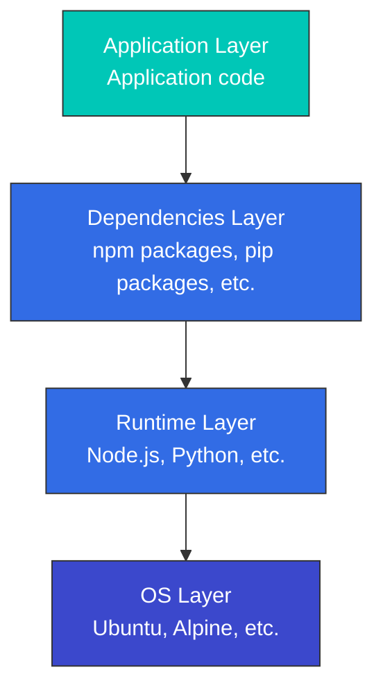

# コンテナ技術

> **対応バージョン**: Docker 20.10+, containerd 1.6+, CRI-O 1.24+ **最終更新**: February 11, 2026

コンテナは、アプリケーションとその依存関係をまとめてパッケージ化し、さまざまな環境で一貫して実行できるようにする技術です。このドキュメントでは、コンテナの基本概念、動作の仕組み、Kubernetes との関係について説明します。

## 目次

* [コンテナとは?](03-container-technology.md#what-is-a-container)
* [コンテナ vs 仮想マシン](03-container-technology.md#container-vs-virtual-machine)
* [コンテナの技術的基盤](03-container-technology.md#technical-foundation-of-containers)
* [Container Runtime](03-container-technology.md#container-runtime)
* [コンテナ Image](03-container-technology.md#container-images)
* [Dockerfile](03-container-technology.md#dockerfile)
* [コンテナ Networking](03-container-technology.md#container-networking)
* [コンテナ Storage](03-container-technology.md#container-storage)
* [コンテナ Security](03-container-technology.md#container-security)
* [コンテナ Lifecycle Management](03-container-technology.md#container-lifecycle-management)
* [Container Orchestration](03-container-technology.md#container-orchestration)
* [AWS 上のコンテナ](03-container-technology.md#containers-on-aws)

## コンテナとは?

コンテナは、アプリケーションの実行に必要なもの（コード、runtime、システムツール、システムライブラリ、設定）をすべて含む、標準化されたソフトウェア単位です。コンテナは、ホスト OS の kernel を共有しながら、分離された環境で実行されます。

### コンテナの主な特徴

1. **可搬性**: 開発、テスト、本番環境をまたいで一貫した実行環境を提供します
2. **軽量性**: 仮想マシンより少ないリソースを使用します
3. **分離**: 他のコンテナやホストシステムから分離された実行環境を提供します
4. **高速な起動と停止**: ミリ秒単位の素早い起動時間を実現します
5. **スケーラビリティ**: 水平方向のスケーリングのために簡単に複製できます
6. **バージョン管理**: image のバージョン管理を通じてアプリケーションのライフサイクルを管理します

### コンテナ技術の歴史

* **2000 年代初期**: Linux VServer や OpenVZ などの初期コンテナ技術が登場
* **2007**: cgroups (Control Groups) が Linux kernel に統合
* **2008**: LXC (Linux Containers) プロジェクトが開始
* **2013**: Docker のリリースによりコンテナ技術が普及
* **2015**: Open Container Initiative (OCI) が設立され、コンテナの標準化が進む
* **2017**: containerd が CNCF プロジェクトに寄贈

## コンテナ vs 仮想マシン

### 仮想マシンアーキテクチャ vs コンテナアーキテクチャ

### 主な違い

| 特性                | コンテナ                         | 仮想マシン                                                |
| ------------------- | -------------------------------- | --------------------------------------------------------- |
| サイズ              | 通常は数十 MB                    | 通常は数 GB                                               |
| 起動時間            | 数秒以下                         | 数分                                                      |
| 分離レベル          | プロセスレベルの分離             | ハードウェアレベルの分離                                  |
| OS                  | ホスト OS kernel を共有          | 各 VM に完全な OS が必要                                  |
| パフォーマンス      | ほぼネイティブ                   | 一定のオーバーヘッド                                      |
| セキュリティ        | 比較的低い（kernel を共有）      | 比較的高い（完全な分離）                                  |
| リソース効率        | 高い                             | 中程度                                                    |
| ユースケース        | Microservices、CI/CD、dev/test   | Legacy apps、多様な OS 要件、高いセキュリティ要件         |

## コンテナの技術的基盤

コンテナは、複数の Linux kernel 機能を使用して実装されています。これらの技術は 01-linux-basics.md で詳しく扱っています。ここでは、それらがコンテナとどのように関係するかに焦点を当てます。

### Namespaces による分離

コンテナは Linux namespaces を使用してプロセスを分離します。各コンテナは独自の namespaces セットを持ち、独立した実行環境を提供します。

```bash
# Check container namespaces
docker inspect <container-id> | grep -A 10 "Pid"
ls -la /proc/<pid>/ns/

# Check processes inside container (isolated PID namespace)
docker exec <container-id> ps aux

# Check same process from host (actual PID)
ps aux | grep <process-name>
```

**コンテナで使用される Namespaces**:

* **PID**: コンテナは独自のプロセスツリーを持ちます（PID 1 から開始）
* **Network**: 独立したネットワークスタック（IP アドレス、ルーティングテーブル、ポート）
* **Mount**: 独立したファイルシステムビュー
* **UTS**: 独立した hostname
* **IPC**: 独立したプロセス間通信空間
* **User**: 独立した user ID mapping（任意）

### cgroups によるリソース制限

コンテナは cgroups を使用してリソース使用量を制限し、監視します。

```bash
# Run container with CPU limit
docker run --cpus=0.5 --memory=512m nginx

# Check container resource usage
docker stats <container-id>

# Check container cgroup settings
docker inspect <container-id> | grep -A 20 "Cgroup"

# Check container cgroup from host
cat /sys/fs/cgroup/system.slice/docker-<container-id>.scope/cpu.max
cat /sys/fs/cgroup/system.slice/docker-<container-id>.scope/memory.max
```

**コンテナで使用される cgroup リソース制御**:

* **CPU**: CPU 時間の制限と CPU core の割り当て
* **Memory**: メモリ使用量の制限と OOM 動作の制御
* **Block I/O**: ディスク I/O 帯域幅の制限
* **Network**: ネットワーク帯域幅の制限（tc と組み合わせて使用）
* **PIDs**: コンテナ内のプロセス数制限

### OverlayFS による Layer 管理

コンテナ image は OverlayFS を使用して、複数の layer を効率的に管理します。

```bash
# Check image layers
docker history <image-name>

# Check container file system layers
docker inspect <container-id> | grep -A 10 "GraphDriver"

# Check OverlayFS mount information
mount | grep overlay
```

**OverlayFS の構造**:

* **LowerDir**: 読み取り専用の image layers（下位 layer → 上位 layer）
* **UpperDir**: 読み書き可能な container layer
* **WorkDir**: OverlayFS の作業ディレクトリ
* **MergedDir**: 統合ビュー（コンテナから見えるファイルシステム）

### Lab: コンテナの技術的基盤を理解する

```bash
# 1. Run a simple container
docker run -d --name test-container nginx

# 2. Get container PID
CONTAINER_PID=$(docker inspect -f '{{.State.Pid}}' test-container)
echo "Container PID: $CONTAINER_PID"

# 3. Check container namespaces
ls -la /proc/$CONTAINER_PID/ns/

# 4. Check container cgroup
cat /proc/$CONTAINER_PID/cgroup

# 5. Check container file system layers
docker inspect test-container | jq '.[0].GraphDriver'

# 6. Cleanup
docker stop test-container
docker rm test-container
```

## Container Runtime

Container runtime は、コンテナのライフサイクルを管理するソフトウェアです。コンテナ image を実行し、コンテナのリソース使用量を制限し、networking と storage を設定します。

### Container Runtime の階層

1. **Low-level Runtime (OCI Compatible)**
   * **runc**: Docker のデフォルト runtime、OCI 標準実装
   * **crun**: C で書かれた軽量な OCI runtime
   * **kata-containers**: ハードウェア仮想化を使用したセキュリティ強化 runtime
   * **gVisor**: user space で kernel 機能をエミュレートするセキュリティ runtime
2. **High-level Runtime**
   * **containerd**: Docker から分離された業界標準の container runtime
   * **CRI-O**: Kubernetes 向けに特化して設計された軽量 runtime
   * **Docker Engine**: 最も広く利用されているコンテナプラットフォーム

### Kubernetes Container Runtime Interface (CRI)

Kubernetes は CRI (Container Runtime Interface) を通じて、さまざまな container runtime と統合します。CRI は、Kubernetes と container runtime の間に標準化されたインターフェースを提供します。

## コンテナ Image

コンテナ image は、アプリケーションとその依存関係を含む immutable なテンプレートです。image は複数の layer で構成され、それぞれがファイルシステムの変更を表します。

### Image Layers

コンテナ image は、複数の layer を積み重ねて構成されます。各 layer は、前の layer に対する変更を表します。この layer 化アプローチにより、image の共有とキャッシュが効率的になります。



### Image Registries

コンテナ image は registry に保存され、共有されます。主な registry には次のものがあります。

* **Docker Hub**: 最大の public registry
* **Amazon ECR**: AWS の container registry service
* **Google Container Registry**: Google Cloud の registry
* **Azure Container Registry**: Microsoft Azure の registry
* **GitHub Container Registry**: GitHub の container registry
* **Harbor**: オープンソースのエンタープライズグレード registry

### Image Tags and Digests

* **Tag**: image の特定バージョンを識別する、人間が読める名前（例: `nginx:1.21.0`）
* **Digest**: image contents の SHA256 hash で、image の一意な識別子（例: `nginx@sha256:2834dc507516af02784808c5f48b7cbe38b8ed5d0f4837f16e78d00deb7e7767`）

## Dockerfile

Dockerfile は、コンテナ image を build するための instructions を含むテキストファイルです。各 instruction は image に新しい layer を追加します。

### 主要な Dockerfile Instructions

```dockerfile
# Specify base image
FROM node:14-alpine

# Set working directory
WORKDIR /app

# Set environment variables
ENV NODE_ENV=production

# Copy files
COPY package*.json ./
COPY . .

# Run commands
RUN npm install --production

# Expose port
EXPOSE 3000

# Define volume
VOLUME /app/data

# Command to run when container starts
CMD ["node", "server.js"]
```

### Multi-stage Builds

Multi-stage builds は、複数の build stage を使用して最終 image size を削減します。

```dockerfile
# Build stage
FROM node:14 AS build
WORKDIR /app
COPY package*.json ./
COPY . .
RUN npm install
RUN npm run build

# Production stage
FROM nginx:alpine
COPY --from=build /app/dist /usr/share/nginx/html
EXPOSE 80
CMD ["nginx", "-g", "daemon off;"]
```

### Image 最適化テクニック

1. **適切な base image を選択する**: Alpine のような軽量 image を使用します
2. **Multi-stage builds を使用する**: build tools と中間ファイルを除外します
3. **Layer を最小化する**: RUN、COPY、その他の commands をまとめます
4. **不要なファイルを除外する**: .dockerignore ファイルを使用します
5. **Cache を活用する**: 頻繁に変更される layer を後ろに配置します

## コンテナ Networking

コンテナ networking は、コンテナ間、およびコンテナと外部世界との通信を可能にします。

### Network Drivers

Docker はさまざまな network drivers を提供します。

1. **bridge**: デフォルトの network driver。同じホスト上のコンテナ間通信に使用します
2. **host**: ホスト network を直接使用し、分離はありません
3. **overlay**: 複数ホストをまたぐコンテナ通信に使用します
4. **macvlan**: コンテナに MAC address を割り当て、物理ネットワークデバイスのように見せます
5. **none**: すべての networking を無効にします

### Port Mapping

外部からアクセスできるように、コンテナ内部の port をホスト port にマッピングします。

```bash
# Map host port 8080 to container port 80
docker run -p 8080:80 nginx
```

### Container-to-Container Communication

1. **同じ network**: 同じ network 上のコンテナは、コンテナ名で通信できます
2. **Links**: 旧来の方式で、コンテナ間に直接 link を設定します
3. **External network**: ホスト port を通じて通信します

## コンテナ Storage

コンテナはデフォルトでは stateless ですが、永続データ保存にはいくつかの選択肢があります。

### Storage Types

1. **Ephemeral storage**: コンテナ内部のファイルシステムで、コンテナ削除時にデータが失われます
2. **Volumes**: Docker が管理するホストファイルシステム領域
3. **Bind mounts**: 特定のホスト path をコンテナに mount します
4. **tmpfs mounts**: データを memory のみに保存し、高い I/O performance が必要な場合に使用します

### Volume 使用例

```bash
# Create volume
docker volume create my-vol

# Run container using volume
docker run -v my-vol:/app/data nginx

# Use bind mount
docker run -v /host/path:/container/path nginx

# Read-only mount
docker run -v /host/path:/container/path:ro nginx
```

### Data Sharing Patterns

1. **Volume sharing**: 複数のコンテナが同じ volume を使用します
2. **Data volume container**: データのみを含むコンテナを作成し、それを共有します
3. **External storage integration**: AWS EBS、NFS などの外部 storage system を使用します

## コンテナ Security

コンテナ security は、image、container runtime、host system など複数の layer で考慮する必要があります。

### Image Security

1. **Vulnerability scanning**: Trivy、Clair などの tools で image の脆弱性をスキャンします
2. **Trusted base images**: 公式または検証済み image を使用します
3. **Principle of least privilege**: 必要な packages と permissions のみを含めます
4. **Image signing**: Docker Content Trust または Cosign で image に署名し、検証します

### Runtime Security

1. **Privilege restriction**: コンテナを non-root user として実行します
2. **Capabilities restriction**: 必要な Linux capabilities のみを付与します
3. **seccomp profiles**: system calls を制限します
4. **AppArmor/SELinux**: mandatory access controls を適用します
5. **Read-only file system**: 可能な場合はファイルシステムを read-only として mount します

### Security Best Practices

1. **Regular updates**: コンテナ image と host system を定期的に更新します
2. **Network isolation**: 適切な network policies でコンテナ通信を制限します
3. **Secret management**: environment variables の代わりに Docker Secrets や外部 secret management tools を使用します
4. **Resource limits**: CPU、memory、その他の resource usage を制限します
5. **Monitoring and logging**: コンテナ activity を監視し、logs を一元化します

## コンテナ Lifecycle Management

完全なコンテナ lifecycle を理解することは、効果的なコンテナ運用に不可欠です。

### Container States

コンテナにはいくつかの状態があります。

* **Created**: コンテナは作成済みですが、まだ開始されていません
* **Running**: コンテナは実行中です
* **Paused**: コンテナ内のすべてのプロセスが一時停止しています
* **Restarting**: コンテナは再起動中です
* **Exited**: コンテナは終了しています
* **Dead**: コンテナ daemon が削除を試みましたが失敗しました

```bash
# Check container status
docker ps -a

# Detailed status of specific container
docker inspect <container-id> | jq '.[0].State'

# Container state transitions
docker create nginx  # Created state
docker start <container-id>  # Transition to Running state
docker pause <container-id>  # Transition to Paused state
docker unpause <container-id>  # Return to Running state
docker stop <container-id>  # Transition to Exited state
docker rm <container-id>  # Remove container
```

### Creating and Running Containers

```bash
# Create container only (don't start)
docker create --name my-nginx nginx

# Start container
docker start my-nginx

# Create and start container (all at once)
docker run --name my-nginx2 -d nginx

# Run in interactive mode
docker run -it ubuntu bash

# Run in background
docker run -d nginx

# Auto-remove when container exits
docker run --rm nginx

# Run with environment variables
docker run -e "DB_HOST=localhost" -e "DB_PORT=5432" myapp

# Run with port mapping
docker run -p 8080:80 nginx

# Run with volume mount
docker run -v /host/path:/container/path nginx
```

### Controlling Containers

```bash
# List running containers
docker ps

# List all containers (including stopped)
docker ps -a

# Stop container (SIGTERM then SIGKILL)
docker stop <container-id>

# Force kill container (SIGKILL)
docker kill <container-id>

# Restart container
docker restart <container-id>

# Pause container
docker pause <container-id>

# Resume container
docker unpause <container-id>

# Execute command in running container
docker exec -it <container-id> bash
docker exec <container-id> ls -la /app

# Copy files from/to container
docker cp <container-id>:/path/to/file /local/path
docker cp /local/path <container-id>:/path/to/file
```

### Container Logging and Monitoring

```bash
# View container logs
docker logs <container-id>

# Stream real-time logs
docker logs -f <container-id>

# Last N log lines
docker logs --tail 100 <container-id>

# Output logs with timestamps
docker logs -t <container-id>

# Logs since specific time
docker logs --since "2025-11-24T10:00:00" <container-id>

# Check container resource usage
docker stats <container-id>

# All container resource usage
docker stats

# Check container processes
docker top <container-id>

# Container detailed information
docker inspect <container-id>
```

### Cleaning Up Containers

```bash
# Remove all stopped containers
docker container prune

# Remove all unused resources (containers, images, networks, volumes)
docker system prune

# Remove all resources including volumes
docker system prune --volumes

# Check disk usage
docker system df

# Remove image
docker rmi <image-id>

# Remove unused images
docker image prune

# Remove volume
docker volume rm <volume-name>

# Remove unused volumes
docker volume prune

# Remove network
docker network rm <network-name>

# Remove unused networks
docker network prune
```

### Health Checks

自動復旧のために、コンテナの health status を監視します。

```dockerfile
FROM nginx:alpine

# Define health check in Dockerfile
HEALTHCHECK --interval=30s --timeout=3s --start-period=5s --retries=3 \
  CMD wget --quiet --tries=1 --spider http://localhost/ || exit 1
```

```bash
# Define health check at runtime
docker run -d \
  --health-cmd="curl -f http://localhost/ || exit 1" \
  --health-interval=30s \
  --health-timeout=3s \
  --health-retries=3 \
  nginx

# Check health check status
docker inspect <container-id> | jq '.[0].State.Health'
```

### Restart Policies

コンテナ終了時に自動的に再起動するよう設定します。

```bash
# Restart policy options
# - no: Don't restart (default)
# - on-failure: Restart only on failure
# - always: Always restart
# - unless-stopped: Always restart unless explicitly stopped

# Restart on failure (max 3 times)
docker run -d --restart=on-failure:3 nginx

# Always restart
docker run -d --restart=always nginx

# Restart unless explicitly stopped
docker run -d --restart=unless-stopped nginx

# Change restart policy of existing container
docker update --restart=always <container-id>
```

### Debugging Containers

```bash
# Explore container internal file system
docker exec -it <container-id> bash

# Check container environment variables
docker exec <container-id> env

# Check container network information
docker exec <container-id> ip addr
docker exec <container-id> netstat -tuln

# Check container processes
docker exec <container-id> ps aux

# Monitor container events
docker events

# Filter specific container events
docker events --filter container=<container-id>

# Check container changes (compared to image)
docker diff <container-id>
```

## Container Orchestration

Container orchestration は、複数のコンテナを管理し調整するプロセスです。主な機能には、deployment management、scaling、networking、service discovery があります。

### 主な Orchestration Tools

1. **Kubernetes**: 最も広く使用されている container orchestration platform
2. **Docker Swarm**: Docker に組み込まれた orchestration tool。設定がシンプルです
3. **Amazon ECS**: AWS の container orchestration service
4. **HashiCorp Nomad**: コンテナ workload と非コンテナ workload の両方をサポートします

### Orchestration の主な機能

1. **Automated deployment and rollback**: 宣言的な設定によるアプリケーション deployment management
2. **Service discovery and load balancing**: コンテナ通信と負荷分散
3. **Auto-scaling**: 負荷に基づいてコンテナ数を調整します
4. **Self-healing**: 失敗したコンテナを自動的に再起動します
5. **Configuration management**: アプリケーション configuration と secret management
6. **Storage orchestration**: persistent storage management
7. **Batch execution**: one-time job と cron job の実行

## AWS 上のコンテナ

AWS はコンテナ workload 向けにさまざまなサービスを提供しています。

### Amazon ECS (Elastic Container Service)

EC2 instances または AWS Fargate 上でコンテナを実行できる、AWS 独自の container orchestration service です。

**主な機能**:

* AWS services との緊密な統合
* Serverless container execution (Fargate)
* シンプルな設定と管理
* Auto-scaling と load balancing

### Amazon EKS (Elastic Kubernetes Service)

標準の Kubernetes APIs を使用して AWS infrastructure 上で Kubernetes を実行できる、AWS-managed Kubernetes service です。

**主な機能**:

* Managed Kubernetes control plane
* 複数の availability zones にまたがる高可用性
* AWS services との統合
* EC2 と Fargate のサポート

### AWS Fargate

server を管理せずにコンテナを実行できる、serverless container execution environment です。

**主な機能**:

* server management が不要
* コンテナ単位の課金
* ECS および EKS との統合
* Security isolation

### Amazon ECR (Elastic Container Registry)

AWS の managed container image registry service です。

**主な機能**:

* Image vulnerability scanning
* IAM との統合
* Image lifecycle management
* 高可用性とスケーラビリティ

## 用語集

| 用語                  | 説明                                                                                                                          |
| --------------------- | ----------------------------------------------------------------------------------------------------------------------------- |
| **Container**         | アプリケーションとその依存関係をパッケージ化し、どこでも一貫して実行できるようにする標準化されたソフトウェア単位です。       |
| **Image**             | コンテナを作成するために使用される読み取り専用テンプレートで、アプリケーションコード、ライブラリ、依存関係、tools、その他のファイルを含みます。 |
| **Dockerfile**        | コンテナ image を build するための instructions を含むテキストファイルです。                                                  |
| **Registry**          | コンテナ image を保存し配布する repository です。（例: Docker Hub、Amazon ECR）                                                |
| **Container Runtime** | コンテナを実行するソフトウェアです。（例: Docker、containerd、CRI-O）                                                         |
| **Namespace**         | プロセスを分離し、system の他の部分を見えないようにする Linux kernel 機能です。                                                |
| **cgroups**           | process groups の resource usage（CPU、memory など）を制限し監視する Linux kernel 機能です。                                  |
| **Layer**             | コンテナ image は複数の layer で構成され、それぞれが Dockerfile instruction に対応します。                                     |
| **Volume**            | コンテナ data を永続的に保存するための仕組みです。                                                                            |
| **Orchestration**     | 複数コンテナの deployment、management、scaling、networking を自動化するプロセスです。                                          |
| **ECS**               | Amazon Elastic Container Service。AWS の container orchestration service です。                                                |
| **ECR**               | Amazon Elastic Container Registry。AWS の container image registry service です。                                              |
| **Fargate**           | infrastructure management なしでコンテナを実行する、AWS の serverless container execution environment です。                   |

## まとめ

コンテナ技術は、アプリケーションの開発とデプロイ方法を大きく変革しました。可搬性、一貫性、効率性を提供し、開発者の生産性を高め、運用の複雑さを軽減します。Kubernetes のような orchestration tools と組み合わせることで、大規模な分散アプリケーションを効果的に管理できます。

コンテナの基本概念と動作を理解することは、現代的な cloud-native アプリケーションを開発・運用するうえで不可欠です。この知識は、Kubernetes を効果的に活用するための基盤となります。

## クイズ

この章で学んだ内容を確認するには、[コンテナ技術クイズ](../quizzes/basics/03-container-technology-quiz.md)に取り組んでください。

## 参考資料

* [Docker Official Documentation](https://docs.docker.com/)
* [OCI (Open Container Initiative)](https://opencontainers.org/)
* [containerd Project](https://containerd.io/)
* [CNCF Container Runtime Overview](https://www.cncf.io/blog/2019/06/27/an-introduction-to-container-runtimes/)
* [AWS Container Services](https://aws.amazon.com/containers/)
