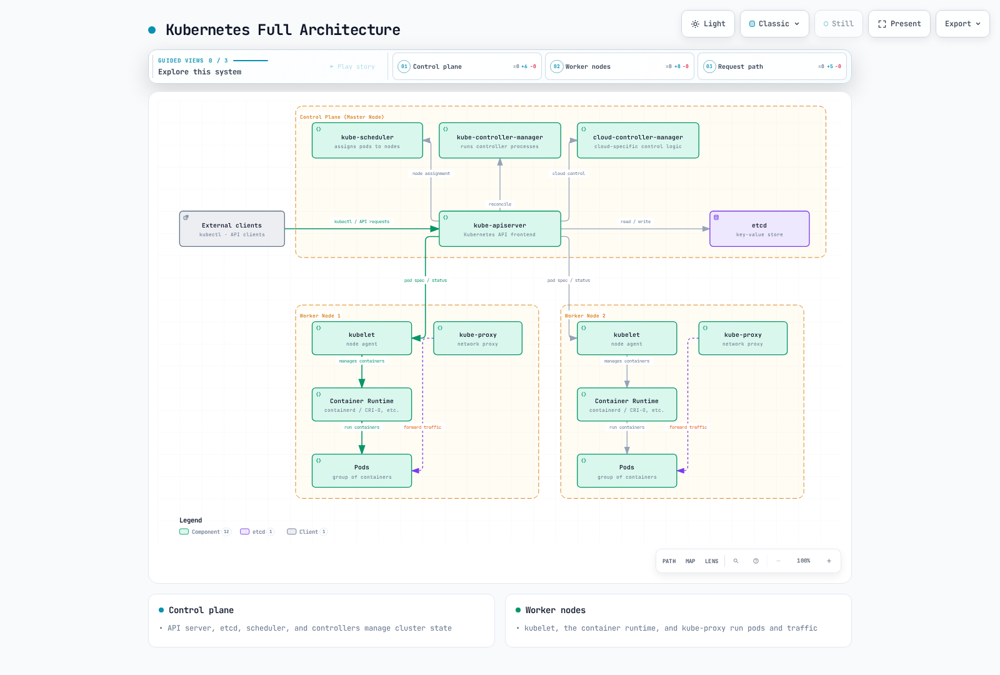

# Kubernetes の概要

> **対応バージョン**: Kubernetes 1.31, 1.32, 1.33 **最終更新**: February 11, 2026

Kubernetes (K8s) は、コンテナ化されたアプリケーションのデプロイ、スケーリング、管理を自動化するオープンソースのコンテナオーケストレーションプラットフォームです。このドキュメントでは、Kubernetes の基本概念、アーキテクチャ、主要コンポーネント、機能について説明します。

## ラボ環境のセットアップ

このドキュメントの例に沿って作業するには、次のツールと環境が必要です。

### 必要なツール

* **kubectl**: Kubernetes クラスターとやり取りするためのコマンドラインツール
* **Container Runtime**: Docker、containerd、CRI-O など
* **minikube** または **kind**: ローカル Kubernetes クラスター（開発および学習用）

### インストール方法

**kubectl のインストール**:

```bash
# macOS
brew install kubectl

# Linux
curl -LO "https://dl.k8s.io/release/$(curl -L -s https://dl.k8s.io/release/stable.txt)/bin/linux/amd64/kubectl"
chmod +x kubectl
sudo mv kubectl /usr/local/bin/

# Windows (PowerShell)
curl -LO "https://dl.k8s.io/release/v1.28.0/bin/windows/amd64/kubectl.exe"
```

**minikube のインストール**:

```bash
# macOS
brew install minikube

# Linux
curl -LO https://storage.googleapis.com/minikube/releases/latest/minikube-linux-amd64
chmod +x minikube-linux-amd64
sudo mv minikube-linux-amd64 /usr/local/bin/minikube

# Windows (PowerShell)
New-Item -Path 'c:\' -Name 'minikube' -ItemType Directory
Invoke-WebRequest -OutFile 'c:\minikube\minikube.exe' -Uri 'https://github.com/kubernetes/minikube/releases/latest/download/minikube-windows-amd64.exe'
```

### ローカルクラスターの起動

```bash
minikube start
```

## 目次

* [Kubernetes とは？](04-kubernetes-introduction.md#what-is-kubernetes)
* [Kubernetes の歴史](04-kubernetes-introduction.md#history-of-kubernetes)
* [Kubernetes アーキテクチャ](04-kubernetes-introduction.md#kubernetes-architecture)
* [Kubernetes の主要コンポーネント](04-kubernetes-introduction.md#kubernetes-main-components)
* [Kubernetes の基本オブジェクト](04-kubernetes-introduction.md#kubernetes-basic-objects)
* [Kubernetes のワークロードリソース](04-kubernetes-introduction.md#kubernetes-workload-resources)
* [Kubernetes の Service とネットワーキング](04-kubernetes-introduction.md#kubernetes-services-and-networking)
* [Kubernetes ストレージ](04-kubernetes-introduction.md#kubernetes-storage)
* [Kubernetes の設定とセキュリティ](04-kubernetes-introduction.md#kubernetes-configuration-and-security)
* [Kubernetes と Amazon EKS の比較](04-kubernetes-introduction.md#kubernetes-vs-amazon-eks)
* [Kubernetes を始める](04-kubernetes-introduction.md#getting-started-with-kubernetes)

## Kubernetes とは？

Kubernetes はギリシャ語で「舵取り役」または「操縦士」を意味し、コンテナ化されたアプリケーションのデプロイ、スケーリング、運用を自動化するオープンソースシステムです。Google の社内 Borg システムから着想を得ており、2014 年にオープンソースとして公開されました。

### Kubernetes の主な機能

1. **Service Discovery と Load Balancing**: コンテナを外部に公開し、トラフィックを分散する
2. **Storage Orchestration**: ローカルまたはクラウドストレージシステムを自動的にマウントする
3. **自動ロールアウトとロールバック**: アプリケーションの状態を段階的に変更し、問題発生時に以前の状態へ復元する
4. **自動ビンパッキング**: リソース要件に基づいてコンテナを Node に配置する
5. **自己修復**: 失敗したコンテナを再起動し、応答しないコンテナを置き換える
6. **Secret と設定の管理**: 機密情報を保存し、設定を更新する
7. **水平スケーリング**: シンプルなコマンドまたは UI によりアプリケーションをスケールする
8. **バッチ実行**: バッチおよび CI ワークロードを管理する

### Kubernetes が解決する課題

* **コンテナオーケストレーション**: 数百から数千のコンテナを効率的に管理する
* **高可用性**: アプリケーションの継続的な運用を確保する
* **スケーラビリティ**: トラフィックの増加に基づく自動スケーリング
* **災害復旧**: 障害発生時の自動復旧
* **リソース効率**: ハードウェアリソースを効率的に利用する
* **宣言的設定**: Infrastructure as Code としてインフラストラクチャを管理する
* **マルチクラウドとハイブリッドクラウド**: 多様な環境で一貫してデプロイと管理を行う

## Kubernetes の歴史

### 背景

* **2003-2013**: Google は Borg と呼ばれるコンテナオーケストレーションシステムを社内で使用
* **2014 年 6 月**: Google が Kubernetes をオープンソースとして公開
* **2015 年 7 月**: Kubernetes 1.0 がリリースされ、Cloud Native Computing Foundation (CNCF) に寄贈
* **2016-2017**: 主要クラウドプロバイダーがマネージド Kubernetes サービスを開始
* **2018 年以降**: コンテナオーケストレーションのデファクトスタンダードとして確立

### 名前の由来

Kubernetes (κυβερνήτης) はギリシャ語で「舵取り役」または「操縦士」を意味します。これは、コンテナ化されたアプリケーションを導く役割を象徴しています。略称の K8s は、「K」と「s」の間に 8 文字あることに由来します。

### ロゴの意味

Kubernetes のロゴは 7 本のスポークを持つ舵輪を描いており、コンテナ化されたアプリケーションの進路を導く Kubernetes の役割を象徴しています。

## Kubernetes アーキテクチャ

Kubernetes はマスター・ノードアーキテクチャに従います。マスターノード（Control Plane）がクラスターを管理し、ワーカーノードが実際のアプリケーションワークロードを実行します。

### Control Plane（Master）コンポーネント


[🔍 インタラクティブ図を表示](https://www.atomai.click/kubernetes-docs/archmaps/en-basics-04-kubernetes-introduction-0.html)

1. **kube-apiserver**: Kubernetes API を公開する Control Plane のフロントエンド
2. **etcd**: すべてのクラスターデータを保存する、一貫性と高可用性を備えたキーバリューストア
3. **kube-scheduler**: Pod を Node に割り当てるコンポーネント
4. **kube-controller-manager**: Controller プロセスを実行するコンポーネント
   * Node Controller: Node がダウンしたときの通知と対応
   * Replication Controller: 正しい数の Pod レプリカを維持
   * Endpoints Controller: Service と Pod を接続
   * Service Account & Token Controller: 新しい Namespace にデフォルトアカウントと API アクセストークンを作成
5. **cloud-controller-manager**: クラウド固有の制御ロジックを含むコンポーネント
   * Node Controller: Node が削除されたかをクラウドプロバイダーで確認
   * Route Controller: クラウドインフラストラクチャにルートを設定
   * Service Controller: クラウドプロバイダーの Load Balancer を作成、更新、削除
   * Volume Controller: Volume を作成、アタッチ、マウント

### Node コンポーネント


[🔍 インタラクティブ図を表示](https://www.atomai.click/kubernetes-docs/archmaps/en-basics-04-kubernetes-introduction-1.html)

1. **kubelet**: 各 Node で実行され、Pod 内のコンテナが稼働していることを保証するエージェント
2. **kube-proxy**: 各 Node で実行され、Kubernetes Service の概念を実装するネットワークプロキシ
3. **Container Runtime**: コンテナの実行を担うソフトウェア（Docker、containerd、CRI-O など）

### 完全なアーキテクチャ



[🔍 インタラクティブ図を表示](https://www.atomai.click/kubernetes-docs/archmaps/en-basics-04-kubernetes-introduction-2.html)

## Kubernetes の主要コンポーネント

### API Server (kube-apiserver)

API Server は Kubernetes API を公開する Control Plane のフロントエンドです。すべての内部および外部リクエストは API Server を介して処理されます。

**主な機能**:

* REST API を提供
* 認証と認可
* リクエスト検証
* etcd との通信
* 水平スケーリングが可能

### etcd

etcd は、すべてのクラスターデータを保存する、一貫性と高可用性を備えたキーバリューストアです。

**主な特徴**:

* 分散システム
* 強整合性
* 高可用性
* セキュアなデータストレージ
* 変更を監視する Watch 機能

### Scheduler (kube-scheduler)

Scheduler は、新しく作成された Pod を実行する Node を選択する Control Plane コンポーネントです。

**スケジューリングプロセス**:

1. **フィルタリング**: Pod を実行できる Node を特定する
2. **スコアリング**: 適切な Node にスコアを割り当てる
3. **バインディング**: Pod を最適な Node に割り当てる

**考慮事項**:

* リソース要件（CPU、メモリ）
* ハードウェア、ソフトウェア、ポリシーの制約
* Affinity/Anti-affinity の指定
* データ局所性
* ワークロードの干渉

### Controller Manager (kube-controller-manager)

Controller Manager は、複数の Controller プロセスを実行する Control Plane コンポーネントです。

**主な Controller**:

* **Node Controller**: Node の状態を監視して対応
* **Replication Controller**: Pod レプリカ数を維持
* **Endpoints Controller**: Service と Pod を接続
* **Service Account & Token Controller**: Namespace のデフォルトアカウントと API トークンを作成
* **Job Controller**: 一回限りのタスクを管理
* **CronJob Controller**: スケジュールされたタスクを管理
* **DaemonSet Controller**: 特定の Pod がすべての Node で実行されることを保証
* **StatefulSet Controller**: ステートフルアプリケーションを管理
* **PV Controller**: PersistentVolume を管理

### Cloud Controller Manager (cloud-controller-manager)

Cloud Controller Manager は、クラウド固有の制御ロジックを含む Control Plane コンポーネントです。

**主な Controller**:

* **Node Controller**: クラウドプロバイダー API を通じて Node の状態を確認
* **Route Controller**: クラウド環境にルートを設定
* **Service Controller**: クラウド Load Balancer を作成、更新、削除
* **Volume Controller**: クラウドストレージ Volume を作成、アタッチ、マウント

### kubelet

kubelet は各 Node で実行され、Pod 内のコンテナが稼働していることを保証するエージェントです。

**主な機能**:

* PodSpec に従ってコンテナを実行
* コンテナの状態を報告
* コンテナのヘルスチェックを実行
* コンテナライフサイクルを管理
* Node の状態を報告

### kube-proxy

kube-proxy は、Kubernetes Service の概念を実装する、各 Node で実行されるネットワークプロキシです。

**主な機能**:

* Service IP とポートのネットワークルールを維持
* 接続を転送
* Load Balancing を実装

**動作モード**:

* **userspace mode**: ユーザー空間でプロキシを実行（レガシー）
* **iptables mode**: Linux iptables を使用した NAT 実装（デフォルト）
* **IPVS mode**: Linux カーネルの IP Virtual Server を使用（高パフォーマンス）

## Kubernetes の基本オブジェクト

Kubernetes オブジェクトは、クラスターの状態を表す永続的なエンティティです。これらのオブジェクトは、クラスター内で実行中のアプリケーション、利用可能なリソース、ポリシーなどを記述します。

### Pod

Pod は Kubernetes における最小のデプロイ可能な単位であり、1 つ以上のコンテナのグループを表します。Pod 内のコンテナはストレージとネットワークを共有し、常に同じ Node に一緒にスケジュールされます。

**主な特徴**:

* 一意の IP アドレスを持つ
* ネットワーク名前空間を共有（同一の IP とポート空間）
* IPC 名前空間を共有
* ホスト名を共有
* コンテナ間で localhost 通信が可能

**Pod の例**:

```yaml
apiVersion: v1
kind: Pod
metadata:
  name: nginx-pod
  labels:
    app: nginx
spec:
  containers:
  - name: nginx
    image: nginx:1.21
    ports:
    - containerPort: 80
  - name: log-sidecar
    image: busybox
    command: ["/bin/sh", "-c", "tail -f /var/log/nginx/access.log"]
    volumeMounts:
    - name: logs
      mountPath: /var/log/nginx
  volumes:
  - name: logs
    emptyDir: {}
```

### Namespace

Namespace は、単一のクラスター内でリソースグループを分離する方法を提供します。これは、複数のチームまたはプロジェクトが同じクラスターを共有する場合に便利です。

**デフォルト Namespace**:

* **default**: デフォルト Namespace
* **kube-system**: Kubernetes システムにより作成されるオブジェクト用の Namespace
* **kube-public**: すべてのユーザーが読み取り可能なオブジェクト用の Namespace
* **kube-node-lease**: Node のハートビート用 Namespace

**Namespace の例**:

```yaml
apiVersion: v1
kind: Namespace
metadata:
  name: development
```

### Label と Selector

Label はオブジェクトに付与されるキーと値のペアであり、オブジェクトの識別と選択に使用されます。Selector は、Label に基づいてオブジェクトをフィルタリングする方法を提供します。

**Label の例**:

```yaml
metadata:
  labels:
    app: nginx
    environment: production
    tier: frontend
```

**Selector の種類**:

* **等価ベース**: `=`, `!=`
* **集合ベース**: `in`, `notin`, `exists`

**Selector の例**:

```yaml
selector:
  matchLabels:
    app: nginx
  matchExpressions:
    - {key: tier, operator: In, values: [frontend, middleware]}
    - {key: environment, operator: NotIn, values: [dev]}
```

### Annotation

Annotation は、オブジェクトに関する識別目的以外のメタデータを保存するキーと値のペアです。Annotation は、ツールやライブラリが使用する情報の保存に役立ちます。

**Annotation の例**:

```yaml
metadata:
  annotations:
    kubernetes.io/created-by: "admin"
    example.com/last-modified: "2023-07-01T12:00:00Z"
    prometheus.io/scrape: "true"
    prometheus.io/port: "9090"
```

### Node

Node は Pod を実行する Kubernetes クラスター内のワーカーマシンです。Node は物理マシンまたは仮想マシンにできます。

**Node の状態**:

* **Addresses**: Hostname、Internal IP、External IP
* **Conditions**: Ready、DiskPressure、MemoryPressure、PIDPressure、NetworkUnavailable
* **Capacity**: CPU、Memory、最大 Pod 数
* **Info**: Kernel バージョン、Container Runtime バージョン、kubelet バージョン

**Node の例**:

```yaml
apiVersion: v1
kind: Node
metadata:
  name: worker-1
  labels:
    kubernetes.io/hostname: worker-1
    node-role.kubernetes.io/worker: ""
    topology.kubernetes.io/zone: us-east-1a
spec:
  # ...
status:
  capacity:
    cpu: "4"
    memory: 8Gi
    pods: "110"
  conditions:
    - type: Ready
      status: "True"
  # ...
```

## Kubernetes のワークロードリソース

ワークロードリソースは、Pod の管理と実行に使用されるオブジェクトです。これらのリソースは、Pod の作成、スケーリング、更新、終了を管理します。

### ReplicaSet

ReplicaSet は、指定された数の Pod レプリカが常に実行されることを保証します。Pod が失敗または削除された場合、ReplicaSet は自動的に置き換えとなる Pod を作成します。

**主な機能**:

* 指定された数の Pod レプリカを維持
* Pod テンプレートを定義
* Selector を通じて Pod を識別

**ReplicaSet の例**:

```yaml
apiVersion: apps/v1
kind: ReplicaSet
metadata:
  name: nginx-replicaset
  labels:
    app: nginx
spec:
  replicas: 3
  selector:
    matchLabels:
      app: nginx
  template:
    metadata:
      labels:
        app: nginx
    spec:
      containers:
      - name: nginx
        image: nginx:1.21
        ports:
        - containerPort: 80
```

### Deployment

Deployment は ReplicaSet をさらに 1 段階抽象化し、アプリケーションの宣言的な更新を提供します。Deployment はローリング更新、ロールバック、スケーリングなどの機能を提供します。

**主な機能**:

* 宣言的なアプリケーション更新
* ローリング更新とロールバック
* Deployment 履歴の管理
* スケーリング

**Deployment の例**:

```yaml
apiVersion: apps/v1
kind: Deployment
metadata:
  name: nginx-deployment
  labels:
    app: nginx
spec:
  replicas: 3
  selector:
    matchLabels:
      app: nginx
  strategy:
    type: RollingUpdate
    rollingUpdate:
      maxSurge: 1
      maxUnavailable: 0
  template:
    metadata:
      labels:
        app: nginx
    spec:
      containers:
      - name: nginx
        image: nginx:1.21
        ports:
        - containerPort: 80
        resources:
          requests:
            cpu: 100m
            memory: 128Mi
          limits:
            cpu: 200m
            memory: 256Mi
        livenessProbe:
          httpGet:
            path: /
            port: 80
          initialDelaySeconds: 30
          periodSeconds: 10
```

### StatefulSet

StatefulSet は、状態の維持を必要とするアプリケーションのためのワークロードリソースです。各 Pod に一意の識別子を割り当て、安定したネットワーク識別子と永続ストレージを提供します。

**主な機能**:

* 安定かつ一意のネットワーク識別子
* 安定した永続ストレージ
* 順次デプロイとスケーリング
* 順次更新

**StatefulSet の例**:

```yaml
apiVersion: apps/v1
kind: StatefulSet
metadata:
  name: mysql
spec:
  selector:
    matchLabels:
      app: mysql
  serviceName: mysql
  replicas: 3
  template:
    metadata:
      labels:
        app: mysql
    spec:
      containers:
      - name: mysql
        image: mysql:8.0
        env:
        - name: MYSQL_ROOT_PASSWORD
          valueFrom:
            secretKeyRef:
              name: mysql-secret
              key: password
        ports:
        - containerPort: 3306
          name: mysql
        volumeMounts:
        - name: data
          mountPath: /var/lib/mysql
  volumeClaimTemplates:
  - metadata:
      name: data
    spec:
      accessModes: ["ReadWriteOnce"]
      storageClassName: "standard"
      resources:
        requests:
          storage: 10Gi
```

### DaemonSet

DaemonSet は、Pod のコピーがすべての Node（または特定の Node）で実行されることを保証します。Node がクラスターに追加されると Pod は自動的に追加され、Node が削除されると Pod も削除されます。

**主なユースケース**:

* ログコレクター（Fluentd、Logstash）
* 監視エージェント（Prometheus Node Exporter）
* ネットワークプラグイン（Calico、Cilium）
* ストレージデーモン（Ceph）

**DaemonSet の例**:

```yaml
apiVersion: apps/v1
kind: DaemonSet
metadata:
  name: fluentd
  namespace: kube-system
spec:
  selector:
    matchLabels:
      name: fluentd
  template:
    metadata:
      labels:
        name: fluentd
    spec:
      tolerations:
      - key: node-role.kubernetes.io/master
        effect: NoSchedule
      containers:
      - name: fluentd
        image: fluentd:v1.14
        resources:
          limits:
            memory: 200Mi
          requests:
            cpu: 100m
            memory: 100Mi
        volumeMounts:
        - name: varlog
          mountPath: /var/log
      volumes:
      - name: varlog
        hostPath:
          path: /var/log
```

### Job

Job は 1 つ以上の Pod を作成し、指定された数の Pod が正常に終了するまで実行を継続します。バッチ処理タスクに適しています。

**主な機能**:

* 一回限りのタスク実行
* 並列タスク実行
* タスク完了を保証
* 失敗時に再試行

**Job の例**:

```yaml
apiVersion: batch/v1
kind: Job
metadata:
  name: pi-calculator
spec:
  completions: 5
  parallelism: 2
  backoffLimit: 3
  template:
    spec:
      containers:
      - name: pi
        image: perl
        command: ["perl", "-Mbignum=bpi", "-wle", "print bpi(2000)"]
      restartPolicy: Never
```

### CronJob

CronJob は、指定されたスケジュールに従って Job を定期的に実行します。Linux の cron ジョブと同様に動作します。

**主な機能**:

* スケジュールに従ったタスク実行
* Cron 式のサポート
* 同時実行ポリシーの設定
* 履歴の上限

**CronJob の例**:

```yaml
apiVersion: batch/v1
kind: CronJob
metadata:
  name: database-backup
spec:
  schedule: "0 2 * * *"  # Run at 02:00 daily
  concurrencyPolicy: Forbid
  successfulJobsHistoryLimit: 3
  failedJobsHistoryLimit: 1
  jobTemplate:
    spec:
      template:
        spec:
          containers:
          - name: backup
            image: database-backup:v1
            env:
            - name: DB_HOST
              value: "db.example.com"
          restartPolicy: OnFailure
```

## Kubernetes の Service とネットワーキング

Kubernetes のネットワーキングモデルは、すべての Pod が一意の IP アドレスを持ち、特別な設定なしに相互通信できるという前提に基づいています。Service は Pod セットに対して安定したエンドポイントを提供します。

### Service

Service は、Pod セットに単一のエンドポイントと Load Balancing を提供します。Pod は動的に作成・削除されるため、Service はこれらの変更があっても安定したネットワークアドレスを提供します。

**Service の種類**:

* **ClusterIP**: クラスター内からのみアクセス可能な Service（デフォルト）
* **NodePort**: 各 Node の IP と特定のポートを通じて外部からアクセス可能
* **LoadBalancer**: クラウドプロバイダーの Load Balancer を使用して外部からアクセス可能
* **ExternalName**: 外部 Service 用の CNAME レコードを作成


[🔍 インタラクティブ図を表示](https://www.atomai.click/kubernetes-docs/archmaps/en-basics-04-kubernetes-introduction-3.html)

**Service の例**:

```yaml
apiVersion: v1
kind: Service
metadata:
  name: nginx-service
spec:
  selector:
    app: nginx
  ports:
  - port: 80
    targetPort: 80
  type: ClusterIP
```

**NodePort Service の例**:

```yaml
apiVersion: v1
kind: Service
metadata:
  name: nginx-nodeport
spec:
  selector:
    app: nginx
  ports:
  - port: 80
    targetPort: 80
    nodePort: 30080
  type: NodePort
```

**LoadBalancer Service の例**:

```yaml
apiVersion: v1
kind: Service
metadata:
  name: nginx-lb
  annotations:
    service.beta.kubernetes.io/aws-load-balancer-type: "nlb"
spec:
  selector:
    app: nginx
  ports:
  - port: 80
    targetPort: 80
  type: LoadBalancer
```

### Ingress

Ingress は、クラスター外部から内部 Service への HTTP および HTTPS ルーティングを管理する API オブジェクトです。Ingress は Load Balancing、SSL 終端、名前ベースの仮想ホスティングなどを提供します。

**Ingress Controller**:

* **NGINX Ingress Controller**: NGINX ベースの Ingress Controller
* **AWS ALB Ingress Controller**: AWS Application Load Balancer ベースの Ingress Controller
* **Traefik**: クラウドネイティブなエッジルーター
* **Istio Ingress**: Service Mesh ベースの Ingress

**Ingress の例**:

```yaml
apiVersion: networking.k8s.io/v1
kind: Ingress
metadata:
  name: example-ingress
  annotations:
    nginx.ingress.kubernetes.io/rewrite-target: /
spec:
  ingressClassName: nginx
  rules:
  - host: example.com
    http:
      paths:
      - path: /app1
        pathType: Prefix
        backend:
          service:
            name: app1-service
            port:
              number: 80
      - path: /app2
        pathType: Prefix
        backend:
          service:
            name: app2-service
            port:
              number: 80
  tls:
  - hosts:
    - example.com
    secretName: example-tls
```

### NetworkPolicy

NetworkPolicy は、Pod 間の通信を制御する方法を提供します。デフォルトではすべての Pod が相互に通信できますが、NetworkPolicy を使用してこれを制限できます。&#x20;


[🔍 インタラクティブ図を表示](https://www.atomai.click/kubernetes-docs/archmaps/en-basics-04-kubernetes-introduction-4.html)

**主な機能**:

* Pod 間の通信を制御
* Namespace 間の通信を制御
* Ingress（受信）および Egress（送信）トラフィックを制御
* ポートおよびプロトコルベースのフィルタリング

**NetworkPolicy の例**:

```yaml
apiVersion: networking.k8s.io/v1
kind: NetworkPolicy
metadata:
  name: db-network-policy
  namespace: default
spec:
  podSelector:
    matchLabels:
      role: db
  policyTypes:
  - Ingress
  - Egress
  ingress:
  - from:
    - podSelector:
        matchLabels:
          role: frontend
    ports:
    - protocol: TCP
      port: 3306
  egress:
  - to:
    - podSelector:
        matchLabels:
          role: monitoring
    ports:
    - protocol: TCP
      port: 9090
```

### DNS

Kubernetes は、Service Discovery をサポートするためにクラスター内で DNS Service を提供します。デフォルトでは CoreDNS が使用されます。

**DNS 名の形式**:

* **Service**: `<service-name>.<namespace>.svc.cluster.local`
* **Pod**: `<pod-IP-address-dots-replaced>.pod.cluster.local`

**DNS 設定の例**:

```yaml
apiVersion: v1
kind: ConfigMap
metadata:
  name: coredns
  namespace: kube-system
data:
  Corefile: |
    .:53 {
        errors
        health
        kubernetes cluster.local in-addr.arpa ip6.arpa {
          pods insecure
          upstream
          fallthrough in-addr.arpa ip6.arpa
        }
        prometheus :9153
        forward . /etc/resolv.conf
        cache 30
        loop
        reload
        loadbalance
    }
```

### Service Mesh

Service Mesh は、マイクロサービス間の通信を管理するインフラストラクチャレイヤーです。Service Mesh は、トラフィック管理、セキュリティ、可観測性を提供します。

**主な Service Mesh**:

* **Istio**: 最も広く使用されている Service Mesh
* **Linkerd**: 軽量な Service Mesh
* **AWS App Mesh**: AWS マネージド Service Mesh

**Istio VirtualService の例**:

```yaml
apiVersion: networking.istio.io/v1alpha3
kind: VirtualService
metadata:
  name: reviews-route
spec:
  hosts:
  - reviews
  http:
  - match:
    - headers:
        end-user:
          exact: jason
    route:
    - destination:
        host: reviews
        subset: v2
  - route:
    - destination:
        host: reviews
        subset: v1
```

## Kubernetes ストレージ

Kubernetes は、コンテナ化されたアプリケーション向けにさまざまなストレージオプションを提供します。Pod が再起動または再スケジュールされた場合でも、データを永続化する方法を提供します。


[🔍 インタラクティブ図を表示](https://www.atomai.click/kubernetes-docs/archmaps/en-basics-04-kubernetes-introduction-5.html)

### Volume

Volume は Pod 内のコンテナにマウントできるディレクトリであり、Pod のライフサイクル中にデータを永続化します。Volume は Pod 内のコンテナ間でデータを共有するためにも使用されます。

**主な Volume の種類**:

* **emptyDir**: 空のディレクトリとして開始され、Pod の削除時に削除される
* **hostPath**: ホスト Node のファイルシステムを Pod にマウントする
* **configMap**: ConfigMap を Volume としてマウントする
* **secret**: Secret を Volume としてマウントする
* **persistentVolumeClaim**: PersistentVolume を Pod にマウントする

**emptyDir Volume の例**:

```yaml
apiVersion: v1
kind: Pod
metadata:
  name: test-pd
spec:
  containers:
  - name: test-container
    image: nginx
    volumeMounts:
    - mountPath: /cache
      name: cache-volume
  volumes:
  - name: cache-volume
    emptyDir: {}
```

### PersistentVolume (PV)

PersistentVolume は、クラスター内のストレージリソースを表す API オブジェクトです。Pod とは独立して存在し、クラスター管理者によってプロビジョニングされます。

**アクセスモード**:

* **ReadWriteOnce (RWO)**: 単一 Node で読み取り/書き込みとしてマウント可能
* **ReadOnlyMany (ROX)**: 複数 Node で読み取り専用としてマウント可能
* **ReadWriteMany (RWX)**: 複数 Node で読み取り/書き込みとしてマウント可能

**PersistentVolume の例**:

```yaml
apiVersion: v1
kind: PersistentVolume
metadata:
  name: pv-example
spec:
  capacity:
    storage: 10Gi
  accessModes:
    - ReadWriteOnce
  persistentVolumeReclaimPolicy: Retain
  storageClassName: standard
  awsElasticBlockStore:
    volumeID: vol-0123456789abcdef0
    fsType: ext4
```

### PersistentVolumeClaim (PVC)

PersistentVolumeClaim は、ユーザーのストレージ要求を表す API オブジェクトです。Pod は PVC を通じて PV にアクセスします。

**PersistentVolumeClaim の例**:

```yaml
apiVersion: v1
kind: PersistentVolumeClaim
metadata:
  name: pvc-example
spec:
  accessModes:
    - ReadWriteOnce
  resources:
    requests:
      storage: 5Gi
  storageClassName: standard
```

**PVC を使用する Pod の例**:

```yaml
apiVersion: v1
kind: Pod
metadata:
  name: mypod
spec:
  containers:
    - name: myfrontend
      image: nginx
      volumeMounts:
      - mountPath: "/var/www/html"
        name: mypd
  volumes:
    - name: mypd
      persistentVolumeClaim:
        claimName: pvc-example
```

### StorageClass

StorageClass は、管理者が提供するストレージの「クラス」を記述します。異なるサービス品質レベル、バックアップポリシー、またはクラスター管理者が定める任意のポリシーを提供できます。

**StorageClass の例**:

```yaml
apiVersion: storage.k8s.io/v1
kind: StorageClass
metadata:
  name: standard
provisioner: kubernetes.io/aws-ebs
parameters:
  type: gp3
  fsType: ext4
reclaimPolicy: Delete
allowVolumeExpansion: true
```

### 動的プロビジョニング

動的プロビジョニングは、ストレージクラスを使用して PVC が要求されたときに PV を自動的に作成する機能です。

**動的プロビジョニングの例**:

```yaml
apiVersion: v1
kind: PersistentVolumeClaim
metadata:
  name: dynamic-pvc
spec:
  accessModes:
    - ReadWriteOnce
  resources:
    requests:
      storage: 10Gi
  storageClassName: standard  # Storage class for dynamic provisioning
```

### CSI (Container Storage Interface)

CSI は、Kubernetes とストレージシステム間の標準インターフェイスを提供します。これにより、ストレージプロバイダーは Kubernetes コードを変更せずに独自のストレージドライバーを開発できます。

**主な CSI Driver**:

* **AWS EBS CSI Driver**: Amazon EBS Volume 管理
* **AWS EFS CSI Driver**: Amazon EFS ファイルシステム管理
* **AWS FSx for Lustre CSI Driver**: FSx for Lustre ファイルシステム管理
* **GCE PD CSI Driver**: Google Compute Engine 永続ディスク管理
* **Azure Disk CSI Driver**: Azure ディスク管理

**CSI Driver のデプロイ例**:

```yaml
apiVersion: storage.k8s.io/v1
kind: StorageClass
metadata:
  name: ebs-sc
provisioner: ebs.csi.aws.com
parameters:
  type: gp3
  fsType: ext4
  encrypted: "true"
volumeBindingMode: WaitForFirstConsumer
```

## Kubernetes の設定とセキュリティ

Kubernetes は、アプリケーションの設定とセキュリティを管理するためのさまざまなオブジェクトとメカニズムを提供します。

### ConfigMap

ConfigMap は、設定データをキーと値のペアとして保存する API オブジェクトです。Pod は ConfigMap データを環境変数、コマンドライン引数、または設定ファイルとして使用できます。

**ConfigMap の例**:

```yaml
apiVersion: v1
kind: ConfigMap
metadata:
  name: app-config
data:
  app.properties: |
    app.name=MyApp
    app.version=1.0.0
    app.environment=production
  log-level: INFO
  max-connections: "100"
```

**ConfigMap を使用する Pod の例**:

```yaml
apiVersion: v1
kind: Pod
metadata:
  name: config-pod
spec:
  containers:
  - name: app
    image: myapp:1.0
    env:
    - name: LOG_LEVEL
      valueFrom:
        configMapKeyRef:
          name: app-config
          key: log-level
    volumeMounts:
    - name: config-volume
      mountPath: /etc/config
  volumes:
  - name: config-volume
    configMap:
      name: app-config
```

### Secret

Secret は、パスワード、トークン、キーなどの機密情報を保存する API オブジェクトです。ConfigMap に似ていますが、機密データ向けに設計されています。

**Secret の種類**:

* **Opaque**: 任意のユーザー定義データ（デフォルト）
* **kubernetes.io/service-account-token**: Service Account トークン
* **kubernetes.io/dockercfg**: シリアル化された \~/.dockercfg ファイル
* **kubernetes.io/dockerconfigjson**: シリアル化された \~/.docker/config.json ファイル
* **kubernetes.io/basic-auth**: Basic 認証用の認証情報
* **kubernetes.io/ssh-auth**: SSH 認証用の認証情報
* **kubernetes.io/tls**: TLS クライアントまたはサーバー用のデータ

**Secret の例**:

```yaml
apiVersion: v1
kind: Secret
metadata:
  name: db-credentials
type: Opaque
data:
  username: YWRtaW4=  # base64 encoded "admin"
  password: cGFzc3dvcmQxMjM=  # base64 encoded "password123"
```

**Secret を使用する Pod の例**:

```yaml
apiVersion: v1
kind: Pod
metadata:
  name: secret-pod
spec:
  containers:
  - name: db-client
    image: db-client:1.0
    env:
    - name: DB_USERNAME
      valueFrom:
        secretKeyRef:
          name: db-credentials
          key: username
    - name: DB_PASSWORD
      valueFrom:
        secretKeyRef:
          name: db-credentials
          key: password
```

### RBAC (Role-Based Access Control)

RBAC は、Kubernetes API へのアクセスを制御するメカニズムです。Role と RoleBinding を使用して、ユーザーまたは Service Account に特定の権限を付与します。

**主な RBAC オブジェクト**:

* **Role**: Namespace 内の権限セットを定義
* **ClusterRole**: クラスター全体の権限セットを定義
* **RoleBinding**: Role をユーザー、グループ、または Service Account にバインド
* **ClusterRoleBinding**: ClusterRole をユーザー、グループ、または Service Account にバインド

**Role の例**:

```yaml
apiVersion: rbac.authorization.k8s.io/v1
kind: Role
metadata:
  namespace: default
  name: pod-reader
rules:
- apiGroups: [""]
  resources: ["pods"]
  verbs: ["get", "watch", "list"]
```

**RoleBinding の例**:

```yaml
apiVersion: rbac.authorization.k8s.io/v1
kind: RoleBinding
metadata:
  name: read-pods
  namespace: default
subjects:
- kind: User
  name: jane
  apiGroup: rbac.authorization.k8s.io
roleRef:
  kind: Role
  name: pod-reader
  apiGroup: rbac.authorization.k8s.io
```

### ServiceAccount

ServiceAccount は、Pod 内部で実行されるプロセスに ID を提供します。Pod は Service Account を使用して Kubernetes API と通信します。

**ServiceAccount の例**:

```yaml
apiVersion: v1
kind: ServiceAccount
metadata:
  name: app-sa
  namespace: default
```

**ServiceAccount を使用する Pod の例**:

```yaml
apiVersion: v1
kind: Pod
metadata:
  name: sa-pod
spec:
  serviceAccountName: app-sa
  containers:
  - name: app
    image: myapp:1.0
```

### NetworkPolicy

NetworkPolicy は、Pod 間の通信を制御する方法を提供します。デフォルトではすべての Pod が相互に通信できますが、NetworkPolicy を使用してこれを制限できます。

**NetworkPolicy の例**:

```yaml
apiVersion: networking.k8s.io/v1
kind: NetworkPolicy
metadata:
  name: db-network-policy
  namespace: default
spec:
  podSelector:
    matchLabels:
      role: db
  policyTypes:
  - Ingress
  - Egress
  ingress:
  - from:
    - podSelector:
        matchLabels:
          role: frontend
    ports:
    - protocol: TCP
      port: 3306
  egress:
  - to:
    - podSelector:
        matchLabels:
          role: monitoring
    ports:
    - protocol: TCP
      port: 9090
```

### PodSecurityPolicy

PodSecurityPolicy は、Pod の作成と更新に関するセキュリティ関連の条件を定義します。これは Kubernetes 1.21 以降で非推奨となり、Pod Security Standards に置き換えられました。

**Pod SecurityContext の例**:

```yaml
apiVersion: v1
kind: Pod
metadata:
  name: security-context-pod
spec:
  securityContext:
    runAsUser: 1000
    runAsGroup: 3000
    fsGroup: 2000
  containers:
  - name: app
    image: myapp:1.0
    securityContext:
      allowPrivilegeEscalation: false
      capabilities:
        drop:
        - ALL
```

### Pod Security Standards

Pod Security Standards は、Pod のセキュリティ要件を定義する次の 3 つのポリシーレベルを提供します。

1. **Privileged**: 制限なし、すべての機能が許可される
2. **Baseline**: 既知の特権昇格を防止する
3. **Restricted**: ベストプラクティスを適用する強力な制限

**Pod Security Standards の適用例**:

```yaml
apiVersion: v1
kind: Namespace
metadata:
  name: my-namespace
  labels:
    pod-security.kubernetes.io/enforce: restricted
    pod-security.kubernetes.io/audit: restricted
    pod-security.kubernetes.io/warn: restricted
```

## Kubernetes と Amazon EKS の比較

Amazon EKS (Elastic Kubernetes Service) は、AWS が提供するマネージド Kubernetes サービスです。EKS は Kubernetes のすべての基本機能を提供するとともに、AWS サービスとの統合および管理の利便性を追加します。

### 主な違い

| 特性           | 自己管理 Kubernetes                         | Amazon EKS                                                        |
| ------------------------ | ----------------------------------------------- | ----------------------------------------------------------------- |
| Control Plane 管理 | ユーザーが直接管理                           | AWS が管理                                                    |
| 高可用性        | ユーザーが設定する必要がある                             | デフォルトで提供（複数のアベイラビリティーゾーンにデプロイ） |
| アップグレード                 | ユーザーが直接実施                          | AWS が管理（ユーザーが開始可能）                                |
| セキュリティパッチ         | ユーザーが直接適用                           | AWS により自動適用                                      |
| 認証           | さまざまなオプションの設定が必要              | AWS IAM と統合                                           |
| ネットワーキング               | CNI プラグインの選択と設定が必要 | Amazon VPC CNI がデフォルトで提供                                |
| Load Balancing           | 手動設定が必要                   | AWS Load Balancer Controller 統合                          |
| ストレージ                  | ストレージドライバーの設定が必要           | EBS、EFS、FSx CSI Driver 統合                              |
| 監視               | 手動セットアップが必要                           | CloudWatch Container Insights 統合                         |
| コスト                     | インフラストラクチャコストのみ                       | Control Plane コスト + インフラストラクチャコスト                         |

### EKS の追加機能

1. **AWS IAM 統合**: Kubernetes RBAC と AWS IAM の統合
2. **AWS Load Balancer Controller**: ALB および NLB と Kubernetes Service、Ingress の統合
3. **EKS Managed Node Groups**: Node ライフサイクル管理の自動化
4. **Fargate Profiles**: サーバーレス Kubernetes Pod 実行
5. **VPC CNI Plugin**: AWS VPC ネットワーキングとの統合
6. **CloudWatch Container Insights**: コンテナの監視とロギング
7. **AWS App Mesh**: Service Mesh 統合
8. **AWS Distro for OpenTelemetry**: 分散トレーシングと監視
9. **EKS Console and CLI**: 管理インターフェイス
10. **EKS Blueprints**: ベストプラクティスに基づくクラスター設定

### EKS 固有のコンポーネント

1. **EKS Control Plane**: 複数のアベイラビリティーゾーンにまたがる高可用性
2. **EKS Node AMI**: Kubernetes 用に最適化された Amazon Linux または Ubuntu AMI
3. **EKS Managed Node Groups**: 自動スケーリングと更新のサポート
4. **EKS Fargate**: サーバーレスコンテナ実行環境
5. **EKS Connector**: 外部 Kubernetes クラスターを AWS コンソールに接続
6. **EKS Anywhere**: オンプレミス環境で EKS 互換クラスターを実行
7. **EKS Distro**: AWS が管理する Kubernetes ディストリビューション

### AWS サービス統合

EKS は次の AWS サービスと統合されます。

1. **Amazon VPC**: ネットワークインフラストラクチャ
2. **AWS IAM**: 認証と認可
3. **Amazon ECR**: コンテナイメージリポジトリ
4. **AWS Load Balancer**: アプリケーショントラフィックの分散
5. **Amazon EBS/EFS/FSx**: 永続ストレージ
6. **AWS CloudWatch**: 監視とロギング
7. **AWS CloudTrail**: 監査とコンプライアンス
8. **AWS KMS**: 暗号化キー管理
9. **AWS WAF**: Web アプリケーションファイアウォール
10. **AWS Shield**: DDoS 保護
11. **AWS X-Ray**: 分散トレーシング
12. **AWS App Mesh**: Service Mesh
13. **AWS SageMaker**: 機械学習ワークロード
14. **AWS Bedrock**: 生成 AI ワークロード

## Kubernetes を始める

Kubernetes を始める方法はいくつかあります。ここでは、ローカル開発環境と AWS EKS で Kubernetes を始める方法を簡単に紹介します。

### ローカル開発環境

#### Minikube

Minikube は、ローカルマシン上で単一 Node の Kubernetes クラスターを実行するツールです。

**インストールと起動**:

```bash
# Install
brew install minikube

# Start
minikube start

# Check status
minikube status

# Open dashboard
minikube dashboard
```

#### Kind (Kubernetes in Docker)

Kind は、Docker コンテナを Node として使用して Kubernetes クラスターをローカルで実行するツールです。

**インストールと起動**:

```bash
# Install
brew install kind

# Create cluster
kind create cluster --name my-cluster

# Check cluster
kind get clusters
kubectl cluster-info --context kind-my-cluster
```

#### Docker Desktop

Docker Desktop は、Mac および Windows 上で Kubernetes を簡単に実行する機能を提供します。

**セットアップ**:

1. Docker Desktop をインストールする
2. Settings > Kubernetes > 「Enable Kubernetes」をチェックする
3. 「Apply & Restart」をクリックする

### AWS EKS

#### eksctl による EKS クラスターの作成

eksctl は、EKS クラスターを作成および管理するためのシンプルな CLI ツールです。

**インストールとクラスター作成**:

```bash
# Install eksctl
brew tap weaveworks/tap
brew install weaveworks/tap/eksctl

# Configure AWS CLI
aws configure

# Create EKS cluster
eksctl create cluster \
  --name my-cluster \
  --region ap-northeast-2 \
  --nodegroup-name standard-workers \
  --node-type t3.medium \
  --nodes 3 \
  --nodes-min 1 \
  --nodes-max 4 \
  --managed

# Check cluster
kubectl get nodes
```

#### AWS Management Console による EKS クラスターの作成

AWS Management Console からも EKS クラスターを作成できます。

**手順**:

1. AWS Management Console にログインする
2. EKS サービスに移動する
3. 「Create cluster」をクリックする
4. クラスター名、IAM Role、VPC、サブネットを設定する
5. セキュリティグループを設定する
6. ロギングオプションを設定する
7. クラスターを作成する
8. Node Group を追加する

### kubectl のインストールと設定

kubectl は、Kubernetes クラスターとやり取りするためのコマンドラインツールです。

**インストール**:

```bash
# macOS
brew install kubectl

# Linux
curl -LO "https://dl.k8s.io/release/$(curl -L -s https://dl.k8s.io/release/stable.txt)/bin/linux/amd64/kubectl"
chmod +x kubectl
sudo mv kubectl /usr/local/bin/

# Windows (PowerShell)
curl -LO "https://dl.k8s.io/release/v1.28.0/bin/windows/amd64/kubectl.exe"
```

**基本コマンド**:

```bash
# Check cluster info
kubectl cluster-info

# List nodes
kubectl get nodes

# Check pods in all namespaces
kubectl get pods --all-namespaces

# Create deployment
kubectl create deployment nginx --image=nginx

# Expose service
kubectl expose deployment nginx --port=80 --type=LoadBalancer

# Check logs
kubectl logs <pod-name>

# Execute command in pod container
kubectl exec -it <pod-name> -- /bin/bash
```

### Kubernetes Dashboard のインストール

Kubernetes Dashboard は、クラスターを管理するための Web ベース UI を提供します。

**インストールとアクセス**:

```bash
# Install dashboard
kubectl apply -f https://raw.githubusercontent.com/kubernetes/dashboard/v2.7.0/aio/deploy/recommended.yaml

# Create admin user
cat <<EOF | kubectl apply -f -
apiVersion: v1
kind: ServiceAccount
metadata:
  name: admin-user
  namespace: kubernetes-dashboard
---
apiVersion: rbac.authorization.k8s.io/v1
kind: ClusterRoleBinding
metadata:
  name: admin-user
roleRef:
  apiGroup: rbac.authorization.k8s.io
  kind: ClusterRole
  name: cluster-admin
subjects:
- kind: ServiceAccount
  name: admin-user
  namespace: kubernetes-dashboard
EOF

# Get token
kubectl -n kubernetes-dashboard create token admin-user

# Access dashboard
kubectl proxy
```

Dashboard には `http://localhost:8001/api/v1/namespaces/kubernetes-dashboard/services/https:kubernetes-dashboard:/proxy/` でアクセスできます。

## まとめ

Kubernetes は、コンテナ化されたアプリケーションのデプロイ、スケーリング、管理を自動化する強力なプラットフォームです。このドキュメントで取り上げた主な内容は次のとおりです。

### コアアーキテクチャ

* **Control Plane**: クラスターの頭脳（API Server、etcd、Scheduler、Controller Manager）
* **Worker Nodes**: 実際のアプリケーションを実行する Node（kubelet、kube-proxy、Container Runtime）
* **宣言的設定**: 望ましい状態を定義し、Kubernetes が現在の状態を望ましい状態に一致させる

### 主なオブジェクトとリソース

* **基本オブジェクト**: Pod、Service、Volume、Namespace
* **ワークロードリソース**: Deployment、StatefulSet、DaemonSet、Job、CronJob
* **設定とセキュリティ**: ConfigMap、Secret、RBAC、ServiceAccount
* **ネットワーキング**: Service、Ingress、NetworkPolicy
* **ストレージ**: PersistentVolume、PersistentVolumeClaim、StorageClass

### 推奨学習パス

**ステップ 1: ローカル環境を構築する**

* minikube または kind でローカルクラスターを作成する
* kubectl コマンドを学ぶ
* 基本オブジェクト（Pod、Deployment、Service）を練習する

**ステップ 2: コアコンセプトを習得する**

* ワークロードリソースを理解し、練習する
* ConfigMap と Secret による設定管理
* Service と Ingress によるネットワーキングの設定
* PV と PVC によるストレージの管理

**ステップ 3: 高度な機能を学ぶ**

* RBAC とセキュリティポリシー
* 自動スケーリング（HPA、VPA、Cluster Autoscaler）
* 監視とロギング（Prometheus、Grafana）
* Service Mesh（Istio、Linkerd）

**ステップ 4: 本番運用**

* Amazon EKS または他のマネージド Kubernetes を使用する
* CI/CD パイプライン統合
* 災害復旧およびバックアップ戦略
* コスト最適化とリソース管理

### 次のステップ

* **EKS Deep Dive**: EKS 固有の機能（Fargate、VPC CNI、ALB Controller）
* **高度なネットワーキング**: CNI プラグイン（Calico、Cilium）
* **可観測性**: メトリクス、ログ、トレーシング
* **GitOps**: ArgoCD、Flux
* **セキュリティ強化**: Pod Security Standards、Network Policies、OPA/Gatekeeper

Kubernetes は進化を続けており、クラウドネイティブなアプリケーション開発および運用の中核要素となっています。このドキュメントが Kubernetes の学習を始める助けとなることを願っています。

### 追加学習リソース

* **公式ドキュメント**: [Kubernetes 公式ドキュメント](https://kubernetes.io/docs/) は、最も正確で最新の情報を提供します
* **インタラクティブチュートリアル**: [Kubernetes Tutorials](https://kubernetes.io/docs/tutorials/) でハンズオン演習を利用できます
* **コミュニティ**: [Kubernetes Slack](https://slack.k8s.io/)、[Reddit r/kubernetes](https://reddit.com/r/kubernetes)
* **認定資格**: CKA（Certified Kubernetes Administrator）、CKAD（Certified Kubernetes Application Developer）
* **韓国コミュニティ**: Kubernetes Korea User Group、AWS Korea User Group

## クイズ

この章で学んだ内容を確認するには、[Kubernetes 入門クイズ](../quizzes/basics/04-kubernetes-introduction-quiz.md)に挑戦してください。

## 参考資料

* [Kubernetes 公式ドキュメント](https://kubernetes.io/docs/)
* [Amazon EKS ドキュメント](https://docs.aws.amazon.com/eks/)
* [Kubernetes GitHub リポジトリ](https://github.com/kubernetes/kubernetes)
* [CNCF (Cloud Native Computing Foundation)](https://www.cncf.io/)
* [Kubernetes The Hard Way](https://github.com/kelseyhightower/kubernetes-the-hard-way)
* [Kubernetes Patterns](https://www.oreilly.com/library/view/kubernetes-patterns/9781492050278/)
