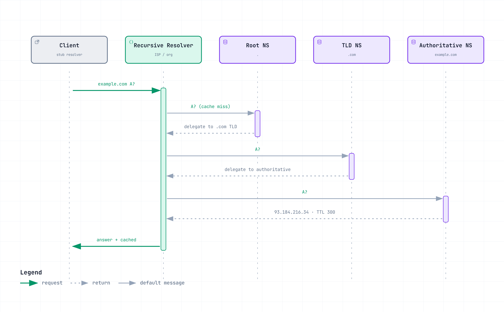

# ネットワークの基礎 Part 3 — 10のアプリケーションプロトコル

> **最終更新**: September 14, 2026

::: tip これは4部構成のシリーズです
[Part 1: レイヤーモデル、リンク層、ルーティング層](./06-network-fundamentals-part1.md) ·
[Part 2: トランスポート層とTLS](./06-network-fundamentals-part2.md) ·
**Part 3: アプリケーションプロトコル** *(このドキュメント)* ·
[Part 4: リクエストの旅とクラウド](./06-network-fundamentals-part4.md)
:::

トランスポートプロトコルはストリームまたはデータグラムを提供し、アプリケーションプロトコルはそれらをサービスに変えます。このPartでは、名前解決（DNSとDoH）、ブートストラップ（DHCP）、運用アクセス（SSH）、メール（SMTP）、HTTP/3、WebSocket、WebRTC、gRPC、MQTTを扱います。

---

## 5. アプリケーション層 — 実際のサービス

### DNS

**定義:** ドメイン名をIPアドレスやその他のレコードへ解決する、分散型のディレクトリシステムです。

**仕組み:** DNSは階層的な委任を使用します。キャッシュミス時、再帰リゾルバはルート、TLD、権威ネームサーバーからの参照をたどるか、別のリゾルバへ転送します。キャッシュ済みの応答により、この作業の一部またはすべてを回避できます。A/AAAAレコードにはアドレス、CNAMEレコードにはエイリアス、MXレコードにはメールサーバー、TXTレコードには複数のプロトコルで使用されるテキストが含まれます。

**実務では:** DNSは分散されていますが、リゾルバ、プロバイダー、設定が共有依存関係になることがあります。DNSフェイルオーバーでは、障害検出、レコード更新、すでにキャッシュされた応答のTTL、アプリケーションキャッシュ、既存の接続を考慮してください。今TTLを短縮しても、以前にキャッシュされた応答のTTLは短くなりません。一部のリゾルバは、定義された障害条件下で古い応答も返します（RFC 8767）。各段階を測定してください。TTLが短いだけではフェイルオーバー時間を保証できません。ロードバランサーとanycastはDNSを補完できますが、それぞれにヘルス検出と収束の制限があります。

**主要なレコードタイプの一覧:**

| 種類 | 目的 | 補足 |
|---|---|---|
| A / AAAA | ドメイン → IPv4 / IPv6 | 基本 |
| CNAME | エイリアス → 正規名 | apexのSOA/NSと共存不可。プロバイダー固有のALIAS/ANAMEまたはRoute 53 Aliasは、サポートされるターゲットへのapexマッピングを提供可能 |
| MX | メール受信サーバー | 優先度の数値が小さい方が優先 |
| TXT | 任意の文字列 | SPF/DKIM/DMARC、ドメイン所有権の検証 |
| NS | 委任されたネームサーバー | サブゾーンの委任 |
| SRV | サービスの場所（host+port） | 一部のプロトコルの検出 |
| CAA | 許可された証明書発行者を制限 | CAによる強制が必要。これ自体ですべての誤発行を防ぐものではない |

**DNSSECとDoHは異なる問題を解決します。** DNSSECは、検証済みの信頼チェーンを通じて、署名付きDNSデータとその完全性を認証します。クエリを暗号化するものではありません。DoHはHTTPSを使用して選択したリゾルバを認証し、クライアント–リゾルバ間のホップにおける機密性と完全性を保護します。悪意のある、または誤ったリゾルバが権威データを返したことを証明するものではありません。両者は併用できます。



[🔍 インタラクティブ図を表示](https://www.atomai.click/kubernetes-docs/archmaps/en-basics-06-network-fundamentals-part3-0.html)

### DoH

**定義:** HTTPSでラップされて転送されるDNSクエリです。

**仕組み:** 従来のDNSは一般に、プレーンテキストのUDP **およびTCP** ポート53を使用します。DoHはDNSメッセージをHTTPS経由で伝送し、そのホップ上の受動的な検査や改変から保護します。リゾルバエンドポイントとトラフィックメタデータによってDoHの使用が特定される可能性は残り、選択したリゾルバはクエリを確認できます。

**実務では:** 独自に選択したパブリックDoHリゾルバは、組織のリゾルバにおけるフィルタリングやログ記録を迂回し、プライベート名を解決できない場合があります。DoHは本質的にポリシーを無効化するものではありません。管理対象のDoHリゾルバはログ記録やフィルタリングを適用でき、ブラウザ/OSポリシーは承認済みのリゾルバを選択できます。暗号化の無効化が常に必要だと仮定せず、split DNSとエンドポイントポリシーをテストしてください。

### DHCP

**定義:** ホストへIPアドレスとネットワーク設定を自動的に割り当てるプロトコルです。

**仕組み:** 一般的な初期の**DHCPv4**交換はDORAです。Discover → Offer → Request → Acknowledge。ローカルブロードキャストまたはDHCPリレーがサーバーを見つけます。リースにはIPv4アドレス、サブネットマスク、ゲートウェイ、DNS設定を含められます。更新には、より短い交換を使用できます。DHCPv6では異なるメッセージを使用します。IPv6のデフォルトルーター情報は通常Router Advertisementsから取得され、SLAACも別のアドレス設定メカニズムです。

**実務では:** クラウドでは大部分が抽象化されていますが、VPC DHCP option setで再び目にします。ここでDNSサーバーとドメイン名を設定します。オンプレミスDNSを使用するハイブリッド構成で名前解決が失敗した場合、確認すべき設定はここです。

### SSH

**定義:** 暗号化されたリモートシェルアクセスとトンネリングを提供するプロトコルです。

**仕組み:** サーバーはhost keyで自身を認証し、鍵交換によってセッションキーを導出した後、ユーザーを認証します（public keyまたはパスワード）。以降のすべてのトラフィックは暗号化されます。リモートシェルに加えて、SSHはポートフォワーディング、SFTP、agent forwardingをサポートします。

**実務では:** アクセスポリシーに応じてフォワーディングを制限し、サーバーのhost keyを検証してください。フォワードされたagent socketにアクセスできる侵害済みホストは、agentに署名または認証を要求できます。通常、フォワーディングによってprivate keyのマテリアルがそこへコピーされることはありません。agent forwardingが不要な場合はjump host（`ProxyJump`）を推奨します。生の鍵には固有の有効期限はありませんが、OpenSSHは証明書の有効期間と`authorized_keys`の有効期限制限をサポートします。退職者のアクセスを削除し、認証情報をローテーションまたは失効させてください。

AWS Systems Manager Session Managerは、管理対象ノード、IAM権限、サービス接続が設定されていれば、インバウンドSSHポートやSSHキーの配布なしにシェルアクセスを提供できます。CloudTrailはAPIアクティビティを記録します。CloudWatch Logs/S3へのシェル内容のログ記録には設定が必要です。**Session Manager SSHおよびポートフォワーディングセッションでは、セッション内容のログ記録を利用できません。** IAMベースのアクセスだけでは、すべてのコマンドが記録されることを意味しません。

### SMTP

**定義:** メールサーバー間でメッセージを中継するプロトコルです。

**仕組み:** クライアントはsubmission serverへメールを送信し、SMTPサーバーは通常ルーティングにMX lookupを使用してメッセージを中継・受信します。IMAPとPOP3は、ユーザーがすでにメールボックスに保存されているメッセージを取得またはアクセスできるようにします。これらはSMTPのサーバー側での受信に代わるものではありません。

**実務では:** SMTP認証とTLSは送信/転送を保護しますが、それだけで表示される送信者ドメインを証明するものではありません。補完関係にある3つのドメインメカニズムが重要です。

- **SPF** — エンベロープのMAIL FROMまたはHELO identityに対して送信ホストを認可します。これは表示されるFromヘッダーと自動的に一致するものではありません。
- **DKIM** — 署名ドメインのDNS keyを使用して、対象となるメッセージコンテンツに対する署名を検証します。署名ドメインは表示されるFromドメインと異なる場合があります。
- **DMARC** — 表示されるFromドメインを、合格したSPF **または** DKIM identityと整合させることを要求し、要求する処理/レポートポリシーを公開します。

必要に応じてSPF、DKIM、DMARCをまとめて設定し、レポートを監視し、転送/メーリングリストの動作を考慮してください。DMARCは、整合したメカニズムが1つあれば合格できます。これらの制御は配信を保証するものでも、表示名または類似ドメインによるなりすましを排除するものでもありません。受信側もローカルポリシーを適用します。

### HTTP/3

**定義:** QUIC上で動作するHTTPの第3の主要バージョンです。

**仕組み:** HTTPのセマンティクスはバージョン間で共有されていますが、HTTP/3はQUIC streamと独自のフレーミングおよびマッピングを使用します。TCPのストリーム間順序依存を排除しますが、ストリーム内の損失、QPACK依存関係、共有輻輳制御は依然として処理を遅延させる可能性があります。一般的なフルハンドシェイクは約1 RTTを要し、サポートされるmigrationではアドレス変更をまたいで接続を維持できます。QPACKは、独立して配信されるストリームに対応するためHPACKを置き換えます。

**実務では:** クライアントは、`Alt-Svc`、事前知識、またはサポートされるプロトコルを広告するHTTPS DNSレコードを通じてHTTP/3を検出できます。`Alt-Svc`は以前のTCP接続を通じて学習される場合があります。HTTPSレコードをサポートするクライアントは、その交換前にHTTP/3を検出できます。いずれの方法も到達可能性や特定のレイテンシ短縮を保証しません。

独立した配信と統合されたハンドシェイクは、損失の多いパスや高レイテンシのパスで役立つ場合があります。実際のレイテンシ、スループット、CPUコストは、実装、offload、ワークロード、ネットワーク条件に依存します。普遍的な改善または悪化を仮定するのではなく、代表的なモバイルおよびデータセンターのトラフィックを測定してください。

**3世代の比較:**

| | HTTP/1.1 | HTTP/2 | HTTP/3 |
|---|---|---|---|
| トランスポート | TCP | TCP | QUIC (UDP) |
| 接続あたりのリクエスト | 順次、または順序付き応答を伴うパイプライン処理 | 多重化 | 多重化 |
| HOL blocking | 順序付き応答とTCP配信 | ストリーム間のTCP順序付け | TCPのストリーム間順序付けなし。他のブロッキングは残る |
| ヘッダー圧縮 | なし | HPACK | QPACK |
| 暗号化 | 任意（HTTPS） | HTTPSにはTLS。平文のHTTP/2も存在 | TLS 1.3がQUICに統合 |

多重化により、順序依存が発生する場所が変わります。HTTP/3はブロッキングの1つの原因を減らしますが、すべてのスケジューリング、フロー制御、アプリケーション依存関係を排除するものではありません。

#### HTTP/1.1リクエストとレスポンスの読み方 {#http11-message-structure}

HTTPバージョン間で、メソッド、status code、field semanticsは共有されます。HTTP/1.1では、これらの概念が**start line → header field lines → blank line → optional body**として可視化されます。bodyにはテキストまたはバイナリデータを含められます。「textual HTTP/1.1」はstart lineとheaderを表すものであり、すべてのpayloadを表すものではありません。

以下は**例示的なHTTP/1.1メッセージであり、キャプチャ出力やコマンドレシピではありません**。読みやすさのため、表示ではLF改行を使用しています。wire上では、start lineと各header lineは**CRLF（`\r\n`）**で終わり、追加のCRLFがheader sectionを終了します。以下の各bodyは末尾の改行なしで、正確に**5 ASCII bytes**である`hello`です。閉じフェンス前に表示される改行はbodyの一部ではありません。

クライアント → サーバー:

```http
POST /echo HTTP/1.1
Host: example.test
Content-Type: text/plain; charset=utf-8
Content-Length: 5

hello
```

サーバー → クライアント:

```http
HTTP/1.1 200 OK
Date: Mon, 14 Sep 2026 00:00:00 GMT
Content-Type: text/plain; charset=utf-8
Content-Length: 5

hello
```

| 要素 | 読み方 |
|---|---|
| Request line | `POST`はmethod、`/echo`はrequest target（ここではpath）、`HTTP/1.1`はversionです。必須の`Host` fieldは、ターゲットのhostnameと任意のport（authority）を提供します。 |
| Status line | `HTTP/1.1`はversion、`200`はstatus code、`OK`は任意のreason phraseです。結果の解釈にはcodeを使用してください。 |
| Header fields | `Name: value`行はmetadataを伝えます。field nameは大文字・小文字を区別しません。`Content-Type`はrepresentationのmedia typeと、ここではそのcharsetを記述します。 |
| Blank line | header sectionを終了します。後続するbodyの終端は指定しません。 |
| Body | content bytesです。ここで`Content-Length: 5`は、start line、headers、separatorを除く5 bytesを区切ります。Unicode文字数ではなくbytesを数えてください。 |

**意味とフレーミングは異なる問いに答えます。** methodは要求するアクションを表します。GETはrepresentationを取得し、HEADはresponse contentなしで対応するresponse metadataを要求し、POSTはターゲットに提供されたcontentの処理を依頼します。status classは結果を要約します。1xxはinformational、2xxはsuccess、3xxはredirection、4xxはclient error、5xxはserver errorです。`Content-Type`はcontentの解釈方法を説明するものであり、区切るものではありません。これらの共有セマンティクスについては[RFC 9110](https://www.rfc-editor.org/rfc/rfc9110.html)を参照してください。

HTTP/1.1のフレーミングは、再利用可能なTCP stream上でこのメッセージに属するbytes数を決定します。通常のbodyを持つメッセージでは、`Transfer-Encoding`がなく有効な`Content-Length`があれば、その長さが示されます。`Transfer-Encoding: chunked`の場合、chunk sizeと終端のゼロサイズchunk、それに続く任意のtrailersと最終blank lineが、代わりにbodyを区切ります。送信者は両方のfieldを送信してはなりません。一部のresponseではconnection closeを区切りとして使用します。TCP packet boundaryがHTTPメッセージを区切ることは決してありません。

method/statusのルールが先に適用されます。HEADへのresponseと、1xx、204、304 statusのresponseには、許可されるmetadataがrepresentationを説明していてもmessage bodyはありません。成功したCONNECT responseはtunnelを開始します。lengthもtransfer codingもないrequestにはbodyがありません。こうした区別により、次のメッセージをcontentとして読み取ることを防ぎます（[RFC 9112 §§2–6](https://www.rfc-editor.org/rfc/rfc9112.html)）。

**HTTP/2とHTTP/3は意味を維持しますが、これらのtextual start lineやCRLF境界ではなく、HEADERSやDATA frameを含むbinary framingを使用します**。HTTP/2はTCPを使用し、HTTP/3はメッセージをQUIC streamにマッピングします。どちらもHTTP/1.1のchunked transfer codingを使用しません。ツールは、実際のwire encodingを示さずに、デコード済みfieldを読みやすいテキストとして表示できます（[RFC 9113](https://www.rfc-editor.org/rfc/rfc9113.html)、[RFC 9114](https://www.rfc-editor.org/rfc/rfc9114.html)）。

HTTPSでは、TLSが転送中のHTTP headerとbodyを保護します。session secretなしの受動的キャプチャでは、このplaintextは公開されません（[RFC 8446 §5](https://www.rfc-editor.org/rfc/rfc8446.html#section-5)）。QUICも同様にHTTP/3 application dataを保護します。認可されたendpointまたはTLS termination pointでデコード済みメッセージを検査し、どのconnection legを観測しているかを識別してください。

> 📎 Kubernetes IngressまたはAWSロードバランサーを備えたcontainer serviceに同じ区別を適用する前に、[Linux HTTP message lab](../networking/07-linux-network-diagnostics.md#http-message-lab)へ進んでください。

### WebSocket

**定義:** 単一のconnection上で双方向メッセージングを行うapplication protocolです。

**仕組み:** HTTP/1.1 handshakeは`Upgrade`と成功時の`101` responseを使用します。HTTP/2とHTTP/3では、サポートされる場合に代わりにExtended CONNECTを使用します（RFC 8441および9220）。確立後は、どちらのpeerも繰り返しHTTP pollingを行わずにWebSocketメッセージを送信できます。

**実務では:** 長時間接続を計画してください。関連するidle timeout内でのheartbeat traffic、deployment中のgraceful draining、jitterを伴うreconnect backoffが必要です。各socketは所有するinstanceに残ります。Redis Pub/Subなどの共有application stateまたはmessagingは、instance間でeventを配信できますが、live socketを転送するものでも、それ自体でdurable deliveryを提供するものでもありません。ネゴシエートされたHTTP versionで使用されたhandshakeと、proxyのサポートを確認してください。

### WebRTC

**定義:** ブラウザやmedia serverを含む、互換性のあるendpoint間のリアルタイムmediaおよびdataのためのAPIとプロトコルです。

**仕組み:** NATは直接到達性を妨げることがありますが、NAT配下の2つのpeerが接続できる場合もあります。ICEはhost、server-reflexive（STUNで学習）、relayed（TURN）のcandidateを交換しテストします。application signalingはsession descriptionとcandidateを伝送します。選択されるpathはconnectivity checkとpolicyに依存します。mediaはSRTPを使用し、通常はDTLS-SRTP key establishmentを用います。data channelはDTLS上のSCTPを使用します。

**実務では:** TURN relayの使用は帯域幅とインフラストラクチャのコストに寄与します。直接media pathであっても、signaling、STUN、その他のサービスコストは残ります。NAT mapping/filteringとfirewallの動作は接続性に影響するため、「symmetric NAT」というラベルだけではrelayが不可避である普遍的な証明にはなりません。TURN fallbackの予算を確保し、実際のnetworkをテストしてください。SFUは一般的な複数参加者設計であり、完全なpeer meshと比べてclient uploadを減らす代わりに、server bandwidth/computeを使用します。

### gRPC

**定義:** 標準native transportとしてHTTP/2を使用し、一般にProtocol Buffersのserviceおよびmessage schemaを利用するRPC frameworkです。

**仕組み:** Protocol Buffers定義はclient/server codeを生成でき、unary、server-streaming、client-streaming、bidirectional-streaming RPCをサポートします。binary encodingはコンパクトにできる一方、JSONと比較したサイズと速度はdata、implementation、compressionに依存します。これらはプロトコルの保証ではありません。

**実務では:** native gRPCは多くのservice APIに適しています。ブラウザAPIはnative gRPCが必要とするすべてを公開していないため、ブラウザclientは通常、互換性のあるserverまたは変換proxyを備えたgRPC-Webを使用します。利用可能なstreaming modeはそのimplementationに依存します。検査とdebuggingにはschema-aware toolを使用してください。

gRPC channelは**0個以上のHTTP/2 connection**を使用でき、多くのRPCが長時間存続するconnectionを共有できます。L4 balancingはconnectionごとにbackendを選択するため、小さなconnection poolではRPCトラフィックが集中する可能性があり、RPCごとの分散は保証されません。適切なclient-side policyまたはgRPC-aware L7 proxy（service meshの一部である場合があります）を検討してください。確立済みstreamは、選択されたbackendに残ります。schema evolutionでは、削除したProtocol Buffers field number/nameを予約し、そのnumberを再利用しないでください。

> 📎 IstioにおけるgRPC処理については、[Istio gRPC Advanced](../service-mesh/istio/advanced/05-grpc.md)を参照してください。

### MQTT

**定義:** 軽量なpublish-subscribe messaging protocolです。

**仕組み:** clientはbrokerに接続し、topicにpublish/subscribeします。fixed headerは最小2 bytesにできますが、実際のpacketにはvariable header、property、payloadも必要になる場合があります。QoS 0/1/2は、多くても1回、少なくとも1回、正確に1回の**該当するsender–receiver leg上でのプロトコル配信**を提供します。publisher-to-brokerとbroker-to-subscriberの配信は別個です。設定済みのWillは、指定された切断条件でpublishできます。MQTT 5のWill Delayとreconnectの動作は、いつ表示されるかに影響します。

**実務では:** 損失/重複の許容度とコストに応じてQoSを選択してください。QoS 2の正常な配信では通常、PUBLISH、PUBREC、PUBREL、PUBCOMPを交換します。これはapplicationのdatabase side effectやbusiness workflow全体を正確に1回にするものではありません。QoS 1とapplication deduplicationは、1つのトレードオフになり得ます。選択したproductに対してbroker availability、durable session/message state、recoveryを計画してください。TLSと適切なdevice authentication/authorization schemeを使用してください。client certificateは1つの選択肢ですが、provisioningとrotationが必要です。


**主な参考資料**: [DoH](https://www.rfc-editor.org/rfc/rfc8484.html), [DNS serve-stale](https://www.rfc-editor.org/rfc/rfc8767.html), [OpenSSH](https://man.openbsd.org/ssh), [Session Manager](https://docs.aws.amazon.com/systems-manager/latest/userguide/session-manager.html), [DMARC](https://www.rfc-editor.org/rfc/rfc7489.html), [HTTP/3](https://www.rfc-editor.org/rfc/rfc9114.html), [ICE](https://www.rfc-editor.org/rfc/rfc8445.html), [gRPC performance](https://grpc.io/docs/guides/performance/), [MQTT 5.0](https://docs.oasis-open.org/mqtt/mqtt/v5.0/os/mqtt-v5.0-os.html).
---

**次へ:** [Part 4: リクエストの旅とクラウド](./06-network-fundamentals-part4.md)
