# クラスターアーキテクチャ

> **対応バージョン**: Kubernetes 1.32, 1.33, 1.34
> **最終更新**: August 10, 2026

## ラボ環境のセットアップ

このドキュメントの概念を実践するには、以下のツールと環境が必要です。

### 必要なツール
- kubectl v1.34 以降
- 動作する Kubernetes クラスター（EKS、minikube、kind など）

### ローカル開発環境のセットアップ

```bash
# Install minikube (for local development)
curl -LO https://storage.googleapis.com/minikube/releases/latest/minikube-linux-amd64
sudo install minikube-linux-amd64 /usr/local/bin/minikube

# Start cluster
minikube start

# Check cluster status
kubectl cluster-info

# Check control plane components
kubectl get pods -n kube-system
```

## クラスターアーキテクチャの概要

> **コアコンセプト**: Kubernetes クラスターは control plane と worker node で構成され、それぞれは特定の役割を果たす複数のコンポーネントから成ります。

Kubernetes クラスターは、コンテナ化されたアプリケーションを実行するためのノード（仮想マシンまたは物理マシン）の集合で構成されます。クラスターは大きく control plane と worker node に分かれます。

### クラスターアーキテクチャ図

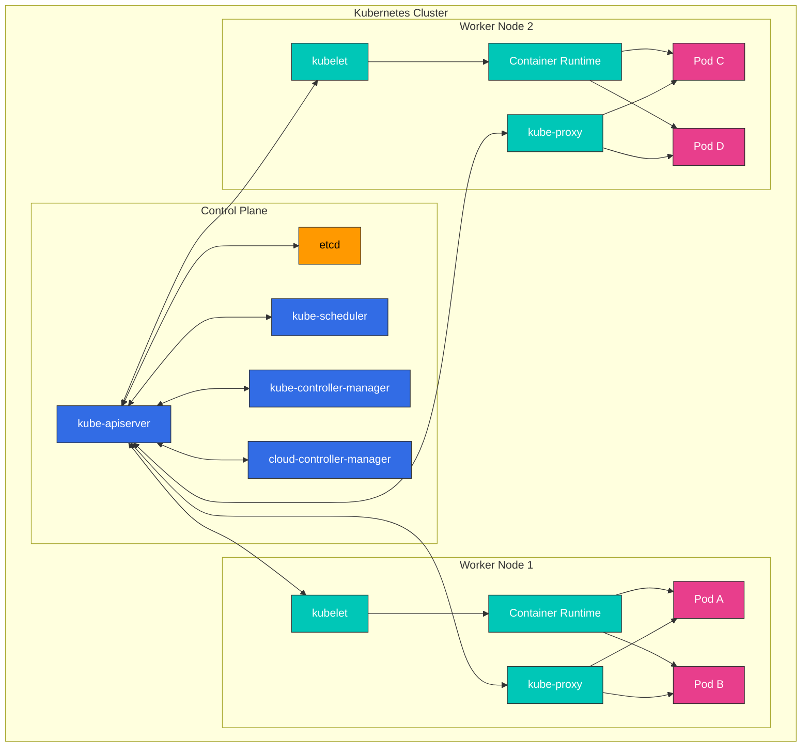

**Control Plane コンポーネント**:
- **kube-apiserver**: Kubernetes API を公開するフロントエンド
- **etcd**: すべてのクラスター データを格納するキー・バリュー ストア
- **kube-scheduler**: 新しく作成された Pod を実行するノードを選択
- **kube-controller-manager**: クラスター状態を管理する controller を実行
- **cloud-controller-manager**: クラウドプロバイダー API と連携

**Worker Node コンポーネント**:
- **kubelet**: 各ノードで実行され、コンテナの実行を管理するエージェント
- **kube-proxy**: ネットワークルールを維持し、接続転送を実行
- **Container Runtime**: コンテナを実行（containerd、CRI-O など）

## Control Plane コンポーネント

control plane は Kubernetes クラスターの「頭脳」として機能し、クラスター全体の状態を管理および制御します。control plane コンポーネントは通常、専用マシンで実行され、高可用性のために複数インスタンスへレプリケートできます。

### Control Plane コンポーネントの詳細

| コンポーネント | 主な機能 | 通信対象 | 高可用性構成 |
|-----------|---------------|----------------------|--------------------------------|
| **kube-apiserver** | - Kubernetes API を提供<br>- 認証と認可<br>- API リクエスト処理 | - すべてのコンポーネント<br>- etcd | 複数インスタンスによる水平スケーリング |
| **etcd** | - クラスター データの保存<br>- 分散キー・バリュー ストア<br>- 整合性の確保 | - kube-apiserver | 複数ノード クラスター |
| **kube-scheduler** | - Pod 配置の決定<br>- ノードリソースの評価<br>- affinity/anti-affinity の適用 | - kube-apiserver | Active-standby 構成 |
| **kube-controller-manager** | - Node controller<br>- Replication controller<br>- Endpoint controller<br>- Service account controller | - kube-apiserver | Active-standby 構成 |
| **cloud-controller-manager** | - クラウドプロバイダー統合<br>- Node ライフサイクル<br>- ルーティングとロードバランシング | - kube-apiserver<br>- Cloud API | Active-standby 構成 |

### Control Plane の通信フロー

1. ユーザーまたは controller が kube-apiserver にリクエストを送信します
2. kube-apiserver が認証、認可、admission を実行します
3. kube-apiserver が etcd からデータを読み取り、または etcd に書き込みます
4. Controller と scheduler は kube-apiserver を介してクラスター状態を監視します
5. kubelet はノード状態を kube-apiserver に報告します

### kube-apiserver

kube-apiserver は Kubernetes API を公開する control plane のフロントエンドです。すべての内部および外部リクエストはこの API server を通じて処理されます。

**主な機能**:
- REST API の提供
- 認証と認可
- リクエストの検証と処理
- etcd との通信
- 水平スケーリング可能（複数インスタンスへスケール可能）

**主なフラグと設定オプション**:
```bash
# Basic configuration example
kube-apiserver \
  --advertise-address=192.168.1.10 \
  --allow-privileged=true \
  --authorization-mode=Node,RBAC \
  --enable-admission-plugins=NodeRestriction \
  --enable-bootstrap-token-auth=true \
  --etcd-servers=https://127.0.0.1:2379 \
  --kubelet-client-certificate=/etc/kubernetes/pki/apiserver-kubelet-client.crt \
  --kubelet-client-key=/etc/kubernetes/pki/apiserver-kubelet-client.key \
  --service-account-key-file=/etc/kubernetes/pki/sa.pub \
  --service-cluster-ip-range=10.96.0.0/12 \
  --tls-cert-file=/etc/kubernetes/pki/apiserver.crt \
  --tls-private-key-file=/etc/kubernetes/pki/apiserver.key
```

**API Server のセキュリティ**:
- TLS 証明書によるセキュアな通信
- さまざまな認証方式をサポート（X.509 証明書、service account token、OIDC、webhook など）
- RBAC（Role-Based Access Control）による権限管理
- admission controller によるリクエストの検証と変更

### etcd

etcd は、すべてのクラスター データを格納する、整合性と高可用性を備えたキー・バリュー ストアです。Kubernetes の「信頼できる唯一の情報源」として機能します。

**主な特徴**:
- 分散システム
- 強整合性（Raft コンセンサスアルゴリズムを使用）
- 高可用性（複数ノードで構成可能）
- セキュアなデータ保存
- 変更を監視する Watch 機能

**etcd クラスター構成**:
```bash
# etcd cluster configuration example (3 nodes)
etcd \
  --name etcd-1 \
  --initial-advertise-peer-urls https://192.168.1.11:2380 \
  --listen-peer-urls https://192.168.1.11:2380 \
  --listen-client-urls https://192.168.1.11:2379,https://127.0.0.1:2379 \
  --advertise-client-urls https://192.168.1.11:2379 \
  --initial-cluster-token etcd-cluster \
  --initial-cluster etcd-1=https://192.168.1.11:2380,etcd-2=https://192.168.1.12:2380,etcd-3=https://192.168.1.13:2380 \
  --initial-cluster-state new \
  --data-dir=/var/lib/etcd
```

**etcd のバックアップとリカバリ**:
```bash
# etcd backup
ETCDCTL_API=3 etcdctl snapshot save snapshot.db \
  --endpoints=https://127.0.0.1:2379 \
  --cacert=/etc/kubernetes/pki/etcd/ca.crt \
  --cert=/etc/kubernetes/pki/etcd/server.crt \
  --key=/etc/kubernetes/pki/etcd/server.key

# etcd recovery
ETCDCTL_API=3 etcdctl snapshot restore snapshot.db \
  --data-dir=/var/lib/etcd-restore \
  --name=etcd-1 \
  --initial-cluster=etcd-1=https://192.168.1.11:2380 \
  --initial-cluster-token=etcd-cluster \
  --initial-advertise-peer-urls=https://192.168.1.11:2380
```

**etcd のパフォーマンス最適化**:
- ディスク I/O の最適化（SSD 推奨）
- 適切なメモリ割り当て
- 定期的な compaction と defragmentation
- クラスター規模に応じた適切な etcd ノード数（通常は 3 または 5）

#### 2026 年 7 月の更新: etcd v3.7.0 がリリース

2026 年 7 月 8 日、SIG etcd は etcd v3.7.0 をリリースしました。主な変更点:

- **RangeStream**: 応答全体をメモリにバッファリングする代わりに、大規模な range 結果をチャンク単位でストリーミングします（長らく要望されていた機能）
- **パフォーマンス改善**: keys-only range リクエストの最適化、より高速かつ信頼性の高い lease
- レガシー v2store の最後の残存部分を削除し、大規模な protobuf の刷新を完了
- 更新されたコア依存関係 bbolt v1.5.0 および raft v3.7.0 を同梱

詳細は [公式発表](https://kubernetes.io/blog/2026/07/08/announcing-etcd-3.7/) と [etcd v3.7 changelog](https://github.com/etcd-io/etcd/blob/main/CHANGELOG/CHANGELOG-3.7.md) を参照してください。

### kube-scheduler

kube-scheduler は、新しく作成された Pod を実行するノードを選択する control plane コンポーネントです。

**スケジューリングプロセス**:
1. **Filtering**: Pod を実行できるノードの特定
   - リソース要件（CPU、メモリ）
   - Node selector、node affinity
   - Taint と toleration
   - Volume 制約

2. **Scoring**: 適切なノードへのスコア割り当て
   - リソース使用率
   - Pod inter-affinity/anti-affinity
   - データローカリティ
   - ノード間のロードバランシング

3. **Binding**: Pod を最適なノードに割り当て

**Scheduler 設定**:
```bash
# Basic configuration example
kube-scheduler \
  --kubeconfig=/etc/kubernetes/scheduler.conf \
  --leader-elect=true \
  --v=2
```

**Scheduler Profile と Plugin**:
- デフォルトの scheduler profile
- カスタム scheduler profile
- Scheduler extension point（filter、score、bind など）
- 複数 scheduler のサポート

**スケジューリングポリシー**:
```yaml
# Scheduling policy example
apiVersion: kubescheduler.config.k8s.io/v1
kind: KubeSchedulerConfiguration
profiles:
- schedulerName: default-scheduler
  plugins:
    score:
      disabled:
      - name: NodeResourcesLeastAllocated
      enabled:
      - name: NodeResourcesMostAllocated
        weight: 1
```

### kube-controller-manager

kube-controller-manager は、複数の controller プロセスを実行する control plane コンポーネントです。各 controller はクラスターの特定の側面を管理します。

**主な Controller**:
- **Node Controller**: ノード状態を監視して対応
- **Replication Controller**: Pod レプリカ数を維持
- **Endpoint Controller**: Service と Pod を接続
- **Service Account & Token Controller**: Namespace のデフォルト account と API token を作成
- **Job Controller**: 単発タスクを管理
- **CronJob Controller**: スケジュールされたタスクを管理
- **DaemonSet Controller**: 特定の Pod がすべてのノードで実行されることを保証
- **StatefulSet Controller**: ステートフルアプリケーションを管理
- **PV Controller**: Persistent Volume を管理
- **Namespace Controller**: Namespace ライフサイクルを管理
- **Garbage Collector**: 孤立したオブジェクトをクリーンアップ

**Controller Manager 設定**:
```bash
# Basic configuration example
kube-controller-manager \
  --kubeconfig=/etc/kubernetes/controller-manager.conf \
  --leader-elect=true \
  --use-service-account-credentials=true \
  --root-ca-file=/etc/kubernetes/pki/ca.crt \
  --service-account-private-key-file=/etc/kubernetes/pki/sa.key \
  --cluster-signing-cert-file=/etc/kubernetes/pki/ca.crt \
  --cluster-signing-key-file=/etc/kubernetes/pki/ca.key \
  --controllers=*,bootstrapsigner,tokencleaner
```

**Controller の動作**:
1. Controller は API server を介してクラスター状態を継続的に監視します
2. 現在の状態と望ましい状態の差異を検出します
3. 差異を調整する操作を実行します
4. 状態変更を API server に報告します

### cloud-controller-manager

cloud-controller-manager は、クラウド固有の制御ロジックを含む control plane コンポーネントです。これにより Kubernetes core とクラウドプロバイダー API を分離できます。

**主な Controller**:
- **Node Controller**: クラウドプロバイダー API を通じてノード状態を確認
- **Route Controller**: クラウド環境で route を設定
- **Service Controller**: クラウド load balancer を作成、更新、削除
- **Volume Controller**: クラウドストレージ volume を作成、アタッチ、マウント

**クラウドプロバイダー実装**:
- AWS Cloud Controller Manager
- Azure Cloud Controller Manager
- GCP Cloud Controller Manager
- OpenStack Cloud Controller Manager
- vSphere Cloud Controller Manager

**Cloud Controller Manager 設定**:
```bash
# AWS Cloud Controller Manager example
cloud-controller-manager \
  --cloud-provider=aws \
  --cloud-config=/etc/kubernetes/cloud-config \
  --kubeconfig=/etc/kubernetes/cloud-controller-manager.conf \
  --leader-elect=true
```

**Cloud Controller Manager の利点**:
- クラウドプロバイダー固有コードを Kubernetes core から分離
- クラウドプロバイダーが独自の機能を独立して開発可能
- Kubernetes core を変更せずにクラウド機能を追加

## Node コンポーネント

Node は、コンテナ化されたアプリケーションを実行する Kubernetes クラスター内の worker machine です。各 node は control plane によって管理され、複数のコンポーネントで構成されます。

### kubelet

kubelet は、各 node 上で実行され、Pod 内のコンテナを管理するエージェントです。kubelet はさまざまな仕組みを通じて PodSpec を受け取り、それらの spec に従ってコンテナが正常に実行されることを保証します。

**主な機能**:
- PodSpec に従ってコンテナを実行
- コンテナ状態を監視および報告
- コンテナライフサイクルを管理
- Volume mount を管理
- Node 状態を報告
- コンテナのヘルスチェックを実行

**kubelet 設定**:
```bash
# Basic configuration example
kubelet \
  --kubeconfig=/etc/kubernetes/kubelet.conf \
  --config=/var/lib/kubelet/config.yaml \
  --container-runtime=remote \
  --container-runtime-endpoint=unix:///var/run/containerd/containerd.sock \
  --pod-infra-container-image=k8s.gcr.io/pause:3.6
```

**kubelet 設定ファイルの例**:
```yaml
# /var/lib/kubelet/config.yaml
apiVersion: kubelet.config.k8s.io/v1beta1
kind: KubeletConfiguration
address: 0.0.0.0
authentication:
  anonymous:
    enabled: false
  webhook:
    cacheTTL: 2m0s
    enabled: true
  x509:
    clientCAFile: /etc/kubernetes/pki/ca.crt
authorization:
  mode: Webhook
  webhook:
    cacheAuthorizedTTL: 5m0s
    cacheUnauthorizedTTL: 30s
cgroupDriver: systemd
clusterDomain: cluster.local
cpuManagerPolicy: none
evictionHard:
  memory.available: 100Mi
  nodefs.available: 10%
  nodefs.inodesFree: 5%
failSwapOn: true
healthzBindAddress: 127.0.0.1
healthzPort: 10248
```

**Static Pod**:
kubelet は API server を経由せずに直接管理する static Pod を実行できます。これは主に control plane コンポーネントの実行に使用されます。

```yaml
# /etc/kubernetes/manifests/kube-apiserver.yaml
apiVersion: v1
kind: Pod
metadata:
  name: kube-apiserver
  namespace: kube-system
spec:
  containers:
  - name: kube-apiserver
    image: k8s.gcr.io/kube-apiserver:v1.24.0
    command:
    - kube-apiserver
    - --advertise-address=192.168.1.10
    # ... additional flags
```

### kube-proxy

kube-proxy は、Kubernetes Service の概念を実装する各 node 上で実行されるネットワーク proxy です。node 上のネットワークルールを維持し、接続転送を実行します。

**主な機能**:
- Service IP と port のネットワークルールを維持
- 接続転送
- Load balancing を実装
- Service discovery をサポート

**動作モード**:
1. **userspace mode**: User space で proxy を実行（レガシー）
2. **iptables mode**: Linux iptables を使用した NAT 実装（デフォルト）
3. **IPVS mode**: Linux kernel の IP Virtual Server を使用（高パフォーマンス）

**kube-proxy 設定**:
```bash
# Basic configuration example
kube-proxy \
  --config=/var/lib/kube-proxy/config.conf \
  --hostname-override=node1
```

**kube-proxy 設定ファイルの例**:
```yaml
# /var/lib/kube-proxy/config.conf
apiVersion: kubeproxy.config.k8s.io/v1alpha1
kind: KubeProxyConfiguration
bindAddress: 0.0.0.0
clientConnection:
  acceptContentTypes: ""
  burst: 10
  contentType: application/vnd.kubernetes.protobuf
  kubeconfig: /var/lib/kube-proxy/kubeconfig.conf
  qps: 5
clusterCIDR: 10.244.0.0/16
configSyncPeriod: 15m0s
conntrack:
  maxPerCore: 32768
  min: 131072
  tcpCloseWaitTimeout: 1h0m0s
  tcpEstablishedTimeout: 24h0m0s
enableProfiling: false
healthzBindAddress: 0.0.0.0:10256
hostnameOverride: node1
iptables:
  masqueradeAll: false
  masqueradeBit: 14
  minSyncPeriod: 0s
  syncPeriod: 30s
ipvs:
  excludeCIDRs: null
  minSyncPeriod: 0s
  scheduler: ""
  syncPeriod: 30s
mode: "iptables"
```

**IPVS と iptables モードの比較**:

| 特性 | iptables モード | IPVS モード |
|----------------|---------------|-----------|
| パフォーマンス | Service 数が多いとパフォーマンスが低下 | 大規模クラスターでより優れたパフォーマンス |
| Load Balancing アルゴリズム | round robin のみサポート | さまざまなアルゴリズムをサポート（rr、lc、dh、sh、sed、nq） |
| 実装 | ネットワークパケット filtering chain | Hash table ベース |
| Kernel 要件 | デフォルト kernel module | IPVS kernel module が必要 |

### Container Runtime

Container runtime はコンテナを実行するソフトウェアです。Kubernetes は Container Runtime Interface（CRI）を通じてさまざまな container runtime をサポートします。

**主な Container Runtime**:
1. **containerd**: 軽量な container runtime（現在最も広く使用）
2. **CRI-O**: Kubernetes 専用に設計された軽量 runtime
3. **Docker Engine**: Docker shim を通じてサポート（Kubernetes 1.24 から非推奨）

**Container Runtime のレイヤー構造**:

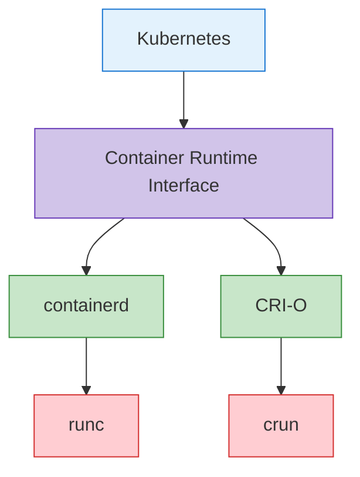

**containerd 設定例**:
```toml
# /etc/containerd/config.toml
version = 2

[plugins]
  [plugins."io.containerd.grpc.v1.cri"]
    sandbox_image = "k8s.gcr.io/pause:3.6"
    [plugins."io.containerd.grpc.v1.cri".containerd]
      default_runtime_name = "runc"
      [plugins."io.containerd.grpc.v1.cri".containerd.runtimes]
        [plugins."io.containerd.grpc.v1.cri".containerd.runtimes.runc]
          runtime_type = "io.containerd.runc.v2"
          [plugins."io.containerd.grpc.v1.cri".containerd.runtimes.runc.options]
            SystemdCgroup = true
```

**CRI-O 設定例**:
```toml
# /etc/crio/crio.conf
[crio]
root = "/var/lib/containers/storage"
runroot = "/var/run/containers/storage"
storage_driver = "overlay"
storage_option = ["overlay.mountopt=nodev"]

[crio.runtime]
default_runtime = "runc"
conmon = "/usr/bin/conmon"
conmon_cgroup = "pod"
cgroup_manager = "systemd"

[crio.image]
pause_image = "k8s.gcr.io/pause:3.6"
```

### Add-on コンポーネント

Add-on は Kubernetes クラスターの機能を拡張する追加コンポーネントです。重要な Add-on には以下があります。

1. **CNI Network Plugin**: Pod ネットワーキングを実装
   - Calico、Cilium、Flannel、Weave Net など

2. **DNS**: クラスター内で DNS service を提供
   - CoreDNS（デフォルト）

3. **Dashboard**: Web ベースの UI を提供
   - Kubernetes Dashboard

4. **Ingress Controller**: HTTP/HTTPS ルーティングを管理
   - NGINX Ingress Controller、Traefik、HAProxy など

5. **Metrics Server**: リソース使用量メトリクスを収集
   - Metrics Server

6. **Logging と Monitoring**: Log 収集と監視
   - Prometheus、Grafana、Elasticsearch、Fluentd、Kibana など

**CoreDNS 設定例**:
```yaml
apiVersion: v1
kind: ConfigMap
metadata:
  name: coredns
  namespace: kube-system
data:
  Corefile: |
    .:53 {
        errors
        health {
            lameduck 5s
        }
        ready
        kubernetes cluster.local in-addr.arpa ip6.arpa {
            pods insecure
            fallthrough in-addr.arpa ip6.arpa
            ttl 30
        }
        prometheus :9153
        forward . /etc/resolv.conf {
            max_concurrent 1000
        }
        cache 30
        loop
        reload
        loadbalance
    }
```

**Calico CNI 設定例**:
```yaml
apiVersion: v1
kind: ConfigMap
metadata:
  name: calico-config
  namespace: kube-system
data:
  calico_backend: "bird"
  cni_network_config: |-
    {
      "name": "k8s-pod-network",
      "cniVersion": "0.3.1",
      "plugins": [
        {
          "type": "calico",
          "log_level": "info",
          "datastore_type": "kubernetes",
          "nodename": "__KUBERNETES_NODE_NAME__",
          "mtu": __CNI_MTU__,
          "ipam": {
            "type": "calico-ipam"
          },
          "policy": {
            "type": "k8s"
          },
          "kubernetes": {
            "kubeconfig": "__KUBECONFIG_FILEPATH__"
          }
        },
        {
          "type": "portmap",
          "snat": true,
          "capabilities": {"portMappings": true}
        }
      ]
    }
```

## クラスター通信パス

Kubernetes クラスター内ではさまざまなコンポーネント間で通信が行われます。これらの通信パスを理解することは、クラスター設計、セキュリティ、トラブルシューティングにとって重要です。

### Control Plane 内部通信

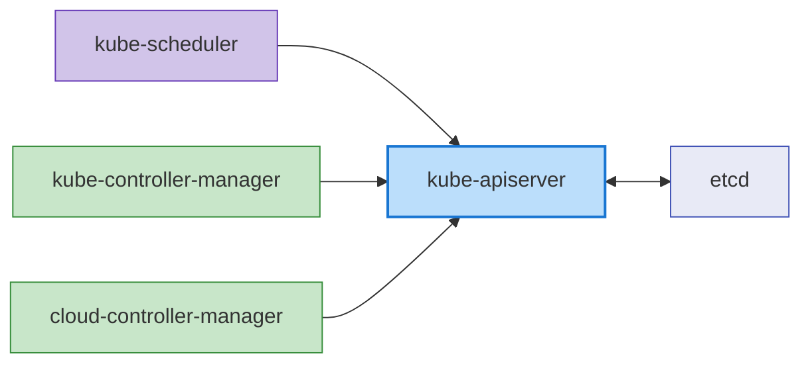

control plane コンポーネント間の通信は次のとおりです。

1. **kube-apiserver と etcd**: kube-apiserver はクラスター状態の保存と取得のために etcd と通信します。
   - Protocol: gRPC
   - Port: 2379/TCP
   - Security: TLS 証明書ベースの認証

2. **kube-scheduler と kube-apiserver**: kube-scheduler は Pod scheduling のために kube-apiserver と通信します。
   - Protocol: HTTPS
   - Port: 6443/TCP (kube-apiserver)
   - Security: TLS 証明書ベースの認証

3. **kube-controller-manager と kube-apiserver**: Controller はクラスター状態の監視と変更のために kube-apiserver と通信します。
   - Protocol: HTTPS
   - Port: 6443/TCP (kube-apiserver)
   - Security: TLS 証明書ベースの認証

4. **cloud-controller-manager と kube-apiserver**: Cloud controller はクラスター状態を監視しクラウドリソースを管理するために kube-apiserver と通信します。
   - Protocol: HTTPS
   - Port: 6443/TCP (kube-apiserver)
   - Security: TLS 証明書ベースの認証

### Control Plane と Node の通信

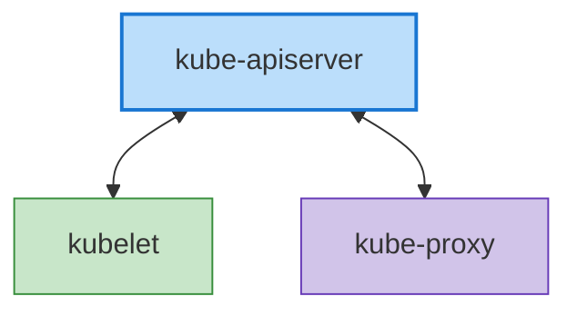

control plane と node 間の通信は次のとおりです。

1. **kube-apiserver と kubelet**: kube-apiserver は Pod spec の配信と node 状態の収集のために kubelet と通信します。
   - Protocol: HTTPS
   - Port: 10250/TCP (kubelet)
   - Security: TLS 証明書ベースの認証

2. **kubelet と kube-apiserver**: kubelet は node 登録、Pod 状態報告、event 送信のために kube-apiserver と通信します。
   - Protocol: HTTPS
   - Port: 6443/TCP (kube-apiserver)
   - Security: TLS 証明書ベースの認証

3. **kube-proxy と kube-apiserver**: kube-proxy は Service 情報を取得するために kube-apiserver と通信します。
   - Protocol: HTTPS
   - Port: 6443/TCP (kube-apiserver)
   - Security: TLS 証明書ベースの認証

### Node 間通信

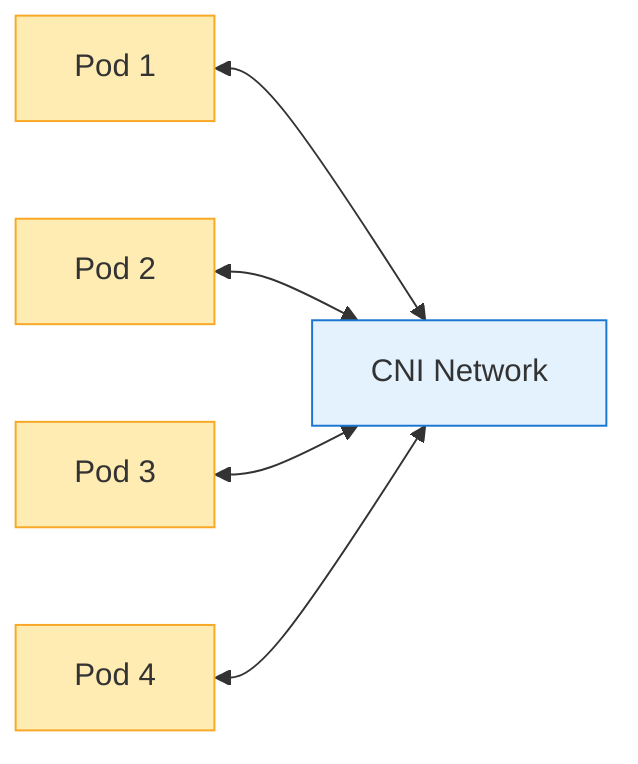

node 間通信は次のとおりです。

1. **Pod-to-Pod 通信**: Pod は CNI plugin が提供するネットワークを通じて相互に通信します。
   - Protocol: アプリケーションに依存（TCP、UDP など）
   - Port: アプリケーションに依存
   - Security: Network policy により制御可能

2. **Cross-Node Pod 通信**: 異なる node 上の Pod 間通信は CNI plugin によって処理されます。
   - Protocol: アプリケーションに依存（TCP、UDP など）
   - Port: アプリケーションに依存
   - Security: Network policy により制御可能

### 外部通信

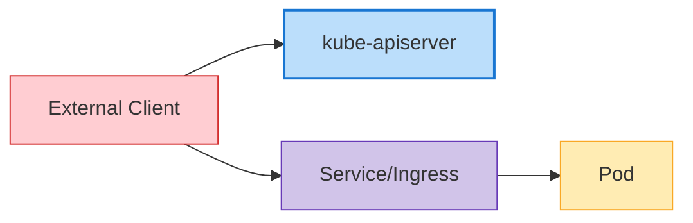

外部エンティティとの通信は次のとおりです。

1. **Client と kube-apiserver**: ユーザーと外部システムは kube-apiserver を通じてクラスターと対話します。
   - Protocol: HTTPS
   - Port: 6443/TCP (kube-apiserver)
   - Security: TLS 証明書、token、ユーザー認証など

2. **外部トラフィックと Service**: 外部トラフィックは NodePort、LoadBalancer Service、または Ingress を通じてクラスター内のアプリケーションにアクセスします。
   - Protocol: HTTP、HTTPS、TCP、UDP など
   - Port: Service 設定に依存
   - Security: Ingress controller と Service 設定に依存

### 通信セキュリティ

Kubernetes クラスター内の通信セキュリティは、以下の方法で実装されます。

1. **TLS 証明書**: control plane コンポーネント間のすべての通信は TLS 証明書で暗号化されます。
2. **認証と認可**: API server へのすべてのリクエストは認証および認可プロセスを通過します。
3. **Network Policy**: Pod 間通信は network policy によって制限できます。
4. **暗号化された Secret**: etcd に保存された Secret は暗号化できます。

**API Server 通信セキュリティ設定例**:
```yaml
apiVersion: apiserver.config.k8s.io/v1
kind: EncryptionConfiguration
resources:
  - resources:
    - secrets
    providers:
    - aescbc:
        keys:
        - name: key1
          secret: <base64-encoded-key>
    - identity: {}
```

### 高可用性クラスター構成

高可用性（HA）Kubernetes クラスターは、単一障害点を排除し、サービスを中断せずに運用を継続できるよう設計されています。

### Control Plane の高可用性

control plane の高可用性は、以下の方法で実装されます。

1. **複数の Control Plane Node**: 冗長性のため通常 3 または 5 の control plane node をデプロイ
2. **etcd Cluster**: 複数の etcd instance で構成される cluster をデプロイ（通常は 3 または 5）
3. **Load Balancer**: API server の前に load balancer を配置してトラフィックを分散

**高可用性 Control Plane アーキテクチャ**:

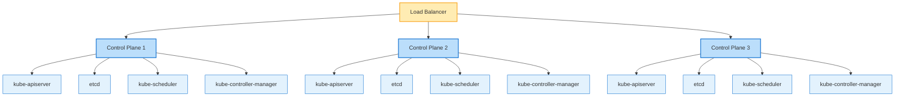

**etcd Cluster 構成**:

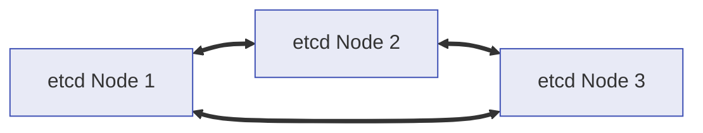

### Worker Node の高可用性

worker node の高可用性は、以下の方法で実装されます。

1. **複数の Worker Node**: ワークロードを複数の worker node に分散
2. **自動 Node リカバリ**: クラウドプロバイダーの自動リカバリ機能を活用
3. **Auto Scaling**: Cluster autoscaler による自動 node スケーリング
4. **複数の Availability Zone**: 複数の availability zone に node をデプロイ

**Worker Node 分散デプロイ**:

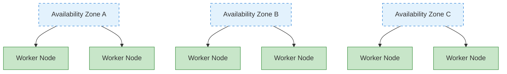

### アプリケーションの高可用性

アプリケーションの高可用性は、以下の方法で実装されます。

1. **ReplicaSet/Deployment**: 複数の Pod replica を実行
2. **Pod 配置ルール**: Pod anti-affinity により Pod を複数の node に分散
3. **PodDisruptionBudget**: 計画的な中断中に最小可用性を保証
4. **Service と Load Balancing**: トラフィックを複数の Pod に分散

**Pod Anti-Affinity の例**:
```yaml
apiVersion: apps/v1
kind: Deployment
metadata:
  name: web-server
spec:
  replicas: 3
  template:
    metadata:
      labels:
        app: web-server
    spec:
      affinity:
        podAntiAffinity:
          requiredDuringSchedulingIgnoredDuringExecution:
          - labelSelector:
              matchExpressions:
              - key: app
                operator: In
                values:
                - web-server
            topologyKey: "kubernetes.io/hostname"
      containers:
      - name: web-server
        image: nginx:1.21
```

**PodDisruptionBudget の例**:
```yaml
apiVersion: policy/v1
kind: PodDisruptionBudget
metadata:
  name: web-server-pdb
spec:
  minAvailable: 2
  selector:
    matchLabels:
      app: web-server
```

### ディザスターリカバリ戦略

Kubernetes クラスターのディザスターリカバリ戦略は、以下の方法で実装されます。

1. **etcd のバックアップとリカバリ**: 定期的な etcd データのバックアップおよびリカバリ手順を確立
2. **マルチリージョンデプロイ**: 複数のリージョンにクラスターをデプロイ
3. **Cluster Federation**: Federation で複数クラスターを管理
4. **継続的バックアップ**: アプリケーションデータを継続的にバックアップ

**etcd バックアップスクリプトの例**:
```bash
#!/bin/bash
ETCDCTL_API=3 etcdctl snapshot save /backup/etcd-snapshot-$(date +%Y%m%d-%H%M%S).db \
  --endpoints=https://127.0.0.1:2379 \
  --cacert=/etc/kubernetes/pki/etcd/ca.crt \
  --cert=/etc/kubernetes/pki/etcd/server.crt \
  --key=/etc/kubernetes/pki/etcd/server.key
```

**etcd リカバリスクリプトの例**:
```bash
#!/bin/bash
# Stop cluster
systemctl stop kubelet
docker stop $(docker ps -q)

# Recover etcd data
ETCDCTL_API=3 etcdctl snapshot restore /backup/etcd-snapshot.db \
  --data-dir=/var/lib/etcd-restore \
  --name=master \
  --initial-cluster=master=https://127.0.0.1:2380 \
  --initial-cluster-token=etcd-cluster \
  --initial-advertise-peer-urls=https://127.0.0.1:2380

# Replace etcd directory with recovered data
mv /var/lib/etcd /var/lib/etcd.old
mv /var/lib/etcd-restore /var/lib/etcd

# Restart cluster
systemctl start kubelet
```

## クラスターネットワーキング

Kubernetes networking は、Pod、Service、外部世界の間の通信を可能にします。Kubernetes networking model は、すべての Pod が一意の IP address を持ち、NAT を介さずに相互通信できることを前提とします。

### Networking Model

Kubernetes networking model には以下の要件があります。

1. **Pod-to-Pod 通信**: すべての Pod は NAT を介さずに他のすべての Pod と通信できなければなりません
2. **Node-to-Pod 通信**: Node は NAT を介さずにすべての Pod と通信できなければなりません
3. **Pod-to-External 通信**: Pod は外部世界と通信できなければなりません（通常 NAT を使用）

### CNI (Container Network Interface)

CNI は Kubernetes で networking を実装するための標準 interface です。さまざまな CNI plugin があり、それぞれ異なる機能とパフォーマンス特性を備えています。

**主な CNI Plugin**:

1. **Calico**: BGP ベースの networking、network policy サポート
   - 特徴: 高パフォーマンス、network policy、暗号化、eBPF サポート
   - ユースケース: 大規模クラスター、セキュリティ重視の環境

2. **Cilium**: eBPF ベースの networking とセキュリティ
   - 特徴: L3-L7 セキュリティポリシー、高パフォーマンス、可観測性
   - ユースケース: Microservice、セキュリティ重視の環境

3. **Flannel**: シンプルな overlay network
   - 特徴: シンプルなセットアップ、軽量
   - ユースケース: 小規模クラスター、開発環境

4. **Weave Net**: Multi-host container networking
   - 特徴: 暗号化、network policy、multi-cloud
   - ユースケース: Hybrid cloud、multi-cloud

**CNI 設定例（Calico）**:
```yaml
apiVersion: v1
kind: ConfigMap
metadata:
  name: calico-config
  namespace: kube-system
data:
  calico_backend: "bird"
  cni_network_config: |-
    {
      "name": "k8s-pod-network",
      "cniVersion": "0.3.1",
      "plugins": [
        {
          "type": "calico",
          "log_level": "info",
          "datastore_type": "kubernetes",
          "nodename": "__KUBERNETES_NODE_NAME__",
          "mtu": __CNI_MTU__,
          "ipam": {
            "type": "calico-ipam"
          },
          "policy": {
            "type": "k8s"
          },
          "kubernetes": {
            "kubeconfig": "__KUBECONFIG_FILEPATH__"
          }
        },
        {
          "type": "portmap",
          "snat": true,
          "capabilities": {"portMappings": true}
        }
      ]
    }
```

### Service Networking

Kubernetes Service は Pod のセットに安定した endpoint を提供します。Service には ClusterIP、NodePort、LoadBalancer、ExternalName など複数の type があります。

**Service Networking コンポーネント**:

1. **ClusterIP**: クラスター内からのみアクセス可能な仮想 IP
2. **kube-proxy**: Service IP 宛てのトラフィックを Pod にルーティング
3. **CoreDNS**: Service discovery のための DNS service

**Service Networking フロー**:
```
Client -> Service (ClusterIP) -> kube-proxy -> Pod
```

**Service の例**:
```yaml
apiVersion: v1
kind: Service
metadata:
  name: my-service
spec:
  selector:
    app: my-app
  ports:
  - port: 80
    targetPort: 8080
  type: ClusterIP
```

### Ingress Networking

Ingress はクラスター外部からクラスター内部の Service への HTTP および HTTPS routing を管理します。Ingress controller は Ingress resource を実装します。

**主な Ingress Controller**:
1. **NGINX Ingress Controller**: NGINX ベースの Ingress controller
2. **AWS ALB Ingress Controller**: AWS Application Load Balancer ベース
3. **Traefik**: Cloud-native edge router
4. **HAProxy Ingress**: HAProxy ベースの Ingress controller

**Ingress Networking フロー**:
```
Client -> Ingress Controller -> Service -> Pod
```

**Ingress の例**:
```yaml
apiVersion: networking.k8s.io/v1
kind: Ingress
metadata:
  name: my-ingress
  annotations:
    nginx.ingress.kubernetes.io/rewrite-target: /
spec:
  ingressClassName: nginx
  rules:
  - host: example.com
    http:
      paths:
      - path: /app
        pathType: Prefix
        backend:
          service:
            name: my-service
            port:
              number: 80
```

### Network Policy

Network policy は Pod 間の通信を制御する方法を提供します。デフォルトではすべての Pod が相互に通信できますが、network policy によりこれを制限できます。

**Network Policy の例**:
```yaml
apiVersion: networking.k8s.io/v1
kind: NetworkPolicy
metadata:
  name: db-network-policy
spec:
  podSelector:
    matchLabels:
      role: db
  policyTypes:
  - Ingress
  - Egress
  ingress:
  - from:
    - podSelector:
        matchLabels:
          role: frontend
    ports:
    - protocol: TCP
      port: 3306
  egress:
  - to:
    - podSelector:
        matchLabels:
          role: monitoring
    ports:
    - protocol: TCP
      port: 9090
```

### ネットワークのトラブルシューティング

Kubernetes networking 問題のトラブルシューティングで使用する一般的なツールとコマンド:

1. **ping、traceroute**: 基本的なネットワーク接続性テスト
2. **tcpdump**: ネットワークパケットのキャプチャと分析
3. **netstat、ss**: ネットワーク接続状態を確認
4. **nslookup、dig**: DNS lookup テスト
5. **kubectl exec**: Pod 内でネットワークコマンドを実行

**ネットワークデバッグの例**:
```bash
# Test network connectivity within a pod
kubectl exec -it <pod-name> -- ping <target-ip>

# Test DNS lookup within a pod
kubectl exec -it <pod-name> -- nslookup <service-name>

# Capture network packets within a pod
kubectl exec -it <pod-name> -- tcpdump -i eth0 -n

# Check service endpoints
kubectl get endpoints <service-name>
```

## クラスターストレージ

Kubernetes storage はコンテナ化されたアプリケーションにデータ永続性を提供します。Kubernetes は、アプリケーションがストレージを効率的に使用できるよう、さまざまなストレージオプションと abstraction を提供します。

### ストレージアーキテクチャ

Kubernetes storage architecture は以下のコンポーネントで構成されます。

1. **Volume**: Pod 内のコンテナに mount できる directory
2. **Persistent Volume (PV)**: クラスター内のストレージリソース
3. **Persistent Volume Claim (PVC)**: ユーザーのストレージ要求
4. **Storage Class**: ストレージの「class」または type を定義
5. **CSI (Container Storage Interface)**: Storage system との標準 interface

**ストレージアーキテクチャフロー**:

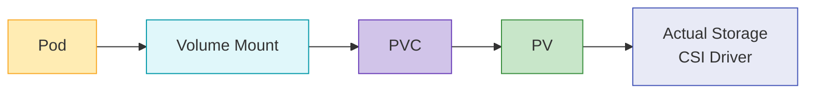

### Volume Type

Kubernetes はさまざまな type の Volume をサポートします。

1. **Ephemeral Volume**:
   - **emptyDir**: 空の directory として開始し、Pod の削除時に削除されます
   - **configMap**: ConfigMap を Volume として mount
   - **secret**: Secret を Volume として mount
   - **downwardAPI**: Pod とコンテナ情報を file として公開

2. **Persistent Volume**:
   - **awsElasticBlockStore**: AWS EBS Volume
   - **azureDisk**: Azure Disk
   - **gcePersistentDisk**: GCE Persistent Disk
   - **nfs**: NFS Volume
   - **csi**: CSI driver を介した Volume

**Volume の例**:
```yaml
apiVersion: v1
kind: Pod
metadata:
  name: test-pd
spec:
  containers:
  - name: test-container
    image: nginx
    volumeMounts:
    - mountPath: /test-pd
      name: test-volume
  volumes:
  - name: test-volume
    persistentVolumeClaim:
      claimName: test-pvc
```

### Persistent Volume と Claim

Persistent Volume（PV）は、管理者によってプロビジョニングされる、または storage class を通じて動的にプロビジョニングされるクラスター内のストレージリソースです。Persistent Volume Claim（PVC）はユーザーのストレージ要求です。

**Persistent Volume の例**:
```yaml
apiVersion: v1
kind: PersistentVolume
metadata:
  name: pv-example
spec:
  capacity:
    storage: 10Gi
  accessModes:
    - ReadWriteOnce
  persistentVolumeReclaimPolicy: Retain
  storageClassName: standard
  awsElasticBlockStore:
    volumeID: vol-0123456789abcdef0
    fsType: ext4
```

**Persistent Volume Claim の例**:
```yaml
apiVersion: v1
kind: PersistentVolumeClaim
metadata:
  name: pvc-example
spec:
  accessModes:
    - ReadWriteOnce
  resources:
    requests:
      storage: 5Gi
  storageClassName: standard
```

### Storage Class

Storage class は、管理者が提供するストレージの「class」を記述します。Storage class を使用すると、PVC が要求されたときに PV を動的にプロビジョニングできます。

**Storage Class の例**:
```yaml
apiVersion: storage.k8s.io/v1
kind: StorageClass
metadata:
  name: standard
provisioner: kubernetes.io/aws-ebs
parameters:
  type: gp3
  fsType: ext4
reclaimPolicy: Delete
allowVolumeExpansion: true
```

### CSI (Container Storage Interface)

CSI は Kubernetes と storage system の間に標準 interface を提供します。CSI により、ストレージプロバイダーは Kubernetes code を変更せずに独自の storage driver を開発できます。

**CSI アーキテクチャ**:

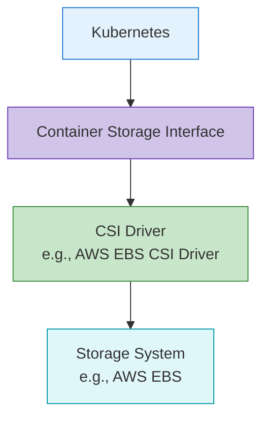

**CSI Driver デプロイ例**:
```yaml
apiVersion: storage.k8s.io/v1
kind: StorageClass
metadata:
  name: ebs-sc
provisioner: ebs.csi.aws.com
parameters:
  type: gp3
  fsType: ext4
  encrypted: "true"
volumeBindingMode: WaitForFirstConsumer
```

### ストレージのベストプラクティス

Kubernetes storage を使用するためのベストプラクティス:

1. **適切な Storage Type の選択**: ワークロード特性に適した storage type を選択
2. **Dynamic Provisioning の使用**: Storage class を通じた dynamic provisioning を活用
3. **適切な Access Mode の選択**: ワークロード要件に適した access mode を選択
4. **Resource Request と Limit の設定**: 適切なストレージ容量を要求
5. **バックアップとリカバリ戦略の確立**: 重要データのバックアップおよびリカバリ戦略を準備
6. **Storage の監視**: ストレージ使用量とパフォーマンスを監視

## クラスターのスケーラビリティ

Kubernetes cluster scalability とは、増加する負荷と要件を処理するクラスターの能力を指します。スケーラビリティは horizontal scaling（scale out）と vertical scaling（scale up）で実装できます。

### クラスターのスケール制限

Kubernetes クラスターには以下のスケール制限があります。

1. **Node 数**: 最大 5,000 node
2. **Pod 数**: クラスターあたり最大 150,000 Pod
3. **Node あたりの Pod 数**: Node あたり最大 110 Pod（デフォルト）
4. **Service 数**: クラスターあたり最大 10,000 Service
5. **Pod あたりの Container 数**: Pod あたり最大 20 Container

これらの制限は Kubernetes version とクラスター構成によって異なる場合があります。

### Horizontal Scaling

horizontal scaling は、より多くの node を追加してクラスター容量を増やします。

**Node Auto Scaling**:
Kubernetes Cluster Autoscaler は、ワークロード要件に基づいて node 数を自動調整します。

```yaml
# AWS Auto Scaling Group tags example
tags:
  k8s.io/cluster-autoscaler/enabled: "true"
  k8s.io/cluster-autoscaler/my-cluster: "owned"
```

**Cluster Autoscaler デプロイ例**:
```yaml
apiVersion: apps/v1
kind: Deployment
metadata:
  name: cluster-autoscaler
  namespace: kube-system
spec:
  replicas: 1
  selector:
    matchLabels:
      app: cluster-autoscaler
  template:
    metadata:
      labels:
        app: cluster-autoscaler
    spec:
      containers:
      - name: cluster-autoscaler
        image: k8s.gcr.io/autoscaling/cluster-autoscaler:v1.24.0
        command:
        - ./cluster-autoscaler
        - --cloud-provider=aws
        - --nodes=2:10:my-asg-group
        - --scale-down-unneeded-time=10m
```

**Karpenter**:
Karpenter は AWS が開発した新しい node auto-scaling ツールであり、より高速かつ効率的な node provisioning を提供します。

```yaml
apiVersion: karpenter.sh/v1
kind: NodePool
metadata:
  name: default
spec:
  template:
    spec:
      requirements:
        - key: karpenter.sh/capacity-type
          operator: In
          values: ["spot", "on-demand"]
      nodeClassRef:
        name: default-class
  limits:
    cpu: 1000
    memory: 1000Gi
---
apiVersion: karpenter.k8s.aws/v1
kind: EC2NodeClass
metadata:
  name: default-class
spec:
  subnetSelector:
    karpenter.sh/discovery: my-cluster
  securityGroupSelector:
    karpenter.sh/discovery: my-cluster
```

### Vertical Scaling

vertical scaling は、既存 node のリソース（CPU、メモリ）を増加させます。

**Vertical Pod Autoscaler (VPA)**:
VPA は Pod の CPU およびメモリ request を自動調整します。

```yaml
apiVersion: autoscaling.k8s.io/v1
kind: VerticalPodAutoscaler
metadata:
  name: my-app-vpa
spec:
  targetRef:
    apiVersion: "apps/v1"
    kind: Deployment
    name: my-app
  updatePolicy:
    updateMode: "Auto"
  resourcePolicy:
    containerPolicies:
    - containerName: '*'
      minAllowed:
        cpu: 100m
        memory: 50Mi
      maxAllowed:
        cpu: 1
        memory: 500Mi
```

### アプリケーションスケーリング

アプリケーションレベルのスケーリングは Pod replica 数を調整して実装されます。

**Horizontal Pod Autoscaler (HPA)**:
HPA は CPU 使用率または custom metrics に基づいて Pod replica 数を自動調整します。

```yaml
apiVersion: autoscaling/v2
kind: HorizontalPodAutoscaler
metadata:
  name: my-app-hpa
spec:
  scaleTargetRef:
    apiVersion: apps/v1
    kind: Deployment
    name: my-app
  minReplicas: 2
  maxReplicas: 10
  metrics:
  - type: Resource
    resource:
      name: cpu
      target:
        type: Utilization
        averageUtilization: 80
```

**KEDA (Kubernetes Event-driven Autoscaling)**:
KEDA は event-driven autoscaling を提供し、さまざまな event source に基づくスケーリングを可能にします。

```yaml
apiVersion: keda.sh/v1alpha1
kind: ScaledObject
metadata:
  name: my-app-scaledobject
spec:
  scaleTargetRef:
    name: my-app
  minReplicaCount: 0
  maxReplicaCount: 10
  triggers:
  - type: kafka
    metadata:
      bootstrapServers: kafka.svc:9092
      consumerGroup: my-group
      topic: my-topic
      lagThreshold: "10"
```

### スケーラビリティのベストプラクティス

Kubernetes cluster scalability のベストプラクティス:

1. **Resource Request と Limit の設定**: すべての Pod に適切な resource request と limit を設定
2. **Node Pool 戦略**: 異なるワークロード特性に対応する複数の node pool を構成
3. **Auto Scaling の構成**: Cluster Autoscaler、HPA、VPA を適切に構成
4. **効率的な Pod 配置**: node affinity、Pod affinity/anti-affinity を活用
5. **クラスター監視**: リソース使用量とパフォーマンスを継続的に監視
6. **負荷テスト**: スケーリング戦略を検証するために定期的に負荷テストを実施

## クラスターセキュリティ

Kubernetes cluster security は複数のレイヤーで実装する必要があります。これには認証、認可、network policy、Pod security などが含まれます。

### 認証

Kubernetes API server へのアクセスを認証する方法:

1. **X.509 証明書**: TLS client 証明書を使用した認証
2. **Service Account Token**: Pod 内で API server にアクセスするための token
3. **OpenID Connect (OIDC)**: 外部 identity provider による認証
4. **Webhook Token Authentication**: 外部認証 service による認証
5. **Authentication Proxy**: Authentication proxy による認証

**kubeconfig の例**:
```yaml
apiVersion: v1
kind: Config
clusters:
- name: my-cluster
  cluster:
    certificate-authority-data: <CA-DATA>
    server: https://api.my-cluster.example.com
users:
- name: admin
  user:
    client-certificate-data: <CERT-DATA>
    client-key-data: <KEY-DATA>
contexts:
- name: my-context
  context:
    cluster: my-cluster
    user: admin
current-context: my-context
```

### 認可

認証済みユーザーのアクションを制御する方法:

1. **RBAC (Role-Based Access Control)**: Role ベースのアクセス制御
2. **ABAC (Attribute-Based Access Control)**: Attribute ベースのアクセス制御
3. **Node Authorization**: Node の特別な認可
4. **Webhook Authorization**: 外部 service による認可

**RBAC の例**:
```yaml
# Role definition
apiVersion: rbac.authorization.k8s.io/v1
kind: Role
metadata:
  namespace: default
  name: pod-reader
rules:
- apiGroups: [""]
  resources: ["pods"]
  verbs: ["get", "watch", "list"]

# Role binding
apiVersion: rbac.authorization.k8s.io/v1
kind: RoleBinding
metadata:
  name: read-pods
  namespace: default
subjects:
- kind: User
  name: jane
  apiGroup: rbac.authorization.k8s.io
roleRef:
  kind: Role
  name: pod-reader
  apiGroup: rbac.authorization.k8s.io
```

### ネットワークセキュリティ

クラスター内のネットワークトラフィックを保護する方法:

1. **Network Policy**: Pod-to-Pod 通信を制御
2. **暗号化通信**: TLS による通信の暗号化
3. **Service Mesh**: Istio、Linkerd などによる高度なネットワークセキュリティ

**Network Policy の例**:
```yaml
apiVersion: networking.k8s.io/v1
kind: NetworkPolicy
metadata:
  name: default-deny-all
spec:
  podSelector: {}
  policyTypes:
  - Ingress
  - Egress
```

### Pod セキュリティ

Pod レベルでのセキュリティ実装:

1. **Pod Security Context**: Pod および container レベルのセキュリティ設定
2. **Pod Security Standards**: Pod セキュリティ要件を定義
3. **seccomp Profile**: System call の制限
4. **AppArmor/SELinux**: Mandatory access control

**Pod Security Context の例**:
```yaml
apiVersion: v1
kind: Pod
metadata:
  name: security-context-pod
spec:
  securityContext:
    runAsUser: 1000
    runAsGroup: 3000
    fsGroup: 2000
  containers:
  - name: app
    image: myapp:1.0
    securityContext:
      allowPrivilegeEscalation: false
      capabilities:
        drop:
        - ALL
```

### Secret 管理

機密情報を安全に管理する方法:

1. **Kubernetes Secret**: 基本的な Secret resource を使用
2. **暗号化された etcd**: etcd に保存された Secret を暗号化
3. **外部 Secret 管理**: HashiCorp Vault、AWS Secrets Manager などを活用

**暗号化された etcd の設定例**:
```yaml
apiVersion: apiserver.config.k8s.io/v1
kind: EncryptionConfiguration
resources:
  - resources:
    - secrets
    providers:
    - aescbc:
        keys:
        - name: key1
          secret: <base64-encoded-key>
    - identity: {}
```

### セキュリティのベストプラクティス

Kubernetes cluster security のベストプラクティス:

1. **最小権限の原則**: 必要最小限の権限のみを付与
2. **定期的な更新**: クラスターとコンポーネントを定期的に更新
3. **ネットワーク分離**: Network policy により Pod-to-Pod 通信を制限
4. **Image セキュリティ**: 信頼できる Image のみを使用し、脆弱性スキャンを実装
5. **Audit Logging**: クラスターアクティビティの audit log を有効化
6. **セキュリティベンチマーク**: CIS benchmark などのセキュリティ標準に準拠

## クラスターアップグレード

Kubernetes cluster upgrade は、新機能、セキュリティパッチ、バグ修正を適用するために必要です。upgrade は慎重に計画して実行する必要があります。

### 2026 年 7 月の更新: Kubernetes v1.37 が Beta に

v1.37.0-beta.0 は 2026 年 7 月 20 日に公開され、次の minor release である v1.37 はリリースサイクルの後期段階へ移行しました。Code Freeze は予定どおり 2026 年 7 月 22～23 日に発効し、最終的な v1.37.0 release は 2026 年 8 月 26 日に予定されています。完全なスケジュールは [v1.37 release information](https://www.kubernetes.dev/resources/release/) を参照してください。

同じ週（2026 年 7 月 22～23 日）に、保守対象の全ライン向け patch release が公開されました: [v1.36.3](https://github.com/kubernetes/kubernetes/releases/tag/v1.36.3)、[v1.35.7](https://github.com/kubernetes/kubernetes/releases/tag/v1.35.7)、[v1.34.10](https://github.com/kubernetes/kubernetes/releases/tag/v1.34.10)。通常どおり、ご使用の minor version 向けの最新 patch を適用することを推奨します。

### 2026 年 8 月の更新: v1.37 Sneak Peek

2026 年 7 月 31 日、release team は [Kubernetes v1.37 sneak peek](https://kubernetes.io/blog/2026/07/31/kubernetes-v1-37-sneak-peek/) を公開し、2026 年 8 月 26 日に引き続き予定されている最終 v1.37.0 release に先立ち、計画されている非推奨化、削除、機能変更を概説しました。Docs Freeze は 2026 年 8 月 5～6 日に発効しました。一方、次のサイクルの最初の tag である v1.38.0-alpha.0 は 2026 年 8 月 6 日に作成されました。

### アップグレード戦略

Kubernetes cluster upgrade の戦略:

1. **Blue/Green Upgrade**: 新 version のクラスターを別途作成し、ワークロードを移行
2. **In-Place Upgrade**: 既存クラスターを直接 upgrade
3. **Canary Upgrade**: 検証のため最初に一部の node のみを upgrade

### アップグレード順序

Kubernetes cluster upgrade の一般的な順序:

1. **Control Plane Upgrade**: kube-apiserver、kube-controller-manager、kube-scheduler、etcd
2. **DNS と CNI の Upgrade**: CoreDNS、CNI plugin、その他の主要 Add-on
3. **Worker Node Upgrade**: Worker node を順次 upgrade

**kubeadm Upgrade の例**:
```bash
# Control plane upgrade
kubeadm upgrade plan
kubeadm upgrade apply v1.24.0

# Worker node upgrade
kubectl drain <node-name> --ignore-daemonsets
# Upgrade kubelet and kubeadm on the node
apt-get update && apt-get install -y kubelet=1.24.0-00 kubeadm=1.24.0-00
kubeadm upgrade node
systemctl restart kubelet
kubectl uncordon <node-name>
```

### アップグレードの考慮事項

Kubernetes クラスターを upgrade する際の考慮事項:

1. **API 変更**: 新 version の API 変更を確認
2. **Feature Gate**: 新しい feature gate とデフォルト値の変更を確認
3. **依存関係**: CNI、CSI など依存コンポーネントの互換性を確認
4. **Downtime**: Upgrade 中に予想される downtime を計画
5. **Rollback Plan**: 問題発生時の rollback plan を確立

### アップグレードのベストプラクティス

Kubernetes cluster upgrade のベストプラクティス:

1. **最初にテスト環境で検証**: 本番 upgrade 前にテスト環境で検証
2. **段階的な Upgrade**: 一度に 1 minor version ずつ upgrade
3. **バックアップ**: Upgrade 前に etcd データをバックアップ
4. **ドキュメント化**: Upgrade 手順と結果を文書化
5. **監視**: Upgrade 中および upgrade 後にクラスター状態を監視
6. **Upgrade Window**: 低トラフィック期間中に upgrade を実行

## Amazon EKS クラスターアーキテクチャ

Amazon EKS（Elastic Kubernetes Service）は AWS が提供する managed Kubernetes service です。EKS は Kubernetes のすべての基本機能を提供しつつ、AWS service との統合および管理の利便性を追加します。

### EKS アーキテクチャの概要

EKS クラスターは以下のコンポーネントで構成されます。

1. **EKS Control Plane**: AWS が管理する Kubernetes control plane
2. **EKS Node**: ユーザーが管理する worker node（EC2 instance）
3. **EKS Managed Node Group**: AWS が管理する node group
4. **EKS Fargate Profile**: Serverless container 実行環境
5. **VPC と Subnet**: クラスターネットワーキング用の VPC と subnet

**EKS アーキテクチャ図**:

```mermaid
graph TD
    classDef aws fill:#e8f5e9,stroke:#2e7d32,stroke-width:1px;
    classDef eks fill:#fce4ec,stroke:#c2185b,stroke-width:1px;
    classDef controlplane fill:#bbdefb,stroke:#1976d2,stroke-width:2px;
    classDef nodes fill:#c8e6c9,stroke:#388e3c,stroke-width:1px;
    classDef services fill:#d1c4e9,stroke:#673ab7,stroke-width:1px;
    classDef network fill:#f3e5f5,stroke:#7b1fa2,stroke-width:1px;

    AWS[AWS Cloud] --> CP[EKS Control Plane<br>AWS Managed]
    AWS --> WN[Worker Nodes]
    AWS --> AWSS[AWS Services]
    AWS --> VPC[VPC & Networking]

    CP --> API[kube-apiserver]
    CP --> ETCD[etcd]
    CP --> SCHED[kube-scheduler]
    CP --> CTRL[kube-controller-manager]

    WN --> NG1[Node Group 1<br>EC2 instances]
    WN --> NG2[Node Group 2<br>EC2 instances]
    WN --> FG[Fargate Profile<br>Serverless]

    AWSS --> IAM[IAM]
    AWSS --> ECR[ECR]
    AWSS --> ELB[ELB/ALB/NLB]
    AWSS --> EBS[EBS/EFS/FSx]
    AWSS --> CW[CloudWatch]

    VPC --> VPCM[VPC]
    VPC --> SN[Subnets]
    VPC --> SG[Security Groups]
    VPC --> RT[Route Tables]
    VPC --> CNI[VPC CNI]

    class AWS aws;
    class CP controlplane;
    class WN nodes;
    class AWSS,IAM,ECR,ELB,EBS,CW services;
    class VPC,VPCM,SN,SG,RT,CNI network;
    class API,ETCD,SCHED,CTRL,NG1,NG2,FG eks;
```

### EKS Control Plane

EKS control plane は AWS によって管理され、複数の availability zone にわたる高可用性を提供します。

**主な特徴**:
1. **Managed Service**: AWS が control plane のメンテナンスと upgrade を管理
2. **高可用性**: 複数の availability zone にデプロイ
3. **Auto Scaling**: 負荷に基づいて自動的にスケール
4. **セキュリティ**: AWS security service と統合

### EKS Node Type

EKS はさまざまな type の node をサポートします。

1. **Self-Managed Node**: ユーザーが EC2 instance を直接管理
2. **Managed Node Group**: AWS が node lifecycle を管理
3. **Fargate**: Serverless container 実行環境
4. **Bottlerocket Node**: Container workload に最適化された OS

**Managed Node Group の例**:
```yaml
apiVersion: eksctl.io/v1alpha5
kind: ClusterConfig
metadata:
  name: my-cluster
  region: ap-northeast-2
managedNodeGroups:
  - name: ng-1
    instanceType: m5.large
    desiredCapacity: 3
    minSize: 2
    maxSize: 5
    volumeSize: 80
    privateNetworking: true
    labels:
      role: worker
    tags:
      nodegroup-role: worker
    iam:
      withAddonPolicies:
        autoScaler: true
        albIngress: true
```

### EKS Networking

EKS networking は Amazon VPC に基づいており、以下のコンポーネントを含みます。

1. **VPC CNI Plugin**: AWS VPC networking との統合
2. **Security Group**: Node および Pod レベルのネットワークセキュリティ
3. **Load Balancer 統合**: ELB、ALB、NLB との統合
4. **VPC Endpoint**: AWS service とのプライベート通信

**VPC CNI 設定例**:
```yaml
apiVersion: v1
kind: ConfigMap
metadata:
  name: amazon-vpc-cni
  namespace: kube-system
data:
  enable-network-policy: "true"
  enable-pod-eni: "true"
  warm-ip-target: "5"
  minimum-ip-target: "10"
```

### EKS Storage

EKS はさまざまな AWS storage service と統合します。

1. **EBS CSI Driver**: Amazon EBS Volume 管理
2. **EFS CSI Driver**: Amazon EFS file system 管理
3. **FSx for Lustre CSI Driver**: FSx for Lustre file system 管理
4. **S3**: Object storage

**EBS CSI Driver の例**:
```yaml
apiVersion: storage.k8s.io/v1
kind: StorageClass
metadata:
  name: ebs-sc
provisioner: ebs.csi.aws.com
parameters:
  type: gp3
  encrypted: "true"
volumeBindingMode: WaitForFirstConsumer
```

### EKS Security

EKS は AWS security service と統合して強力なセキュリティを提供します。

1. **IAM 統合**: AWS IAM と Kubernetes RBAC の統合
2. **VPC Security**: VPC security group および network ACL
3. **AWS KMS**: Secret 暗号化のための KMS 統合
4. **AWS WAF**: Web application firewall 統合
5. **AWS Shield**: DDoS 保護

**IAM Role Service Account の例**:
```yaml
apiVersion: v1
kind: ServiceAccount
metadata:
  name: s3-reader
  namespace: default
  annotations:
    eks.amazonaws.com/role-arn: arn:aws:iam::123456789012:role/s3-reader-role
```

### EKS Monitoring と Logging

EKS は AWS monitoring および logging service と統合します。

1. **CloudWatch Container Insights**: Container 監視
2. **CloudWatch Logs**: Log 収集と分析
3. **X-Ray**: Distributed tracing
4. **Prometheus と Grafana**: Open source monitoring tool 統合

**CloudWatch Container Insights の例**:
```yaml
apiVersion: v1
kind: Namespace
metadata:
  name: amazon-cloudwatch
---
apiVersion: apps/v1
kind: DaemonSet
metadata:
  name: cloudwatch-agent
  namespace: amazon-cloudwatch
spec:
  selector:
    matchLabels:
      name: cloudwatch-agent
  template:
    metadata:
      labels:
        name: cloudwatch-agent
    spec:
      containers:
      - name: cloudwatch-agent
        image: amazon/cloudwatch-agent:1.247347.6b250880
        # ... additional configuration
```

### EKS コスト最適化

EKS クラスターコストを最適化する方法:

1. **Spot Instance**: コスト効率の高い Spot instance を活用
2. **Fargate**: Serverless container 実行により idle resource cost を削減
3. **Auto Scaling**: Cluster autoscaler によるリソース最適化
4. **Graviton Processor**: ARM ベースの Graviton instance を活用
5. **Resource Request 最適化**: 適切な resource request と limit を設定

**Spot Instance Node Group の例**:
```yaml
apiVersion: eksctl.io/v1alpha5
kind: ClusterConfig
metadata:
  name: my-cluster
  region: ap-northeast-2
managedNodeGroups:
  - name: spot-ng
    instanceTypes: ["m5.large", "m5a.large", "m5d.large", "m5ad.large"]
    spot: true
    desiredCapacity: 3
    minSize: 2
    maxSize: 10
```

## さらに学ぶ

このドキュメントで扱ったクラスターアーキテクチャへの理解を深めるには、次のトピックを参照してください。

- [Kubernetes 入門](../basics/04-kubernetes-introduction.md) - Kubernetes の基本概念と歴史
- [Pod と Workload](./02-pods-and-workloads.md) - クラスター内で実行される workload の管理
- [Service と Networking](./03-services-networking.md) - クラスター内の networking 構成
- [Scheduling、Preemption、Eviction](./08-scheduling-preemption-eviction.md) - Pod が node に配置される仕組み
- [クラスター管理](./09-cluster-administration.md) - クラスターの運用と管理
- [EKS 入門](../eks/01-eks-introduction.md) - Amazon EKS service の概要
- [EKS クラスターの作成](../eks/02-eks-cluster-creation-part1.md) - EKS クラスターの作成方法

### ハンズオンと上級学習

- [Kubernetes 公式チュートリアル](https://kubernetes.io/docs/tutorials/) - ハンズオンによる学習
- [Kubernetes The Hard Way](https://github.com/kelseyhightower/kubernetes-the-hard-way) - Kubernetes クラスターを手動で構築
- [Cilium Networking](../networking/cilium/01-introduction.md) - 高度な networking とセキュリティ機能

## まとめ

このドキュメントでは、Kubernetes クラスターのアーキテクチャ、主なコンポーネント、およびそれらが連携する方法を確認しました。また、cluster networking、storage、scalability、security、upgrade などの重要な側面と、Amazon EKS クラスターのアーキテクチャも扱いました。

Kubernetes クラスターアーキテクチャを理解することは、効果的なクラスター設計、デプロイ、運用の基盤です。この知識により、安定性、スケーラビリティ、セキュリティを強化した Kubernetes 環境を構築できます。

## クイズ

この章で学んだ内容をテストするには、[クラスターアーキテクチャクイズ](../quizzes/core/01-cluster-architecture-quiz.md) に挑戦してください。

## 参考資料

- [Kubernetes 公式ドキュメント](https://kubernetes.io/docs/)
- [Amazon EKS ドキュメント](https://docs.aws.amazon.com/eks/)
- [Kubernetes The Hard Way](https://github.com/kelseyhightower/kubernetes-the-hard-way)
- [Kubernetes Patterns](https://www.oreilly.com/library/view/kubernetes-patterns/9781492050278/)
- [Kubernetes Up & Running](https://www.oreilly.com/library/view/kubernetes-up-and/9781492046523/)
- [Kubernetes Best Practices](https://www.oreilly.com/library/view/kubernetes-best-practices/9781492056461/)
