# Cluster Architecture

> **サポートバージョン**: Kubernetes 1.32, 1.33, 1.34
> **最終更新**: July 11, 2026

## Lab Environment Setup

このドキュメントの概念を実践するには、次のツールと環境が必要です。

### Required Tools
- kubectl v1.34 以上
- 動作する Kubernetes cluster（EKS、minikube、kind など）

### Local Development Environment Setup

```bash
# Install minikube (for local development)
curl -LO https://storage.googleapis.com/minikube/releases/latest/minikube-linux-amd64
sudo install minikube-linux-amd64 /usr/local/bin/minikube

# Start cluster
minikube start

# Check cluster status
kubectl cluster-info

# Check control plane components
kubectl get pods -n kube-system
```

## Cluster Architecture Overview

> **Core Concept**: Kubernetes cluster は control plane と worker node で構成され、それぞれは特定の役割を実行する複数の component で構成されます。

Kubernetes cluster は、containerized application を実行するための node（仮想マシンまたは物理マシン）の集合で構成されます。cluster は大きく control plane と worker node に分かれます。

### Cluster Architecture Diagram

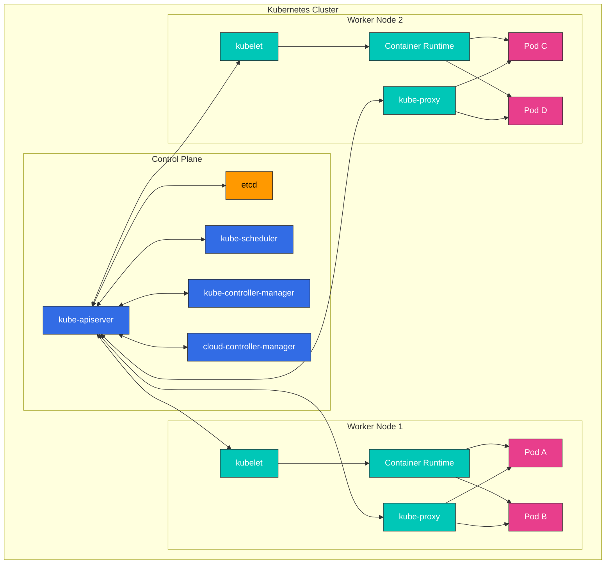

**Control Plane Components**:
- **kube-apiserver**: Kubernetes API を公開する frontend
- **etcd**: すべての cluster data を保存する key-value store
- **kube-scheduler**: 新しく作成された pod を実行する node を選択
- **kube-controller-manager**: cluster state を管理する controller を実行
- **cloud-controller-manager**: cloud provider API と連携

**Worker Node Components**:
- **kubelet**: 各 node 上で実行される agent で、container の実行を管理
- **kube-proxy**: network rule を維持し、connection forwarding を実行
- **Container Runtime**: container を実行（containerd、CRI-O など）

## Control Plane Components

control plane は Kubernetes cluster の「頭脳」として機能し、cluster 全体の状態を管理および制御します。control plane component は通常、専用マシン上で実行され、高可用性のために複数の instance に複製できます。

### Control Plane Component Details

| Component | 主な機能 | 通信先 | 高可用性構成 |
|-----------|---------------|----------------------|--------------------------------|
| **kube-apiserver** | - Kubernetes API の提供<br>- authentication と authorization<br>- API request の処理 | - すべての component<br>- etcd | 複数 instance による水平 scaling |
| **etcd** | - cluster data の保存<br>- 分散 key-value store<br>- consistency の保証 | - kube-apiserver | multi-node cluster |
| **kube-scheduler** | - Pod 配置の決定<br>- node resource の評価<br>- affinity/anti-affinity の適用 | - kube-apiserver | active-standby 構成 |
| **kube-controller-manager** | - Node controller<br>- Replication controller<br>- Endpoint controller<br>- Service account controller | - kube-apiserver | active-standby 構成 |
| **cloud-controller-manager** | - cloud provider 統合<br>- node lifecycle<br>- routing と load balancing | - kube-apiserver<br>- Cloud API | active-standby 構成 |

### Control Plane Communication Flow

1. user または controller が kube-apiserver に request を送信します
2. kube-apiserver が authentication、authorization、admission を実行します
3. kube-apiserver が etcd から data を読み取り、または etcd に data を書き込みます
4. controller と scheduler は kube-apiserver を通じて cluster state を watch します
5. kubelet が node status を kube-apiserver に報告します

### kube-apiserver

kube-apiserver は Kubernetes API を公開する control plane の frontend です。すべての内部および外部 request は、この API server を通じて処理されます。

**Main Functions**:
- REST API の提供
- authentication と authorization
- request の validation と processing
- etcd との通信
- 水平 scaling 可能（複数 instance に scale 可能）

**Main Flags and Configuration Options**:
```bash
# Basic configuration example
kube-apiserver \
  --advertise-address=192.168.1.10 \
  --allow-privileged=true \
  --authorization-mode=Node,RBAC \
  --enable-admission-plugins=NodeRestriction \
  --enable-bootstrap-token-auth=true \
  --etcd-servers=https://127.0.0.1:2379 \
  --kubelet-client-certificate=/etc/kubernetes/pki/apiserver-kubelet-client.crt \
  --kubelet-client-key=/etc/kubernetes/pki/apiserver-kubelet-client.key \
  --service-account-key-file=/etc/kubernetes/pki/sa.pub \
  --service-cluster-ip-range=10.96.0.0/12 \
  --tls-cert-file=/etc/kubernetes/pki/apiserver.crt \
  --tls-private-key-file=/etc/kubernetes/pki/apiserver.key
```

**API Server Security**:
- TLS certificate による安全な通信
- さまざまな authentication method（X.509 certificate、service account token、OIDC、webhook など）をサポート
- RBAC（Role-Based Access Control）による permission management
- admission controller による request の validation と modification

### etcd

etcd は、すべての cluster data を保存する一貫性のある高可用な key-value store です。Kubernetes の「source of truth」として機能します。

**Key Features**:
- 分散 system
- 強い consistency（Raft consensus algorithm を使用）
- 高可用性（複数 node で構成可能）
- 安全な data storage
- 変更を監視する watch 機能

**etcd Cluster Configuration**:
```bash
# etcd cluster configuration example (3 nodes)
etcd \
  --name etcd-1 \
  --initial-advertise-peer-urls https://192.168.1.11:2380 \
  --listen-peer-urls https://192.168.1.11:2380 \
  --listen-client-urls https://192.168.1.11:2379,https://127.0.0.1:2379 \
  --advertise-client-urls https://192.168.1.11:2379 \
  --initial-cluster-token etcd-cluster \
  --initial-cluster etcd-1=https://192.168.1.11:2380,etcd-2=https://192.168.1.12:2380,etcd-3=https://192.168.1.13:2380 \
  --initial-cluster-state new \
  --data-dir=/var/lib/etcd
```

**etcd Backup and Recovery**:
```bash
# etcd backup
ETCDCTL_API=3 etcdctl snapshot save snapshot.db \
  --endpoints=https://127.0.0.1:2379 \
  --cacert=/etc/kubernetes/pki/etcd/ca.crt \
  --cert=/etc/kubernetes/pki/etcd/server.crt \
  --key=/etc/kubernetes/pki/etcd/server.key

# etcd recovery
ETCDCTL_API=3 etcdctl snapshot restore snapshot.db \
  --data-dir=/var/lib/etcd-restore \
  --name=etcd-1 \
  --initial-cluster=etcd-1=https://192.168.1.11:2380 \
  --initial-cluster-token=etcd-cluster \
  --initial-advertise-peer-urls=https://192.168.1.11:2380
```

**etcd Performance Optimization**:
- Disk I/O optimization（SSD 推奨）
- 適切な memory allocation
- 定期的な compaction と defragmentation
- cluster size に基づく適切な etcd node 数（通常 3 または 5）

#### July 2026 Update: etcd v3.7.0 Released

2026 年 7 月 8 日、SIG etcd は etcd v3.7.0 をリリースしました。主なハイライトは次のとおりです。

- **RangeStream**: 大きな range result を response 全体を memory に buffer する代わりに chunk で stream します（長く要望されていた機能）
- **Performance improvements**: keys-only range request の最適化、より高速で信頼性の高い lease
- legacy v2store の最後の残存部分を削除し、大規模な protobuf overhaul を完了
- 更新された core dependency bbolt v1.5.0 と raft v3.7.0 を同梱

詳細は [公式発表](https://kubernetes.io/blog/2026/07/08/announcing-etcd-3.7/) と [etcd v3.7 changelog](https://github.com/etcd-io/etcd/blob/main/CHANGELOG/CHANGELOG-3.7.md) を参照してください。

### kube-scheduler

kube-scheduler は、新しく作成された pod を実行する node を選択する control plane component です。

**Scheduling Process**:
1. **Filtering**: pod を実行できる node を特定
   - resource requirements（CPU、memory）
   - Node selector、node affinity
   - taint と toleration
   - volume constraint

2. **Scoring**: 適切な node に score を割り当て
   - resource utilization
   - Pod inter-affinity/anti-affinity
   - data locality
   - node 間の load balancing

3. **Binding**: pod を最適な node に割り当て

**Scheduler Configuration**:
```bash
# Basic configuration example
kube-scheduler \
  --kubeconfig=/etc/kubernetes/scheduler.conf \
  --leader-elect=true \
  --v=2
```

**Scheduler Profiles and Plugins**:
- default scheduler profile
- custom scheduler profile
- scheduler extension point（filter、score、bind など）
- multiple scheduler support

**Scheduling Policy**:
```yaml
# Scheduling policy example
apiVersion: kubescheduler.config.k8s.io/v1
kind: KubeSchedulerConfiguration
profiles:
- schedulerName: default-scheduler
  plugins:
    score:
      disabled:
      - name: NodeResourcesLeastAllocated
      enabled:
      - name: NodeResourcesMostAllocated
        weight: 1
```

### kube-controller-manager

kube-controller-manager は、複数の controller process を実行する control plane component です。各 controller は cluster の特定の側面を管理します。

**Main Controllers**:
- **Node Controller**: node status を監視し対応
- **Replication Controller**: pod replica count を維持
- **Endpoint Controller**: service と pod を接続
- **Service Account & Token Controller**: namespace 用の default account と API token を作成
- **Job Controller**: 一回限りの task を管理
- **CronJob Controller**: scheduled task を管理
- **DaemonSet Controller**: 特定の pod がすべての node で実行されることを保証
- **StatefulSet Controller**: stateful application を管理
- **PV Controller**: persistent volume を管理
- **Namespace Controller**: namespace lifecycle を管理
- **Garbage Collector**: orphaned object を cleanup

**Controller Manager Configuration**:
```bash
# Basic configuration example
kube-controller-manager \
  --kubeconfig=/etc/kubernetes/controller-manager.conf \
  --leader-elect=true \
  --use-service-account-credentials=true \
  --root-ca-file=/etc/kubernetes/pki/ca.crt \
  --service-account-private-key-file=/etc/kubernetes/pki/sa.key \
  --cluster-signing-cert-file=/etc/kubernetes/pki/ca.crt \
  --cluster-signing-key-file=/etc/kubernetes/pki/ca.key \
  --controllers=*,bootstrapsigner,tokencleaner
```

**Controller Operation**:
1. controller は API server を通じて cluster state を継続的に watch します
2. 現在の状態と desired state の差分を検出します
3. 差分を reconcile するための operation を実行します
4. state change を API server に報告します

### cloud-controller-manager

cloud-controller-manager は、cloud 固有の control logic を含む control plane component です。これにより、Kubernetes core と cloud provider API を分離できます。

**Main Controllers**:
- **Node Controller**: cloud provider API を通じて node status を確認
- **Route Controller**: cloud environment の route を構成
- **Service Controller**: cloud load balancer を作成、更新、削除
- **Volume Controller**: cloud storage volume を作成、attach、mount

**Cloud Provider Implementations**:
- AWS Cloud Controller Manager
- Azure Cloud Controller Manager
- GCP Cloud Controller Manager
- OpenStack Cloud Controller Manager
- vSphere Cloud Controller Manager

**Cloud Controller Manager Configuration**:
```bash
# AWS Cloud Controller Manager example
cloud-controller-manager \
  --cloud-provider=aws \
  --cloud-config=/etc/kubernetes/cloud-config \
  --kubeconfig=/etc/kubernetes/cloud-controller-manager.conf \
  --leader-elect=true
```

**Cloud Controller Manager Benefits**:
- cloud provider 固有の code を Kubernetes core から分離
- cloud provider が独自の機能を独立して開発可能
- Kubernetes core を変更せずに cloud feature を追加

## Node Components

Node は Kubernetes cluster 内で containerized application を実行する worker machine です。各 node は control plane によって管理され、複数の component で構成されます。

### kubelet

kubelet は各 node 上で実行される agent で、pod 内の container を管理します。kubelet はさまざまな仕組みを通じて PodSpec を受け取り、その spec に従って container が正常に実行されるようにします。

**Main Functions**:
- PodSpec に従って container を実行
- container status を監視して報告
- container lifecycle を管理
- volume mount を管理
- node status を報告
- container health check を実行

**kubelet Configuration**:
```bash
# Basic configuration example
kubelet \
  --kubeconfig=/etc/kubernetes/kubelet.conf \
  --config=/var/lib/kubelet/config.yaml \
  --container-runtime=remote \
  --container-runtime-endpoint=unix:///var/run/containerd/containerd.sock \
  --pod-infra-container-image=k8s.gcr.io/pause:3.6
```

**kubelet Configuration File Example**:
```yaml
# /var/lib/kubelet/config.yaml
apiVersion: kubelet.config.k8s.io/v1beta1
kind: KubeletConfiguration
address: 0.0.0.0
authentication:
  anonymous:
    enabled: false
  webhook:
    cacheTTL: 2m0s
    enabled: true
  x509:
    clientCAFile: /etc/kubernetes/pki/ca.crt
authorization:
  mode: Webhook
  webhook:
    cacheAuthorizedTTL: 5m0s
    cacheUnauthorizedTTL: 30s
cgroupDriver: systemd
clusterDomain: cluster.local
cpuManagerPolicy: none
evictionHard:
  memory.available: 100Mi
  nodefs.available: 10%
  nodefs.inodesFree: 5%
failSwapOn: true
healthzBindAddress: 127.0.0.1
healthzPort: 10248
```

**Static Pods**:
kubelet は API server を経由せずに直接管理する static pod を実行できます。これは主に control plane component を実行するために使用されます。

```yaml
# /etc/kubernetes/manifests/kube-apiserver.yaml
apiVersion: v1
kind: Pod
metadata:
  name: kube-apiserver
  namespace: kube-system
spec:
  containers:
  - name: kube-apiserver
    image: k8s.gcr.io/kube-apiserver:v1.24.0
    command:
    - kube-apiserver
    - --advertise-address=192.168.1.10
    # ... additional flags
```

### kube-proxy

kube-proxy は、Kubernetes Service の概念を実装するために各 node 上で実行される network proxy です。node 上の network rule を維持し、connection forwarding を実行します。

**Main Functions**:
- service IP と port の network rule を維持
- connection forwarding
- load balancing を実装
- service discovery をサポート

**Operating Modes**:
1. **userspace mode**: user space で proxy を実行（legacy）
2. **iptables mode**: Linux iptables を使用した NAT 実装（default）
3. **IPVS mode**: Linux kernel の IP Virtual Server を使用（高性能）

**kube-proxy Configuration**:
```bash
# Basic configuration example
kube-proxy \
  --config=/var/lib/kube-proxy/config.conf \
  --hostname-override=node1
```

**kube-proxy Configuration File Example**:
```yaml
# /var/lib/kube-proxy/config.conf
apiVersion: kubeproxy.config.k8s.io/v1alpha1
kind: KubeProxyConfiguration
bindAddress: 0.0.0.0
clientConnection:
  acceptContentTypes: ""
  burst: 10
  contentType: application/vnd.kubernetes.protobuf
  kubeconfig: /var/lib/kube-proxy/kubeconfig.conf
  qps: 5
clusterCIDR: 10.244.0.0/16
configSyncPeriod: 15m0s
conntrack:
  maxPerCore: 32768
  min: 131072
  tcpCloseWaitTimeout: 1h0m0s
  tcpEstablishedTimeout: 24h0m0s
enableProfiling: false
healthzBindAddress: 0.0.0.0:10256
hostnameOverride: node1
iptables:
  masqueradeAll: false
  masqueradeBit: 14
  minSyncPeriod: 0s
  syncPeriod: 30s
ipvs:
  excludeCIDRs: null
  minSyncPeriod: 0s
  scheduler: ""
  syncPeriod: 30s
mode: "iptables"
```

**IPVS vs iptables Mode Comparison**:

| Characteristic | iptables Mode | IPVS Mode |
|----------------|---------------|-----------|
| Performance | service 数が多い場合に性能低下 | 大規模 cluster でより高い性能 |
| Load Balancing Algorithms | round robin のみサポート | さまざまな algorithm をサポート（rr、lc、dh、sh、sed、nq） |
| Implementation | network packet filtering chain | hash table ベース |
| Kernel Requirements | default kernel module | IPVS kernel module が必要 |

### Container Runtime

Container runtime は container を実行する software です。Kubernetes は Container Runtime Interface（CRI）を通じてさまざまな container runtime をサポートします。

**Main Container Runtimes**:
1. **containerd**: 軽量 container runtime（現在もっとも広く使用）
2. **CRI-O**: Kubernetes 向けに特化して設計された軽量 runtime
3. **Docker Engine**: Docker shim を通じてサポート（Kubernetes 1.24 から deprecated）

**Container Runtime Layer Structure**:

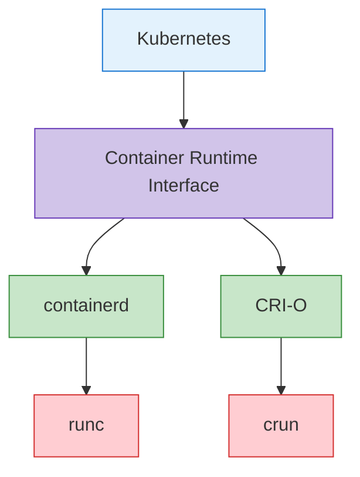

**containerd Configuration Example**:
```toml
# /etc/containerd/config.toml
version = 2

[plugins]
  [plugins."io.containerd.grpc.v1.cri"]
    sandbox_image = "k8s.gcr.io/pause:3.6"
    [plugins."io.containerd.grpc.v1.cri".containerd]
      default_runtime_name = "runc"
      [plugins."io.containerd.grpc.v1.cri".containerd.runtimes]
        [plugins."io.containerd.grpc.v1.cri".containerd.runtimes.runc]
          runtime_type = "io.containerd.runc.v2"
          [plugins."io.containerd.grpc.v1.cri".containerd.runtimes.runc.options]
            SystemdCgroup = true
```

**CRI-O Configuration Example**:
```toml
# /etc/crio/crio.conf
[crio]
root = "/var/lib/containers/storage"
runroot = "/var/run/containers/storage"
storage_driver = "overlay"
storage_option = ["overlay.mountopt=nodev"]

[crio.runtime]
default_runtime = "runc"
conmon = "/usr/bin/conmon"
conmon_cgroup = "pod"
cgroup_manager = "systemd"

[crio.image]
pause_image = "k8s.gcr.io/pause:3.6"
```

### Add-on Components

Add-on は Kubernetes cluster の機能を拡張する追加 component です。重要な add-on には次のものがあります。

1. **CNI Network Plugins**: pod networking を実装
   - Calico、Cilium、Flannel、Weave Net など

2. **DNS**: cluster 内で DNS service を提供
   - CoreDNS（default）

3. **Dashboard**: web-based UI を提供
   - Kubernetes Dashboard

4. **Ingress Controller**: HTTP/HTTPS routing を管理
   - NGINX Ingress Controller、Traefik、HAProxy など

5. **Metrics Server**: resource usage metric を収集
   - Metrics Server

6. **Logging and Monitoring**: log collection と monitoring
   - Prometheus、Grafana、Elasticsearch、Fluentd、Kibana など

**CoreDNS Configuration Example**:
```yaml
apiVersion: v1
kind: ConfigMap
metadata:
  name: coredns
  namespace: kube-system
data:
  Corefile: |
    .:53 {
        errors
        health {
            lameduck 5s
        }
        ready
        kubernetes cluster.local in-addr.arpa ip6.arpa {
            pods insecure
            fallthrough in-addr.arpa ip6.arpa
            ttl 30
        }
        prometheus :9153
        forward . /etc/resolv.conf {
            max_concurrent 1000
        }
        cache 30
        loop
        reload
        loadbalance
    }
```

**Calico CNI Configuration Example**:
```yaml
apiVersion: v1
kind: ConfigMap
metadata:
  name: calico-config
  namespace: kube-system
data:
  calico_backend: "bird"
  cni_network_config: |-
    {
      "name": "k8s-pod-network",
      "cniVersion": "0.3.1",
      "plugins": [
        {
          "type": "calico",
          "log_level": "info",
          "datastore_type": "kubernetes",
          "nodename": "__KUBERNETES_NODE_NAME__",
          "mtu": __CNI_MTU__,
          "ipam": {
            "type": "calico-ipam"
          },
          "policy": {
            "type": "k8s"
          },
          "kubernetes": {
            "kubeconfig": "__KUBECONFIG_FILEPATH__"
          }
        },
        {
          "type": "portmap",
          "snat": true,
          "capabilities": {"portMappings": true}
        }
      ]
    }
```

## Cluster Communication Paths

Kubernetes cluster 内では、さまざまな component 間で通信が発生します。これらの通信 path を理解することは、cluster design、security、troubleshooting にとって重要です。

### Control Plane Internal Communication

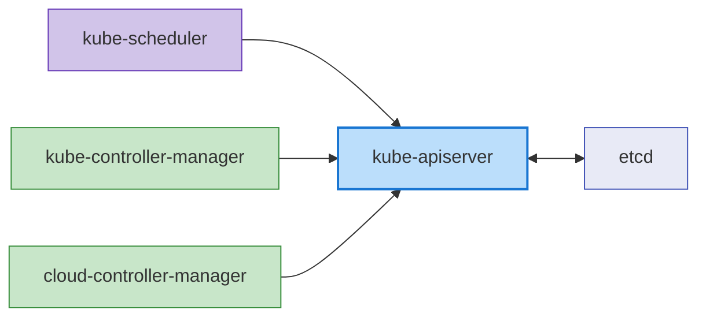

control plane component 間の通信は次のとおりです。

1. **kube-apiserver and etcd**: kube-apiserver は cluster state を保存および取得するために etcd と通信します。
   - Protocol: gRPC
   - Port: 2379/TCP
   - Security: TLS certificate-based authentication

2. **kube-scheduler and kube-apiserver**: kube-scheduler は pod scheduling のために kube-apiserver と通信します。
   - Protocol: HTTPS
   - Port: 6443/TCP (kube-apiserver)
   - Security: TLS certificate-based authentication

3. **kube-controller-manager and kube-apiserver**: controller は cluster state を watch および変更するために kube-apiserver と通信します。
   - Protocol: HTTPS
   - Port: 6443/TCP (kube-apiserver)
   - Security: TLS certificate-based authentication

4. **cloud-controller-manager and kube-apiserver**: cloud controller は cluster state の watch と cloud resource の管理のために kube-apiserver と通信します。
   - Protocol: HTTPS
   - Port: 6443/TCP (kube-apiserver)
   - Security: TLS certificate-based authentication

### Control Plane and Node Communication

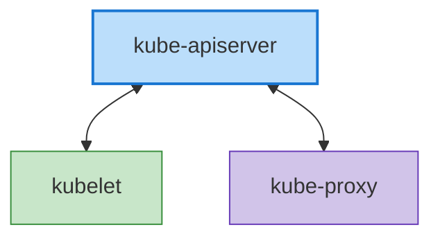

control plane と node の間の通信は次のとおりです。

1. **kube-apiserver and kubelet**: kube-apiserver は pod spec の配信と node status の収集のために kubelet と通信します。
   - Protocol: HTTPS
   - Port: 10250/TCP (kubelet)
   - Security: TLS certificate-based authentication

2. **kubelet and kube-apiserver**: kubelet は node registration、pod status reporting、event transmission のために kube-apiserver と通信します。
   - Protocol: HTTPS
   - Port: 6443/TCP (kube-apiserver)
   - Security: TLS certificate-based authentication

3. **kube-proxy and kube-apiserver**: kube-proxy は service information を取得するために kube-apiserver と通信します。
   - Protocol: HTTPS
   - Port: 6443/TCP (kube-apiserver)
   - Security: TLS certificate-based authentication

### Inter-Node Communication

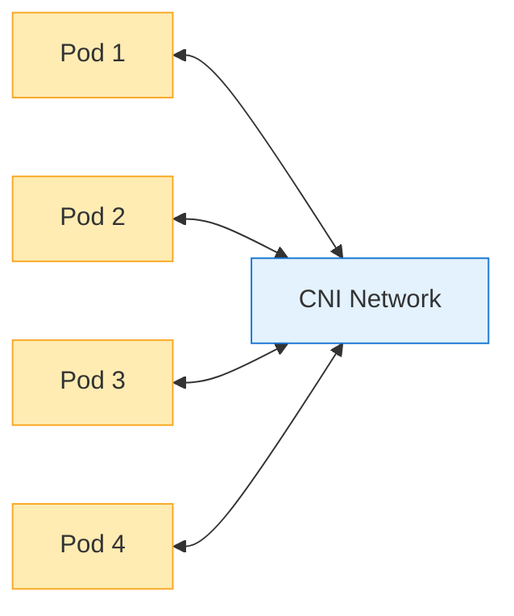

node 間通信は次のとおりです。

1. **Pod-to-Pod Communication**: Pod は CNI plugin が提供する network を通じて互いに通信します。
   - Protocol: application に依存（TCP、UDP など）
   - Port: application に依存
   - Security: network policy によって制御可能

2. **Cross-Node Pod Communication**: 異なる node 上の pod 間の通信は CNI plugin によって処理されます。
   - Protocol: application に依存（TCP、UDP など）
   - Port: application に依存
   - Security: network policy によって制御可能

### External Communication

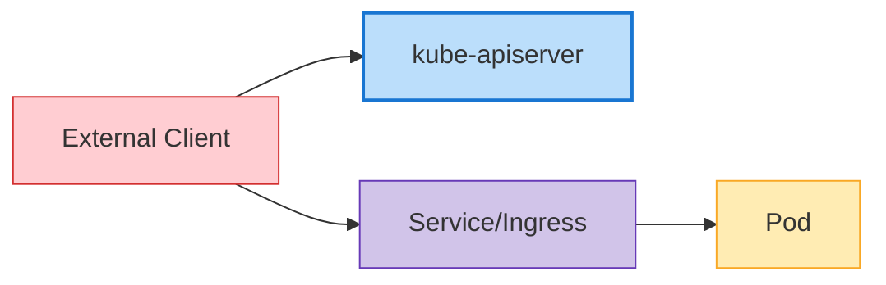

外部 entity との通信は次のとおりです。

1. **Client and kube-apiserver**: user と external system は kube-apiserver を通じて cluster とやり取りします。
   - Protocol: HTTPS
   - Port: 6443/TCP (kube-apiserver)
   - Security: TLS certificate、token、user authentication など

2. **External Traffic and Services**: external traffic は NodePort、LoadBalancer service、または Ingress を通じて cluster 内の application にアクセスします。
   - Protocol: HTTP、HTTPS、TCP、UDP など
   - Port: service configuration に依存
   - Security: ingress controller と service configuration に依存

### Communication Security

Kubernetes cluster 内の通信の security は、次の方法で実装されます。

1. **TLS Certificates**: control plane component 間のすべての通信は TLS certificate で暗号化されます。
2. **Authentication and Authorization**: API server へのすべての request は authentication と authorization process を通過します。
3. **Network Policies**: Pod-to-pod communication は network policy によって制限できます。
4. **Encrypted Secrets**: etcd に保存される Secret は暗号化できます。

**API Server Communication Security Configuration Example**:
```yaml
apiVersion: apiserver.config.k8s.io/v1
kind: EncryptionConfiguration
resources:
  - resources:
    - secrets
    providers:
    - aescbc:
        keys:
        - name: key1
          secret: <base64-encoded-key>
    - identity: {}
```

### High Availability Cluster Configuration

高可用性（HA）Kubernetes cluster は、single point of failure を排除し、service interruption なしで運用を継続するように設計されています。

### Control Plane High Availability

control plane の高可用性は、次の方法で実装されます。

1. **Multiple Control Plane Nodes**: 冗長性のため、通常 3 または 5 の control plane node を deploy
2. **etcd Cluster**: 複数の etcd instance で構成される cluster を deploy（通常 3 または 5）
3. **Load Balancer**: traffic を分散するために API server の前に load balancer を配置

**High Availability Control Plane Architecture**:

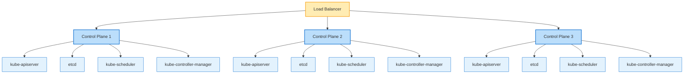

**etcd Cluster Configuration**:

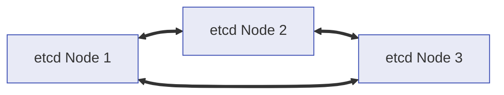

### Worker Node High Availability

worker node の高可用性は、次の方法で実装されます。

1. **Multiple Worker Nodes**: workload を複数の worker node に分散
2. **Automatic Node Recovery**: cloud provider の自動 recovery feature を利用
3. **Auto Scaling**: cluster autoscaler による node の自動 scaling
4. **Multiple Availability Zones**: node を複数の availability zone にまたがって deploy

**Worker Node Distributed Deployment**:

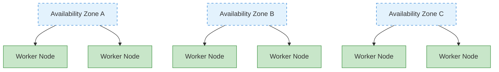

### Application High Availability

application の高可用性は、次の方法で実装されます。

1. **ReplicaSet/Deployment**: 複数の pod replica を実行
2. **Pod Distribution Rules**: pod anti-affinity により pod を複数の node に分散
3. **PodDisruptionBudget**: planned disruption 中の最小 availability を保証
4. **Service and Load Balancing**: traffic を複数の pod に分散

**Pod Anti-Affinity Example**:
```yaml
apiVersion: apps/v1
kind: Deployment
metadata:
  name: web-server
spec:
  replicas: 3
  template:
    metadata:
      labels:
        app: web-server
    spec:
      affinity:
        podAntiAffinity:
          requiredDuringSchedulingIgnoredDuringExecution:
          - labelSelector:
              matchExpressions:
              - key: app
                operator: In
                values:
                - web-server
            topologyKey: "kubernetes.io/hostname"
      containers:
      - name: web-server
        image: nginx:1.21
```

**PodDisruptionBudget Example**:
```yaml
apiVersion: policy/v1
kind: PodDisruptionBudget
metadata:
  name: web-server-pdb
spec:
  minAvailable: 2
  selector:
    matchLabels:
      app: web-server
```

### Disaster Recovery Strategy

Kubernetes cluster の disaster recovery strategy は、次の方法で実装されます。

1. **etcd Backup and Recovery**: 定期的な etcd data backup と recovery procedure を確立
2. **Multi-Region Deployment**: cluster を複数 region に deploy
3. **Cluster Federation**: 複数 cluster を federation で管理
4. **Continuous Backup**: application data の continuous backup

**etcd Backup Script Example**:
```bash
#!/bin/bash
ETCDCTL_API=3 etcdctl snapshot save /backup/etcd-snapshot-$(date +%Y%m%d-%H%M%S).db \
  --endpoints=https://127.0.0.1:2379 \
  --cacert=/etc/kubernetes/pki/etcd/ca.crt \
  --cert=/etc/kubernetes/pki/etcd/server.crt \
  --key=/etc/kubernetes/pki/etcd/server.key
```

**etcd Recovery Script Example**:
```bash
#!/bin/bash
# Stop cluster
systemctl stop kubelet
docker stop $(docker ps -q)

# Recover etcd data
ETCDCTL_API=3 etcdctl snapshot restore /backup/etcd-snapshot.db \
  --data-dir=/var/lib/etcd-restore \
  --name=master \
  --initial-cluster=master=https://127.0.0.1:2380 \
  --initial-cluster-token=etcd-cluster \
  --initial-advertise-peer-urls=https://127.0.0.1:2380

# Replace etcd directory with recovered data
mv /var/lib/etcd /var/lib/etcd.old
mv /var/lib/etcd-restore /var/lib/etcd

# Restart cluster
systemctl start kubelet
```

## Cluster Networking

Kubernetes networking は、pod、service、外部 world の間の通信を可能にします。Kubernetes networking model は、すべての pod が一意の IP address を持ち、NAT なしで互いに通信できることを前提としています。

### Networking Model

Kubernetes networking model には次の要件があります。

1. **Pod-to-Pod Communication**: すべての pod は NAT なしですべての他の pod と通信できる必要があります
2. **Node-to-Pod Communication**: node は NAT なしですべての pod と通信できる必要があります
3. **Pod-to-External Communication**: pod は外部 world と通信できる必要があります（通常は NAT を使用）

### CNI (Container Network Interface)

CNI は Kubernetes で networking を実装するための standard interface です。さまざまな CNI plugin があり、それぞれ異なる機能と performance characteristics を持ちます。

**Main CNI Plugins**:

1. **Calico**: BGP-based networking、network policy support
   - Features: 高性能、network policy、encryption、eBPF support
   - Use cases: 大規模 cluster、security-focused environment

2. **Cilium**: eBPF-based networking and security
   - Features: L3-L7 security policy、高性能、observability
   - Use cases: Microservices、security-focused environment

3. **Flannel**: simple overlay network
   - Features: simple setup、軽量
   - Use cases: 小規模 cluster、development environment

4. **Weave Net**: multi-host container networking
   - Features: encryption、network policy、multi-cloud
   - Use cases: hybrid cloud、multi-cloud

**CNI Configuration Example (Calico)**:
```yaml
apiVersion: v1
kind: ConfigMap
metadata:
  name: calico-config
  namespace: kube-system
data:
  calico_backend: "bird"
  cni_network_config: |-
    {
      "name": "k8s-pod-network",
      "cniVersion": "0.3.1",
      "plugins": [
        {
          "type": "calico",
          "log_level": "info",
          "datastore_type": "kubernetes",
          "nodename": "__KUBERNETES_NODE_NAME__",
          "mtu": __CNI_MTU__,
          "ipam": {
            "type": "calico-ipam"
          },
          "policy": {
            "type": "k8s"
          },
          "kubernetes": {
            "kubeconfig": "__KUBECONFIG_FILEPATH__"
          }
        },
        {
          "type": "portmap",
          "snat": true,
          "capabilities": {"portMappings": true}
        }
      ]
    }
```

### Service Networking

Kubernetes Service は、一連の pod に対する stable endpoint を提供します。Service には ClusterIP、NodePort、LoadBalancer、ExternalName など、いくつかの type があります。

**Service Networking Components**:

1. **ClusterIP**: cluster 内でのみアクセス可能な virtual IP
2. **kube-proxy**: service IP への traffic を pod に routing
3. **CoreDNS**: service discovery のための DNS service

**Service Networking Flow**:
```
Client -> Service (ClusterIP) -> kube-proxy -> Pod
```

**Service Example**:
```yaml
apiVersion: v1
kind: Service
metadata:
  name: my-service
spec:
  selector:
    app: my-app
  ports:
  - port: 80
    targetPort: 8080
  type: ClusterIP
```

### Ingress Networking

Ingress は cluster 外部から cluster 内部の service への HTTP および HTTPS routing を管理します。Ingress controller は ingress resource を実装します。

**Main Ingress Controllers**:
1. **NGINX Ingress Controller**: NGINX-based ingress controller
2. **AWS ALB Ingress Controller**: AWS Application Load Balancer ベース
3. **Traefik**: cloud-native edge router
4. **HAProxy Ingress**: HAProxy-based ingress controller

**Ingress Networking Flow**:
```
Client -> Ingress Controller -> Service -> Pod
```

**Ingress Example**:
```yaml
apiVersion: networking.k8s.io/v1
kind: Ingress
metadata:
  name: my-ingress
  annotations:
    nginx.ingress.kubernetes.io/rewrite-target: /
spec:
  ingressClassName: nginx
  rules:
  - host: example.com
    http:
      paths:
      - path: /app
        pathType: Prefix
        backend:
          service:
            name: my-service
            port:
              number: 80
```

### Network Policies

Network policy は pod 間の通信を制御する方法を提供します。default では、すべての pod は互いに通信できますが、network policy によってこれを制限できます。

**Network Policy Example**:
```yaml
apiVersion: networking.k8s.io/v1
kind: NetworkPolicy
metadata:
  name: db-network-policy
spec:
  podSelector:
    matchLabels:
      role: db
  policyTypes:
  - Ingress
  - Egress
  ingress:
  - from:
    - podSelector:
        matchLabels:
          role: frontend
    ports:
    - protocol: TCP
      port: 3306
  egress:
  - to:
    - podSelector:
        matchLabels:
          role: monitoring
    ports:
    - protocol: TCP
      port: 9090
```

### Network Troubleshooting

Kubernetes networking issue を troubleshooting するための一般的な tool と command は次のとおりです。

1. **ping, traceroute**: 基本的な network connectivity testing
2. **tcpdump**: network packet capture と analysis
3. **netstat, ss**: network connection status の確認
4. **nslookup, dig**: DNS lookup testing
5. **kubectl exec**: pod 内で network command を実行

**Network Debugging Example**:
```bash
# Test network connectivity within a pod
kubectl exec -it <pod-name> -- ping <target-ip>

# Test DNS lookup within a pod
kubectl exec -it <pod-name> -- nslookup <service-name>

# Capture network packets within a pod
kubectl exec -it <pod-name> -- tcpdump -i eth0 -n

# Check service endpoints
kubectl get endpoints <service-name>
```

## Cluster Storage

Kubernetes storage は containerized application の data persistence を提供します。Kubernetes は application が storage を効率的に使用できるように、さまざまな storage option と abstraction を提供します。

### Storage Architecture

Kubernetes storage architecture は次の component で構成されます。

1. **Volumes**: pod 内の container に mount できる directory
2. **Persistent Volumes (PV)**: cluster 内の storage resource
3. **Persistent Volume Claims (PVC)**: user storage request
4. **Storage Classes**: storage の「class」または type を定義
5. **CSI (Container Storage Interface)**: storage system との standard interface

**Storage Architecture Flow**:

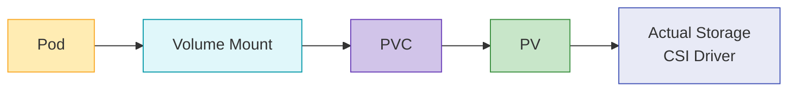

### Volume Types

Kubernetes はさまざまな type の volume をサポートします。

1. **Ephemeral Volumes**:
   - **emptyDir**: 空の directory として開始し、pod が削除されると削除されます
   - **configMap**: ConfigMap を volume として mount
   - **secret**: Secret を volume として mount
   - **downwardAPI**: pod と container の情報を file として公開

2. **Persistent Volumes**:
   - **awsElasticBlockStore**: AWS EBS volume
   - **azureDisk**: Azure Disk
   - **gcePersistentDisk**: GCE Persistent Disk
   - **nfs**: NFS volume
   - **csi**: CSI driver を通じた volume

**Volume Example**:
```yaml
apiVersion: v1
kind: Pod
metadata:
  name: test-pd
spec:
  containers:
  - name: test-container
    image: nginx
    volumeMounts:
    - mountPath: /test-pd
      name: test-volume
  volumes:
  - name: test-volume
    persistentVolumeClaim:
      claimName: test-pvc
```

### Persistent Volumes and Claims

Persistent Volume（PV）は、administrator によって provision されるか、storage class を通じて動的に provision される cluster 内の storage resource です。Persistent Volume Claim（PVC）は user storage request です。

**Persistent Volume Example**:
```yaml
apiVersion: v1
kind: PersistentVolume
metadata:
  name: pv-example
spec:
  capacity:
    storage: 10Gi
  accessModes:
    - ReadWriteOnce
  persistentVolumeReclaimPolicy: Retain
  storageClassName: standard
  awsElasticBlockStore:
    volumeID: vol-0123456789abcdef0
    fsType: ext4
```

**Persistent Volume Claim Example**:
```yaml
apiVersion: v1
kind: PersistentVolumeClaim
metadata:
  name: pvc-example
spec:
  accessModes:
    - ReadWriteOnce
  resources:
    requests:
      storage: 5Gi
  storageClassName: standard
```

### Storage Classes

Storage class は administrator が提供する storage の「class」を記述します。Storage class により、PVC が request されたときに PV を dynamic provisioning できます。

**Storage Class Example**:
```yaml
apiVersion: storage.k8s.io/v1
kind: StorageClass
metadata:
  name: standard
provisioner: kubernetes.io/aws-ebs
parameters:
  type: gp3
  fsType: ext4
reclaimPolicy: Delete
allowVolumeExpansion: true
```

### CSI (Container Storage Interface)

CSI は Kubernetes と storage system の間の standard interface を提供します。CSI を通じて、storage provider は Kubernetes code を変更せずに独自の storage driver を開発できます。

**CSI Architecture**:

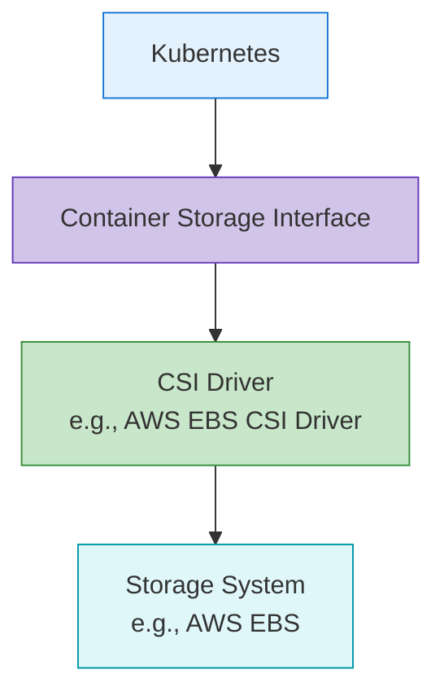

**CSI Driver Deployment Example**:
```yaml
apiVersion: storage.k8s.io/v1
kind: StorageClass
metadata:
  name: ebs-sc
provisioner: ebs.csi.aws.com
parameters:
  type: gp3
  fsType: ext4
  encrypted: "true"
volumeBindingMode: WaitForFirstConsumer
```

### Storage Best Practices

Kubernetes storage を使用する際の best practice は次のとおりです。

1. **Choose Appropriate Storage Type**: workload characteristics に合った storage type を選択
2. **Use Dynamic Provisioning**: storage class を通じた dynamic provisioning を利用
3. **Choose Appropriate Access Modes**: workload requirement に合った access mode を選択
4. **Set Resource Requests and Limits**: 適切な storage capacity を request
5. **Establish Backup and Recovery Strategy**: critical data の backup と recovery strategy を準備
6. **Monitor Storage**: storage usage と performance を監視

## Cluster Scalability

Kubernetes cluster scalability とは、増加する load と requirement に cluster が対応できる能力を指します。scalability は horizontal scaling（scale out）と vertical scaling（scale up）によって実装できます。

### Cluster Scale Limits

Kubernetes cluster には次の scale limit があります。

1. **Number of Nodes**: 最大 5,000 node
2. **Number of Pods**: cluster あたり最大 150,000 pod
3. **Pods per Node**: node あたり最大 110 pod（default）
4. **Number of Services**: cluster あたり最大 10,000 service
5. **Containers per Pod**: pod あたり最大 20 container

これらの limit は Kubernetes version と cluster configuration によって異なる場合があります。

### Horizontal Scaling

Horizontal scaling は、node を追加することで cluster capacity を増やします。

**Node Auto Scaling**:
Kubernetes Cluster Autoscaler は、workload requirement に基づいて node 数を自動的に調整します。

```yaml
# AWS Auto Scaling Group tags example
tags:
  k8s.io/cluster-autoscaler/enabled: "true"
  k8s.io/cluster-autoscaler/my-cluster: "owned"
```

**Cluster Autoscaler Deployment Example**:
```yaml
apiVersion: apps/v1
kind: Deployment
metadata:
  name: cluster-autoscaler
  namespace: kube-system
spec:
  replicas: 1
  selector:
    matchLabels:
      app: cluster-autoscaler
  template:
    metadata:
      labels:
        app: cluster-autoscaler
    spec:
      containers:
      - name: cluster-autoscaler
        image: k8s.gcr.io/autoscaling/cluster-autoscaler:v1.24.0
        command:
        - ./cluster-autoscaler
        - --cloud-provider=aws
        - --nodes=2:10:my-asg-group
        - --scale-down-unneeded-time=10m
```

**Karpenter**:
Karpenter は AWS によって開発された新しい node auto-scaling tool で、より高速で効率的な node provisioning を提供します。

```yaml
apiVersion: karpenter.sh/v1
kind: NodePool
metadata:
  name: default
spec:
  template:
    spec:
      requirements:
        - key: karpenter.sh/capacity-type
          operator: In
          values: ["spot", "on-demand"]
      nodeClassRef:
        name: default-class
  limits:
    cpu: 1000
    memory: 1000Gi
---
apiVersion: karpenter.k8s.aws/v1
kind: EC2NodeClass
metadata:
  name: default-class
spec:
  subnetSelector:
    karpenter.sh/discovery: my-cluster
  securityGroupSelector:
    karpenter.sh/discovery: my-cluster
```

### Vertical Scaling

Vertical scaling は、既存 node の resource（CPU、memory）を増やします。

**Vertical Pod Autoscaler (VPA)**:
VPA は pod の CPU と memory request を自動的に調整します。

```yaml
apiVersion: autoscaling.k8s.io/v1
kind: VerticalPodAutoscaler
metadata:
  name: my-app-vpa
spec:
  targetRef:
    apiVersion: "apps/v1"
    kind: Deployment
    name: my-app
  updatePolicy:
    updateMode: "Auto"
  resourcePolicy:
    containerPolicies:
    - containerName: '*'
      minAllowed:
        cpu: 100m
        memory: 50Mi
      maxAllowed:
        cpu: 1
        memory: 500Mi
```

### Application Scaling

application level の scaling は、pod replica 数を調整することで実装されます。

**Horizontal Pod Autoscaler (HPA)**:
HPA は CPU utilization または custom metric に基づいて pod replica 数を自動的に調整します。

```yaml
apiVersion: autoscaling/v2
kind: HorizontalPodAutoscaler
metadata:
  name: my-app-hpa
spec:
  scaleTargetRef:
    apiVersion: apps/v1
    kind: Deployment
    name: my-app
  minReplicas: 2
  maxReplicas: 10
  metrics:
  - type: Resource
    resource:
      name: cpu
      target:
        type: Utilization
        averageUtilization: 80
```

**KEDA (Kubernetes Event-driven Autoscaling)**:
KEDA は event-driven autoscaling を提供し、さまざまな event source に基づく scaling を可能にします。

```yaml
apiVersion: keda.sh/v1alpha1
kind: ScaledObject
metadata:
  name: my-app-scaledobject
spec:
  scaleTargetRef:
    name: my-app
  minReplicaCount: 0
  maxReplicaCount: 10
  triggers:
  - type: kafka
    metadata:
      bootstrapServers: kafka.svc:9092
      consumerGroup: my-group
      topic: my-topic
      lagThreshold: "10"
```

### Scalability Best Practices

Kubernetes cluster scalability の best practice は次のとおりです。

1. **Set Resource Requests and Limits**: すべての pod に適切な resource request と limit を設定
2. **Node Pool Strategy**: 異なる workload characteristics に応じて複数の node pool を構成
3. **Configure Auto Scaling**: Cluster Autoscaler、HPA、VPA を適切に構成
4. **Efficient Pod Placement**: node affinity、pod affinity/anti-affinity を利用
5. **Cluster Monitoring**: resource usage と performance を継続的に監視
6. **Load Testing**: scaling strategy を検証するための定期的な load testing

## Cluster Security

Kubernetes cluster security は複数の layer で実装する必要があります。これには authentication、authorization、network policy、pod security などが含まれます。

### Authentication

Kubernetes API server へのアクセスを authentication する方法は次のとおりです。

1. **X.509 Certificates**: TLS client certificate を使用した authentication
2. **Service Account Tokens**: pod 内から API server にアクセスするための token
3. **OpenID Connect (OIDC)**: external identity provider を通じた authentication
4. **Webhook Token Authentication**: external authentication service を通じた authentication
5. **Authentication Proxy**: authentication proxy を通じた authentication

**kubeconfig Example**:
```yaml
apiVersion: v1
kind: Config
clusters:
- name: my-cluster
  cluster:
    certificate-authority-data: <CA-DATA>
    server: https://api.my-cluster.example.com
users:
- name: admin
  user:
    client-certificate-data: <CERT-DATA>
    client-key-data: <KEY-DATA>
contexts:
- name: my-context
  context:
    cluster: my-cluster
    user: admin
current-context: my-context
```

### Authorization

authenticated user の action を制御する方法は次のとおりです。

1. **RBAC (Role-Based Access Control)**: role-based access control
2. **ABAC (Attribute-Based Access Control)**: attribute-based access control
3. **Node Authorization**: node のための special authorization
4. **Webhook Authorization**: external service を通じた authorization

**RBAC Example**:
```yaml
# Role definition
apiVersion: rbac.authorization.k8s.io/v1
kind: Role
metadata:
  namespace: default
  name: pod-reader
rules:
- apiGroups: [""]
  resources: ["pods"]
  verbs: ["get", "watch", "list"]

# Role binding
apiVersion: rbac.authorization.k8s.io/v1
kind: RoleBinding
metadata:
  name: read-pods
  namespace: default
subjects:
- kind: User
  name: jane
  apiGroup: rbac.authorization.k8s.io
roleRef:
  kind: Role
  name: pod-reader
  apiGroup: rbac.authorization.k8s.io
```

### Network Security

cluster 内の network traffic を保護する方法は次のとおりです。

1. **Network Policies**: pod-to-pod communication を制御
2. **Encrypted Communication**: TLS による communication encryption
3. **Service Mesh**: Istio、Linkerd などによる advanced network security

**Network Policy Example**:
```yaml
apiVersion: networking.k8s.io/v1
kind: NetworkPolicy
metadata:
  name: default-deny-all
spec:
  podSelector: {}
  policyTypes:
  - Ingress
  - Egress
```

### Pod Security

pod level での security implementation は次のとおりです。

1. **Pod Security Context**: pod と container level の security setting
2. **Pod Security Standards**: pod security requirement を定義
3. **seccomp Profiles**: system call restriction
4. **AppArmor/SELinux**: mandatory access control

**Pod Security Context Example**:
```yaml
apiVersion: v1
kind: Pod
metadata:
  name: security-context-pod
spec:
  securityContext:
    runAsUser: 1000
    runAsGroup: 3000
    fsGroup: 2000
  containers:
  - name: app
    image: myapp:1.0
    securityContext:
      allowPrivilegeEscalation: false
      capabilities:
        drop:
        - ALL
```

### Secret Management

sensitive information を安全に管理する方法は次のとおりです。

1. **Kubernetes Secrets**: 基本的な secret resource を使用
2. **Encrypted etcd**: etcd に保存される secret を暗号化
3. **External Secret Management**: HashiCorp Vault、AWS Secrets Manager などを利用

**Encrypted etcd Configuration Example**:
```yaml
apiVersion: apiserver.config.k8s.io/v1
kind: EncryptionConfiguration
resources:
  - resources:
    - secrets
    providers:
    - aescbc:
        keys:
        - name: key1
          secret: <base64-encoded-key>
    - identity: {}
```

### Security Best Practices

Kubernetes cluster security の best practice は次のとおりです。

1. **Principle of Least Privilege**: 必要最小限の privilege のみを付与
2. **Regular Updates**: cluster と component を定期的に update
3. **Network Isolation**: network policy によって pod-to-pod communication を制限
4. **Image Security**: trusted image のみを使用し、vulnerability scanning を実装
5. **Audit Logging**: cluster activity の audit log を有効化
6. **Security Benchmarks**: CIS benchmark などの security standard に準拠

## Cluster Upgrades

Kubernetes cluster upgrade は、新機能、security patch、bug fix を適用するために必要です。upgrade は慎重に計画し、実行する必要があります。

### Upgrade Strategies

Kubernetes cluster upgrade の strategy は次のとおりです。

1. **Blue/Green Upgrade**: 新しい version の cluster を別途作成し、workload を migration
2. **In-Place Upgrade**: 既存 cluster を直接 upgrade
3. **Canary Upgrade**: validation のために一部の node のみを先に upgrade

### Upgrade Order

Kubernetes cluster upgrade の一般的な順序は次のとおりです。

1. **Control Plane Upgrade**: kube-apiserver、kube-controller-manager、kube-scheduler、etcd
2. **DNS and CNI Upgrade**: CoreDNS、CNI plugin、およびその他の主要 add-on
3. **Worker Node Upgrade**: worker node の順次 upgrade

**kubeadm Upgrade Example**:
```bash
# Control plane upgrade
kubeadm upgrade plan
kubeadm upgrade apply v1.24.0

# Worker node upgrade
kubectl drain <node-name> --ignore-daemonsets
# Upgrade kubelet and kubeadm on the node
apt-get update && apt-get install -y kubelet=1.24.0-00 kubeadm=1.24.0-00
kubeadm upgrade node
systemctl restart kubelet
kubectl uncordon <node-name>
```

### Upgrade Considerations

Kubernetes cluster を upgrade する際の考慮事項は次のとおりです。

1. **API Changes**: new version の API change を確認
2. **Feature Gates**: new feature gate と default value change を確認
3. **Dependencies**: CNI、CSI など dependent component の compatibility を確認
4. **Downtime**: upgrade 中に想定される downtime を計画
5. **Rollback Plan**: issue 発生時の rollback plan を確立

### Upgrade Best Practices

Kubernetes cluster upgrade の best practice は次のとおりです。

1. **Test in Test Environment First**: production upgrade 前に test environment で validation
2. **Gradual Upgrade**: 一度に 1 つの minor version ずつ upgrade
3. **Backup**: upgrade 前に etcd data を backup
4. **Documentation**: upgrade procedure と result を document 化
5. **Monitoring**: upgrade 中および upgrade 後に cluster status を監視
6. **Upgrade Window**: low-traffic period に upgrade を実行

## Amazon EKS Cluster Architecture

Amazon EKS（Elastic Kubernetes Service）は、AWS が提供する managed Kubernetes service です。EKS は AWS service との integration と management convenience を追加しながら、基本的な Kubernetes feature をすべて提供します。

### EKS Architecture Overview

EKS cluster は次の component で構成されます。

1. **EKS Control Plane**: AWS によって管理される Kubernetes control plane
2. **EKS Nodes**: user が管理する worker node（EC2 instance）
3. **EKS Managed Node Groups**: AWS が管理する node group
4. **EKS Fargate Profiles**: serverless container execution environment
5. **VPC and Subnets**: cluster networking のための VPC と subnet

**EKS Architecture Diagram**:

```mermaid
graph TD
    classDef aws fill:#e8f5e9,stroke:#2e7d32,stroke-width:1px;
    classDef eks fill:#fce4ec,stroke:#c2185b,stroke-width:1px;
    classDef controlplane fill:#bbdefb,stroke:#1976d2,stroke-width:2px;
    classDef nodes fill:#c8e6c9,stroke:#388e3c,stroke-width:1px;
    classDef services fill:#d1c4e9,stroke:#673ab7,stroke-width:1px;
    classDef network fill:#f3e5f5,stroke:#7b1fa2,stroke-width:1px;

    AWS[AWS Cloud] --> CP[EKS Control Plane<br>AWS Managed]
    AWS --> WN[Worker Nodes]
    AWS --> AWSS[AWS Services]
    AWS --> VPC[VPC & Networking]

    CP --> API[kube-apiserver]
    CP --> ETCD[etcd]
    CP --> SCHED[kube-scheduler]
    CP --> CTRL[kube-controller-manager]

    WN --> NG1[Node Group 1<br>EC2 instances]
    WN --> NG2[Node Group 2<br>EC2 instances]
    WN --> FG[Fargate Profile<br>Serverless]

    AWSS --> IAM[IAM]
    AWSS --> ECR[ECR]
    AWSS --> ELB[ELB/ALB/NLB]
    AWSS --> EBS[EBS/EFS/FSx]
    AWSS --> CW[CloudWatch]

    VPC --> VPCM[VPC]
    VPC --> SN[Subnets]
    VPC --> SG[Security Groups]
    VPC --> RT[Route Tables]
    VPC --> CNI[VPC CNI]

    class AWS aws;
    class CP controlplane;
    class WN nodes;
    class AWSS,IAM,ECR,ELB,EBS,CW services;
    class VPC,VPCM,SN,SG,RT,CNI network;
    class API,ETCD,SCHED,CTRL,NG1,NG2,FG eks;
```

### EKS Control Plane

EKS control plane は AWS によって管理され、複数の availability zone にまたがる高可用性を提供します。

**Key Features**:
1. **Managed Service**: AWS が control plane の maintenance と upgrade を管理
2. **High Availability**: 複数の availability zone に deploy
3. **Auto Scaling**: load に基づいて自動的に scale
4. **Security**: AWS security service と統合

### EKS Node Types

EKS はさまざまな type の node をサポートします。

1. **Self-Managed Nodes**: user が EC2 instance を直接管理
2. **Managed Node Groups**: AWS が node lifecycle を管理
3. **Fargate**: serverless container execution environment
4. **Bottlerocket Nodes**: container workload 向けに最適化された OS

**Managed Node Group Example**:
```yaml
apiVersion: eksctl.io/v1alpha5
kind: ClusterConfig
metadata:
  name: my-cluster
  region: ap-northeast-2
managedNodeGroups:
  - name: ng-1
    instanceType: m5.large
    desiredCapacity: 3
    minSize: 2
    maxSize: 5
    volumeSize: 80
    privateNetworking: true
    labels:
      role: worker
    tags:
      nodegroup-role: worker
    iam:
      withAddonPolicies:
        autoScaler: true
        albIngress: true
```

### EKS Networking

EKS networking は Amazon VPC を基盤とし、次の component を含みます。

1. **VPC CNI Plugin**: AWS VPC networking との integration
2. **Security Groups**: node および pod level の network security
3. **Load Balancer Integration**: ELB、ALB、NLB との integration
4. **VPC Endpoints**: AWS service との private communication

**VPC CNI Configuration Example**:
```yaml
apiVersion: v1
kind: ConfigMap
metadata:
  name: amazon-vpc-cni
  namespace: kube-system
data:
  enable-network-policy: "true"
  enable-pod-eni: "true"
  warm-ip-target: "5"
  minimum-ip-target: "10"
```

### EKS Storage

EKS はさまざまな AWS storage service と統合します。

1. **EBS CSI Driver**: Amazon EBS volume management
2. **EFS CSI Driver**: Amazon EFS file system management
3. **FSx for Lustre CSI Driver**: FSx for Lustre file system management
4. **S3**: Object storage

**EBS CSI Driver Example**:
```yaml
apiVersion: storage.k8s.io/v1
kind: StorageClass
metadata:
  name: ebs-sc
provisioner: ebs.csi.aws.com
parameters:
  type: gp3
  encrypted: "true"
volumeBindingMode: WaitForFirstConsumer
```

### EKS Security

EKS は強力な security を提供するために AWS security service と統合します。

1. **IAM Integration**: AWS IAM と Kubernetes RBAC の integration
2. **VPC Security**: VPC security group と network ACL
3. **AWS KMS**: secret encryption のための KMS integration
4. **AWS WAF**: web application firewall integration
5. **AWS Shield**: DDoS protection

**IAM Role Service Account Example**:
```yaml
apiVersion: v1
kind: ServiceAccount
metadata:
  name: s3-reader
  namespace: default
  annotations:
    eks.amazonaws.com/role-arn: arn:aws:iam::123456789012:role/s3-reader-role
```

### EKS Monitoring and Logging

EKS は AWS monitoring service と logging service と統合します。

1. **CloudWatch Container Insights**: container monitoring
2. **CloudWatch Logs**: log collection と analysis
3. **X-Ray**: distributed tracing
4. **Prometheus and Grafana**: open source monitoring tool integration

**CloudWatch Container Insights Example**:
```yaml
apiVersion: v1
kind: Namespace
metadata:
  name: amazon-cloudwatch
---
apiVersion: apps/v1
kind: DaemonSet
metadata:
  name: cloudwatch-agent
  namespace: amazon-cloudwatch
spec:
  selector:
    matchLabels:
      name: cloudwatch-agent
  template:
    metadata:
      labels:
        name: cloudwatch-agent
    spec:
      containers:
      - name: cloudwatch-agent
        image: amazon/cloudwatch-agent:1.247347.6b250880
        # ... additional configuration
```

### EKS Cost Optimization

EKS cluster cost を最適化する方法は次のとおりです。

1. **Spot Instances**: cost-effective な Spot instance を利用
2. **Fargate**: serverless container execution により idle resource cost を削減
3. **Auto Scaling**: cluster autoscaler による resource optimization
4. **Graviton Processors**: ARM-based Graviton instance を利用
5. **Resource Request Optimization**: 適切な resource request と limit を設定

**Spot Instance Node Group Example**:
```yaml
apiVersion: eksctl.io/v1alpha5
kind: ClusterConfig
metadata:
  name: my-cluster
  region: ap-northeast-2
managedNodeGroups:
  - name: spot-ng
    instanceTypes: ["m5.large", "m5a.large", "m5d.large", "m5ad.large"]
    spot: true
    desiredCapacity: 3
    minSize: 2
    maxSize: 10
```

## Learn More

このドキュメントで扱った cluster architecture への理解を深めるには、次の topic を参照してください。

- [Kubernetes の概要](../basics/04-kubernetes-introduction.md) - Kubernetes の基本概念と歴史
- [Pod と Workload](./02-pods-and-workloads.md) - cluster 内で実行される workload の管理
- [Service と Networking](./03-services-networking.md) - cluster 内の networking configuration
- [Scheduling, Preemption, and Eviction](./08-scheduling-preemption-eviction.md) - pod が node に配置される仕組み
- [Cluster Administration](./09-cluster-administration.md) - cluster の operation と management
- [EKS の概要](../eks/01-eks-introduction.md) - Amazon EKS service overview
- [EKS Cluster Creation](../eks/02-eks-cluster-creation-part1.md) - EKS cluster の作成方法

### Hands-on and Advanced Learning

- [Kubernetes Official Tutorials](https://kubernetes.io/docs/tutorials/) - hands-on practice を通じた学習
- [Kubernetes The Hard Way](https://github.com/kelseyhightower/kubernetes-the-hard-way) - Kubernetes cluster を手動で構築
- [Cilium Networking](../networking/cilium/01-introduction.md) - advanced networking と security feature

## Conclusion

このドキュメントでは、Kubernetes cluster の architecture、主要 component、およびそれらがどのように連携するかを確認しました。また、cluster networking、storage、scalability、security、upgrade といった重要な側面、および Amazon EKS cluster の architecture についても扱いました。

Kubernetes cluster architecture を理解することは、効果的な cluster design、deployment、operation の基礎です。この知識により、安定し、scalable で、security が強化された Kubernetes environment を構築できます。

## Quiz

この章で学んだ内容を確認するには、[Cluster Architecture Quiz](../quizzes/core/01-cluster-architecture-quiz.md) に挑戦してください。

## References

- [Kubernetes Official Documentation](https://kubernetes.io/docs/)
- [Amazon EKS Documentation](https://docs.aws.amazon.com/eks/)
- [Kubernetes The Hard Way](https://github.com/kelseyhightower/kubernetes-the-hard-way)
- [Kubernetes Patterns](https://www.oreilly.com/library/view/kubernetes-patterns/9781492050278/)
- [Kubernetes Up & Running](https://www.oreilly.com/library/view/kubernetes-up-and/9781492046523/)
- [Kubernetes Best Practices](https://www.oreilly.com/library/view/kubernetes-best-practices/9781492056461/)
