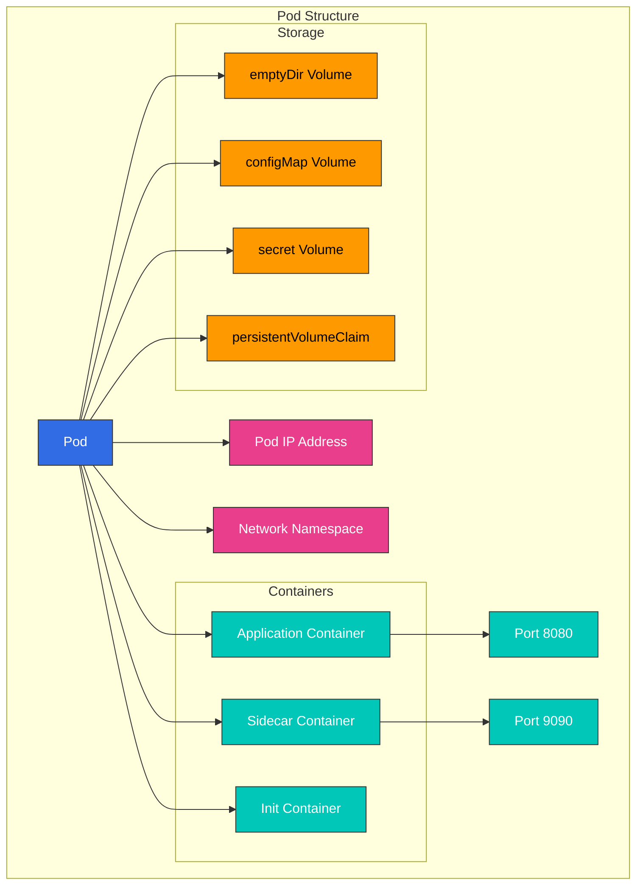

# Kubernetes Pods and Workloads

> **Supported Versions**: Kubernetes 1.32, 1.33, 1.34
> **最終更新**: February 23, 2026

このドキュメントでは、Kubernetes における基本的な実行単位である Pod（ポッド）と、それらを管理するさまざまな workload resources（ワークロードリソース）について詳しく説明します。Pod の概念から始め、Deployment、StatefulSet、DaemonSet など、さまざまな workload resources の特徴とユースケースを扱います。

## Lab Environment Setup

このドキュメントの例を試すには、次のツールと環境が必要です。

### Required Tools
- kubectl v1.34 以上
- 稼働中の Kubernetes cluster（EKS、minikube、kind など）

### Deploy Example Application

```bash
# Create namespace
kubectl create namespace workloads-demo

# Create a simple deployment
kubectl -n workloads-demo apply -f - <<EOF
apiVersion: apps/v1
kind: Deployment
metadata:
  name: nginx-deployment
  labels:
    app: nginx
spec:
  replicas: 3
  selector:
    matchLabels:
      app: nginx
  template:
    metadata:
      labels:
        app: nginx
    spec:
      containers:
      - name: nginx
        image: nginx:1.21
        ports:
        - containerPort: 80
        resources:
          requests:
            memory: "64Mi"
            cpu: "100m"
          limits:
            memory: "128Mi"
            cpu: "200m"
EOF

# Check deployment status
kubectl -n workloads-demo get deployments,pods
```

## Table of Contents
- [Pod Concepts](#pod-concepts)
- [Pod Lifecycle](#pod-lifecycle)
- [Pod Design Patterns](#pod-design-patterns)
- [Workload Resources Overview](#workload-resources-overview)
- [ReplicaSet](#replicaset)
- [Deployment](#deployment)
- [StatefulSet](#statefulset)
- [DaemonSet](#daemonset)
- [Jobs and CronJobs](#jobs-and-cronjobs)
- [Resource Management](#resource-management)
- [Pod Disruption Budget](#pod-disruption-budget)
- [Horizontal Pod Autoscaling](#horizontal-pod-autoscaling)
- [Vertical Pod Autoscaling](#vertical-pod-autoscaling)
- [Workload Best Practices](#workload-best-practices)
- [Amazon EKS Workload Considerations](#amazon-eks-workload-considerations)

## Pod Concepts

> **Key Concept**: Pod は Kubernetes におけるデプロイ可能な最小のコンピューティング単位であり、storage と network を共有する 1 つ以上の container group で構成されます。

Pod は Kubernetes におけるデプロイ可能な最小のコンピューティング単位です。Pod は storage と network を共有し、一緒にスケジュールされる 1 つ以上の container のグループです。

### Pod Characteristics

1. **Shared Context**: Pod 内のすべての container は、同じ network namespace、IPC namespace、UTS namespace を共有します。
2. **Same Node**: Pod 内のすべての container は常に同じ node 上で実行されます。
3. **Unique IP Address**: 各 Pod は cluster 内で一意の IP address を持ちます。
4. **Ephemeral**: Pod は基本的に一時的なものであり、障害時には新しい Pod に置き換えられます。
5. **Atomic Unit**: Pod は deployment、scheduling、replication の最小単位です。

### Pod Structure

Pod は次のコンポーネントで構成されます。

1. **Containers**: Pod 内で実行される 1 つ以上の container
2. **Volumes**: Pod 内の container によって共有される storage
3. **Network**: Pod に割り当てられる IP address と port
4. **Container Spec**: Container image、environment variables、resource requirements など



### Pod Example

```yaml
apiVersion: v1
kind: Pod
metadata:
  name: multi-container-pod
  labels:
    app: web
spec:
  containers:
  - name: web
    image: nginx:1.21
    ports:
    - containerPort: 80
    volumeMounts:
    - name: shared-data
      mountPath: /usr/share/nginx/html
  - name: content-updater
    image: alpine
    command: ["/bin/sh", "-c"]
    args:
    - while true; do
        echo "Current time: $(date)" > /content/index.html;
        sleep 10;
      done
    volumeMounts:
    - name: shared-data
      mountPath: /content
  volumes:
  - name: shared-data
    emptyDir: {}
```

### Practical Example: Web Application Pod

次は、web application と sidecar container を含む Pod の例です。

```yaml
apiVersion: v1
kind: Pod
metadata:
  name: web-app
  labels:
    app: web
    environment: production
spec:
  containers:
  - name: web-application
    image: nginx:1.21
    ports:
    - containerPort: 80
    resources:
      requests:
        memory: "128Mi"
        cpu: "100m"
      limits:
        memory: "256Mi"
        cpu: "500m"
  - name: log-collector
    image: fluentd:v1.14
    volumeMounts:
    - name: log-volume
      mountPath: /var/log/nginx
    resources:
      requests:
        memory: "64Mi"
        cpu: "50m"
      limits:
        memory: "128Mi"
        cpu: "100m"
  volumes:
  - name: log-volume
    emptyDir: {}
```

この例は、次の実際のシナリオを示しています。
- Nginx web server を main container として実行する
- Fluentd log collector を sidecar container として実行する
- 2 つの container 間で log volume を共有する
- 各 container に resource requests と limits を設定する

この構成は、microservice architecture において logging、monitoring、proxying などの機能を分離しながら、密接に関連する container を実行するのに適しています。
    classDef k8sComponent fill:#326CE5,stroke:#333,stroke-width:1px,color:white;
    classDef userApp fill:#00C7B7,stroke:#333,stroke-width:1px,color:white;
    classDef dataStore fill:#3B48CC,stroke:#333,stroke-width:1px,color:white;
    classDef default fill:#f9f9f9,stroke:#333,stroke-width:1px,color:black;

    %% Apply classes
    class Pod default;
    class Container1,Container2 userApp;
    class Volume dataStore;
    class IP default;
```

### Pod Definition

Pod は YAML または JSON 形式の manifest file を使用して定義されます。基本的な Pod 定義の例を次に示します。

```yaml
apiVersion: v1
kind: Pod
metadata:
  name: nginx-pod
  labels:
    app: nginx
spec:
  containers:
  - name: nginx
    image: nginx:1.21
    ports:
    - containerPort: 80
    resources:
      requests:
        memory: "64Mi"
        cpu: "250m"
      limits:
        memory: "128Mi"
        cpu: "500m"
```

### Single Container vs Multi-Container Pods

**Single Container Pods**:
- 最も一般的なユースケース
- application container を 1 つだけ含む
- シンプルで直感的な構造

**Multi-Container Pods**:
- 密接に結合された複数の container を含む
- container 間のローカル通信が可能（localhost）
- 共有 volume によるデータ共有
- 一緒に scale され、配置される

### Multi-Container Pod Patterns

1. **Sidecar Pattern**: main container の機能を拡張する補助 container
   - 例: log collector、file synchronization、proxy

```yaml
apiVersion: v1
kind: Pod
metadata:
  name: web-with-sidecar
spec:
  containers:
  - name: web
    image: nginx:1.21
  - name: log-collector
    image: fluentd:v1.14
    volumeMounts:
    - name: logs
      mountPath: /var/log/nginx
  volumes:
  - name: logs
    emptyDir: {}
```

2. **Ambassador Pattern**: external services への proxy として機能する container
   - 例: database proxy、service mesh sidecar

```yaml
apiVersion: v1
kind: Pod
metadata:
  name: app-with-ambassador
spec:
  containers:
  - name: app
    image: myapp:1.0
  - name: ambassador
    image: envoy:v1.20
    ports:
    - containerPort: 9901
```

3. **Adapter Pattern**: main container の出力を標準化する container
   - 例: log format conversion、metrics conversion

```yaml
apiVersion: v1
kind: Pod
metadata:
  name: app-with-adapter
spec:
  containers:
  - name: app
    image: myapp:1.0
  - name: adapter
    image: adapter:1.0
    volumeMounts:
    - name: app-logs
      mountPath: /var/log/app
  volumes:
  - name: app-logs
    emptyDir: {}
```

4. **Init Container Pattern**: main container が開始する前に実行される container
   - 例: configuration file creation、database migration、permission setup

```yaml
apiVersion: v1
kind: Pod
metadata:
  name: app-with-init
spec:
  initContainers:
  - name: init-db
    image: busybox:1.34
    command: ['sh', '-c', 'until nslookup db; do echo waiting for db; sleep 2; done;']
  containers:
  - name: app
    image: myapp:1.0
```

### Pod Networking

Pod 内の container には、次の network 特性があります。

1. **Same IP Address**: Pod 内のすべての container は同じ IP address を共有します。
2. **Port Sharing**: Pod 内の container は port 空間を共有するため、同じ port を使用できません。
3. **Localhost Communication**: Pod 内の container は localhost 経由で相互に通信できます。
4. **Inter-Pod Communication**: 各 Pod は一意の IP address を持ち、他の Pod と直接通信できます。

### Pod Storage

Pod は、データの保存と共有のためにさまざまな type の volume を使用できます。

1. **emptyDir**: Pod が作成されたときに作成され、Pod が削除されたときに削除される一時 volume
2. **hostPath**: host node の file system から Pod に mount される volume
3. **persistentVolumeClaim**: persistent storage を要求する volume
4. **configMap**: volume として mount される ConfigMap
5. **secret**: volume として mount される Secret
6. **projected**: 複数の volume source を同じ directory に map するもの

```yaml
apiVersion: v1
kind: Pod
metadata:
  name: pod-with-volumes
spec:
  containers:
  - name: app
    image: myapp:1.0
    volumeMounts:
    - name: data
      mountPath: /data
    - name: config
      mountPath: /etc/config
  volumes:
  - name: data
    emptyDir: {}
  - name: config
    configMap:
      name: app-config
```

## Pod Lifecycle

Pod は作成から終了まで、さまざまな lifecycle stage を通過します。この lifecycle を理解することは、application の安定性と可用性を確保するうえで重要です。

### Pod Phases

Pod は次の phase を通過します。

1. **Pending**: Pod は cluster に受け入れられていますが、1 つ以上の container がまだ設定されていません
2. **Running**: Pod は node に bind され、すべての container が作成され、少なくとも 1 つの container が実行中または開始/再起動中です
3. **Succeeded**: Pod 内のすべての container が正常に終了し、再起動されません
4. **Failed**: Pod 内のすべての container が終了し、少なくとも 1 つの container が失敗として終了しました
5. **Unknown**: 何らかの理由で Pod の状態を取得できませんでした

### Container States

Pod 内の各 container は、次の state を持つことがあります。

1. **Waiting**: container が実行される前の状態（image のダウンロード、dependency の待機など）
2. **Running**: container が問題なく実行中です
3. **Terminated**: container が実行を完了したか、何らかの理由で失敗しました

### Pod Conditions

Pod は次の condition を通じて、より具体的に状態を示します。

1. **PodScheduled**: Pod が node に schedule されたかどうか
2. **ContainersReady**: Pod 内のすべての container が ready かどうか
3. **Initialized**: すべての init container が正常に完了したかどうか
4. **Ready**: Pod が request を処理でき、services の load balancing pool に追加できるかどうか

### Container Probes

Kubernetes は container の状態を確認するために、次の probe を提供します。

1. **livenessProbe**: container が生存しているかを確認し、失敗時に container を再起動します
2. **readinessProbe**: container が request を処理する準備ができているかを確認し、失敗時に service traffic から除外します
3. **startupProbe**: container 内の application が起動したかを確認し、成功するまで他の probe を無効にします

```yaml
apiVersion: v1
kind: Pod
metadata:
  name: pod-with-probes
spec:
  containers:
  - name: app
    image: myapp:1.0
    ports:
    - containerPort: 8080
    livenessProbe:
      httpGet:
        path: /healthz
        port: 8080
      initialDelaySeconds: 30
      periodSeconds: 10
      timeoutSeconds: 5
      failureThreshold: 3
    readinessProbe:
      httpGet:
        path: /ready
        port: 8080
      initialDelaySeconds: 5
      periodSeconds: 5
    startupProbe:
      httpGet:
        path: /startup
        port: 8080
      failureThreshold: 30
      periodSeconds: 10
```

### Pod Termination Process

Pod が終了されると、次の process が発生します。

1. **Deletion Request to API Server**: user または controller が Pod の削除を request します
2. **Termination Period Starts**: デフォルトの termination period（30 秒）が設定されます
3. **API Update**: API server が Pod の deletion timestamp を更新します
4. **Removal from Service**: Endpoint controller が Pod を service endpoints から削除します
5. **SIGTERM Signal**: kubelet が container に SIGTERM signal を送信します
6. **Graceful Shutdown Wait**: application が graceful に shutdown するための時間が提供されます
7. **SIGKILL Signal**: termination period 後も container が終了しない場合、SIGKILL signal が送信されます
8. **Resource Cleanup**: kubelet が Pod resources を cleanup します

### Init Containers

Init container は、Pod 内の app container が開始する前に実行される特別な container です。

1. **Sequential Execution**: Init container は定義された順序で 1 つずつ実行されます
2. **Prerequisite**: 各 init container は、前の container が正常に完了した後にのみ開始されます
3. **Restart on Failure**: init container が失敗した場合、Pod の restart policy に従って再起動されます
4. **Purpose**: app container 開始前の setup、dependency verification、permission setup など

```yaml
apiVersion: v1
kind: Pod
metadata:
  name: init-pod
spec:
  initContainers:
  - name: init-myservice
    image: busybox:1.34
    command: ['sh', '-c', 'until nslookup myservice; do echo waiting for myservice; sleep 2; done;']
  - name: init-mydb
    image: busybox:1.34
    command: ['sh', '-c', 'until nslookup mydb; do echo waiting for mydb; sleep 2; done;']
  containers:
  - name: app
    image: myapp:1.0
```

### Pod Disruption

Pod disruption は voluntary disruption と involuntary disruption に分けられます。

1. **Voluntary Disruptions**: cluster administrator または automation tool による disruption
   - Node draining
   - Deployment updates
   - Pod deletion

2. **Involuntary Disruptions**: hardware failure、kernel panic、network partition などによる disruption

PodDisruptionBudget は voluntary disruption 中の最小可用性を確保できます。

## Pod Design Patterns

Pod を設計する際に考慮すべき pattern と best practice がいくつかあります。これらの pattern を理解して適用することで、application の安定性、scalability、maintainability を向上できます。

### Single Responsibility Principle

Pod は Single Responsibility Principle に従うべきです。

1. **One Primary Function**: 各 Pod は 1 つの主要な function または process を担当するべきです
2. **Independent Scaling**: 各 function が独立して scale できるように設計します
3. **Separate Lifecycle**: 各 function が独自の lifecycle を持てるように設計します

### Pod Templates

Pod template は、workload resources（Deployment、StatefulSet など）で Pod を作成するために使用される仕様です。

```yaml
apiVersion: apps/v1
kind: Deployment
metadata:
  name: nginx-deployment
spec:
  replicas: 3
  selector:
    matchLabels:
      app: nginx
  template:  # Pod template starts
    metadata:
      labels:
        app: nginx
    spec:
      containers:
      - name: nginx
        image: nginx:1.21
        ports:
        - containerPort: 80
  # Pod template ends
```

### Pod Affinity and Anti-Affinity

Pod affinity と anti-affinity は、Pod がどの node に schedule されるかを制御する rule です。

1. **Pod Affinity**: 特定の Pod と同じ node または topology domain に schedule します
2. **Pod Anti-Affinity**: 特定の Pod とは異なる node または topology domain に schedule します

```yaml
apiVersion: v1
kind: Pod
metadata:
  name: web-pod
spec:
  affinity:
    podAffinity:
      requiredDuringSchedulingIgnoredDuringExecution:
      - labelSelector:
          matchExpressions:
          - key: app
            operator: In
            values:
            - cache
        topologyKey: "kubernetes.io/hostname"
    podAntiAffinity:
      preferredDuringSchedulingIgnoredDuringExecution:
      - weight: 100
        podAffinityTerm:
          labelSelector:
            matchExpressions:
            - key: app
              operator: In
              values:
              - web
          topologyKey: "kubernetes.io/hostname"
  containers:
  - name: web
    image: nginx:1.21
```

### Node Affinity

Node affinity は、Pod が特定の node に schedule されるように制限する rule です。

```yaml
apiVersion: v1
kind: Pod
metadata:
  name: gpu-pod
spec:
  affinity:
    nodeAffinity:
      requiredDuringSchedulingIgnoredDuringExecution:
        nodeSelectorTerms:
        - matchExpressions:
          - key: gpu
            operator: In
            values:
            - "true"
  containers:
  - name: gpu-container
    image: gpu-app:1.0
```

### Taints and Tolerations

Taint は特定の Pod が schedule されないよう node に適用され、toleration は taint を持つ node への scheduling を許可するために Pod に適用されます。

```yaml
# Apply taint to node
kubectl taint nodes node1 key=value:NoSchedule

# Apply toleration to Pod
apiVersion: v1
kind: Pod
metadata:
  name: tolerant-pod
spec:
  tolerations:
  - key: "key"
    operator: "Equal"
    value: "value"
    effect: "NoSchedule"
  containers:
  - name: app
    image: myapp:1.0
```

### Resource Requests and Limits

Pod 内の container に resource requests と limits を設定することは、cluster resource を効率的に使用し、安定性を確保するうえで重要です。

```yaml
apiVersion: v1
kind: Pod
metadata:
  name: resource-pod
spec:
  containers:
  - name: app
    image: myapp:1.0
    resources:
      requests:
        memory: "64Mi"
        cpu: "250m"
      limits:
        memory: "128Mi"
        cpu: "500m"
```

### Pod Security Context

Security context は、Pod または container level の security settings を定義します。

```yaml
apiVersion: v1
kind: Pod
metadata:
  name: security-pod
spec:
  securityContext:
    runAsUser: 1000
    runAsGroup: 3000
    fsGroup: 2000
  containers:
  - name: app
    image: myapp:1.0
    securityContext:
      allowPrivilegeEscalation: false
      capabilities:
        drop:
        - ALL
```

### Pod Priority and Preemption

Pod priority と preemption は、cluster resource が不足している場合に、どの Pod が schedule され、どの Pod が preempt されるかを決定します。

```yaml
# Priority class definition
apiVersion: scheduling.k8s.io/v1
kind: PriorityClass
metadata:
  name: high-priority
value: 1000000
globalDefault: false
description: "This priority class should be used for critical pods only."

# Pod using priority class
apiVersion: v1
kind: Pod
metadata:
  name: high-priority-pod
spec:
  priorityClassName: high-priority
  containers:
  - name: app
    image: myapp:1.0
```

## Workload Resources Overview

Kubernetes は Pod を管理するためのさまざまな workload resources を提供します。各 workload resource は、特定のユースケースと要件向けに設計されています。

### Workload Resource Types

Kubernetes における主な workload resources は次のとおりです。

1. **ReplicaSet**: 指定された数の Pod replica を維持します
2. **Deployment**: ReplicaSet を管理して declarative update を提供します
3. **StatefulSet**: state persistence を必要とする application のための resource
4. **DaemonSet**: すべての node 上で Pod の copy を実行します
5. **Job**: 完了後に終了する one-time task
6. **CronJob**: schedule に従って Job を定期的に実行します

### Workload Resource Selection Criteria

適切な workload resource を選択する基準は次のとおりです。

1. **State Persistence**: application が state を保持する必要があるかどうか
2. **Execution Pattern**: 継続的、one-time、または定期的に実行されるかどうか
3. **Deployment Requirements**: rolling update、blue/green deployment などの要件
4. **Node Coverage**: すべての node で実行する必要があるかどうか
5. **Scalability Requirements**: horizontal scaling が必要かどうか

## ReplicaSet

ReplicaSet は、指定された数の Pod replica が常に実行されていることを保証します。Pod が失敗または削除された場合、ReplicaSet は自動的に replacement Pod を作成します。

### Main Features of ReplicaSet

1. **Maintain Pod Replicas**: 指定された数の Pod replica を維持します
2. **Pod Selection**: label selector を通じて管理対象の Pod を識別します
3. **Pod Creation**: 必要に応じて新しい Pod を作成します
4. **Pod Deletion**: 余分な Pod を削除します

### ReplicaSet Definition

```yaml
apiVersion: apps/v1
kind: ReplicaSet
metadata:
  name: frontend
  labels:
    app: guestbook
    tier: frontend
spec:
  replicas: 3
  selector:
    matchLabels:
      tier: frontend
  template:
    metadata:
      labels:
        tier: frontend
    spec:
      containers:
      - name: php-redis
        image: gcr.io/google_samples/gb-frontend:v3
        resources:
          requests:
            cpu: 100m
            memory: 100Mi
        ports:
        - containerPort: 80
```

### ReplicaSet Operation

1. **Label Selector Matching**: ReplicaSet は label selector に一致する Pod を識別します
2. **Check Current State**: 現在実行中の Pod 数を確認します
3. **Compare with Desired State**: 現在の Pod 数と desired replica count を比較します
4. **Adjustment Actions**: 必要に応じて Pod を作成または削除します

### ReplicaSet vs Replication Controller

ReplicaSet は Replication Controller の後継であり、より強力な label selector を提供します。

1. **Replication Controller**: equality-based selector のみをサポートします（例: app=nginx）
2. **ReplicaSet**: set-based selector をサポートします（例: app in (nginx, apache)）

### ReplicaSet Use Cases

ReplicaSet は通常、直接ではなく Deployment を通じて間接的に使用されます。ただし、次の場合には直接使用できます。

1. **Simple Replication**: 単に Pod replica を維持する場合
2. **Custom Updates**: custom update mechanism が必要な場合
3. **Legacy Support**: legacy application をサポートする場合

## Deployment

Deployment は ReplicaSet を管理して Pod に declarative update を提供します。Deployment は application の rolling update、rollback、scaling などを管理します。

### Main Features of Deployment

1. **Declarative Updates**: desired state を宣言し、Deployment が current state を desired state に変更します
2. **Rolling Updates**: downtime なしで application を更新します
3. **Rollback**: 以前の version へ簡単に rollback できます
4. **Scaling**: application replica の数を調整します
5. **Deployment History**: 以前の deployment version の記録を維持します

### Deployment Definition

```yaml
apiVersion: apps/v1
kind: Deployment
metadata:
  name: nginx-deployment
  labels:
    app: nginx
spec:
  replicas: 3
  selector:
    matchLabels:
      app: nginx
  strategy:
    type: RollingUpdate
    rollingUpdate:
      maxSurge: 1
      maxUnavailable: 0
  template:
    metadata:
      labels:
        app: nginx
    spec:
      containers:
      - name: nginx
        image: nginx:1.21
        ports:
        - containerPort: 80
        resources:
          requests:
            cpu: 100m
            memory: 100Mi
          limits:
            cpu: 200m
            memory: 200Mi
        livenessProbe:
          httpGet:
            path: /
            port: 80
          initialDelaySeconds: 30
          periodSeconds: 10
        readinessProbe:
          httpGet:
            path: /
            port: 80
          initialDelaySeconds: 5
          periodSeconds: 5
```

### Deployment Update Strategies

Deployment は 2 つの update strategy を提供します。

1. **RollingUpdate**: downtime なしで deployment の Pod を段階的に更新します（デフォルト）
   - **maxSurge**: desired Pod count を超えて作成できる Pod の最大数
   - **maxUnavailable**: update 中に unavailable になってよい Pod の最大数

2. **Recreate**: 新しい Pod を作成する前に、既存の Pod をすべて削除します（一時的な downtime が発生します）

### Deployment Rollback

Deployment は以前の version への rollback をサポートします。

```bash
# Check deployment history
kubectl rollout history deployment/nginx-deployment

# Check details of specific version
kubectl rollout history deployment/nginx-deployment --revision=2

# Rollback to previous version
kubectl rollout undo deployment/nginx-deployment

# Rollback to specific version
kubectl rollout undo deployment/nginx-deployment --to-revision=2
```

### Deployment Scaling

Deployment は簡単に scale できます。

```bash
# Imperative scaling
kubectl scale deployment/nginx-deployment --replicas=5

# Declarative scaling (after modifying YAML file)
kubectl apply -f deployment.yaml
```

### Deployment Pause and Resume

Deployment rollout は pause および resume できます。

```bash
# Pause rollout
kubectl rollout pause deployment/nginx-deployment

# Apply multiple changes
kubectl set image deployment/nginx-deployment nginx=nginx:1.22
kubectl set resources deployment/nginx-deployment -c=nginx --limits=cpu=200m,memory=256Mi

# Resume rollout
kubectl rollout resume deployment/nginx-deployment
```

### Deployment Status

Deployment には次の status があります。

1. **Progressing**: 新しい ReplicaSet が作成中、または scale up/down 中です
2. **Complete**: すべての replica が更新され、available です
3. **Failed**: deployment 中に error が発生しました（例: image pull failure、insufficient resources）

## StatefulSet

StatefulSet は state persistence を必要とする application のための workload resource です。各 Pod に一意の identifier を割り当て、安定した network identifier と persistent storage を提供します。

### Main Features of StatefulSet

1. **Stable and Unique Network Identifiers**: Pod name と hostname は restart 後も維持されます
2. **Stable and Persistent Storage**: Pod が reschedule されても同じ storage に access できます
3. **Sequential Deployment and Scaling**: Pod は順番に作成、更新、削除されます
4. **Sequential Automatic Rolling Updates**: Pod は順番に更新されます

### StatefulSet Definition

```yaml
apiVersion: apps/v1
kind: StatefulSet
metadata:
  name: web
spec:
  selector:
    matchLabels:
      app: nginx
  serviceName: "nginx"
  replicas: 3
  updateStrategy:
    type: RollingUpdate
  podManagementPolicy: OrderedReady
  template:
    metadata:
      labels:
        app: nginx
    spec:
      containers:
      - name: nginx
        image: nginx:1.21
        ports:
        - containerPort: 80
          name: web
        volumeMounts:
        - name: www
          mountPath: /usr/share/nginx/html
  volumeClaimTemplates:
  - metadata:
      name: www
    spec:
      accessModes: [ "ReadWriteOnce" ]
      storageClassName: "standard"
      resources:
        requests:
          storage: 1Gi
```

### StatefulSet Pod Identifiers

StatefulSet は Pod に次の形式で一意の identifier を割り当てます。
```
<StatefulSet name>-<ordinal index>
```

たとえば、`web` StatefulSet は `web-0`、`web-1`、`web-2` のような Pod を作成します。

### StatefulSet Headless Service

StatefulSet は通常、headless service（clusterIP: None）と一緒に使用されます。これにより、各 Pod の DNS record が作成されます。

```yaml
apiVersion: v1
kind: Service
metadata:
  name: nginx
  labels:
    app: nginx
spec:
  ports:
  - port: 80
    name: web
  clusterIP: None
  selector:
    app: nginx
```

これにより、各 Pod は次の形式の DNS name を持ちます。
```
<Pod name>.<service name>.<namespace>.svc.cluster.local
```

例: `web-0.nginx.default.svc.cluster.local`

### StatefulSet Storage

StatefulSet は `volumeClaimTemplates` を使用して、各 Pod の Persistent Volume Claim（PVC）を自動的に作成します。これらの PVC は、Pod が reschedule されても維持されます。

### StatefulSet Update Strategies

StatefulSet は 2 つの update strategy を提供します。

1. **RollingUpdate**: Pod を順番に更新します（デフォルト）
2. **OnDelete**: Pod が削除された場合にのみ更新します

### Pod Management Policy

StatefulSet は 2 つの Pod management policy を提供します。

1. **OrderedReady**: Pod を順番に作成および終了します（デフォルト）
2. **Parallel**: Pod を並列に作成および終了します

### StatefulSet Use Cases

StatefulSet は次の application に適しています。

1. **Databases**: MySQL、PostgreSQL、MongoDB など
2. **Distributed Systems**: Kafka、ZooKeeper、Elasticsearch など
3. **Message Queues**: RabbitMQ など
4. **Other Stateful Applications**: File server、session store など

### StatefulSet Example: MySQL Replication

```yaml
apiVersion: v1
kind: Service
metadata:
  name: mysql
  labels:
    app: mysql
spec:
  ports:
  - port: 3306
    name: mysql
  clusterIP: None
  selector:
    app: mysql
---
apiVersion: apps/v1
kind: StatefulSet
metadata:
  name: mysql
spec:
  selector:
    matchLabels:
      app: mysql
  serviceName: mysql
  replicas: 3
  template:
    metadata:
      labels:
        app: mysql
    spec:
      initContainers:
      - name: init-mysql
        image: mysql:5.7
        command:
        - bash
        - "-c"
        - |
          set -ex
          # Generate server ID based on Pod index
          [[ `hostname` =~ -([0-9]+)$ ]] || exit 1
          ordinal=${BASH_REMATCH[1]}
          echo [mysqld] > /mnt/conf.d/server-id.cnf
          echo server-id=$((100 + $ordinal)) >> /mnt/conf.d/server-id.cnf
          # Master or slave configuration
          if [[ $ordinal -eq 0 ]]; then
            echo [mysqld] > /mnt/conf.d/master.cnf
            echo log-bin=mysql-bin >> /mnt/conf.d/master.cnf
          else
            echo [mysqld] > /mnt/conf.d/slave.cnf
            echo super-read-only >> /mnt/conf.d/slave.cnf
          fi
        volumeMounts:
        - name: conf
          mountPath: /mnt/conf.d
      - name: clone-mysql
        image: gcr.io/google-samples/xtrabackup:1.0
        command:
        - bash
        - "-c"
        - |
          set -ex
          # Only perform replication if not the first Pod
          [[ `hostname` =~ -([0-9]+)$ ]] || exit 1
          ordinal=${BASH_REMATCH[1]}
          if [[ $ordinal -eq 0 ]]; then
            exit 0
          fi
          # Replicate data from previous Pod
          ncat --recv-only mysql-$(($ordinal-1)).mysql 3307 | xbstream -x -C /var/lib/mysql
          # Prepare backup
          xtrabackup --prepare --target-dir=/var/lib/mysql
        volumeMounts:
        - name: data
          mountPath: /var/lib/mysql
          subPath: mysql
        - name: conf
          mountPath: /etc/mysql/conf.d
      containers:
      - name: mysql
        image: mysql:5.7
        env:
        - name: MYSQL_ROOT_PASSWORD
          valueFrom:
            secretKeyRef:
              name: mysql-secret
              key: password
        ports:
        - name: mysql
          containerPort: 3306
        volumeMounts:
        - name: data
          mountPath: /var/lib/mysql
          subPath: mysql
        - name: conf
          mountPath: /etc/mysql/conf.d
        resources:
          requests:
            cpu: 500m
            memory: 1Gi
        livenessProbe:
          exec:
            command: ["mysqladmin", "ping"]
          initialDelaySeconds: 30
          periodSeconds: 10
          timeoutSeconds: 5
        readinessProbe:
          exec:
            command: ["mysql", "-h", "127.0.0.1", "-e", "SELECT 1"]
          initialDelaySeconds: 5
          periodSeconds: 2
          timeoutSeconds: 1
      - name: xtrabackup
        image: gcr.io/google-samples/xtrabackup:1.0
        ports:
        - name: xtrabackup
          containerPort: 3307
        command:
        - bash
        - "-c"
        - |
          set -ex
          cd /var/lib/mysql
          # Start slave
          if [[ -f xtrabackup_slave_info ]]; then
            cat xtrabackup_slave_info | sed -E 's/;$//g' > change_master_to.sql
            mysql -h 127.0.0.1 -e "$(cat change_master_to.sql); RESET SLAVE; START SLAVE;"
          # If replicated from master
          elif [[ -f xtrabackup_binlog_info ]]; then
            [[ `hostname` =~ -([0-9]+)$ ]] || exit 1
            ordinal=${BASH_REMATCH[1]}
            [[ $ordinal -eq 0 ]] && exit 0
            master_host=mysql-0.mysql
            master_log_file=$(cat xtrabackup_binlog_info | awk '{print $1}')
            master_log_pos=$(cat xtrabackup_binlog_info | awk '{print $2}')
            mysql -h 127.0.0.1 -e "CHANGE MASTER TO MASTER_HOST='$master_host', MASTER_USER='root', MASTER_PASSWORD='$MYSQL_ROOT_PASSWORD', MASTER_LOG_FILE='$master_log_file', MASTER_LOG_POS=$master_log_pos; RESET SLAVE; START SLAVE;"
          fi
          # Start backup server
          exec ncat --listen --keep-open --send-only --max-conns=1 3307 -c "xtrabackup --backup --slave-info --stream=xbstream --host=127.0.0.1"
        volumeMounts:
        - name: data
          mountPath: /var/lib/mysql
          subPath: mysql
        - name: conf
          mountPath: /etc/mysql/conf.d
        resources:
          requests:
            cpu: 100m
            memory: 100Mi
      volumes:
      - name: conf
        emptyDir: {}
  volumeClaimTemplates:
  - metadata:
      name: data
    spec:
      accessModes: ["ReadWriteOnce"]
      storageClassName: standard
      resources:
        requests:
          storage: 10Gi
```

## DaemonSet

DaemonSet は Pod の copy がすべての node（または特定の node）で実行されることを保証します。node が cluster に追加されると Pod も自動的に追加され、node が削除されると Pod も削除されます。

### Main Features of DaemonSet

1. **Run on All Nodes**: cluster 内のすべての node で Pod を実行します
2. **Node Selection**: node selector を通じて特定の node でのみ実行できます
3. **Automatic Deployment**: 新しい node が追加されたときに Pod を自動的に deploy します
4. **Automatic Cleanup**: node が削除されたときに Pod を自動的に cleanup します

### DaemonSet Definition

```yaml
apiVersion: apps/v1
kind: DaemonSet
metadata:
  name: fluentd-elasticsearch
  namespace: kube-system
  labels:
    k8s-app: fluentd-logging
spec:
  selector:
    matchLabels:
      name: fluentd-elasticsearch
  updateStrategy:
    type: RollingUpdate
    rollingUpdate:
      maxUnavailable: 1
  template:
    metadata:
      labels:
        name: fluentd-elasticsearch
    spec:
      tolerations:
      - key: node-role.kubernetes.io/master
        effect: NoSchedule
      containers:
      - name: fluentd-elasticsearch
        image: quay.io/fluentd_elasticsearch/fluentd:v2.5.2
        resources:
          limits:
            memory: 200Mi
          requests:
            cpu: 100m
            memory: 200Mi
        volumeMounts:
        - name: varlog
          mountPath: /var/log
        - name: varlibdockercontainers
          mountPath: /var/lib/docker/containers
          readOnly: true
      terminationGracePeriodSeconds: 30
      volumes:
      - name: varlog
        hostPath:
          path: /var/log
      - name: varlibdockercontainers
        hostPath:
          path: /var/lib/docker/containers
```

### DaemonSet Update Strategies

DaemonSet は 2 つの update strategy を提供します。

1. **RollingUpdate**: Pod を順次更新します（デフォルト）
   - **maxUnavailable**: update 中に unavailable になってよい Pod の最大数

2. **OnDelete**: Pod が削除された場合にのみ更新します

### DaemonSet Node Selection

DaemonSet は、特定の node でのみ実行されるように構成できます。

```yaml
spec:
  template:
    spec:
      nodeSelector:
        disk: ssd
```

### DaemonSet Taint Tolerations

DaemonSet は、taint を持つ node で実行するために toleration を設定できます。

```yaml
spec:
  template:
    spec:
      tolerations:
      - key: node-role.kubernetes.io/master
        effect: NoSchedule
```

### DaemonSet Use Cases

DaemonSet は次の目的に使用されます。

1. **Log Collectors**: Fluentd、Logstash など
2. **Monitoring Agents**: Prometheus Node Exporter、Datadog Agent など
3. **Network Plugins**: Calico、Cilium、Weave Net など
4. **Storage Daemons**: Ceph、GlusterFS など
5. **Security Agents**: Falco、Sysdig など

### DaemonSet Example: Prometheus Node Exporter

```yaml
apiVersion: apps/v1
kind: DaemonSet
metadata:
  name: node-exporter
  namespace: monitoring
  labels:
    app: node-exporter
spec:
  selector:
    matchLabels:
      app: node-exporter
  template:
    metadata:
      labels:
        app: node-exporter
    spec:
      hostNetwork: true
      hostPID: true
      containers:
      - name: node-exporter
        image: prom/node-exporter:v1.3.1
        args:
        - --path.procfs=/host/proc
        - --path.sysfs=/host/sys
        - --path.rootfs=/host/root
        - --web.listen-address=:9100
        ports:
        - containerPort: 9100
          protocol: TCP
          name: http
        resources:
          limits:
            cpu: 250m
            memory: 180Mi
          requests:
            cpu: 102m
            memory: 180Mi
        volumeMounts:
        - name: proc
          mountPath: /host/proc
          readOnly: true
        - name: sys
          mountPath: /host/sys
          readOnly: true
        - name: root
          mountPath: /host/root
          readOnly: true
      tolerations:
      - operator: "Exists"
      volumes:
      - name: proc
        hostPath:
          path: /proc
      - name: sys
        hostPath:
          path: /sys
      - name: root
        hostPath:
          path: /
```

## Jobs and CronJobs

Job と CronJob は、one-time または periodic task を実行するための workload resources です。

### Job

Job は 1 つ以上の Pod を作成し、指定された数の Pod が正常に終了するまで実行を継続します。

#### Main Features of Job

1. **Completion Guarantee**: 指定された数の Pod が正常に完了するまで実行します
2. **Parallel Execution**: 複数の Pod を並列に実行できます
3. **Retry**: 失敗した Pod を自動的に retry します
4. **Cleanup After Completion**: job 完了後に Pod を任意で cleanup できます

#### Job Definition

```yaml
apiVersion: batch/v1
kind: Job
metadata:
  name: pi
spec:
  completions: 5      # Number of Pods that must successfully complete
  parallelism: 2      # Number of Pods to run in parallel
  backoffLimit: 4     # Number of retries on failure
  activeDeadlineSeconds: 100  # Job time limit (seconds)
  ttlSecondsAfterFinished: 100  # Deletion time after completion (seconds)
  template:
    spec:
      containers:
      - name: pi
        image: perl:5.34
        command: ["perl", "-Mbignum=bpi", "-wle", "print bpi(2000)"]
        resources:
          requests:
            cpu: 100m
            memory: 50Mi
          limits:
            cpu: 100m
            memory: 100Mi
      restartPolicy: Never  # or OnFailure
```

#### Job Completion Modes

Job は 2 つの completion mode を提供します。

1. **NonIndexed**: 指定された数の Pod が正常に完了したときに job が完了する標準 job mode
2. **Indexed**: 各 Pod に 0 から始まる index が割り当てられ、特定の index range の task を実行します

```yaml
apiVersion: batch/v1
kind: Job
metadata:
  name: indexed-job
spec:
  completions: 5
  parallelism: 3
  completionMode: Indexed  # Enable Indexed mode
  template:
    spec:
      containers:
      - name: worker
        image: busybox:1.34
        command: ["sh", "-c", "echo Processing item ${JOB_COMPLETION_INDEX}"]
      restartPolicy: Never
```

#### Job Use Cases

Job は次の目的に使用されます。

1. **Batch Processing**: Data processing、ETL task
2. **Computation Tasks**: Scientific calculation、rendering
3. **Database Migrations**: Schema update
4. **One-time Administrative Tasks**: Backup、cleanup task

### CronJob

CronJob は指定された schedule に従って Job を定期的に実行します。Linux cron job と同様に動作します。

#### Main Features of CronJob

1. **Scheduled Execution**: cron expression を使用して execution schedule を指定します
2. **Job Management**: schedule に従って Job を作成します
3. **Concurrency Policy**: 前の job がまだ実行中の場合の behavior を定義します
4. **History Limit**: 完了した job の history を制限します

#### CronJob Definition

```yaml
apiVersion: batch/v1
kind: CronJob
metadata:
  name: hello
spec:
  schedule: "*/1 * * * *"  # Run every minute
  timeZone: "America/New_York"  # Timezone (Kubernetes 1.24+)
  concurrencyPolicy: Forbid  # Allow, Forbid, Replace
  successfulJobsHistoryLimit: 3
  failedJobsHistoryLimit: 1
  startingDeadlineSeconds: 60
  jobTemplate:
    spec:
      template:
        spec:
          containers:
          - name: hello
            image: busybox:1.34
            command:
            - /bin/sh
            - -c
            - date; echo Hello from the Kubernetes cluster
          restartPolicy: OnFailure
```

#### Cron Expression

Cron expression は次の形式です。
```
+------------------- minute (0 - 59)
| +----------------- hour (0 - 23)
| | +--------------- day of month (1 - 31)
| | | +------------- month (1 - 12)
| | | | +----------- day of week (0 - 6) (Sunday to Saturday; 7 is also Sunday)
| | | | |
| | | | |
* * * * *
```

一般的な cron expression の例:
- `*/5 * * * *`: 5 分ごと
- `0 * * * *`: 毎時 0 分
- `0 0 * * *`: 毎日深夜 0 時
- `0 0 * * 0`: 毎週日曜日の深夜 0 時
- `0 0 1 * *`: 毎月 1 日の深夜 0 時
- `0 0 1 1 *`: 毎年 1 月 1 日の深夜 0 時

#### Concurrency Policy

CronJob は 3 つの concurrency policy を提供します。

1. **Allow**: 複数の Job を同時に実行できます（デフォルト）
2. **Forbid**: 前の Job がまだ実行中の場合、新しい Job を skip します
3. **Replace**: 前の Job がまだ実行中の場合、新しい Job で置き換えます

#### CronJob Use Cases

CronJob は次の目的に使用されます。

1. **Regular Backups**: Database backup、snapshot creation
2. **Data Synchronization**: 定期的な data synchronization
3. **Report Generation**: daily/weekly/monthly report generation
4. **Cleanup Tasks**: temporary file cleanup、log rotation
5. **Notifications and Monitoring**: status check、alert sending

#### CronJob Example: Database Backup

```yaml
apiVersion: batch/v1
kind: CronJob
metadata:
  name: database-backup
spec:
  schedule: "0 2 * * *"  # Run daily at 02:00
  concurrencyPolicy: Forbid
  successfulJobsHistoryLimit: 3
  failedJobsHistoryLimit: 1
  jobTemplate:
    spec:
      template:
        spec:
          containers:
          - name: backup
            image: postgres:14
            env:
            - name: PGHOST
              value: postgres-service
            - name: PGUSER
              valueFrom:
                secretKeyRef:
                  name: postgres-secret
                  key: username
            - name: PGPASSWORD
              valueFrom:
                secretKeyRef:
                  name: postgres-secret
                  key: password
            command:
            - /bin/sh
            - -c
            - |
              pg_dump -Fc > /backup/db-$(date +%Y%m%d-%H%M%S).dump
              find /backup -type f -mtime +7 -delete  # Delete backups older than 7 days
            volumeMounts:
            - name: backup-volume
              mountPath: /backup
          restartPolicy: OnFailure
          volumes:
          - name: backup-volume
            persistentVolumeClaim:
              claimName: backup-pvc
```

## Conclusion

このドキュメントでは、Kubernetes の基本的な構成要素である Pod と、さまざまな workload resources について扱いました。Pod の概念から始め、Deployment、StatefulSet、DaemonSet、Job、CronJob など、さまざまな workload resources の特徴とユースケースを確認しました。これらの resource にはそれぞれ固有の目的と機能があり、適切に使用することで効率的な application deployment と management が可能になります。

## Quiz

この章で学んだ内容を確認するには、[Pods and Workloads Quiz](../quizzes/core/02-pods-and-workloads-quiz.md) に挑戦してください。
