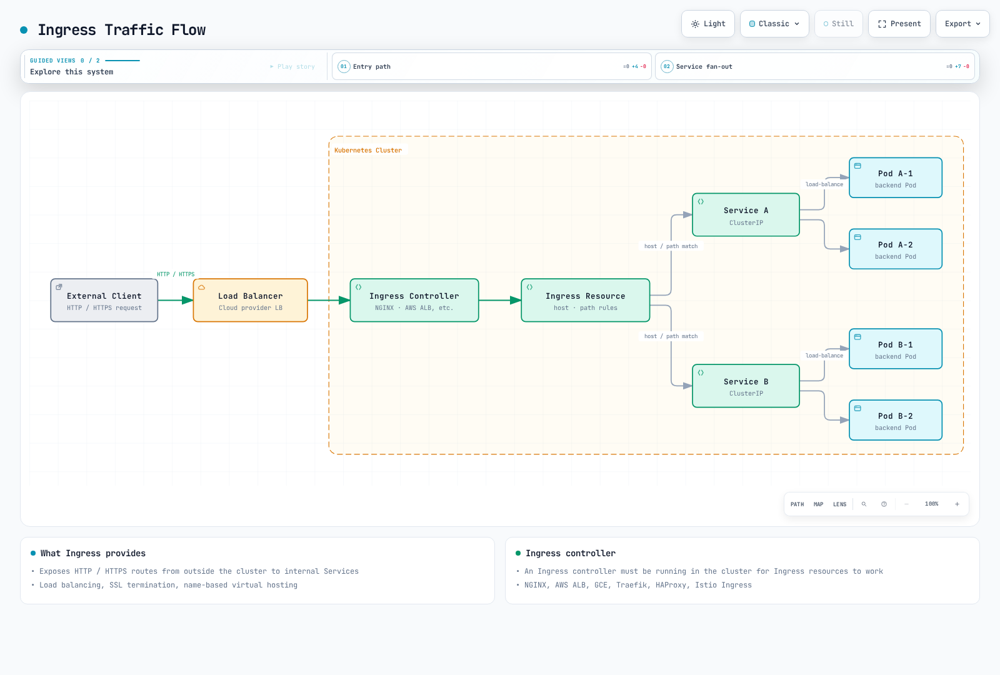
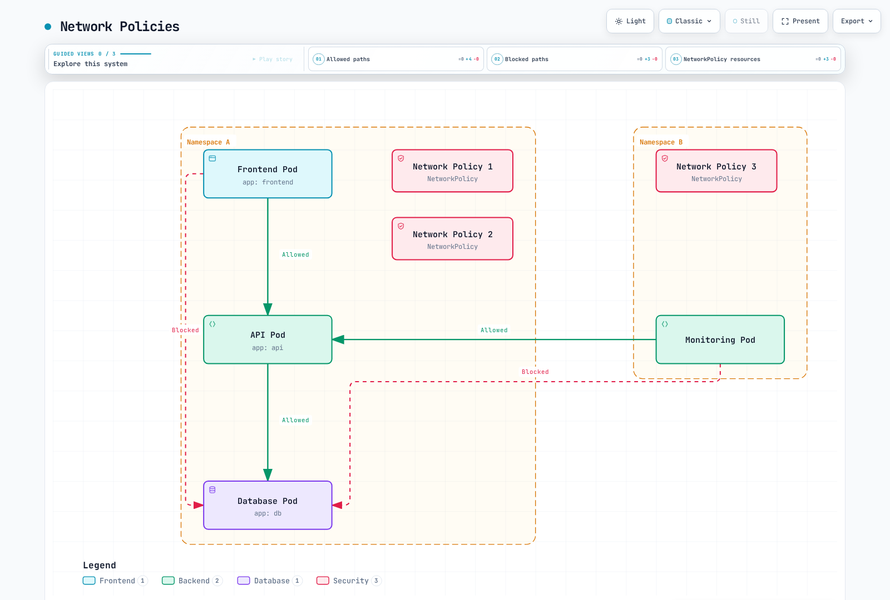
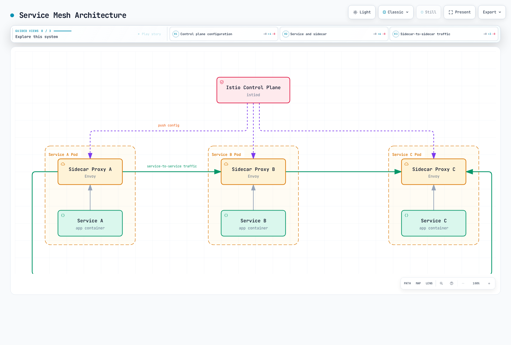

# Services とネットワーキング

> **対応バージョン**: Kubernetes 1.32, 1.33, 1.34
> **最終更新**: February 23, 2026

Kubernetes では、Service は Pod のセットに単一のアクセスポイントを提供する抽象化レイヤーです。この章では、さまざまな Service タイプ、Ingress、NetworkPolicy などを含む Kubernetes ネットワーキングの概念を詳しく学びます。

## ラボ環境のセットアップ

このドキュメントの例を実行するには、以下のツールと環境が必要です。

### 必要なツール
- kubectl v1.34 以降
- 稼働中の Kubernetes クラスター（EKS、minikube、kind など）

### サンプルアプリケーションのデプロイ

```bash
# Create namespace
kubectl create namespace networking-demo

# Deploy a simple application
kubectl -n networking-demo apply -f - <<EOF
apiVersion: apps/v1
kind: Deployment
metadata:
  name: web-app
  labels:
    app: web
spec:
  replicas: 3
  selector:
    matchLabels:
      app: web
  template:
    metadata:
      labels:
        app: web
    spec:
      containers:
      - name: nginx
        image: nginx:1.21
        ports:
        - containerPort: 80
---
apiVersion: v1
kind: Service
metadata:
  name: web-service
spec:
  selector:
    app: web
  ports:
  - port: 80
    targetPort: 80
  type: ClusterIP
EOF

# Verify services
kubectl -n networking-demo get svc,pods
```

## 目次

1. [Service タイプ](#service-types)
2. [Ingress](#ingress)
3. [Endpoints](#endpoints)
4. [Service Discovery](#service-discovery)
5. [CoreDNS](#coredns)
6. [NetworkPolicy](#network-policies)
7. [Service Mesh](#service-mesh)
8. [CNI (Container Network Interface)](#cnicontainer-network-interface)
9. [Cilium](#cilium)
   - [Cilium の概要](#introduction-to-cilium)
   - [eBPF テクノロジー](#ebpf-technology)
   - [Cilium ネットワーキングモデル](#cilium-networking-model)
   - [Cilium NetworkPolicy](#cilium-network-policies)
   - [Hubble によるネットワークの可視化](#network-visibility-with-hubble)
   - [Amazon EKS での Cilium の設定](#configuring-cilium-on-amazon-eks)

## Service タイプ

> **重要な概念**: Kubernetes Service は Pod のセットに安定したネットワークエンドポイントを提供し、さまざまなタイプを通じて内部および外部アクセスを制御します。

Kubernetes は、アプリケーションを公開する複数の方法をサポートするために、さまざまなタイプの Service を提供します。

### Service アーキテクチャ


[🔍 インタラクティブ図を表示](https://www.atomai.click/kubernetes-docs/archmaps/en-core-03-services-networking-0.html)

### Service タイプの比較

| Service タイプ | アクセス範囲 | 外部 IP | ユースケース | 特徴 |
|-------------|-------------|-------------|----------|----------|
| **ClusterIP** | クラスター内部 | いいえ | 内部マイクロサービス通信 | デフォルトの Service タイプ。クラスター内からのみアクセス可能 |
| **NodePort** | クラスター外部 | いいえ | 開発およびテスト環境 | すべてのノードの特定ポート（30000-32767）を介してアクセス |
| **LoadBalancer** | クラスター外部 | はい | 本番の外部 Service | クラウドプロバイダーのロードバランサーをプロビジョニング |
| **ExternalName** | クラスター内部 | いいえ | 外部 Service の内部エイリアス | DNS CNAME レコードによるリダイレクト |
| **Headless** | クラスター内部 | いいえ | Pod IP への直接アクセスが必要な場合 | ClusterIP を持たない特別な Service |

### ClusterIP

ClusterIP は最も基本的な Service タイプであり、クラスター内からのみアクセスできる固定 IP アドレスを提供します。

```yaml
apiVersion: v1
kind: Service
metadata:
  name: my-service
spec:
  selector:
    app: MyApp
  ports:
  - protocol: TCP
    port: 80
    targetPort: 9376
  type: ClusterIP  # Default, can be omitted
```

### NodePort

NodePort Service では、すべてのノードの特定ポートを通じて Service にアクセスできます。

```yaml
apiVersion: v1
kind: Service
metadata:
  name: my-service
spec:
  selector:
    app: MyApp
  ports:
  - protocol: TCP
    port: 80        # Port used within cluster
    targetPort: 9376 # Pod's port
    nodePort: 30007  # Port exposed on nodes (30000-32767)
  type: NodePort
```

ClusterIP はデフォルトの Service タイプであり、クラスター内からのみアクセスできる IP アドレスを提供します。

```yaml
apiVersion: v1
kind: Service
metadata:
  name: my-service
spec:
  selector:
    app: MyApp
  ports:
  - port: 80
    targetPort: 9376
  type: ClusterIP
```

この Service にはクラスター内で `my-service:80` としてアクセスできます。

### NodePort

NodePort Service では、すべてのノードの特定ポートを通じて Service にアクセスできます。

```yaml
apiVersion: v1
kind: Service
metadata:
  name: my-service
spec:
  selector:
    app: MyApp
  ports:
  - port: 80
    targetPort: 9376
    nodePort: 30007  # Optional, auto-assigned from 30000-32767 if not specified
  type: NodePort
```

この Service にはクラスター内のすべてのノードで `<Node IP>:30007` としてアクセスできます。

### LoadBalancer

LoadBalancer Service は、クラウドプロバイダーのロードバランサーをプロビジョニングして Service を外部に公開します。

```yaml
apiVersion: v1
kind: Service
metadata:
  name: my-service
  annotations:
    service.beta.kubernetes.io/aws-load-balancer-type: nlb  # Use NLB on AWS
spec:
  selector:
    app: MyApp
  ports:
  - port: 80
    targetPort: 9376
  type: LoadBalancer
```

この Service にはクラウドプロバイダーのロードバランサーを通じて外部からアクセスできます。

### ExternalName

ExternalName Service は、外部 Service のエイリアスを提供します。

```yaml
apiVersion: v1
kind: Service
metadata:
  name: my-service
spec:
  type: ExternalName
  externalName: my.database.example.com
```

この Service は DNS 名 `my-service` を `my.database.example.com` にマッピングします。

### Headless Service

Headless Service は cluster IP を持たず、各 Pod の DNS レコードを作成する Service です。

```yaml
apiVersion: v1
kind: Service
metadata:
  name: my-service
spec:
  clusterIP: None  # Headless service
  selector:
    app: MyApp
  ports:
  - port: 80
    targetPort: 9376
```

この Service は cluster IP を割り当てず、各 Pod の DNS レコードを作成します。

### External IP

Service では external IP を指定して、外部リソースを Kubernetes Service として公開できます。

```yaml
apiVersion: v1
kind: Service
metadata:
  name: my-service
spec:
  selector:
    app: MyApp
  ports:
  - port: 80
    targetPort: 9376
  externalIPs:
  - 80.11.12.10
```

## Ingress

Ingress は、クラスター外部からクラスター内の Service に HTTP および HTTPS ルートを公開する API オブジェクトです。Ingress はロードバランシング、SSL 終端、名前ベースの仮想ホスティングを提供します。



[🔍 インタラクティブ図を表示](https://www.atomai.click/kubernetes-docs/archmaps/en-core-03-services-networking-1.html)

### Ingress Controller

Ingress リソースを使用するには、Ingress Controller がクラスター内で実行されている必要があります。さまざまな Ingress Controller があります。

- NGINX Ingress Controller
- AWS ALB Ingress Controller
- GCE Ingress Controller
- Traefik
- HAProxy
- Istio Ingress

### 基本的な Ingress

```yaml
apiVersion: networking.k8s.io/v1
kind: Ingress
metadata:
  name: minimal-ingress
spec:
  ingressClassName: nginx  # Ingress controller class to use
  rules:
  - host: example.com
    http:
      paths:
      - path: /
        pathType: Prefix
        backend:
          service:
            name: example-service
            port:
              number: 80
```

この Ingress は、`example.com` ホストへのすべてのリクエストを `example-service:80` にルーティングします。

### パスベースルーティング

```yaml
apiVersion: networking.k8s.io/v1
kind: Ingress
metadata:
  name: path-based-ingress
spec:
  ingressClassName: nginx
  rules:
  - host: example.com
    http:
      paths:
      - path: /api
        pathType: Prefix
        backend:
          service:
            name: api-service
            port:
              number: 80
      - path: /web
        pathType: Prefix
        backend:
          service:
            name: web-service
            port:
              number: 80
```

この Ingress は、`example.com/api` で始まるリクエストを `api-service` に、`example.com/web` で始まるリクエストを `web-service` にルーティングします。

### 名前ベースの仮想ホスティング

```yaml
apiVersion: networking.k8s.io/v1
kind: Ingress
metadata:
  name: name-based-ingress
spec:
  ingressClassName: nginx
  rules:
  - host: foo.example.com
    http:
      paths:
      - path: /
        pathType: Prefix
        backend:
          service:
            name: foo-service
            port:
              number: 80
  - host: bar.example.com
    http:
      paths:
      - path: /
        pathType: Prefix
        backend:
          service:
            name: bar-service
            port:
              number: 80
```

この Ingress は、`foo.example.com` へのリクエストを `foo-service` に、`bar.example.com` へのリクエストを `bar-service` にルーティングします。

### TLS 設定

```yaml
apiVersion: networking.k8s.io/v1
kind: Ingress
metadata:
  name: tls-ingress
spec:
  ingressClassName: nginx
  tls:
  - hosts:
    - example.com
    secretName: example-tls
  rules:
  - host: example.com
    http:
      paths:
      - path: /
        pathType: Prefix
        backend:
          service:
            name: example-service
            port:
              number: 80
```

この Ingress は、`example-tls` Secret に保存された TLS 証明書を使用して、`example.com` への HTTPS 接続を終端します。

TLS Secret の作成:

```bash
kubectl create secret tls example-tls --cert=path/to/cert.crt --key=path/to/key.key
```

### AWS ALB Ingress Controller

AWS EKS では、AWS ALB Ingress Controller を使用して Application Load Balancer をプロビジョニングできます。

```yaml
apiVersion: networking.k8s.io/v1
kind: Ingress
metadata:
  name: alb-ingress
  annotations:
    kubernetes.io/ingress.class: alb
    alb.ingress.kubernetes.io/scheme: internet-facing
    alb.ingress.kubernetes.io/target-type: ip
    alb.ingress.kubernetes.io/listen-ports: '[{"HTTP": 80}, {"HTTPS": 443}]'
    alb.ingress.kubernetes.io/certificate-arn: arn:aws:acm:region:account-id:certificate/certificate-id
spec:
  rules:
  - host: example.com
    http:
      paths:
      - path: /
        pathType: Prefix
        backend:
          service:
            name: example-service
            port:
              number: 80
```

この Ingress は AWS ALB を使用して `example.com` へのリクエストを処理します。

## Endpoints

Endpoints は、Service が指す Pod の IP アドレスとポートを保存するリソースです。Service の selector に一致する Pod が存在する場合、Kubernetes は Endpoints オブジェクトを自動的に作成および管理します。

```yaml
apiVersion: v1
kind: Endpoints
metadata:
  name: my-service
subsets:
- addresses:
  - ip: 192.168.1.1
  ports:
  - port: 9376
```

この Endpoints は `my-service` が `192.168.1.1:9376` を指すようにします。

### EndpointSlice

EndpointSlice は、大規模クラスターでより優れたパフォーマンスを提供する、Endpoints のスケーラブルな代替手段です。

```yaml
apiVersion: discovery.k8s.io/v1
kind: EndpointSlice
metadata:
  name: my-service-abc
  labels:
    kubernetes.io/service-name: my-service
addressType: IPv4
ports:
- name: http
  protocol: TCP
  port: 80
endpoints:
- addresses:
  - "10.1.2.3"
  conditions:
    ready: true
  hostname: pod-1
  topology:
    kubernetes.io/hostname: node-1
    topology.kubernetes.io/zone: us-west-2a
```

## Service Discovery

Kubernetes は、主に 2 つの Service Discovery 方法を提供します。

1. **環境変数**: Kubernetes は、Pod の作成時にアクティブな Service の環境変数を Pod に注入します。
2. **DNS**: Kubernetes は、クラスター DNS サーバーを通じて Service の DNS レコードを提供します。

### 環境変数

Pod が作成されると、Kubernetes はその時点で存在するすべての Service の環境変数を Pod に注入します。たとえば、`my-service` という Service がある場合、以下の環境変数が作成されます。

```
MY_SERVICE_SERVICE_HOST=10.0.0.11
MY_SERVICE_SERVICE_PORT=80
```

### DNS

Kubernetes DNS は Service の DNS レコードを作成します。Pod は Service 名を使用して Service にアクセスできます。

- 通常の Service: `my-service.my-namespace.svc.cluster.local`
- Headless Service の Pod: `pod-name.my-service.my-namespace.svc.cluster.local`

## CoreDNS

CoreDNS は、Kubernetes クラスターの DNS サーバーとして使用される、柔軟で拡張可能な DNS サーバーです。

### CoreDNS 設定

CoreDNS は ConfigMap を通じて設定されます。

```yaml
apiVersion: v1
kind: ConfigMap
metadata:
  name: coredns
  namespace: kube-system
data:
  Corefile: |
    .:53 {
        errors
        health {
            lameduck 5s
        }
        ready
        kubernetes cluster.local in-addr.arpa ip6.arpa {
            pods insecure
            fallthrough in-addr.arpa ip6.arpa
            ttl 30
        }
        prometheus :9153
        forward . /etc/resolv.conf
        cache 30
        loop
        reload
        loadbalance
    }
```

この設定は以下の機能を提供します。

- `errors`: エラーロギング
- `health`: ヘルスチェックエンドポイント
- `ready`: Readiness チェックエンドポイント
- `kubernetes`: Kubernetes Service と Pod の DNS レコード
- `prometheus`: Prometheus メトリクスの公開
- `forward`: 外部 DNS クエリを転送
- `cache`: DNS レスポンスのキャッシュ
- `loop`: ループ検出
- `reload`: 設定ファイルの変更時に自動リロード
- `loadbalance`: ロードバランシング

### DNS Policy

Pod の DNS Policy は `dnsPolicy` フィールドで設定できます。

- `ClusterFirst`: デフォルト。最初に Kubernetes DNS サーバーを使用し、一致する名前が見つからない場合は上流のネームサーバーに転送します。
- `Default`: Pod が実行されているノードの DNS 設定を継承します。
- `ClusterFirstWithHostNet`: `hostNetwork: true` を持つ Pod に推奨される Policy です。
- `None`: すべての DNS 設定を `dnsConfig` フィールドで指定する必要があります。

```yaml
apiVersion: v1
kind: Pod
metadata:
  name: custom-dns
spec:
  containers:
  - name: nginx
    image: nginx
  dnsPolicy: "None"
  dnsConfig:
    nameservers:
    - 1.1.1.1
    - 8.8.8.8
    searches:
    - ns1.svc.cluster.local
    - my.dns.search.suffix
    options:
    - name: ndots
      value: "2"
    - name: edns0
```

## NetworkPolicy

NetworkPolicy は Pod 間の通信を制御する方法を提供します。NetworkPolicy を使用するには、ネットワークプラグインが対応している必要があります（例: Calico、Cilium、Weave Net）。



[🔍 インタラクティブ図を表示](https://www.atomai.click/kubernetes-docs/archmaps/en-core-03-services-networking-2.html)

### 基本的な NetworkPolicy

```yaml
apiVersion: networking.k8s.io/v1
kind: NetworkPolicy
metadata:
  name: default-deny-ingress
spec:
  podSelector: {}  # Applies to all Pods
  policyTypes:
  - Ingress
```

この NetworkPolicy はすべての Pod への ingress トラフィックをブロックします。

### 特定の Pod への Ingress を許可

```yaml
apiVersion: networking.k8s.io/v1
kind: NetworkPolicy
metadata:
  name: allow-nginx-ingress
spec:
  podSelector:
    matchLabels:
      app: nginx
  policyTypes:
  - Ingress
  ingress:
  - from:
    - podSelector:
        matchLabels:
          access: allowed
    ports:
    - protocol: TCP
      port: 80
```

この NetworkPolicy は、`access: allowed` ラベルを持つ Pod から `app: nginx` ラベルを持つ Pod への TCP ポート 80 の ingress トラフィックを許可します。

### Namespace ベースの Policy

```yaml
apiVersion: networking.k8s.io/v1
kind: NetworkPolicy
metadata:
  name: allow-from-prod-namespace
spec:
  podSelector:
    matchLabels:
      app: db
  policyTypes:
  - Ingress
  ingress:
  - from:
    - namespaceSelector:
        matchLabels:
          purpose: production
```

この NetworkPolicy は、`purpose: production` ラベルを持つ namespace 内のすべての Pod から `app: db` ラベルを持つ Pod への ingress トラフィックを許可します。

### Egress Policy

```yaml
apiVersion: networking.k8s.io/v1
kind: NetworkPolicy
metadata:
  name: limit-egress
spec:
  podSelector:
    matchLabels:
      app: frontend
  policyTypes:
  - Egress
  egress:
  - to:
    - podSelector:
        matchLabels:
          app: api
    ports:
    - protocol: TCP
      port: 8080
  - to:
    - namespaceSelector:
        matchLabels:
          purpose: monitoring
```

この NetworkPolicy は、`app: frontend` ラベルを持つ Pod から、`app: api` ラベルを持つ Pod の TCP ポート 8080 および `purpose: monitoring` ラベルを持つ namespace 内のすべての Pod への egress トラフィックを許可します。

### CIDR ベースの Policy

```yaml
apiVersion: networking.k8s.io/v1
kind: NetworkPolicy
metadata:
  name: allow-external-traffic
spec:
  podSelector:
    matchLabels:
      app: web
  policyTypes:
  - Ingress
  ingress:
  - from:
    - ipBlock:
        cidr: 192.168.1.0/24
        except:
        - 192.168.1.1/32
```

この NetworkPolicy は、`192.168.1.0/24` CIDR ブロック（192.168.1.1 を除く）から `app: web` ラベルを持つ Pod への ingress トラフィックを許可します。

## Service Mesh

Service Mesh は、マイクロサービス間の通信を管理するインフラストラクチャレイヤーです。Service Mesh は、Service Discovery、ロードバランシング、暗号化、認証、認可、可観測性などの機能を提供します。



[🔍 インタラクティブ図を表示](https://www.atomai.click/kubernetes-docs/archmaps/en-core-03-services-networking-3.html)

### Istio

Istio は代表的な Service Mesh 実装の 1 つです。Istio は sidecar パターンを使用して、各 Pod に Envoy proxy を注入します。

#### Istio Virtual Service

```yaml
apiVersion: networking.istio.io/v1alpha3
kind: VirtualService
metadata:
  name: reviews
spec:
  hosts:
  - reviews
  http:
  - match:
    - headers:
        end-user:
          exact: jason
    route:
    - destination:
        host: reviews
        subset: v2
  - route:
    - destination:
        host: reviews
        subset: v1
```

この VirtualService は、`end-user: jason` ヘッダーを持つリクエストを `reviews` Service の `v2` subset にルーティングし、その他すべてのリクエストを `v1` subset にルーティングします。

#### Istio Destination Rule

```yaml
apiVersion: networking.istio.io/v1alpha3
kind: DestinationRule
metadata:
  name: reviews
spec:
  host: reviews
  trafficPolicy:
    loadBalancer:
      simple: RANDOM
  subsets:
  - name: v1
    labels:
      version: v1
  - name: v2
    labels:
      version: v2
    trafficPolicy:
      loadBalancer:
        simple: ROUND_ROBIN
```

この DestinationRule は、`reviews` Service に対して 2 つの subset（`v1` と `v2`）を定義し、各 subset のロードバランシング Policy を設定します。

### Linkerd

Linkerd は、シンプルなインストールと使用方法を特徴とする軽量な Service Mesh です。

#### Linkerd Service Profile

```yaml
apiVersion: linkerd.io/v1alpha2
kind: ServiceProfile
metadata:
  name: nginx.default.svc.cluster.local
  namespace: default
spec:
  routes:
  - name: GET /
    condition:
      method: GET
      pathRegex: /
    responseClasses:
    - condition:
        status:
          min: 500
          max: 599
      isFailure: true
  retryBudget:
    retryRatio: 0.2
    minRetriesPerSecond: 10
    ttl: 10s
```

この ServiceProfile は、`nginx` Service のルートとリトライ Policy を定義します。

## Cilium


[🔍 インタラクティブ図を表示](https://www.atomai.click/kubernetes-docs/archmaps/en-core-03-services-networking-4.html)

[Cilium の詳細](../networking/cilium/README.md)

### Cilium の概要

Cilium は、Linux kernel の強力な eBPF テクノロジーを活用し、コンテナ化されたアプリケーションにネットワーク接続、セキュリティ、可観測性を提供するオープンソースソフトウェアです。Kubernetes、Docker、Mesos などのコンテナオーケストレーションプラットフォームにネットワーキング、セキュリティ、可観測性を提供するよう設計されています。

#### 主な機能

- **eBPF ベース**: kernel 内のプログラム可能なデータパスにより高性能なネットワーキングおよびセキュリティ機能を提供
- **API 対応ネットワーキング**: L3-L7 レイヤーで API 対応のネットワークセキュリティ Policy をサポート
- **Kubernetes 統合**: Kubernetes CNI（Container Network Interface）実装を提供
- **分散ロードバランシング**: 効率的な Service 間通信のための分散ロードバランシング
- **ネットワークの可視化**: Hubble によるネットワークフローの監視とトラブルシューティング
- **マルチクラスターサポート**: クラスター間のネットワーキングおよびセキュリティ Policy をサポート

#### Cilium の差別化ポイント

Cilium は、他の CNI ソリューションと比較していくつかの独自の利点を提供します。

**技術的な差別化**:
- **eBPF の活用**: kernel 内のプログラム可能なデータパスによる高性能と柔軟性
- **API 対応ネットワーキング**: L7 レイヤーまでの NetworkPolicy サポート
- **XDP (eXpress Data Path)**: パケット処理パフォーマンスの最適化
- **Kube-proxy の置き換え**: より効率的な Service ロードバランシング
- **Hubble 統合**: 強力なネットワーク可観測性ツール

**ユースケース別の利点**:
- **マイクロサービスアーキテクチャ**: きめ細かな NetworkPolicy と可観測性
- **マルチクラスターのデプロイ**: クラスター間のシームレスなネットワーキング
- **セキュリティ重視の環境**: 堅牢なネットワークセキュリティ Policy
- **高パフォーマンス要件**: 最適化されたデータパス
- **Service Mesh 統合**: Istio などの Service Mesh との統合

### eBPF テクノロジー

eBPF（extended Berkeley Packet Filter）は、Linux kernel 内でプログラムを安全に実行できるようにするテクノロジーです。Cilium は eBPF を使用してネットワーキング、セキュリティ、可観測性の機能を実装します。

#### eBPF の主な機能

1. **kernel 内実行**: eBPF プログラムは kernel 内で直接実行され、高いパフォーマンスを提供します。
2. **安全性**: eBPF verifier はプログラムが kernel を損傷しないことを保証します。
3. **動的ロード**: eBPF プログラムは kernel を再起動せずにロードおよびアンロードできます。
4. **Maps**: eBPF map はデータを保存し、user space と kernel space の間でデータを共有するために使用されます。

#### Cilium での eBPF の使用

Cilium は以下の方法で eBPF を使用します。

1. **ネットワークデータパス**: eBPF プログラムがネットワークパケットを処理およびルーティングします。
2. **Policy の適用**: eBPF プログラムが NetworkPolicy を適用します。
3. **ロードバランシング**: eBPF プログラムが Service のロードバランシングを実行します。
4. **可観測性**: eBPF プログラムがネットワークフローのメトリクスを収集します。

#### eBPF と従来のネットワーキングアプローチの比較

| 機能 | eBPF | 従来のアプローチ（iptables） |
|---------|------|--------------------------------|
| パフォーマンス | 非常に高い | 中程度 |
| スケーラビリティ | 非常に高い | 限定的 |
| プログラム可能性 | 高い | 限定的 |
| 可観測性 | 高い | 限定的 |
| 実装の複雑さ | 高い | 中程度 |

### Cilium ネットワーキングモデル

Cilium は、異なる環境や要件に合わせて設定可能なさまざまなネットワーキングモデルをサポートします。

#### Overlay ネットワーキング

Cilium はデフォルトで VXLAN を使用して overlay ネットワーキングを実装しますが、Geneve などの他のカプセル化プロトコルもサポートしています。

**仕組み**:
1. パケットは送信元ノードで作成されます。
2. Cilium は、元のパケットをカプセル化ヘッダーで包むことでパケットをカプセル化します。
3. カプセル化されたパケットは、物理ネットワークを通じて宛先ノードに送信されます。
4. 宛先ノードで、Cilium はパケットをデカプセル化して元のパケットを抽出します。
5. 抽出されたパケットは宛先コンテナに配信されます。

**利点**:
- 既存のネットワークインフラストラクチャとの互換性
- ネットワークトポロジーからの独立性
- マルチクラスター環境での IP 競合の防止

**欠点**:
- カプセル化オーバーヘッドによるパフォーマンスへの影響
- MTU サイズの縮小
- 追加の CPU 使用量

#### Native Routing

Native Routing はカプセル化なしの直接ルーティングを使用します。このモードでは、基盤となるネットワークインフラストラクチャが Pod IP アドレスをルーティングできる必要があります。

**仕組み**:
1. 各ノードは、そのノードで実行中の Pod の CIDR ブロックをアドバタイズします。
2. 各 Pod CIDR ブロックを対応するノードにルーティングするようルーティングテーブルが設定されます。
3. パケットはカプセル化なしで宛先ノードに直接ルーティングされます。

**利点**:
- カプセル化オーバーヘッドなし
- ネットワークパフォーマンスの向上
- CPU 使用量の削減

**欠点**:
- 基盤となるネットワークインフラストラクチャへの依存
- ネットワークトポロジーの制約
- IP アドレス管理の複雑さ

#### Hybrid モード

Cilium は、overlay ネットワーキングと Native Routing を組み合わせる Hybrid モードもサポートします。

**仕組み**:
1. 可能な場合は Native Routing を使用します。
2. Native Routing が不可能な場合は overlay ネットワーキングにフォールバックします。

**利点**:
- 柔軟性とパフォーマンスのバランス
- さまざまなネットワークトポロジーをサポート
- 段階的な移行が可能

#### AWS ENI モード

AWS EKS では、Cilium は AWS Elastic Network Interface（ENI）を活用して、Pod にネイティブ VPC IP アドレスを割り当てることができます。

**主な機能**:
- Pod への VPC ネイティブ IP アドレスの割り当て
- overlay ネットワークなしの VPC ネイティブネットワーキング
- AWS security group および NetworkPolicy との統合
- ネットワークパフォーマンスの向上

### Cilium NetworkPolicy

Cilium は Kubernetes NetworkPolicy を拡張し、L3-L7 レイヤーでのきめ細かなネットワークセキュリティ Policy を提供します。

#### L3/L4 Policy

Cilium は標準の Kubernetes NetworkPolicy をサポートし、IP アドレス、ポート、プロトコルに基づく Policy を定義できます。

```yaml
apiVersion: "cilium.io/v2"
kind: CiliumNetworkPolicy
metadata:
  name: "l3-l4-policy"
spec:
  endpointSelector:
    matchLabels:
      app: myapp
  ingress:
  - fromEndpoints:
    - matchLabels:
        app: frontend
    toPorts:
    - ports:
      - port: "80"
        protocol: TCP
```

この Policy は、`app: frontend` ラベルを持つ Pod から `app: myapp` ラベルを持つ Pod への TCP ポート 80 の ingress トラフィックを許可します。

#### L7 Policy

Cilium は L7（アプリケーションレイヤー）Policy をサポートし、HTTP、gRPC、Kafka などのプロトコルに対してきめ細かな Policy を定義できます。

```yaml
apiVersion: "cilium.io/v2"
kind: CiliumNetworkPolicy
metadata:
  name: "l7-policy"
spec:
  endpointSelector:
    matchLabels:
      app: myapp
  ingress:
  - fromEndpoints:
    - matchLabels:
        app: frontend
    toPorts:
    - ports:
      - port: "80"
        protocol: TCP
      rules:
        http:
        - method: "GET"
          path: "/api/v1/products"
```

この Policy は、`app: frontend` ラベルを持つ Pod から `app: myapp` ラベルを持つ Pod への `/api/v1/products` パスに対する HTTP GET リクエストのみを許可します。

#### クラスター全体の Policy

Cilium は、すべての Pod に適用される Policy を定義するためのクラスター全体の NetworkPolicy をサポートします。

```yaml
apiVersion: "cilium.io/v2"
kind: CiliumClusterwideNetworkPolicy
metadata:
  name: "cluster-wide-policy"
spec:
  endpointSelector:
    matchLabels: {}  # Applies to all Pods
  ingress:
  - fromEndpoints:
    - matchLabels:
        io.kubernetes.pod.namespace: kube-system
```

この Policy は、`kube-system` namespace 内の Pod からすべての Pod への ingress トラフィックを許可します。

### Hubble によるネットワークの可視化

Hubble は、eBPF を使用してネットワークフローを監視し、問題をトラブルシューティングする Cilium の可観測性レイヤーです。

#### Hubble の主な機能

1. **ネットワークフローの監視**: Pod 間通信をリアルタイムで監視します。
2. **Service 依存関係のマッピング**: Service 間の依存関係を可視化します。
3. **セキュリティの観測**: NetworkPolicy 違反を検出します。
4. **パフォーマンス分析**: ネットワークレイテンシーとスループットを分析します。
5. **トラブルシューティング**: ネットワーク接続の問題を診断します。

#### Hubble アーキテクチャ

Hubble は以下のコンポーネントで構成されます。

1. **Hubble Server**: ネットワークフローデータを収集する Cilium agent に組み込まれたサーバーです。
2. **Hubble Relay**: 複数の Hubble Server からデータを集約します。
3. **Hubble UI**: ネットワークフローを可視化する Web インターフェースです。
4. **Hubble CLI**: ネットワークフローをクエリするコマンドラインツールです。

#### Hubble の使用例

```bash
# Install Hubble CLI
curl -L --remote-name-all https://github.com/cilium/hubble/releases/latest/download/hubble-linux-amd64.tar.gz
sudo tar xzvfC hubble-linux-amd64.tar.gz /usr/local/bin
rm hubble-linux-amd64.tar.gz

# Enable Hubble
cilium hubble enable

# Observe network flows
hubble observe

# Observe HTTP requests
hubble observe --protocol http

# Observe network flows for specific Pod
hubble observe --pod app=myapp

# Observe network policy violations
hubble observe --verdict DROPPED
```

### Amazon EKS での Cilium の設定

Amazon EKS で Cilium を設定する方法はいくつかあります。ここでは一般的な設定方法を見ていきます。

#### 基本インストール

```bash
# Install Cilium CLI
curl -L --remote-name-all https://github.com/cilium/cilium-cli/releases/latest/download/cilium-linux-amd64.tar.gz
sudo tar xzvfC cilium-linux-amd64.tar.gz /usr/local/bin
rm cilium-linux-amd64.tar.gz

# Install Cilium
cilium install

# Check installation status
cilium status

# Test connectivity
cilium connectivity test
```

#### AWS ENI モードの設定

```bash
# Install Cilium with AWS ENI mode
cilium install --config aws-eni-mode=true

# Or install using Helm
helm install cilium cilium/cilium \
  --namespace kube-system \
  --set eni.enabled=true \
  --set ipam.mode=eni \
  --set egressMasqueradeInterfaces=eth0 \
  --set tunnel=disabled
```

#### Hubble を有効化

```bash
# Enable Hubble
cilium hubble enable --ui

# Access Hubble UI
kubectl port-forward -n kube-system svc/hubble-ui 12000:80
```

#### Cilium NetworkPolicy の例

```yaml
apiVersion: "cilium.io/v2"
kind: CiliumNetworkPolicy
metadata:
  name: "eks-app-policy"
spec:
  endpointSelector:
    matchLabels:
      app: api
  ingress:
  - fromEndpoints:
    - matchLabels:
        app: frontend
    toPorts:
    - ports:
      - port: "8080"
        protocol: TCP
      rules:
        http:
        - method: "GET"
          path: "/api/v1/.*"
  egress:
  - toEndpoints:
    - matchLabels:
        app: database
    toPorts:
    - ports:
      - port: "3306"
        protocol: TCP
```

この Policy は、`app: frontend` ラベルを持つ Pod から `app: api` ラベルを持つ Pod への `/api/v1/` パスに対する HTTP GET リクエストのみを許可し、`app: api` ラベルを持つ Pod から `app: database` ラベルを持つ Pod への TCP ポート 3306 の egress トラフィックを許可します。

#### EKS での Cilium 最適化

1. **Node Group の設定**:
   - 十分な ENI と IP アドレスを提供する instance type を選択
   - 適切な最大 Pod 数を設定

2. **パフォーマンス最適化**:
   - 直接ルーティングモードを使用
   - XDP アクセラレーションを有効化
   - BBR 輻輳制御アルゴリズムを有効化

3. **監視とロギング**:
   - Hubble を有効化
   - Prometheus メトリクスを収集
   - CloudWatch との統合

## まとめ

この章では、Kubernetes Service とネットワーキングについて学びました。Service は Pod のセットに安定したエンドポイントを提供し、Ingress は外部トラフィックをクラスター内の Service にルーティングします。NetworkPolicy は Pod 間の通信を制御し、Service Mesh はマイクロサービスアーキテクチャにおける Service 間通信を管理します。また、CNI と Cilium を通じて高度なネットワーキング機能を実装する方法も学びました。

Kubernetes のネットワーキング機能を理解して活用することで、安全でスケーラブルなアプリケーションを構築できます。

次の章では、Kubernetes のストレージオプションについて学びます。

## 参考資料

- [Kubernetes 公式ドキュメント - Services](https://kubernetes.io/docs/concepts/services-networking/service/)
- [Kubernetes 公式ドキュメント - Ingress](https://kubernetes.io/docs/concepts/services-networking/ingress/)
- [Kubernetes 公式ドキュメント - NetworkPolicy](https://kubernetes.io/docs/concepts/services-networking/network-policies/)
- [Kubernetes 公式ドキュメント - Services と Pod の DNS](https://kubernetes.io/docs/concepts/services-networking/dns-pod-service/)
- [Istio 公式ドキュメント](https://istio.io/latest/docs/)
- [Linkerd 公式ドキュメント](https://linkerd.io/2.11/overview/)
- [Cilium 公式ドキュメント](https://docs.cilium.io/)
- [CNI 公式ドキュメント](https://github.com/containernetworking/cni)

## クイズ

この章で学んだ内容を確認するには、[Services and Networking Quiz](../quizzes/core/03-services-networking-quiz.md) に挑戦してください。
