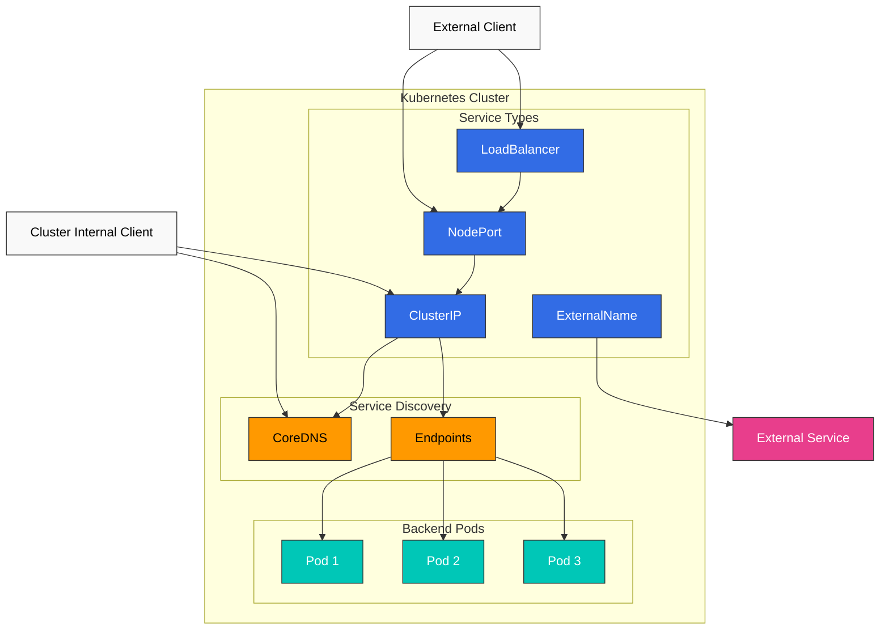
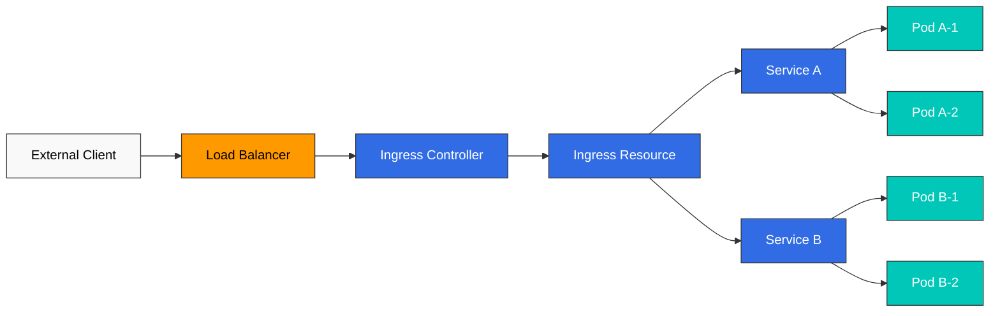
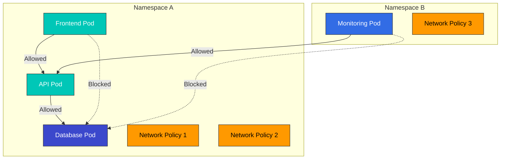
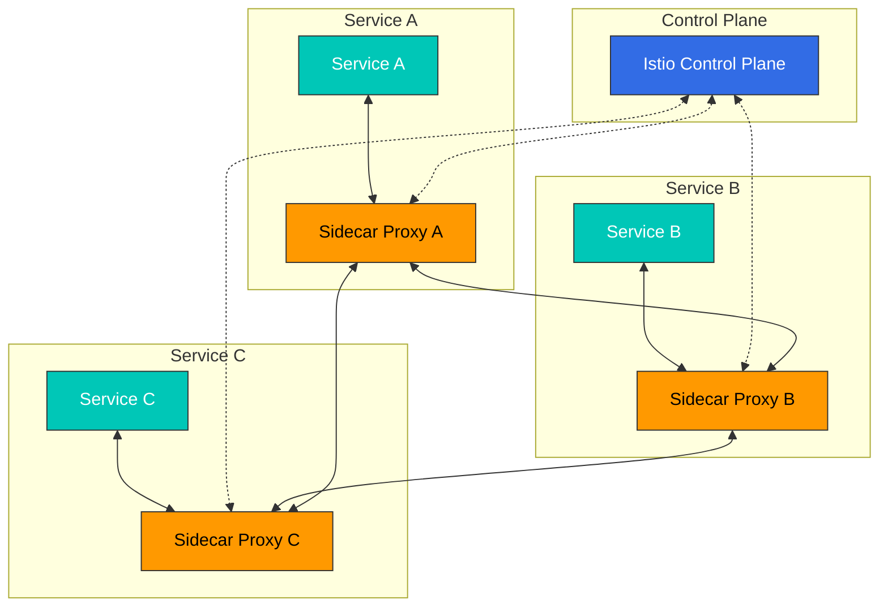
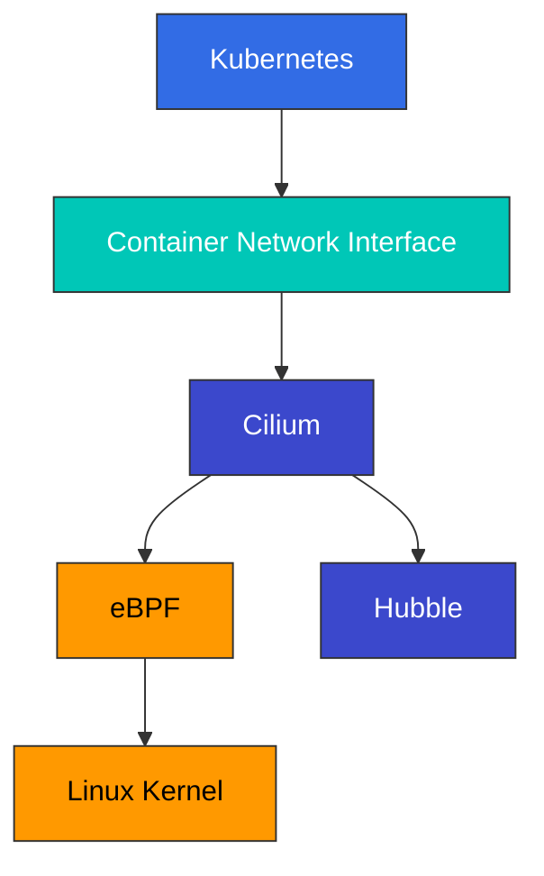

# Services and Networking

> **Supported Versions**: Kubernetes 1.32, 1.33, 1.34
> **最終更新**: February 23, 2026

Kubernetes では、Service は一連の Pod に対して単一のアクセスポイントを提供する抽象化レイヤーです。この章では、さまざまな service type、Ingress、network policies などを含む Kubernetes networking の概念を詳しく見ていきます。

## Lab Environment Setup

このドキュメントの例を試すには、次のツールと環境が必要です。

### Required Tools
- kubectl v1.34 以上
- 稼働中の Kubernetes cluster（EKS、minikube、kind など）

### Deploy Example Application

```bash
# Create namespace
kubectl create namespace networking-demo

# Deploy a simple application
kubectl -n networking-demo apply -f - <<EOF
apiVersion: apps/v1
kind: Deployment
metadata:
  name: web-app
  labels:
    app: web
spec:
  replicas: 3
  selector:
    matchLabels:
      app: web
  template:
    metadata:
      labels:
        app: web
    spec:
      containers:
      - name: nginx
        image: nginx:1.21
        ports:
        - containerPort: 80
---
apiVersion: v1
kind: Service
metadata:
  name: web-service
spec:
  selector:
    app: web
  ports:
  - port: 80
    targetPort: 80
  type: ClusterIP
EOF

# Verify services
kubectl -n networking-demo get svc,pods
```

## Table of Contents

1. [Service Types](#service-types)
2. [Ingress](#ingress)
3. [Endpoints](#endpoints)
4. [Service Discovery](#service-discovery)
5. [CoreDNS](#coredns)
6. [Network Policies](#network-policies)
7. [Service Mesh](#service-mesh)
8. [CNI (Container Network Interface)](#cnicontainer-network-interface)
9. [Cilium](#cilium)
   - [Introduction to Cilium](#introduction-to-cilium)
   - [eBPF Technology](#ebpf-technology)
   - [Cilium Networking Model](#cilium-networking-model)
   - [Cilium Network Policies](#cilium-network-policies)
   - [Network Visibility with Hubble](#network-visibility-with-hubble)
   - [Configuring Cilium on Amazon EKS](#configuring-cilium-on-amazon-eks)

## Service Types

> **Key Concept**: Kubernetes Services は、一連の Pod に安定した network endpoint を提供し、さまざまな type を通じて内部および外部からのアクセスを制御します。

Kubernetes は、application を公開する複数の方法をサポートするために、さまざまな type の service を提供します。

### Service Architecture



### Service Type Comparison

| Service Type | Access Scope | External IP | Use Case | Features |
|-------------|-------------|-------------|----------|----------|
| **ClusterIP** | Cluster 内部 | なし | 内部 microservice 通信 | Default service type、cluster 内からのみアクセス可能 |
| **NodePort** | Cluster 外部 | なし | 開発環境とテスト環境 | すべての node 上の特定 port（30000-32767）を通じてアクセス |
| **LoadBalancer** | Cluster 外部 | あり | 本番用外部 service | Cloud provider の load balancer をプロビジョニング |
| **ExternalName** | Cluster 内部 | なし | 外部 service 用の内部 alias | DNS CNAME record によるリダイレクト |
| **Headless** | Cluster 内部 | なし | 直接 Pod IP access が必要な場合 | ClusterIP を持たない特別な service |

### ClusterIP

ClusterIP は最も基本的な service type であり、cluster 内からのみアクセス可能な固定 IP address を提供します。

```yaml
apiVersion: v1
kind: Service
metadata:
  name: my-service
spec:
  selector:
    app: MyApp
  ports:
  - protocol: TCP
    port: 80
    targetPort: 9376
  type: ClusterIP  # Default, can be omitted
```

### NodePort

NodePort services は、すべての node 上の特定 port を通じて service へのアクセスを許可します。

```yaml
apiVersion: v1
kind: Service
metadata:
  name: my-service
spec:
  selector:
    app: MyApp
  ports:
  - protocol: TCP
    port: 80        # Port used within cluster
    targetPort: 9376 # Pod's port
    nodePort: 30007  # Port exposed on nodes (30000-32767)
  type: NodePort
```

ClusterIP は default の service type であり、cluster 内からのみアクセス可能な IP address を提供します。

```yaml
apiVersion: v1
kind: Service
metadata:
  name: my-service
spec:
  selector:
    app: MyApp
  ports:
  - port: 80
    targetPort: 9376
  type: ClusterIP
```

この service は cluster 内で `my-service:80` としてアクセスできます。

### NodePort

NodePort services は、すべての node 上の特定 port を通じて service へのアクセスを許可します。

```yaml
apiVersion: v1
kind: Service
metadata:
  name: my-service
spec:
  selector:
    app: MyApp
  ports:
  - port: 80
    targetPort: 9376
    nodePort: 30007  # Optional, auto-assigned from 30000-32767 if not specified
  type: NodePort
```

この service は cluster 内のすべての node で `<Node IP>:30007` としてアクセスできます。

### LoadBalancer

LoadBalancer services は、cloud provider から load balancer をプロビジョニングして service を外部に公開します。

```yaml
apiVersion: v1
kind: Service
metadata:
  name: my-service
  annotations:
    service.beta.kubernetes.io/aws-load-balancer-type: nlb  # Use NLB on AWS
spec:
  selector:
    app: MyApp
  ports:
  - port: 80
    targetPort: 9376
  type: LoadBalancer
```

この service は cloud provider の load balancer を通じて外部からアクセスできます。

### ExternalName

ExternalName services は、外部 service の alias を提供します。

```yaml
apiVersion: v1
kind: Service
metadata:
  name: my-service
spec:
  type: ExternalName
  externalName: my.database.example.com
```

この service は DNS name `my-service` を `my.database.example.com` にマッピングします。

### Headless Service

Headless service は cluster IP を持たない service であり、各 Pod の DNS record を作成します。

```yaml
apiVersion: v1
kind: Service
metadata:
  name: my-service
spec:
  clusterIP: None  # Headless service
  selector:
    app: MyApp
  ports:
  - port: 80
    targetPort: 9376
```

この service は cluster IP を割り当てず、各 Pod の DNS record を作成します。

### External IP

Services は、外部 resource を Kubernetes service として公開するために external IPs を指定できます。

```yaml
apiVersion: v1
kind: Service
metadata:
  name: my-service
spec:
  selector:
    app: MyApp
  ports:
  - port: 80
    targetPort: 9376
  externalIPs:
  - 80.11.12.10
```

## Ingress

Ingress は、cluster 外部から cluster 内の services への HTTP および HTTPS routes を公開する API object です。Ingress は load balancing、SSL termination、name-based virtual hosting を提供します。



### Ingress Controller

Ingress resources を使用するには、Ingress controller が cluster 内で実行されている必要があります。さまざまな Ingress controllers があります。

- NGINX Ingress Controller
- AWS ALB Ingress Controller
- GCE Ingress Controller
- Traefik
- HAProxy
- Istio Ingress

### Basic Ingress

```yaml
apiVersion: networking.k8s.io/v1
kind: Ingress
metadata:
  name: minimal-ingress
spec:
  ingressClassName: nginx  # Ingress controller class to use
  rules:
  - host: example.com
    http:
      paths:
      - path: /
        pathType: Prefix
        backend:
          service:
            name: example-service
            port:
              number: 80
```

この Ingress は、`example.com` host へのすべての request を `example-service:80` に route します。

### Path-Based Routing

```yaml
apiVersion: networking.k8s.io/v1
kind: Ingress
metadata:
  name: path-based-ingress
spec:
  ingressClassName: nginx
  rules:
  - host: example.com
    http:
      paths:
      - path: /api
        pathType: Prefix
        backend:
          service:
            name: api-service
            port:
              number: 80
      - path: /web
        pathType: Prefix
        backend:
          service:
            name: web-service
            port:
              number: 80
```

この Ingress は、`example.com/api` で始まる request を `api-service` に、`example.com/web` で始まる request を `web-service` に route します。

### Name-Based Virtual Hosting

```yaml
apiVersion: networking.k8s.io/v1
kind: Ingress
metadata:
  name: name-based-ingress
spec:
  ingressClassName: nginx
  rules:
  - host: foo.example.com
    http:
      paths:
      - path: /
        pathType: Prefix
        backend:
          service:
            name: foo-service
            port:
              number: 80
  - host: bar.example.com
    http:
      paths:
      - path: /
        pathType: Prefix
        backend:
          service:
            name: bar-service
            port:
              number: 80
```

この Ingress は、`foo.example.com` への request を `foo-service` に、`bar.example.com` への request を `bar-service` に route します。

### TLS Configuration

```yaml
apiVersion: networking.k8s.io/v1
kind: Ingress
metadata:
  name: tls-ingress
spec:
  ingressClassName: nginx
  tls:
  - hosts:
    - example.com
    secretName: example-tls
  rules:
  - host: example.com
    http:
      paths:
      - path: /
        pathType: Prefix
        backend:
          service:
            name: example-service
            port:
              number: 80
```

この Ingress は、`example-tls` secret に保存されている TLS certificate を使用して、`example.com` への HTTPS connections を終了します。

TLS secret の作成:

```bash
kubectl create secret tls example-tls --cert=path/to/cert.crt --key=path/to/key.key
```

### AWS ALB Ingress Controller

AWS EKS では、AWS ALB Ingress Controller を使用して Application Load Balancers をプロビジョニングできます。

```yaml
apiVersion: networking.k8s.io/v1
kind: Ingress
metadata:
  name: alb-ingress
  annotations:
    kubernetes.io/ingress.class: alb
    alb.ingress.kubernetes.io/scheme: internet-facing
    alb.ingress.kubernetes.io/target-type: ip
    alb.ingress.kubernetes.io/listen-ports: '[{"HTTP": 80}, {"HTTPS": 443}]'
    alb.ingress.kubernetes.io/certificate-arn: arn:aws:acm:region:account-id:certificate/certificate-id
spec:
  rules:
  - host: example.com
    http:
      paths:
      - path: /
        pathType: Prefix
        backend:
          service:
            name: example-service
            port:
              number: 80
```

この Ingress は AWS ALB を使用して `example.com` への request を処理します。

## Endpoints

Endpoints は、service が指す Pod の IP addresses と ports を保存する resource です。Service の selector に一致する Pod がある場合、Kubernetes は Endpoints object を自動的に作成して管理します。

```yaml
apiVersion: v1
kind: Endpoints
metadata:
  name: my-service
subsets:
- addresses:
  - ip: 192.168.1.1
  ports:
  - port: 9376
```

この Endpoints は、`my-service` が `192.168.1.1:9376` を指すようにします。

### EndpointSlice

EndpointSlice は、大規模 cluster でより優れた performance を提供する、Endpoints に対する scalable な代替です。

```yaml
apiVersion: discovery.k8s.io/v1
kind: EndpointSlice
metadata:
  name: my-service-abc
  labels:
    kubernetes.io/service-name: my-service
addressType: IPv4
ports:
- name: http
  protocol: TCP
  port: 80
endpoints:
- addresses:
  - "10.1.2.3"
  conditions:
    ready: true
  hostname: pod-1
  topology:
    kubernetes.io/hostname: node-1
    topology.kubernetes.io/zone: us-west-2a
```

## Service Discovery

Kubernetes は、主に 2 つの service discovery 方法を提供します。

1. **Environment Variables**: Kubernetes は、Pod が作成されるときに、active な services の environment variables を Pod に注入します。
2. **DNS**: Kubernetes は、cluster DNS server を通じて services の DNS records を提供します。

### Environment Variables

Pod が作成されると、Kubernetes はその時点で存在するすべての services の environment variables を Pod に注入します。たとえば、`my-service` という service がある場合、次の environment variables が作成されます。

```
MY_SERVICE_SERVICE_HOST=10.0.0.11
MY_SERVICE_SERVICE_PORT=80
```

### DNS

Kubernetes DNS は、services の DNS records を作成します。Pods は service name を使用して services にアクセスできます。

- Regular service: `my-service.my-namespace.svc.cluster.local`
- Pod of headless service: `pod-name.my-service.my-namespace.svc.cluster.local`

## CoreDNS

CoreDNS は、Kubernetes clusters の DNS server として使用される、柔軟で拡張可能な DNS server です。

### CoreDNS Configuration

CoreDNS は ConfigMap を通じて設定されます。

```yaml
apiVersion: v1
kind: ConfigMap
metadata:
  name: coredns
  namespace: kube-system
data:
  Corefile: |
    .:53 {
        errors
        health {
            lameduck 5s
        }
        ready
        kubernetes cluster.local in-addr.arpa ip6.arpa {
            pods insecure
            fallthrough in-addr.arpa ip6.arpa
            ttl 30
        }
        prometheus :9153
        forward . /etc/resolv.conf
        cache 30
        loop
        reload
        loadbalance
    }
```

この configuration は次の features を提供します。

- `errors`: Error logging
- `health`: Health check endpoint
- `ready`: Readiness check endpoint
- `kubernetes`: Kubernetes services と Pods の DNS records
- `prometheus`: Prometheus metrics exposure
- `forward`: 外部 DNS queries の転送
- `cache`: DNS response caching
- `loop`: Loop detection
- `reload`: configuration file 変更時の自動 reload
- `loadbalance`: Load balancing

### DNS Policy

Pod の DNS policy は `dnsPolicy` field を通じて設定できます。

- `ClusterFirst`: Default。まず Kubernetes DNS server を使用し、一致するものが見つからない場合は upstream nameservers に転送します。
- `Default`: Pod が実行されている node の DNS settings を継承します。
- `ClusterFirstWithHostNet`: `hostNetwork: true` の Pod に推奨される policy です。
- `None`: すべての DNS settings を `dnsConfig` field を通じて指定する必要があります。

```yaml
apiVersion: v1
kind: Pod
metadata:
  name: custom-dns
spec:
  containers:
  - name: nginx
    image: nginx
  dnsPolicy: "None"
  dnsConfig:
    nameservers:
    - 1.1.1.1
    - 8.8.8.8
    searches:
    - ns1.svc.cluster.local
    - my.dns.search.suffix
    options:
    - name: ndots
      value: "2"
    - name: edns0
```

## Network Policies

Network policies は、Pods 間の通信を制御する方法を提供します。Network policies を使用するには、network plugin がそれらをサポートしている必要があります（例: Calico、Cilium、Weave Net）。



### Basic Network Policy

```yaml
apiVersion: networking.k8s.io/v1
kind: NetworkPolicy
metadata:
  name: default-deny-ingress
spec:
  podSelector: {}  # Applies to all Pods
  policyTypes:
  - Ingress
```

この network policy は、すべての Pods への ingress traffic をブロックします。

### Allow Ingress to Specific Pods

```yaml
apiVersion: networking.k8s.io/v1
kind: NetworkPolicy
metadata:
  name: allow-nginx-ingress
spec:
  podSelector:
    matchLabels:
      app: nginx
  policyTypes:
  - Ingress
  ingress:
  - from:
    - podSelector:
        matchLabels:
          access: allowed
    ports:
    - protocol: TCP
      port: 80
```

この network policy は、`access: allowed` label を持つ Pods から `app: nginx` label を持つ Pods への TCP port 80 の ingress traffic を許可します。

### Namespace-Based Policy

```yaml
apiVersion: networking.k8s.io/v1
kind: NetworkPolicy
metadata:
  name: allow-from-prod-namespace
spec:
  podSelector:
    matchLabels:
      app: db
  policyTypes:
  - Ingress
  ingress:
  - from:
    - namespaceSelector:
        matchLabels:
          purpose: production
```

この network policy は、`purpose: production` label を持つ namespaces 内のすべての Pods から、`app: db` label を持つ Pods への ingress traffic を許可します。

### Egress Policy

```yaml
apiVersion: networking.k8s.io/v1
kind: NetworkPolicy
metadata:
  name: limit-egress
spec:
  podSelector:
    matchLabels:
      app: frontend
  policyTypes:
  - Egress
  egress:
  - to:
    - podSelector:
        matchLabels:
          app: api
    ports:
    - protocol: TCP
      port: 8080
  - to:
    - namespaceSelector:
        matchLabels:
          purpose: monitoring
```

この network policy は、`app: frontend` label を持つ Pods から `app: api` label を持つ Pods の TCP port 8080 への egress traffic、および `purpose: monitoring` label を持つ namespaces 内のすべての Pods への egress traffic を許可します。

### CIDR-Based Policy

```yaml
apiVersion: networking.k8s.io/v1
kind: NetworkPolicy
metadata:
  name: allow-external-traffic
spec:
  podSelector:
    matchLabels:
      app: web
  policyTypes:
  - Ingress
  ingress:
  - from:
    - ipBlock:
        cidr: 192.168.1.0/24
        except:
        - 192.168.1.1/32
```

この network policy は、`192.168.1.0/24` CIDR block（192.168.1.1 を除く）から `app: web` label を持つ Pods への ingress traffic を許可します。

## Service Mesh

Service mesh は、microservices 間の通信を管理する infrastructure layer です。Service meshes は、service discovery、load balancing、encryption、authentication、authorization、observability などの機能を提供します。



### Istio

Istio は、一般的な service mesh implementations の 1 つです。Istio は sidecar pattern を使用して、各 Pod に Envoy proxies を注入します。

#### Istio Virtual Service

```yaml
apiVersion: networking.istio.io/v1alpha3
kind: VirtualService
metadata:
  name: reviews
spec:
  hosts:
  - reviews
  http:
  - match:
    - headers:
        end-user:
          exact: jason
    route:
    - destination:
        host: reviews
        subset: v2
  - route:
    - destination:
        host: reviews
        subset: v1
```

この VirtualService は、`end-user: jason` header を持つ request を `reviews` service の `v2` subset に route し、それ以外のすべての request を `v1` subset に route します。

#### Istio Destination Rule

```yaml
apiVersion: networking.istio.io/v1alpha3
kind: DestinationRule
metadata:
  name: reviews
spec:
  host: reviews
  trafficPolicy:
    loadBalancer:
      simple: RANDOM
  subsets:
  - name: v1
    labels:
      version: v1
  - name: v2
    labels:
      version: v2
    trafficPolicy:
      loadBalancer:
        simple: ROUND_ROBIN
```

この DestinationRule は、`reviews` service に 2 つの subsets（`v1` と `v2`）を定義し、各 subset の load balancing policies を設定します。

### Linkerd

Linkerd は、簡単な installation と使用を特徴とする lightweight な service mesh です。

#### Linkerd Service Profile

```yaml
apiVersion: linkerd.io/v1alpha2
kind: ServiceProfile
metadata:
  name: nginx.default.svc.cluster.local
  namespace: default
spec:
  routes:
  - name: GET /
    condition:
      method: GET
      pathRegex: /
    responseClasses:
    - condition:
        status:
          min: 500
          max: 599
      isFailure: true
  retryBudget:
    retryRatio: 0.2
    minRetriesPerSecond: 10
    ttl: 10s
```

この ServiceProfile は、`nginx` service の routes と retry policies を定義します。

## Cilium



[Cilium Details](../networking/cilium/README.md)

### Introduction to Cilium

Cilium は、Linux kernel の強力な eBPF technology を活用して、containerized applications に network connectivity、security、observability を提供する open-source software です。Kubernetes、Docker、Mesos のような container orchestration platforms 向けに networking、security、observability を提供するように設計されています。

#### Key Features

- **eBPF-based**: Kernel 内の programmable data path を通じて、高性能な networking と security features を提供します
- **API-aware Networking**: L3-L7 layers で API-aware network security policies をサポートします
- **Kubernetes Integration**: Kubernetes CNI (Container Network Interface) implementation を提供します
- **Distributed Load Balancing**: 効率的な service-to-service communication のための distributed load balancing
- **Network Visibility**: Hubble を通じた network flow monitoring と troubleshooting
- **Multi-cluster Support**: Cross-cluster networking と security policies のサポート

#### Cilium's Differentiating Points

Cilium は、他の CNI solutions と比較して、いくつかの独自の利点を提供します。

**Technical Differentiation**:
- **eBPF Utilization**: Kernel 内の programmable data path による高い performance と flexibility
- **API-aware Networking**: L7 layer までの network policy support
- **XDP (eXpress Data Path)**: Packet processing performance optimization
- **Kube-proxy Replacement**: より効率的な service load balancing
- **Hubble Integration**: 強力な network observability tool

**Benefits by Use Case**:
- **Microservice Architecture**: きめ細かな network policies と observability
- **Multi-cluster Deployment**: Clusters 間の seamless networking
- **Security-focused Environment**: 堅牢な network security policies
- **High-performance Requirements**: 最適化された data path
- **Service Mesh Integration**: Istio などの service meshes との integration

### eBPF Technology

eBPF (extended Berkeley Packet Filter) は、Linux kernel 内で programs を安全に実行できる technology です。Cilium は eBPF を使用して networking、security、observability features を実装します。

#### Key Features of eBPF

1. **In-kernel Execution**: eBPF programs は kernel 内で直接実行され、高い performance を提供します。
2. **Safety**: eBPF verifier は、programs が kernel を損傷しないことを保証します。
3. **Dynamic Loading**: eBPF programs は、kernel を reboot せずに load および unload できます。
4. **Maps**: eBPF maps は、data の保存と、user space と kernel space 間での data 共有に使用されます。

#### eBPF Usage in Cilium

Cilium は eBPF を次のように使用します。

1. **Network Data Path**: eBPF programs は network packets を処理して route します。
2. **Policy Enforcement**: eBPF programs は network policies を enforce します。
3. **Load Balancing**: eBPF programs は services の load balancing を実行します。
4. **Observability**: eBPF programs は network flows の metrics を収集します。

#### eBPF vs Traditional Networking Approaches

| Feature | eBPF | Traditional Approach (iptables) |
|---------|------|--------------------------------|
| Performance | 非常に高い | 中程度 |
| Scalability | 非常に高い | 限定的 |
| Programmability | 高い | 限定的 |
| Observability | 高い | 限定的 |
| Implementation Complexity | 高い | 中程度 |

### Cilium Networking Model

Cilium は、さまざまな環境と要件に合わせて設定できる複数の networking models をサポートします。

#### Overlay Networking

Cilium は default で VXLAN を使用して overlay networking を実装しますが、Geneve などの他の encapsulation protocols もサポートします。

**How it works**:
1. Packets は source node で作成されます。
2. Cilium は、元の packet を encapsulation headers で包むことで packet を encapsulate します。
3. Encapsulated packet は、physical network を通じて destination node に送信されます。
4. Destination node で、Cilium は packet を decapsulate して元の packet を抽出します。
5. 抽出された packet は destination container に配信されます。

**Advantages**:
- 既存の network infrastructure との互換性
- Network topology independence
- Multi-cluster environments における IP conflict prevention

**Disadvantages**:
- Encapsulation overhead による performance impact
- MTU size の低下
- 追加の CPU usage

#### Native Routing

Native routing は、encapsulation を使わずに direct routing を使用します。この mode では、underlying network infrastructure が Pod IP addresses を route できる必要があります。

**How it works**:
1. 各 node は、その node 上で実行されている Pods の CIDR block を advertise します。
2. Routing tables は、各 Pod CIDR block を対応する node に route するよう設定されます。
3. Packets は encapsulation なしで destination node に直接 route されます。

**Advantages**:
- Encapsulation overhead がない
- Network performance の向上
- CPU usage の低減

**Disadvantages**:
- Underlying network infrastructure への依存
- Network topology constraints
- IP address management complexity

#### Hybrid Mode

Cilium は、overlay networking と native routing を組み合わせた hybrid mode もサポートしています。

**How it works**:
1. 可能な場合は native routing を使用します。
2. Native routing が不可能な場合は overlay networking に fallback します。

**Advantages**:
- Flexibility と performance のバランス
- さまざまな network topologies のサポート
- 段階的な migration が可能

#### AWS ENI Mode

AWS EKS では、Cilium は AWS Elastic Network Interfaces (ENIs) を活用して Pod に native VPC IP addresses を割り当てることができます。

**Key Features**:
- Pod に VPC native IP addresses を割り当てます
- Overlay network を使わない VPC native networking
- AWS security groups と network policy integration
- Network performance の向上

### Cilium Network Policies

Cilium は Kubernetes network policies を拡張し、L3-L7 layers で fine-grained な network security policies を提供します。

#### L3/L4 Policies

Cilium は、IP addresses、ports、protocols に基づいて policies を定義する standard Kubernetes network policies をサポートします。

```yaml
apiVersion: "cilium.io/v2"
kind: CiliumNetworkPolicy
metadata:
  name: "l3-l4-policy"
spec:
  endpointSelector:
    matchLabels:
      app: myapp
  ingress:
  - fromEndpoints:
    - matchLabels:
        app: frontend
    toPorts:
    - ports:
      - port: "80"
        protocol: TCP
```

この policy は、`app: frontend` label を持つ Pods から `app: myapp` label を持つ Pods への TCP port 80 の ingress traffic を許可します。

#### L7 Policies

Cilium は、HTTP、gRPC、Kafka などの protocols に対する fine-grained な policies を定義する L7（application layer）policies をサポートします。

```yaml
apiVersion: "cilium.io/v2"
kind: CiliumNetworkPolicy
metadata:
  name: "l7-policy"
spec:
  endpointSelector:
    matchLabels:
      app: myapp
  ingress:
  - fromEndpoints:
    - matchLabels:
        app: frontend
    toPorts:
    - ports:
      - port: "80"
        protocol: TCP
      rules:
        http:
        - method: "GET"
          path: "/api/v1/products"
```

この policy は、`app: frontend` label を持つ Pods から `app: myapp` label を持つ Pods への、`/api/v1/products` path に対する HTTP GET requests のみを許可します。

#### Cluster-wide Policies

Cilium は、すべての Pods に適用される policies を定義する cluster-wide network policies をサポートします。

```yaml
apiVersion: "cilium.io/v2"
kind: CiliumClusterwideNetworkPolicy
metadata:
  name: "cluster-wide-policy"
spec:
  endpointSelector:
    matchLabels: {}  # Applies to all Pods
  ingress:
  - fromEndpoints:
    - matchLabels:
        io.kubernetes.pod.namespace: kube-system
```

この policy は、`kube-system` namespace 内の Pods からすべての Pods への ingress traffic を許可します。

### Network Visibility with Hubble

Hubble は Cilium の observability layer であり、eBPF を使用して network flows を monitor し、issues を troubleshoot します。

#### Key Features of Hubble

1. **Network Flow Monitoring**: Pod-to-Pod communication を real-time で monitor します。
2. **Service Dependency Mapping**: Service-to-service dependencies を visualize します。
3. **Security Observation**: Network policy violations を検出します。
4. **Performance Analysis**: Network latency と throughput を分析します。
5. **Troubleshooting**: Network connectivity issues を診断します。

#### Hubble Architecture

Hubble は次の components で構成されます。

1. **Hubble Server**: Network flow data を収集する Cilium agent に組み込まれた server。
2. **Hubble Relay**: 複数の Hubble Servers から data を集約します。
3. **Hubble UI**: Network flows を可視化する web interface。
4. **Hubble CLI**: Network flows を query する command-line tool。

#### Hubble Usage Examples

```bash
# Install Hubble CLI
curl -L --remote-name-all https://github.com/cilium/hubble/releases/latest/download/hubble-linux-amd64.tar.gz
sudo tar xzvfC hubble-linux-amd64.tar.gz /usr/local/bin
rm hubble-linux-amd64.tar.gz

# Enable Hubble
cilium hubble enable

# Observe network flows
hubble observe

# Observe HTTP requests
hubble observe --protocol http

# Observe network flows for specific Pod
hubble observe --pod app=myapp

# Observe network policy violations
hubble observe --verdict DROPPED
```

### Configuring Cilium on Amazon EKS

Amazon EKS で Cilium を設定する方法はいくつかあります。ここでは、一般的な configuration methods をいくつか見ていきます。

#### Basic Installation

```bash
# Install Cilium CLI
curl -L --remote-name-all https://github.com/cilium/cilium-cli/releases/latest/download/cilium-linux-amd64.tar.gz
sudo tar xzvfC cilium-linux-amd64.tar.gz /usr/local/bin
rm cilium-linux-amd64.tar.gz

# Install Cilium
cilium install

# Check installation status
cilium status

# Test connectivity
cilium connectivity test
```

#### AWS ENI Mode Configuration

```bash
# Install Cilium with AWS ENI mode
cilium install --config aws-eni-mode=true

# Or install using Helm
helm install cilium cilium/cilium \
  --namespace kube-system \
  --set eni.enabled=true \
  --set ipam.mode=eni \
  --set egressMasqueradeInterfaces=eth0 \
  --set tunnel=disabled
```

#### Enable Hubble

```bash
# Enable Hubble
cilium hubble enable --ui

# Access Hubble UI
kubectl port-forward -n kube-system svc/hubble-ui 12000:80
```

#### Cilium Network Policy Example

```yaml
apiVersion: "cilium.io/v2"
kind: CiliumNetworkPolicy
metadata:
  name: "eks-app-policy"
spec:
  endpointSelector:
    matchLabels:
      app: api
  ingress:
  - fromEndpoints:
    - matchLabels:
        app: frontend
    toPorts:
    - ports:
      - port: "8080"
        protocol: TCP
      rules:
        http:
        - method: "GET"
          path: "/api/v1/.*"
  egress:
  - toEndpoints:
    - matchLabels:
        app: database
    toPorts:
    - ports:
      - port: "3306"
        protocol: TCP
```

この policy は、`app: frontend` label を持つ Pods から `app: api` label を持つ Pods への `/api/v1/` path に対する HTTP GET requests のみを許可し、`app: api` label を持つ Pods から `app: database` label を持つ Pods への TCP port 3306 の egress traffic を許可します。

#### Cilium Optimization on EKS

1. **Node Group Configuration**:
   - 十分な ENIs と IP addresses を提供する instance types を選択します
   - 適切な maximum Pod count を設定します

2. **Performance Optimization**:
   - Direct routing mode を使用します
   - XDP acceleration を有効にします
   - BBR congestion control algorithm を有効にします

3. **Monitoring and Logging**:
   - Hubble を有効にします
   - Prometheus metrics collection
   - CloudWatch との integration

## Conclusion

この章では、Kubernetes services と networking について学びました。Services は一連の Pod に安定した endpoints を提供し、Ingress は外部 traffic を cluster 内の services に route します。Network policies は Pods 間の通信を制御し、service meshes は microservice architectures における service-to-service communication を管理します。また、CNI と Cilium を通じて高度な networking features を実装する方法も確認しました。

Kubernetes networking features を理解して活用することで、安全で scalable な applications を構築できます。

次の章では、Kubernetes storage options について学びます。

## References

- [Kubernetes Official Documentation - Services](https://kubernetes.io/docs/concepts/services-networking/service/)
- [Kubernetes Official Documentation - Ingress](https://kubernetes.io/docs/concepts/services-networking/ingress/)
- [Kubernetes Official Documentation - Network Policies](https://kubernetes.io/docs/concepts/services-networking/network-policies/)
- [Kubernetes Official Documentation - DNS for Services and Pods](https://kubernetes.io/docs/concepts/services-networking/dns-pod-service/)
- [Istio Official Documentation](https://istio.io/latest/docs/)
- [Linkerd Official Documentation](https://linkerd.io/2.11/overview/)
- [Cilium Official Documentation](https://docs.cilium.io/)
- [CNI Official Documentation](https://github.com/containernetworking/cni)

## Quiz

この章で学んだ内容を確認するには、[Services and Networking Quiz](../quizzes/core/03-services-networking-quiz.md) に挑戦してください。
