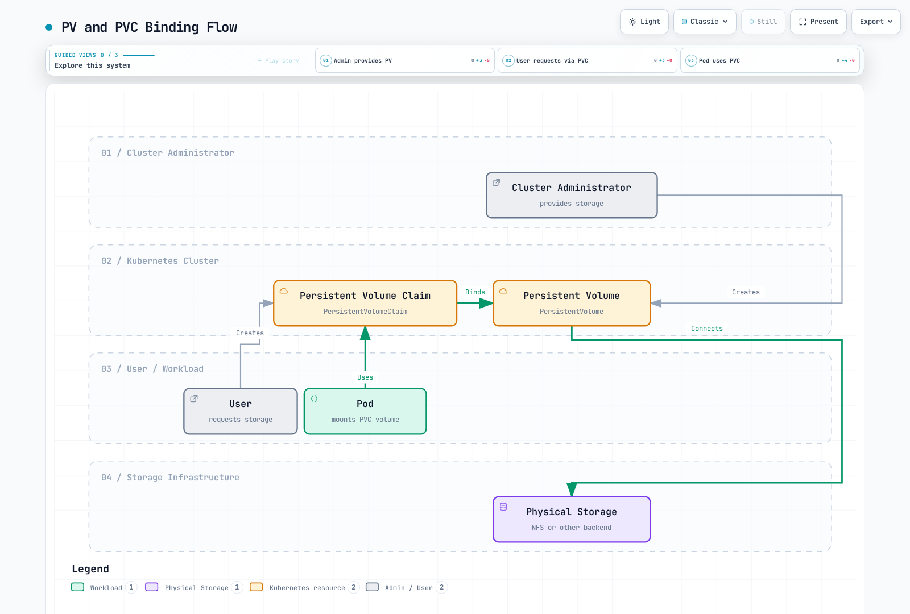

# ストレージ

> **対応バージョン**: Kubernetes 1.32, 1.33, 1.34
> **最終更新**: February 19, 2026

Kubernetes では、ストレージはコンテナ化アプリケーションのデータを保存・管理するうえで重要な要素です。この章では、Volumes、Persistent Volumes、Persistent Volume Claims、Storage Classes を含む Kubernetes のストレージ概念を詳しく説明します。

## ラボ環境のセットアップ

このドキュメントの例に従うには、次のツールと環境が必要です。

### 必要なツール
- kubectl v1.34 以降
- 動作する Kubernetes クラスター（EKS、minikube、kind など）
- ストレージプロビジョナー（EKS 用の EBS CSI driver）

### ストレージ例のセットアップ

```bash
# Create namespace
kubectl create namespace storage-demo

# Create a simple PVC and Pod
kubectl -n storage-demo apply -f - <<EOF
apiVersion: v1
kind: PersistentVolumeClaim
metadata:
  name: data-pvc
spec:
  accessModes:
    - ReadWriteOnce
  resources:
    requests:
      storage: 1Gi
---
apiVersion: v1
kind: Pod
metadata:
  name: data-pod
spec:
  containers:
  - name: data-container
    image: busybox
    command: ["sh", "-c", "while true; do echo \$(date) >> /data/output.txt; sleep 5; done"]
    volumeMounts:
    - name: data-volume
      mountPath: /data
  volumes:
  - name: data-volume
    persistentVolumeClaim:
      claimName: data-pvc
EOF

# Check storage resources
kubectl -n storage-demo get pvc,pod
```

## 目次

1. [Volumes](#volumes)
2. [Persistent Volumes](#persistent-volumes)
3. [Persistent Volume Claims](#persistent-volume-claims)
4. [Storage Classes](#storage-classes)
5. [Dynamic Provisioning](#dynamic-provisioning)
6. [Volume Snapshots](#volume-snapshots)
7. [Volume Expansion](#volume-expansion)
8. [Projected Volumes](#projected-volumes)
9. [Generic Ephemeral Volumes](#generic-ephemeral-volumes)
10. [Block Volume Mode](#block-volume-mode)
11. [Volume Cloning](#volume-cloning)
12. [Storage ResourceQuota](#storage-resourcequota)
13. [Storage Options in EKS](#storage-options-in-eks)

## Volumes

> **重要な概念**: Kubernetes Volumes は、Pod 内のコンテナがデータを保存・共有できるディレクトリであり、コンテナが再起動してもデータを維持します。

Kubernetes Volumes は、Pod 内のコンテナがデータを保存・共有できるディレクトリです。Volumes は Pod のライフサイクルに紐付き、Pod が削除されると Volume も削除されます（一部の Volume タイプを除く）。

### Kubernetes ストレージアーキテクチャ


[🔍 インタラクティブな図を表示](https://www.atomai.click/kubernetes-docs/archmaps/en-core-04-storage-0.html)

### Volumes が必要な理由

1. **コンテナ再起動時のデータ永続性**: コンテナが再起動するとファイルシステムはリセットされますが、Volumes を使用するとデータを永続化できます。
2. **コンテナ間のデータ共有**: 同じ Pod 内の複数のコンテナは Volumes を介してデータを共有できます。

### 主な Volume タイプの比較

| Volume タイプ | ライフサイクル | データの永続性 | ユースケース | 特徴 |
|------------|----------|-----------------|----------|----------|
| **emptyDir** | Pod | 一時的 | 一時データ、キャッシュ、チェックポイント | Pod が削除されるとデータも削除される |
| **hostPath** | Node | Node レベル | Node ファイルシステムへのアクセス、モニタリング | セキュリティリスクあり - 注意して使用 |
| **configMap** | 設定 | 設定データ | アプリケーション設定 | 設定データを Volume としてマウント |
| **secret** | 設定 | 機密データ | 証明書、パスワード | 機密データを Volume としてマウント |
| **persistentVolumeClaim** | クラスター | 永続的 | データベース、ファイルストレージ | Pod の再起動や再スケジューリング後もデータが保持される |

### emptyDir

`emptyDir` Volume は Pod が Node に割り当てられたときに作成され、その Node 上で Pod が実行されている間は存続します。Pod が Node から削除されると、`emptyDir` 内のデータは完全に削除されます。

```yaml
apiVersion: v1
kind: Pod
metadata:
  name: test-pd
spec:
  containers:
  - image: nginx
    name: test-container
    volumeMounts:
    - mountPath: /cache
      name: cache-volume
  volumes:
  - name: cache-volume
    emptyDir: {}
```

### hostPath

`hostPath` Volume は Node のファイルシステムのファイルまたはディレクトリを Pod にマウントします。Node のファイルシステムにアクセスする必要がある Pods で役立ちますが、セキュリティリスクがあるため注意して使用する必要があります。

```yaml
apiVersion: v1
kind: Pod
metadata:
  name: test-hostpath
spec:
  containers:
  - image: nginx
    name: test-container
    volumeMounts:
    - mountPath: /test-pd
      name: test-volume
  volumes:
  - name: test-volume
    hostPath:
      path: /data
      type: Directory  # DirectoryOrCreate, Directory, FileOrCreate, File, Socket, CharDevice, BlockDevice
```

```yaml
apiVersion: v1
kind: Pod
metadata:
  name: test-pd
spec:
  containers:
  - image: nginx
    name: test-container
    volumeMounts:
    - mountPath: /test-pd
      name: test-volume
  volumes:
  - name: test-volume
    hostPath:
      path: /data
      type: Directory
```

#### configMap

`configMap` Volume は ConfigMap データを Pod にマウントします。ConfigMaps は設定データをキーと値のペアとして保存するために使用されます。

```yaml
apiVersion: v1
kind: Pod
metadata:
  name: configmap-pod
spec:
  containers:
  - name: test
    image: busybox
    volumeMounts:
    - name: config-vol
      mountPath: /etc/config
  volumes:
  - name: config-vol
    configMap:
      name: log-config
      items:
      - key: log_level
        path: log_level
```

#### secret

`secret` Volume は Secret データを Pod にマウントします。Secrets はパスワード、トークン、キーなどの機密情報を保存するために使用されます。

```yaml
apiVersion: v1
kind: Pod
metadata:
  name: secret-pod
spec:
  containers:
  - name: test
    image: busybox
    volumeMounts:
    - name: secret-vol
      mountPath: /etc/secret
      readOnly: true
  volumes:
  - name: secret-vol
    secret:
      secretName: mysecret
      items:
      - key: username
        path: my-username
```

#### nfs

`nfs` Volume は既存の NFS（Network File System）共有を Pod にマウントします。

```yaml
apiVersion: v1
kind: Pod
metadata:
  name: nfs-pod
spec:
  containers:
  - name: test
    image: busybox
    volumeMounts:
    - name: nfs-vol
      mountPath: /mnt/nfs
  volumes:
  - name: nfs-vol
    nfs:
      server: nfs-server.example.com
      path: /share
```

#### persistentVolumeClaim

`persistentVolumeClaim` Volume は PersistentVolumeClaim を Pod にマウントします。これは最もよく使用される Volume タイプの一つです。

```yaml
apiVersion: v1
kind: Pod
metadata:
  name: pvc-pod
spec:
  containers:
  - name: test
    image: busybox
    volumeMounts:
    - name: pvc-vol
      mountPath: /mnt/pvc
  volumes:
  - name: pvc-vol
    persistentVolumeClaim:
      claimName: my-pvc
```

#### CSI (Container Storage Interface)

CSI Volumes は Kubernetes と外部ストレージシステムの間に標準インターフェイスを提供します。CSI を使用すると、ストレージベンダーは Kubernetes コードを変更せずに独自のストレージドライバーを開発できます。

```yaml
apiVersion: v1
kind: Pod
metadata:
  name: csi-pod
spec:
  containers:
  - name: test
    image: busybox
    volumeMounts:
    - name: csi-vol
      mountPath: /mnt/csi
  volumes:
  - name: csi-vol
    csi:
      driver: csi-driver.example.com
      volumeAttributes:
        foo: bar
      nodePublishSecretRef:
        name: csi-secret
```

## Persistent Volumes

Persistent Volume（PV）は、管理者がプロビジョニングする、または Storage Class を使用して動的にプロビジョニングされるクラスターのストレージです。PVs は Pods から独立したライフサイクルを持ち、Pods が削除されても保持されます。



[🔍 インタラクティブな図を表示](https://www.atomai.click/kubernetes-docs/archmaps/en-core-04-storage-1.html)

### PV の作成

```yaml
apiVersion: v1
kind: PersistentVolume
metadata:
  name: pv0001
spec:
  capacity:
    storage: 5Gi
  volumeMode: Filesystem
  accessModes:
    - ReadWriteOnce
  persistentVolumeReclaimPolicy: Recycle
  storageClassName: slow
  mountOptions:
    - hard
    - nfsvers=4.1
  nfs:
    path: /tmp
    server: 172.17.0.2
```

### PV アクセスモード

PVs は次のアクセスモードをサポートします。

- **ReadWriteOnce (RWO)**: Volume を単一の Node が読み取り・書き込み用にマウントできます。
- **ReadOnlyMany (ROX)**: Volume を複数の Nodes が読み取り専用でマウントできます。
- **ReadWriteMany (RWX)**: Volume を複数の Nodes が読み取り・書き込み用にマウントできます。
- **ReadWriteOncePod (RWOP)**: Volume を単一の Pod が読み取り・書き込み用にマウントできます（Kubernetes 1.22 以降）。

### PV 再利用ポリシー

PVs には次の再利用ポリシーを設定できます。

- **Retain**: PVC が削除されても、PV とデータは保持されます。管理者が手動でクリーンアップする必要があります。
- **Delete**: PVC が削除されると、PV と外部ストレージアセットが自動的に削除されます。
- **Recycle**: PVC が削除されると、PV 内のデータが削除され、PV が再度利用可能になります（非推奨）。

### PV ステータス

PVs には次のステータスがあります。

- **Available**: Claim にまだバインドされていない利用可能なリソース。
- **Bound**: Claim にバインド済み。
- **Released**: Claim は削除されたものの、リソースはまだクラスターによって再利用されていない状態。
- **Failed**: 自動再利用に失敗。

## Persistent Volume Claims

Persistent Volume Claim（PVC）はユーザーによるストレージ要求です。PVCs は PVs に似ていますが、PVCs はユーザーがストレージを要求する方法であり、PVs は管理者がストレージを提供する方法です。

### PVC の作成

```yaml
apiVersion: v1
kind: PersistentVolumeClaim
metadata:
  name: myclaim
spec:
  accessModes:
    - ReadWriteOnce
  volumeMode: Filesystem
  resources:
    requests:
      storage: 8Gi
  storageClassName: slow
  selector:
    matchLabels:
      release: "stable"
    matchExpressions:
      - {key: environment, operator: In, values: [dev]}
```

### PVC と PV のバインド

PVC が作成されると、Kubernetes は PVC の要件（ストレージサイズ、アクセスモード、ストレージクラス、セレクターなど）を満たす PV を見つけてバインドします。適切な PV が存在しない場合、PVC は Pending 状態のままになります。

### PVC の使用

PVCs は Pods 内の Volumes として使用できます。

```yaml
apiVersion: v1
kind: Pod
metadata:
  name: mypod
spec:
  containers:
    - name: myfrontend
      image: nginx
      volumeMounts:
      - mountPath: "/var/www/html"
        name: mypd
  volumes:
    - name: mypd
      persistentVolumeClaim:
        claimName: myclaim
```

## Storage Classes

Storage Classes は、管理者が提供するストレージの「クラス」を記述します。Storage Classes は PVs を動的にプロビジョニングするために使用されます。


[🔍 インタラクティブな図を表示](https://www.atomai.click/kubernetes-docs/archmaps/en-core-04-storage-2.html)

### Storage Class の作成

```yaml
apiVersion: storage.k8s.io/v1
kind: StorageClass
metadata:
  name: standard
provisioner: kubernetes.io/aws-ebs
parameters:
  type: gp3
  fsType: ext4
reclaimPolicy: Delete
allowVolumeExpansion: true
volumeBindingMode: WaitForFirstConsumer
```

この例では、AWS EBS gp3 Volumes をプロビジョニングするストレージクラスを作成します。

### Provisioners

ストレージクラスでは、Volumes のプロビジョニングに使用する Provisioner を指定します。一般的な Provisioners には次のものがあります。

- `kubernetes.io/aws-ebs`: AWS EBS Volumes
- `kubernetes.io/gce-pd`: GCE Persistent Disks
- `kubernetes.io/azure-disk`: Azure Disks
- `kubernetes.io/azure-file`: Azure File
- `kubernetes.io/cinder`: OpenStack Cinder Volumes
- `kubernetes.io/glusterfs`: GlusterFS Volumes
- `kubernetes.io/rbd`: Ceph RBD Volumes
- `kubernetes.io/nfs`: NFS Volumes

### Volume バインドモード

ストレージクラスは次の Volume バインドモードをサポートします。

- **Immediate**: デフォルトです。PVC が作成されるとすぐに Volumes がプロビジョニングされます。
- **WaitForFirstConsumer**: Pod が PVC を使用しようとするまで Volume のプロビジョニングを遅延させます。Volumes が Pods と同じ Zone にプロビジョニングされることを確実にするのに役立ちます。

### デフォルト Storage Class

クラスターにはデフォルトのストレージクラスを設定できます。PVC でストレージクラスが指定されていない場合、デフォルトのストレージクラスが使用されます。

```yaml
apiVersion: storage.k8s.io/v1
kind: StorageClass
metadata:
  name: standard
  annotations:
    storageclass.kubernetes.io/is-default-class: "true"
provisioner: kubernetes.io/aws-ebs
parameters:
  type: gp3
```

## Dynamic Provisioning

Dynamic Provisioning は、PVCs の作成時に PVs を自動的に作成する機能です。これにより、管理者が事前に PVs を作成しなくても、ユーザーは必要なときにストレージを要求できます。

### Dynamic Provisioning の例

1. Storage Class を作成します。

```yaml
apiVersion: storage.k8s.io/v1
kind: StorageClass
metadata:
  name: fast
provisioner: kubernetes.io/aws-ebs
parameters:
  type: gp3
  iopsPerGB: "10"
```

2. PVC を作成します。

```yaml
apiVersion: v1
kind: PersistentVolumeClaim
metadata:
  name: myclaim
spec:
  accessModes:
    - ReadWriteOnce
  resources:
    requests:
      storage: 100Gi
  storageClassName: fast
```

3. Pod で PVC を使用します。

```yaml
apiVersion: v1
kind: Pod
metadata:
  name: mypod
spec:
  containers:
    - name: myfrontend
      image: nginx
      volumeMounts:
      - mountPath: "/var/www/html"
        name: mypd
  volumes:
    - name: mypd
      persistentVolumeClaim:
        claimName: myclaim
```

## Volume Snapshots

Kubernetes は PVs の特定時点のコピーを作成する Volume Snapshots をサポートしています。これはバックアップおよび復元のシナリオで役立ちます。


[🔍 インタラクティブな図を表示](https://www.atomai.click/kubernetes-docs/archmaps/en-core-04-storage-3.html)

### Volume Snapshot Class

```yaml
apiVersion: snapshot.storage.k8s.io/v1
kind: VolumeSnapshotClass
metadata:
  name: csi-hostpath-snapclass
driver: hostpath.csi.k8s.io
deletionPolicy: Delete
```

### Volume Snapshot の作成

```yaml
apiVersion: snapshot.storage.k8s.io/v1
kind: VolumeSnapshot
metadata:
  name: new-snapshot
spec:
  volumeSnapshotClassName: csi-hostpath-snapclass
  source:
    persistentVolumeClaimName: myclaim
```

### Snapshot から PVC を作成

```yaml
apiVersion: v1
kind: PersistentVolumeClaim
metadata:
  name: restore-pvc
spec:
  storageClassName: csi-hostpath-sc
  dataSource:
    name: new-snapshot
    kind: VolumeSnapshot
    apiGroup: snapshot.storage.k8s.io
  accessModes:
    - ReadWriteOnce
  resources:
    requests:
      storage: 10Gi
```

## Volume Expansion

Kubernetes は PVCs のサイズを拡張する機能をサポートしています。このためには、ストレージクラスで `allowVolumeExpansion: true` を設定する必要があります。


[🔍 インタラクティブな図を表示](https://www.atomai.click/kubernetes-docs/archmaps/en-core-04-storage-4.html)

### PVC の拡張

```yaml
apiVersion: v1
kind: PersistentVolumeClaim
metadata:
  name: myclaim
spec:
  accessModes:
    - ReadWriteOnce
  resources:
    requests:
      storage: 16Gi  # Expanded from original 8Gi to 16Gi
  storageClassName: standard
```

## Projected Volumes

Projected Volumes を使用すると、複数の Volume ソースを単一の Volume マウントに結合できます。これは、secrets、configMaps、downwardAPI、serviceAccountToken を単一のディレクトリで公開する必要がある場合に役立ちます。

### サポートされるソース

- **secret**: Secret データをマウント
- **configMap**: 設定データをマウント
- **downwardAPI**: Pod およびコンテナのメタデータを公開
- **serviceAccountToken**: 有効期限を設定可能な Service Account トークンをマウント

### Projected Volume の例

```yaml
apiVersion: v1
kind: Pod
metadata:
  name: projected-volume-pod
spec:
  containers:
  - name: app
    image: busybox
    command: ["sh", "-c", "ls -la /etc/projected && sleep 3600"]
    volumeMounts:
    - name: all-in-one
      mountPath: /etc/projected
      readOnly: true
  volumes:
  - name: all-in-one
    projected:
      sources:
      - secret:
          name: db-credentials
          items:
          - key: username
            path: db/username
          - key: password
            path: db/password
      - configMap:
          name: app-config
          items:
          - key: config.yaml
            path: config/app.yaml
      - downwardAPI:
          items:
          - path: labels
            fieldRef:
              fieldPath: metadata.labels
          - path: cpu-request
            resourceFieldRef:
              containerName: app
              resource: requests.cpu
      - serviceAccountToken:
          path: token
          expirationSeconds: 3600
          audience: api
```

この設定では、以下を含む単一の Volume を `/etc/projected` に作成します。
- secret からの `/etc/projected/db/username` および `/etc/projected/db/password`
- configMap からの `/etc/projected/config/app.yaml`
- downwardAPI からの `/etc/projected/labels` および `/etc/projected/cpu-request`
- 自動ローテーションされる Service Account トークンを含む `/etc/projected/token`

### Service Account トークンの Projected Volume

Service Account トークンの Projected Volume は、有効期間と対象者が限定されたトークンを提供します。

```yaml
apiVersion: v1
kind: Pod
metadata:
  name: token-projected-pod
spec:
  serviceAccountName: my-service-account
  containers:
  - name: app
    image: myapp:latest
    volumeMounts:
    - name: token
      mountPath: /var/run/secrets/tokens
  volumes:
  - name: token
    projected:
      sources:
      - serviceAccountToken:
          path: api-token
          expirationSeconds: 7200  # 2 hours
          audience: my-api-service
```

## Generic Ephemeral Volumes

Generic Ephemeral Volumes は、Pod のライフサイクルに紐付いた PVC のようなストレージを提供します。emptyDir とは異なり、Dynamic Provisioning を含め、PVCs と StorageClasses のすべての機能を使用します。

### emptyDir との違い

| 機能 | emptyDir | Generic Ephemeral Volume |
|---------|----------|--------------------------|
| **ストレージバックエンド** | Node ローカルストレージまたはメモリ | 任意の CSI driver |
| **プロビジョニング** | 自動、シンプル | StorageClass、Dynamic Provisioning を使用 |
| **サイズ制限** | sizeLimit（ソフト） | 完全な PVC 容量管理 |
| **Snapshots** | 非対応 | 対応（CSI driver がサポートする場合） |
| **ストレージ機能** | 基本 | 完全な CSI 機能（暗号化、IOPS など） |
| **永続性** | Pod が削除されると失われる | Pod が削除されると失われる |

### Generic Ephemeral Volume の例

```yaml
apiVersion: v1
kind: Pod
metadata:
  name: ephemeral-volume-pod
spec:
  containers:
  - name: app
    image: busybox
    command: ["sh", "-c", "dd if=/dev/zero of=/scratch/data bs=1M count=100 && sleep 3600"]
    volumeMounts:
    - name: scratch
      mountPath: /scratch
  volumes:
  - name: scratch
    ephemeral:
      volumeClaimTemplate:
        metadata:
          labels:
            type: scratch-storage
        spec:
          accessModes:
          - ReadWriteOnce
          storageClassName: fast-ssd
          resources:
            requests:
              storage: 10Gi
```

### ユースケース

1. **CI/CD パイプライン**: ストレージ容量が保証された一時的なビルドアーティファクト
2. **データ処理**: 特定のパフォーマンス要件を持つスクラッチ領域
3. **テスト**: CSI 機能を備えた一時データベースまたはキャッシュ
4. **機械学習**: 高性能ストレージを備えた一時的なモデルチェックポイント

### Generic Ephemeral Volumes を使用した Deployment

```yaml
apiVersion: apps/v1
kind: Deployment
metadata:
  name: ml-training
spec:
  replicas: 3
  selector:
    matchLabels:
      app: ml-training
  template:
    metadata:
      labels:
        app: ml-training
    spec:
      containers:
      - name: trainer
        image: ml-trainer:latest
        volumeMounts:
        - name: checkpoint-storage
          mountPath: /checkpoints
      volumes:
      - name: checkpoint-storage
        ephemeral:
          volumeClaimTemplate:
            spec:
              accessModes:
              - ReadWriteOnce
              storageClassName: high-iops
              resources:
                requests:
                  storage: 50Gi
```

## Block Volume Mode

Kubernetes は、ファイルシステム Volumes に加えて raw Block Volumes をサポートします。Block Volumes は、ファイルシステムを介さない raw ブロックデバイスとしてストレージを提供し、独自のデータレイアウトを管理するアプリケーションで役立ちます。

### Filesystem と Block Mode

| 観点 | Filesystem（デフォルト） | Block |
|--------|---------------------|-------|
| **volumeMode** | `Filesystem` | `Block` |
| **マウントタイプ** | ディレクトリとしてマウント | デバイスファイルとして公開 |
| **ファイルシステム** | ext4、xfs など | なし（raw） |
| **Pod 内でのアクセス** | `/mnt/data/` | `/dev/xvda` |
| **ユースケース** | 一般的なアプリケーション | データベース、特殊なアプリケーション |

### Block Volume の PV と PVC

```yaml
# PersistentVolume with Block mode
apiVersion: v1
kind: PersistentVolume
metadata:
  name: block-pv
spec:
  capacity:
    storage: 100Gi
  volumeMode: Block
  accessModes:
  - ReadWriteOnce
  persistentVolumeReclaimPolicy: Retain
  storageClassName: block-storage
  csi:
    driver: ebs.csi.aws.com
    volumeHandle: vol-0123456789abcdef0
---
# PersistentVolumeClaim for Block volume
apiVersion: v1
kind: PersistentVolumeClaim
metadata:
  name: block-pvc
spec:
  volumeMode: Block
  accessModes:
  - ReadWriteOnce
  storageClassName: block-storage
  resources:
    requests:
      storage: 100Gi
```

### Pods で Block Volumes を使用する

```yaml
apiVersion: v1
kind: Pod
metadata:
  name: block-volume-pod
spec:
  containers:
  - name: database
    image: custom-database:latest
    volumeDevices:
    - name: data
      devicePath: /dev/xvda
  volumes:
  - name: data
    persistentVolumeClaim:
      claimName: block-pvc
```

注: Block Volumes では、`volumeMounts` と `mountPath` の代わりに `volumeDevices` と `devicePath` を使用します。

### Block Volumes のユースケース

1. **データベース**: raw ディスクアクセスの恩恵を受ける MySQL、PostgreSQL、MongoDB
2. **カスタムファイルシステム**: ZFS や LVM などの特殊なファイルシステムを使用するアプリケーション
3. **高性能ストレージ**: ファイルシステムのオーバーヘッドなしに直接 I/O を必要とするアプリケーション
4. **ストレージ仮想化**: ソフトウェア定義ストレージソリューション

## Volume Cloning

Volume Cloning は、既存の PVC の内容を持つ新しい PVC を作成します。これは、テスト環境の作成、データの複製、ワークロードの移行に役立ちます。

### 前提条件

- CSI driver が Volume Cloning をサポートしている必要があります
- ソースと宛先の PVCs は同じ Namespace 内に存在する必要があります
- ソースと宛先は同じ StorageClass を使用する必要があります
- ソースと宛先は同じ volumeMode を使用する必要があります

### PVC Cloning の例

```yaml
# Source PVC (existing)
apiVersion: v1
kind: PersistentVolumeClaim
metadata:
  name: source-pvc
  namespace: production
spec:
  accessModes:
  - ReadWriteOnce
  storageClassName: ebs-sc
  resources:
    requests:
      storage: 100Gi
---
# Clone PVC using dataSource
apiVersion: v1
kind: PersistentVolumeClaim
metadata:
  name: cloned-pvc
  namespace: production
spec:
  accessModes:
  - ReadWriteOnce
  storageClassName: ebs-sc
  resources:
    requests:
      storage: 100Gi  # Must be >= source size
  dataSource:
    kind: PersistentVolumeClaim
    name: source-pvc
```

### Cloning と Snapshots の比較

| 機能 | Volume Cloning | Volume Snapshots |
|---------|---------------|------------------|
| **結果** | データを持つ新しい PVC | Snapshot オブジェクト |
| **ユースケース** | 稼働中 Volume の複製 | 特定時点のバックアップ |
| **パフォーマンス** | 遅くなる場合がある（完全コピー） | 通常は高速（コピーオンライト） |
| **Namespace をまたぐ利用** | 不可 | 不可 |
| **ストレージオーバーヘッド** | 完全コピー | 増分 |

### テスト用の Clone

```yaml
apiVersion: v1
kind: PersistentVolumeClaim
metadata:
  name: test-db-clone
  namespace: staging
spec:
  accessModes:
  - ReadWriteOnce
  storageClassName: ebs-sc
  resources:
    requests:
      storage: 100Gi
  dataSource:
    kind: PersistentVolumeClaim
    name: production-db-pvc
---
apiVersion: v1
kind: Pod
metadata:
  name: test-database
  namespace: staging
spec:
  containers:
  - name: postgres
    image: postgres:15
    volumeMounts:
    - name: data
      mountPath: /var/lib/postgresql/data
  volumes:
  - name: data
    persistentVolumeClaim:
      claimName: test-db-clone
```

## Storage ResourceQuota

ResourceQuota は、PVCs の数やストレージ総容量を含め、Namespace 内のストレージ消費を制限できます。

### ストレージ関連の Quota フィールド

| フィールド | 説明 |
|-------|-------------|
| **persistentvolumeclaims** | 許可される PVCs の総数 |
| **requests.storage** | すべての PVCs の合計ストレージ容量 |
| **\<storage-class\>.storageclass.storage.k8s.io/requests.storage** | 特定の StorageClass のストレージ容量 |
| **\<storage-class\>.storageclass.storage.k8s.io/persistentvolumeclaims** | 特定の StorageClass の PVC 数 |

### ResourceQuota の例

```yaml
apiVersion: v1
kind: ResourceQuota
metadata:
  name: storage-quota
  namespace: team-a
spec:
  hard:
    # Total limits
    persistentvolumeclaims: "10"
    requests.storage: "500Gi"

    # Per-StorageClass limits
    ebs-sc.storageclass.storage.k8s.io/requests.storage: "200Gi"
    ebs-sc.storageclass.storage.k8s.io/persistentvolumeclaims: "5"

    efs-sc.storageclass.storage.k8s.io/requests.storage: "300Gi"
    efs-sc.storageclass.storage.k8s.io/persistentvolumeclaims: "5"
```

### ResourceQuota ステータスの確認

```bash
# View quota status
kubectl get resourcequota storage-quota -n team-a -o yaml

# Example output
status:
  hard:
    persistentvolumeclaims: "10"
    requests.storage: "500Gi"
  used:
    persistentvolumeclaims: "3"
    requests.storage: "150Gi"
```

### ストレージ用の LimitRange

LimitRange では、PVC ストレージ要求のデフォルト値と制限値を設定できます。

```yaml
apiVersion: v1
kind: LimitRange
metadata:
  name: storage-limits
  namespace: team-a
spec:
  limits:
  - type: PersistentVolumeClaim
    min:
      storage: 1Gi
    max:
      storage: 100Gi
    default:
      storage: 10Gi
```

これにより、次が保証されます。
- 最小 PVC サイズは 1Gi
- 最大 PVC サイズは 100Gi
- デフォルトサイズ（未指定の場合）は 10Gi

## EKS のストレージオプション

Amazon EKS ではさまざまなストレージオプションを利用できます。各オプションには異なるユースケースとパフォーマンス特性があるため、アプリケーションの要件に合ったストレージを選択することが重要です。


[🔍 インタラクティブな図を表示](https://www.atomai.click/kubernetes-docs/archmaps/en-core-04-storage-5.html)

### Amazon EBS

Amazon EBS（Elastic Block Store）は、EC2 インスタンスにアタッチできるブロックストレージ Volumes を提供します。EKS では EBS CSI driver を使用して EBS Volumes を Kubernetes Pods にマウントできます。

#### EBS CSI Driver のインストール

```bash
kubectl apply -k "github.com/kubernetes-sigs/aws-ebs-csi-driver/deploy/kubernetes/overlays/stable/?ref=master"
```

#### EBS Storage Class

```yaml
apiVersion: storage.k8s.io/v1
kind: StorageClass
metadata:
  name: ebs-sc
provisioner: ebs.csi.aws.com
parameters:
  type: gp3
  fsType: ext4
  encrypted: "true"
volumeBindingMode: WaitForFirstConsumer
```

#### EBS Volume タイプ

Amazon EBS にはさまざまな Volume タイプがあります。

1. **gp3**: ほとんどのワークロードに適した汎用 SSD Volumes。ベースラインで 3,000 IOPS と 125MB/s のスループットを提供し、追加料金で最大 16,000 IOPS および 1,000MB/s まで拡張できます。

2. **io2**: 高 IOPS を必要とするワークロードに適した高性能 SSD Volumes。GiB あたり最大 500 IOPS を提供し、最大 64,000 IOPS まで拡張できます。

3. **st1**: ビッグデータ、データウェアハウス、ログ処理など、スループット集約型ワークロードに適したスループット最適化 HDD Volumes。

4. **sc1**: アクセス頻度の低いデータに適したコールド HDD Volumes。

#### EBS Storage Class の例（gp3）

```yaml
apiVersion: storage.k8s.io/v1
kind: StorageClass
metadata:
  name: ebs-gp3
provisioner: ebs.csi.aws.com
parameters:
  type: gp3
  iops: "3000"
  throughput: "125"
  encrypted: "true"
  kmsKeyId: "arn:aws:kms:us-west-2:111122223333:key/1234abcd-12ab-34cd-56ef-1234567890ab"
volumeBindingMode: WaitForFirstConsumer
```

#### EBS Storage Class の例（io2）

```yaml
apiVersion: storage.k8s.io/v1
kind: StorageClass
metadata:
  name: ebs-io2
provisioner: ebs.csi.aws.com
parameters:
  type: io2
  iops: "10000"
  encrypted: "true"
volumeBindingMode: WaitForFirstConsumer
```

### Amazon EFS

Amazon EFS（Elastic File System）は、複数の EC2 インスタンスから同時にアクセスできるスケーラブルなファイルストレージを提供します。EFS は ReadWriteMany アクセスモードをサポートするため、複数の Pods が同じ Volume を共有する必要がある場合に役立ちます。

#### EFS CSI Driver のインストール

```bash
kubectl apply -k "github.com/kubernetes-sigs/aws-efs-csi-driver/deploy/kubernetes/overlays/stable/?ref=master"
```

#### EFS File System の作成

EFS File System を作成するには、AWS Management Console、AWS CLI、または AWS CloudFormation を使用できます。

AWS CLI の例:

```bash
# Create EFS file system
aws efs create-file-system \
  --creation-token eks-efs \
  --performance-mode generalPurpose \
  --throughput-mode bursting \
  --tags Key=Name,Value=EKS-EFS

# Store file system ID
FS_ID=$(aws efs describe-file-systems \
  --creation-token eks-efs \
  --query "FileSystems[0].FileSystemId" \
  --output text)

# Create mount target (for each subnet)
aws efs create-mount-target \
  --file-system-id $FS_ID \
  --subnet-id subnet-0eabfaa81fb22bcaf \
  --security-groups sg-068000ccf82dfba88
```

#### EFS Storage Class

```yaml
apiVersion: storage.k8s.io/v1
kind: StorageClass
metadata:
  name: efs-sc
provisioner: efs.csi.aws.com
parameters:
  provisioningMode: efs-ap
  fileSystemId: fs-1234abcd
  directoryPerms: "700"
```

#### PV と PVC を使用する EFS Access Point

```yaml
# Persistent Volume
apiVersion: v1
kind: PersistentVolume
metadata:
  name: efs-pv
spec:
  capacity:
    storage: 5Gi
  volumeMode: Filesystem
  accessModes:
    - ReadWriteMany
  persistentVolumeReclaimPolicy: Retain
  storageClassName: efs-sc
  csi:
    driver: efs.csi.aws.com
    volumeHandle: fs-1234abcd::fsap-0123456789abcdef

# Persistent Volume Claim
apiVersion: v1
kind: PersistentVolumeClaim
metadata:
  name: efs-pvc
spec:
  accessModes:
    - ReadWriteMany
  storageClassName: efs-sc
  resources:
    requests:
      storage: 5Gi
```

#### EFS パフォーマンスモード

EFS には 2 つのパフォーマンスモードがあります。

1. **General Purpose**: ほとんどの File System ワークロードに推奨されるデフォルトモードです。低レイテンシーを提供します。

2. **Max I/O**: 高スループットと並列処理を必要とするワークロードに適しています。レイテンシーはわずかに高くなりますが、より高いスループットを提供します。

#### EFS スループットモード

EFS には 3 つのスループットモードがあります。

1. **Bursting**: File System サイズに基づいてベーススループットが割り当てられ、バーストクレジットにより一時的に高いスループットが提供されます。

2. **Provisioned**: File System サイズに関係なく、指定したスループットを提供します。

3. **Elastic**: ワークロードに基づいてスループットを自動的にスケールアップ・スケールダウンします。

### Amazon FSx for Lustre

Amazon FSx for Lustre は、高性能コンピューティングワークロード向けの高性能 File Systems を提供します。FSx for Lustre は、大規模なデータ処理、機械学習、分析ワークロードに適しています。

#### FSx for Lustre CSI Driver のインストール

```bash
kubectl apply -k "github.com/kubernetes-sigs/aws-fsx-csi-driver/deploy/kubernetes/overlays/stable/?ref=master"
```

#### FSx for Lustre File System の作成

AWS CLI の例:

```bash
aws fsx create-file-system \
  --file-system-type LUSTRE \
  --storage-capacity 1200 \
  --subnet-ids subnet-0eabfaa81fb22bcaf \
  --lustre-configuration DeploymentType=SCRATCH_2,PerUnitStorageThroughput=200
```

#### FSx for Lustre Storage Class

```yaml
apiVersion: storage.k8s.io/v1
kind: StorageClass
metadata:
  name: fsx-sc
provisioner: fsx.csi.aws.com
parameters:
  subnetId: subnet-0eabfaa81fb22bcaf
  securityGroupIds: sg-068000ccf82dfba88
  deploymentType: SCRATCH_2
  automaticBackupRetentionDays: "0"
  dailyAutomaticBackupStartTime: "00:00"
  copyTagsToBackups: "false"
  perUnitStorageThroughput: "200"
  dataCompressionType: "NONE"
  weeklyMaintenanceStartTime: "7:09:00"
```

#### FSx for Lustre デプロイメントタイプ

FSx for Lustre には 3 つのデプロイメントタイプがあります。

1. **SCRATCH_1**: 一時ストレージおよび短期処理向けの最も安価なオプションです。データレプリケーションがないため、耐久性は低くなります。

2. **SCRATCH_2**: SCRATCH_1 より高いバーストスループットを提供し、サーバー障害時にはデータを自動的に復旧します。

3. **PERSISTENT**: 長期ストレージとスループットを必要とするワークロードに適しています。データレプリケーションと自動復旧を提供します。

#### FSx for Lustre のストレージ容量とスループット

FSx for Lustre のストレージ容量とスループットは次のように設定されます。

- **ストレージ容量**: 最小 1.2 TiB から開始し、2.4 TiB 単位で増加します。
- **スループット**: デプロイメントタイプとストレージ容量によって決まります。
  - SCRATCH_2: ストレージ 1 TiB あたり 200 MB/s または 1,000 MB/s
  - PERSISTENT: ストレージ 1 TiB あたり 50 MB/s、100 MB/s、または 200 MB/s

### vLLM ワークロード向け FSx for Lustre 構成

vLLM（Vector Language Model）のような大規模 AI モデルワークロードには、高スループットかつ低レイテンシーのストレージが必要です。FSx for Lustre は、これらの要件を満たす理想的なソリューションです。

#### vLLM 用 FSx for Lustre Storage Class

```yaml
apiVersion: storage.k8s.io/v1
kind: StorageClass
metadata:
  name: fsx-lustre-vllm
provisioner: fsx.csi.aws.com
parameters:
  subnetId: subnet-0eabfaa81fb22bcaf
  securityGroupIds: sg-068000ccf82dfba88
  deploymentType: PERSISTENT_1
  perUnitStorageThroughput: "200"
  dataCompressionType: "NONE"
  storageCapacity: "4800"  # 4.8 TiB
reclaimPolicy: Retain
volumeBindingMode: Immediate
```

#### vLLM ワークロード用 PVC

```yaml
apiVersion: v1
kind: PersistentVolumeClaim
metadata:
  name: vllm-model-storage
spec:
  accessModes:
    - ReadWriteMany
  resources:
    requests:
      storage: 4800Gi
  storageClassName: fsx-lustre-vllm
```

#### vLLM Deployment の例

```yaml
apiVersion: apps/v1
kind: Deployment
metadata:
  name: vllm-inference
spec:
  replicas: 1
  selector:
    matchLabels:
      app: vllm-inference
  template:
    metadata:
      labels:
        app: vllm-inference
    spec:
      nodeSelector:
        node.kubernetes.io/instance-type: g5.12xlarge
      containers:
      - name: vllm
        image: vllm-inference:latest
        resources:
          limits:
            nvidia.com/gpu: 4
          requests:
            nvidia.com/gpu: 4
            memory: "64Gi"
            cpu: "32"
        volumeMounts:
        - name: model-storage
          mountPath: /models
      volumes:
      - name: model-storage
        persistentVolumeClaim:
          claimName: vllm-model-storage
```

#### vLLM パフォーマンス最適化のヒント

1. **適切なスループットの選択**: vLLM ワークロードでは、TiB あたり少なくとも 200 MB/s のスループットを選択することを推奨します。

2. **ストレージ容量の最適化**: モデルサイズとデータセットサイズを考慮して、十分なストレージ容量を割り当てます。

3. **ネットワークの最適化**: FSx for Lustre File System と EKS Nodes が同じ Availability Zone にあることを確認します。

4. **インスタンスタイプの選択**: vLLM ワークロードのパフォーマンスを最適化するため、GPU インスタンス（例: g5.12xlarge）を使用します。

5. **メモリ構成**: モデルサイズに基づいて十分なメモリを割り当てます。

6. **File System マウントオプション**: 最適なパフォーマンスのため、適切なマウントオプションを使用します。

   ```bash
   mount -t lustre -o noatime,flock fs-1234abcd.fsx.us-west-2.amazonaws.com@tcp:/fsx /mnt/fsx
   ```

### ストレージオプションの比較

| ストレージオプション | アクセスモード | ユースケース | パフォーマンス | コスト | スケーラビリティ |
|---------------|-------------|----------|-------------|------|-------------|
| Amazon EBS | ReadWriteOnce | 単一 Pod 向けブロックストレージ | 中～高 | 中 | 限定的（単一 Node） |
| Amazon EFS | ReadWriteMany | 複数 Pods で共有するファイルストレージ | 中 | 中～高 | 高（複数 Nodes） |
| Amazon FSx for Lustre | ReadWriteMany | HPC、ML、分析 | 非常に高い | 高 | 非常に高い（並列アクセス） |

### EKS ストレージ選択ガイド

1. **単一 Pod 用のブロックストレージが必要な場合**: Amazon EBS
   - データベース
   - Stateful アプリケーション
   - 単一 Node で実行されるワークロード

2. **複数 Pods で共有するファイルストレージが必要な場合**: Amazon EFS
   - Web サーバーコンテンツ
   - 共有設定ファイル
   - 中規模データ処理

3. **高性能ファイルストレージが必要な場合**: Amazon FSx for Lustre
   - 大規模データ処理
   - 機械学習および AI ワークロード（vLLM など）
   - 高性能コンピューティング（HPC）
   - ビッグデータ分析

## まとめ

この章では、Kubernetes のストレージ概念について学びました。Volumes は Pod 内のコンテナがデータを保存・共有する手段を提供し、Persistent Volumes と Persistent Volume Claims は Pods から独立したライフサイクルを持つストレージを提供します。Storage Classes により、ユーザーは Dynamic Provisioning を通じて必要なときにストレージを要求できます。

EKS では Amazon EBS、Amazon EFS、Amazon FSx for Lustre などのさまざまなストレージオプションを利用でき、それぞれユースケースとパフォーマンス特性が異なります。vLLM のような大規模 AI モデルワークロードには、高スループットと低レイテンシーを備えた FSx for Lustre が理想的な選択肢です。FSx for Lustre は、複数の Nodes から同時にデータへアクセスできる並列ファイルシステムであり、大規模モデルのトレーニングおよび推論タスクに適しています。

アプリケーションの要件に適したストレージオプションを選択することが重要です。単一 Pod 用のブロックストレージが必要な場合は Amazon EBS、複数 Pods で共有するファイルストレージが必要な場合は Amazon EFS、高性能ファイルストレージが必要な場合は Amazon FSx for Lustre を選択してください。

次の章では、Kubernetes の設定と Secrets について学びます。

## クイズ

この章で学んだ内容を確認するには、[ストレージクイズ](../quizzes/core/04-storage-quiz.md)に挑戦してください。

## 参考資料

- [Kubernetes 公式ドキュメント - Volumes](https://kubernetes.io/docs/concepts/storage/volumes/)
- [Kubernetes 公式ドキュメント - Persistent Volumes](https://kubernetes.io/docs/concepts/storage/persistent-volumes/)
- [Kubernetes 公式ドキュメント - Storage Classes](https://kubernetes.io/docs/concepts/storage/storage-classes/)
- [Kubernetes 公式ドキュメント - Volume Snapshots](https://kubernetes.io/docs/concepts/storage/volume-snapshots/)
- [AWS EBS CSI Driver](https://github.com/kubernetes-sigs/aws-ebs-csi-driver)
- [AWS EFS CSI Driver](https://github.com/kubernetes-sigs/aws-efs-csi-driver)
- [AWS FSx for Lustre CSI Driver](https://github.com/kubernetes-sigs/aws-fsx-csi-driver)
- [AWS ブログ - LLM 推論ワークロードのスケーリング: Amazon EKS での TensorRT-LLM と Triton を使用したマルチノードデプロイメント](https://aws.amazon.com/ko/blogs/hpc/scaling-your-llm-inference-workloads-multi-node-deployment-with-tensorrt-llm-and-triton-on-amazon-eks/)
- [AWS ワークショップ - GenAI FSx EKS](https://catalog.workshops.aws/genaifsxeks/en-US/200-module2-genai/210-deploy)
