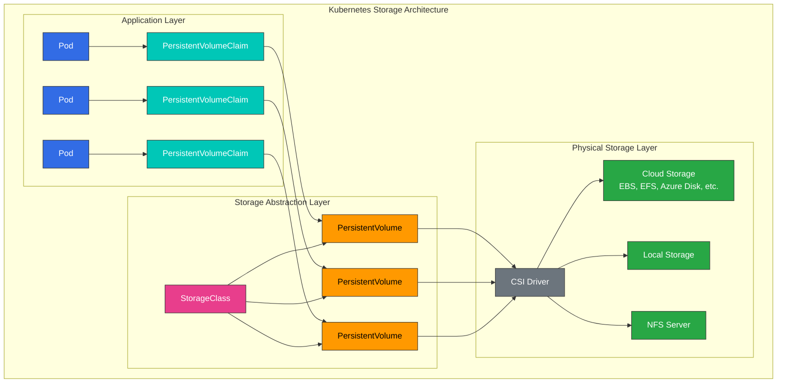
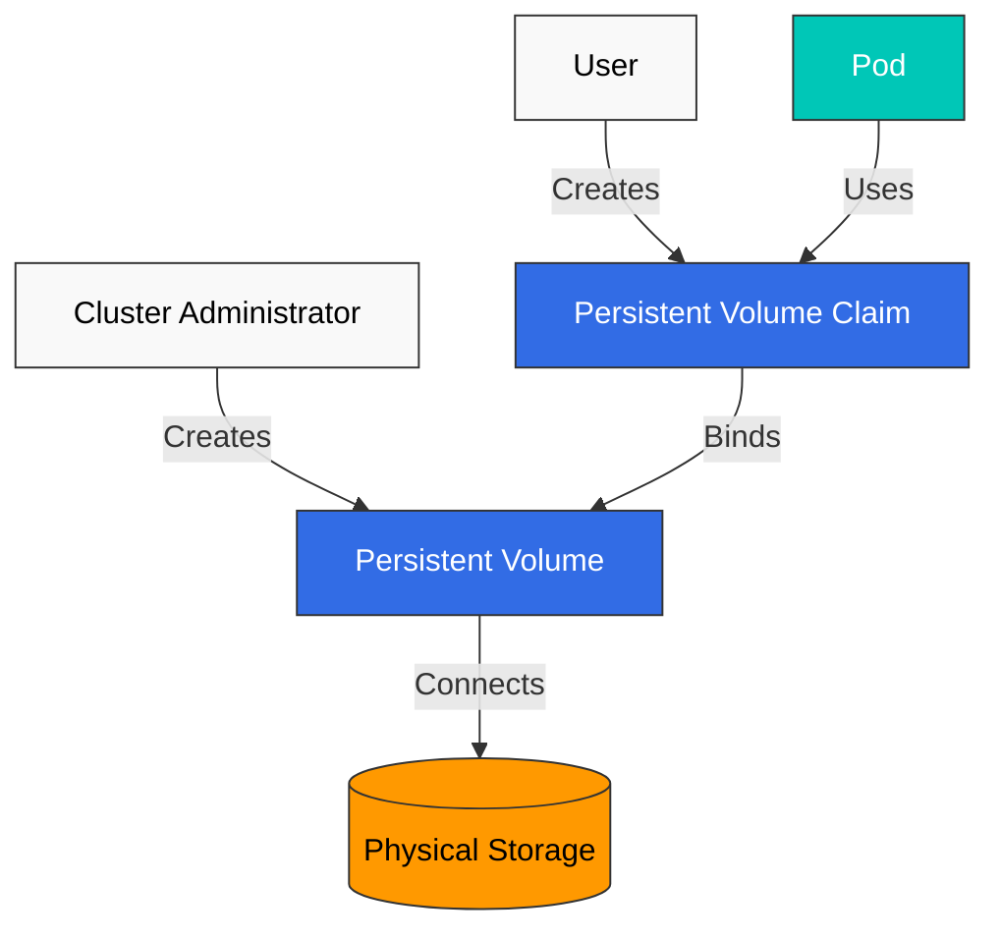
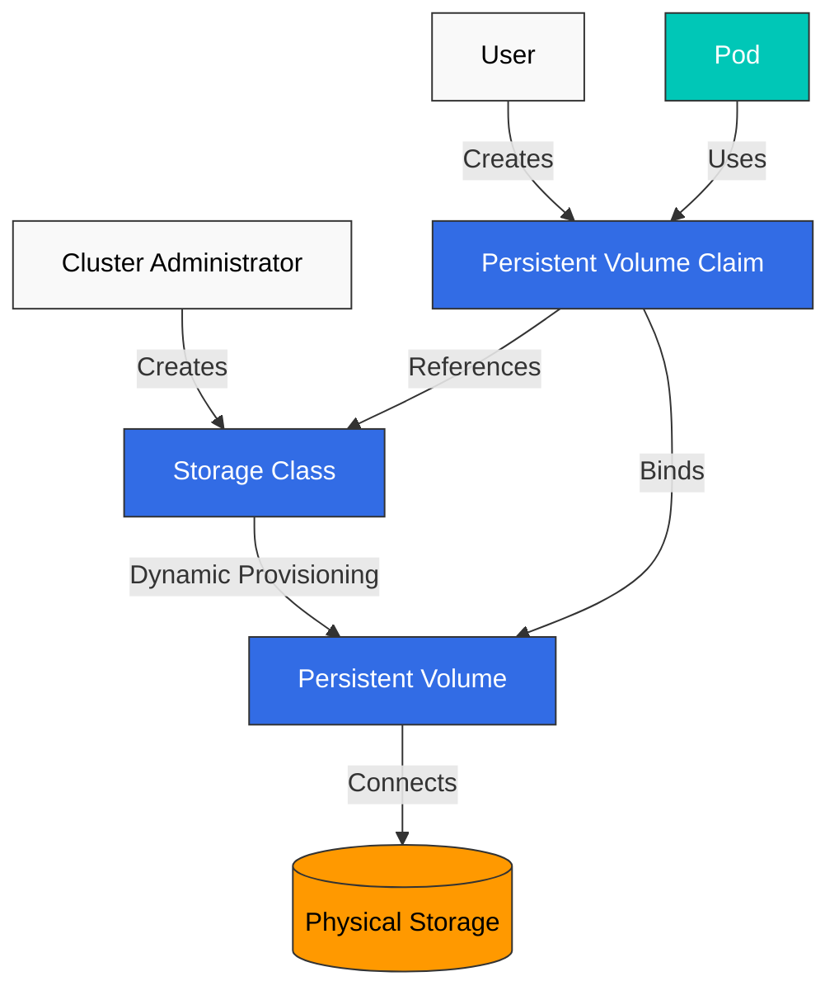
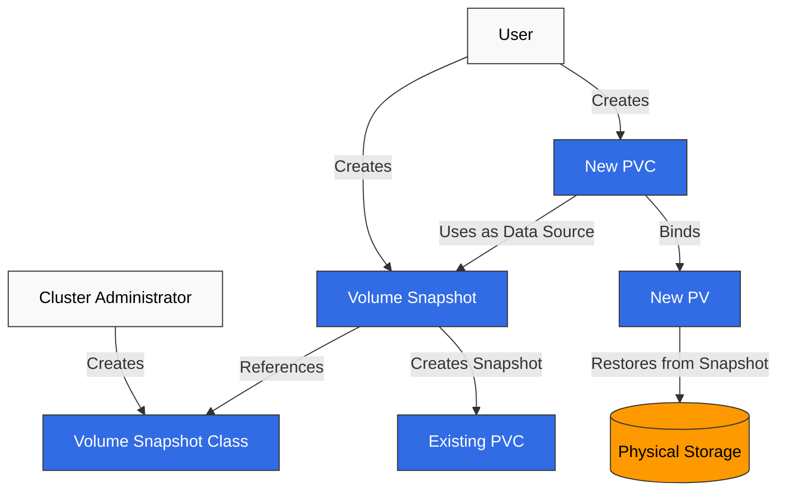
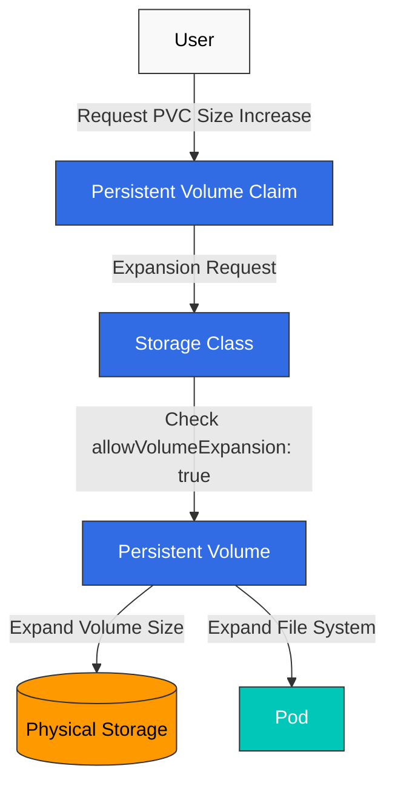
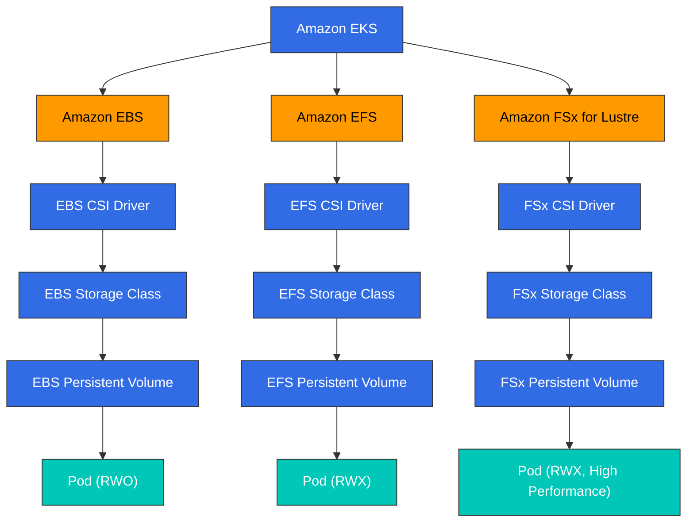

# Storage

> **Supported Versions**: Kubernetes 1.32, 1.33, 1.34
> **最終更新**: February 19, 2026

Kubernetes において、storage（ストレージ）は containerized applications のデータを保存および管理するための重要な要素です。この章では、Volumes、Persistent Volumes、Persistent Volume Claims、Storage Classes など、Kubernetes storage の概念を詳しく見ていきます。

## Lab Environment Setup

このドキュメントの例を試すには、次のツールと環境が必要です。

### Required Tools
- kubectl v1.34 以上
- 稼働中の Kubernetes cluster（EKS、minikube、kind など）
- Storage provisioner（EKS では EBS CSI driver）

### Storage Example Setup

```bash
# Create namespace
kubectl create namespace storage-demo

# Create a simple PVC and Pod
kubectl -n storage-demo apply -f - <<EOF
apiVersion: v1
kind: PersistentVolumeClaim
metadata:
  name: data-pvc
spec:
  accessModes:
    - ReadWriteOnce
  resources:
    requests:
      storage: 1Gi
---
apiVersion: v1
kind: Pod
metadata:
  name: data-pod
spec:
  containers:
  - name: data-container
    image: busybox
    command: ["sh", "-c", "while true; do echo \$(date) >> /data/output.txt; sleep 5; done"]
    volumeMounts:
    - name: data-volume
      mountPath: /data
  volumes:
  - name: data-volume
    persistentVolumeClaim:
      claimName: data-pvc
EOF

# Check storage resources
kubectl -n storage-demo get pvc,pod
```

## Table of Contents

1. [Volumes](#volumes)
2. [Persistent Volumes](#persistent-volumes)
3. [Persistent Volume Claims](#persistent-volume-claims)
4. [Storage Classes](#storage-classes)
5. [Dynamic Provisioning](#dynamic-provisioning)
6. [Volume Snapshots](#volume-snapshots)
7. [Volume Expansion](#volume-expansion)
8. [Projected Volumes](#projected-volumes)
9. [Generic Ephemeral Volumes](#generic-ephemeral-volumes)
10. [Block Volume Mode](#block-volume-mode)
11. [Volume Cloning](#volume-cloning)
12. [Storage ResourceQuota](#storage-resourcequota)
13. [Storage Options in EKS](#storage-options-in-eks)

## Volumes

> **Key Concept**: Kubernetes Volumes は、Pod 内の containers がデータを保存および共有できる directory であり、container の restart に関係なくデータを保持します。

Kubernetes Volumes は、Pod 内の containers がデータを保存および共有できる directory です。Volumes は Pod の lifecycle に結び付いており、Pod が削除されると volume も削除されます（一部の volume type を除く）。

### Kubernetes Storage Architecture



### Why Volumes Are Needed

1. **Data Persistence on Container Restart**: container が restart すると、その filesystem はリセットされますが、volumes を使用するとデータを保持できます。
2. **Data Sharing Between Containers**: 同じ Pod 内の複数の containers は、volumes を通じてデータを共有できます。

### Main Volume Type Comparison

| Volume Type | Lifecycle | Data Persistence | Use Case | Features |
|------------|----------|-----------------|----------|----------|
| **emptyDir** | Pod | 一時的 | 一時データ、cache、checkpoints | Pod が削除されるとデータも削除されます |
| **hostPath** | Node | Node レベル | Node filesystem access、monitoring | Security risk - 注意して使用してください |
| **configMap** | Configuration | Configuration data | Application configuration | Configuration data を volume として mount します |
| **secret** | Configuration | Sensitive data | Certificates、passwords | Sensitive data を volume として mount します |
| **persistentVolumeClaim** | Cluster | 永続的 | Databases、file storage | Pod restart や再スケジュール後もデータが保持されます |

### emptyDir

`emptyDir` volume は、Pod が node に割り当てられたときに作成され、その Pod がその node 上で実行されている間保持されます。Pod が node から削除されると、`emptyDir` 内のデータは完全に削除されます。

```yaml
apiVersion: v1
kind: Pod
metadata:
  name: test-pd
spec:
  containers:
  - image: nginx
    name: test-container
    volumeMounts:
    - mountPath: /cache
      name: cache-volume
  volumes:
  - name: cache-volume
    emptyDir: {}
```

### hostPath

`hostPath` volume は、node の filesystem 上の file または directory を Pod に mount します。これは node の filesystem へのアクセスが必要な Pod に有用ですが、security risk があるため注意して使用する必要があります。

```yaml
apiVersion: v1
kind: Pod
metadata:
  name: test-hostpath
spec:
  containers:
  - image: nginx
    name: test-container
    volumeMounts:
    - mountPath: /test-pd
      name: test-volume
  volumes:
  - name: test-volume
    hostPath:
      path: /data
      type: Directory  # DirectoryOrCreate, Directory, FileOrCreate, File, Socket, CharDevice, BlockDevice
```

```yaml
apiVersion: v1
kind: Pod
metadata:
  name: test-pd
spec:
  containers:
  - image: nginx
    name: test-container
    volumeMounts:
    - mountPath: /test-pd
      name: test-volume
  volumes:
  - name: test-volume
    hostPath:
      path: /data
      type: Directory
```

#### configMap

`configMap` volume は ConfigMap data を Pod に mount します。ConfigMaps は key-value pair で configuration data を保存するために使用されます。

```yaml
apiVersion: v1
kind: Pod
metadata:
  name: configmap-pod
spec:
  containers:
  - name: test
    image: busybox
    volumeMounts:
    - name: config-vol
      mountPath: /etc/config
  volumes:
  - name: config-vol
    configMap:
      name: log-config
      items:
      - key: log_level
        path: log_level
```

#### secret

`secret` volume は Secret data を Pod に mount します。Secrets は passwords、tokens、keys などの sensitive information を保存するために使用されます。

```yaml
apiVersion: v1
kind: Pod
metadata:
  name: secret-pod
spec:
  containers:
  - name: test
    image: busybox
    volumeMounts:
    - name: secret-vol
      mountPath: /etc/secret
      readOnly: true
  volumes:
  - name: secret-vol
    secret:
      secretName: mysecret
      items:
      - key: username
        path: my-username
```

#### nfs

`nfs` volume は既存の NFS (Network File System) share を Pod に mount します。

```yaml
apiVersion: v1
kind: Pod
metadata:
  name: nfs-pod
spec:
  containers:
  - name: test
    image: busybox
    volumeMounts:
    - name: nfs-vol
      mountPath: /mnt/nfs
  volumes:
  - name: nfs-vol
    nfs:
      server: nfs-server.example.com
      path: /share
```

#### persistentVolumeClaim

`persistentVolumeClaim` volume は PersistentVolumeClaim を Pod に mount します。これは最も一般的に使用される volume type の 1 つです。

```yaml
apiVersion: v1
kind: Pod
metadata:
  name: pvc-pod
spec:
  containers:
  - name: test
    image: busybox
    volumeMounts:
    - name: pvc-vol
      mountPath: /mnt/pvc
  volumes:
  - name: pvc-vol
    persistentVolumeClaim:
      claimName: my-pvc
```

#### CSI (Container Storage Interface)

CSI volumes は、Kubernetes と external storage systems の間に標準 interface を提供します。CSI を使用すると、storage vendors は Kubernetes code を変更することなく独自の storage drivers を開発できます。

```yaml
apiVersion: v1
kind: Pod
metadata:
  name: csi-pod
spec:
  containers:
  - name: test
    image: busybox
    volumeMounts:
    - name: csi-vol
      mountPath: /mnt/csi
  volumes:
  - name: csi-vol
    csi:
      driver: csi-driver.example.com
      volumeAttributes:
        foo: bar
      nodePublishSecretRef:
        name: csi-secret
```

## Persistent Volumes

Persistent Volume (PV) は、administrator によって provision される、または Storage Class を使用して dynamically provision される cluster storage です。PVs は Pods とは独立した lifecycle を持ち、Pods が削除されても PVs は保持されます。



### PV Creation

```yaml
apiVersion: v1
kind: PersistentVolume
metadata:
  name: pv0001
spec:
  capacity:
    storage: 5Gi
  volumeMode: Filesystem
  accessModes:
    - ReadWriteOnce
  persistentVolumeReclaimPolicy: Recycle
  storageClassName: slow
  mountOptions:
    - hard
    - nfsvers=4.1
  nfs:
    path: /tmp
    server: 172.17.0.2
```

### PV Access Modes

PVs は次の access modes をサポートします。

- **ReadWriteOnce (RWO)**: Volume は単一の node から read-write として mount できます。
- **ReadOnlyMany (ROX)**: Volume は複数の nodes から read-only として mount できます。
- **ReadWriteMany (RWX)**: Volume は複数の nodes から read-write として mount できます。
- **ReadWriteOncePod (RWOP)**: Volume は単一の Pod から read-write として mount できます（Kubernetes 1.22+）。

### PV Reclaim Policies

PVs には次の reclaim policies を設定できます。

- **Retain**: PVC が削除されても、PV とデータは保持されます。Administrator が手動で cleanup する必要があります。
- **Delete**: PVC が削除されると、PV と external storage assets が自動的に削除されます。
- **Recycle**: PVC が削除されると、PV 内のデータが削除され、PV は再び利用可能になります（deprecated）。

### PV Status

PVs には次の statuses があります。

- **Available**: まだ claim に bound されていない利用可能な resource。
- **Bound**: claim に bound されています。
- **Released**: Claim は削除されていますが、resource はまだ cluster によって reclaimed されていません。
- **Failed**: Automatic reclamation に失敗しました。

## Persistent Volume Claims

Persistent Volume Claim (PVC) は user の storage request です。PVCs は PVs に似ていますが、PVCs は users が storage を request する方法であり、PVs は administrators が storage を提供する方法です。

### PVC Creation

```yaml
apiVersion: v1
kind: PersistentVolumeClaim
metadata:
  name: myclaim
spec:
  accessModes:
    - ReadWriteOnce
  volumeMode: Filesystem
  resources:
    requests:
      storage: 8Gi
  storageClassName: slow
  selector:
    matchLabels:
      release: "stable"
    matchExpressions:
      - {key: environment, operator: In, values: [dev]}
```

### PVC and PV Binding

PVC が作成されると、Kubernetes は PVC の requirements（storage size、access modes、storage class、selector など）を満たす PV を見つけて bind します。適切な PV が存在しない場合、PVC は Pending state のままになります。

### Using PVC

PVCs は Pods 内の volumes として使用できます。

```yaml
apiVersion: v1
kind: Pod
metadata:
  name: mypod
spec:
  containers:
    - name: myfrontend
      image: nginx
      volumeMounts:
      - mountPath: "/var/www/html"
        name: mypd
  volumes:
    - name: mypd
      persistentVolumeClaim:
        claimName: myclaim
```

## Storage Classes

Storage Classes は administrators が提供する storage の「classes」を記述します。Storage Classes は PVs を dynamically provision するために使用されます。



### Storage Class Creation

```yaml
apiVersion: storage.k8s.io/v1
kind: StorageClass
metadata:
  name: standard
provisioner: kubernetes.io/aws-ebs
parameters:
  type: gp3
  fsType: ext4
reclaimPolicy: Delete
allowVolumeExpansion: true
volumeBindingMode: WaitForFirstConsumer
```

この例では、AWS EBS gp3 volumes を provision する storage class を作成します。

### Provisioners

Storage classes は、volumes の provision に使用する provisioner を指定します。一般的な provisioners には次のものがあります。

- `kubernetes.io/aws-ebs`: AWS EBS volumes
- `kubernetes.io/gce-pd`: GCE Persistent Disks
- `kubernetes.io/azure-disk`: Azure Disks
- `kubernetes.io/azure-file`: Azure File
- `kubernetes.io/cinder`: OpenStack Cinder volumes
- `kubernetes.io/glusterfs`: GlusterFS volumes
- `kubernetes.io/rbd`: Ceph RBD volumes
- `kubernetes.io/nfs`: NFS volumes

### Volume Binding Modes

Storage classes は次の volume binding modes をサポートします。

- **Immediate**: Default。PVC が作成されると volumes がすぐに provision されます。
- **WaitForFirstConsumer**: Pod が PVC を使用しようとするまで volume provisioning を遅延します。これは volumes が Pods と同じ zone に provision されることを保証するのに有用です。

### Default Storage Class

Cluster に default storage class を設定できます。PVC で storage class が指定されていない場合、default storage class が使用されます。

```yaml
apiVersion: storage.k8s.io/v1
kind: StorageClass
metadata:
  name: standard
  annotations:
    storageclass.kubernetes.io/is-default-class: "true"
provisioner: kubernetes.io/aws-ebs
parameters:
  type: gp3
```

## Dynamic Provisioning

Dynamic provisioning は、PVCs が作成されたときに PVs を自動的に作成する機能です。これにより、administrators が事前に PVs を作成しなくても、users は必要なときに storage を request できます。

### Dynamic Provisioning Example

1. Storage Class を作成します。

```yaml
apiVersion: storage.k8s.io/v1
kind: StorageClass
metadata:
  name: fast
provisioner: kubernetes.io/aws-ebs
parameters:
  type: gp3
  iopsPerGB: "10"
```

2. PVC を作成します。

```yaml
apiVersion: v1
kind: PersistentVolumeClaim
metadata:
  name: myclaim
spec:
  accessModes:
    - ReadWriteOnce
  resources:
    requests:
      storage: 100Gi
  storageClassName: fast
```

3. Pod で PVC を使用します。

```yaml
apiVersion: v1
kind: Pod
metadata:
  name: mypod
spec:
  containers:
    - name: myfrontend
      image: nginx
      volumeMounts:
      - mountPath: "/var/www/html"
        name: mypd
  volumes:
    - name: mypd
      persistentVolumeClaim:
        claimName: myclaim
```

## Volume Snapshots

Kubernetes は、PVs の point-in-time copy を作成するための volume snapshots をサポートしています。これは backup や restore の scenarios で有用です。



### Volume Snapshot Class

```yaml
apiVersion: snapshot.storage.k8s.io/v1
kind: VolumeSnapshotClass
metadata:
  name: csi-hostpath-snapclass
driver: hostpath.csi.k8s.io
deletionPolicy: Delete
```

### Create Volume Snapshot

```yaml
apiVersion: snapshot.storage.k8s.io/v1
kind: VolumeSnapshot
metadata:
  name: new-snapshot
spec:
  volumeSnapshotClassName: csi-hostpath-snapclass
  source:
    persistentVolumeClaimName: myclaim
```

### Create PVC from Snapshot

```yaml
apiVersion: v1
kind: PersistentVolumeClaim
metadata:
  name: restore-pvc
spec:
  storageClassName: csi-hostpath-sc
  dataSource:
    name: new-snapshot
    kind: VolumeSnapshot
    apiGroup: snapshot.storage.k8s.io
  accessModes:
    - ReadWriteOnce
  resources:
    requests:
      storage: 10Gi
```

## Volume Expansion

Kubernetes は PVCs の size を拡張する機能をサポートしています。このためには、storage class に `allowVolumeExpansion: true` を設定する必要があります。



### PVC Expansion

```yaml
apiVersion: v1
kind: PersistentVolumeClaim
metadata:
  name: myclaim
spec:
  accessModes:
    - ReadWriteOnce
  resources:
    requests:
      storage: 16Gi  # Expanded from original 8Gi to 16Gi
  storageClassName: standard
```

## Projected Volumes

Projected volumes は、複数の volume sources を 1 つの volume mount にまとめることを可能にします。secrets、configMaps、downwardAPI、serviceAccountToken を 1 つの directory にまとめて公開する必要がある場合に有用です。

### Supported Sources

- **secret**: secret data を mount します
- **configMap**: configuration data を mount します
- **downwardAPI**: pod と container metadata を公開します
- **serviceAccountToken**: configurable expiration を持つ service account tokens を mount します

### Projected Volume Example

```yaml
apiVersion: v1
kind: Pod
metadata:
  name: projected-volume-pod
spec:
  containers:
  - name: app
    image: busybox
    command: ["sh", "-c", "ls -la /etc/projected && sleep 3600"]
    volumeMounts:
    - name: all-in-one
      mountPath: /etc/projected
      readOnly: true
  volumes:
  - name: all-in-one
    projected:
      sources:
      - secret:
          name: db-credentials
          items:
          - key: username
            path: db/username
          - key: password
            path: db/password
      - configMap:
          name: app-config
          items:
          - key: config.yaml
            path: config/app.yaml
      - downwardAPI:
          items:
          - path: labels
            fieldRef:
              fieldPath: metadata.labels
          - path: cpu-request
            resourceFieldRef:
              containerName: app
              resource: requests.cpu
      - serviceAccountToken:
          path: token
          expirationSeconds: 3600
          audience: api
```

この configuration は、`/etc/projected` に次の内容を含む単一の volume を作成します。
- secret からの `/etc/projected/db/username` と `/etc/projected/db/password`
- configMap からの `/etc/projected/config/app.yaml`
- downwardAPI からの `/etc/projected/labels` と `/etc/projected/cpu-request`
- auto-rotating service account token を持つ `/etc/projected/token`

### Service Account Token Projection

Service account token projection は、bounded lifetime と audience を持つ tokens を提供します。

```yaml
apiVersion: v1
kind: Pod
metadata:
  name: token-projected-pod
spec:
  serviceAccountName: my-service-account
  containers:
  - name: app
    image: myapp:latest
    volumeMounts:
    - name: token
      mountPath: /var/run/secrets/tokens
  volumes:
  - name: token
    projected:
      sources:
      - serviceAccountToken:
          path: api-token
          expirationSeconds: 7200  # 2 hours
          audience: my-api-service
```

## Generic Ephemeral Volumes

Generic ephemeral volumes は、pod の lifecycle に結び付いた PVC-like storage を提供します。emptyDir とは異なり、dynamic provisioning を含め、PVCs と StorageClasses の機能をすべて利用します。

### Differences from emptyDir

| Feature | emptyDir | Generic Ephemeral Volume |
|---------|----------|--------------------------|
| **Storage backend** | Node local storage または memory | 任意の CSI driver |
| **Provisioning** | Automatic、simple | StorageClass と dynamic provisioning を使用 |
| **Size limits** | sizeLimit（soft） | 完全な PVC capacity management |
| **Snapshots** | サポートされません | サポートされます（CSI driver がサポートする場合） |
| **Storage features** | Basic | 完全な CSI features（encryption、IOPS など） |
| **Persistence** | pod が削除されると失われます | pod が削除されると失われます |

### Generic Ephemeral Volume Example

```yaml
apiVersion: v1
kind: Pod
metadata:
  name: ephemeral-volume-pod
spec:
  containers:
  - name: app
    image: busybox
    command: ["sh", "-c", "dd if=/dev/zero of=/scratch/data bs=1M count=100 && sleep 3600"]
    volumeMounts:
    - name: scratch
      mountPath: /scratch
  volumes:
  - name: scratch
    ephemeral:
      volumeClaimTemplate:
        metadata:
          labels:
            type: scratch-storage
        spec:
          accessModes:
          - ReadWriteOnce
          storageClassName: fast-ssd
          resources:
            requests:
              storage: 10Gi
```

### Use Cases

1. **CI/CD pipelines**: storage capacity が保証された一時的な build artifacts
2. **Data processing**: 特定の performance requirements を持つ scratch space
3. **Testing**: CSI features を持つ一時的な databases または caches
4. **Machine learning**: high-performance storage を使用する一時的な model checkpoints

### Deployment with Generic Ephemeral Volumes

```yaml
apiVersion: apps/v1
kind: Deployment
metadata:
  name: ml-training
spec:
  replicas: 3
  selector:
    matchLabels:
      app: ml-training
  template:
    metadata:
      labels:
        app: ml-training
    spec:
      containers:
      - name: trainer
        image: ml-trainer:latest
        volumeMounts:
        - name: checkpoint-storage
          mountPath: /checkpoints
      volumes:
      - name: checkpoint-storage
        ephemeral:
          volumeClaimTemplate:
            spec:
              accessModes:
              - ReadWriteOnce
              storageClassName: high-iops
              resources:
                requests:
                  storage: 50Gi
```

## Block Volume Mode

Kubernetes は filesystem volumes に加えて raw block volumes もサポートしています。Block volumes は filesystem なしで storage を raw block device として提示するため、独自の data layout を管理する applications に有用です。

### Filesystem vs Block Mode

| Aspect | Filesystem (default) | Block |
|--------|---------------------|-------|
| **volumeMode** | `Filesystem` | `Block` |
| **Mount type** | directory として mount | device file として公開 |
| **Filesystem** | ext4、xfs など | なし（raw） |
| **Access in pod** | `/mnt/data/` | `/dev/xvda` |
| **Use case** | 一般的な applications | Databases、specialized apps |

### Block Volume PV and PVC

```yaml
# PersistentVolume with Block mode
apiVersion: v1
kind: PersistentVolume
metadata:
  name: block-pv
spec:
  capacity:
    storage: 100Gi
  volumeMode: Block
  accessModes:
  - ReadWriteOnce
  persistentVolumeReclaimPolicy: Retain
  storageClassName: block-storage
  csi:
    driver: ebs.csi.aws.com
    volumeHandle: vol-0123456789abcdef0
---
# PersistentVolumeClaim for Block volume
apiVersion: v1
kind: PersistentVolumeClaim
metadata:
  name: block-pvc
spec:
  volumeMode: Block
  accessModes:
  - ReadWriteOnce
  storageClassName: block-storage
  resources:
    requests:
      storage: 100Gi
```

### Using Block Volumes in Pods

```yaml
apiVersion: v1
kind: Pod
metadata:
  name: block-volume-pod
spec:
  containers:
  - name: database
    image: custom-database:latest
    volumeDevices:
    - name: data
      devicePath: /dev/xvda
  volumes:
  - name: data
    persistentVolumeClaim:
      claimName: block-pvc
```

Note: Block volumes は `volumeMounts` と `mountPath` の代わりに `volumeDevices` と `devicePath` を使用します。

### Use Cases for Block Volumes

1. **Databases**: raw disk access によって利点を得られる MySQL、PostgreSQL、MongoDB
2. **Custom filesystems**: ZFS や LVM などの specialized filesystems を使用する applications
3. **High-performance storage**: filesystem overhead なしで direct I/O を必要とする applications
4. **Storage virtualization**: software-defined storage solutions

## Volume Cloning

Volume cloning は、既存の PVC の内容を持つ新しい PVC を作成します。これは test environments の作成、data の複製、または workloads の migration に有用です。

### Prerequisites

- CSI driver が volume cloning をサポートしている必要があります
- Source PVC と destination PVC は同じ namespace 内にある必要があります
- Source と destination は同じ StorageClass を使用する必要があります
- Source と destination は同じ volumeMode を持つ必要があります

### PVC Cloning Example

```yaml
# Source PVC (existing)
apiVersion: v1
kind: PersistentVolumeClaim
metadata:
  name: source-pvc
  namespace: production
spec:
  accessModes:
  - ReadWriteOnce
  storageClassName: ebs-sc
  resources:
    requests:
      storage: 100Gi
---
# Clone PVC using dataSource
apiVersion: v1
kind: PersistentVolumeClaim
metadata:
  name: cloned-pvc
  namespace: production
spec:
  accessModes:
  - ReadWriteOnce
  storageClassName: ebs-sc
  resources:
    requests:
      storage: 100Gi  # Must be >= source size
  dataSource:
    kind: PersistentVolumeClaim
    name: source-pvc
```

### Cloning vs Snapshots

| Feature | Volume Cloning | Volume Snapshots |
|---------|---------------|------------------|
| **Result** | data を持つ新しい PVC | Snapshot object |
| **Use case** | live volume の複製 | Point-in-time backup |
| **Performance** | 遅い場合があります（full copy） | 通常は高速です（copy-on-write） |
| **Cross-namespace** | No | No |
| **Storage overhead** | Full copy | Incremental |

### Clone for Testing

```yaml
apiVersion: v1
kind: PersistentVolumeClaim
metadata:
  name: test-db-clone
  namespace: staging
spec:
  accessModes:
  - ReadWriteOnce
  storageClassName: ebs-sc
  resources:
    requests:
      storage: 100Gi
  dataSource:
    kind: PersistentVolumeClaim
    name: production-db-pvc
---
apiVersion: v1
kind: Pod
metadata:
  name: test-database
  namespace: staging
spec:
  containers:
  - name: postgres
    image: postgres:15
    volumeMounts:
    - name: data
      mountPath: /var/lib/postgresql/data
  volumes:
  - name: data
    persistentVolumeClaim:
      claimName: test-db-clone
```

## Storage ResourceQuota

ResourceQuota は、PVCs の数や total storage capacity を含め、namespace 内の storage consumption を制限できます。

### Storage-Related Quota Fields

| Field | Description |
|-------|-------------|
| **persistentvolumeclaims** | 許可される PVCs の総数 |
| **requests.storage** | すべての PVCs 全体での total storage capacity |
| **\<storage-class\>.storageclass.storage.k8s.io/requests.storage** | 特定の StorageClass の storage capacity |
| **\<storage-class\>.storageclass.storage.k8s.io/persistentvolumeclaims** | 特定の StorageClass の PVC count |

### ResourceQuota Example

```yaml
apiVersion: v1
kind: ResourceQuota
metadata:
  name: storage-quota
  namespace: team-a
spec:
  hard:
    # Total limits
    persistentvolumeclaims: "10"
    requests.storage: "500Gi"

    # Per-StorageClass limits
    ebs-sc.storageclass.storage.k8s.io/requests.storage: "200Gi"
    ebs-sc.storageclass.storage.k8s.io/persistentvolumeclaims: "5"

    efs-sc.storageclass.storage.k8s.io/requests.storage: "300Gi"
    efs-sc.storageclass.storage.k8s.io/persistentvolumeclaims: "5"
```

### Checking ResourceQuota Status

```bash
# View quota status
kubectl get resourcequota storage-quota -n team-a -o yaml

# Example output
status:
  hard:
    persistentvolumeclaims: "10"
    requests.storage: "500Gi"
  used:
    persistentvolumeclaims: "3"
    requests.storage: "150Gi"
```

### LimitRange for Storage

LimitRange は PVC storage requests の default 値と limit 値を設定できます。

```yaml
apiVersion: v1
kind: LimitRange
metadata:
  name: storage-limits
  namespace: team-a
spec:
  limits:
  - type: PersistentVolumeClaim
    min:
      storage: 1Gi
    max:
      storage: 100Gi
    default:
      storage: 10Gi
```

これにより、次のことが保証されます。
- Minimum PVC size は 1Gi です
- Maximum PVC size は 100Gi です
- Default size（指定されていない場合）は 10Gi です

## Storage Options in EKS

Amazon EKS ではさまざまな storage options を利用できます。各 option には異なる use cases と performance characteristics があるため、application の requirements に適した storage を選択することが重要です。



### Amazon EBS

Amazon EBS (Elastic Block Store) は、EC2 instances に attach できる block storage volumes を提供します。EKS では、EBS CSI driver を使用して EBS volumes を Kubernetes Pods に mount できます。

#### EBS CSI Driver Installation

```bash
kubectl apply -k "github.com/kubernetes-sigs/aws-ebs-csi-driver/deploy/kubernetes/overlays/stable/?ref=master"
```

#### EBS Storage Class

```yaml
apiVersion: storage.k8s.io/v1
kind: StorageClass
metadata:
  name: ebs-sc
provisioner: ebs.csi.aws.com
parameters:
  type: gp3
  fsType: ext4
  encrypted: "true"
volumeBindingMode: WaitForFirstConsumer
```

#### EBS Volume Types

Amazon EBS はさまざまな volume types を提供しています。

1. **gp3**: ほとんどの workloads に適した general-purpose SSD volumes。Baseline として 3,000 IOPS と 125MB/s throughput を提供し、追加 cost で最大 16,000 IOPS と 1,000MB/s まで拡張できます。

2. **io2**: high IOPS を必要とする workloads に適した high-performance SSD volumes。GiB あたり最大 500 IOPS を提供し、最大 64,000 IOPS まで拡張できます。

3. **st1**: big data、data warehouses、log processing など、throughput-intensive workloads に適した throughput-optimized HDD volumes。

4. **sc1**: infrequently accessed data に適した Cold HDD volumes。

#### EBS Storage Class Example (gp3)

```yaml
apiVersion: storage.k8s.io/v1
kind: StorageClass
metadata:
  name: ebs-gp3
provisioner: ebs.csi.aws.com
parameters:
  type: gp3
  iops: "3000"
  throughput: "125"
  encrypted: "true"
  kmsKeyId: "arn:aws:kms:us-west-2:111122223333:key/1234abcd-12ab-34cd-56ef-1234567890ab"
volumeBindingMode: WaitForFirstConsumer
```

#### EBS Storage Class Example (io2)

```yaml
apiVersion: storage.k8s.io/v1
kind: StorageClass
metadata:
  name: ebs-io2
provisioner: ebs.csi.aws.com
parameters:
  type: io2
  iops: "10000"
  encrypted: "true"
volumeBindingMode: WaitForFirstConsumer
```

### Amazon EFS

Amazon EFS (Elastic File System) は、複数の EC2 instances から同時にアクセスできる scalable file storage を提供します。EFS は ReadWriteMany access mode をサポートしているため、複数の Pods が同じ volume を共有する必要がある場合に有用です。

#### EFS CSI Driver Installation

```bash
kubectl apply -k "github.com/kubernetes-sigs/aws-efs-csi-driver/deploy/kubernetes/overlays/stable/?ref=master"
```

#### Create EFS File System

EFS file system を作成するには、AWS Management Console、AWS CLI、または AWS CloudFormation を使用できます。

AWS CLI example:

```bash
# Create EFS file system
aws efs create-file-system \
  --creation-token eks-efs \
  --performance-mode generalPurpose \
  --throughput-mode bursting \
  --tags Key=Name,Value=EKS-EFS

# Store file system ID
FS_ID=$(aws efs describe-file-systems \
  --creation-token eks-efs \
  --query "FileSystems[0].FileSystemId" \
  --output text)

# Create mount target (for each subnet)
aws efs create-mount-target \
  --file-system-id $FS_ID \
  --subnet-id subnet-0eabfaa81fb22bcaf \
  --security-groups sg-068000ccf82dfba88
```

#### EFS Storage Class

```yaml
apiVersion: storage.k8s.io/v1
kind: StorageClass
metadata:
  name: efs-sc
provisioner: efs.csi.aws.com
parameters:
  provisioningMode: efs-ap
  fileSystemId: fs-1234abcd
  directoryPerms: "700"
```

#### EFS Access Point with PV and PVC

```yaml
# Persistent Volume
apiVersion: v1
kind: PersistentVolume
metadata:
  name: efs-pv
spec:
  capacity:
    storage: 5Gi
  volumeMode: Filesystem
  accessModes:
    - ReadWriteMany
  persistentVolumeReclaimPolicy: Retain
  storageClassName: efs-sc
  csi:
    driver: efs.csi.aws.com
    volumeHandle: fs-1234abcd::fsap-0123456789abcdef

# Persistent Volume Claim
apiVersion: v1
kind: PersistentVolumeClaim
metadata:
  name: efs-pvc
spec:
  accessModes:
    - ReadWriteMany
  storageClassName: efs-sc
  resources:
    requests:
      storage: 5Gi
```

#### EFS Performance Modes

EFS は 2 つの performance modes を提供します。

1. **General Purpose**: ほとんどの file system workloads に推奨される default mode。低 latency を提供します。

2. **Max I/O**: high throughput と parallel processing を必要とする workloads に適しています。latency はやや高くなりますが、より高い throughput を提供します。

#### EFS Throughput Modes

EFS は 3 つの throughput modes を提供します。

1. **Bursting**: Base throughput は file system size に基づいて割り当てられ、burst credits により一時的に高い throughput を提供します。

2. **Provisioned**: file system size に関係なく、指定された throughput を提供します。

3. **Elastic**: workload に基づいて throughput を自動的に上下に scale します。

### Amazon FSx for Lustre

Amazon FSx for Lustre は、high-performance computing workloads 向けの high-performance file systems を提供します。FSx for Lustre は large-scale data processing、machine learning、analytics workloads に適しています。

#### FSx for Lustre CSI Driver Installation

```bash
kubectl apply -k "github.com/kubernetes-sigs/aws-fsx-csi-driver/deploy/kubernetes/overlays/stable/?ref=master"
```

#### Create FSx for Lustre File System

AWS CLI example:

```bash
aws fsx create-file-system \
  --file-system-type LUSTRE \
  --storage-capacity 1200 \
  --subnet-ids subnet-0eabfaa81fb22bcaf \
  --lustre-configuration DeploymentType=SCRATCH_2,PerUnitStorageThroughput=200
```

#### FSx for Lustre Storage Class

```yaml
apiVersion: storage.k8s.io/v1
kind: StorageClass
metadata:
  name: fsx-sc
provisioner: fsx.csi.aws.com
parameters:
  subnetId: subnet-0eabfaa81fb22bcaf
  securityGroupIds: sg-068000ccf82dfba88
  deploymentType: SCRATCH_2
  automaticBackupRetentionDays: "0"
  dailyAutomaticBackupStartTime: "00:00"
  copyTagsToBackups: "false"
  perUnitStorageThroughput: "200"
  dataCompressionType: "NONE"
  weeklyMaintenanceStartTime: "7:09:00"
```

#### FSx for Lustre Deployment Types

FSx for Lustre は 3 つの deployment types を提供します。

1. **SCRATCH_1**: temporary storage と short-term processing のための最も安価な option。data replication がないため durability は低くなります。

2. **SCRATCH_2**: SCRATCH_1 より高い burst throughput を提供し、server failure 時に data を自動的に recover します。

3. **PERSISTENT**: long-term storage と throughput を必要とする workloads に適しています。data replication と automatic recovery を提供します。

#### FSx for Lustre Storage Capacity and Throughput

FSx for Lustre の storage capacity と throughput は次のように構成されます。

- **Storage Capacity**: 最小 1.2 TiB から始まり、2.4 TiB 単位で増加します。
- **Throughput**: deployment type と storage capacity によって決定されます。
  - SCRATCH_2: storage 1 TiB あたり 200 MB/s または 1,000 MB/s
  - PERSISTENT: storage 1 TiB あたり 50 MB/s、100 MB/s、または 200 MB/s

### FSx for Lustre Configuration for vLLM Workloads

vLLM (Vector Language Model) のような large-scale AI model workloads には、high throughput と low latency を備えた storage が必要です。FSx for Lustre はこれらの requirements を満たす理想的な solution です。

#### FSx for Lustre Storage Class for vLLM

```yaml
apiVersion: storage.k8s.io/v1
kind: StorageClass
metadata:
  name: fsx-lustre-vllm
provisioner: fsx.csi.aws.com
parameters:
  subnetId: subnet-0eabfaa81fb22bcaf
  securityGroupIds: sg-068000ccf82dfba88
  deploymentType: PERSISTENT_1
  perUnitStorageThroughput: "200"
  dataCompressionType: "NONE"
  storageCapacity: "4800"  # 4.8 TiB
reclaimPolicy: Retain
volumeBindingMode: Immediate
```

#### PVC for vLLM Workloads

```yaml
apiVersion: v1
kind: PersistentVolumeClaim
metadata:
  name: vllm-model-storage
spec:
  accessModes:
    - ReadWriteMany
  resources:
    requests:
      storage: 4800Gi
  storageClassName: fsx-lustre-vllm
```

#### vLLM Deployment Example

```yaml
apiVersion: apps/v1
kind: Deployment
metadata:
  name: vllm-inference
spec:
  replicas: 1
  selector:
    matchLabels:
      app: vllm-inference
  template:
    metadata:
      labels:
        app: vllm-inference
    spec:
      nodeSelector:
        node.kubernetes.io/instance-type: g5.12xlarge
      containers:
      - name: vllm
        image: vllm-inference:latest
        resources:
          limits:
            nvidia.com/gpu: 4
          requests:
            nvidia.com/gpu: 4
            memory: "64Gi"
            cpu: "32"
        volumeMounts:
        - name: model-storage
          mountPath: /models
      volumes:
      - name: model-storage
        persistentVolumeClaim:
          claimName: vllm-model-storage
```

#### vLLM Performance Optimization Tips

1. **Select Appropriate Throughput**: vLLM workloads では、throughput として少なくとも 1 TiB あたり 200 MB/s を選択することが推奨されます。

2. **Optimize Storage Capacity**: model size と dataset size を考慮して、十分な storage capacity を割り当てます。

3. **Network Optimization**: FSx for Lustre file system と EKS nodes が同じ availability zone にあることを確認します。

4. **Instance Type Selection**: vLLM workload performance を最適化するために GPU instances（例: g5.12xlarge）を使用します。

5. **Memory Configuration**: model size に基づいて十分な memory を割り当てます。

6. **File System Mount Options**: optimal performance のために適切な mount options を使用します。

   ```bash
   mount -t lustre -o noatime,flock fs-1234abcd.fsx.us-west-2.amazonaws.com@tcp:/fsx /mnt/fsx
   ```

### Storage Option Comparison

| Storage Option | Access Mode | Use Case | Performance | Cost | Scalability |
|---------------|-------------|----------|-------------|------|-------------|
| Amazon EBS | ReadWriteOnce | 単一 Pod 向け block storage | Medium-High | Medium | Limited (Single Node) |
| Amazon EFS | ReadWriteMany | 複数 Pods で共有される file storage | Medium | Medium-High | High (Multiple Nodes) |
| Amazon FSx for Lustre | ReadWriteMany | HPC、ML、Analytics | Very High | High | Very High (Parallel Access) |

### EKS Storage Selection Guide

1. **When block storage for single Pod is needed**: Amazon EBS
   - Databases
   - Stateful applications
   - 単一 node 上で実行される workloads

2. **When file storage shared by multiple Pods is needed**: Amazon EFS
   - Web server content
   - Shared configuration files
   - Medium-scale data processing

3. **When high-performance file storage is needed**: Amazon FSx for Lustre
   - Large-scale data processing
   - Machine learning and AI workloads（vLLM など）
   - High-performance computing (HPC)
   - Big data analytics

## Conclusion

この章では、Kubernetes storage の概念について学びました。Volumes は Pod 内の containers がデータを保存および共有する方法を提供し、Persistent Volumes と Persistent Volume Claims は Pods とは独立した lifecycle を持つ storage を提供します。Storage Classes により、users は dynamic provisioning を通じて必要なときに storage を request できます。

EKS では、Amazon EBS、Amazon EFS、Amazon FSx for Lustre など、さまざまな storage options を利用でき、それぞれ異なる use cases と performance characteristics を持っています。vLLM のような large-scale AI model workloads には、高い throughput と低い latency を備えた FSx for Lustre が理想的な選択肢です。FSx for Lustre は parallel file system であり、複数の nodes から同時に data access できるため、大規模な model training と inference tasks に適しています。

application の requirements に適した storage option を選択することが重要です。単一 Pod 向けの block storage が必要な場合は Amazon EBS、複数 Pods で共有される file storage が必要な場合は Amazon EFS、high-performance file storage が必要な場合は Amazon FSx for Lustre を選択してください。

次の章では、Kubernetes configuration と secrets について学びます。

## Quiz

この章で学んだ内容を確認するには、[Storage Quiz](../quizzes/core/04-storage-quiz.md) に挑戦してください。

## References

- [Kubernetes Official Documentation - Volumes](https://kubernetes.io/docs/concepts/storage/volumes/)
- [Kubernetes Official Documentation - Persistent Volumes](https://kubernetes.io/docs/concepts/storage/persistent-volumes/)
- [Kubernetes Official Documentation - Storage Classes](https://kubernetes.io/docs/concepts/storage/storage-classes/)
- [Kubernetes Official Documentation - Volume Snapshots](https://kubernetes.io/docs/concepts/storage/volume-snapshots/)
- [AWS EBS CSI Driver](https://github.com/kubernetes-sigs/aws-ebs-csi-driver)
- [AWS EFS CSI Driver](https://github.com/kubernetes-sigs/aws-efs-csi-driver)
- [AWS FSx for Lustre CSI Driver](https://github.com/kubernetes-sigs/aws-fsx-csi-driver)
- [AWS Blog - Scaling your LLM inference workloads: Multi-node deployment with TensorRT-LLM and Triton on Amazon EKS](https://aws.amazon.com/ko/blogs/hpc/scaling-your-llm-inference-workloads-multi-node-deployment-with-tensorrt-llm-and-triton-on-amazon-eks/)
- [AWS Workshop - GenAI FSx EKS](https://catalog.workshops.aws/genaifsxeks/en-US/200-module2-genai/210-deploy)
