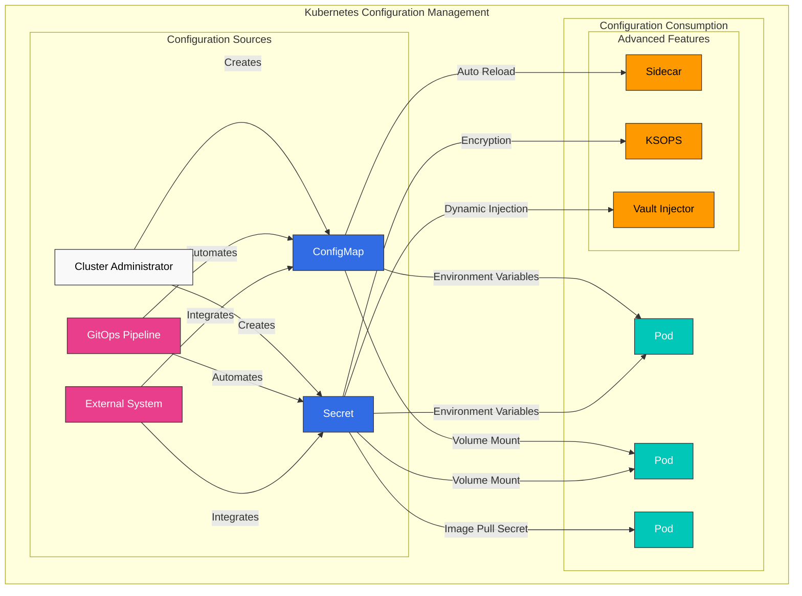
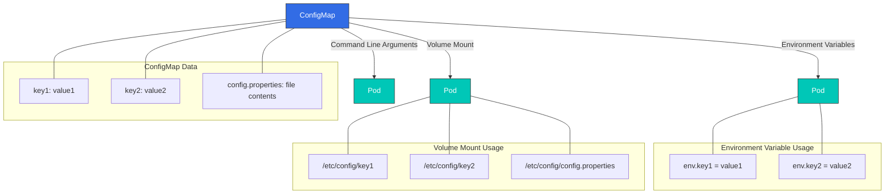
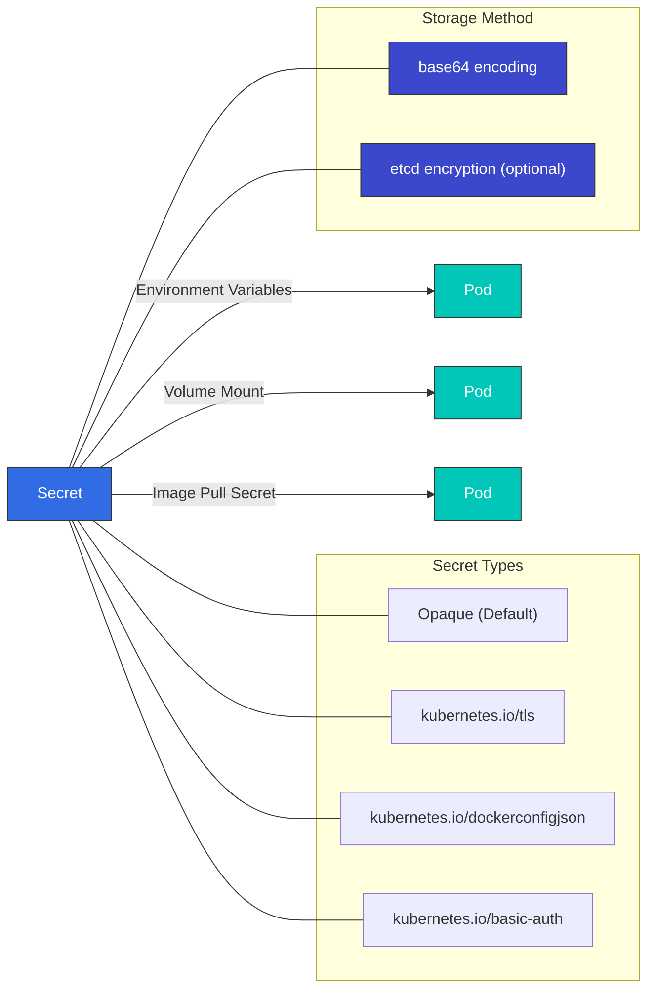
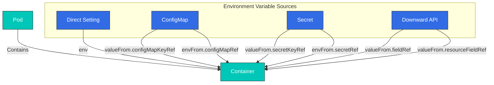
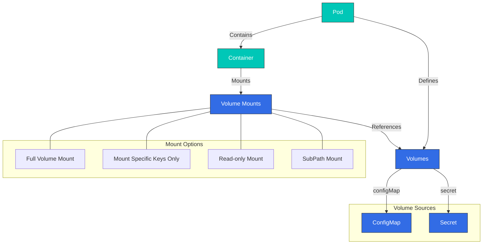
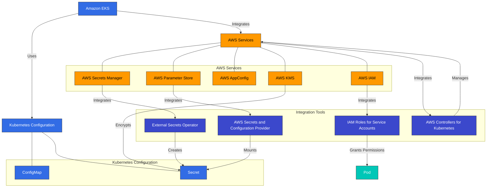

# Configuration and Secrets

> **Supported Versions**: Kubernetes 1.32, 1.33, 1.34
> **最終更新**: February 22, 2026

Kubernetes において、configuration management は application settings を code から分離して管理するための重要な要素です。この章では、ConfigMaps、Secrets、environment variables、volumes を通じた configuration の mount など、Kubernetes configuration management の方法を詳しく見ていきます。

## Lab Environment Setup

このドキュメントの例を試すには、次のツールと環境が必要です。

### Required Tools
- kubectl v1.34 以上
- 稼働中の Kubernetes cluster（EKS、minikube、kind など）

### Configuration Example Setup

```bash
# Create namespace
kubectl create namespace config-demo

# Create ConfigMap
kubectl -n config-demo create configmap app-config \
  --from-literal=APP_ENV=production \
  --from-literal=APP_DEBUG=false \
  --from-literal=APP_PORT=8080

# Create Secret
kubectl -n config-demo create secret generic app-secrets \
  --from-literal=DB_USER=admin \
  --from-literal=DB_PASSWORD=s3cr3t \
  --from-literal=API_KEY=abcdef123456

# Create Pod using ConfigMap and Secret
kubectl -n config-demo apply -f - <<EOF
apiVersion: v1
kind: Pod
metadata:
  name: config-test-pod
spec:
  containers:
  - name: test-container
    image: busybox
    command: ["sh", "-c", "env | sort && sleep 3600"]
    env:
    - name: APP_ENV
      valueFrom:
        configMapKeyRef:
          name: app-config
          key: APP_ENV
    - name: DB_PASSWORD
      valueFrom:
        secretKeyRef:
          name: app-secrets
          key: DB_PASSWORD
  restartPolicy: Never
EOF

# Check Pod logs
kubectl -n config-demo logs config-test-pod
```

## Configuration Management at a Glance



## Table of Contents

1. [ConfigMap](#configmap)
2. [Secret](#secret)
3. [Environment Variables](#environment-variables)
4. [Mounting Configuration Through Volumes](#mounting-configuration-through-volumes)
5. [Configuration Best Practices](#configuration-best-practices)
6. [External Configuration Management Tools](#external-configuration-management-tools)

## ConfigMap

> **Key Concept**: ConfigMaps は configuration data を key-value pairs として保存し、application code と configuration を分離します。

ConfigMaps は configuration data を key-value pairs として保存する API objects です。ConfigMaps を使用すると、configuration data を container images から分離できるため、applications の portability が高まります。

### ConfigMap vs Secret Comparison

| Feature | ConfigMap | Secret |
|---------|-----------|--------|
| **Purpose** | General configuration data | Sensitive configuration data |
| **Storage Format** | Plain text | Base64 encoded (default) |
| **Size Limit** | 1MB | 1MB |
| **Encryption** | None by default | etcd encryption support |
| **Volume Type** | configMap | secret |
| **Use Cases** | Environment variables, config files | Passwords, tokens, certificates |
| **Auto Update** | Possible delay when volume mounted | Possible delay when volume mounted |

### ConfigMap Creation Methods

ConfigMaps はさまざまな方法で作成できます。

1. **Imperative creation**:

```bash
# Create from literal values
kubectl create configmap my-config --from-literal=key1=value1 --from-literal=key2=value2

# Create from file
kubectl create configmap my-config --from-file=config.properties

# Create from directory
kubectl create configmap my-config --from-file=config-dir/
```

2. **Declarative creation**:

```yaml
apiVersion: v1
kind: ConfigMap
metadata:
  name: my-config
data:
  # Simple key-value pairs
  database.host: "mysql"
  database.port: "3306"

  # File-like configuration
  config.yaml: |
    server:
      port: 8080
    logging:
      level: INFO
    features:
      enabled: true
```

### ConfigMap Usage Methods

ConfigMaps は次の方法で使用できます。

1. **Use as environment variables**:

```yaml
apiVersion: v1
kind: Pod
metadata:
  name: config-env-pod
spec:
  containers:
  - name: app
    image: nginx
    env:
    # Single key-value reference
    - name: DB_HOST
      valueFrom:
        configMapKeyRef:
          name: my-config
          key: database.host
    # All key-value references
    envFrom:
    - configMapRef:
        name: my-config
```



### ConfigMap Creation

ConfigMaps はさまざまな方法で作成できます。

#### Imperative

```bash
# Create from literal values
kubectl create configmap my-config --from-literal=key1=value1 --from-literal=key2=value2

# Create from file
kubectl create configmap my-config --from-file=config.properties

# Create from directory
kubectl create configmap my-config --from-file=config-dir/
```

#### Declarative

```yaml
apiVersion: v1
kind: ConfigMap
metadata:
  name: my-config
data:
  # Simple key-value pairs
  key1: value1
  key2: value2
  # File-like configuration
  config.properties: |
    property1=value1
    property2=value2
  # JSON configuration
  config.json: |
    {
      "property1": "value1",
      "property2": "value2"
    }
```

### ConfigMap Usage

ConfigMaps は Pods で次の方法で使用できます。

#### Use as Environment Variables

```yaml
apiVersion: v1
kind: Pod
metadata:
  name: configmap-pod
spec:
  containers:
  - name: test-container
    image: busybox
    command: [ "/bin/sh", "-c", "env" ]
    env:
    # Use single key-value pair
    - name: SPECIAL_KEY
      valueFrom:
        configMapKeyRef:
          name: my-config
          key: key1
    # Use all key-value pairs as environment variables
    envFrom:
    - configMapRef:
        name: my-config
  restartPolicy: Never
```

#### Mount as Volume

```yaml
apiVersion: v1
kind: Pod
metadata:
  name: configmap-pod
spec:
  containers:
  - name: test-container
    image: busybox
    command: [ "/bin/sh", "-c", "ls /etc/config/" ]
    volumeMounts:
    - name: config-volume
      mountPath: /etc/config
  volumes:
  - name: config-volume
    configMap:
      name: my-config
  restartPolicy: Never
```

#### Mount Only Specific Keys

```yaml
apiVersion: v1
kind: Pod
metadata:
  name: configmap-pod
spec:
  containers:
  - name: test-container
    image: busybox
    command: [ "/bin/sh", "-c", "cat /etc/config/key1" ]
    volumeMounts:
    - name: config-volume
      mountPath: /etc/config
  volumes:
  - name: config-volume
    configMap:
      name: my-config
      items:
      - key: key1
        path: key1
  restartPolicy: Never
```

### ConfigMap Updates

ConfigMap が更新されると、volume として mount された ConfigMap の内容は自動的に更新されます。ただし、environment variables として使用されている ConfigMaps を更新するには Pod の restart が必要です。

```bash
kubectl edit configmap my-config
```

または

```yaml
apiVersion: v1
kind: ConfigMap
metadata:
  name: my-config
data:
  key1: updated-value1
  key2: value2
```

```bash
kubectl apply -f updated-configmap.yaml
```

## Secret

Secrets は、passwords、OAuth tokens、SSH keys などの sensitive information を保存する API objects です。Secrets は ConfigMaps に似ていますが、sensitive data を保存するための追加の security features を提供します。



### Secret Types

Kubernetes はさまざまな types の secrets を提供します。

- **Opaque**: default type で、任意の user-defined data を保存します。
- **kubernetes.io/service-account-token**: service account tokens を保存します。
- **kubernetes.io/dockercfg**: `.dockercfg` file の serialized form を保存します。
- **kubernetes.io/dockerconfigjson**: `.docker/config.json` file の serialized form を保存します。
- **kubernetes.io/basic-auth**: basic authentication の credentials を保存します。
- **kubernetes.io/ssh-auth**: SSH authentication の credentials を保存します。
- **kubernetes.io/tls**: TLS certificates と keys を保存します。
- **bootstrap.kubernetes.io/token**: bootstrap token data を保存します。

### Secret Creation

Secrets はさまざまな方法で作成できます。

#### Imperative

```bash
# Create from literal values
kubectl create secret generic my-secret --from-literal=username=admin --from-literal=password=secret

# Create from files
kubectl create secret generic my-secret --from-file=username.txt --from-file=password.txt

# Create TLS secret
kubectl create secret tls my-tls-secret --cert=path/to/cert.crt --key=path/to/key.key

# Create Docker registry secret
kubectl create secret docker-registry my-registry-secret \
  --docker-server=DOCKER_REGISTRY_SERVER \
  --docker-username=DOCKER_USER \
  --docker-password=DOCKER_PASSWORD \
  --docker-email=DOCKER_EMAIL
```

#### Declarative

```yaml
apiVersion: v1
kind: Secret
metadata:
  name: my-secret
type: Opaque
data:
  # base64 encoded values
  username: YWRtaW4=  # admin
  password: c2VjcmV0  # secret
```

または、`stringData` field を使用して unencoded values を指定できます。

```yaml
apiVersion: v1
kind: Secret
metadata:
  name: my-secret
type: Opaque
stringData:
  # Unencoded values
  username: admin
  password: secret
```

### Secret Usage

Secrets は Pods で次の方法で使用できます。

#### Use as Environment Variables

```yaml
apiVersion: v1
kind: Pod
metadata:
  name: secret-pod
spec:
  containers:
  - name: test-container
    image: busybox
    command: [ "/bin/sh", "-c", "env" ]
    env:
    # Use single key-value pair
    - name: USERNAME
      valueFrom:
        secretKeyRef:
          name: my-secret
          key: username
    # Use all key-value pairs as environment variables
    envFrom:
    - secretRef:
        name: my-secret
  restartPolicy: Never
```

#### Mount as Volume

```yaml
apiVersion: v1
kind: Pod
metadata:
  name: secret-pod
spec:
  containers:
  - name: test-container
    image: busybox
    command: [ "/bin/sh", "-c", "ls /etc/secret/" ]
    volumeMounts:
    - name: secret-volume
      mountPath: /etc/secret
  volumes:
  - name: secret-volume
    secret:
      secretName: my-secret
  restartPolicy: Never
```

#### Image Pull Secrets

```yaml
apiVersion: v1
kind: Pod
metadata:
  name: private-image-pod
spec:
  containers:
  - name: private-image-container
    image: private-registry.example.com/my-app:v1
  imagePullSecrets:
  - name: my-registry-secret
```

### Secret Security Considerations

Secrets は default で base64 encoded されますが、これは encryption ではありません。secret security を強化するには、次の方法を検討してください。

1. **etcd Encryption**: etcd に保存される secrets を encrypt します。
2. **RBAC**: secrets への access を制限します。
3. **Network Policies**: secrets に access できる Pods を制限します。
4. **External Secret Management Tools**: AWS Secrets Manager、HashiCorp Vault などの external secret management tools を使用します。

#### etcd Encryption Configuration

```yaml
apiVersion: apiserver.config.k8s.io/v1
kind: EncryptionConfiguration
resources:
  - resources:
    - secrets
    providers:
    - aescbc:
        keys:
        - name: key1
          secret: <base64 encoded key>
    - identity: {}
```

## Environment Variables

Environment variables は configuration information を containers に渡すための簡単な方法です。Kubernetes は environment variables を設定するための複数の方法を提供しています。



### Direct Setting

```yaml
apiVersion: v1
kind: Pod
metadata:
  name: env-pod
spec:
  containers:
  - name: test-container
    image: busybox
    command: [ "/bin/sh", "-c", "env" ]
    env:
    - name: ENVIRONMENT
      value: "production"
    - name: LOG_LEVEL
      value: "INFO"
  restartPolicy: Never
```

### Setting from ConfigMap

```yaml
apiVersion: v1
kind: Pod
metadata:
  name: env-pod
spec:
  containers:
  - name: test-container
    image: busybox
    command: [ "/bin/sh", "-c", "env" ]
    env:
    - name: ENVIRONMENT
      valueFrom:
        configMapKeyRef:
          name: my-config
          key: environment
  restartPolicy: Never
```

### Setting from Secret

```yaml
apiVersion: v1
kind: Pod
metadata:
  name: env-pod
spec:
  containers:
  - name: test-container
    image: busybox
    command: [ "/bin/sh", "-c", "env" ]
    env:
    - name: DATABASE_PASSWORD
      valueFrom:
        secretKeyRef:
          name: my-secret
          key: password
  restartPolicy: Never
```

### Setting through Downward API

Downward API を使用すると、Pod と container の information を environment variables として公開できます。

```yaml
apiVersion: v1
kind: Pod
metadata:
  name: downward-api-pod
  labels:
    app: myapp
spec:
  containers:
  - name: test-container
    image: busybox
    command: [ "/bin/sh", "-c", "env" ]
    env:
    - name: POD_NAME
      valueFrom:
        fieldRef:
          fieldPath: metadata.name
    - name: POD_NAMESPACE
      valueFrom:
        fieldRef:
          fieldPath: metadata.namespace
    - name: POD_IP
      valueFrom:
        fieldRef:
          fieldPath: status.podIP
    - name: NODE_NAME
      valueFrom:
        fieldRef:
          fieldPath: spec.nodeName
    - name: CONTAINER_CPU_REQUEST
      valueFrom:
        resourceFieldRef:
          containerName: test-container
          resource: requests.cpu
  restartPolicy: Never
```

## Mounting Configuration Through Volumes

Configuration files を volumes を通じて containers に mount すると、environment variables よりも柔軟な configuration management method を提供できます。



### ConfigMap Volume

```yaml
apiVersion: v1
kind: Pod
metadata:
  name: configmap-volume-pod
spec:
  containers:
  - name: test-container
    image: busybox
    command: [ "/bin/sh", "-c", "ls -la /etc/config" ]
    volumeMounts:
    - name: config-volume
      mountPath: /etc/config
  volumes:
  - name: config-volume
    configMap:
      name: my-config
  restartPolicy: Never
```

### Secret Volume

```yaml
apiVersion: v1
kind: Pod
metadata:
  name: secret-volume-pod
spec:
  containers:
  - name: test-container
    image: busybox
    command: [ "/bin/sh", "-c", "ls -la /etc/secret" ]
    volumeMounts:
    - name: secret-volume
      mountPath: /etc/secret
  volumes:
  - name: secret-volume
    secret:
      secretName: my-secret
  restartPolicy: Never
```

### Specific File Mount

```yaml
apiVersion: v1
kind: Pod
metadata:
  name: specific-file-pod
spec:
  containers:
  - name: test-container
    image: busybox
    command: [ "/bin/sh", "-c", "cat /etc/config/config.properties" ]
    volumeMounts:
    - name: config-volume
      mountPath: /etc/config
  volumes:
  - name: config-volume
    configMap:
      name: my-config
      items:
      - key: config.properties
        path: config.properties
  restartPolicy: Never
```

### Read-only Mount

```yaml
apiVersion: v1
kind: Pod
metadata:
  name: readonly-mount-pod
spec:
  containers:
  - name: test-container
    image: busybox
    command: [ "/bin/sh", "-c", "ls -la /etc/config" ]
    volumeMounts:
    - name: config-volume
      mountPath: /etc/config
      readOnly: true
  volumes:
  - name: config-volume
    configMap:
      name: my-config
  restartPolicy: Never
```

### SubPath Mount

```yaml
apiVersion: v1
kind: Pod
metadata:
  name: subpath-mount-pod
spec:
  containers:
  - name: test-container
    image: busybox
    command: [ "/bin/sh", "-c", "cat /etc/nginx/nginx.conf" ]
    volumeMounts:
    - name: config-volume
      mountPath: /etc/nginx/nginx.conf
      subPath: nginx.conf
  volumes:
  - name: config-volume
    configMap:
      name: my-config
  restartPolicy: Never
```

## Configuration Best Practices

Kubernetes で configuration を管理するときは、次の best practices を考慮してください。

### 1. Separate Configuration from Code

Application code と configuration は分離して管理します。これにより、configuration を変更するときに application を rebuild する必要がなくなります。

### 2. Environment-Specific Configuration Management

Development、testing、production など、environment ごとに configuration を分離して管理します。namespaces を使用して environments を分離し、environment ごとに異なる ConfigMaps と Secrets を使用できます。

```yaml
apiVersion: v1
kind: ConfigMap
metadata:
  name: my-config
  namespace: development
data:
  environment: development
  log_level: DEBUG
---
apiVersion: v1
kind: ConfigMap
metadata:
  name: my-config
  namespace: production
data:
  environment: production
  log_level: INFO
```

### 3. Use Secrets for Sensitive Information

Passwords、API keys、certificates などの sensitive information を保存する場合は、常に Secrets を使用してください。ConfigMaps は non-sensitive configuration data のみに使用してください。

### 4. Maintain Immutability

Configuration を変更するときは、既存のものを変更するのではなく、新しい version を作成します。これにより rollback が容易になり、configuration change history を tracking できます。

```yaml
apiVersion: v1
kind: ConfigMap
metadata:
  name: my-config-v1
data:
  # Configuration data
---
apiVersion: v1
kind: ConfigMap
metadata:
  name: my-config-v2
data:
  # Updated configuration data
```

### 5. Restart Pods on Configuration Changes

Environment variables として使用されている configuration を更新するには Pod の restart が必要です。Deployments を使用して rolling updates を実行します。

```bash
kubectl rollout restart deployment/my-deployment
```

### 6. Validate Configuration

Configuration を適用する前に validate してください。無効な configuration は application failures を引き起こす可能性があります。

### 7. Document Configuration

Configuration options とその effects を document します。これにより、team members が configuration を理解し管理しやすくなります。

## Configuration Management in Amazon EKS

Amazon EKS では、Kubernetes の基本的な configuration management features に加えて、AWS のさまざまな services を使用して configuration と secrets を管理できます。この section では、EKS で configuration を管理するさまざまな方法と AWS services との integration を扱います。



### AWS Secrets Manager Integration

AWS Secrets Manager は、database credentials、API keys、その他の secret information を secure に保存および管理できる service です。EKS では、External Secrets Operator または AWS Secrets and Configuration Provider (ASCP) を使用して、AWS Secrets Manager から Kubernetes secrets へ secrets を synchronize できます。

#### External Secrets Operator Installation

```bash
# Install External Secrets Operator using Helm
helm repo add external-secrets https://charts.external-secrets.io
helm install external-secrets external-secrets/external-secrets \
  --namespace external-secrets \
  --create-namespace
```

#### Create SecretStore

```yaml
apiVersion: external-secrets.io/v1beta1
kind: SecretStore
metadata:
  name: aws-secretsmanager
  namespace: my-namespace
spec:
  provider:
    aws:
      service: SecretsManager
      region: us-west-2
      auth:
        jwt:
          serviceAccountRef:
            name: my-serviceaccount
```

#### Create ExternalSecret

```yaml
apiVersion: external-secrets.io/v1beta1
kind: ExternalSecret
metadata:
  name: database-credentials
  namespace: my-namespace
spec:
  refreshInterval: 1h
  secretStoreRef:
    name: aws-secretsmanager
    kind: SecretStore
  target:
    name: db-credentials
  data:
  - secretKey: username
    remoteRef:
      key: prod/db/credentials
      property: username
  - secretKey: password
    remoteRef:
      key: prod/db/credentials
      property: password
```

#### IRSA (IAM Roles for Service Accounts) Setup

External Secrets Operator が AWS Secrets Manager に access するには、適切な IAM permissions が必要です。IRSA を使用して IAM roles を Kubernetes service accounts に関連付けることができます。

```bash
# Create OIDC provider
eksctl utils associate-iam-oidc-provider \
  --cluster my-cluster \
  --approve

# Create IAM role and service account
eksctl create iamserviceaccount \
  --cluster my-cluster \
  --namespace my-namespace \
  --name my-serviceaccount \
  --attach-policy-arn arn:aws:iam::aws:policy/SecretsManagerReadWrite \
  --approve
```

### Using AWS Parameter Store

AWS Systems Manager Parameter Store は、configuration data と secret values を階層的に保存および管理できる service です。Parameter Store は Secrets Manager よりも低コストで、simple configuration values の保存に適しています。

#### ASCP (AWS Secrets and Configuration Provider) Installation

```bash
# Install ASCP
helm repo add secrets-store-csi-driver https://kubernetes-sigs.github.io/secrets-store-csi-driver/charts
helm install csi-secrets-store secrets-store-csi-driver/secrets-store-csi-driver \
  --namespace kube-system

# Install AWS provider
kubectl apply -f https://raw.githubusercontent.com/aws/secrets-store-csi-driver-provider-aws/main/deployment/aws-provider-installer.yaml
```

#### Create SecretProviderClass

```yaml
apiVersion: secrets-store.csi.x-k8s.io/v1
kind: SecretProviderClass
metadata:
  name: aws-parameters
  namespace: my-namespace
spec:
  provider: aws
  parameters:
    objects: |
      - objectName: /my-app/config/log-level
        objectType: ssmparameter
      - objectName: /my-app/config/environment
        objectType: ssmparameter
```

#### Using Parameter Store Values in Pods

```yaml
apiVersion: v1
kind: Pod
metadata:
  name: parameter-store-pod
  namespace: my-namespace
spec:
  containers:
  - name: app
    image: my-app:latest
    volumeMounts:
    - name: parameters-store-volume
      mountPath: "/mnt/parameters"
      readOnly: true
  volumes:
  - name: parameters-store-volume
    csi:
      driver: secrets-store.csi.k8s.io
      readOnly: true
      volumeAttributes:
        secretProviderClass: aws-parameters
```

### Dynamic Configuration with AWS AppConfig

AWS AppConfig は application configuration を管理および deploy する service です。AppConfig を使用すると、applications を redeploy せずに configuration を dynamically update できます。

#### AppConfig Agent Sidecar Pattern

```yaml
apiVersion: apps/v1
kind: Deployment
metadata:
  name: my-app
  namespace: my-namespace
spec:
  replicas: 3
  selector:
    matchLabels:
      app: my-app
  template:
    metadata:
      labels:
        app: my-app
    spec:
      containers:
      - name: app
        image: my-app:latest
        env:
        - name: CONFIG_PATH
          value: /config/config.json
        volumeMounts:
        - name: config-volume
          mountPath: /config
      - name: appconfig-agent
        image: public.ecr.aws/aws-appconfig/aws-appconfig-agent:2.0
        env:
        - name: AWS_APPCONFIG_EXTENSION_POLL_INTERVAL_SECONDS
          value: "45"
        - name: AWS_APPCONFIG_EXTENSION_POLL_TIMEOUT_SECONDS
          value: "15"
        - name: AWS_APPCONFIG_EXTENSION_HTTP_PORT
          value: "2772"
        - name: AWS_APPCONFIG_EXTENSION_PREFETCH_LIST
          value: '{"Applications":[{"ApplicationId":"MyApp","Environments":[{"EnvironmentId":"Production","Configurations":[{"ConfigurationProfileId":"MyConfig","VersionNumber":null}]}]}]}'
        volumeMounts:
        - name: config-volume
          mountPath: /config
      volumes:
      - name: config-volume
        emptyDir: {}
```

### Configuration with EKS Fargate Profiles

EKS Fargate を使用すると、nodes を管理せずに Kubernetes Pods を実行できます。Fargate profiles を使用して Pod execution environment を configure できます。

```yaml
apiVersion: eks.amazonaws.com/v1beta1
kind: FargateProfile
metadata:
  name: my-profile
  namespace: my-namespace
spec:
  clusterName: my-cluster
  podExecutionRoleArn: arn:aws:iam::123456789012:role/my-pod-execution-role
  selectors:
  - namespace: my-namespace
    labels:
      environment: production
  subnets:
  - subnet-1234567890abcdef0
  - subnet-0abcdef1234567890
```

### Secret Encryption with AWS KMS

Kubernetes secrets は default で base64 encoded されますが、これは encryption ではありません。AWS KMS (Key Management Service) を使用して EKS cluster 内の secrets を encrypt できます。

#### Create KMS Key

```bash
# Create KMS key
aws kms create-key --description "EKS Secret Encryption Key"

# Store key ID
KEY_ID=$(aws kms create-key --query KeyMetadata.KeyId --output text)

# Create key alias
aws kms create-alias --alias-name alias/eks-secrets --target-key-id $KEY_ID
```

#### Apply Encryption Configuration to EKS Cluster

```bash
# Apply encryption configuration
aws eks update-cluster-config \
  --name my-cluster \
  --encryption-config '[{"resources":["secrets"],"provider":{"keyArn":"arn:aws:kms:us-west-2:123456789012:key/'$KEY_ID'"}}]'
```

### Secret Access Control with AWS IAM

IRSA (IAM Roles for Service Accounts) を使用して IAM roles を Kubernetes service accounts に関連付けることで、Pods は AWS services に secure に access できます。

#### Create Service Account

```yaml
apiVersion: v1
kind: ServiceAccount
metadata:
  name: my-service-account
  namespace: my-namespace
  annotations:
    eks.amazonaws.com/role-arn: arn:aws:iam::123456789012:role/my-iam-role
```

#### Using Service Account in Pods

```yaml
apiVersion: v1
kind: Pod
metadata:
  name: my-pod
  namespace: my-namespace
spec:
  serviceAccountName: my-service-account
  containers:
  - name: app
    image: my-app:latest
```

### EKS Configuration Best Practices

EKS で configuration を管理するときは、次の best practices を考慮してください。

1. **Use IRSA**: AWS services に access するときは、Pods に minimum permissions を付与するために常に IRSA を使用してください。

2. **Encrypt Secrets**: EKS cluster 内の secrets を encrypt するために KMS を使用します。

3. **External Secret Management**: Sensitive information を管理するために、AWS Secrets Manager や Parameter Store などの external secret management services を使用します。

4. **Configuration Version Management**: Configuration versions を管理するために AWS AppConfig または Parameter Store を使用します。

5. **Environment-Specific Configuration Separation**: Development、testing、production environments ごとに configuration を分離して管理します。Kubernetes namespaces と AWS resource tags を使用します。

6. **Minimize IAM Policies**: AWS services に access するときは least privilege の原則に従います。

7. **Configuration Automation**: Configuration management を automate するために、AWS CloudFormation、AWS CDK、Terraform などの tools を使用します。

### EKS Configuration Management Tools

EKS で configuration を管理するのに役立つ tools を見てみましょう。

#### AWS Controllers for Kubernetes (ACK)

ACK は、Kubernetes から AWS resources を管理できる tool です。ACK を使用すると、Kubernetes manifests を通じて AWS resources を作成および管理できます。

```yaml
apiVersion: secretsmanager.services.k8s.aws/v1alpha1
kind: Secret
metadata:
  name: my-secret
spec:
  name: my-secret
  description: "My secret created via ACK"
  forceDeleteWithoutRecovery: true
  generateSecretString:
    excludeCharacters: "\"@/\\"
    excludePunctuation: true
    includeSpace: false
    passwordLength: 16
```

#### eksctl

eksctl は EKS clusters を作成および管理するための command-line tool です。eksctl を使用して cluster configuration を管理できます。

```yaml
# cluster.yaml
apiVersion: eksctl.io/v1alpha5
kind: ClusterConfig
metadata:
  name: my-cluster
  region: us-west-2
secretsEncryption:
  keyARN: arn:aws:kms:us-west-2:123456789012:key/1234abcd-12ab-34cd-56ef-1234567890ab
```

```bash
eksctl create cluster -f cluster.yaml
```

#### AWS CDK

AWS CDK (Cloud Development Kit) は、programming languages を使用して AWS resources を定義するための tool です。CDK を使用して EKS clusters と関連 resources を定義できます。

```typescript
import * as cdk from 'aws-cdk-lib';
import * as eks from 'aws-cdk-lib/aws-eks';
import * as iam from 'aws-cdk-lib/aws-iam';

const app = new cdk.App();
const stack = new cdk.Stack(app, 'EksStack');

// Create EKS cluster
const cluster = new eks.Cluster(stack, 'Cluster', {
  version: eks.KubernetesVersion.V1_21,
  secretsEncryptionKey: new kms.Key(stack, 'Key'),
});

// Create service account
const serviceAccount = cluster.addServiceAccount('ServiceAccount', {
  name: 'my-service-account',
  namespace: 'my-namespace',
});

// Attach IAM policy
serviceAccount.role.addManagedPolicy(
  iam.ManagedPolicy.fromAwsManagedPolicyName('SecretsManagerReadWrite')
);
```

## Conclusion

この章では、Kubernetes configuration management methods について学びました。ConfigMaps と Secrets は application configuration を管理するための基本的な方法を提供し、この configuration を environment variables と volumes を通じて containers に渡すことができます。また、configuration management best practices と external configuration management tools についても扱いました。

Amazon EKS environments では、Kubernetes の基本的な configuration management features と併せて AWS services を使用することで、より強力で secure な configuration management を実現できます。AWS Secrets Manager、Parameter Store、KMS、IAM などの services と integrate することで secrets を secure に管理でき、IRSA を通じて Pods に minimum permissions を付与できます。さらに、AWS AppConfig を使用すると、applications を redeploy せずに configuration を dynamically update できます。

Effective configuration management は、Kubernetes applications の maintainability、scalability、security を向上させるために重要です。application の requirements に適した configuration management strategy を選択し、best practices に従うことが重要です。EKS environments では、AWS services との integration を通じて、より強力な configuration management solutions を構築できます。

次の章では、Kubernetes security について学びます。

## Quiz

この章で学んだ内容を確認するには、[Configuration and Secrets Quiz](../quizzes/core/05-configuration-secrets-quiz.md) に挑戦してください。

## References

- [Kubernetes Official Documentation - ConfigMaps](https://kubernetes.io/docs/concepts/configuration/configmap/)
- [Kubernetes Official Documentation - Secrets](https://kubernetes.io/docs/concepts/configuration/secret/)
- [Kubernetes Official Documentation - Environment Variables](https://kubernetes.io/docs/tasks/inject-data-application/define-environment-variable-container/)
- [Kubernetes Official Documentation - Configure a Pod to Use a ConfigMap](https://kubernetes.io/docs/tasks/configure-pod-container/configure-pod-configmap/)
- [Kubernetes Official Documentation - Distribute Credentials Securely Using Secrets](https://kubernetes.io/docs/tasks/inject-data-application/distribute-credentials-secure/)
- [Helm Official Documentation](https://helm.sh/docs/)
- [Kustomize Official Documentation](https://kustomize.io/)
- [External Secrets Operator Official Documentation](https://external-secrets.io/latest/)
- [AWS Secrets Manager Official Documentation](https://docs.aws.amazon.com/secretsmanager/latest/userguide/intro.html)
- [AWS Systems Manager Parameter Store Official Documentation](https://docs.aws.amazon.com/systems-manager/latest/userguide/systems-manager-parameter-store.html)
- [AWS AppConfig Official Documentation](https://docs.aws.amazon.com/appconfig/latest/userguide/what-is-appconfig.html)
- [EKS Official Documentation - IRSA](https://docs.aws.amazon.com/eks/latest/userguide/iam-roles-for-service-accounts.html)
- [EKS Official Documentation - Secrets Encryption](https://docs.aws.amazon.com/eks/latest/userguide/enable-kms.html)
- [AWS Controllers for Kubernetes (ACK) Official Documentation](https://aws-controllers-k8s.github.io/community/)
