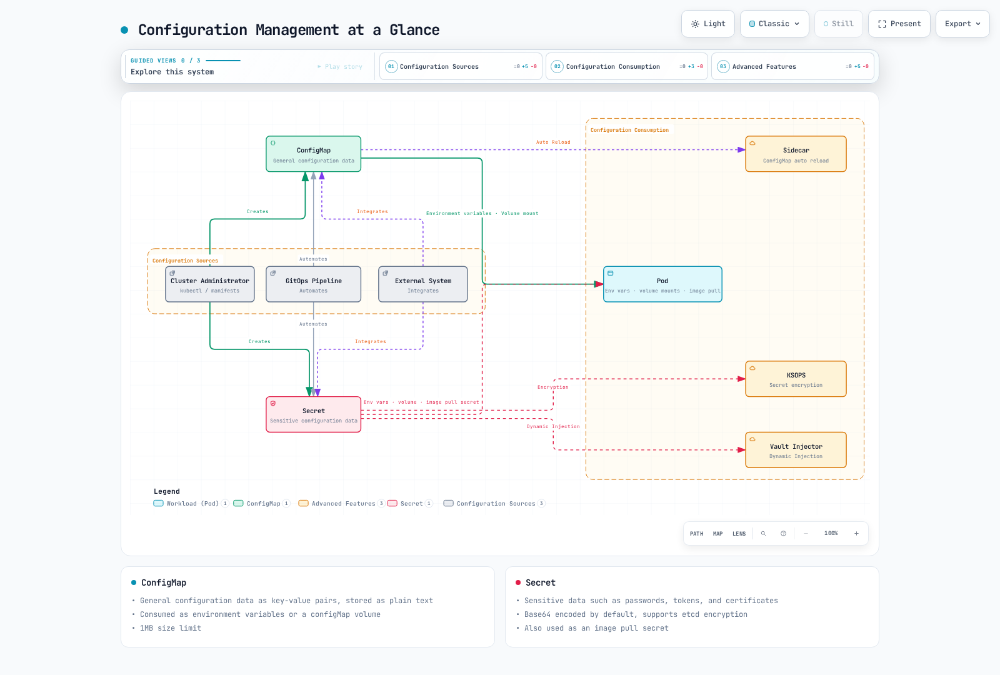
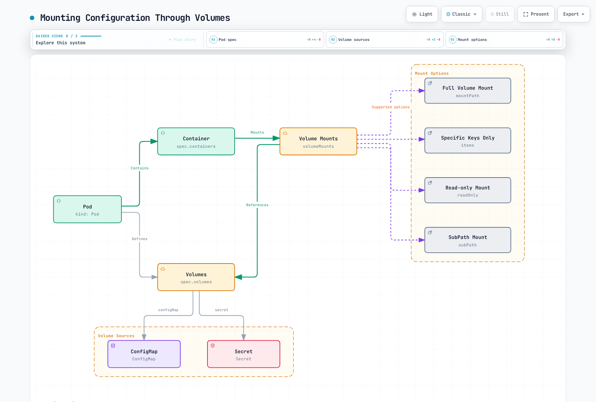
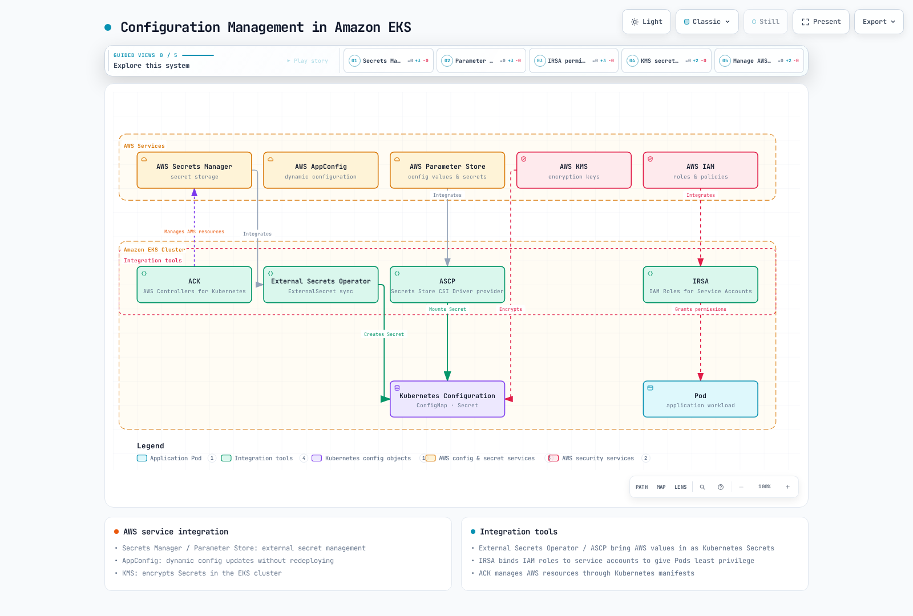

# 設定と Secret

> **サポート対象バージョン**: Kubernetes 1.32, 1.33, 1.34
> **最終更新**: February 22, 2026

Kubernetes では、設定管理はアプリケーション設定をコードから分離して管理するうえで重要な要素です。この章では、ConfigMap、Secret、環境変数、Volume を通じた設定のマウントなど、Kubernetes の設定管理方法を詳しく説明します。

## Lab 環境のセットアップ

このドキュメントの例に沿って進めるには、次のツールと環境が必要です。

### 必要なツール
- kubectl v1.34 以降
- 動作する Kubernetes クラスター（EKS、minikube、kind など）

### 設定例のセットアップ

```bash
# Create namespace
kubectl create namespace config-demo

# Create ConfigMap
kubectl -n config-demo create configmap app-config \
  --from-literal=APP_ENV=production \
  --from-literal=APP_DEBUG=false \
  --from-literal=APP_PORT=8080

# Create Secret
kubectl -n config-demo create secret generic app-secrets \
  --from-literal=DB_USER=admin \
  --from-literal=DB_PASSWORD=s3cr3t \
  --from-literal=API_KEY=abcdef123456

# Create Pod using ConfigMap and Secret
kubectl -n config-demo apply -f - <<EOF
apiVersion: v1
kind: Pod
metadata:
  name: config-test-pod
spec:
  containers:
  - name: test-container
    image: busybox
    command: ["sh", "-c", "env | sort && sleep 3600"]
    env:
    - name: APP_ENV
      valueFrom:
        configMapKeyRef:
          name: app-config
          key: APP_ENV
    - name: DB_PASSWORD
      valueFrom:
        secretKeyRef:
          name: app-secrets
          key: DB_PASSWORD
  restartPolicy: Never
EOF

# Check Pod logs
kubectl -n config-demo logs config-test-pod
```

## 設定管理の概要



[🔍 インタラクティブな図を表示](https://www.atomai.click/kubernetes-docs/archmaps/en-core-05-configuration-secrets-0.html)

## 目次

1. [ConfigMap](#configmap)
2. [Secret](#secret)
3. [環境変数](#environment-variables)
4. [Volume を通じた設定のマウント](#mounting-configuration-through-volumes)
5. [設定のベストプラクティス](#configuration-best-practices)
6. [外部設定管理ツール](#external-configuration-management-tools)

## ConfigMap

> **重要な概念**: ConfigMap は設定データをキーと値のペアで保存し、アプリケーションコードと設定を分離します。

ConfigMap は、設定データをキーと値のペアで保存する API オブジェクトです。ConfigMap を使用すると、設定データをコンテナイメージから分離でき、アプリケーションの可搬性が向上します。

### ConfigMap と Secret の比較

| 機能 | ConfigMap | Secret |
|---------|-----------|--------|
| **目的** | 一般的な設定データ | 機密性の高い設定データ |
| **保存形式** | プレーンテキスト | Base64 エンコード（デフォルト） |
| **サイズ上限** | 1MB | 1MB |
| **暗号化** | デフォルトではなし | etcd 暗号化をサポート |
| **Volume タイプ** | configMap | secret |
| **ユースケース** | 環境変数、設定ファイル | パスワード、トークン、証明書 |
| **自動更新** | Volume としてマウント時に遅延する可能性あり | Volume としてマウント時に遅延する可能性あり |

### ConfigMap の作成方法

ConfigMap はさまざまな方法で作成できます。

1. **命令型の作成**:

```bash
# Create from literal values
kubectl create configmap my-config --from-literal=key1=value1 --from-literal=key2=value2

# Create from file
kubectl create configmap my-config --from-file=config.properties

# Create from directory
kubectl create configmap my-config --from-file=config-dir/
```

2. **宣言型の作成**:

```yaml
apiVersion: v1
kind: ConfigMap
metadata:
  name: my-config
data:
  # Simple key-value pairs
  database.host: "mysql"
  database.port: "3306"

  # File-like configuration
  config.yaml: |
    server:
      port: 8080
    logging:
      level: INFO
    features:
      enabled: true
```

### ConfigMap の使用方法

ConfigMap は次の方法で使用できます。

1. **環境変数として使用**:

```yaml
apiVersion: v1
kind: Pod
metadata:
  name: config-env-pod
spec:
  containers:
  - name: app
    image: nginx
    env:
    # Single key-value reference
    - name: DB_HOST
      valueFrom:
        configMapKeyRef:
          name: my-config
          key: database.host
    # All key-value references
    envFrom:
    - configMapRef:
        name: my-config
```


[🔍 インタラクティブな図を表示](https://www.atomai.click/kubernetes-docs/archmaps/en-core-05-configuration-secrets-1.html)

### ConfigMap の作成

ConfigMap はさまざまな方法で作成できます。

#### 命令型

```bash
# Create from literal values
kubectl create configmap my-config --from-literal=key1=value1 --from-literal=key2=value2

# Create from file
kubectl create configmap my-config --from-file=config.properties

# Create from directory
kubectl create configmap my-config --from-file=config-dir/
```

#### 宣言型

```yaml
apiVersion: v1
kind: ConfigMap
metadata:
  name: my-config
data:
  # Simple key-value pairs
  key1: value1
  key2: value2
  # File-like configuration
  config.properties: |
    property1=value1
    property2=value2
  # JSON configuration
  config.json: |
    {
      "property1": "value1",
      "property2": "value2"
    }
```

### ConfigMap の使用

ConfigMap は Pod 内で次の方法により使用できます。

#### 環境変数として使用

```yaml
apiVersion: v1
kind: Pod
metadata:
  name: configmap-pod
spec:
  containers:
  - name: test-container
    image: busybox
    command: [ "/bin/sh", "-c", "env" ]
    env:
    # Use single key-value pair
    - name: SPECIAL_KEY
      valueFrom:
        configMapKeyRef:
          name: my-config
          key: key1
    # Use all key-value pairs as environment variables
    envFrom:
    - configMapRef:
        name: my-config
  restartPolicy: Never
```

#### Volume としてマウント

```yaml
apiVersion: v1
kind: Pod
metadata:
  name: configmap-pod
spec:
  containers:
  - name: test-container
    image: busybox
    command: [ "/bin/sh", "-c", "ls /etc/config/" ]
    volumeMounts:
    - name: config-volume
      mountPath: /etc/config
  volumes:
  - name: config-volume
    configMap:
      name: my-config
  restartPolicy: Never
```

#### 特定のキーのみをマウント

```yaml
apiVersion: v1
kind: Pod
metadata:
  name: configmap-pod
spec:
  containers:
  - name: test-container
    image: busybox
    command: [ "/bin/sh", "-c", "cat /etc/config/key1" ]
    volumeMounts:
    - name: config-volume
      mountPath: /etc/config
  volumes:
  - name: config-volume
    configMap:
      name: my-config
      items:
      - key: key1
        path: key1
  restartPolicy: Never
```

### ConfigMap の更新

ConfigMap が更新されると、Volume としてマウントされた ConfigMap の内容は自動的に更新されます。ただし、環境変数として使用された ConfigMap を更新するには Pod の再起動が必要です。

```bash
kubectl edit configmap my-config
```

または

```yaml
apiVersion: v1
kind: ConfigMap
metadata:
  name: my-config
data:
  key1: updated-value1
  key2: value2
```

```bash
kubectl apply -f updated-configmap.yaml
```

## Secret

Secret は、パスワード、OAuth トークン、SSH キーなどの機密情報を保存する API オブジェクトです。Secret は ConfigMap と似ていますが、機密データの保存に追加のセキュリティ機能を提供します。


[🔍 インタラクティブな図を表示](https://www.atomai.click/kubernetes-docs/archmaps/en-core-05-configuration-secrets-2.html)

### Secret のタイプ

Kubernetes はさまざまなタイプの Secret を提供しています。

- **Opaque**: デフォルトタイプで、任意のユーザー定義データを保存します。
- **kubernetes.io/service-account-token**: ServiceAccount トークンを保存します。
- **kubernetes.io/dockercfg**: `.dockercfg` ファイルのシリアライズ形式を保存します。
- **kubernetes.io/dockerconfigjson**: `.docker/config.json` ファイルのシリアライズ形式を保存します。
- **kubernetes.io/basic-auth**: Basic 認証の認証情報を保存します。
- **kubernetes.io/ssh-auth**: SSH 認証の認証情報を保存します。
- **kubernetes.io/tls**: TLS 証明書とキーを保存します。
- **bootstrap.kubernetes.io/token**: Bootstrap トークンデータを保存します。

### Secret の作成

Secret はさまざまな方法で作成できます。

#### 命令型

```bash
# Create from literal values
kubectl create secret generic my-secret --from-literal=username=admin --from-literal=password=secret

# Create from files
kubectl create secret generic my-secret --from-file=username.txt --from-file=password.txt

# Create TLS secret
kubectl create secret tls my-tls-secret --cert=path/to/cert.crt --key=path/to/key.key

# Create Docker registry secret
kubectl create secret docker-registry my-registry-secret \
  --docker-server=DOCKER_REGISTRY_SERVER \
  --docker-username=DOCKER_USER \
  --docker-password=DOCKER_PASSWORD \
  --docker-email=DOCKER_EMAIL
```

#### 宣言型

```yaml
apiVersion: v1
kind: Secret
metadata:
  name: my-secret
type: Opaque
data:
  # base64 encoded values
  username: YWRtaW4=  # admin
  password: c2VjcmV0  # secret
```

または、`stringData` フィールドを使用してエンコードされていない値を指定できます。

```yaml
apiVersion: v1
kind: Secret
metadata:
  name: my-secret
type: Opaque
stringData:
  # Unencoded values
  username: admin
  password: secret
```

### Secret の使用

Secret は Pod 内で次の方法により使用できます。

#### 環境変数として使用

```yaml
apiVersion: v1
kind: Pod
metadata:
  name: secret-pod
spec:
  containers:
  - name: test-container
    image: busybox
    command: [ "/bin/sh", "-c", "env" ]
    env:
    # Use single key-value pair
    - name: USERNAME
      valueFrom:
        secretKeyRef:
          name: my-secret
          key: username
    # Use all key-value pairs as environment variables
    envFrom:
    - secretRef:
        name: my-secret
  restartPolicy: Never
```

#### Volume としてマウント

```yaml
apiVersion: v1
kind: Pod
metadata:
  name: secret-pod
spec:
  containers:
  - name: test-container
    image: busybox
    command: [ "/bin/sh", "-c", "ls /etc/secret/" ]
    volumeMounts:
    - name: secret-volume
      mountPath: /etc/secret
  volumes:
  - name: secret-volume
    secret:
      secretName: my-secret
  restartPolicy: Never
```

#### Image Pull Secret

```yaml
apiVersion: v1
kind: Pod
metadata:
  name: private-image-pod
spec:
  containers:
  - name: private-image-container
    image: private-registry.example.com/my-app:v1
  imagePullSecrets:
  - name: my-registry-secret
```

### Secret のセキュリティに関する考慮事項

Secret はデフォルトで Base64 エンコードされていますが、これは暗号化ではありません。Secret のセキュリティを強化するには、次の方法を検討してください。

1. **etcd 暗号化**: etcd に保存される Secret を暗号化します。
2. **RBAC**: Secret へのアクセスを制限します。
3. **NetworkPolicy**: Secret にアクセスできる Pod を制限します。
4. **外部 Secret 管理ツール**: AWS Secrets Manager、HashiCorp Vault などの外部 Secret 管理ツールを使用します。

#### etcd 暗号化の設定

```yaml
apiVersion: apiserver.config.k8s.io/v1
kind: EncryptionConfiguration
resources:
  - resources:
    - secrets
    providers:
    - aescbc:
        keys:
        - name: key1
          secret: <base64 encoded key>
    - identity: {}
```

## 環境変数

環境変数は、設定情報をコンテナに渡すシンプルな方法です。Kubernetes は環境変数を設定する複数の方法を提供しています。


[🔍 インタラクティブな図を表示](https://www.atomai.click/kubernetes-docs/archmaps/en-core-05-configuration-secrets-3.html)

### 直接設定

```yaml
apiVersion: v1
kind: Pod
metadata:
  name: env-pod
spec:
  containers:
  - name: test-container
    image: busybox
    command: [ "/bin/sh", "-c", "env" ]
    env:
    - name: ENVIRONMENT
      value: "production"
    - name: LOG_LEVEL
      value: "INFO"
  restartPolicy: Never
```

### ConfigMap から設定

```yaml
apiVersion: v1
kind: Pod
metadata:
  name: env-pod
spec:
  containers:
  - name: test-container
    image: busybox
    command: [ "/bin/sh", "-c", "env" ]
    env:
    - name: ENVIRONMENT
      valueFrom:
        configMapKeyRef:
          name: my-config
          key: environment
  restartPolicy: Never
```

### Secret から設定

```yaml
apiVersion: v1
kind: Pod
metadata:
  name: env-pod
spec:
  containers:
  - name: test-container
    image: busybox
    command: [ "/bin/sh", "-c", "env" ]
    env:
    - name: DATABASE_PASSWORD
      valueFrom:
        secretKeyRef:
          name: my-secret
          key: password
  restartPolicy: Never
```

### Downward API を通じた設定

Downward API を使用すると、Pod とコンテナの情報を環境変数として公開できます。

```yaml
apiVersion: v1
kind: Pod
metadata:
  name: downward-api-pod
  labels:
    app: myapp
spec:
  containers:
  - name: test-container
    image: busybox
    command: [ "/bin/sh", "-c", "env" ]
    env:
    - name: POD_NAME
      valueFrom:
        fieldRef:
          fieldPath: metadata.name
    - name: POD_NAMESPACE
      valueFrom:
        fieldRef:
          fieldPath: metadata.namespace
    - name: POD_IP
      valueFrom:
        fieldRef:
          fieldPath: status.podIP
    - name: NODE_NAME
      valueFrom:
        fieldRef:
          fieldPath: spec.nodeName
    - name: CONTAINER_CPU_REQUEST
      valueFrom:
        resourceFieldRef:
          containerName: test-container
          resource: requests.cpu
  restartPolicy: Never
```

## Volume を通じた設定のマウント

Volume を通じて設定ファイルをコンテナにマウントする方法は、環境変数よりも柔軟な設定管理方法を提供します。



[🔍 インタラクティブな図を表示](https://www.atomai.click/kubernetes-docs/archmaps/en-core-05-configuration-secrets-4.html)

### ConfigMap Volume

```yaml
apiVersion: v1
kind: Pod
metadata:
  name: configmap-volume-pod
spec:
  containers:
  - name: test-container
    image: busybox
    command: [ "/bin/sh", "-c", "ls -la /etc/config" ]
    volumeMounts:
    - name: config-volume
      mountPath: /etc/config
  volumes:
  - name: config-volume
    configMap:
      name: my-config
  restartPolicy: Never
```

### Secret Volume

```yaml
apiVersion: v1
kind: Pod
metadata:
  name: secret-volume-pod
spec:
  containers:
  - name: test-container
    image: busybox
    command: [ "/bin/sh", "-c", "ls -la /etc/secret" ]
    volumeMounts:
    - name: secret-volume
      mountPath: /etc/secret
  volumes:
  - name: secret-volume
    secret:
      secretName: my-secret
  restartPolicy: Never
```

### 特定ファイルのマウント

```yaml
apiVersion: v1
kind: Pod
metadata:
  name: specific-file-pod
spec:
  containers:
  - name: test-container
    image: busybox
    command: [ "/bin/sh", "-c", "cat /etc/config/config.properties" ]
    volumeMounts:
    - name: config-volume
      mountPath: /etc/config
  volumes:
  - name: config-volume
    configMap:
      name: my-config
      items:
      - key: config.properties
        path: config.properties
  restartPolicy: Never
```

### 読み取り専用マウント

```yaml
apiVersion: v1
kind: Pod
metadata:
  name: readonly-mount-pod
spec:
  containers:
  - name: test-container
    image: busybox
    command: [ "/bin/sh", "-c", "ls -la /etc/config" ]
    volumeMounts:
    - name: config-volume
      mountPath: /etc/config
      readOnly: true
  volumes:
  - name: config-volume
    configMap:
      name: my-config
  restartPolicy: Never
```

### SubPath マウント

```yaml
apiVersion: v1
kind: Pod
metadata:
  name: subpath-mount-pod
spec:
  containers:
  - name: test-container
    image: busybox
    command: [ "/bin/sh", "-c", "cat /etc/nginx/nginx.conf" ]
    volumeMounts:
    - name: config-volume
      mountPath: /etc/nginx/nginx.conf
      subPath: nginx.conf
  volumes:
  - name: config-volume
    configMap:
      name: my-config
  restartPolicy: Never
```

## 設定のベストプラクティス

Kubernetes で設定を管理するときは、次のベストプラクティスを検討してください。

### 1. 設定をコードから分離する

アプリケーションコードと設定を別々に管理します。これにより、設定変更時にアプリケーションを再ビルドする必要がなくなります。

### 2. 環境別の設定管理

開発、テスト、本番など、異なる環境の設定を別々に管理します。namespace を使用して環境を分離し、環境ごとに異なる ConfigMap と Secret を使用できます。

```yaml
apiVersion: v1
kind: ConfigMap
metadata:
  name: my-config
  namespace: development
data:
  environment: development
  log_level: DEBUG
---
apiVersion: v1
kind: ConfigMap
metadata:
  name: my-config
  namespace: production
data:
  environment: production
  log_level: INFO
```

### 3. 機密情報には Secret を使用する

パスワード、API キー、証明書などの機密情報を保存するには、常に Secret を使用してください。ConfigMap は機密でない設定データにのみ使用します。

### 4. イミュータビリティを維持する

設定を変更する場合は、既存のものを変更するのではなく新しいバージョンを作成します。これによりロールバックが容易になり、設定変更履歴を追跡できます。

```yaml
apiVersion: v1
kind: ConfigMap
metadata:
  name: my-config-v1
data:
  # Configuration data
---
apiVersion: v1
kind: ConfigMap
metadata:
  name: my-config-v2
data:
  # Updated configuration data
```

### 5. 設定変更時に Pod を再起動する

環境変数として使用する設定を更新するには、Pod の再起動が必要です。Deployment を使用してローリングアップデートを実行してください。

```bash
kubectl rollout restart deployment/my-deployment
```

### 6. 設定を検証する

適用する前に設定を検証します。無効な設定はアプリケーションの障害を引き起こす可能性があります。

### 7. 設定を文書化する

設定オプションとその影響を文書化します。これはチームメンバーが設定を理解し、管理するのに役立ちます。

## Amazon EKS における設定管理

Amazon EKS では、Kubernetes の基本的な設定管理機能に加えて、AWS のさまざまなサービスを使用し、設定と Secret を管理できます。このセクションでは、EKS で設定を管理するさまざまな方法と AWS サービスとの統合について説明します。



[🔍 インタラクティブな図を表示](https://www.atomai.click/kubernetes-docs/archmaps/en-core-05-configuration-secrets-5.html)

### AWS Secrets Manager との統合

AWS Secrets Manager は、データベース認証情報、API キー、その他の機密情報を安全に保存および管理できるサービスです。EKS では、External Secrets Operator または AWS Secrets and Configuration Provider（ASCP）を使用して、AWS Secrets Manager の Secret を Kubernetes Secret に同期できます。

#### External Secrets Operator のインストール

```bash
# Install External Secrets Operator using Helm
helm repo add external-secrets https://charts.external-secrets.io
helm install external-secrets external-secrets/external-secrets \
  --namespace external-secrets \
  --create-namespace
```

#### SecretStore を作成する

```yaml
apiVersion: external-secrets.io/v1beta1
kind: SecretStore
metadata:
  name: aws-secretsmanager
  namespace: my-namespace
spec:
  provider:
    aws:
      service: SecretsManager
      region: us-west-2
      auth:
        jwt:
          serviceAccountRef:
            name: my-serviceaccount
```

#### ExternalSecret を作成する

```yaml
apiVersion: external-secrets.io/v1beta1
kind: ExternalSecret
metadata:
  name: database-credentials
  namespace: my-namespace
spec:
  refreshInterval: 1h
  secretStoreRef:
    name: aws-secretsmanager
    kind: SecretStore
  target:
    name: db-credentials
  data:
  - secretKey: username
    remoteRef:
      key: prod/db/credentials
      property: username
  - secretKey: password
    remoteRef:
      key: prod/db/credentials
      property: password
```

#### IRSA（IAM Roles for Service Accounts）のセットアップ

External Secrets Operator には AWS Secrets Manager にアクセスするための適切な IAM 権限が必要です。IRSA を使用して、IAM ロールを Kubernetes ServiceAccount に関連付けられます。

```bash
# Create OIDC provider
eksctl utils associate-iam-oidc-provider \
  --cluster my-cluster \
  --approve

# Create IAM role and service account
eksctl create iamserviceaccount \
  --cluster my-cluster \
  --namespace my-namespace \
  --name my-serviceaccount \
  --attach-policy-arn arn:aws:iam::aws:policy/SecretsManagerReadWrite \
  --approve
```

### AWS Parameter Store の使用

AWS Systems Manager Parameter Store は、設定データと Secret 値を階層的に保存および管理できるサービスです。Parameter Store は Secrets Manager より低コストで、シンプルな設定値の保存に適しています。

#### ASCP（AWS Secrets and Configuration Provider）のインストール

```bash
# Install ASCP
helm repo add secrets-store-csi-driver https://kubernetes-sigs.github.io/secrets-store-csi-driver/charts
helm install csi-secrets-store secrets-store-csi-driver/secrets-store-csi-driver \
  --namespace kube-system

# Install AWS provider
kubectl apply -f https://raw.githubusercontent.com/aws/secrets-store-csi-driver-provider-aws/main/deployment/aws-provider-installer.yaml
```

#### SecretProviderClass を作成する

```yaml
apiVersion: secrets-store.csi.x-k8s.io/v1
kind: SecretProviderClass
metadata:
  name: aws-parameters
  namespace: my-namespace
spec:
  provider: aws
  parameters:
    objects: |
      - objectName: /my-app/config/log-level
        objectType: ssmparameter
      - objectName: /my-app/config/environment
        objectType: ssmparameter
```

#### Pod で Parameter Store の値を使用する

```yaml
apiVersion: v1
kind: Pod
metadata:
  name: parameter-store-pod
  namespace: my-namespace
spec:
  containers:
  - name: app
    image: my-app:latest
    volumeMounts:
    - name: parameters-store-volume
      mountPath: "/mnt/parameters"
      readOnly: true
  volumes:
  - name: parameters-store-volume
    csi:
      driver: secrets-store.csi.k8s.io
      readOnly: true
      volumeAttributes:
        secretProviderClass: aws-parameters
```

### AWS AppConfig による動的設定

AWS AppConfig はアプリケーション設定を管理およびデプロイするサービスです。AppConfig を使用すると、アプリケーションを再デプロイせずに設定を動的に更新できます。

#### AppConfig Agent の Sidecar パターン

```yaml
apiVersion: apps/v1
kind: Deployment
metadata:
  name: my-app
  namespace: my-namespace
spec:
  replicas: 3
  selector:
    matchLabels:
      app: my-app
  template:
    metadata:
      labels:
        app: my-app
    spec:
      containers:
      - name: app
        image: my-app:latest
        env:
        - name: CONFIG_PATH
          value: /config/config.json
        volumeMounts:
        - name: config-volume
          mountPath: /config
      - name: appconfig-agent
        image: public.ecr.aws/aws-appconfig/aws-appconfig-agent:2.0
        env:
        - name: AWS_APPCONFIG_EXTENSION_POLL_INTERVAL_SECONDS
          value: "45"
        - name: AWS_APPCONFIG_EXTENSION_POLL_TIMEOUT_SECONDS
          value: "15"
        - name: AWS_APPCONFIG_EXTENSION_HTTP_PORT
          value: "2772"
        - name: AWS_APPCONFIG_EXTENSION_PREFETCH_LIST
          value: '{"Applications":[{"ApplicationId":"MyApp","Environments":[{"EnvironmentId":"Production","Configurations":[{"ConfigurationProfileId":"MyConfig","VersionNumber":null}]}]}]}'
        volumeMounts:
        - name: config-volume
          mountPath: /config
      volumes:
      - name: config-volume
        emptyDir: {}
```

### EKS Fargate Profile による設定

EKS Fargate を使用すると、ノードを管理せずに Kubernetes Pod を実行できます。Fargate Profile を使用して Pod 実行環境を設定できます。

```yaml
apiVersion: eks.amazonaws.com/v1beta1
kind: FargateProfile
metadata:
  name: my-profile
  namespace: my-namespace
spec:
  clusterName: my-cluster
  podExecutionRoleArn: arn:aws:iam::123456789012:role/my-pod-execution-role
  selectors:
  - namespace: my-namespace
    labels:
      environment: production
  subnets:
  - subnet-1234567890abcdef0
  - subnet-0abcdef1234567890
```

### AWS KMS による Secret の暗号化

Kubernetes Secret はデフォルトで Base64 エンコードされますが、これは暗号化ではありません。AWS KMS（Key Management Service）を使用して、EKS クラスターの Secret を暗号化できます。

#### KMS キーを作成する

```bash
# Create KMS key
aws kms create-key --description "EKS Secret Encryption Key"

# Store key ID
KEY_ID=$(aws kms create-key --query KeyMetadata.KeyId --output text)

# Create key alias
aws kms create-alias --alias-name alias/eks-secrets --target-key-id $KEY_ID
```

#### EKS クラスターに暗号化設定を適用する

```bash
# Apply encryption configuration
aws eks update-cluster-config \
  --name my-cluster \
  --encryption-config '[{"resources":["secrets"],"provider":{"keyArn":"arn:aws:kms:us-west-2:123456789012:key/'$KEY_ID'"}}]'
```

### AWS IAM による Secret アクセス制御

IRSA（IAM Roles for Service Accounts）を使用して IAM ロールを Kubernetes ServiceAccount に関連付けると、Pod は AWS サービスに安全にアクセスできます。

#### ServiceAccount を作成する

```yaml
apiVersion: v1
kind: ServiceAccount
metadata:
  name: my-service-account
  namespace: my-namespace
  annotations:
    eks.amazonaws.com/role-arn: arn:aws:iam::123456789012:role/my-iam-role
```

#### Pod で ServiceAccount を使用する

```yaml
apiVersion: v1
kind: Pod
metadata:
  name: my-pod
  namespace: my-namespace
spec:
  serviceAccountName: my-service-account
  containers:
  - name: app
    image: my-app:latest
```

### EKS 設定のベストプラクティス

EKS で設定を管理するときは、次のベストプラクティスを検討してください。

1. **IRSA を使用する**: AWS サービスにアクセスする際は、常に IRSA を使用して Pod に最小限の権限を付与します。

2. **Secret を暗号化する**: KMS を使用して EKS クラスター内の Secret を暗号化します。

3. **外部 Secret 管理**: AWS Secrets Manager や Parameter Store などの外部 Secret 管理サービスを使用して機密情報を管理します。

4. **設定のバージョン管理**: AWS AppConfig または Parameter Store を使用して設定バージョンを管理します。

5. **環境別の設定分離**: 開発、テスト、本番環境の設定を別々に管理します。Kubernetes namespace と AWS リソースタグを使用します。

6. **IAM ポリシーを最小化する**: AWS サービスへアクセスする際は、最小権限の原則に従います。

7. **設定の自動化**: AWS CloudFormation、AWS CDK、Terraform などのツールを使用して設定管理を自動化します。

### EKS 設定管理ツール

EKS で設定を管理するのに役立つツールを見ていきましょう。

#### AWS Controllers for Kubernetes（ACK）

ACK は Kubernetes から AWS リソースを管理できるツールです。ACK を使用すると、Kubernetes マニフェストを通じて AWS リソースを作成および管理できます。

```yaml
apiVersion: secretsmanager.services.k8s.aws/v1alpha1
kind: Secret
metadata:
  name: my-secret
spec:
  name: my-secret
  description: "My secret created via ACK"
  forceDeleteWithoutRecovery: true
  generateSecretString:
    excludeCharacters: "\"@/\\"
    excludePunctuation: true
    includeSpace: false
    passwordLength: 16
```

#### eksctl

eksctl は EKS クラスターを作成および管理するためのコマンドラインツールです。eksctl を使用してクラスター設定を管理できます。

```yaml
# cluster.yaml
apiVersion: eksctl.io/v1alpha5
kind: ClusterConfig
metadata:
  name: my-cluster
  region: us-west-2
secretsEncryption:
  keyARN: arn:aws:kms:us-west-2:123456789012:key/1234abcd-12ab-34cd-56ef-1234567890ab
```

```bash
eksctl create cluster -f cluster.yaml
```

#### AWS CDK

AWS CDK（Cloud Development Kit）は、プログラミング言語を使用して AWS リソースを定義するためのツールです。CDK を使用して EKS クラスターと関連リソースを定義できます。

```typescript
import * as cdk from 'aws-cdk-lib';
import * as eks from 'aws-cdk-lib/aws-eks';
import * as iam from 'aws-cdk-lib/aws-iam';

const app = new cdk.App();
const stack = new cdk.Stack(app, 'EksStack');

// Create EKS cluster
const cluster = new eks.Cluster(stack, 'Cluster', {
  version: eks.KubernetesVersion.V1_21,
  secretsEncryptionKey: new kms.Key(stack, 'Key'),
});

// Create service account
const serviceAccount = cluster.addServiceAccount('ServiceAccount', {
  name: 'my-service-account',
  namespace: 'my-namespace',
});

// Attach IAM policy
serviceAccount.role.addManagedPolicy(
  iam.ManagedPolicy.fromAwsManagedPolicyName('SecretsManagerReadWrite')
);
```

## まとめ

この章では、Kubernetes の設定管理方法について学びました。ConfigMap と Secret はアプリケーション設定を管理する基本的な方法を提供し、この設定を環境変数と Volume を通じてコンテナに渡すことができます。また、設定管理のベストプラクティスと外部設定管理ツールについても説明しました。

Amazon EKS 環境では、Kubernetes の基本的な設定管理機能と AWS サービスを併用することで、より強力で安全な設定管理を実現できます。AWS Secrets Manager、Parameter Store、KMS、IAM などのサービスと統合して Secret を安全に管理し、IRSA を通じて Pod に最小限の権限を付与できます。さらに、AWS AppConfig を使用すると、アプリケーションを再デプロイせずに設定を動的に更新できます。

効果的な設定管理は、Kubernetes アプリケーションの保守性、スケーラビリティ、セキュリティを向上させるうえで重要です。アプリケーションの要件に適した設定管理戦略を選択し、ベストプラクティスに従うことが重要です。EKS 環境では、AWS サービスとの統合を通じて、より強力な設定管理ソリューションを構築できます。

次の章では、Kubernetes のセキュリティについて学びます。

## クイズ

この章で学んだ内容を確認するには、[設定と Secret のクイズ](../quizzes/core/05-configuration-secrets-quiz.md)に挑戦してください。

## 参考資料

- [Kubernetes 公式ドキュメント - ConfigMap](https://kubernetes.io/docs/concepts/configuration/configmap/)
- [Kubernetes 公式ドキュメント - Secret](https://kubernetes.io/docs/concepts/configuration/secret/)
- [Kubernetes 公式ドキュメント - 環境変数](https://kubernetes.io/docs/tasks/inject-data-application/define-environment-variable-container/)
- [Kubernetes 公式ドキュメント - ConfigMap を使用するよう Pod を設定する](https://kubernetes.io/docs/tasks/configure-pod-container/configure-pod-configmap/)
- [Kubernetes 公式ドキュメント - Secret を使用して認証情報を安全に配布する](https://kubernetes.io/docs/tasks/inject-data-application/distribute-credentials-secure/)
- [Helm 公式ドキュメント](https://helm.sh/docs/)
- [Kustomize 公式ドキュメント](https://kustomize.io/)
- [External Secrets Operator 公式ドキュメント](https://external-secrets.io/latest/)
- [AWS Secrets Manager 公式ドキュメント](https://docs.aws.amazon.com/secretsmanager/latest/userguide/intro.html)
- [AWS Systems Manager Parameter Store 公式ドキュメント](https://docs.aws.amazon.com/systems-manager/latest/userguide/systems-manager-parameter-store.html)
- [AWS AppConfig 公式ドキュメント](https://docs.aws.amazon.com/appconfig/latest/userguide/what-is-appconfig.html)
- [EKS 公式ドキュメント - IRSA](https://docs.aws.amazon.com/eks/latest/userguide/iam-roles-for-service-accounts.html)
- [EKS 公式ドキュメント - Secret の暗号化](https://docs.aws.amazon.com/eks/latest/userguide/enable-kms.html)
- [AWS Controllers for Kubernetes（ACK）公式ドキュメント](https://aws-controllers-k8s.github.io/community/)
