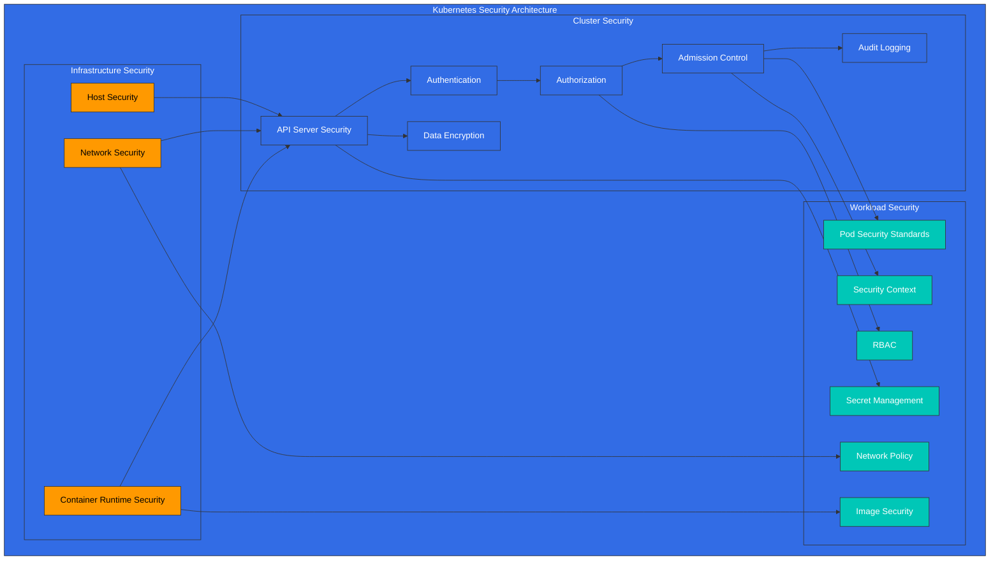
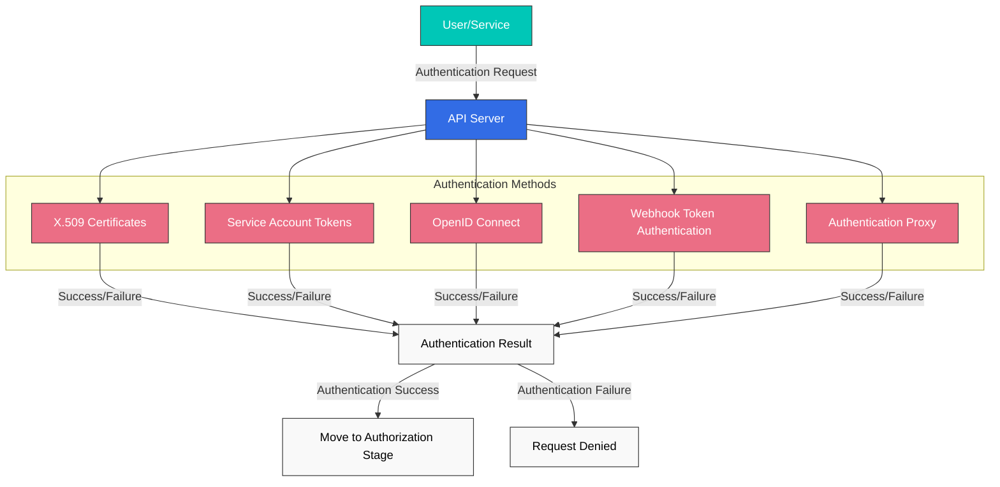
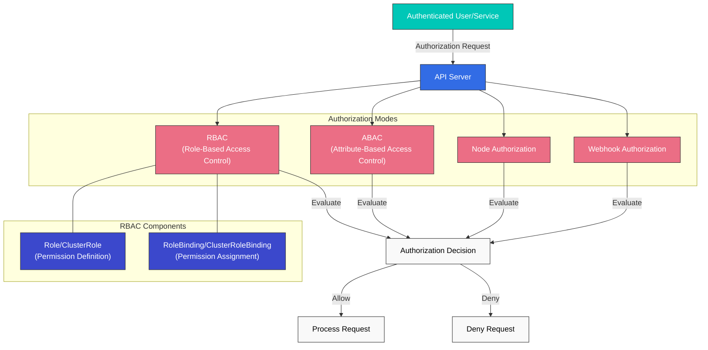
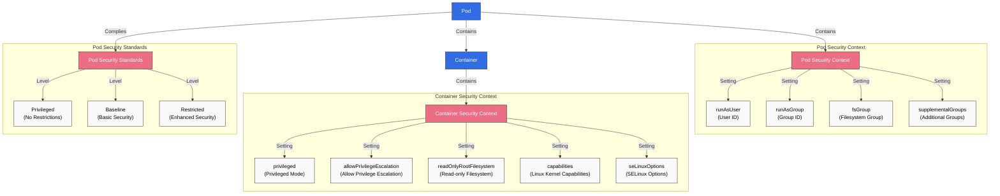
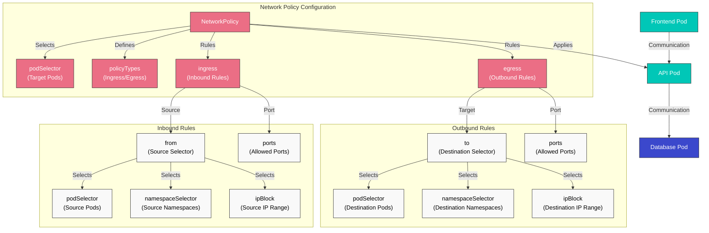
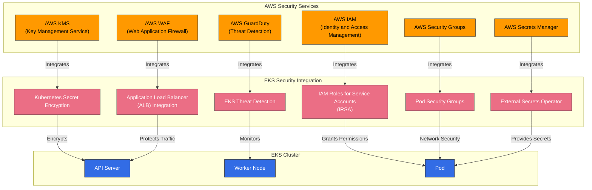

# Kubernetes Security

> **Supported Versions**: Kubernetes 1.32, 1.33, 1.34
> **最終更新**: February 23, 2026

Kubernetes において、security（セキュリティ）は cluster と application を保護するための重要な要素です。この章では、Kubernetes security の概念、authentication と authorization の仕組み、network policies、security contexts、そして Amazon EKS で security を強化する方法について見ていきます。

## Lab Environment Setup

このドキュメントの例を試すには、次のツールと環境が必要です。

### Required Tools
- kubectl v1.34 以上
- 稼働中の Kubernetes cluster（EKS、minikube、kind など）
- OpenSSL（certificate 作成用）

### Security Example Setup

```bash
# Create namespace
kubectl create namespace security-demo

# Create service account
kubectl -n security-demo create serviceaccount demo-sa

# Create role
kubectl -n security-demo apply -f - <<EOF
apiVersion: rbac.authorization.k8s.io/v1
kind: Role
metadata:
  name: pod-reader
rules:
- apiGroups: [""]
  resources: ["pods"]
  verbs: ["get", "watch", "list"]
EOF

# Create role binding
kubectl -n security-demo apply -f - <<EOF
apiVersion: rbac.authorization.k8s.io/v1
kind: RoleBinding
metadata:
  name: read-pods
subjects:
- kind: ServiceAccount
  name: demo-sa
  namespace: security-demo
roleRef:
  kind: Role
  name: pod-reader
  apiGroup: rbac.authorization.k8s.io
EOF

# Create Pod with security context
kubectl -n security-demo apply -f - <<EOF
apiVersion: v1
kind: Pod
metadata:
  name: security-context-demo
spec:
  serviceAccountName: demo-sa
  securityContext:
    runAsUser: 1000
    runAsGroup: 3000
    fsGroup: 2000
  containers:
  - name: sec-ctx-demo
    image: busybox
    command: ["sh", "-c", "sleep 3600"]
    securityContext:
      allowPrivilegeEscalation: false
      readOnlyRootFilesystem: true
EOF
```

## Kubernetes Security Architecture



## Table of Contents
1. [Security Overview](#security-overview)
2. [Authentication](#authentication)
3. [Authorization](#authorization)
4. [Security Context](#security-context)
5. [Network Policy](#network-policy)
6. [Secret Management](#secret-management)
7. [Image Security](#image-security)
8. [Pod Security Standards](#pod-security-standards)
9. [Audit Logging](#audit-logging)
10. [EKS Security Best Practices](#eks-security-best-practices)

## Security Overview

> **Key Concept**: Kubernetes security は Defense in Depth（多層防御）アプローチに従い、infrastructure、cluster、workload の各レベルで複数の security mechanisms を提供します。

Kubernetes security は、次の主要領域で構成されます。

### Security Area Comparison

| Security Area | Main Components | Responsible Party | Security Mechanisms |
|--------------|-----------------|-------------------|---------------------|
| **Infrastructure Security** | Host OS, Container Runtime, Network | Cluster Administrator | Firewall, OS hardening, Container runtime security |
| **Cluster Security** | API Server, etcd, kubelet | Cluster Administrator | Authentication, Authorization, Admission Control, Encryption |
| **Workload Security** | Pods, Containers, Services | Application Developer | Security Context, Network Policy, RBAC |

### Security Principles

1. **Principle of Least Privilege**: 必要最小限の permissions のみを付与します
2. **Defense in Depth**: 複数の security layers によって防御します
3. **Default Deny**: 明示的に許可されていないものはすべて拒否します
4. **Security Hardening**: defaults より強力な security settings を適用します
5. **Continuous Monitoring**: security events を検出し、対応します

## Authentication

Authentication は、user または service account が誰であるかを検証する process です。Kubernetes はさまざまな authentication methods をサポートしています。

### Authentication Methods

1. **X.509 Certificates**: TLS client certificates を使用した authentication
2. **Service Account Tokens**: JWT tokens を使用した service account authentication
3. **OpenID Connect (OIDC)**: external identity providers を通じた authentication
4. **Webhook Token Authentication**: external authentication services を通じた authentication
5. **Authentication Proxy**: proxy を通じた authentication

### Service Account Example

```yaml
apiVersion: v1
kind: ServiceAccount
metadata:
  name: my-service-account
  namespace: default
---
apiVersion: v1
kind: Secret
metadata:
  name: my-service-account-token
  annotations:
    kubernetes.io/service-account.name: my-service-account
type: kubernetes.io/service-account-token
```

## Authentication

Kubernetes API server にアクセスするには、authentication process を通過する必要があります。Kubernetes はさまざまな authentication methods をサポートしています。



### X.509 Certificates

Kubernetes は TLS certificates を使用して clients を authenticate します。これは主に internal cluster communication と administrator authentication に使用されます。

```bash
# Example kubeconfig setup for certificate-based authentication
kubectl config set-credentials admin --client-certificate=admin.crt --client-key=admin.key
```

### Service Account Tokens

Service accounts は、Pods 内で実行される processes が API server と通信するために使用する accounts です。各 service account には自動生成された token があり、Pods に自動的に mount されます。

```yaml
apiVersion: v1
kind: ServiceAccount
metadata:
  name: my-service-account
  namespace: default
```

```yaml
apiVersion: v1
kind: Pod
metadata:
  name: my-pod
spec:
  serviceAccountName: my-service-account
  containers:
  - name: my-container
    image: nginx:1.19
```

### OpenID Connect (OIDC)

external identity providers（例: AWS IAM、Google、Azure AD）を通じた authentication をサポートします。これは enterprise environments で Single Sign-On (SSO) を実装する場合に役立ちます。

```bash
# Example kubeconfig setup using OIDC
kubectl config set-credentials oidc-user \
  --auth-provider=oidc \
  --auth-provider-arg=idp-issuer-url=https://accounts.google.com \
  --auth-provider-arg=client-id=<CLIENT_ID> \
  --auth-provider-arg=client-secret=<CLIENT_SECRET>
```

### Webhook Token Authentication

external authentication service を通じて tokens を検証する方法です。API server は tokens を external service に転送し、その service が token を検証して user information を返します。

### Authentication Proxy

authentication proxy を API server の前段に配置し、user authentication を処理する方法です。proxy は authenticated user information を HTTP headers に含め、API server に転送します。

## Authorization

Authentication が「あなたが誰か」を検証する process であるなら、authorization は「あなたが何をできるか」を判断する process です。Kubernetes はさまざまな authorization modes をサポートしています。



### RBAC (Role-Based Access Control)

RBAC は Kubernetes で最も広く使用されている authorization mechanism です。Roles と RoleBindings を通じて、users または service accounts に特定の resources に対する specific permissions を付与します。

#### Role and ClusterRole

Roles は namespace 内の permissions を定義し、ClusterRoles は cluster 全体に適用される permissions を定義します。

```yaml
# Namespace Role example
apiVersion: rbac.authorization.k8s.io/v1
kind: Role
metadata:
  namespace: default
  name: pod-reader
rules:
- apiGroups: [""]
  resources: ["pods"]
  verbs: ["get", "watch", "list"]
```

```yaml
# Cluster-wide ClusterRole example
apiVersion: rbac.authorization.k8s.io/v1
kind: ClusterRole
metadata:
  name: secret-reader
rules:
- apiGroups: [""]
  resources: ["secrets"]
  verbs: ["get", "watch", "list"]
```

#### RoleBinding and ClusterRoleBinding

RoleBinding は、特定の namespace 内で Role または ClusterRole を users、groups、または service accounts に bind します。ClusterRoleBinding は、cluster 全体で ClusterRole を users、groups、または service accounts に bind します。

```yaml
# RoleBinding example
apiVersion: rbac.authorization.k8s.io/v1
kind: RoleBinding
metadata:
  name: read-pods
  namespace: default
subjects:
- kind: User
  name: jane
  apiGroup: rbac.authorization.k8s.io
roleRef:
  kind: Role
  name: pod-reader
  apiGroup: rbac.authorization.k8s.io
```

```yaml
# ClusterRoleBinding example
apiVersion: rbac.authorization.k8s.io/v1
kind: ClusterRoleBinding
metadata:
  name: read-secrets-global
subjects:
- kind: Group
  name: manager
  apiGroup: rbac.authorization.k8s.io
roleRef:
  kind: ClusterRole
  name: secret-reader
  apiGroup: rbac.authorization.k8s.io
```

### ABAC (Attribute-Based Access Control)

ABAC は、user attributes、resource attributes、environment attributes などに基づいて permissions を付与する方法です。Kubernetes では、policies は JSON files を通じて定義されます。より柔軟である一方、management complexity のため RBAC ほど一般的には使用されません。

### Node Authorization

Node authorization は、kubelets が API server にアクセスするときに使用される特別な authorization mode です。Kubelets は、自身が実行されている nodes に関連する resources（Pods、node status など）にのみアクセスできます。

### Webhook Authorization

external service を通じて authorization decisions を行う方法です。API server は authorization requests を external service に転送し、その service が request を許可するか拒否するかを判断します。

## Security Context

Security context は、Pod または container level で security settings を定義します。これにより、privileges、access control、capabilities などをきめ細かく制御できます。



### Pod Security Context

```yaml
apiVersion: v1
kind: Pod
metadata:
  name: security-context-pod
spec:
  securityContext:
    runAsUser: 1000
    runAsGroup: 3000
    fsGroup: 2000
  containers:
  - name: security-context-container
    image: nginx:1.19
    securityContext:
      allowPrivilegeEscalation: false
      capabilities:
        drop:
        - ALL
      readOnlyRootFilesystem: true
```

上の例では次のようになります。
- `runAsUser`: container process が実行される User ID
- `runAsGroup`: container process が実行される Group ID
- `fsGroup`: volumes にアクセスするときに使用される Group ID
- `allowPrivilegeEscalation`: process が parent process より多くの privileges を取得できるかどうか
- `capabilities`: Linux kernel capabilities を追加または削除します
- `readOnlyRootFilesystem`: root filesystem を read-only として mount します

### Pod Security Standards

Kubernetes 1.25 以降、Pod Security Policy は Pod Security Standards に置き換えられました。Pod Security Standards は 3 つの policy levels を定義します。

1. **Privileged**: 制限なし、すべての privileges が許可されます
2. **Baseline**: 既知の privilege escalation paths をブロックします
3. **Restricted**: 強力に harden された security policy

```yaml
# Example applying Pod Security Standards to namespace
apiVersion: v1
kind: Namespace
metadata:
  name: my-namespace
  labels:
    pod-security.kubernetes.io/enforce: restricted
    pod-security.kubernetes.io/audit: restricted
    pod-security.kubernetes.io/warn: restricted
```

## Network Policy

Network policies は、Pods 間の communication を制御する方法を提供します。デフォルトでは、Kubernetes cluster 内のすべての Pods は相互に通信できますが、network policies を使用してこれを制限できます。



```yaml
apiVersion: networking.k8s.io/v1
kind: NetworkPolicy
metadata:
  name: api-allow
  namespace: default
spec:
  podSelector:
    matchLabels:
      app: api
  policyTypes:
  - Ingress
  - Egress
  ingress:
  - from:
    - podSelector:
        matchLabels:
          app: frontend
    ports:
    - protocol: TCP
      port: 8080
  egress:
  - to:
    - podSelector:
        matchLabels:
          app: database
    ports:
    - protocol: TCP
      port: 5432
```

上の例では次のようになります。
- `api` label を持つ Pods の network policy を定義します
- `frontend` label を持つ Pods から port 8080 への inbound traffic のみを許可します
- `database` label を持つ Pods の port 5432 への outbound traffic のみを許可します

network policies を使用するには、cluster の network plugin が network policies をサポートしている必要があります。Calico、Cilium、Antrea などの CNI plugins は network policies をサポートしています。

## Secret Management

Kubernetes Secrets は、passwords、API keys、certificates などの sensitive information を保存および管理するために使用されます。ただし、デフォルトでは secrets は base64 encoded されるだけで、encrypted されません。そのため、追加の security measures が必要です。

### Secret Encryption

etcd に保存される secrets を encrypt するには、API server の encryption configuration を設定する必要があります。

```yaml
apiVersion: apiserver.config.k8s.io/v1
kind: EncryptionConfiguration
resources:
  - resources:
      - secrets
    providers:
      - aescbc:
          keys:
            - name: key1
              secret: <base64-encoded-key>
      - identity: {}
```

### External Secret Management

より安全な secret management のために、external secret management systems を使用できます。

- HashiCorp Vault
- AWS Secrets Manager
- Azure Key Vault
- Google Secret Manager
- External Secrets Operator

## Image Security

Container image security は Kubernetes security の重要な部分です。

### Image Vulnerability Scanning

container images の vulnerabilities を scan し、既知の security issues を特定して解決します。

- Trivy
- Clair
- Anchore
- AWS ECR Scan
- Docker Hub Scan

### Image Signing and Verification

image signing を通じて images の origin と integrity を検証します。

- Notary
- Cosign
- Portieris
- AWS Signer
- Connaisseur

### Image Policies

image policies を通じて、trusted registries からのみ images を pull するよう制限します。

```yaml
apiVersion: admission.k8s.io/v1
kind: AdmissionConfiguration
plugins:
- name: ImagePolicyWebhook
  configuration:
    imagePolicy:
      kubeConfigFile: /path/to/kubeconfig
      allowTTL: 50
      denyTTL: 50
      retryBackoff: 500
      defaultAllow: false
```

## Audit

Kubernetes auditing は、cluster 内で発生する events を記録および分析する mechanism を提供します。

### Audit Policy

Audit policies は、どの events を記録するかを定義します。

```yaml
apiVersion: audit.k8s.io/v1
kind: Policy
rules:
- level: Metadata
  resources:
  - group: ""
    resources: ["pods"]
- level: Request
  resources:
  - group: ""
    resources: ["secrets"]
- level: None
  users: ["system:kube-proxy"]
  resources:
  - group: ""
    resources: ["endpoints", "services"]
```

Audit levels:
- `None`: events を記録しません
- `Metadata`: request metadata（user、time、resource など）のみを記録します
- `Request`: request metadata と request body を記録します
- `RequestResponse`: request metadata、request body、response body を記録します

### Audit Log Backends

Audit logs はさまざまな backends に保存できます。
- File
- Webhook
- Dynamic backends（例: Elasticsearch、Loki）

## Amazon EKS Security Enhancement

Amazon EKS は、Kubernetes の基本的な security features に加えて、AWS security services と統合することで security を強化できます。



### IAM Roles and Service Accounts (IRSA)

IRSA (IAM Roles for Service Accounts) を使用すると、IAM roles を Kubernetes service accounts に関連付けて、AWS services に安全にアクセスできます。

```bash
# Create OIDC provider
eksctl utils associate-iam-oidc-provider --cluster my-cluster --approve

# Create IAM role and associate with service account
eksctl create iamserviceaccount \
  --name my-service-account \
  --namespace default \
  --cluster my-cluster \
  --attach-policy-arn arn:aws:iam::aws:policy/AmazonS3ReadOnlyAccess \
  --approve
```

### Secret Encryption with AWS KMS

AWS KMS を使用して、EKS cluster 内の Kubernetes secrets を encrypt できます。

```bash
# Create KMS key
aws kms create-key --description "EKS Secret Encryption Key"

# Specify KMS key when creating EKS cluster
eksctl create cluster --name my-cluster --encryption-provider-key-arn arn:aws:kms:region:account-id:key/key-id
```

### AWS Security Groups

AWS security groups を EKS cluster nodes と Pods に適用し、network traffic を制御します。

```bash
# Create security group
aws ec2 create-security-group --group-name eks-cluster-sg --description "EKS Cluster Security Group"

# Add inbound rule
aws ec2 authorize-security-group-ingress \
  --group-id sg-12345 \
  --protocol tcp \
  --port 443 \
  --cidr 10.0.0.0/16
```

### AWS WAF

AWS WAF (Web Application Firewall) を EKS clusters の前段に配置し、web applications を保護します。

```bash
# Create WAF Web ACL
aws wafv2 create-web-acl \
  --name eks-web-acl \
  --scope REGIONAL \
  --default-action Allow={} \
  --visibility-config SampledRequestsEnabled=true,CloudWatchMetricsEnabled=true,MetricName=eks-web-acl
```

### AWS GuardDuty

AWS GuardDuty を使用して、EKS clusters の security threats を検出し、対応します。

```bash
# Enable GuardDuty
aws guardduty create-detector --enable

# Enable EKS protection
aws guardduty update-detector \
  --detector-id 12abc34d567e8fa901bc2d34e56789f0 \
  --features '[{"Name": "EKS_RUNTIME_MONITORING", "Status": "ENABLED"}]'
```

## Security Best Practices

Kubernetes clusters と workloads の security を強化するための best practices は次のとおりです。

### Cluster Security

1. **Keep Versions Up to Date**: Kubernetes とすべての components を最新の状態に保ち、既知の vulnerabilities に patch を適用します。
2. **Restrict API Server Access**: API server への access を制限し、必要な場合にのみ public access を許可します。
3. **etcd Encryption**: etcd に保存される data を encrypt し、sensitive information を保護します。
4. **Enable Audit Logging**: audit logging を有効にし、cluster activity を monitor および analyze します。
5. **Implement Network Policies**: network policies を実装し、Pod-to-Pod communication を制限します。

### Workload Security

1. **Principle of Least Privilege**: Pods と containers に必要最小限の permissions のみを付与します。
2. **Non-root User**: containers を non-root users として実行します。
3. **Read-only Filesystem**: 可能な場合、container root filesystems を read-only として mount します。
4. **Resource Limits**: CPU と memory resource limits を設定し、DoS attacks を防止します。
5. **Configure Security Context**: Pod と container security contexts を適切に設定します。

### Image Security

1. **Minimal Base Images**: 最小限の packages のみを含む base images を使用します。
2. **Image Vulnerability Scanning**: container images の vulnerabilities を定期的に scan します。
3. **Image Signing and Verification**: image signing を通じて images の origin と integrity を検証します。
4. **Trusted Registries**: trusted registries からのみ images を pull します。
5. **Use Latest Images**: 既知の vulnerabilities に patch を適用するため、images を定期的に update します。

### Secret Management

1. **External Secret Management**: external secret management systems を使用して secrets を安全に管理します。
2. **Secret Encryption**: etcd に保存される secrets を encrypt します。
3. **Secret Rotation**: security を強化するため、secrets を定期的に rotate します。
4. **Minimum Privilege Access**: secrets への access を必要な Pods のみに制限します。
5. **Use Volumes Instead of Environment Variables**: environment variables の代わりに volumes を通じて secrets を mount します。

## Conclusion

Kubernetes security は、cluster infrastructure、Kubernetes components、application workloads などすべての領域で security を考慮し、複数の layers で実装する必要があります。authentication、authorization、network policies、security contexts などの Kubernetes の基本的な security features に加え、image security、secret management、audit logging などの追加の security measures によって、cluster と workload の security を強化できます。

Amazon EKS を使用する場合、さまざまな AWS security services と統合することで、security をさらに強化できます。IAM Roles and Service Accounts (IRSA)、AWS KMS による secret encryption、AWS Security Groups、AWS WAF、AWS GuardDuty などの services を使用して、EKS cluster security を改善できます。

Security は継続的な process であるため、定期的な security assessments と updates を通じて、clusters と workloads の security posture を維持することが重要です。

## Quiz

この章で学んだ内容を確認するには、[Security Quiz](../quizzes/core/06-security-quiz.md) に挑戦してください。

## References

- [Kubernetes Official Documentation - Security](https://kubernetes.io/docs/concepts/security/)
- [Kubernetes Official Documentation - Authentication](https://kubernetes.io/docs/reference/access-authn-authz/authentication/)
- [Kubernetes Official Documentation - Authorization](https://kubernetes.io/docs/reference/access-authn-authz/authorization/)
- [Kubernetes Official Documentation - RBAC](https://kubernetes.io/docs/reference/access-authn-authz/rbac/)
- [Kubernetes Official Documentation - Network Policies](https://kubernetes.io/docs/concepts/services-networking/network-policies/)
- [Kubernetes Official Documentation - Security Context](https://kubernetes.io/docs/tasks/configure-pod-container/security-context/)
- [Kubernetes Official Documentation - Pod Security Standards](https://kubernetes.io/docs/concepts/security/pod-security-standards/)
- [Kubernetes Official Documentation - Secrets](https://kubernetes.io/docs/concepts/configuration/secret/)
- [Kubernetes Official Documentation - Audit](https://kubernetes.io/docs/tasks/debug-application-cluster/audit/)
- [Amazon EKS Official Documentation - Security](https://docs.aws.amazon.com/eks/latest/userguide/security.html)
- [Amazon EKS Official Documentation - IAM Roles for Service Accounts](https://docs.aws.amazon.com/eks/latest/userguide/iam-roles-for-service-accounts.html)
- [Amazon EKS Official Documentation - Secret Encryption](https://docs.aws.amazon.com/eks/latest/userguide/enable-kms.html)
- [AWS Security Blog - EKS Security Best Practices](https://aws.amazon.com/blogs/containers/amazon-eks-security-best-practices/)
