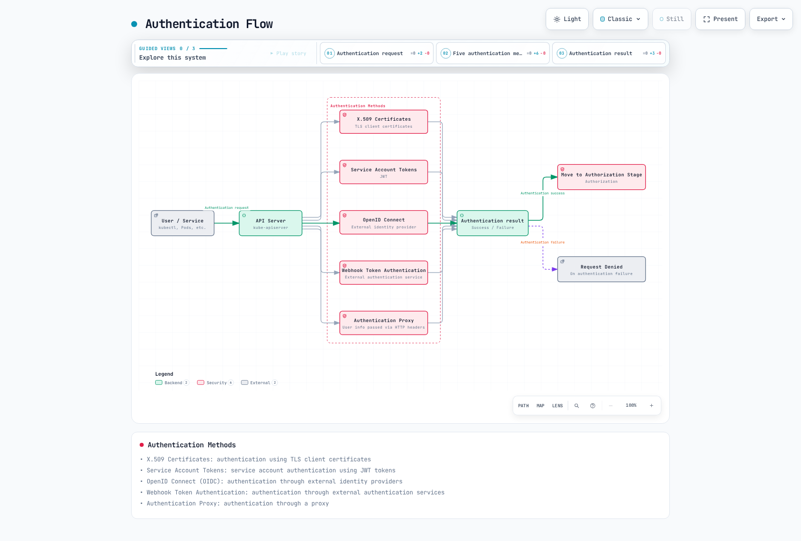

# Kubernetes Security

> **対応バージョン**: Kubernetes 1.32, 1.33, 1.34
> **最終更新**: February 23, 2026

Kubernetes では、Security は Cluster と Application を保護するための重要な要素です。この章では、Kubernetes Security の概念、Authentication と Authorization の仕組み、Network Policy、Security Context、および Amazon EKS で Security を強化する方法について学びます。

## Lab 環境のセットアップ

このドキュメントの例を実行するには、次の Tools と環境が必要です。

### 必要な Tools
- kubectl v1.34 以降
- 動作する Kubernetes Cluster（EKS、minikube、kind など）
- OpenSSL（Certificate の作成用）

### Security 例のセットアップ

```bash
# Create namespace
kubectl create namespace security-demo

# Create service account
kubectl -n security-demo create serviceaccount demo-sa

# Create role
kubectl -n security-demo apply -f - <<EOF
apiVersion: rbac.authorization.k8s.io/v1
kind: Role
metadata:
  name: pod-reader
rules:
- apiGroups: [""]
  resources: ["pods"]
  verbs: ["get", "watch", "list"]
EOF

# Create role binding
kubectl -n security-demo apply -f - <<EOF
apiVersion: rbac.authorization.k8s.io/v1
kind: RoleBinding
metadata:
  name: read-pods
subjects:
- kind: ServiceAccount
  name: demo-sa
  namespace: security-demo
roleRef:
  kind: Role
  name: pod-reader
  apiGroup: rbac.authorization.k8s.io
EOF

# Create Pod with security context
kubectl -n security-demo apply -f - <<EOF
apiVersion: v1
kind: Pod
metadata:
  name: security-context-demo
spec:
  serviceAccountName: demo-sa
  securityContext:
    runAsUser: 1000
    runAsGroup: 3000
    fsGroup: 2000
  containers:
  - name: sec-ctx-demo
    image: busybox
    command: ["sh", "-c", "sleep 3600"]
    securityContext:
      allowPrivilegeEscalation: false
      readOnlyRootFilesystem: true
EOF
```

## Kubernetes Security アーキテクチャ


[🔍 インタラクティブな図を表示](https://www.atomai.click/kubernetes-docs/archmaps/en-core-06-security-0.html)

## 目次
1. [Security の概要](#security-overview)
2. [Authentication](#authentication)
3. [Authorization](#authorization)
4. [Security Context](#security-context)
5. [Network Policy](#network-policy)
6. [Secret Management](#secret-management)
7. [Image Security](#image-security)
8. [Pod Security Standards](#pod-security-standards)
9. [Audit Logging](#audit-logging)
10. [EKS Security のベストプラクティス](#eks-security-best-practices)

## Security の概要

> **重要な概念**: Kubernetes Security は、インフラストラクチャ、Cluster、Workload の各レベルで複数の Security の仕組みを提供する、Defense in Depth アプローチに従います。

Kubernetes Security は、次の主な領域で構成されます。

### Security 領域の比較

| Security 領域 | 主な Components | 担当者 | Security の仕組み |
|--------------|-----------------|-------------------|---------------------|
| **Infrastructure Security** | Host OS、Container Runtime、Network | Cluster Administrator | Firewall、OS Hardening、Container Runtime Security |
| **Cluster Security** | API Server、etcd、kubelet | Cluster Administrator | Authentication、Authorization、Admission Control、Encryption |
| **Workload Security** | Pods、Containers、Services | Application Developer | Security Context、Network Policy、RBAC |

### Security の原則

1. **最小権限の原則**: 必要最小限の権限のみを付与する
2. **Defense in Depth**: 複数の Security 層によって防御する
3. **Default Deny**: 明示的に許可されていないものはすべて拒否する
4. **Security Hardening**: Default よりも強固な Security 設定を適用する
5. **継続的な Monitoring**: Security Event を検知して対応する

## Authentication

Authentication は、User または Service Account が誰であるかを検証するプロセスです。Kubernetes はさまざまな Authentication 方法をサポートしています。

### Authentication 方法

1. **X.509 Certificates**: TLS Client Certificate を使用した Authentication
2. **Service Account Tokens**: JWT Token を使用した Service Account Authentication
3. **OpenID Connect (OIDC)**: 外部 Identity Provider を介した Authentication
4. **Webhook Token Authentication**: 外部 Authentication Service を介した Authentication
5. **Authentication Proxy**: Proxy を介した Authentication

### Service Account の例

```yaml
apiVersion: v1
kind: ServiceAccount
metadata:
  name: my-service-account
  namespace: default
---
apiVersion: v1
kind: Secret
metadata:
  name: my-service-account-token
  annotations:
    kubernetes.io/service-account.name: my-service-account
type: kubernetes.io/service-account-token
```

## Authentication

Kubernetes API server にアクセスするには、Authentication プロセスを通過する必要があります。Kubernetes はさまざまな Authentication 方法をサポートしています。



[🔍 インタラクティブな図を表示](https://www.atomai.click/kubernetes-docs/archmaps/en-core-06-security-1.html)

### X.509 Certificates

Kubernetes は TLS Certificates を使用して Client を Authentication します。これは主に、Cluster 内部通信および Administrator Authentication に使用されます。

```bash
# Example kubeconfig setup for certificate-based authentication
kubectl config set-credentials admin --client-certificate=admin.crt --client-key=admin.key
```

### Service Account Tokens

Service Account は、Pod 内で実行される Process が API server と通信するために使用する Account です。各 Service Account には自動生成された Token があり、Pod に自動的に Mount されます。

```yaml
apiVersion: v1
kind: ServiceAccount
metadata:
  name: my-service-account
  namespace: default
```

```yaml
apiVersion: v1
kind: Pod
metadata:
  name: my-pod
spec:
  serviceAccountName: my-service-account
  containers:
  - name: my-container
    image: nginx:1.19
```

### OpenID Connect (OIDC)

外部 Identity Provider（例: AWS IAM、Google、Azure AD）を介した Authentication をサポートします。これは Enterprise 環境で Single Sign-On (SSO) を実装する場合に役立ちます。

```bash
# Example kubeconfig setup using OIDC
kubectl config set-credentials oidc-user \
  --auth-provider=oidc \
  --auth-provider-arg=idp-issuer-url=https://accounts.google.com \
  --auth-provider-arg=client-id=<CLIENT_ID> \
  --auth-provider-arg=client-secret=<CLIENT_SECRET>
```

### Webhook Token Authentication

外部 Authentication Service を介して Token を検証する方法です。API server は Token を外部 Service に転送し、その Service が Token を検証して User 情報を返します。

### Authentication Proxy

API server の前に Authentication Proxy を配置して User Authentication を処理する方法です。Proxy は Authentication 済みの User 情報を HTTP Header に含め、API server に転送します。

## Authorization

Authentication が「あなたが誰であるか」を検証するプロセスであるのに対し、Authorization は「あなたが何を実行できるか」を判断するプロセスです。Kubernetes はさまざまな Authorization Mode をサポートしています。


[🔍 インタラクティブな図を表示](https://www.atomai.click/kubernetes-docs/archmaps/en-core-06-security-2.html)

### RBAC (Role-Based Access Control)

RBAC は Kubernetes で最も広く使用されている Authorization の仕組みです。Roles と RoleBindings を通じて、特定の Resource に対する特定の権限を User または Service Account に付与します。

#### Role と ClusterRole

Roles は Namespace 内の権限を定義し、ClusterRoles は Cluster 全体に適用される権限を定義します。

```yaml
# Namespace Role example
apiVersion: rbac.authorization.k8s.io/v1
kind: Role
metadata:
  namespace: default
  name: pod-reader
rules:
- apiGroups: [""]
  resources: ["pods"]
  verbs: ["get", "watch", "list"]
```

```yaml
# Cluster-wide ClusterRole example
apiVersion: rbac.authorization.k8s.io/v1
kind: ClusterRole
metadata:
  name: secret-reader
rules:
- apiGroups: [""]
  resources: ["secrets"]
  verbs: ["get", "watch", "list"]
```

#### RoleBinding と ClusterRoleBinding

RoleBinding は、特定の Namespace 内の User、Group、または Service Account に Role または ClusterRole を Binding します。ClusterRoleBinding は、Cluster 全体の User、Group、または Service Account に ClusterRole を Binding します。

```yaml
# RoleBinding example
apiVersion: rbac.authorization.k8s.io/v1
kind: RoleBinding
metadata:
  name: read-pods
  namespace: default
subjects:
- kind: User
  name: jane
  apiGroup: rbac.authorization.k8s.io
roleRef:
  kind: Role
  name: pod-reader
  apiGroup: rbac.authorization.k8s.io
```

```yaml
# ClusterRoleBinding example
apiVersion: rbac.authorization.k8s.io/v1
kind: ClusterRoleBinding
metadata:
  name: read-secrets-global
subjects:
- kind: Group
  name: manager
  apiGroup: rbac.authorization.k8s.io
roleRef:
  kind: ClusterRole
  name: secret-reader
  apiGroup: rbac.authorization.k8s.io
```

### ABAC (Attribute-Based Access Control)

ABAC は、User Attribute、Resource Attribute、Environment Attribute などに基づいて権限を付与する方法です。Kubernetes では、Policy を JSON File で定義します。RBAC より柔軟ですが、管理が複雑なため、あまり使用されません。

### Node Authorization

Node Authorization は、kubelet が API server にアクセスするときに使用される特別な Authorization Mode です。kubelet は、それが実行されている Node に関連する Resource（Pods、Node Status など）にのみアクセスできます。

### Webhook Authorization

外部 Service を介して Authorization の判断を行う方法です。API server は Authorization Request を外部 Service に転送し、Service が Request を許可するか拒否するかを判断します。

## Security Context

Security Context は、Pod または Container レベルの Security 設定を定義します。これにより、Privilege、Access Control、Capabilities などを詳細に制御できます。


[🔍 インタラクティブな図を表示](https://www.atomai.click/kubernetes-docs/archmaps/en-core-06-security-3.html)

### Pod Security Context

```yaml
apiVersion: v1
kind: Pod
metadata:
  name: security-context-pod
spec:
  securityContext:
    runAsUser: 1000
    runAsGroup: 3000
    fsGroup: 2000
  containers:
  - name: security-context-container
    image: nginx:1.19
    securityContext:
      allowPrivilegeEscalation: false
      capabilities:
        drop:
        - ALL
      readOnlyRootFilesystem: true
```

上記の例では:
- `runAsUser`: Container Process が実行される User ID
- `runAsGroup`: Container Process が実行される Group ID
- `fsGroup`: Volume へのアクセス時に使用する Group ID
- `allowPrivilegeEscalation`: Process が親 Process より多くの Privilege を取得できるかどうか
- `capabilities`: Linux Kernel Capabilities を追加または削除する
- `readOnlyRootFilesystem`: Root Filesystem を Read-only として Mount する

### Pod Security Standards

Kubernetes 1.25 以降、Pod Security Policy は Pod Security Standards に置き換えられました。Pod Security Standards は 3 つの Policy Level を定義します。

1. **Privileged**: 制限なし、すべての Privilege を許可
2. **Baseline**: 既知の Privilege Escalation 経路を Block
3. **Restricted**: 強く Hardening された Security Policy

```yaml
# Example applying Pod Security Standards to namespace
apiVersion: v1
kind: Namespace
metadata:
  name: my-namespace
  labels:
    pod-security.kubernetes.io/enforce: restricted
    pod-security.kubernetes.io/audit: restricted
    pod-security.kubernetes.io/warn: restricted
```

## Network Policy

Network Policy は、Pod 間の通信を制御する方法を提供します。Default では Kubernetes Cluster 内のすべての Pod が相互に通信できますが、Network Policy を使用してこれを制限できます。


[🔍 インタラクティブな図を表示](https://www.atomai.click/kubernetes-docs/archmaps/en-core-06-security-4.html)

```yaml
apiVersion: networking.k8s.io/v1
kind: NetworkPolicy
metadata:
  name: api-allow
  namespace: default
spec:
  podSelector:
    matchLabels:
      app: api
  policyTypes:
  - Ingress
  - Egress
  ingress:
  - from:
    - podSelector:
        matchLabels:
          app: frontend
    ports:
    - protocol: TCP
      port: 8080
  egress:
  - to:
    - podSelector:
        matchLabels:
          app: database
    ports:
    - protocol: TCP
      port: 5432
```

上記の例では:
- `api` Label を持つ Pod の Network Policy を定義します
- `frontend` Label を持つ Pod からの Port 8080 への Inbound Traffic のみを許可します
- `database` Label を持つ Pod への Port 5432 の Outbound Traffic のみを許可します

Network Policy を使用するには、Cluster の Network Plugin が Network Policy をサポートしている必要があります。Calico、Cilium、Antrea などの CNI Plugin は Network Policy をサポートしています。

## Secret Management

Kubernetes Secrets は、Password、API Key、Certificate などの機密情報を保存および管理するために使用されます。ただし、Default では Secret は暗号化されず、base64 Encode されるだけです。したがって、追加の Security 対策が必要です。

### Secret Encryption

etcd に保存される Secret を暗号化するには、API server の Encryption Configuration を設定する必要があります。

```yaml
apiVersion: apiserver.config.k8s.io/v1
kind: EncryptionConfiguration
resources:
  - resources:
      - secrets
    providers:
      - aescbc:
          keys:
            - name: key1
              secret: <base64-encoded-key>
      - identity: {}
```

### External Secret Management

より安全な Secret Management のために、外部 Secret Management System を使用できます。

- HashiCorp Vault
- AWS Secrets Manager
- Azure Key Vault
- Google Secret Manager
- External Secrets Operator

## Image Security

Container Image Security は Kubernetes Security の重要な要素です。

### Image Vulnerability Scanning

Container Image を Vulnerability Scan して、既知の Security Issue を特定および解決します。

- Trivy
- Clair
- Anchore
- AWS ECR Scan
- Docker Hub Scan

### Image Signing and Verification

Image Signing により Image の Origin と Integrity を検証します。

- Notary
- Cosign
- Portieris
- AWS Signer
- Connaisseur

### Image Policies

Image Policy により、信頼できる Registry からのみ Image を Pull するように制限します。

```yaml
apiVersion: admission.k8s.io/v1
kind: AdmissionConfiguration
plugins:
- name: ImagePolicyWebhook
  configuration:
    imagePolicy:
      kubeConfigFile: /path/to/kubeconfig
      allowTTL: 50
      denyTTL: 50
      retryBackoff: 500
      defaultAllow: false
```

## Audit

Kubernetes Auditing は、Cluster 内で発生する Event を記録および分析する仕組みを提供します。

### Audit Policy

Audit Policy は、記録する Event を定義します。

```yaml
apiVersion: audit.k8s.io/v1
kind: Policy
rules:
- level: Metadata
  resources:
  - group: ""
    resources: ["pods"]
- level: Request
  resources:
  - group: ""
    resources: ["secrets"]
- level: None
  users: ["system:kube-proxy"]
  resources:
  - group: ""
    resources: ["endpoints", "services"]
```

Audit Level:
- `None`: Event を記録しない
- `Metadata`: Request Metadata（User、Time、Resource など）のみを記録する
- `Request`: Request Metadata と Request Body を記録する
- `RequestResponse`: Request Metadata、Request Body、Response Body を記録する

### Audit Log Backends

Audit Log はさまざまな Backend に保存できます。
- File
- Webhook
- Dynamic Backends（例: Elasticsearch、Loki）

## Amazon EKS Security の強化

Amazon EKS では、Kubernetes の基本的な Security 機能に加え、AWS Security Service と統合することで Security を強化できます。


[🔍 インタラクティブな図を表示](https://www.atomai.click/kubernetes-docs/archmaps/en-core-06-security-5.html)

### IAM Roles and Service Accounts (IRSA)

IRSA（IAM Roles for Service Accounts）を使用すると、IAM Role を Kubernetes Service Account に関連付け、AWS Service に安全にアクセスできます。

```bash
# Create OIDC provider
eksctl utils associate-iam-oidc-provider --cluster my-cluster --approve

# Create IAM role and associate with service account
eksctl create iamserviceaccount \
  --name my-service-account \
  --namespace default \
  --cluster my-cluster \
  --attach-policy-arn arn:aws:iam::aws:policy/AmazonS3ReadOnlyAccess \
  --approve
```

### AWS KMS による Secret Encryption

AWS KMS を使用して、EKS Cluster 内の Kubernetes Secret を暗号化できます。

```bash
# Create KMS key
aws kms create-key --description "EKS Secret Encryption Key"

# Specify KMS key when creating EKS cluster
eksctl create cluster --name my-cluster --encryption-provider-key-arn arn:aws:kms:region:account-id:key/key-id
```

### AWS Security Groups

AWS Security Group を EKS Cluster Node と Pod に適用して、Network Traffic を制御します。

```bash
# Create security group
aws ec2 create-security-group --group-name eks-cluster-sg --description "EKS Cluster Security Group"

# Add inbound rule
aws ec2 authorize-security-group-ingress \
  --group-id sg-12345 \
  --protocol tcp \
  --port 443 \
  --cidr 10.0.0.0/16
```

### AWS WAF

AWS WAF（Web Application Firewall）を EKS Cluster の前に配置して、Web Application を保護します。

```bash
# Create WAF Web ACL
aws wafv2 create-web-acl \
  --name eks-web-acl \
  --scope REGIONAL \
  --default-action Allow={} \
  --visibility-config SampledRequestsEnabled=true,CloudWatchMetricsEnabled=true,MetricName=eks-web-acl
```

### AWS GuardDuty

AWS GuardDuty を使用して、EKS Cluster 内の Security Threat を検知して対応します。

```bash
# Enable GuardDuty
aws guardduty create-detector --enable

# Enable EKS protection
aws guardduty update-detector \
  --detector-id 12abc34d567e8fa901bc2d34e56789f0 \
  --features '[{"Name": "EKS_RUNTIME_MONITORING", "Status": "ENABLED"}]'
```

## Security のベストプラクティス

Kubernetes Cluster と Workload の Security を強化するためのベストプラクティスを紹介します。

### Cluster Security

1. **Version を最新に保つ**: Kubernetes とすべての Component を最新に保ち、既知の Vulnerability を Patch します。
2. **API Server Access を制限する**: API server への Access を制限し、必要な場合にのみ Public Access を許可します。
3. **etcd Encryption**: etcd に保存される Data を暗号化して、機密情報を保護します。
4. **Audit Logging を有効にする**: Audit Logging を有効にして、Cluster Activity を Monitoring および分析します。
5. **Network Policy を実装する**: Network Policy を実装して、Pod 間の通信を制限します。

### Workload Security

1. **最小権限の原則**: Pod と Container には必要最小限の権限のみを付与します。
2. **Non-root User**: Container を Non-root User として実行します。
3. **Read-only Filesystem**: 可能な場合は、Container Root Filesystem を Read-only として Mount します。
4. **Resource Limits**: DoS Attack を防ぐために CPU と Memory の Resource Limit を設定します。
5. **Security Context を設定する**: Pod と Container の Security Context を適切に設定します。

### Image Security

1. **Minimal Base Images**: Package を最小限にした Base Image を使用します。
2. **Image Vulnerability Scanning**: Container Image を定期的に Vulnerability Scan します。
3. **Image Signing and Verification**: Image Signing により Image の Origin と Integrity を検証します。
4. **Trusted Registries**: 信頼できる Registry からのみ Image を Pull します。
5. **Latest Images を使用する**: 既知の Vulnerability を Patch するため、Image を定期的に更新します。

### Secret Management

1. **External Secret Management**: 外部 Secret Management System を使用して Secret を安全に管理します。
2. **Secret Encryption**: etcd に保存される Secret を暗号化します。
3. **Secret Rotation**: Security を強化するため、Secret を定期的に Rotate します。
4. **最小権限 Access**: Secret への Access を必要な Pod のみに制限します。
5. **Environment Variable ではなく Volume を使用する**: Environment Variable ではなく Volume を通じて Secret を Mount します。

## まとめ

Kubernetes Security は、Cluster Infrastructure、Kubernetes Component、Application Workload を含むすべての領域で Security を考慮し、複数の Layer で実装する必要があります。Authentication、Authorization、Network Policy、Security Context などの Kubernetes の基本 Security 機能に加え、Image Security、Secret Management、Audit Logging などの追加の Security 対策を通じて、Cluster と Workload の Security を強化できます。

Amazon EKS を使用する場合は、さまざまな AWS Security Service と統合することで、さらに Security を強化できます。IAM Roles and Service Accounts (IRSA)、AWS KMS による Secret Encryption、AWS Security Groups、AWS WAF、AWS GuardDuty などの Service を使用して、EKS Cluster Security を向上できます。

Security は継続的なプロセスであるため、定期的な Security Assessment と Update を通じて、Cluster と Workload の Security Posture を維持することが重要です。

## Quiz

この章で学んだ内容を確認するには、[Security Quiz](../quizzes/core/06-security-quiz.md)に挑戦してください。

## 参考資料

- [Kubernetes 公式ドキュメント - Security](https://kubernetes.io/docs/concepts/security/)
- [Kubernetes 公式ドキュメント - Authentication](https://kubernetes.io/docs/reference/access-authn-authz/authentication/)
- [Kubernetes 公式ドキュメント - Authorization](https://kubernetes.io/docs/reference/access-authn-authz/authorization/)
- [Kubernetes 公式ドキュメント - RBAC](https://kubernetes.io/docs/reference/access-authn-authz/rbac/)
- [Kubernetes 公式ドキュメント - Network Policies](https://kubernetes.io/docs/concepts/services-networking/network-policies/)
- [Kubernetes 公式ドキュメント - Security Context](https://kubernetes.io/docs/tasks/configure-pod-container/security-context/)
- [Kubernetes 公式ドキュメント - Pod Security Standards](https://kubernetes.io/docs/concepts/security/pod-security-standards/)
- [Kubernetes 公式ドキュメント - Secrets](https://kubernetes.io/docs/concepts/configuration/secret/)
- [Kubernetes 公式ドキュメント - Audit](https://kubernetes.io/docs/tasks/debug-application-cluster/audit/)
- [Amazon EKS 公式ドキュメント - Security](https://docs.aws.amazon.com/eks/latest/userguide/security.html)
- [Amazon EKS 公式ドキュメント - IAM Roles for Service Accounts](https://docs.aws.amazon.com/eks/latest/userguide/iam-roles-for-service-accounts.html)
- [Amazon EKS 公式ドキュメント - Secret Encryption](https://docs.aws.amazon.com/eks/latest/userguide/enable-kms.html)
- [AWS Security Blog - EKS Security のベストプラクティス](https://aws.amazon.com/blogs/containers/amazon-eks-security-best-practices/)
