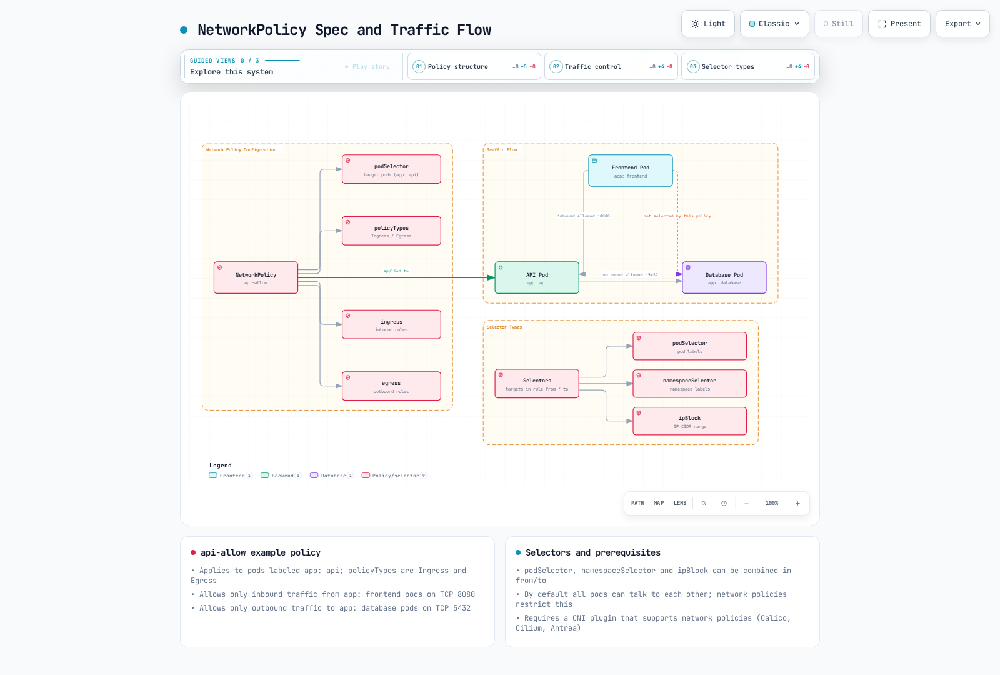
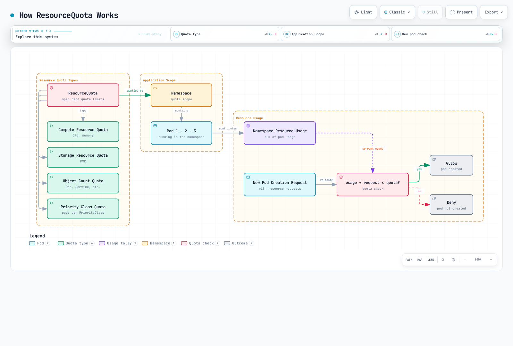

# Kubernetes ポリシー

> **対応バージョン**: Kubernetes 1.32 - 1.34
> **最終更新**: February 22, 2026

Kubernetes におけるポリシーは、クラスターとワークロードの動作を制御・規制するルールの集合です。ポリシーにより、セキュリティ、リソース使用量、ネットワーク通信などのさまざまな側面を管理できます。この章では、Kubernetes のさまざまな種類のポリシー、その実装方法、および Amazon EKS でのポリシー管理について学びます。

## Lab 環境のセットアップ

このドキュメントの例に従うには、次のツールと環境が必要です。

### 必要なツール
- kubectl v1.34 以降
- 動作する Kubernetes クラスター（EKS、minikube、kind など）
- Kyverno CLI（任意）
- OPA Gatekeeper（任意）

### ポリシーの例のセットアップ

```bash
# Create namespace
kubectl create namespace policy-demo

# Create resource quota
kubectl -n policy-demo apply -f - <<EOF
apiVersion: v1
kind: ResourceQuota
metadata:
  name: demo-quota
spec:
  hard:
    requests.cpu: "1"
    requests.memory: 1Gi
    limits.cpu: "2"
    limits.memory: 2Gi
    pods: "10"
EOF

# Create network policy
kubectl -n policy-demo apply -f - <<EOF
apiVersion: networking.k8s.io/v1
kind: NetworkPolicy
metadata:
  name: default-deny
spec:
  podSelector: {}
  policyTypes:
  - Ingress
  - Egress
EOF

# Verify policies
kubectl -n policy-demo get resourcequota,networkpolicy
```

## Kubernetes ポリシーアーキテクチャ


[🔍 インタラクティブな図を表示](https://www.atomai.click/kubernetes-docs/archmaps/en-core-07-policies-0.html)

## ポリシータイプの比較

| ポリシータイプ | 実装メカニズム | 適用レベル | 主な目的 | Kubernetes バージョンサポート |
|------------|--------------------------|-------------------|-----------------|---------------------------|
| **リソースポリシー** | ResourceQuota、LimitRange | Namespace | リソース使用量の制限と管理 | すべてのバージョン |
| **セキュリティポリシー** | Pod Security Standards、PodSecurityPolicy（非推奨） | Pod、Namespace | セキュリティコンテキストの制限 | PSP: ~1.24、PSS: 1.22+ |
| **ネットワークポリシー** | NetworkPolicy | Pod | ネットワークトラフィックの制御 | 1.8+ |
| **カスタムポリシー** | OPA Gatekeeper、Kyverno | Cluster、Namespace、Pod | ユーザー定義ポリシーの適用 | すべてのバージョン（アドオン） |

## リソースポリシー

リソースポリシーは、Kubernetes クラスター内のコンピューティングリソース（CPU、メモリなど）とオブジェクト数（Pod、Service など）を制限・管理するためのメカニズムです。

### ResourceQuota

ResourceQuota は、namespace 内で使用できるリソースの合計量を制限します。

```yaml
apiVersion: v1
kind: ResourceQuota
metadata:
  name: compute-resources
  namespace: dev
spec:
  hard:
    requests.cpu: "1"
    requests.memory: 1Gi
    limits.cpu: "2"
    limits.memory: 2Gi
    pods: "10"
    services: "5"
    persistentvolumeclaims: "5"
    secrets: "10"
    configmaps: "10"
```

### LimitRange

LimitRange は、namespace 内の個々の container または Pod に対するデフォルトのリソース制限とリクエストを設定します。

```yaml
apiVersion: v1
kind: LimitRange
metadata:
  name: limit-mem-cpu-per-container
  namespace: dev
spec:
  limits:
  - default:
      cpu: 500m
      memory: 512Mi
    defaultRequest:
      cpu: 100m
      memory: 256Mi
    max:
      cpu: "1"
      memory: 1Gi
    min:
      cpu: 50m
      memory: 128Mi
    type: Container
```

## 目次
1. [ポリシーの概要](#policy-overview)
2. [リソース割り当てポリシー](#resource-allocation-policies)
3. [Pod セキュリティポリシー](#pod-security-policies)
4. [ネットワークポリシー](#network-policies)
5. [リソースクォータ](#resource-quotas)
6. [LimitRange](#limitrange)
7. [ポリシーエンジン](#policy-engines)
8. [Amazon EKS でのポリシー管理](#policy-management-in-amazon-eks)
9. [ポリシーのベストプラクティス](#policy-best-practices)
10. [まとめ](#conclusion)

## ポリシーの概要

Kubernetes ポリシーは、クラスター管理者がクラスター内のリソースとワークロードに対する制約を定義する方法を提供します。ポリシーは次の目的で使用されます。

1. **セキュリティの強化**: 不正な操作を防止し、セキュリティのベストプラクティスを適用する
2. **リソース管理**: リソース使用量を制限し、公平なリソース配分を確保する
3. **コンプライアンス**: 組織のポリシーおよび規制への準拠を確保する
4. **標準化**: 一貫した設定およびデプロイプラクティスを適用する

Kubernetes では、組み込みリソース（例: NetworkPolicy、ResourceQuota、LimitRange）またはサードパーティのポリシーエンジン（例: OPA Gatekeeper、Kyverno）を通じて、さまざまな種類のポリシーを実装できます。

## リソース割り当てポリシー

リソース割り当てポリシーは、Pod と container が使用できる CPU やメモリなどのリソース量を制御します。


[🔍 インタラクティブな図を表示](https://www.atomai.click/kubernetes-docs/archmaps/en-core-07-policies-1.html)

### リソースリクエストと制限

Pod と container にリソースリクエストおよび制限を設定することで、リソース使用量を管理できます。

```yaml
apiVersion: v1
kind: Pod
metadata:
  name: resource-demo
spec:
  containers:
  - name: resource-demo-container
    image: nginx
    resources:
      requests:
        memory: "64Mi"
        cpu: "250m"
      limits:
        memory: "128Mi"
        cpu: "500m"
```

- **requests**: container に保証される最小リソース量
- **limits**: container が使用できる最大リソース量

リソースリクエストと制限を設定すると、次の利点があります。

1. **リソース保証**: Pod に必要な最小リソースが保証される
2. **リソース分離**: 1 つの Pod が他の Pod のリソースを独占することを防ぐ
3. **効率的なスケジューリング**: scheduler は Pod を配置する際にノードのリソース容量を考慮する

### QoS（Quality of Service）クラス

Kubernetes は、Pod のリソースリクエストと制限の設定に基づいて QoS クラスを自動的に割り当てます。

1. **Guaranteed**: すべての container にリソースリクエストと制限が設定され、requests と limits が等しい
2. **Burstable**: 少なくとも 1 つの container にリソースリクエストが設定されているが、Guaranteed の条件を満たさない
3. **BestEffort**: リソースリクエストおよび制限が設定されている container がない

QoS クラスは、リソース不足時の Pod の eviction 順序を決定します。
1. BestEffort Pod が最初に eviction される
2. Burstable Pod が次に eviction される
3. Guaranteed Pod が最後に eviction される

## Pod セキュリティポリシー

Pod Security Policy（PSP）は Kubernetes 1.21 から非推奨となり、バージョン 1.25 で完全に削除されました。代わりに、Pod Security Standards と Pod Security Admission が導入されました。


[🔍 インタラクティブな図を表示](https://www.atomai.click/kubernetes-docs/archmaps/en-core-07-policies-2.html)

### Pod Security Standards

Pod Security Standards は 3 つのポリシーレベルを定義します。

1. **Privileged**: 制限なし、すべての権限を許可
2. **Baseline**: 既知の権限昇格経路をブロック
3. **Restricted**: 強力に強化されたセキュリティポリシー

### Pod Security Admission

Pod Security Admission は、namespace ラベルを通じて Pod Security Standards を適用します。

```yaml
apiVersion: v1
kind: Namespace
metadata:
  name: my-namespace
  labels:
    pod-security.kubernetes.io/enforce: restricted
    pod-security.kubernetes.io/audit: restricted
    pod-security.kubernetes.io/warn: restricted
```

各ラベルの意味:
- **enforce**: ポリシーに違反する Pod 作成をブロックする
- **audit**: 違反を監査ログに記録する
- **warn**: 違反に対する警告メッセージを表示する

## ネットワークポリシー

Network Policy は、Pod 間の通信を制御する方法を提供します。デフォルトでは、Kubernetes クラスター内のすべての Pod は相互に通信できますが、ネットワークポリシーでこれを制限できます。



[🔍 インタラクティブな図を表示](https://www.atomai.click/kubernetes-docs/archmaps/en-core-07-policies-3.html)

```yaml
apiVersion: networking.k8s.io/v1
kind: NetworkPolicy
metadata:
  name: api-allow
  namespace: default
spec:
  podSelector:
    matchLabels:
      app: api
  policyTypes:
  - Ingress
  - Egress
  ingress:
  - from:
    - podSelector:
        matchLabels:
          app: frontend
    ports:
    - protocol: TCP
      port: 8080
  egress:
  - to:
    - podSelector:
        matchLabels:
          app: database
    ports:
    - protocol: TCP
      port: 5432
```

上記の例では:
- `api` ラベルを持つ Pod のネットワークポリシーを定義します
- ポート 8080 では、`frontend` ラベルを持つ Pod からの受信トラフィックのみを許可します
- ポート 5432 では、`database` ラベルを持つ Pod への送信トラフィックのみを許可します

ネットワークポリシーを使用するには、クラスターのネットワークプラグインがネットワークポリシーをサポートしている必要があります。Calico、Cilium、Antrea などの CNI プラグインはネットワークポリシーをサポートしています。

### ネットワークポリシーの種類

1. **Ingress Policy**: Pod に流入するトラフィックを制御する
2. **Egress Policy**: Pod から流出するトラフィックを制御する
3. **Ingress and Egress Policy**: 双方向のトラフィックを制御する

### ネットワークポリシーセレクター

ネットワークポリシーでは、さまざまな selector を通じてトラフィックをフィルタリングできます。

1. **podSelector**: Pod ラベルに基づいて選択する
2. **namespaceSelector**: namespace ラベルに基づいて選択する
3. **ipBlock**: IP CIDR 範囲に基づいて選択する

```yaml
# Example combining multiple selectors
ingress:
- from:
  - podSelector:
      matchLabels:
        app: frontend
    namespaceSelector:
      matchLabels:
        env: prod
  - ipBlock:
      cidr: 172.17.0.0/16
      except:
      - 172.17.1.0/24
```

## リソースクォータ

ResourceQuota は、namespace 内で使用できるリソースの合計量を制限します。これにより、複数のチームまたはプロジェクトがクラスターリソースを共有する場合に、1 つのチームがすべてのリソースを独占することを防ぎます。



[🔍 インタラクティブな図を表示](https://www.atomai.click/kubernetes-docs/archmaps/en-core-07-policies-4.html)

```yaml
apiVersion: v1
kind: ResourceQuota
metadata:
  name: compute-resources
  namespace: team-a
spec:
  hard:
    pods: "10"
    requests.cpu: "4"
    requests.memory: 8Gi
    limits.cpu: "8"
    limits.memory: 16Gi
```

上記の例では:
- `team-a` namespace では最大 10 個の Pod を作成できます
- すべての Pod の CPU requests の合計は 4 コアを超えることはできません
- すべての Pod のメモリ requests の合計は 8Gi を超えることはできません
- すべての Pod の CPU limits の合計は 8 コアを超えることはできません
- すべての Pod のメモリ limits の合計は 16Gi を超えることはできません

### オブジェクト数クォータ

リソースクォータでは、CPU とメモリに加えて、namespace 内で作成できるオブジェクト数も制限できます。

```yaml
apiVersion: v1
kind: ResourceQuota
metadata:
  name: object-counts
  namespace: team-b
spec:
  hard:
    configmaps: "10"
    persistentvolumeclaims: "5"
    replicationcontrollers: "20"
    secrets: "10"
    services: "10"
    services.loadbalancers: "2"
```

### Priority Class クォータ

特定の優先度クラスの Pod に対してクォータを設定することもできます。

```yaml
apiVersion: v1
kind: ResourceQuota
metadata:
  name: priority-class-quota
  namespace: team-c
spec:
  hard:
    pods: "10"
    pods.high: "5"
    pods.medium: "3"
    pods.low: "2"
  scopeSelector:
    matchExpressions:
    - operator: In
      scopeName: PriorityClass
      values: ["high", "medium", "low"]
```

## LimitRange

LimitRange は、namespace 内で作成される個々のリソース（Pod、container など）に対するデフォルトのリソース制限とリクエストを設定します。これは、開発者がリソースリクエストと制限を明示的に設定しない場合に適用されます。

```yaml
apiVersion: v1
kind: LimitRange
metadata:
  name: cpu-limit-range
  namespace: default
spec:
  limits:
  - default:
      cpu: 1
      memory: 512Mi
    defaultRequest:
      cpu: 500m
      memory: 256Mi
    max:
      cpu: 2
      memory: 1Gi
    min:
      cpu: 100m
      memory: 128Mi
    type: Container
```

上記の例では:
- **default**: container に明示的な limit がない場合に適用されるデフォルトの limit
- **defaultRequest**: container に明示的な request がない場合に適用されるデフォルトの request
- **max**: container が設定できる最大 limit
- **min**: container が設定できる最小 request

LimitRange は、次のリソースタイプに適用できます。
- Container
- Pod
- PersistentVolumeClaim

## ポリシーエンジン

Kubernetes エコシステムには、より複雑で柔軟なポリシーを実装できる複数のポリシーエンジンがあります。


[🔍 インタラクティブな図を表示](https://www.atomai.click/kubernetes-docs/archmaps/en-core-07-policies-5.html)

### OPA Gatekeeper

OPA（Open Policy Agent）Gatekeeper は、Kubernetes クラスター上でポリシーを定義・適用するためのオープンソースプロジェクトです。Gatekeeper は、API server に送信されるリクエストをインターセプトしてポリシーを適用する Kubernetes admission controller として動作します。

Gatekeeper は次のコンポーネントで構成されます。

1. **ConstraintTemplate**: ポリシーロジックを定義するテンプレート
2. **Constraint**: ポリシーを特定のリソースに適用する ConstraintTemplate のインスタンス

```yaml
# ConstraintTemplate example
apiVersion: templates.gatekeeper.sh/v1beta1
kind: ConstraintTemplate
metadata:
  name: k8srequiredlabels
spec:
  crd:
    spec:
      names:
        kind: K8sRequiredLabels
      validation:
        openAPIV3Schema:
          properties:
            labels:
              type: array
              items: string
  targets:
    - target: admission.k8s.gatekeeper.sh
      rego: |
        package k8srequiredlabels
        violation[{"msg": msg, "details": {"missing_labels": missing}}] {
          provided := {label | input.review.object.metadata.labels[label]}
          required := {label | label := input.parameters.labels[_]}
          missing := required - provided
          count(missing) > 0
          msg := sprintf("missing required labels: %v", [missing])
        }
```

```yaml
# Constraint example
apiVersion: constraints.gatekeeper.sh/v1beta1
kind: K8sRequiredLabels
metadata:
  name: require-app-label
spec:
  match:
    kinds:
      - apiGroups: [""]
        kinds: ["Pod"]
  parameters:
    labels: ["app", "owner"]
```

### Kyverno

Kyverno は Kubernetes ネイティブのポリシーエンジンで、YAML ベースのポリシーを使用して Kubernetes リソースを validate、mutate、generate できます。Rego 言語を学ぶ必要がなく、Kubernetes リソースに似た構文でポリシーを記述できます。

```yaml
# Kyverno policy example
apiVersion: kyverno.io/v1
kind: ClusterPolicy
metadata:
  name: require-labels
spec:
  validationFailureAction: enforce
  rules:
  - name: check-for-labels
    match:
      resources:
        kinds:
        - Pod
    validate:
      message: "The labels 'app' and 'owner' are required."
      pattern:
        metadata:
          labels:
            app: "?*"
            owner: "?*"
```

Kyverno は次のポリシータイプをサポートします。

1. **Validate**: リソースが特定の条件を満たすことを検証する
2. **Mutate**: リソースを自動的に変更する
3. **Generate**: リソース作成時に他のリソースを自動的に作成する
4. **Verify Images**: イメージ署名を検証する
5. **Clean Up**: リソース削除時に関連リソースを自動的にクリーンアップする

### Kubewarden

Kubewarden は WebAssembly ベースのポリシーエンジンで、さまざまなプログラミング言語でポリシーを記述できます。ポリシーは WebAssembly モジュールにコンパイルされ、Kubewarden policy server 上で実行されます。

```yaml
# Kubewarden policy example
apiVersion: policies.kubewarden.io/v1alpha2
kind: ClusterAdmissionPolicy
metadata:
  name: require-labels
spec:
  module: registry://ghcr.io/kubewarden/policies/require-labels:v0.1.0
  rules:
  - apiGroups: [""]
    apiVersions: ["v1"]
    resources: ["pods"]
    operations:
    - CREATE
    - UPDATE
  settings:
    required_labels:
      - app
      - owner
```

## Amazon EKS でのポリシー管理

Amazon EKS では、Kubernetes のデフォルトポリシーメカニズムに加えて、さまざまな AWS サービスを使用してポリシーを管理できます。


[🔍 インタラクティブな図を表示](https://www.atomai.click/kubernetes-docs/archmaps/en-core-07-policies-6.html)

### AWS IAM との統合

Amazon EKS は、IAM Roles for Service Accounts（IRSA）を通じて Pod に AWS サービスへの権限を付与できます。これにより、最小権限の原則を適用できます。

```bash
# Create OIDC provider
eksctl utils associate-iam-oidc-provider --cluster my-cluster --approve

# Create IAM role and link to service account
eksctl create iamserviceaccount \
  --name my-service-account \
  --namespace default \
  --cluster my-cluster \
  --attach-policy-arn arn:aws:iam::aws:policy/AmazonS3ReadOnlyAccess \
  --approve
```

### Pod 向け AWS Security Groups

Amazon EKS は、Pod レベルで AWS security groups を適用する機能を提供します。これにより、Pod 間通信をよりきめ細かく制御できます。

```yaml
apiVersion: vpcresources.k8s.aws/v1beta1
kind: SecurityGroupPolicy
metadata:
  name: allow-db-access
  namespace: default
spec:
  podSelector:
    matchLabels:
      app: web
  securityGroups:
    groupIds:
      - sg-12345
```

### AWS Config と AWS Organizations

AWS Config と AWS Organizations を使用して、EKS クラスターに組織レベルのポリシーを適用できます。たとえば、特定のタグがない EKS クラスターの作成を制限できます。

```json
{
  "Version": "2012-10-17",
  "Statement": [
    {
      "Effect": "Deny",
      "Action": "eks:CreateCluster",
      "Resource": "*",
      "Condition": {
        "Null": {
          "aws:RequestTag/Environment": "true"
        }
      }
    }
  ]
}
```

### AWS Firewall Manager

AWS Firewall Manager を使用すると、複数の EKS クラスターのネットワークポリシーを一元管理できます。これにより、組織全体で一貫したセキュリティポリシーを適用できます。

## ポリシーのベストプラクティス

Kubernetes クラスターでポリシーを効果的に管理するためのベストプラクティスを紹介します。

### ポリシー設計

1. **最小権限の原則**: 必要最小限の権限のみを付与するポリシーを設計します。
2. **段階的な適用**: すべてのポリシーを一度に適用せず、影響を最小化するために段階的に適用します。
3. **監査モード**: 適用前に監査モードでポリシーを実行し、影響を評価します。
4. **明確なドキュメント**: 各ポリシーの目的と影響を明確に文書化します。

### リソース管理

1. **Namespace 分離**: チームまたはプロジェクトごとに namespace を分離し、それぞれに適切なリソースクォータを設定します。
2. **デフォルト制限**: LimitRange を使用して、すべての container にデフォルトのリソース制限を設定します。
3. **QoS クラスの考慮**: ワークロードの重要度に基づいて適切な QoS クラスを設定します。

### ネットワークセキュリティ

1. **デフォルト拒否ポリシー**: デフォルトですべてのトラフィックを拒否し、必要な通信のみを明示的に許可するポリシーを設定します。
2. **きめ細かなポリシー**: Pod 間の通信を細かく制御するネットワークポリシーを設定します。
3. **定期的なレビュー**: ネットワークポリシーを定期的にレビューおよび更新します。

### ポリシーの自動化

1. **CI/CD 統合**: デプロイ前にポリシー違反を検出できるよう、CI/CD パイプラインにポリシー検証を統合します。
2. **ポリシーテスト**: まずテスト環境でポリシーをテストし、問題がない場合に本番環境へ適用します。
3. **ポリシーのバージョン管理**: ポリシーをコードとして管理し、バージョン管理システムを使用して変更を追跡します。

## まとめ

Kubernetes ポリシーは、クラスターとワークロードのセキュリティ、リソース使用量、ネットワーク通信を制御するための強力なツールです。組み込みのポリシーメカニズム（ResourceQuota、LimitRange、NetworkPolicy など）とサードパーティのポリシーエンジン（OPA Gatekeeper、Kyverno など）を組み合わせることで、組織の要件に合わせたポリシーフレームワークを構築できます。

Amazon EKS を使用する場合、さまざまな AWS サービス（IAM、Security Groups、AWS Config、AWS Organizations、AWS Firewall Manager など）を活用することで、ポリシー管理をさらに強化できます。これらのサービスを統合することで、クラスターとワークロードのセキュリティ、コンプライアンス、リソース管理を効果的に管理できます。

ポリシーは継続的に進化する領域であるため、新たな脅威や要件に対応するには、ポリシーを定期的にレビューおよび更新することが重要です。また、一貫性と効率を向上させるため、ポリシーをコードとして管理し、自動化することを推奨します。

## クイズ

この章で学んだ内容をテストするには、[ポリシークイズ](../quizzes/core/07-policies-quiz.md)に挑戦してください。

## 参考資料

- [Kubernetes 公式ドキュメント - Resource Quotas](https://kubernetes.io/docs/concepts/policy/resource-quotas/)
- [Kubernetes 公式ドキュメント - LimitRange](https://kubernetes.io/docs/concepts/policy/limit-range/)
- [Kubernetes 公式ドキュメント - Network Policies](https://kubernetes.io/docs/concepts/services-networking/network-policies/)
- [Kubernetes 公式ドキュメント - Pod Security Standards](https://kubernetes.io/docs/concepts/security/pod-security-standards/)
- [Kubernetes 公式ドキュメント - Pod Security Admission](https://kubernetes.io/docs/concepts/security/pod-security-admission/)
- [OPA Gatekeeper 公式ドキュメント](https://open-policy-agent.github.io/gatekeeper/website/docs/)
- [Kyverno 公式ドキュメント](https://kyverno.io/docs/)
- [Kubewarden 公式ドキュメント](https://docs.kubewarden.io/)
- [Amazon EKS 公式ドキュメント - IAM Roles for Service Accounts](https://docs.aws.amazon.com/eks/latest/userguide/iam-roles-for-service-accounts.html)
- [Amazon EKS 公式ドキュメント - Pod 向け Security Groups](https://docs.aws.amazon.com/eks/latest/userguide/security-groups-for-pods.html)
- [AWS Config 公式ドキュメント](https://docs.aws.amazon.com/config/latest/developerguide/WhatIsConfig.html)
- [AWS Organizations 公式ドキュメント](https://docs.aws.amazon.com/organizations/latest/userguide/orgs_introduction.html)
- [AWS Firewall Manager 公式ドキュメント](https://docs.aws.amazon.com/waf/latest/developerguide/fms-chapter.html)
