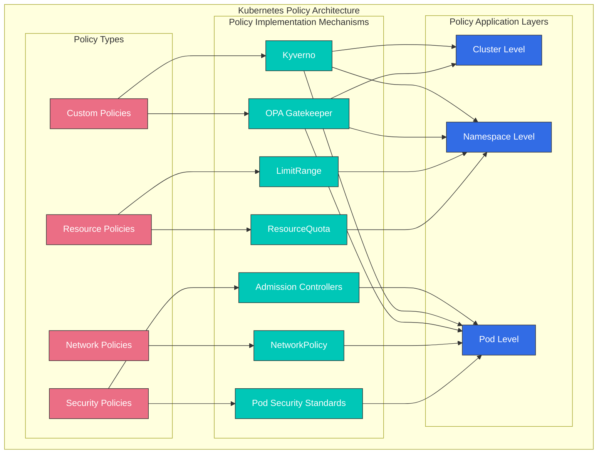
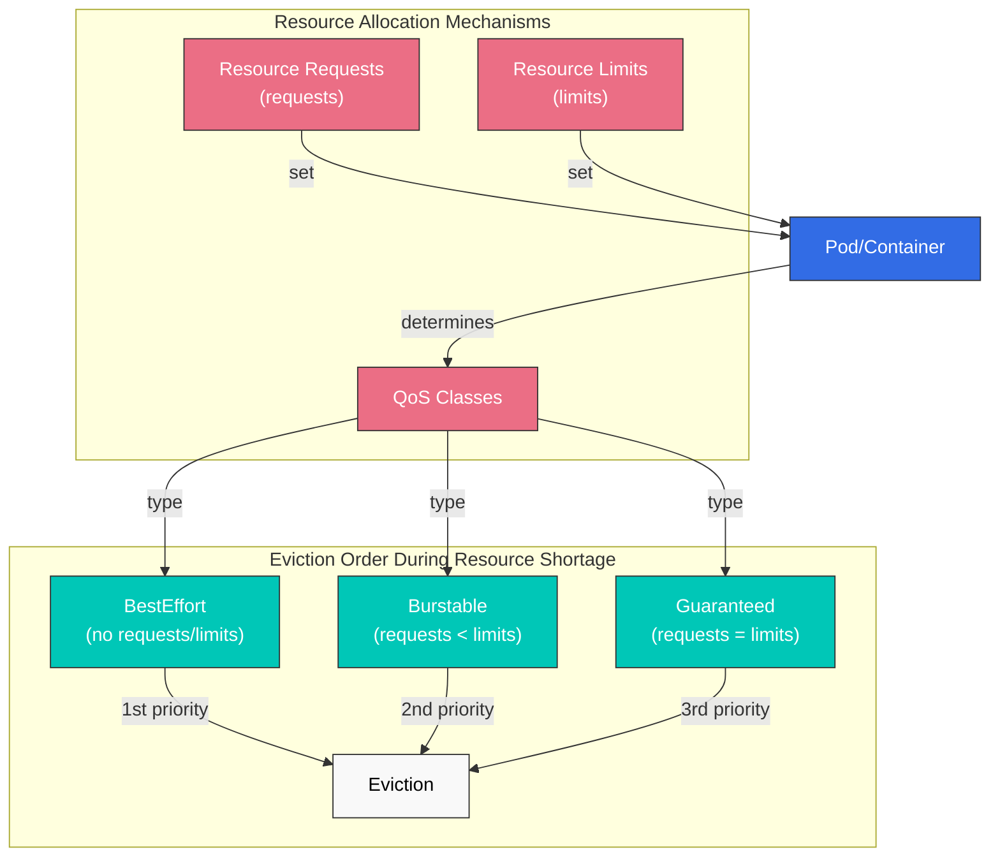
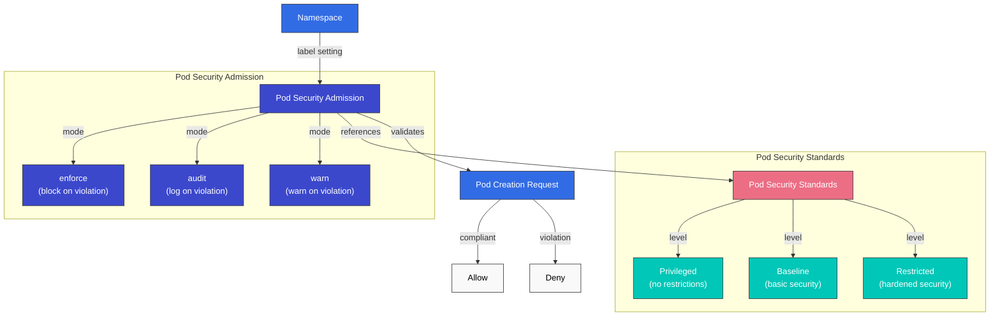
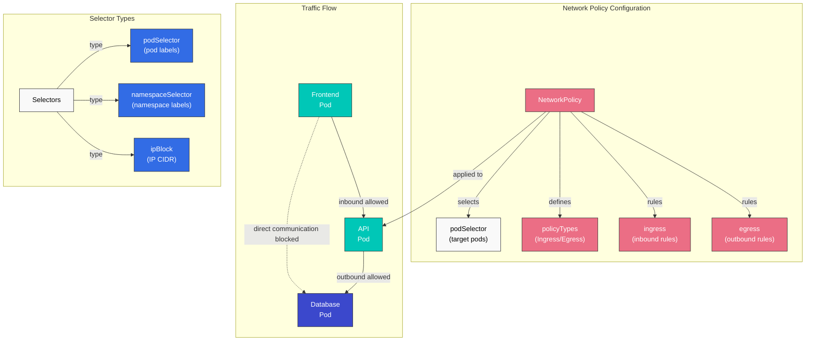
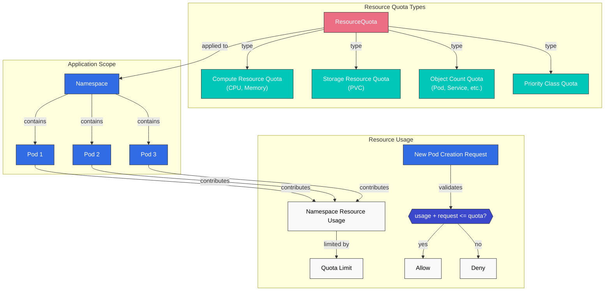
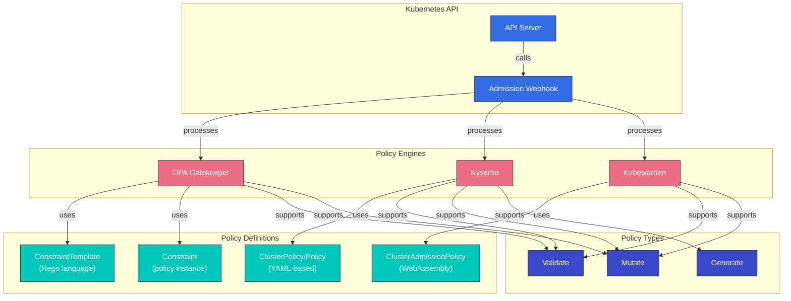
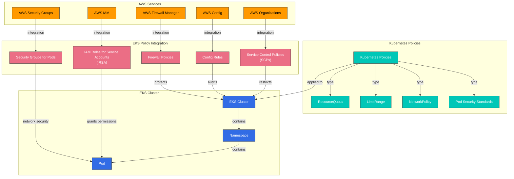

# Kubernetes Policies

> **Supported Versions**: Kubernetes 1.32 - 1.34
> **最終更新**: February 22, 2026

Kubernetes において、policies（ポリシー）は cluster と workloads の動作を制御および規制する rules の集合です。policies を通じて、security、resource usage、network communication などのさまざまな側面を管理できます。この章では、Kubernetes におけるさまざまな types of policies、その実装方法、そして Amazon EKS での policy management について学びます。

## Lab Environment Setup

このドキュメントの例を試すには、次の tools と environment が必要です。

### Required Tools
- kubectl v1.34 以上
- 稼働中の Kubernetes cluster（EKS、minikube、kind など）
- Kyverno CLI（任意）
- OPA Gatekeeper（任意）

### Policy Example Setup

```bash
# Create namespace
kubectl create namespace policy-demo

# Create resource quota
kubectl -n policy-demo apply -f - <<EOF
apiVersion: v1
kind: ResourceQuota
metadata:
  name: demo-quota
spec:
  hard:
    requests.cpu: "1"
    requests.memory: 1Gi
    limits.cpu: "2"
    limits.memory: 2Gi
    pods: "10"
EOF

# Create network policy
kubectl -n policy-demo apply -f - <<EOF
apiVersion: networking.k8s.io/v1
kind: NetworkPolicy
metadata:
  name: default-deny
spec:
  podSelector: {}
  policyTypes:
  - Ingress
  - Egress
EOF

# Verify policies
kubectl -n policy-demo get resourcequota,networkpolicy
```

## Kubernetes Policy Architecture



## Policy Type Comparison

| Policy Type | Implementation Mechanism | Application Level | Primary Purpose | Kubernetes Version Support |
|------------|--------------------------|-------------------|-----------------|---------------------------|
| **Resource Policies** | ResourceQuota, LimitRange | Namespace | Resource usage limitation and management | All versions |
| **Security Policies** | Pod Security Standards, PodSecurityPolicy(deprecated) | Pod, Namespace | Security context restrictions | PSP: ~1.24, PSS: 1.22+ |
| **Network Policies** | NetworkPolicy | Pod | Network traffic control | 1.8+ |
| **Custom Policies** | OPA Gatekeeper, Kyverno | Cluster, Namespace, Pod | User-defined policy enforcement | All versions (add-ons) |

## Resource Policies

Resource policies は、Kubernetes cluster 内で computing resources（CPU、memory など）と object counts（pods、services など）を制限および管理するための mechanisms です。

### ResourceQuota

ResourceQuota は、namespace 内で使用できる resources の総量を制限します。

```yaml
apiVersion: v1
kind: ResourceQuota
metadata:
  name: compute-resources
  namespace: dev
spec:
  hard:
    requests.cpu: "1"
    requests.memory: 1Gi
    limits.cpu: "2"
    limits.memory: 2Gi
    pods: "10"
    services: "5"
    persistentvolumeclaims: "5"
    secrets: "10"
    configmaps: "10"
```

### LimitRange

LimitRange は、namespace 内の個々の containers または pods に対して、default resource limits と requests を設定します。

```yaml
apiVersion: v1
kind: LimitRange
metadata:
  name: limit-mem-cpu-per-container
  namespace: dev
spec:
  limits:
  - default:
      cpu: 500m
      memory: 512Mi
    defaultRequest:
      cpu: 100m
      memory: 256Mi
    max:
      cpu: "1"
      memory: 1Gi
    min:
      cpu: 50m
      memory: 128Mi
    type: Container
```

## Table of Contents
1. [Policy Overview](#policy-overview)
2. [Resource Allocation Policies](#resource-allocation-policies)
3. [Pod Security Policies](#pod-security-policies)
4. [Network Policies](#network-policies)
5. [Resource Quotas](#resource-quotas)
6. [LimitRange](#limitrange)
7. [Policy Engines](#policy-engines)
8. [Policy Management in Amazon EKS](#policy-management-in-amazon-eks)
9. [Policy Best Practices](#policy-best-practices)
10. [Conclusion](#conclusion)

## Policy Overview

Kubernetes policies は、cluster administrators が cluster 内の resources と workloads に対する constraints を定義する方法を提供します。policies は次の purposes に使用されます。

1. **Security Enhancement**: unauthorized operations を防止し、security best practices を適用します
2. **Resource Management**: resource usage を制限し、公平な resource distribution を確保します
3. **Compliance**: organizational policies と regulations への compliance を確保します
4. **Standardization**: 一貫した configuration と deployment practices を適用します

Kubernetes は、built-in resources（例: NetworkPolicy、ResourceQuota、LimitRange）または third-party policy engines（例: OPA Gatekeeper、Kyverno）を通じて、さまざまな types of policies を実装できます。

## Resource Allocation Policies

Resource allocation policies は、pods と containers が使用できる CPU や memory などの resources の量を制御します。



### Resource Requests and Limits

pods と containers に resource requests と limits を設定することで、resource usage を管理できます。

```yaml
apiVersion: v1
kind: Pod
metadata:
  name: resource-demo
spec:
  containers:
  - name: resource-demo-container
    image: nginx
    resources:
      requests:
        memory: "64Mi"
        cpu: "250m"
      limits:
        memory: "128Mi"
        cpu: "500m"
```

- **requests**: container に保証される resources の最小量
- **limits**: container が使用できる resources の最大量

resource requests と limits を設定すると、次の benefits があります。

1. **Resource Guarantee**: Pods は必要な最小 resources を保証されます
2. **Resource Isolation**: ある pod が別の pod の resources を独占することを防ぎます
3. **Efficient Scheduling**: scheduler は pods を配置するときに node の resource capacity を考慮します

### QoS (Quality of Service) Classes

Kubernetes は、pod の resource request と limit settings に基づいて QoS classes を自動的に割り当てます。

1. **Guaranteed**: すべての containers に resource requests と limits が設定され、requests と limits が等しい
2. **Burstable**: 少なくとも 1 つの container に resource requests が設定されているが、Guaranteed conditions を満たさない
3. **BestEffort**: どの containers にも resource requests と limits が設定されていない

QoS classes は、resource shortage 時の pod eviction order を決定します。
1. BestEffort pods が最初に evict されます
2. Burstable pods が次に evict されます
3. Guaranteed pods が最後に evict されます

## Pod Security Policies

Pod Security Policy (PSP) は Kubernetes 1.21 から deprecated となり、version 1.25 で完全に削除されました。代わりに、Pod Security Standards と Pod Security Admission が導入されています。



### Pod Security Standards

Pod Security Standards は、3 つの policy levels を定義します。

1. **Privileged**: restrictions はなく、すべての permissions が許可されます
2. **Baseline**: 既知の privilege escalation paths をブロックします
3. **Restricted**: 強力に hardened された security policy

### Pod Security Admission

Pod Security Admission は、namespace labels を通じて Pod Security Standards を適用します。

```yaml
apiVersion: v1
kind: Namespace
metadata:
  name: my-namespace
  labels:
    pod-security.kubernetes.io/enforce: restricted
    pod-security.kubernetes.io/audit: restricted
    pod-security.kubernetes.io/warn: restricted
```

各 label の意味は次のとおりです。
- **enforce**: policy に違反する pod creation をブロックします
- **audit**: violations を audit logs に記録します
- **warn**: violations に対する warning messages を表示します

## Network Policies

Network Policy は、pods 間の communication を制御する方法を提供します。デフォルトでは、Kubernetes cluster 内のすべての pods は互いに communication できますが、network policies によってこれを制限できます。



```yaml
apiVersion: networking.k8s.io/v1
kind: NetworkPolicy
metadata:
  name: api-allow
  namespace: default
spec:
  podSelector:
    matchLabels:
      app: api
  policyTypes:
  - Ingress
  - Egress
  ingress:
  - from:
    - podSelector:
        matchLabels:
          app: frontend
    ports:
    - protocol: TCP
      port: 8080
  egress:
  - to:
    - podSelector:
        matchLabels:
          app: database
    ports:
    - protocol: TCP
      port: 5432
```

上の例では次のようになります。
- `api` label を持つ pods に対する network policy を定義します
- `frontend` label を持つ pods から port 8080 への inbound traffic のみを許可します
- `database` label を持つ pods の port 5432 への outbound traffic のみを許可します

network policies を使用するには、cluster の network plugin が network policies をサポートしている必要があります。Calico、Cilium、Antrea などの CNI plugins は network policies をサポートしています。

### Network Policy Types

1. **Ingress Policy**: pod に入ってくる traffic を制御します
2. **Egress Policy**: pod から出ていく traffic を制御します
3. **Ingress and Egress Policy**: 両方向の traffic を制御します

### Network Policy Selectors

Network policies は、さまざまな selectors を通じて traffic を filter できます。

1. **podSelector**: pod labels に基づいて選択します
2. **namespaceSelector**: namespace labels に基づいて選択します
3. **ipBlock**: IP CIDR ranges に基づいて選択します

```yaml
# Example combining multiple selectors
ingress:
- from:
  - podSelector:
      matchLabels:
        app: frontend
    namespaceSelector:
      matchLabels:
        env: prod
  - ipBlock:
      cidr: 172.17.0.0/16
      except:
      - 172.17.1.0/24
```

## Resource Quotas

ResourceQuota は、namespace 内で使用できる resources の総量を制限します。これにより、複数の teams または projects が cluster resources を共有するときに、1 つの team がすべての resources を独占することを防ぎます。



```yaml
apiVersion: v1
kind: ResourceQuota
metadata:
  name: compute-resources
  namespace: team-a
spec:
  hard:
    pods: "10"
    requests.cpu: "4"
    requests.memory: 8Gi
    limits.cpu: "8"
    limits.memory: 16Gi
```

上の例では次のようになります。
- `team-a` namespace は最大 10 pods を作成できます
- すべての pod CPU requests の合計は 4 cores を超えることはできません
- すべての pod memory requests の合計は 8Gi を超えることはできません
- すべての pod CPU limits の合計は 8 cores を超えることはできません
- すべての pod memory limits の合計は 16Gi を超えることはできません

### Object Count Quota

Resource quotas は、CPU と memory だけでなく、namespace 内で作成できる objects の数も制限できます。

```yaml
apiVersion: v1
kind: ResourceQuota
metadata:
  name: object-counts
  namespace: team-b
spec:
  hard:
    configmaps: "10"
    persistentvolumeclaims: "5"
    replicationcontrollers: "20"
    secrets: "10"
    services: "10"
    services.loadbalancers: "2"
```

### Priority Class Quota

特定の priority classes の pods に対して quotas を設定することもできます。

```yaml
apiVersion: v1
kind: ResourceQuota
metadata:
  name: priority-class-quota
  namespace: team-c
spec:
  hard:
    pods: "10"
    pods.high: "5"
    pods.medium: "3"
    pods.low: "2"
  scopeSelector:
    matchExpressions:
    - operator: In
      scopeName: PriorityClass
      values: ["high", "medium", "low"]
```

## LimitRange

LimitRange は、namespace 内で作成される個々の resources（pods、containers など）に対して default resource limits と requests を設定します。これは、developers が resource requests と limits を明示的に設定していない場合に適用されます。

```yaml
apiVersion: v1
kind: LimitRange
metadata:
  name: cpu-limit-range
  namespace: default
spec:
  limits:
  - default:
      cpu: 1
      memory: 512Mi
    defaultRequest:
      cpu: 500m
      memory: 256Mi
    max:
      cpu: 2
      memory: 1Gi
    min:
      cpu: 100m
      memory: 128Mi
    type: Container
```

上の例では次のようになります。
- **default**: container に explicit limit がない場合に適用される default limit
- **defaultRequest**: container に explicit request がない場合に適用される default request
- **max**: container が設定できる maximum limit
- **min**: container が設定できる minimum request

LimitRange は、次の resource types に適用できます。
- Container
- Pod
- PersistentVolumeClaim

## Policy Engines

Kubernetes ecosystem には、より複雑で柔軟な policies を実装できる複数の policy engines があります。



### OPA Gatekeeper

OPA (Open Policy Agent) Gatekeeper は、Kubernetes clusters 上で policies を定義し enforcement するための open-source project です。Gatekeeper は Kubernetes admission controller として動作し、API server に送信される requests を intercept して policies を適用します。

Gatekeeper は次の components で構成されます。

1. **ConstraintTemplate**: policy logic を定義する template
2. **Constraint**: 特定の resources に policy を適用する ConstraintTemplate の instance

```yaml
# ConstraintTemplate example
apiVersion: templates.gatekeeper.sh/v1beta1
kind: ConstraintTemplate
metadata:
  name: k8srequiredlabels
spec:
  crd:
    spec:
      names:
        kind: K8sRequiredLabels
      validation:
        openAPIV3Schema:
          properties:
            labels:
              type: array
              items: string
  targets:
    - target: admission.k8s.gatekeeper.sh
      rego: |
        package k8srequiredlabels
        violation[{"msg": msg, "details": {"missing_labels": missing}}] {
          provided := {label | input.review.object.metadata.labels[label]}
          required := {label | label := input.parameters.labels[_]}
          missing := required - provided
          count(missing) > 0
          msg := sprintf("missing required labels: %v", [missing])
        }
```

```yaml
# Constraint example
apiVersion: constraints.gatekeeper.sh/v1beta1
kind: K8sRequiredLabels
metadata:
  name: require-app-label
spec:
  match:
    kinds:
      - apiGroups: [""]
        kinds: ["Pod"]
  parameters:
    labels: ["app", "owner"]
```

### Kyverno

Kyverno は、YAML-based policies を使用して Kubernetes resources を validate、mutate、generate できる Kubernetes-native policy engine です。Rego language を学ぶ必要なく、Kubernetes resources に似た syntax で policies を記述できます。

```yaml
# Kyverno policy example
apiVersion: kyverno.io/v1
kind: ClusterPolicy
metadata:
  name: require-labels
spec:
  validationFailureAction: enforce
  rules:
  - name: check-for-labels
    match:
      resources:
        kinds:
        - Pod
    validate:
      message: "The labels 'app' and 'owner' are required."
      pattern:
        metadata:
          labels:
            app: "?*"
            owner: "?*"
```

Kyverno は次の policy types をサポートします。

1. **Validate**: resources が特定の conditions を満たすことを検証します
2. **Mutate**: resources を自動的に変更します
3. **Generate**: resource が作成されたときに、他の resources を自動的に作成します
4. **Verify Images**: image signatures を検証します
5. **Clean Up**: resource が削除されたときに、related resources を自動的に cleanup します

### Kubewarden

Kubewarden は、さまざまな programming languages で policies を記述できる WebAssembly-based policy engine です。policies は WebAssembly modules に compile され、Kubewarden policy server 上で実行されます。

```yaml
# Kubewarden policy example
apiVersion: policies.kubewarden.io/v1alpha2
kind: ClusterAdmissionPolicy
metadata:
  name: require-labels
spec:
  module: registry://ghcr.io/kubewarden/policies/require-labels:v0.1.0
  rules:
  - apiGroups: [""]
    apiVersions: ["v1"]
    resources: ["pods"]
    operations:
    - CREATE
    - UPDATE
  settings:
    required_labels:
      - app
      - owner
```

## Policy Management in Amazon EKS

Amazon EKS では、Kubernetes の default policy mechanisms とさまざまな AWS services を組み合わせて policies を管理できます。



### Integration with AWS IAM

Amazon EKS は、IAM Roles for Service Accounts (IRSA) を通じて、AWS services に対する permissions を pods に付与できます。これにより、principle of least privilege を適用できます。

```bash
# Create OIDC provider
eksctl utils associate-iam-oidc-provider --cluster my-cluster --approve

# Create IAM role and link to service account
eksctl create iamserviceaccount \
  --name my-service-account \
  --namespace default \
  --cluster my-cluster \
  --attach-policy-arn arn:aws:iam::aws:policy/AmazonS3ReadOnlyAccess \
  --approve
```

### AWS Security Groups for Pods

Amazon EKS は、pod level で AWS security groups を適用する機能を提供します。これにより、pods 間の communication をより細かく制御できます。

```yaml
apiVersion: vpcresources.k8s.aws/v1beta1
kind: SecurityGroupPolicy
metadata:
  name: allow-db-access
  namespace: default
spec:
  podSelector:
    matchLabels:
      app: web
  securityGroups:
    groupIds:
      - sg-12345
```

### AWS Config and AWS Organizations

AWS Config と AWS Organizations を使用して、organization-level policies を EKS clusters に適用できます。たとえば、特定の tags がない EKS clusters の作成を制限できます。

```json
{
  "Version": "2012-10-17",
  "Statement": [
    {
      "Effect": "Deny",
      "Action": "eks:CreateCluster",
      "Resource": "*",
      "Condition": {
        "Null": {
          "aws:RequestTag/Environment": "true"
        }
      }
    }
  ]
}
```

### AWS Firewall Manager

AWS Firewall Manager を使用して、複数の EKS clusters の network policies を centrally manage できます。これにより、organization 全体で一貫した security policies を適用できます。

## Policy Best Practices

Kubernetes clusters で policies を効果的に管理するための best practices は次のとおりです。

### Policy Design

1. **Principle of Least Privilege**: 必要最小限の permissions のみを付与する policies を設計します。
2. **Gradual Application**: すべての policies を一度に適用せず、impact を最小化するために段階的に適用します。
3. **Audit Mode**: enforcement の前に policies を audit mode で実行し、impact を評価します。
4. **Clear Documentation**: 各 policy の purpose と impact を明確に文書化します。

### Resource Management

1. **Namespace Isolation**: team または project ごとに namespaces を分離し、各 namespace に適切な resource quotas を設定します。
2. **Default Limits**: LimitRange を使用して、すべての containers に default resource limits を設定します。
3. **QoS Class Consideration**: workload の importance に基づいて適切な QoS classes を設定します。

### Network Security

1. **Default Deny Policy**: デフォルトですべての traffic を拒否し、必要な communication のみを明示的に許可する policies を設定します。
2. **Granular Policies**: pods 間の communication を細かく制御する network policies を設定します。
3. **Regular Review**: network policies を定期的に review して update します。

### Policy Automation

1. **CI/CD Integration**: policy validation を CI/CD pipelines に統合し、deployment 前に policy violations を検出します。
2. **Policy Testing**: policies をまず test environment で test し、問題がない場合に production に適用します。
3. **Policy Version Control**: policies を code として管理し、version control systems を使用して changes を追跡します。

## Conclusion

Kubernetes policies は、clusters と workloads の security、resource usage、network communication を制御するための強力な tools です。built-in policy mechanisms（ResourceQuota、LimitRange、NetworkPolicy など）と third-party policy engines（OPA Gatekeeper、Kyverno など）を組み合わせることで、organization の requirements に合わせた policy framework を構築できます。

Amazon EKS を使用する場合は、さまざまな AWS services（IAM、Security Groups、AWS Config、AWS Organizations、AWS Firewall Manager など）を活用することで、policy management をさらに強化できます。これらの services を統合することで、clusters と workloads の security、compliance、resource management を効果的に管理できます。

Policies は継続的に進化する領域であるため、新しい threats と requirements に対応するために policies を定期的に review して update することが重要です。さらに、一貫性と効率を向上させるために、policies を code として管理し automation することが推奨されます。

## Quiz

この章で学んだ内容を確認するには、[Policies Quiz](../quizzes/core/07-policies-quiz.md) に挑戦してください。

## References

- [Kubernetes Official Documentation - Resource Quotas](https://kubernetes.io/docs/concepts/policy/resource-quotas/)
- [Kubernetes Official Documentation - LimitRange](https://kubernetes.io/docs/concepts/policy/limit-range/)
- [Kubernetes Official Documentation - Network Policies](https://kubernetes.io/docs/concepts/services-networking/network-policies/)
- [Kubernetes Official Documentation - Pod Security Standards](https://kubernetes.io/docs/concepts/security/pod-security-standards/)
- [Kubernetes Official Documentation - Pod Security Admission](https://kubernetes.io/docs/concepts/security/pod-security-admission/)
- [OPA Gatekeeper Official Documentation](https://open-policy-agent.github.io/gatekeeper/website/docs/)
- [Kyverno Official Documentation](https://kyverno.io/docs/)
- [Kubewarden Official Documentation](https://docs.kubewarden.io/)
- [Amazon EKS Official Documentation - IAM Roles for Service Accounts](https://docs.aws.amazon.com/eks/latest/userguide/iam-roles-for-service-accounts.html)
- [Amazon EKS Official Documentation - Security Groups for Pods](https://docs.aws.amazon.com/eks/latest/userguide/security-groups-for-pods.html)
- [AWS Config Official Documentation](https://docs.aws.amazon.com/config/latest/developerguide/WhatIsConfig.html)
- [AWS Organizations Official Documentation](https://docs.aws.amazon.com/organizations/latest/userguide/orgs_introduction.html)
- [AWS Firewall Manager Official Documentation](https://docs.aws.amazon.com/waf/latest/developerguide/fms-chapter.html)
