# Kubernetes Scheduling, Preemption, and Eviction

> **Supported Versions**: Kubernetes 1.32 - 1.34
> **最終更新**: February 22, 2026

Kubernetes において、scheduling は Pod を適切な Node に配置する process です。Preemption は高優先度 Pod のために低優先度 Pod を削除して空き容量を確保する process であり、eviction は Node に問題が発生した際に Pod を安全に移動する process です。この章では、Kubernetes の scheduling mechanism、Node 選択、preemption、eviction、そして Amazon EKS における scheduling 最適化方法について学びます。

## Lab Environment Setup

このドキュメントの例を試すには、次のツールと環境が必要です。

### Required Tools
- kubectl v1.34 以上
- 稼働中の Kubernetes cluster（EKS、minikube、kind など）
- 複数の Node を持つ cluster（scheduling test 用）

### Scheduling Example Setup

```bash
# Create namespace
kubectl create namespace scheduling-demo

# Add labels to nodes (if you have multiple nodes)
kubectl label nodes <node-name> disktype=ssd
kubectl label nodes <node-name> gpu=true

# Create a pod using node affinity
kubectl -n scheduling-demo apply -f - <<EOF
apiVersion: v1
kind: Pod
metadata:
  name: nginx-ssd
spec:
  affinity:
    nodeAffinity:
      requiredDuringSchedulingIgnoredDuringExecution:
        nodeSelectorTerms:
        - matchExpressions:
          - key: disktype
            operator: In
            values:
            - ssd
  containers:
  - name: nginx
    image: nginx
EOF

# Create priority class
kubectl apply -f - <<EOF
apiVersion: scheduling.k8s.io/v1
kind: PriorityClass
metadata:
  name: high-priority
value: 1000000
globalDefault: false
description: "This priority class should be used for critical service pods only."
EOF

# Create Pod Disruption Budget (PDB)
kubectl -n scheduling-demo apply -f - <<EOF
apiVersion: policy/v1
kind: PodDisruptionBudget
metadata:
  name: nginx-pdb
spec:
  minAvailable: 1
  selector:
    matchLabels:
      app: nginx
EOF
```

## Kubernetes Scheduling Architecture

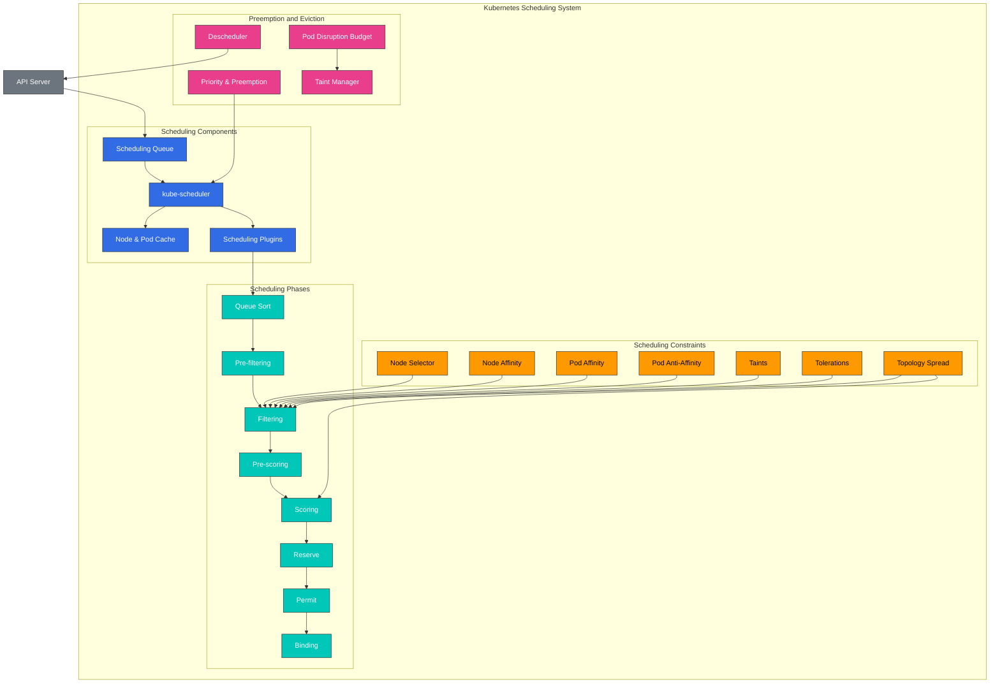

## Scheduling Concept Comparison

| Concept | Purpose | Use Cases | Kubernetes Version |
|---------|---------|-----------|-------------------|
| **Node Selector** | Place pods on nodes with specific labels | Simple node selection | All versions |
| **Node Affinity** | Define complex node selection rules | Advanced node selection | 1.6+ |
| **Pod Affinity** | Place pods close to other pods | Co-locating related services | 1.6+ |
| **Pod Anti-Affinity** | Place pods away from other pods | Ensuring high availability | 1.6+ |
| **Taints and Tolerations** | Allow only specific pods on nodes | Dedicated nodes, node isolation | 1.6+ |
| **Topology Spread Constraints** | Spread pods across topology domains | Distribution across availability zones | 1.16+ (GA in 1.19) |
| **Priority and Preemption** | Prioritize important workloads | Critical service guarantees | 1.8+ (GA in 1.11) |
| **Pod Disruption Budget** | Limit simultaneously disrupted pods | Ensuring high availability | 1.4+ (GA in 1.21) |

## Basic Scheduling Concepts

> **Key Concept**: Kubernetes scheduler は、Pod を実行する最適な Node を選択する control plane component であり、filtering と scoring の 2 つの phase で動作します。

### Scheduling Process

1. **Filtering Phase (Predicates)**
   - Pod を実行できる適切な Node の集合を特定します
   - Resource requirements、Node selectors、affinity rules、taints/tolerations などを考慮します
   - いずれかの条件を満たさない場合、その Node を除外します

2. **Scoring Phase (Priorities)**
   - Filtering を通過した Node に score を割り当てます
   - Resource utilization、Pod distribution、affinity preferences などを考慮します
   - 最も高い score を持つ Node を選択します

3. **Binding Phase**
   - 選択された Node に Pod を割り当てます
   - API server の binding information を更新します

## Table of Contents
1. [Scheduling Overview](#scheduling-overview)
2. [How the Scheduler Works](#how-the-scheduler-works)
3. [Node Selection](#node-selection)
4. [Pod Affinity and Anti-Affinity](#pod-affinity-and-anti-affinity)
5. [Taints and Tolerations](#taints-and-tolerations)
6. [Node Affinity](#node-affinity)
7. [Pod Priority and Preemption](#pod-priority-and-preemption)
8. [Pod Eviction](#pod-eviction)
9. [Pod Disruption Budget (PDB)](#pod-disruption-budget-pdb)
10. [Node Pressure Eviction](#node-pressure-eviction)
11. [TopologySpreadConstraints](#topologyspreadconstraints)
12. [Pod Deletion Cost](#pod-deletion-cost)
13. [Descheduler](#descheduler)
14. [Scheduling Optimization in Amazon EKS](#scheduling-optimization-in-amazon-eks)
15. [Scheduling Best Practices](#scheduling-best-practices)
16. [Conclusion](#conclusion)

## Scheduling Overview

Kubernetes scheduler は、Pod を適切な Node に配置する control plane component です。Scheduler は、Pod を配置する最適な Node を決定するためにさまざまな要素を考慮します。

1. **Resource Requirements**: Pod が要求する CPU、memory、その他の resources
2. **Hardware/Software/Policy Constraints**: Node selectors、Node affinity、taints など
3. **Affinity/Anti-Affinity Specifications**: 他の Pod との配置関係
4. **Data Locality**: Pod を data の近くに配置すること
5. **Inter-Workload Interference**: 異なる workload 間の干渉を最小化すること
6. **Deadlines**: 時間制約のある workload の考慮

### Scheduling Process

Scheduling process は大きく 2 つの phase に分かれます。

1. **Filtering**: Pod を実行できる Node の集合を特定します
   - Resource requirements が満たされているかを確認します
   - Node selectors、affinity、taints などの constraints を確認します

2. **Scoring**: Filtering された Node に score を付け、最適な Node を選択します
   - Resource utilization balance
   - Inter-pod affinity/anti-affinity
   - Data locality
   - Taints/tolerations

## How the Scheduler Works

Kubernetes scheduler は、次の process を通じて動作します。

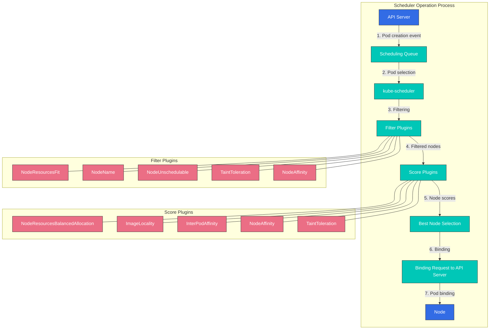

1. **Pod Queue Watching**: Scheduler は API server を監視し、未 scheduling の Pod を検出します。
2. **Node Filtering**: Pod を実行できる Node の集合を特定します。
3. **Node Scoring**: Filtering された Node に score を付けます。
4. **Node Selection**: 最も高い score を持つ Node を選択します。
5. **Binding**: Pod を選択された Node に bind します。

### Scheduling Plugins

Kubernetes scheduler は、plugin architecture を使用して拡張可能に設計されています。さまざまな plugins が scheduling process の異なる stage で動作します。

1. **Filter Plugins**: Pod を実行できない Node を除外します
   - NodeResourcesFit: Node の resource capacity を確認します
   - NodeName: Pod の nodeName field を確認します
   - NodeUnschedulable: Node の schedulability を確認します
   - TaintToleration: Taints と tolerations を確認します

2. **Score Plugins**: Node に score を割り当てます
   - NodeResourcesBalancedAllocation: Resource usage balance を考慮します
   - ImageLocality: Image locality を考慮します
   - InterPodAffinity: Inter-pod affinity を考慮します
   - NodeAffinity: Node affinity を考慮します

### Multiple Schedulers

Kubernetes は複数の scheduler を同時に実行できます。これにより、特定の workload 向けの custom scheduling logic を実装できます。

```yaml
apiVersion: v1
kind: Pod
metadata:
  name: custom-scheduled-pod
spec:
  schedulerName: my-custom-scheduler
  containers:
  - name: container
    image: nginx
```

上記の例では、`schedulerName` field が Pod を scheduling する scheduler を指定します。

## Node Selection

Kubernetes は、Pod を特定の Node に配置するための複数の mechanism を提供します。

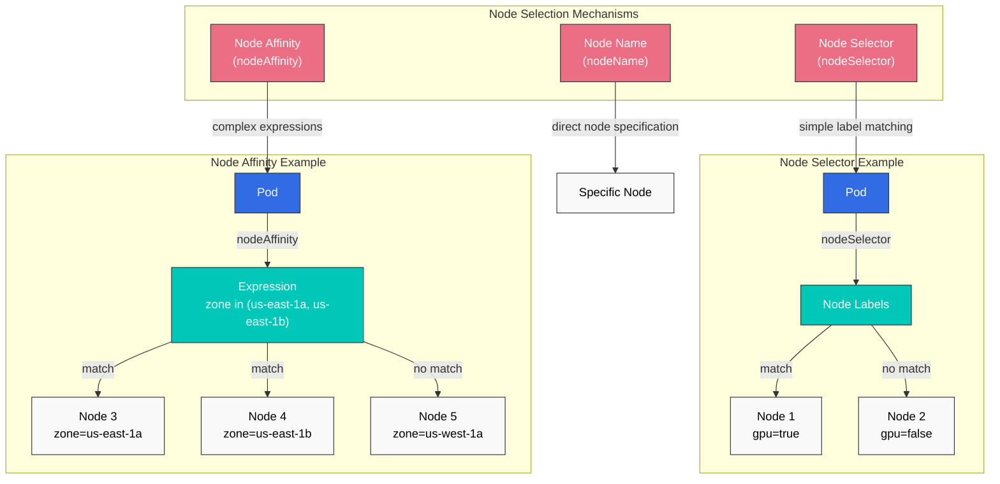

### Node Selector

Node selector は、特定の label を持つ Node にのみ Pod を配置するよう制限する最も単純な方法です。

```yaml
apiVersion: v1
kind: Pod
metadata:
  name: gpu-pod
spec:
  nodeSelector:
    gpu: "true"
  containers:
  - name: gpu-container
    image: nvidia/cuda
```

上記の例では、Pod は `gpu=true` label を持つ Node にのみ配置されます。

### nodeName

`nodeName` field を使用して、Pod を特定の Node に直接配置できます。この方法は scheduler を bypass するため、一般には推奨されません。

```yaml
apiVersion: v1
kind: Pod
metadata:
  name: specific-node-pod
spec:
  nodeName: worker-node-1
  containers:
  - name: container
    image: nginx
```

上記の例では、Pod は `worker-node-1` という名前の Node に直接配置されます。

## Pod Affinity and Anti-Affinity

Pod affinity と anti-affinity は、Pod 間の関係に基づいて Pod を配置する方法を提供します。

```mermaid
graph TD
    subgraph "Pod Affinity"
        PA["podAffinity"]
        PA -->|place on same node/topology| Together["Co-location"]

        subgraph "Affinity Example"
            WebPod["Web Pod<br>app=web"]
            CachePod["Cache Pod<br>app=cache"]
            WebPod -->|co-locate| CachePod
            Node1["Node 1"] -->|contains| WebPod
            Node1 -->|contains| CachePod
        end
    end

    subgraph "Pod Anti-Affinity"
        PAA["podAntiAffinity"]
        PAA -->|place on different node/topology| Apart["Separation"]

        subgraph "Anti-Affinity Example"
            WebPod1["Web Pod 1<br>app=web"]
            WebPod2["Web Pod 2<br>app=web"]
            WebPod1 -->|separate| WebPod2
            Node2["Node 2"] -->|contains| WebPod1
            Node3["Node 3"] -->|contains| WebPod2
        end
    end

    subgraph "Affinity Types"
        Required["requiredDuringSchedulingIgnoredDuringExecution<br>(hard requirement)"]
        Preferred["preferredDuringSchedulingIgnoredDuringExecution<br>(soft requirement)"]
    end

    PA -->|type| Required
    PA -->|type| Preferred
    PAA -->|type| Required
    PAA -->|type| Preferred

    %% Style definitions
    classDef affinityType fill:#EB6E85,stroke:#333,stroke-width:1px,color:white;
    classDef affinityResult fill:#00C7B7,stroke:#333,stroke-width:1px,color:white;
    classDef k8sComponent fill:#326CE5,stroke:#333,stroke-width:1px,color:white;
    classDef nodeComponent fill:#f9f9f9,stroke:#333,stroke-width:1px,color:black;
    classDef affinityKind fill:#3B48CC,stroke:#333,stroke-width:1px,color:white;

    %% Apply classes
    class PA,PAA affinityType;
    class Together,Apart affinityResult;
    class WebPod,CachePod,WebPod1,WebPod2 k8sComponent;
    class Node1,Node2,Node3 nodeComponent;
    class Required,Preferred affinityKind;
```

### Pod Affinity

Pod affinity は、特定の label を持つ Pod と同じ Node または topology domain に Pod を配置させます。

```yaml
apiVersion: v1
kind: Pod
metadata:
  name: frontend
spec:
  affinity:
    podAffinity:
      requiredDuringSchedulingIgnoredDuringExecution:
      - labelSelector:
          matchExpressions:
          - key: app
            operator: In
            values:
            - cache
        topologyKey: kubernetes.io/hostname
  containers:
  - name: frontend
    image: nginx
```

上記の例では、`frontend` Pod は `app=cache` label を持つ Pod と同じ host に配置されます。

### Pod Anti-Affinity

Pod anti-affinity は、特定の label を持つ Pod とは異なる Node または topology domain に Pod を配置させます。

```yaml
apiVersion: v1
kind: Pod
metadata:
  name: frontend
  labels:
    app: frontend
spec:
  affinity:
    podAntiAffinity:
      requiredDuringSchedulingIgnoredDuringExecution:
      - labelSelector:
          matchExpressions:
          - key: app
            operator: In
            values:
            - frontend
        topologyKey: kubernetes.io/hostname
  containers:
  - name: frontend
    image: nginx
```

上記の例では、`frontend` Pod は `app=frontend` label を持つ他の Pod とは別の host に配置されます。これは、高可用性のために同じ application の instance を複数の Node に分散する場合に役立ちます。

### Affinity Types

Pod affinity と anti-affinity には 2 つの type があります。

1. **requiredDuringSchedulingIgnoredDuringExecution**: Scheduling 中に必ず満たす必要がある hard requirement
2. **preferredDuringSchedulingIgnoredDuringExecution**: 望ましいが必須ではない soft requirement

```yaml
# preferredDuringSchedulingIgnoredDuringExecution example
affinity:
  podAffinity:
    preferredDuringSchedulingIgnoredDuringExecution:
    - weight: 100
      podAffinityTerm:
        labelSelector:
          matchExpressions:
          - key: app
            operator: In
            values:
            - cache
        topologyKey: kubernetes.io/hostname
```

上記の例では、`weight` field はこの preference の重みを示します。複数の preference がある場合、より高い weight の preference がより重要とみなされます。

## Taints and Tolerations

Taints と tolerations は、Node が特定の Pod を拒否できるようにする mechanism です。

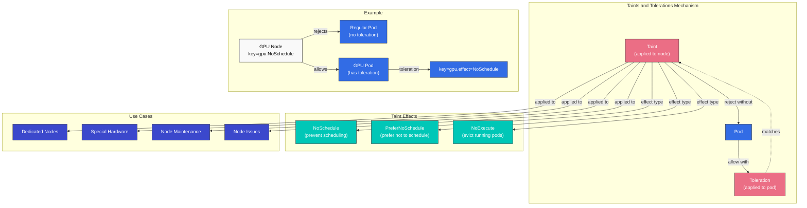

### Taints

Taints は、Pod が Node に scheduling されないよう制限するために Node に適用されます。

```bash
# Add taint to node
kubectl taint nodes node1 key=value:NoSchedule
```

Taint effect には 3 つあります。

1. **NoSchedule**: Toleration を持たない Pod はその Node に scheduling されません
2. **PreferNoSchedule**: Toleration を持たない Pod は、その Node にできるだけ scheduling されないようにします
3. **NoExecute**: Toleration を持たない Pod はその Node から evict されます

### Tolerations

Tolerations は、taint を持つ Node に Pod を scheduling できるようにするため Pod に適用されます。

```yaml
apiVersion: v1
kind: Pod
metadata:
  name: nginx
spec:
  tolerations:
  - key: "key"
    operator: "Equal"
    value: "value"
    effect: "NoSchedule"
  containers:
  - name: nginx
    image: nginx
```

上記の例では、Pod は `key=value:NoSchedule` taint を持つ Node に scheduling できます。

### Use Cases

Taints と tolerations の一般的な use case は次のとおりです。

1. **Dedicated Nodes**: 特定の workload のみを実行する Node を指定します
2. **Special Hardware**: GPU などの特殊な hardware を持つ Node を管理します
3. **Node Maintenance**: Maintenance 中の Node への新しい Pod scheduling を防止します
4. **Node Issues**: 問題のある Node から Pod を evict します

### Default Taints

Kubernetes は一部の Node に default taint を適用します。

- **node.kubernetes.io/not-ready**: Node が ready ではありません
- **node.kubernetes.io/unreachable**: Node に到達できません
- **node.kubernetes.io/memory-pressure**: Node に memory pressure があります
- **node.kubernetes.io/disk-pressure**: Node に disk pressure があります
- **node.kubernetes.io/pid-pressure**: Node に PID pressure があります
- **node.kubernetes.io/network-unavailable**: Node network が利用できません
- **node.kubernetes.io/unschedulable**: Node は unschedulable です

## Node Affinity

Node affinity は、特定の Node 集合に Pod を配置するための、より表現力の高い方法を提供します。Node selector より複雑な条件を指定できます。

### Node Affinity Types

Node affinity には 2 つの type があります。

1. **requiredDuringSchedulingIgnoredDuringExecution**: Scheduling 中に必ず満たす必要がある hard requirement
2. **preferredDuringSchedulingIgnoredDuringExecution**: 望ましいが必須ではない soft requirement

```yaml
apiVersion: v1
kind: Pod
metadata:
  name: with-node-affinity
spec:
  affinity:
    nodeAffinity:
      requiredDuringSchedulingIgnoredDuringExecution:
        nodeSelectorTerms:
        - matchExpressions:
          - key: kubernetes.io/e2e-az-name
            operator: In
            values:
            - e2e-az1
            - e2e-az2
      preferredDuringSchedulingIgnoredDuringExecution:
      - weight: 1
        preference:
          matchExpressions:
          - key: another-node-label-key
            operator: In
            values:
            - another-node-label-value
  containers:
  - name: with-node-affinity
    image: nginx
```

上記の例では、Pod は `kubernetes.io/e2e-az-name` label が `e2e-az1` または `e2e-az2` である Node にのみ配置されます。さらに、`another-node-label-key=another-node-label-value` label を持つ Node に優先的に配置されます。

### Operators

Node affinity はさまざまな operator をサポートします。

- **In**: Label value が指定された値のいずれかに一致します
- **NotIn**: Label value が指定された値に一致しません
- **Exists**: 指定された key の label が存在します
- **DoesNotExist**: 指定された key の label が存在しません
- **Gt**: Label value が指定された値より大きいです
- **Lt**: Label value が指定された値より小さいです

## Pod Priority and Preemption

Kubernetes は、重要な workload が cluster resources を確保できるようにするため、Pod priority と preemption features を提供します。

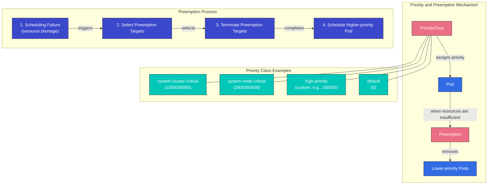

### PriorityClass

PriorityClass は Pod の相対的な重要度を定義します。Priority value が高いほど、その Pod はより重要です。

```yaml
apiVersion: scheduling.k8s.io/v1
kind: PriorityClass
metadata:
  name: high-priority
value: 1000000
globalDefault: false
description: "This priority class should be used for critical workloads."
```

上記の例では、`value` field が priority value を示します。Value が高いほど、priority が高くなります。`globalDefault` field が `true` に設定されている場合、この priority class は priority class が指定されていない Pod に適用されます。

### Applying PriorityClass to Pods

Priority class を Pod に適用するには、`priorityClassName` field を使用します。

```yaml
apiVersion: v1
kind: Pod
metadata:
  name: high-priority-pod
spec:
  priorityClassName: high-priority
  containers:
  - name: container
    image: nginx
```

### Preemption

Preemption は、高優先度 Pod を scheduling するために低優先度 Pod を削除する process です。Scheduler が高優先度 Pod を scheduling する Node を見つけられない場合、低優先度 Pod を preempt して resources を確保します。

Preemption process:
1. Scheduler が高優先度 Pod を scheduling する Node を見つけられません
2. Scheduler は preemption によって低優先度 Pod を削除する Node を選択します
3. 選択された Node 上の低優先度 Pod に termination signal を送信します
4. Pod が graceful に terminate すると、その Node に高優先度 Pod を scheduling します

### Preemption Considerations

Preemption を使用する際に考慮すべき点は次のとおりです。

1. **Graceful Termination Period**: Preempted Pod は `terminationGracePeriodSeconds` で指定された時間、graceful termination process を経ます
2. **PodDisruptionBudget**: Preemption は PodDisruptionBudget を尊重しません
3. **System Priority Classes**: Kubernetes は system components 用の priority class を提供します
   - `system-cluster-critical`: Cluster operation に重要な Pod
   - `system-node-critical`: Node operation に重要な Pod

## Pod Eviction

Pod eviction は、Node に問題が発生した際に Pod を安全に移動する process です。Eviction はさまざまな理由で発生する可能性があります。

```mermaid
graph TD
    subgraph "Eviction Types"
        ControllerEviction["kube-controller-manager<br>Eviction"]
        KubeletEviction["kubelet Eviction"]
        UserEviction["User Eviction"]
    end

    subgraph "Eviction Causes"
        NodeNotReady["Node NotReady"]
        NodeUnreachable["Node Unreachable"]
        ResourcePressure["Resource Shortage<br>(memory, disk, etc.)"]
        HardwareIssue["Hardware Issues"]
        Maintenance["Maintenance"]
    end

    subgraph "kubelet Eviction Signals"
        MemoryAvailable["memory.available"]
        NodefsAvailable["nodefs.available"]
        NodefsInodesFree["nodefs.inodesFree"]
        ImagefsAvailable["imagefs.available"]
        ImagefsInodesFree["imagefs.inodesFree"]
        PidAvailable["pid.available"]
    end

    ControllerEviction -->|cause| NodeNotReady
    ControllerEviction -->|cause| NodeUnreachable
    KubeletEviction -->|cause| ResourcePressure
    KubeletEviction -->|cause| HardwareIssue
    UserEviction -->|cause| Maintenance

    KubeletEviction -->|monitors| MemoryAvailable
    KubeletEviction -->|monitors| NodefsAvailable
    KubeletEviction -->|monitors| NodefsInodesFree
    KubeletEviction -->|monitors| ImagefsAvailable
    KubeletEviction -->|monitors| ImagefsInodesFree
    KubeletEviction -->|monitors| PidAvailable

    %% Style definitions
    classDef evictionType fill:#EB6E85,stroke:#333,stroke-width:1px,color:white;
    classDef evictionCause fill:#00C7B7,stroke:#333,stroke-width:1px,color:white;
    classDef evictionSignal fill:#3B48CC,stroke:#333,stroke-width:1px,color:white;

    %% Apply classes
    class ControllerEviction,KubeletEviction,UserEviction evictionType;
    class NodeNotReady,NodeUnreachable,ResourcePressure,HardwareIssue,Maintenance evictionCause;
    class MemoryAvailable,NodefsAvailable,NodefsInodesFree,ImagefsAvailable,ImagefsInodesFree,PidAvailable evictionSignal;
```

### Eviction Types

1. **Eviction by kube-controller-manager**:
   - Node が `pod-eviction-timeout` period（default 5 分）の間 NotReady state のままの場合
   - Node が Unreachable state の場合

2. **Eviction by kubelet**:
   - Node resource shortage（memory、disk など）
   - Hardware issues

3. **Eviction by user**:
   - `kubectl drain` command の実行
   - Node maintenance tasks

### kubelet Eviction Signals

kubelet は次の eviction signal を監視します。

1. **memory.available**: Available memory
2. **nodefs.available**: Node file system の available space
3. **nodefs.inodesFree**: Node file system の available inodes
4. **imagefs.available**: Image file system の available space
5. **imagefs.inodesFree**: Image file system の available inodes
6. **pid.available**: Available process IDs

各 signal に soft threshold と hard threshold を設定できます。

- **Soft Threshold**: Threshold を超過した後、`grace-period` の後に Pod を evict します
- **Hard Threshold**: Threshold を超過すると直ちに Pod を evict します

```yaml
# kubelet configuration example
evictionHard:
  memory.available: "100Mi"
  nodefs.available: "10%"
  nodefs.inodesFree: "5%"
  imagefs.available: "15%"
evictionSoft:
  memory.available: "200Mi"
  nodefs.available: "15%"
evictionSoftGracePeriod:
  memory.available: "1m"
  nodefs.available: "2m"
evictionPressureTransitionPeriod: "30s"
```

### Eviction Priority

kubelet は次の順序で Pod を evict します。

1. BestEffort QoS class の Pod
2. Burstable QoS class の Pod（resource usage が requests を超過している Pod から）
3. Guaranteed QoS class の Pod（requests と limits が等しい Pod）

## Pod Disruption Budget (PDB)

Pod Disruption Budget (PDB) は、voluntary disruption 中に application availability を維持するための方法です。PDB は、同時に disrupted される Pod の数を制限します。

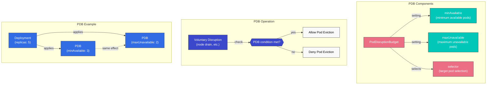

### PDB Definition

```yaml
apiVersion: policy/v1
kind: PodDisruptionBudget
metadata:
  name: frontend-pdb
spec:
  minAvailable: 2
  selector:
    matchLabels:
      app: frontend
```

or

```yaml
apiVersion: policy/v1
kind: PodDisruptionBudget
metadata:
  name: frontend-pdb
spec:
  maxUnavailable: 1
  selector:
    matchLabels:
      app: frontend
```

上記の例では、次のようになります。
- `minAvailable`: 常に available でなければならない Pod の最小数
- `maxUnavailable`: 同時に unavailable になれる Pod の最大数
- `selector`: PDB が適用される Pod を選択する label selector

### PDB Operation

1. Node drain などの voluntary disruption が発生すると、Kubernetes は PDB を確認します
2. PDB condition が満たされている場合、Pod eviction を進めます
3. PDB condition が満たされていない場合、Pod eviction を拒否します

### PDB Best Practices

1. **Set PDB for all critical workloads**: 高可用性が必要なすべての workload に PDB を設定します
2. **Choose appropriate values**: Workload characteristics に適した `minAvailable` または `maxUnavailable` values を選択します
3. **Consider replica count**: PDB value は replica count より小さくする必要があります
4. **Regular testing**: Node drain や同様の task を通じて PDB operation を test します

## Node Pressure Eviction

Node pressure eviction は、Node resource shortage によって Pod が evict される mechanism です。

### Node Condition Status

kubelet は次の Node condition status を報告します。

1. **MemoryPressure**: Node の memory が不足しています
2. **DiskPressure**: Node の disk space が不足しています
3. **PIDPressure**: Node の process ID が不足しています

これらの condition が発生すると、kubelet は resources を確保するために Pod を evict します。

### Eviction Policy Configuration

Eviction policy は kubelet configuration で設定できます。

```yaml
# kubelet configuration example
evictionHard:
  memory.available: "100Mi"
  nodefs.available: "10%"
  nodefs.inodesFree: "5%"
  imagefs.available: "15%"
evictionSoft:
  memory.available: "200Mi"
  nodefs.available: "15%"
evictionSoftGracePeriod:
  memory.available: "1m"
  nodefs.available: "2m"
evictionMinimumReclaim:
  memory.available: "50Mi"
  nodefs.available: "5%"
evictionPressureTransitionPeriod: "30s"
```

上記の例では、次のようになります。
- `evictionMinimumReclaim`: Eviction 後に reclaim する必要がある最小 resources
- `evictionPressureTransitionPeriod`: Pressure state transition 間の待機時間

## TopologySpreadConstraints

TopologySpreadConstraints は、availability zones、Node、region などの topology domain 全体で Pod がどのように分散されるかを細かく制御します。この feature は、高可用性と効率的な resource utilization を実現するうえで、Pod anti-affinity よりも高い柔軟性を提供します。

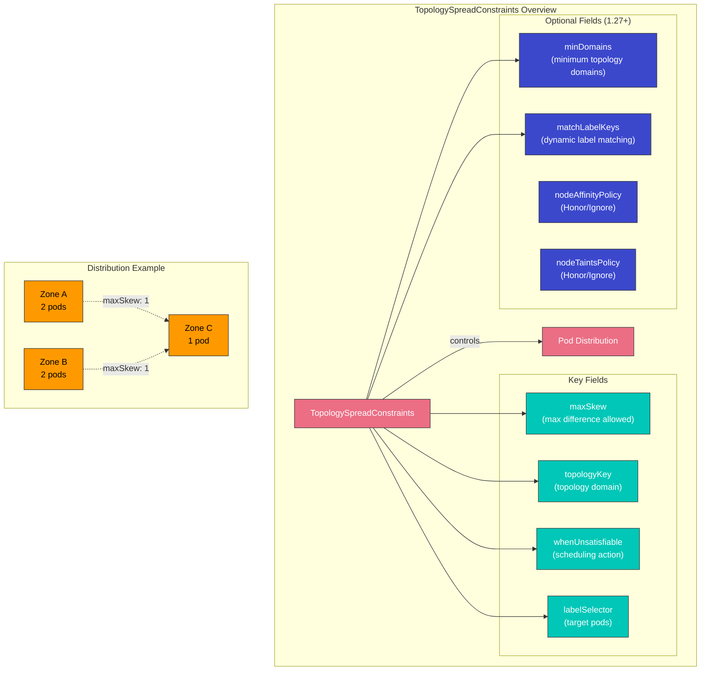

### Key Fields

| Field | Description | Required |
|-------|-------------|----------|
| **maxSkew** | Maximum allowed difference in pod count between any two topology domains | Yes |
| **topologyKey** | Node label key that defines topology domains | Yes |
| **whenUnsatisfiable** | Action when constraints cannot be satisfied: `DoNotSchedule` or `ScheduleAnyway` | Yes |
| **labelSelector** | Selects which pods to count for spread calculation | Yes |
| **minDomains** | Minimum number of topology domains required (1.27+) | No |
| **matchLabelKeys** | Pod label keys to match for spread calculation (1.27+) | No |

### whenUnsatisfiable Options

- **DoNotSchedule**: Constraint を満たせない場合、scheduler は Pod を scheduling しません（hard constraint）
- **ScheduleAnyway**: Scheduler は Pod を scheduling し、skew を最小化する Node に高い priority を与えます（soft constraint）

### EKS Availability Zone Spread Example

```yaml
apiVersion: apps/v1
kind: Deployment
metadata:
  name: web-app
spec:
  replicas: 6
  selector:
    matchLabels:
      app: web
  template:
    metadata:
      labels:
        app: web
    spec:
      topologySpreadConstraints:
      - maxSkew: 1
        topologyKey: topology.kubernetes.io/zone
        whenUnsatisfiable: DoNotSchedule
        labelSelector:
          matchLabels:
            app: web
      - maxSkew: 1
        topologyKey: kubernetes.io/hostname
        whenUnsatisfiable: ScheduleAnyway
        labelSelector:
          matchLabels:
            app: web
      containers:
      - name: web
        image: nginx:1.25
        resources:
          requests:
            cpu: 100m
            memory: 128Mi
```

この configuration は次を保証します。
1. Pod は availability zone 全体に均等に分散されます（hard constraint）
2. Pod は各 zone 内の Node 全体に優先的に分散されます（soft constraint）

### minDomains and matchLabelKeys (Kubernetes 1.27+)

```yaml
apiVersion: apps/v1
kind: Deployment
metadata:
  name: app-with-min-domains
spec:
  replicas: 4
  selector:
    matchLabels:
      app: distributed-app
  template:
    metadata:
      labels:
        app: distributed-app
        version: v1
    spec:
      topologySpreadConstraints:
      - maxSkew: 1
        topologyKey: topology.kubernetes.io/zone
        whenUnsatisfiable: DoNotSchedule
        labelSelector:
          matchLabels:
            app: distributed-app
        minDomains: 3
        matchLabelKeys:
        - version
      containers:
      - name: app
        image: myapp:v1
```

- **minDomains**: Pod が少なくとも 3 つの zone に spread されることを保証します。利用可能な zone が少ない場合、scheduling は blocked されます。
- **matchLabelKeys**: Selector で Pod の `version` label value を自動的に使用し、selector を変更せずに revision ごとの spread を可能にします。

### Advantages Over Pod Anti-Affinity

| Aspect | TopologySpreadConstraints | Pod Anti-Affinity |
|--------|---------------------------|-------------------|
| **Flexibility** | Allows controlled skew (maxSkew > 1) | Binary: either same or different domain |
| **Soft constraints** | `ScheduleAnyway` for best-effort | `preferredDuringScheduling` but less control |
| **Multi-level** | Multiple constraints with different topologyKeys | Requires complex nested rules |
| **Performance** | Better scheduler performance at scale | Can slow scheduling with many pods |
| **Use case** | Even distribution with tolerance | Strict separation |

## Pod Deletion Cost

Pod Deletion Cost は、scale-down operation 中にどの Pod を先に削除するかを制御できる feature です。`controller.kubernetes.io/pod-deletion-cost` annotation を設定することで、Pod が terminate される順序に影響を与えることができます。

### How It Works

Controller（HPA や manual scale-down など）が replicas を減らす必要がある場合、次を考慮します。
1. Deletion cost が低い Pod が先に削除されます
2. Default deletion cost は 0 です
3. Valid range: -2147483648 to 2147483647

### Basic Example

```yaml
apiVersion: v1
kind: Pod
metadata:
  name: worker-pod
  annotations:
    controller.kubernetes.io/pod-deletion-cost: "100"
spec:
  containers:
  - name: worker
    image: worker:latest
```

### HPA Scale-Down Priority Control

HPA scale-down 中に重要な Pod を保護するために deletion cost を使用します。

```yaml
apiVersion: apps/v1
kind: Deployment
metadata:
  name: web-service
spec:
  replicas: 5
  selector:
    matchLabels:
      app: web
  template:
    metadata:
      labels:
        app: web
      # Lower cost pods are deleted first during scale-down
      annotations:
        controller.kubernetes.io/pod-deletion-cost: "0"
    spec:
      containers:
      - name: web
        image: nginx:1.25
```

### Cache Protection Pattern

Deletion cost を動的に調整して、warm cache を持つ Pod を保護します。

```yaml
apiVersion: apps/v1
kind: Deployment
metadata:
  name: cache-service
spec:
  replicas: 3
  selector:
    matchLabels:
      app: cache
  template:
    metadata:
      labels:
        app: cache
    spec:
      containers:
      - name: cache
        image: redis:7
      - name: cost-updater
        image: bitnami/kubectl:latest
        command:
        - /bin/sh
        - -c
        - |
          # Update deletion cost based on cache warmth
          while true; do
            CACHE_SIZE=$(redis-cli DBSIZE | awk '{print $2}')
            # Higher cache size = higher cost = less likely to be deleted
            kubectl annotate pod $POD_NAME \
              controller.kubernetes.io/pod-deletion-cost="$CACHE_SIZE" \
              --overwrite
            sleep 60
          done
        env:
        - name: POD_NAME
          valueFrom:
            fieldRef:
              fieldPath: metadata.name
```

### Practical Use Cases

1. **Stateful workloads**: 蓄積された state を持つ Pod を保護します
2. **Leader election**: Leader Pod をより長く実行し続けます
3. **Connection draining**: Long-running connection のための時間を確保します
4. **Cache warming**: Warm cache を持つ Pod を保持します
5. **Batch processing**: 大きな job を処理している Pod を維持します

## Descheduler

Descheduler は、scheduler が Pod をより適切な Node に reschedule できるように、Node から Pod を evict する Kubernetes component です。新しい Pod だけを配置する scheduler とは異なり、descheduler は時間の経過とともに最適な Pod 配置を維持するのに役立ちます。

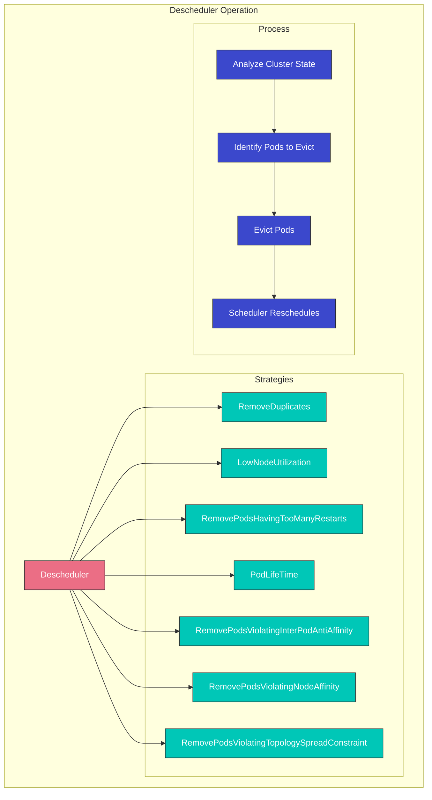

### Why Descheduling Is Needed

1. **Cluster changes**: 新しい Node の追加、Node label の変更
2. **Pod drift**: 初期配置が時間の経過とともに最適でなくなります
3. **Affinity violations**: Cluster の変更後に rule が violated されます
4. **Resource imbalance**: 一部の Node が overutilized、他の Node が underutilized になります
5. **Failed pods**: Pod が restart loop に stuck します

### Key Strategies

| Strategy | Description | Use Case |
|----------|-------------|----------|
| **RemoveDuplicates** | Removes duplicate pods from the same node | Ensure HA after node failures |
| **LowNodeUtilization** | Moves pods from overutilized to underutilized nodes | Balance cluster resources |
| **RemovePodsHavingTooManyRestarts** | Evicts pods with excessive restarts | Clean up problematic pods |
| **PodLifeTime** | Evicts pods older than specified age | Force fresh scheduling |
| **RemovePodsViolatingInterPodAntiAffinity** | Evicts pods violating anti-affinity rules | Restore affinity compliance |
| **RemovePodsViolatingNodeAffinity** | Evicts pods violating node affinity | Restore affinity compliance |
| **RemovePodsViolatingTopologySpreadConstraint** | Evicts pods violating spread constraints | Restore even distribution |

### Helm Installation

```bash
# Add the descheduler Helm repository
helm repo add descheduler https://kubernetes-sigs.github.io/descheduler/

# Install descheduler
helm install descheduler descheduler/descheduler \
  --namespace kube-system \
  --set schedule="*/5 * * * *" \
  --set deschedulerPolicy.strategies.RemoveDuplicates.enabled=true \
  --set deschedulerPolicy.strategies.LowNodeUtilization.enabled=true
```

### DeschedulerPolicy Configuration

```yaml
apiVersion: "descheduler/v1alpha2"
kind: "DeschedulerPolicy"
profiles:
- name: default
  pluginConfig:
  - name: RemoveDuplicates
    args:
      excludeOwnerKinds:
      - DaemonSet
  - name: LowNodeUtilization
    args:
      thresholds:
        cpu: 20
        memory: 20
        pods: 20
      targetThresholds:
        cpu: 50
        memory: 50
        pods: 50
      useDeviationThresholds: false
  - name: RemovePodsHavingTooManyRestarts
    args:
      podRestartThreshold: 10
      includingInitContainers: true
  - name: PodLifeTime
    args:
      maxPodLifeTimeSeconds: 86400  # 24 hours
      podStatusPhases:
      - Running
  - name: RemovePodsViolatingTopologySpreadConstraint
    args:
      constraints:
      - DoNotSchedule
  plugins:
    deschedule:
      enabled:
      - RemoveDuplicates
      - LowNodeUtilization
      - RemovePodsHavingTooManyRestarts
      - PodLifeTime
      - RemovePodsViolatingTopologySpreadConstraint
```

### PDB Respect

Descheduler は Pod Disruption Budgets (PDBs) を尊重します。Pod を evict すると PDB に違反する場合、descheduler はその Pod を evict しません。

```yaml
apiVersion: policy/v1
kind: PodDisruptionBudget
metadata:
  name: web-pdb
spec:
  minAvailable: 2
  selector:
    matchLabels:
      app: web
```

この PDB が設定されている場合、descheduler は descheduling operation 中に `app: web` label を持つ少なくとも 2 つの Pod が available のままであることを保証します。

### Descheduler CronJob Example

```yaml
apiVersion: batch/v1
kind: CronJob
metadata:
  name: descheduler
  namespace: kube-system
spec:
  schedule: "*/30 * * * *"
  jobTemplate:
    spec:
      template:
        spec:
          serviceAccountName: descheduler
          containers:
          - name: descheduler
            image: registry.k8s.io/descheduler/descheduler:v0.28.0
            args:
            - --policy-config-file=/policy/policy.yaml
            - --v=3
            volumeMounts:
            - name: policy
              mountPath: /policy
          volumes:
          - name: policy
            configMap:
              name: descheduler-policy
          restartPolicy: OnFailure
```

> **Deep Dive**: Custom scheduler の詳細については、次を参照してください。
> - [Custom Scheduler Part 1: Basic Concepts](../scheduling/01-custom-scheduler-part1.md)
> - [Custom Scheduler Part 2: Implementation](../scheduling/02-custom-scheduler-part2.md)
> - [Custom Scheduler Part 3: Advanced Features](../scheduling/03-custom-scheduler-part3.md)

## Scheduling Optimization in Amazon EKS

Amazon EKS では、Kubernetes scheduling features を使用して workload を最適化できます。

```mermaid
graph TD
    subgraph "EKS Scheduling Optimization"
        NodeGroups["Node Groups &<br>Instance Types"]
        AZSpread["Availability Zone Distribution"]
        Karpenter["Karpenter<br>Auto Scaling"]
        ResourceOpt["Resource Request &<br>Limit Optimization"]
    end

    subgraph "Node Group Strategies"
        ComputeOpt["Compute Optimized<br>Instances"]
        MemoryOpt["Memory Optimized<br>Instances"]
        SpotInst["Spot Instances"]
        GPUInst["GPU Instances"]
    end

    subgraph "Availability Strategies"
        PodAntiAffinity["Pod Anti-Affinity"]
        TopologySpread["Topology Spread<br>Constraints"]
        MultiAZ["Multi-AZ<br>Deployment"]
    end

    subgraph "Automation Tools"
        VPA["Vertical Pod<br>Autoscaler"]
        HPA["Horizontal Pod<br>Autoscaler"]
        CA["Cluster<br>Autoscaler"]
        KarpenterProv["Karpenter<br>Provisioner"]
    end

    NodeGroups -->|type| ComputeOpt
    NodeGroups -->|type| MemoryOpt
    NodeGroups -->|type| SpotInst
    NodeGroups -->|type| GPUInst

    AZSpread -->|method| PodAntiAffinity
    AZSpread -->|method| TopologySpread
    AZSpread -->|result| MultiAZ

    Karpenter -->|uses| KarpenterProv
    ResourceOpt -->|tool| VPA
    ResourceOpt -->|tool| HPA
    NodeGroups -->|tool| CA

    %% Style definitions
    classDef eksComponent fill:#FF9900,stroke:#333,stroke-width:1px,color:black;
    classDef strategyComponent fill:#EB6E85,stroke:#333,stroke-width:1px,color:white;
    classDef instanceType fill:#00C7B7,stroke:#333,stroke-width:1px,color:white;
    classDef availabilityStrategy fill:#326CE5,stroke:#333,stroke-width:1px,color:white;
    classDef autoTool fill:#3B48CC,stroke:#333,stroke-width:1px,color:white;

    %% Apply classes
    class NodeGroups,AZSpread,Karpenter,ResourceOpt eksComponent;
    class ComputeOpt,MemoryOpt,SpotInst,GPUInst strategyComponent;
    class PodAntiAffinity,TopologySpread,MultiAZ availabilityStrategy;
    class VPA,HPA,CA,KarpenterProv autoTool;
```

### Node Groups and Instance Types

EKS では、さまざまな Node group と instance type を活用することで、workload に適した resources を提供できます。

1. **Various Instance Types**: Compute optimized、memory optimized、storage optimized など
2. **Spot Instances**: Cost-effective な workload 向けの Spot instances
3. **GPU Instances**: AI/ML workload 向けの GPU instances

Node label と taint を使用して、特定の workload を特定の Node group に配置できます。

```bash
# Set labels and taints when creating node group
eksctl create nodegroup \
  --cluster my-cluster \
  --name gpu-nodes \
  --node-labels="workload-type=gpu" \
  --node-type=p3.2xlarge \
  --taints="gpu=true:NoSchedule"
```

### Availability Zone Distribution

EKS では、Pod anti-affinity と topology spread constraints を使用して、workload を複数の availability zone に分散できます。

```yaml
apiVersion: apps/v1
kind: Deployment
metadata:
  name: web-server
spec:
  replicas: 3
  selector:
    matchLabels:
      app: web
  template:
    metadata:
      labels:
        app: web
    spec:
      topologySpreadConstraints:
      - maxSkew: 1
        topologyKey: topology.kubernetes.io/zone
        whenUnsatisfiable: DoNotSchedule
        labelSelector:
          matchLabels:
            app: web
      containers:
      - name: web
        image: nginx
```

上記の例では、`topologySpreadConstraints` が複数の availability zone 全体に Pod を均等に分散します。

### Auto Scaling with Karpenter

Amazon EKS では、Karpenter を使用して workload に適した Node を自動的に provision できます。

```yaml
apiVersion: karpenter.sh/v1
kind: NodePool
metadata:
  name: default
spec:
  template:
    spec:
      requirements:
        - key: karpenter.sh/capacity-type
          operator: In
          values: ["spot", "on-demand"]
        - key: kubernetes.io/arch
          operator: In
          values: ["amd64", "arm64"]
      nodeClassRef:
        name: default-class
  limits:
    cpu: 1000
    memory: 1000Gi
  disruption:
    consolidationPolicy: WhenEmpty
    consolidateAfter: 30s
---
apiVersion: karpenter.k8s.aws/v1
kind: EC2NodeClass
metadata:
  name: default-class
spec:
  subnetSelector:
    karpenter.sh/discovery: my-cluster
  securityGroupSelector:
    karpenter.sh/discovery: my-cluster
```

Karpenter は、Pod の resource requirements に最適な instance type を選択することで cost を最適化します。

### Resource Request and Limit Optimization

EKS で workload resource requests と limits を最適化することは重要です。

1. **Vertical Pod Autoscaler (VPA)**: 実際の workload resource usage に基づいて resource requests を最適化します
2. **Goldilocks**: VPA recommendations を可視化し、resource request optimization を支援します
3. **Resource Quotas**: Namespace ごとの resource usage を制限します

```yaml
# VPA example
apiVersion: autoscaling.k8s.io/v1
kind: VerticalPodAutoscaler
metadata:
  name: frontend-vpa
spec:
  targetRef:
    apiVersion: apps/v1
    kind: Deployment
    name: frontend
  updatePolicy:
    updateMode: "Auto"
```

## Scheduling Best Practices

Kubernetes と EKS における scheduling 最適化の best practices は次のとおりです。

1. **Set appropriate resource requests and limits**:
   - 実際の workload resource usage に基づいて resource requests を設定します
   - 重要な workload に適切な resource limits を設定します
   - VPA を使用して resource requests を自動的に最適化します

2. **Workload distribution**:
   - Pod anti-affinity を使用して重要な workload を複数の Node に分散します
   - Topology spread constraints を使用して workload を複数の availability zone に分散します
   - Node affinity を使用して特定の workload を特定の Node に配置します

3. **Node resource optimization**:
   - さまざまな instance type を使用して workload に適した resources を提供します
   - Cost optimization のために Spot instances を使用します
   - Karpenter を使用して workload に適した Node provisioning を自動化します

4. **PDB configuration**:
   - 重要な workload に PDB を設定します
   - Workload characteristics に適した `minAvailable` または `maxUnavailable` values を選択します
   - PDB operation を定期的に test します

5. **Priority and preemption configuration**:
   - 重要な workload に high priority class を設定します
   - System components には `system-cluster-critical` または `system-node-critical` priority class を使用します
   - Preemption の影響を理解し、test します

6. **Node taints and tolerations**:
   - Specialized workload 用に dedicated Node を設定します
   - Maintenance 中の Node に taint を適用します
   - 適切な toleration を設定します

## Conclusion

Kubernetes scheduling、preemption、eviction mechanisms は、cluster resources を効率的に管理し、workload availability を維持するうえで重要な役割を果たします。これらの feature を理解して活用することで、Amazon EKS cluster で workload を最適化し、信頼性高く運用できます。

Scheduling optimization は継続的な process であり、workload characteristics と cluster state に応じて継続的に調整する必要があります。Monitoring tools を使用して cluster resource usage を追跡し、必要に応じて scheduling policies を調整することが重要です。

## Quiz

この章で学んだ内容を確認するには、[Scheduling, Preemption, and Eviction Quiz](../quizzes/core/08-scheduling-preemption-eviction-quiz.md) に挑戦してください。
