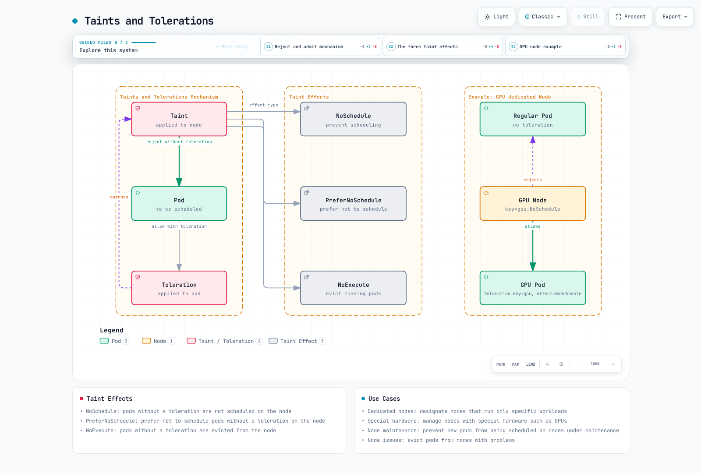
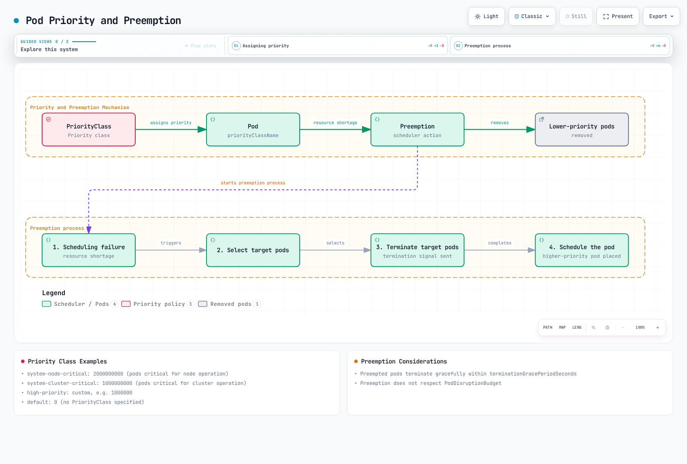
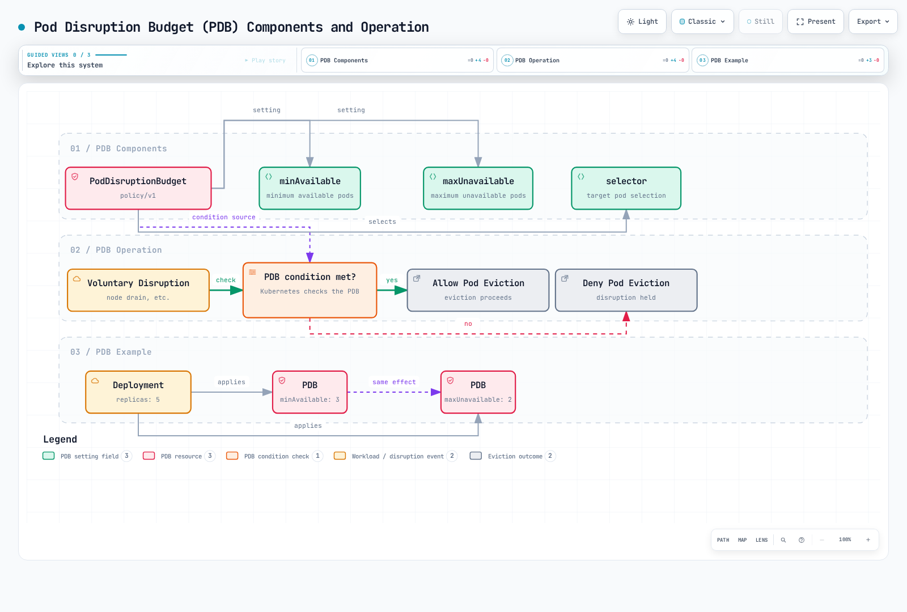
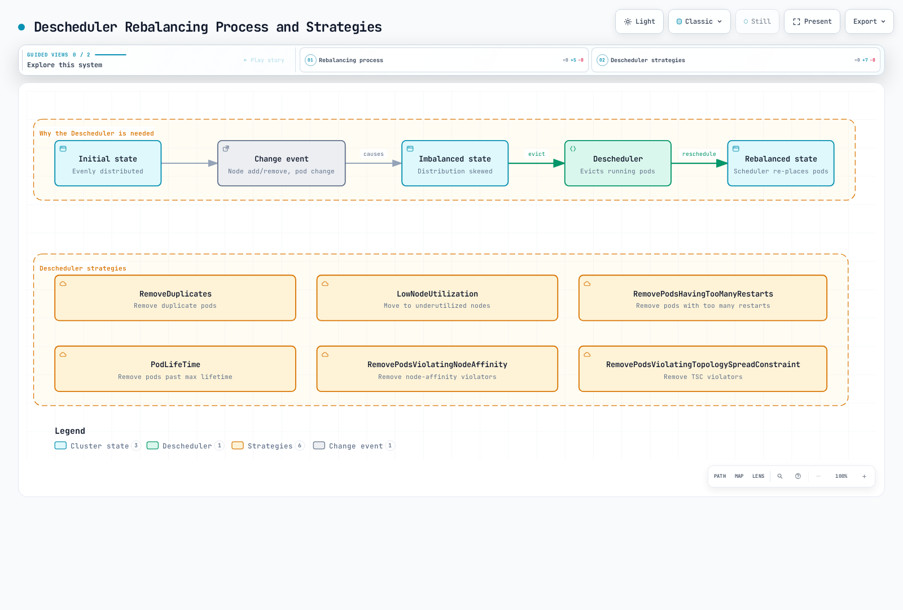

# Kubernetes スケジューリング、Preemption、Eviction

> **サポート対象バージョン**: Kubernetes 1.32 - 1.34
> **最終更新**: February 22, 2026

Kubernetes において、スケジューリングは Pod を適切な Node に配置するプロセスです。Preemption は、より優先度の高い Pod のために、より優先度の低い Pod を削除して場所を確保するプロセスです。Eviction は、Node の問題が発生した際に Pod を安全に移動するプロセスです。この章では、Kubernetes のスケジューリングの仕組み、Node 選択、Preemption、Eviction、および Amazon EKS におけるスケジューリング最適化の手法について学びます。

## ラボ環境のセットアップ

このドキュメントの例に従うには、以下のツールと環境が必要です。

### 必要なツール
- kubectl v1.34 以降
- 稼働中の Kubernetes クラスター（EKS、minikube、kind など）
- 複数の Node を持つクラスター（スケジューリングテスト用）

### スケジューリング例のセットアップ

```bash
# Create namespace
kubectl create namespace scheduling-demo

# Add labels to nodes (if you have multiple nodes)
kubectl label nodes <node-name> disktype=ssd
kubectl label nodes <node-name> gpu=true

# Create a pod using node affinity
kubectl -n scheduling-demo apply -f - <<EOF
apiVersion: v1
kind: Pod
metadata:
  name: nginx-ssd
spec:
  affinity:
    nodeAffinity:
      requiredDuringSchedulingIgnoredDuringExecution:
        nodeSelectorTerms:
        - matchExpressions:
          - key: disktype
            operator: In
            values:
            - ssd
  containers:
  - name: nginx
    image: nginx
EOF

# Create priority class
kubectl apply -f - <<EOF
apiVersion: scheduling.k8s.io/v1
kind: PriorityClass
metadata:
  name: high-priority
value: 1000000
globalDefault: false
description: "This priority class should be used for critical service pods only."
EOF

# Create Pod Disruption Budget (PDB)
kubectl -n scheduling-demo apply -f - <<EOF
apiVersion: policy/v1
kind: PodDisruptionBudget
metadata:
  name: nginx-pdb
spec:
  minAvailable: 1
  selector:
    matchLabels:
      app: nginx
EOF
```

## Kubernetes スケジューリングアーキテクチャ


[🔍 インタラクティブ図を表示](https://www.atomai.click/kubernetes-docs/archmaps/en-core-08-scheduling-preemption-eviction-0.html)

## スケジューリングの概念比較

| 概念 | 目的 | ユースケース | Kubernetes バージョン |
|---------|---------|-----------|-------------------|
| **Node Selector** | 特定のラベルを持つ Node に Pod を配置 | シンプルな Node 選択 | すべてのバージョン |
| **Node Affinity** | 複雑な Node 選択ルールを定義 | 高度な Node 選択 | 1.6+ |
| **Pod Affinity** | Pod を他の Pod の近くに配置 | 関連サービスの同一配置 | 1.6+ |
| **Pod Anti-Affinity** | Pod を他の Pod から離して配置 | 高可用性の確保 | 1.6+ |
| **Taints and Tolerations** | 特定の Pod だけを Node に許可 | 専用 Node、Node 分離 | 1.6+ |
| **Topology Spread Constraints** | トポロジードメイン全体に Pod を分散 | Availability Zone 全体への分散 | 1.16+（1.19 で GA） |
| **Priority and Preemption** | 重要なワークロードを優先 | クリティカルサービスの保証 | 1.8+（1.11 で GA） |
| **Pod Disruption Budget** | 同時に中断される Pod を制限 | 高可用性の確保 | 1.4+（1.21 で GA） |

## 基本的なスケジューリングの概念

> **重要な概念**: Kubernetes scheduler は、Pod を実行する最適な Node を選択する control plane コンポーネントであり、フィルタリングとスコアリングの 2 段階で動作します。

### スケジューリングプロセス

1. **フィルタリングフェーズ（Predicates）**
   - Pod を実行できる適切な Node のセットを特定します
   - リソース要件、Node Selector、Affinity ルール、Taint/Toleration などを考慮します
   - いずれかの条件が満たされない Node を除外します

2. **スコアリングフェーズ（Priorities）**
   - フィルタリングを通過した Node にスコアを割り当てます
   - リソース使用率、Pod 分散、Affinity の設定などを考慮します
   - 最も高いスコアを持つ Node を選択します

3. **バインディングフェーズ**
   - 選択した Node に Pod を割り当てます
   - API server のバインディング情報を更新します

## 目次
1. [スケジューリングの概要](#scheduling-overview)
2. [Scheduler の仕組み](#how-the-scheduler-works)
3. [Node 選択](#node-selection)
4. [Pod Affinity と Anti-Affinity](#pod-affinity-and-anti-affinity)
5. [Taints and Tolerations](#taints-and-tolerations)
6. [Node Affinity](#node-affinity)
7. [Pod Priority と Preemption](#pod-priority-and-preemption)
8. [Pod Eviction](#pod-eviction)
9. [Pod Disruption Budget（PDB）](#pod-disruption-budget-pdb)
10. [Node Pressure Eviction](#node-pressure-eviction)
11. [TopologySpreadConstraints](#topologyspreadconstraints)
12. [Pod Deletion Cost](#pod-deletion-cost)
13. [Descheduler](#descheduler)
14. [Amazon EKS におけるスケジューリング最適化](#scheduling-optimization-in-amazon-eks)
15. [スケジューリングのベストプラクティス](#scheduling-best-practices)
16. [まとめ](#conclusion)

## スケジューリングの概要

Kubernetes scheduler は、Pod を適切な Node に配置する control plane コンポーネントです。scheduler は、Pod を配置する最適な Node を決定するためにさまざまな要因を考慮します。

1. **リソース要件**: Pod が要求する CPU、メモリ、その他のリソース
2. **ハードウェア／ソフトウェア／ポリシー制約**: Node Selector、Node Affinity、Taint など
3. **Affinity／Anti-Affinity の指定**: 他の Pod との配置関係
4. **データ局所性**: データの近くに Pod を配置すること
5. **ワークロード間の干渉**: 異なるワークロード間の干渉を最小化すること
6. **期限**: 時間制約のあるワークロードの考慮

### スケジューリングプロセス

スケジューリングプロセスは、大きく 2 つのフェーズに分かれます。

1. **フィルタリング**: Pod を実行できる Node のセットを特定します
   - リソース要件が満たされているか確認します
   - Node Selector、Affinity、Taint などの制約を確認します

2. **スコアリング**: フィルタリングされた Node をスコアリングし、最適な Node を選択します
   - リソース使用率のバランス
   - Pod 間 Affinity／Anti-Affinity
   - データ局所性
   - Taint／Toleration

## Scheduler の仕組み

Kubernetes scheduler は、以下のプロセスで動作します。


[🔍 インタラクティブ図を表示](https://www.atomai.click/kubernetes-docs/archmaps/en-core-08-scheduling-preemption-eviction-1.html)

1. **Pod キューの監視**: scheduler は API server で未スケジュールの Pod を監視します。
2. **Node フィルタリング**: Pod を実行できる Node のセットを特定します。
3. **Node スコアリング**: フィルタリングされた Node をスコアリングします。
4. **Node 選択**: 最も高いスコアを持つ Node を選択します。
5. **バインディング**: 選択した Node に Pod をバインドします。

### スケジューリングプラグイン

Kubernetes scheduler は、プラグインアーキテクチャを使用して拡張可能に設計されています。スケジューリングプロセスのさまざまな段階で、多様なプラグインが動作します。

1. **フィルタプラグイン**: Pod を実行できない Node を除外します
   - NodeResourcesFit: Node のリソース容量を確認
   - NodeName: Pod の nodeName フィールドを確認
   - NodeUnschedulable: Node がスケジュール可能か確認
   - TaintToleration: Taint と Toleration を確認

2. **スコアプラグイン**: Node にスコアを割り当てます
   - NodeResourcesBalancedAllocation: リソース使用量のバランスを考慮
   - ImageLocality: イメージの局所性を考慮
   - InterPodAffinity: Pod 間 Affinity を考慮
   - NodeAffinity: Node Affinity を考慮

### 複数の Scheduler

Kubernetes では複数の scheduler を同時に実行できます。これにより、特定のワークロード向けにカスタムスケジューリングロジックを実装できます。

```yaml
apiVersion: v1
kind: Pod
metadata:
  name: custom-scheduled-pod
spec:
  schedulerName: my-custom-scheduler
  containers:
  - name: container
    image: nginx
```

上記の例では、`schedulerName` フィールドが Pod をスケジュールする scheduler を指定します。

## Node 選択

Kubernetes は、Pod を特定の Node に配置するための複数のメカニズムを提供します。


[🔍 インタラクティブ図を表示](https://www.atomai.click/kubernetes-docs/archmaps/en-core-08-scheduling-preemption-eviction-2.html)

### Node Selector

Node Selector は、特定のラベルを持つ Node にのみ Pod を配置する、最もシンプルな方法です。

```yaml
apiVersion: v1
kind: Pod
metadata:
  name: gpu-pod
spec:
  nodeSelector:
    gpu: "true"
  containers:
  - name: gpu-container
    image: nvidia/cuda
```

上記の例では、Pod は `gpu=true` ラベルを持つ Node にのみ配置されます。

### nodeName

`nodeName` フィールドを使用すると、Pod を特定の Node に直接配置できます。この方法は scheduler をバイパスするため、一般的には推奨されません。

```yaml
apiVersion: v1
kind: Pod
metadata:
  name: specific-node-pod
spec:
  nodeName: worker-node-1
  containers:
  - name: container
    image: nginx
```

上記の例では、Pod は `worker-node-1` という名前の Node に直接配置されます。

## Pod Affinity と Anti-Affinity

Pod Affinity と Anti-Affinity は、Pod 間の関係に基づいて Pod を配置する方法を提供します。


[🔍 インタラクティブ図を表示](https://www.atomai.click/kubernetes-docs/archmaps/en-core-08-scheduling-preemption-eviction-3.html)

### Pod Affinity

Pod Affinity により、特定のラベルを持つ Pod と同じ Node またはトポロジードメインに Pod が配置されます。

```yaml
apiVersion: v1
kind: Pod
metadata:
  name: frontend
spec:
  affinity:
    podAffinity:
      requiredDuringSchedulingIgnoredDuringExecution:
      - labelSelector:
          matchExpressions:
          - key: app
            operator: In
            values:
            - cache
        topologyKey: kubernetes.io/hostname
  containers:
  - name: frontend
    image: nginx
```

上記の例では、`frontend` Pod は `app=cache` ラベルを持つ Pod と同じホストに配置されます。

### Pod Anti-Affinity

Pod Anti-Affinity により、特定のラベルを持つ Pod とは異なる Node またはトポロジードメインに Pod が配置されます。

```yaml
apiVersion: v1
kind: Pod
metadata:
  name: frontend
  labels:
    app: frontend
spec:
  affinity:
    podAntiAffinity:
      requiredDuringSchedulingIgnoredDuringExecution:
      - labelSelector:
          matchExpressions:
          - key: app
            operator: In
            values:
            - frontend
        topologyKey: kubernetes.io/hostname
  containers:
  - name: frontend
    image: nginx
```

上記の例では、`frontend` Pod は `app=frontend` ラベルを持つ他の Pod とは異なるホストに配置されます。これは、高可用性のために同じアプリケーションのインスタンスを複数の Node に分散する際に役立ちます。

### Affinity の種類

Pod Affinity と Anti-Affinity には 2 種類あります。

1. **requiredDuringSchedulingIgnoredDuringExecution**: スケジューリング時に満たす必要があるハード要件
2. **preferredDuringSchedulingIgnoredDuringExecution**: 優先されますが必須ではないソフト要件

```yaml
# preferredDuringSchedulingIgnoredDuringExecution example
affinity:
  podAffinity:
    preferredDuringSchedulingIgnoredDuringExecution:
    - weight: 100
      podAffinityTerm:
        labelSelector:
          matchExpressions:
          - key: app
            operator: In
            values:
            - cache
        topologyKey: kubernetes.io/hostname
```

上記の例では、`weight` フィールドはこの設定の重みを示します。複数の設定がある場合、より重みの高い設定がより重要と見なされます。

## Taints and Tolerations

Taint と Toleration は、Node が特定の Pod を拒否できるようにするメカニズムです。



[🔍 インタラクティブ図を表示](https://www.atomai.click/kubernetes-docs/archmaps/en-core-08-scheduling-preemption-eviction-4.html)

### Taint

Taint は、Pod が Node にスケジュールされることを制限するために Node に適用されます。

```bash
# Add taint to node
kubectl taint nodes node1 key=value:NoSchedule
```

Taint effect には 3 種類あります。

1. **NoSchedule**: Toleration のない Pod は Node にスケジュールされません
2. **PreferNoSchedule**: Toleration のない Pod を Node にスケジュールしないことを優先します
3. **NoExecute**: Toleration のない Pod は Node から Eviction されます

### Toleration

Toleration は Pod に適用され、Taint を持つ Node にスケジュールできるようにします。

```yaml
apiVersion: v1
kind: Pod
metadata:
  name: nginx
spec:
  tolerations:
  - key: "key"
    operator: "Equal"
    value: "value"
    effect: "NoSchedule"
  containers:
  - name: nginx
    image: nginx
```

上記の例では、Pod は `key=value:NoSchedule` Taint を持つ Node にスケジュールできます。

### ユースケース

Taint と Toleration の一般的なユースケース:

1. **専用 Node**: 特定のワークロードのみを実行する Node を指定
2. **特殊ハードウェア**: GPU などの特殊ハードウェアを持つ Node を管理
3. **Node メンテナンス**: メンテナンス中の Node への新規 Pod スケジューリングを防止
4. **Node の問題**: 問題がある Node から Pod を Eviction

### デフォルト Taint

Kubernetes は一部の Node にデフォルト Taint を適用します。

- **node.kubernetes.io/not-ready**: Node が Ready ではない
- **node.kubernetes.io/unreachable**: Node に到達できない
- **node.kubernetes.io/memory-pressure**: Node にメモリプレッシャーがある
- **node.kubernetes.io/disk-pressure**: Node にディスクプレッシャーがある
- **node.kubernetes.io/pid-pressure**: Node に PID プレッシャーがある
- **node.kubernetes.io/network-unavailable**: Node ネットワークが利用できない
- **node.kubernetes.io/unschedulable**: Node がスケジュール不可である

## Node Affinity

Node Affinity は、特定の Node セットに Pod を配置するための、より表現力の高い方法を提供します。Node Selector よりも複雑な条件を指定できます。

### Node Affinity の種類

Node Affinity には 2 種類あります。

1. **requiredDuringSchedulingIgnoredDuringExecution**: スケジューリング時に満たす必要があるハード要件
2. **preferredDuringSchedulingIgnoredDuringExecution**: 優先されますが必須ではないソフト要件

```yaml
apiVersion: v1
kind: Pod
metadata:
  name: with-node-affinity
spec:
  affinity:
    nodeAffinity:
      requiredDuringSchedulingIgnoredDuringExecution:
        nodeSelectorTerms:
        - matchExpressions:
          - key: kubernetes.io/e2e-az-name
            operator: In
            values:
            - e2e-az1
            - e2e-az2
      preferredDuringSchedulingIgnoredDuringExecution:
      - weight: 1
        preference:
          matchExpressions:
          - key: another-node-label-key
            operator: In
            values:
            - another-node-label-value
  containers:
  - name: with-node-affinity
    image: nginx
```

上記の例では、Pod は `kubernetes.io/e2e-az-name` ラベルが `e2e-az1` または `e2e-az2` である Node にのみ配置されます。さらに、`another-node-label-key=another-node-label-value` ラベルを持つ Node への配置が優先されます。

### 演算子

Node Affinity はさまざまな演算子をサポートします。

- **In**: ラベル値が指定された値のいずれかに一致する
- **NotIn**: ラベル値が指定された値のいずれにも一致しない
- **Exists**: 指定されたキーを持つラベルが存在する
- **DoesNotExist**: 指定されたキーを持つラベルが存在しない
- **Gt**: ラベル値が指定された値より大きい
- **Lt**: ラベル値が指定された値より小さい

## Pod Priority と Preemption

Kubernetes は、重要なワークロードがクラスターリソースを確保できるように、Pod Priority と Preemption の機能を提供します。



[🔍 インタラクティブ図を表示](https://www.atomai.click/kubernetes-docs/archmaps/en-core-08-scheduling-preemption-eviction-5.html)

### PriorityClass

PriorityClass は Pod の相対的な重要度を定義します。優先度の値が高いほど、Pod は重要になります。

```yaml
apiVersion: scheduling.k8s.io/v1
kind: PriorityClass
metadata:
  name: high-priority
value: 1000000
globalDefault: false
description: "This priority class should be used for critical workloads."
```

上記の例では、`value` フィールドは優先度の値を示します。値が高いほど、優先度も高くなります。`globalDefault` フィールドを `true` に設定すると、この PriorityClass は指定された PriorityClass がない Pod に適用されます。

### Pod への PriorityClass の適用

Pod に PriorityClass を適用するには、`priorityClassName` フィールドを使用します。

```yaml
apiVersion: v1
kind: Pod
metadata:
  name: high-priority-pod
spec:
  priorityClassName: high-priority
  containers:
  - name: container
    image: nginx
```

### Preemption

Preemption は、より優先度の高い Pod をスケジュールするために、より優先度の低い Pod を削除するプロセスです。scheduler がより優先度の高い Pod をスケジュールする Node を見つけられない場合、リソースを確保するために優先度の低い Pod を Preemption します。

Preemption プロセス:
1. scheduler がより優先度の高い Pod をスケジュールする Node を見つけられない
2. scheduler が Preemption によって低優先度 Pod を削除する Node を選択する
3. 選択した Node 上の低優先度 Pod に終了シグナルを送信する
4. Pod が正常に終了すると、その Node に高優先度 Pod をスケジュールする

### Preemption に関する考慮事項

Preemption を使用する際の考慮事項:

1. **Graceful Termination Period**: Preemption された Pod は、`terminationGracePeriodSeconds` で指定された時間、正常終了プロセスを経ます
2. **PodDisruptionBudget**: Preemption は PodDisruptionBudget を尊重しません
3. **System Priority Classes**: Kubernetes はシステムコンポーネント用の PriorityClass を提供します
   - `system-cluster-critical`: クラスター運用に不可欠な Pod
   - `system-node-critical`: Node 運用に不可欠な Pod

## Pod Eviction

Pod Eviction は、Node の問題が発生した際に Pod を安全に移動するプロセスです。Eviction はさまざまな理由で発生します。


[🔍 インタラクティブ図を表示](https://www.atomai.click/kubernetes-docs/archmaps/en-core-08-scheduling-preemption-eviction-6.html)

### Eviction の種類

1. **kube-controller-manager による Eviction**:
   - Node が `pod-eviction-timeout` の期間（デフォルト 5 分）NotReady 状態のままである場合
   - Node が Unreachable 状態である場合

2. **kubelet による Eviction**:
   - Node のリソース不足（メモリ、ディスクなど）
   - ハードウェアの問題

3. **ユーザーによる Eviction**:
   - `kubectl drain` コマンドの実行
   - Node メンテナンスタスク

### kubelet Eviction Signals

kubelet は以下の Eviction signal を監視します。

1. **memory.available**: 利用可能なメモリ
2. **nodefs.available**: Node ファイルシステムの利用可能な領域
3. **nodefs.inodesFree**: Node ファイルシステムの利用可能な inode
4. **imagefs.available**: イメージファイルシステムの利用可能な領域
5. **imagefs.inodesFree**: イメージファイルシステムの利用可能な inode
6. **pid.available**: 利用可能なプロセス ID

各 signal には soft および hard threshold を設定できます。

- **Soft Threshold**: threshold を超えた後、`grace-period` 後に Pod を Eviction します
- **Hard Threshold**: threshold を超えると、直ちに Pod を Eviction します

```yaml
# kubelet configuration example
evictionHard:
  memory.available: "100Mi"
  nodefs.available: "10%"
  nodefs.inodesFree: "5%"
  imagefs.available: "15%"
evictionSoft:
  memory.available: "200Mi"
  nodefs.available: "15%"
evictionSoftGracePeriod:
  memory.available: "1m"
  nodefs.available: "2m"
evictionPressureTransitionPeriod: "30s"
```

### Eviction の優先順位

kubelet は以下の順序で Pod を Eviction します。

1. BestEffort QoS class の Pod
2. Burstable QoS class の Pod（リソース使用量が request を超える Pod から開始）
3. Guaranteed QoS class の Pod（request と limit が等しい Pod）

## Pod Disruption Budget (PDB)

Pod Disruption Budget（PDB）は、自発的な中断中にアプリケーションの可用性を維持する方法です。PDB は同時に中断できる Pod の数を制限します。



[🔍 インタラクティブ図を表示](https://www.atomai.click/kubernetes-docs/archmaps/en-core-08-scheduling-preemption-eviction-7.html)

### PDB の定義

```yaml
apiVersion: policy/v1
kind: PodDisruptionBudget
metadata:
  name: frontend-pdb
spec:
  minAvailable: 2
  selector:
    matchLabels:
      app: frontend
```

または

```yaml
apiVersion: policy/v1
kind: PodDisruptionBudget
metadata:
  name: frontend-pdb
spec:
  maxUnavailable: 1
  selector:
    matchLabels:
      app: frontend
```

上記の例:
- `minAvailable`: 常に利用可能でなければならない Pod の最小数
- `maxUnavailable`: 同時に利用不可にできる Pod の最大数
- `selector`: PDB が適用される Pod を選択する Label selector

### PDB の動作

1. Node drain などの自発的な中断が発生すると、Kubernetes は PDB を確認します
2. PDB 条件が満たされている場合、Pod Eviction を続行します
3. PDB 条件が満たされていない場合、Pod Eviction を拒否します

### PDB のベストプラクティス

1. **すべての重要なワークロードに PDB を設定**: 高可用性を必要とするすべてのワークロードに PDB を設定します
2. **適切な値を選択**: ワークロードの特性に応じた `minAvailable` または `maxUnavailable` の値を選択します
3. **レプリカ数を考慮**: PDB の値はレプリカ数より小さくなければなりません
4. **定期的なテスト**: Node drain などのタスクを通じて PDB の動作をテストします

## Node Pressure Eviction

Node Pressure Eviction は、Node のリソース不足により Pod が Eviction されるメカニズムです。

### Node Condition Status

kubelet は以下の Node condition status を報告します。

1. **MemoryPressure**: Node のメモリが不足している
2. **DiskPressure**: Node のディスク領域が不足している
3. **PIDPressure**: Node のプロセス ID が不足している

これらの condition が発生すると、kubelet はリソースを確保するために Pod を Eviction します。

### Eviction Policy の設定

Eviction policy は kubelet 設定で設定できます。

```yaml
# kubelet configuration example
evictionHard:
  memory.available: "100Mi"
  nodefs.available: "10%"
  nodefs.inodesFree: "5%"
  imagefs.available: "15%"
evictionSoft:
  memory.available: "200Mi"
  nodefs.available: "15%"
evictionSoftGracePeriod:
  memory.available: "1m"
  nodefs.available: "2m"
evictionMinimumReclaim:
  memory.available: "50Mi"
  nodefs.available: "5%"
evictionPressureTransitionPeriod: "30s"
```

上記の例:
- `evictionMinimumReclaim`: Eviction 後に回収する必要がある最小リソース
- `evictionPressureTransitionPeriod`: pressure 状態遷移間の待機時間

## TopologySpreadConstraints

TopologySpreadConstraints は、Availability Zone、Node、Region などのトポロジードメイン全体に Pod を分散する方法をきめ細かく制御します。この機能は、高可用性と効率的なリソース使用率を実現するために、Pod Anti-Affinity よりも高い柔軟性を提供します。


[🔍 インタラクティブ図を表示](https://www.atomai.click/kubernetes-docs/archmaps/en-core-08-scheduling-preemption-eviction-8.html)

### 主要フィールド

| フィールド | 説明 | 必須 |
|-------|-------------|----------|
| **maxSkew** | 任意の 2 つのトポロジードメイン間で許可される Pod 数の最大差 | はい |
| **topologyKey** | トポロジードメインを定義する Node label key | はい |
| **whenUnsatisfiable** | 制約を満たせない場合のアクション: `DoNotSchedule` または `ScheduleAnyway` | はい |
| **labelSelector** | 分散計算でカウントする Pod を選択 | はい |
| **minDomains** | 必要なトポロジードメインの最小数（1.27+） | いいえ |
| **matchLabelKeys** | 分散計算で一致させる Pod label key（1.27+） | いいえ |

### whenUnsatisfiable のオプション

- **DoNotSchedule**: 制約を満たせない場合、scheduler は Pod をスケジュールしません（ハード制約）
- **ScheduleAnyway**: scheduler は Pod をスケジュールしますが、skew を最小化する Node により高い優先度を与えます（ソフト制約）

### EKS Availability Zone 分散の例

```yaml
apiVersion: apps/v1
kind: Deployment
metadata:
  name: web-app
spec:
  replicas: 6
  selector:
    matchLabels:
      app: web
  template:
    metadata:
      labels:
        app: web
    spec:
      topologySpreadConstraints:
      - maxSkew: 1
        topologyKey: topology.kubernetes.io/zone
        whenUnsatisfiable: DoNotSchedule
        labelSelector:
          matchLabels:
            app: web
      - maxSkew: 1
        topologyKey: kubernetes.io/hostname
        whenUnsatisfiable: ScheduleAnyway
        labelSelector:
          matchLabels:
            app: web
      containers:
      - name: web
        image: nginx:1.25
        resources:
          requests:
            cpu: 100m
            memory: 128Mi
```

この設定により、以下が保証されます。
1. Pod は Availability Zone 全体に均等に分散される（ハード制約）
2. Pod は各 Zone 内の Node 全体に優先的に分散される（ソフト制約）

### minDomains と matchLabelKeys（Kubernetes 1.27+）

```yaml
apiVersion: apps/v1
kind: Deployment
metadata:
  name: app-with-min-domains
spec:
  replicas: 4
  selector:
    matchLabels:
      app: distributed-app
  template:
    metadata:
      labels:
        app: distributed-app
        version: v1
    spec:
      topologySpreadConstraints:
      - maxSkew: 1
        topologyKey: topology.kubernetes.io/zone
        whenUnsatisfiable: DoNotSchedule
        labelSelector:
          matchLabels:
            app: distributed-app
        minDomains: 3
        matchLabelKeys:
        - version
      containers:
      - name: app
        image: myapp:v1
```

- **minDomains**: Pod が少なくとも 3 つの Zone に分散されることを保証します。利用可能な Zone がそれより少ない場合、スケジューリングはブロックされます。
- **matchLabelKeys**: Pod の `version` label 値を selector で自動的に使用し、selector を変更せずにリビジョンごとの分散を可能にします。

### Pod Anti-Affinity に対する利点

| 観点 | TopologySpreadConstraints | Pod Anti-Affinity |
|--------|---------------------------|-------------------|
| **柔軟性** | 制御された skew を許可（maxSkew > 1） | 二値: 同じドメインまたは異なるドメイン |
| **ソフト制約** | ベストエフォートのための `ScheduleAnyway` | `preferredDuringScheduling` だが制御性は低い |
| **マルチレベル** | 異なる topologyKey による複数の制約 | 複雑なネストルールが必要 |
| **パフォーマンス** | 大規模環境でより優れた scheduler パフォーマンス | 多数の Pod ではスケジューリングが遅くなる可能性 |
| **ユースケース** | 許容範囲を持つ均等分散 | 厳密な分離 |

## Pod Deletion Cost

Pod Deletion Cost は、scale-down 操作中にどの Pod を最初に削除するかを制御できる機能です。`controller.kubernetes.io/pod-deletion-cost` annotation を設定することで、Pod が終了される順序に影響を与えられます。

### 仕組み

Controller（HPA や手動 scale-down など）がレプリカを減らす必要がある場合、以下を考慮します。
1. deletion cost が低い Pod が先に削除されます
2. デフォルトの deletion cost は 0 です
3. 有効な範囲: -2147483648 ～ 2147483647

### 基本例

```yaml
apiVersion: v1
kind: Pod
metadata:
  name: worker-pod
  annotations:
    controller.kubernetes.io/pod-deletion-cost: "100"
spec:
  containers:
  - name: worker
    image: worker:latest
```

### HPA Scale-Down の優先順位制御

HPA scale-down 中に重要な Pod を保護するには deletion cost を使用します。

```yaml
apiVersion: apps/v1
kind: Deployment
metadata:
  name: web-service
spec:
  replicas: 5
  selector:
    matchLabels:
      app: web
  template:
    metadata:
      labels:
        app: web
      # Lower cost pods are deleted first during scale-down
      annotations:
        controller.kubernetes.io/pod-deletion-cost: "0"
    spec:
      containers:
      - name: web
        image: nginx:1.25
```

### Cache 保護パターン

Cache がウォームな Pod を保護するために、deletion cost を動的に調整します。

```yaml
apiVersion: apps/v1
kind: Deployment
metadata:
  name: cache-service
spec:
  replicas: 3
  selector:
    matchLabels:
      app: cache
  template:
    metadata:
      labels:
        app: cache
    spec:
      containers:
      - name: cache
        image: redis:7
      - name: cost-updater
        image: bitnami/kubectl:latest
        command:
        - /bin/sh
        - -c
        - |
          # Update deletion cost based on cache warmth
          while true; do
            CACHE_SIZE=$(redis-cli DBSIZE | awk '{print $2}')
            # Higher cache size = higher cost = less likely to be deleted
            kubectl annotate pod $POD_NAME \
              controller.kubernetes.io/pod-deletion-cost="$CACHE_SIZE" \
              --overwrite
            sleep 60
          done
        env:
        - name: POD_NAME
          valueFrom:
            fieldRef:
              fieldPath: metadata.name
```

### 実用的なユースケース

1. **Stateful ワークロード**: 蓄積された状態を持つ Pod を保護
2. **Leader election**: Leader Pod をより長く実行し続ける
3. **Connection draining**: 長時間接続を処理する時間を与える
4. **Cache warming**: ウォームな Cache を持つ Pod を保持
5. **Batch processing**: 大きな Job を処理する Pod を保持

## Descheduler

Descheduler は、scheduler がより適切な Node に再スケジュールできるように、Node から Pod を Eviction する Kubernetes コンポーネントです。新しい Pod のみを配置する scheduler とは異なり、Descheduler は時間の経過に伴って最適な Pod 配置を維持するのに役立ちます。



[🔍 インタラクティブ図を表示](https://www.atomai.click/kubernetes-docs/archmaps/en-core-08-scheduling-preemption-eviction-9.html)

### Descheduling が必要な理由

1. **クラスターの変更**: 新しい Node の追加、Node label の変更
2. **Pod drift**: 初期配置が時間の経過とともに最適でなくなる
3. **Affinity 違反**: クラスター変更後にルールが違反される
4. **リソースの不均衡**: 一部の Node が過剰利用され、他が十分に利用されていない
5. **失敗した Pod**: 再起動ループに陥った Pod

### 主な戦略

| 戦略 | 説明 | ユースケース |
|----------|-------------|----------|
| **RemoveDuplicates** | 同じ Node から重複する Pod を削除 | Node 障害後の HA を確保 |
| **LowNodeUtilization** | 過剰利用された Node から低利用率 Node へ Pod を移動 | クラスターリソースのバランス |
| **RemovePodsHavingTooManyRestarts** | 過度に再起動している Pod を Eviction | 問題のある Pod をクリーンアップ |
| **PodLifeTime** | 指定された経過時間より古い Pod を Eviction | 新たなスケジューリングを強制 |
| **RemovePodsViolatingInterPodAntiAffinity** | Anti-Affinity ルールに違反する Pod を Eviction | Affinity 準拠を復元 |
| **RemovePodsViolatingNodeAffinity** | Node Affinity に違反する Pod を Eviction | Affinity 準拠を復元 |
| **RemovePodsViolatingTopologySpreadConstraint** | 分散制約に違反する Pod を Eviction | 均等分散を復元 |

### Helm インストール

```bash
# Add the descheduler Helm repository
helm repo add descheduler https://kubernetes-sigs.github.io/descheduler/

# Install descheduler
helm install descheduler descheduler/descheduler \
  --namespace kube-system \
  --set schedule="*/5 * * * *" \
  --set deschedulerPolicy.strategies.RemoveDuplicates.enabled=true \
  --set deschedulerPolicy.strategies.LowNodeUtilization.enabled=true
```

### DeschedulerPolicy の設定

```yaml
apiVersion: "descheduler/v1alpha2"
kind: "DeschedulerPolicy"
profiles:
- name: default
  pluginConfig:
  - name: RemoveDuplicates
    args:
      excludeOwnerKinds:
      - DaemonSet
  - name: LowNodeUtilization
    args:
      thresholds:
        cpu: 20
        memory: 20
        pods: 20
      targetThresholds:
        cpu: 50
        memory: 50
        pods: 50
      useDeviationThresholds: false
  - name: RemovePodsHavingTooManyRestarts
    args:
      podRestartThreshold: 10
      includingInitContainers: true
  - name: PodLifeTime
    args:
      maxPodLifeTimeSeconds: 86400  # 24 hours
      podStatusPhases:
      - Running
  - name: RemovePodsViolatingTopologySpreadConstraint
    args:
      constraints:
      - DoNotSchedule
  plugins:
    deschedule:
      enabled:
      - RemoveDuplicates
      - LowNodeUtilization
      - RemovePodsHavingTooManyRestarts
      - PodLifeTime
      - RemovePodsViolatingTopologySpreadConstraint
```

### PDB の尊重

descheduler は Pod Disruption Budget（PDB）を尊重します。Pod を Eviction すると PDB に違反する場合、descheduler はその Pod を Eviction しません。

```yaml
apiVersion: policy/v1
kind: PodDisruptionBudget
metadata:
  name: web-pdb
spec:
  minAvailable: 2
  selector:
    matchLabels:
      app: web
```

この PDB を設定すると、descheduler は descheduling 操作中に `app: web` label を持つ Pod が少なくとも 2 つ利用可能な状態を維持します。

### Descheduler CronJob の例

```yaml
apiVersion: batch/v1
kind: CronJob
metadata:
  name: descheduler
  namespace: kube-system
spec:
  schedule: "*/30 * * * *"
  jobTemplate:
    spec:
      template:
        spec:
          serviceAccountName: descheduler
          containers:
          - name: descheduler
            image: registry.k8s.io/descheduler/descheduler:v0.28.0
            args:
            - --policy-config-file=/policy/policy.yaml
            - --v=3
            volumeMounts:
            - name: policy
              mountPath: /policy
          volumes:
          - name: policy
            configMap:
              name: descheduler-policy
          restartPolicy: OnFailure
```

> **詳細**: カスタム scheduler の詳細については、以下を参照してください:
> - [Custom Scheduler Part 1: 基本概念](../scheduling/01-custom-scheduler-part1.md)
> - [Custom Scheduler Part 2: 実装](../scheduling/02-custom-scheduler-part2.md)
> - [Custom Scheduler Part 3: 高度な機能](../scheduling/03-custom-scheduler-part3.md)

## Amazon EKS におけるスケジューリング最適化

Amazon EKS では、Kubernetes のスケジューリング機能を使用してワークロードを最適化できます。


[🔍 インタラクティブ図を表示](https://www.atomai.click/kubernetes-docs/archmaps/en-core-08-scheduling-preemption-eviction-11.html)

### Node Group と Instance Type

EKS では、さまざまな Node group と instance type を利用して、ワークロードに適したリソースを提供できます。

1. **さまざまな Instance Type**: Compute optimized、memory optimized、storage optimized など
2. **Spot Instance**: コスト効率の高いワークロードのための Spot Instance
3. **GPU Instance**: AI/ML ワークロードのための GPU Instance

Node label と Taint を使用すると、特定のワークロードを特定の Node group に配置できます。

```bash
# Set labels and taints when creating node group
eksctl create nodegroup \
  --cluster my-cluster \
  --name gpu-nodes \
  --node-labels="workload-type=gpu" \
  --node-type=p3.2xlarge \
  --taints="gpu=true:NoSchedule"
```

### Availability Zone 分散

EKS では、Pod Anti-Affinity と topology spread constraints を使用して、複数の Availability Zone にワークロードを分散できます。

```yaml
apiVersion: apps/v1
kind: Deployment
metadata:
  name: web-server
spec:
  replicas: 3
  selector:
    matchLabels:
      app: web
  template:
    metadata:
      labels:
        app: web
    spec:
      topologySpreadConstraints:
      - maxSkew: 1
        topologyKey: topology.kubernetes.io/zone
        whenUnsatisfiable: DoNotSchedule
        labelSelector:
          matchLabels:
            app: web
      containers:
      - name: web
        image: nginx
```

上記の例では、`topologySpreadConstraints` が複数の Availability Zone に Pod を均等に分散します。

### Karpenter による Auto Scaling

Amazon EKS では、Karpenter を使用してワークロードに適した Node を自動的にプロビジョニングできます。

```yaml
apiVersion: karpenter.sh/v1
kind: NodePool
metadata:
  name: default
spec:
  template:
    spec:
      requirements:
        - key: karpenter.sh/capacity-type
          operator: In
          values: ["spot", "on-demand"]
        - key: kubernetes.io/arch
          operator: In
          values: ["amd64", "arm64"]
      nodeClassRef:
        name: default-class
  limits:
    cpu: 1000
    memory: 1000Gi
  disruption:
    consolidationPolicy: WhenEmpty
    consolidateAfter: 30s
---
apiVersion: karpenter.k8s.aws/v1
kind: EC2NodeClass
metadata:
  name: default-class
spec:
  subnetSelector:
    karpenter.sh/discovery: my-cluster
  securityGroupSelector:
    karpenter.sh/discovery: my-cluster
```

Karpenter は Pod のリソース要件に最適な instance type を選択することでコストを最適化します。

### リソース Request と Limit の最適化

EKS におけるワークロードのリソース request と limit の最適化は重要です。

1. **Vertical Pod Autoscaler（VPA）**: 実際のワークロードリソース使用量に基づいてリソース request を最適化
2. **Goldilocks**: VPA の推奨事項を可視化してリソース request の最適化を支援
3. **Resource Quotas**: namespace ごとのリソース使用量を制限

```yaml
# VPA example
apiVersion: autoscaling.k8s.io/v1
kind: VerticalPodAutoscaler
metadata:
  name: frontend-vpa
spec:
  targetRef:
    apiVersion: apps/v1
    kind: Deployment
    name: frontend
  updatePolicy:
    updateMode: "Auto"
```

## スケジューリングのベストプラクティス

Kubernetes と EKS におけるスケジューリング最適化のベストプラクティス:

1. **適切なリソース request と limit を設定する**:
   - 実際のワークロードリソース使用量に基づいてリソース request を設定する
   - 重要なワークロードに適切なリソース limit を設定する
   - VPA を使用してリソース request を自動的に最適化する

2. **ワークロード分散**:
   - Pod Anti-Affinity を使用して重要なワークロードを複数の Node に分散する
   - topology spread constraints を使用してワークロードを複数の Availability Zone に分散する
   - Node Affinity を使用して特定のワークロードを特定の Node に配置する

3. **Node リソースの最適化**:
   - さまざまな instance type を使用してワークロードに適切なリソースを提供する
   - コスト最適化のために Spot Instance を使用する
   - Karpenter を使用してワークロードに適した Node を自動プロビジョニングする

4. **PDB 設定**:
   - 重要なワークロードに PDB を設定する
   - ワークロードの特性に適した `minAvailable` または `maxUnavailable` の値を選択する
   - PDB の動作を定期的にテストする

5. **Priority と Preemption の設定**:
   - 重要なワークロードに高い PriorityClass を設定する
   - システムコンポーネントには `system-cluster-critical` または `system-node-critical` PriorityClass を使用する
   - Preemption の影響を理解してテストする

6. **Node の Taint と Toleration**:
   - 専門ワークロード用の専用 Node を設定する
   - メンテナンス中の Node に Taint を適用する
   - 適切な Toleration を設定する

## まとめ

Kubernetes のスケジューリング、Preemption、Eviction のメカニズムは、クラスターリソースを効率的に管理し、ワークロードの可用性を維持するうえで重要な役割を果たします。これらの機能を理解して活用することで、Amazon EKS クラスターでワークロードを最適化し、信頼性高く運用できます。

スケジューリングの最適化は継続的なプロセスであり、ワークロードの特性とクラスターの状態に応じて継続的に調整する必要があります。監視ツールを使用してクラスターのリソース使用量を追跡し、必要に応じてスケジューリングポリシーを調整することが重要です。

## クイズ

この章で学んだ内容をテストするには、[スケジューリング、Preemption、Eviction クイズ](../quizzes/core/08-scheduling-preemption-eviction-quiz.md)に挑戦してください。
