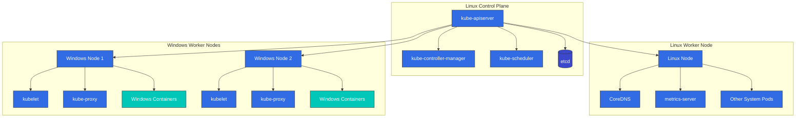
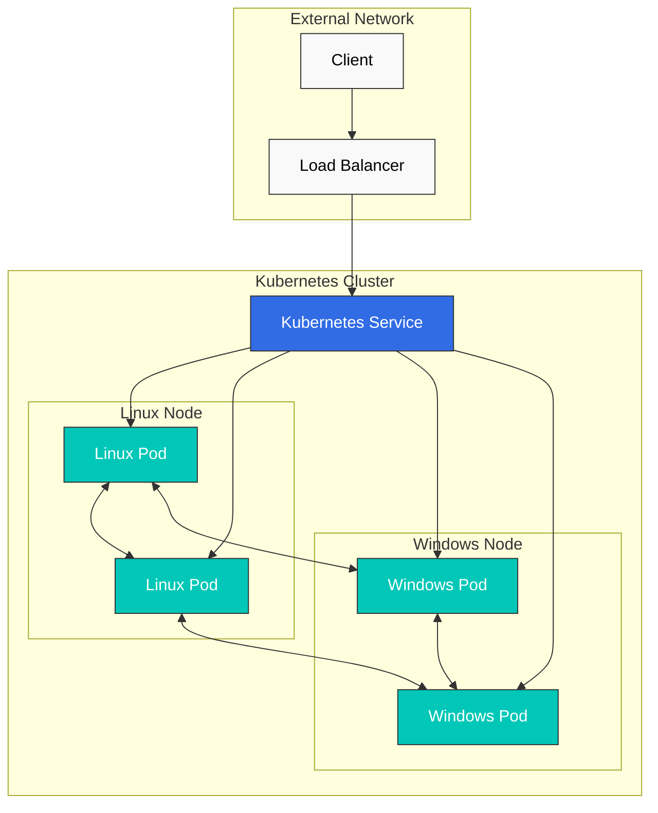
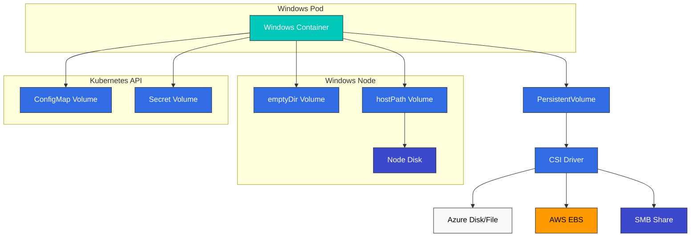
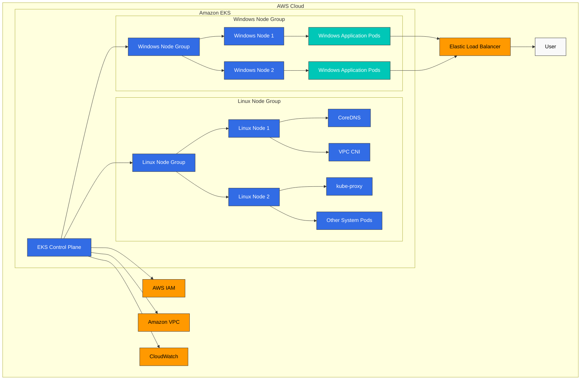

# Windows in Kubernetes

> **Supported Versions**: Kubernetes 1.32, 1.33, 1.34
> **最終更新**: February 11, 2026

Kubernetes はもともと Linux containers 向けに設計されましたが、Windows containers の production support は version 1.14 から追加されました。この章では、Kubernetes で Windows workloads を実行する方法、その architecture、制限事項、そして Amazon EKS における Windows support について見ていきます。

## Table of Contents
1. [Windows Container Overview](#windows-container-overview)
2. [Kubernetes Windows Support Architecture](#kubernetes-windows-support-architecture)
3. [Windows Node Limitations](#windows-node-limitations)
4. [Windows Node Setup](#windows-node-setup)
5. [Deploying Windows Containers](#deploying-windows-containers)
6. [Networking](#networking)
7. [Storage](#storage)
8. [Monitoring and Logging](#monitoring-and-logging)
9. [Security](#security)
10. [Windows Support in Amazon EKS](#windows-support-in-amazon-eks)
11. [Best Practices](#best-practices)
12. [Conclusion](#conclusion)

## Windows Container Overview

Windows containers は Windows operating system 上で実行される containers であり、Windows applications を containerize して deploy できるようにします。

### Windows Container Types

Windows containers には 2 種類あります。

1. **Windows Server Containers**: Linux containers と同様に、host OS kernel を共有します。軽量で素早く起動しますが、host と同じ Windows version が必要です。

2. **Hyper-V Isolation Containers**: 各 container は軽量 VM 内で実行され、より高い level の isolation を提供します。host とは異なる Windows version を実行できますが、より多くの resources を使用します。

次の diagram は、2 種類の Windows container types の architecture 上の違いを示しています。

```mermaid
flowchart TD
    subgraph "Windows Server Containers"
        WSC1[Windows App 1] --- WSC2[Windows App 2] --- WSC3[Windows App 3]
        WSC1 --- WSCR[Container Runtime]
        WSC2 --- WSCR
        WSC3 --- WSCR
        WSCR --- WSOS[Windows Server OS]
        WSOS --- WSHW[Physical Hardware]
    end

    subgraph "Hyper-V Isolation Containers"
        HVC1[Windows App 1] --- HVCR1[Container Runtime]
        HVCR1 --- HVOS1[Windows OS Kernel]

        HVC2[Windows App 2] --- HVCR2[Container Runtime]
        HVCR2 --- HVOS2[Windows OS Kernel]

        HVOS1 --- HV[Hyper-V Hypervisor]
        HVOS2 --- HV
        HV --- HVHOS[Windows Server OS]
        HVHOS --- HVHW[Physical Hardware]
    end

    classDef userApp fill:#00C7B7,stroke:#333,stroke-width:1px,color:white;
    classDef k8sComponent fill:#326CE5,stroke:#333,stroke-width:1px,color:white;
    classDef default fill:#f9f9f9,stroke:#333,stroke-width:1px,color:black;

    class WSC1,WSC2,WSC3,HVC1,HVC2 userApp;
    class WSCR,HVCR1,HVCR2,HVOS1,HVOS2,HV k8sComponent;
    class WSOS,WSHW,HVHOS,HVHW default;
```



### Windows Container Images

Windows container images は Microsoft が提供する base images を基にしています。

1. **Windows Server Core**: 最小限の Windows Server environment を提供する lightweight image
2. **Nano Server**: より小さな footprint を持つ ultra-lightweight image
3. **Windows**: 完全な Windows Server environment を提供する image

Dockerfile の例:

```dockerfile
FROM mcr.microsoft.com/windows/servercore:ltsc2019
WORKDIR /app
COPY . .
RUN powershell -Command "Install-WindowsFeature Web-Server"
EXPOSE 80
CMD ["powershell", "-Command", "Start-Service W3SVC; Get-Content -Path 'C:\\inetpub\\logs\\LogFiles\\W3SVC1\\u_ex*' -Wait"]
```

## Kubernetes Windows Support Architecture

Kubernetes における Windows support は mixed environment を前提としています。Control plane components は常に Linux 上で実行され、worker nodes は Linux または Windows のいずれかにできます。

### Architecture Overview

Kubernetes における Windows support architecture は次のとおりです。

1. **Linux Control Plane**: kube-apiserver、kube-controller-manager、kube-scheduler、etcd は常に Linux 上で実行されます。
2. **Linux Worker Nodes**: system components（CoreDNS、metrics-server など）を実行します。
3. **Windows Worker Nodes**: Windows application workloads を実行します。



### Windows Node Components

Windows nodes 上で実行される Kubernetes components:

1. **kubelet**: node 上の pods と containers を管理します
2. **kube-proxy**: network rules を管理します
3. **CNI Plugin**: network configuration
4. **CSI Plugin**: storage management

## Windows Node Limitations

Kubernetes で Windows nodes を使用する際には、いくつか注意すべき制限事項があります。

### Feature Limitations

1. **Privileged Containers**: Windows は privileged containers を support していません。
2. **Host Network Mode**: Windows pods は host network mode を使用できません。
3. **Pod Security Context**: 一部の security context features（runAsUser、fsGroup など）は support されていません。
4. **DaemonSet**: Windows nodes 上で実行される DaemonSets には特別な考慮が必要です。
5. **emptyDir Volumes**: memory-based emptyDir volumes は Windows では support されていません。
6. **Resource Limits**: CPU limits は Windows では異なる方法で適用されます。

### Networking Limitations

1. **Network Mode**: Windows は L3 networking のみを support します。
2. **Service Types**: Windows nodes では一部の service types に制限があります。
3. **Load Balancing**: 一部の load balancing features は制限される場合があります。

### Operating System Version Compatibility

Windows containers には、host OS version との重要な compatibility considerations があります。

| Container Base Image | Compatible Host OS Versions |
|---------------------|---------------------------|
| Windows Server 2019 | Windows Server 2019 |
| Windows Server 2022 | Windows Server 2022 |

Hyper-V isolation によりこれらの制限を緩和できますが、追加の resources が必要です。
## Windows Node Setup

Kubernetes cluster に Windows nodes を追加する process を見ていきましょう。

### Prerequisites

Windows nodes を setup する前に、次の項目を確認してください。

1. **Kubernetes Version**: 1.14 以降
2. **Windows Version**: Windows Server 2019 以降
3. **Network Plugin**: Windows を support する CNI plugin（Calico、Flannel など）
4. **Container Runtime**: Docker、containerd など

### Preparing Windows Nodes

Windows node を準備する手順:

1. **Install Windows Server**: Windows Server 2019 以降を install します
2. **Enable Container Feature**:

```powershell
Install-WindowsFeature -Name Containers
Restart-Computer -Force
```

3. **Install Docker**:

```powershell
Install-Module -Name DockerMsftProvider -Repository PSGallery -Force
Install-Package -Name Docker -ProviderName DockerMsftProvider -Force
Restart-Computer -Force
```

4. **Install Kubernetes Components**:

```powershell
# Create directory
mkdir -p c:\k

# Download kubelet, kubeadm, kubectl
curl.exe -LO https://dl.k8s.io/v1.22.0/bin/windows/amd64/kubelet.exe
curl.exe -LO https://dl.k8s.io/v1.22.0/bin/windows/amd64/kubectl.exe
curl.exe -LO https://dl.k8s.io/v1.22.0/bin/windows/amd64/kube-proxy.exe
curl.exe -LO https://github.com/kubernetes-sigs/sig-windows-tools/releases/latest/download/wins.exe

# Move files to C:\k
mv kubelet.exe C:\k
mv kubectl.exe C:\k
mv kube-proxy.exe C:\k
mv wins.exe C:\k
```

5. **Configure Network**:

```powershell
# Set firewall rules
New-NetFirewallRule -Name kubelet -DisplayName 'kubelet' -Enabled True -Direction Inbound -Protocol TCP -Action Allow -LocalPort 10250
New-NetFirewallRule -Name https -DisplayName 'https' -Enabled True -Direction Inbound -Protocol TCP -Action Allow -LocalPort 443
New-NetFirewallRule -Name http -DisplayName 'http' -Enabled True -Direction Inbound -Protocol TCP -Action Allow -LocalPort 80
```

### Joining Windows Node Using kubeadm

Linux control plane 上で join token を生成します。

```bash
kubeadm token create --print-join-command
```

Windows node 上で join command を実行します。

```powershell
# Run kubeadm join command
kubeadm join <control-plane-host>:<control-plane-port> --token <token> --discovery-token-ca-cert-hash sha256:<hash>

# Register and start kubelet service
sc.exe create kubelet binPath= "C:\k\kubelet.exe --windows-service --kubeconfig=C:\k\config"
Start-Service kubelet
```

### Setting Windows Node Labels

workload scheduling を制御するために、Windows nodes に適切な labels を設定します。

```bash
kubectl label node <windows-node-name> kubernetes.io/os=windows
kubectl label node <windows-node-name> kubernetes.io/arch=amd64
```

## Deploying Windows Containers

Windows containers を Kubernetes に deploy する方法を見ていきましょう。

### Using Node Selector

Windows workloads を deploy する際は、Windows nodes に確実に schedule されるように node selector を使用します。

```yaml
apiVersion: apps/v1
kind: Deployment
metadata:
  name: iis-deployment
spec:
  replicas: 2
  selector:
    matchLabels:
      app: iis
  template:
    metadata:
      labels:
        app: iis
    spec:
      nodeSelector:
        kubernetes.io/os: windows
      containers:
      - name: iis
        image: mcr.microsoft.com/windows/servercore/iis:windowsservercore-ltsc2019
        resources:
          limits:
            cpu: 1
            memory: 800Mi
          requests:
            cpu: .1
            memory: 300Mi
        ports:
        - containerPort: 80
```

### Resource Requests and Limits

Windows containers の resource requests と limits は、Linux containers とは異なる方法で処理されます。

1. **CPU Limits**: CPU limits は Windows では異なる方法で適用されます。たとえば、CPU limit が 1 の場合、単一 CPU core の 100% を使用できることを意味します。
2. **Memory Limits**: Windows containers は memory limits に従いますが、一部の system processes により追加の overhead が発生する場合があります。

### Container Customization

Windows containers で custom scripts を実行する例:

```yaml
apiVersion: v1
kind: Pod
metadata:
  name: windows-custom-script
spec:
  nodeSelector:
    kubernetes.io/os: windows
  containers:
  - name: windows-container
    image: mcr.microsoft.com/windows/servercore:ltsc2019
    command:
    - powershell.exe
    - -Command
    - |
      while ($true) {
        Write-Host "Hello from Windows container"
        Start-Sleep -Seconds 10
      }
```

### Multi-Container Pods

Windows も multi-container pods を support していますが、いくつか制限があります。

```yaml
apiVersion: v1
kind: Pod
metadata:
  name: windows-multi-container
spec:
  nodeSelector:
    kubernetes.io/os: windows
  containers:
  - name: web
    image: mcr.microsoft.com/windows/servercore/iis:windowsservercore-ltsc2019
    ports:
    - containerPort: 80
  - name: logger
    image: mcr.microsoft.com/windows/servercore:ltsc2019
    command:
    - powershell.exe
    - -Command
    - |
      while ($true) {
        Get-Content -Path 'C:\inetpub\logs\LogFiles\W3SVC1\u_ex*' -Wait
      }
```

## Networking

Windows nodes の networking には Linux nodes とは異なる特徴があります。

次の diagram は、Windows nodes と Linux nodes が混在する Kubernetes cluster の networking architecture を示しています。



### Supported Network Plugins

Windows nodes で support される network plugins:

1. **Flannel**: VXLAN または host-gw mode
2. **Calico**: VXLAN mode
3. **Antrea**: OVS-based networking
4. **Azure CNI**: Azure environments で使用されます
5. **AWS VPC CNI**: AWS environments で使用されます

### Flannel Setup Example

Flannel を使用した Windows networking setup:

```yaml
apiVersion: apps/v1
kind: DaemonSet
metadata:
  name: kube-flannel-ds-windows
  namespace: kube-system
  labels:
    tier: node
    app: flannel
spec:
  selector:
    matchLabels:
      app: flannel
  template:
    metadata:
      labels:
        tier: node
        app: flannel
    spec:
      affinity:
        nodeAffinity:
          requiredDuringSchedulingIgnoredDuringExecution:
            nodeSelectorTerms:
            - matchExpressions:
              - key: kubernetes.io/os
                operator: In
                values:
                - windows
      hostNetwork: true
      containers:
      - name: kube-flannel
        image: sigwindowstools/flannel:v0.13.0
        command:
        - powershell
        args:
        - -file
        - /opt/bin/flannel-host.ps1
        env:
        - name: POD_NAME
          valueFrom:
            fieldRef:
              fieldPath: metadata.name
        - name: POD_NAMESPACE
          valueFrom:
            fieldRef:
              fieldPath: metadata.namespace
        volumeMounts:
        - name: host-run
          mountPath: /run
        - name: cni
          mountPath: /etc/cni/net.d
        - name: flannel-cfg
          mountPath: /etc/kube-flannel/
      volumes:
      - name: host-run
        hostPath:
          path: /run
      - name: cni
        hostPath:
          path: /etc/cni/net.d
      - name: flannel-cfg
        configMap:
          name: kube-flannel-cfg
```

### Exposing Services

Windows nodes 上で services を expose する方法:

```yaml
apiVersion: v1
kind: Service
metadata:
  name: iis-service
spec:
  selector:
    app: iis
  ports:
  - port: 80
    targetPort: 80
  type: LoadBalancer
```

### Network Policies

Windows nodes で network policies を使用するには、network policies を support する CNI plugin（例: Calico）が必要です。

```yaml
apiVersion: networking.k8s.io/v1
kind: NetworkPolicy
metadata:
  name: allow-frontend-to-backend
  namespace: default
spec:
  podSelector:
    matchLabels:
      app: backend
      os: windows
  ingress:
  - from:
    - podSelector:
        matchLabels:
          app: frontend
    ports:
    - protocol: TCP
      port: 80
```

## Storage

Windows nodes で利用できる storage options を見ていきましょう。

次の diagram は、Windows nodes で利用できるさまざまな storage options を示しています。



### Supported Volume Types

Windows nodes で support される volume types:

1. **emptyDir**: temporary storage（memory-based emptyDir は support されません）
2. **hostPath**: host node filesystem
3. **configMap**: configuration data
4. **secret**: sensitive data
5. **azureFile**: Azure File storage
6. **awsElasticBlockStore**: AWS EBS volumes
7. **azureDisk**: Azure Disk storage
8. **CSI**: Container Storage Interface drivers

### emptyDir Volume Example

```yaml
apiVersion: v1
kind: Pod
metadata:
  name: windows-emptydir
spec:
  nodeSelector:
    kubernetes.io/os: windows
  containers:
  - name: windows-container
    image: mcr.microsoft.com/windows/servercore:ltsc2019
    volumeMounts:
    - name: temp-volume
      mountPath: C:\temp
    command:
    - powershell.exe
    - -Command
    - |
      Set-Content -Path C:\temp\test.txt -Value "Hello from Windows"
      while ($true) {
        Get-Content -Path C:\temp\test.txt
        Start-Sleep -Seconds 10
      }
  volumes:
  - name: temp-volume
    emptyDir: {}
```

### hostPath Volume Example

```yaml
apiVersion: v1
kind: Pod
metadata:
  name: windows-hostpath
spec:
  nodeSelector:
    kubernetes.io/os: windows
  containers:
  - name: windows-container
    image: mcr.microsoft.com/windows/servercore:ltsc2019
    volumeMounts:
    - name: logs-volume
      mountPath: C:\logs
    command:
    - powershell.exe
    - -Command
    - |
      Set-Content -Path C:\logs\app.log -Value "Application log"
      while ($true) {
        Add-Content -Path C:\logs\app.log -Value "Log entry at $(Get-Date)"
        Start-Sleep -Seconds 10
      }
  volumes:
  - name: logs-volume
    hostPath:
      path: C:\k\logs
      type: DirectoryOrCreate
```

### ConfigMap and Secret Volume Example

```yaml
apiVersion: v1
kind: ConfigMap
metadata:
  name: windows-config
data:
  config.json: |
    {
      "setting1": "value1",
      "setting2": "value2"
    }
---
apiVersion: v1
kind: Secret
metadata:
  name: windows-secret
type: Opaque
data:
  username: YWRtaW4=  # admin
  password: cGFzc3dvcmQ=  # password
---
apiVersion: v1
kind: Pod
metadata:
  name: windows-config-secret
spec:
  nodeSelector:
    kubernetes.io/os: windows
  containers:
  - name: windows-container
    image: mcr.microsoft.com/windows/servercore:ltsc2019
    volumeMounts:
    - name: config-volume
      mountPath: C:\config
    - name: secret-volume
      mountPath: C:\secret
    command:
    - powershell.exe
    - -Command
    - |
      Get-Content -Path C:\config\config.json
      Get-Content -Path C:\secret\username
      Get-Content -Path C:\secret\password
      while ($true) { Start-Sleep -Seconds 10 }
  volumes:
  - name: config-volume
    configMap:
      name: windows-config
  - name: secret-volume
    secret:
      secretName: windows-secret
```

### Using CSI Drivers

Windows で CSI drivers を使用する例:

```yaml
apiVersion: v1
kind: PersistentVolumeClaim
metadata:
  name: windows-pvc
spec:
  accessModes:
  - ReadWriteOnce
  resources:
    requests:
      storage: 10Gi
  storageClassName: windows-csi
---
apiVersion: v1
kind: Pod
metadata:
  name: windows-csi-pod
spec:
  nodeSelector:
    kubernetes.io/os: windows
  containers:
  - name: windows-container
    image: mcr.microsoft.com/windows/servercore:ltsc2019
    volumeMounts:
    - name: data-volume
      mountPath: C:\data
    command:
    - powershell.exe
    - -Command
    - |
      Set-Content -Path C:\data\file.txt -Value "Persistent data"
      while ($true) { Start-Sleep -Seconds 10 }
  volumes:
  - name: data-volume
    persistentVolumeClaim:
      claimName: windows-pvc
```
## Monitoring and Logging

Windows nodes と containers の monitoring および logging methods を見ていきましょう。

### Monitoring

Windows nodes を monitoring するための tools:

1. **Prometheus Windows Exporter**: Windows node metrics を収集します
2. **metrics-server**: basic resource usage metrics を提供します
3. **Datadog, Dynatrace, New Relic**: commercial monitoring solutions

Windows nodes に Prometheus Windows Exporter を install する例:

```powershell
# Download Windows Exporter
Invoke-WebRequest -Uri https://github.com/prometheus-community/windows_exporter/releases/download/v0.16.0/windows_exporter-0.16.0-amd64.msi -OutFile windows_exporter.msi

# Install Windows Exporter
Start-Process msiexec.exe -ArgumentList '/i', 'windows_exporter.msi', 'ENABLED_COLLECTORS=cpu,memory,disk,net,service,os,system', '/quiet' -Wait
```

Prometheus configuration の例:

```yaml
scrape_configs:
  - job_name: 'windows-nodes'
    static_configs:
      - targets: ['windows-node-1:9182', 'windows-node-2:9182']
```

### Logging

Windows container logs を収集するための tools:

1. **Fluent Bit**: lightweight log collector
2. **Fluentd**: log collection and forwarding
3. **Elasticsearch**: log storage and search
4. **Azure Monitor**: Azure environments で使用されます
5. **CloudWatch Logs**: AWS environments で使用されます

Windows nodes に Fluent Bit を install する例:

```powershell
# Download Fluent Bit
Invoke-WebRequest -Uri https://fluentbit.io/releases/1.8/fluent-bit-1.8.11-win64.zip -OutFile fluent-bit.zip

# Extract
Expand-Archive -Path fluent-bit.zip -DestinationPath C:\fluent-bit

# Create configuration file
@"
[SERVICE]
    Flush        5
    Daemon       Off
    Log_Level    info

[INPUT]
    Name         winlog
    Channels     Application,System,Security

[OUTPUT]
    Name         es
    Match        *
    Host         elasticsearch-host
    Port         9200
    Index        windows_logs
"@ | Out-File -FilePath C:\fluent-bit\conf\fluent-bit.conf -Encoding ascii

# Register service
sc.exe create fluent-bit binPath= "C:\fluent-bit\bin\fluent-bit.exe -c C:\fluent-bit\conf\fluent-bit.conf"
Start-Service fluent-bit
```

### Application Log Collection

Windows container application logs を収集する例:

```yaml
apiVersion: v1
kind: Pod
metadata:
  name: windows-logging
spec:
  nodeSelector:
    kubernetes.io/os: windows
  containers:
  - name: iis
    image: mcr.microsoft.com/windows/servercore/iis:windowsservercore-ltsc2019
    volumeMounts:
    - name: logs
      mountPath: C:\inetpub\logs\LogFiles
  - name: log-collector
    image: mcr.microsoft.com/windows/servercore:ltsc2019
    command:
    - powershell.exe
    - -Command
    - |
      while ($true) {
        Get-Content -Path 'C:\inetpub\logs\LogFiles\W3SVC1\u_ex*' -Wait
      }
    volumeMounts:
    - name: logs
      mountPath: C:\inetpub\logs\LogFiles
  volumes:
  - name: logs
    emptyDir: {}
```

## Security

Windows nodes と containers に関する security considerations を見ていきましょう。

### Windows Node Security

Windows node security に関する recommendations:

1. **Apply Latest Updates**: Windows security updates を定期的に適用します
2. **Firewall Configuration**: Windows Defender Firewall を適切に configure します
3. **Least Privilege Principle**: 必要最小限の permissions のみを付与します
4. **Antivirus Software**: 適切な antivirus software を install します
5. **Group Policy**: security hardening のために group policies を適用します

### Windows Container Security

Windows container security に関する recommendations:

1. **Minimal Base Image**: 可能な限り小さい base image（Nano Server など）を使用します
2. **Image Scanning**: container images の vulnerabilities を scan します
3. **ReadOnlyRootFilesystem**: 可能な場合は read-only root filesystem を使用します
4. **Non-Privileged User**: applications を non-privileged users として実行します
5. **Network Policies**: 適切な network policies を適用します

### RunAsUsername

Windows containers では、container 内で実行する user を指定するために、`runAsUser` の代わりに `runAsUsername` を使用できます。

```yaml
apiVersion: v1
kind: Pod
metadata:
  name: windows-runasusername
spec:
  nodeSelector:
    kubernetes.io/os: windows
  securityContext:
    windowsOptions:
      runAsUserName: "ContainerUser"
  containers:
  - name: windows-container
    image: mcr.microsoft.com/windows/servercore:ltsc2019
    command:
    - powershell.exe
    - -Command
    - |
      whoami
      while ($true) { Start-Sleep -Seconds 10 }
```

### Group Managed Service Accounts (gMSA)

Windows containers で Active Directory authentication を行うための gMSA configuration:

1. **Create gMSA in Active Directory**:

```powershell
# Create gMSA
New-ADServiceAccount -Name WebApp1 -DNSHostName WebApp1.contoso.com -ServicePrincipalNames http/WebApp1.contoso.com -PrincipalsAllowedToRetrieveManagedPassword "Domain Controllers", "Domain Computers"
```

2. **Store gMSA Credentials in Kubernetes**:

```yaml
apiVersion: v1
kind: Secret
metadata:
  name: gmsa-cred-spec
type: microsoft.com/gmsa-credential-spec
data:
  credspec.json: <base64-encoded-credential-spec>
```

3. **Apply gMSA Configuration to Pod**:

```yaml
apiVersion: v1
kind: Pod
metadata:
  name: windows-gmsa
spec:
  nodeSelector:
    kubernetes.io/os: windows
  securityContext:
    windowsOptions:
      gmsaCredentialSpecName: gmsa-cred-spec
  containers:
  - name: windows-container
    image: mcr.microsoft.com/windows/servercore:ltsc2019
    command:
    - powershell.exe
    - -Command
    - |
      whoami
      while ($true) { Start-Sleep -Seconds 10 }
```

## Windows Support in Amazon EKS

Amazon EKS で Windows workloads を実行する方法を見ていきましょう。

次の diagram は、Amazon EKS における Windows support architecture を示しています。



### Enabling Windows Support in EKS

Amazon EKS で Windows support を enable する手順:

1. **Update VPC CNI Plugin**:

```bash
kubectl apply -f https://raw.githubusercontent.com/aws/amazon-vpc-cni-k8s/release-1.11/config/master/vpc-resource-controller.yaml
```

2. **Install Windows VPC Admission Webhook**:

```bash
kubectl apply -f https://raw.githubusercontent.com/aws/amazon-vpc-cni-k8s/release-1.11/config/master/vpc-admission-webhook.yaml
```

### Creating Windows Node Groups

eksctl を使用して Windows node group を作成します。

```bash
eksctl create nodegroup \
  --cluster my-cluster \
  --region us-west-2 \
  --name windows-ng \
  --node-type t3.large \
  --nodes 2 \
  --nodes-min 1 \
  --nodes-max 4 \
  --managed \
  --node-ami-family WindowsServer2019FullContainer
```

AWS Management Console を使用して Windows node group を作成する手順:

1. EKS console で cluster を選択します
2. "Compute" tab を選択します
3. "Add node group" を click します
4. node group details を入力します
5. AMI type として "Windows" を選択します
6. 残りの settings を configure して作成します

### Deploying Windows Applications in EKS

EKS で Windows applications を deploy する例:

```yaml
apiVersion: apps/v1
kind: Deployment
metadata:
  name: windows-server-iis
spec:
  selector:
    matchLabels:
      app: windows-server-iis
      tier: backend
      track: stable
  replicas: 2
  template:
    metadata:
      labels:
        app: windows-server-iis
        tier: backend
        track: stable
    spec:
      nodeSelector:
        kubernetes.io/os: windows
      containers:
      - name: windows-server-iis
        image: mcr.microsoft.com/windows/servercore/iis:windowsservercore-ltsc2019
        ports:
        - name: http
          containerPort: 80
        resources:
          limits:
            cpu: 1
            memory: 800Mi
          requests:
            cpu: .1
            memory: 300Mi
---
apiVersion: v1
kind: Service
metadata:
  name: windows-server-iis-service
  labels:
    app: windows-server-iis
spec:
  ports:
  - port: 80
    protocol: TCP
  selector:
    app: windows-server-iis
  type: LoadBalancer
```

### Windows Container Logging in EKS

CloudWatch Logs を使用して Windows container logs を収集する例:

```yaml
apiVersion: v1
kind: ConfigMap
metadata:
  name: fluent-bit-config
  namespace: amazon-cloudwatch
data:
  fluent-bit.conf: |
    [SERVICE]
        Flush         5
        Log_Level     info
        Daemon        off

    [INPUT]
        Name          tail
        Tag           kube.*
        Path          /var/log/containers/*.log
        Parser        docker
        DB            /var/fluent-bit/state/flb_container.db
        Mem_Buf_Limit 50MB

    [FILTER]
        Name          kubernetes
        Match         kube.*
        Kube_URL      https://kubernetes.default.svc:443
        Merge_Log     On

    [OUTPUT]
        Name          cloudwatch_logs
        Match         kube.*
        region        us-west-2
        log_group_name /aws/eks/my-cluster/windows-logs
        log_stream_prefix windows-
        auto_create_group true
```

## Best Practices

Kubernetes で Windows workloads を実行するための best practices を見ていきましょう。

### Cluster Design Best Practices

1. **Mixed Node Pools**: Linux nodes と Windows nodes を適切に組み合わせて使用します
2. **Node Labels and Taints**: workloads を分離するために適切な node labels と taints を使用します
3. **Version Compatibility**: Kubernetes version と Windows version の compatibility を確認します
4. **Network Plugin Selection**: Windows を support する適切な network plugin を選択します
5. **High Availability**: critical workloads の high availability を configure します

### Application Design Best Practices

1. **Container Image Optimization**: 小さく効率的な container images を使用します
2. **Resource Requests and Limits**: 適切な resource requests と limits を設定します
3. **Stateless Design**: 可能な場合は stateless applications として design します
4. **Logging and Monitoring**: 効果的な logging と monitoring を configure します
5. **Security Hardening**: 適切な security contexts と network policies を適用します

### Operations Best Practices

1. **Regular Updates**: Windows nodes と container images を定期的に update します
2. **Automation**: deployment および management tasks を automate します
3. **Backup and Recovery**: 重要な data を定期的に backup します
4. **Troubleshooting Tools**: 適切な troubleshooting tools と processes を整備します
5. **Documentation**: configurations と procedures を document します

### EKS-Specific Best Practices

1. **Managed Node Groups**: 可能な場合は managed node groups を使用します
2. **IAM Roles for Service Accounts (IRSA)**: pod ごとに IAM permissions を管理します
3. **VPC CNI Configuration**: networking requirements に応じて VPC CNI を configure します
4. **Security Groups**: 適切な security groups を configure します
5. **Cost Optimization**: 適切な instance types と sizes を選択します

## Conclusion

Kubernetes における Windows support は進化を続けており、現在では production environments で Windows workloads を実行できます。Windows nodes は同じ cluster 内で Linux nodes と並行して実行できるため、多様な workloads を単一の Kubernetes cluster で管理できます。

Windows containers により、.NET Framework applications、Windows services、その他の Windows-specific workloads を containerize して、Kubernetes の orchestration capabilities を活用できます。ただし、Linux containers と比較していくつか制限があるため、これらの制限を理解し、適切に対処することが重要です。

Amazon EKS は Windows nodes 向けの managed services を提供し、Windows workloads の deploy と管理を容易にします。EKS の Windows support を活用することで、Windows applications を modern container environments に migrate する process を簡素化できます。

Kubernetes で Windows を成功裏に implement するには、適切な planning、design、operational best practices に従うことが重要です。これにより、Windows workloads と Linux workloads を効率的に管理し、Kubernetes のすべての利点を活用できます。

## Quiz

この章で学んだ内容を確認するには、[Windows in Kubernetes Quiz](../quizzes/core/10-windows-in-kubernetes-quiz.md) を試してください。
