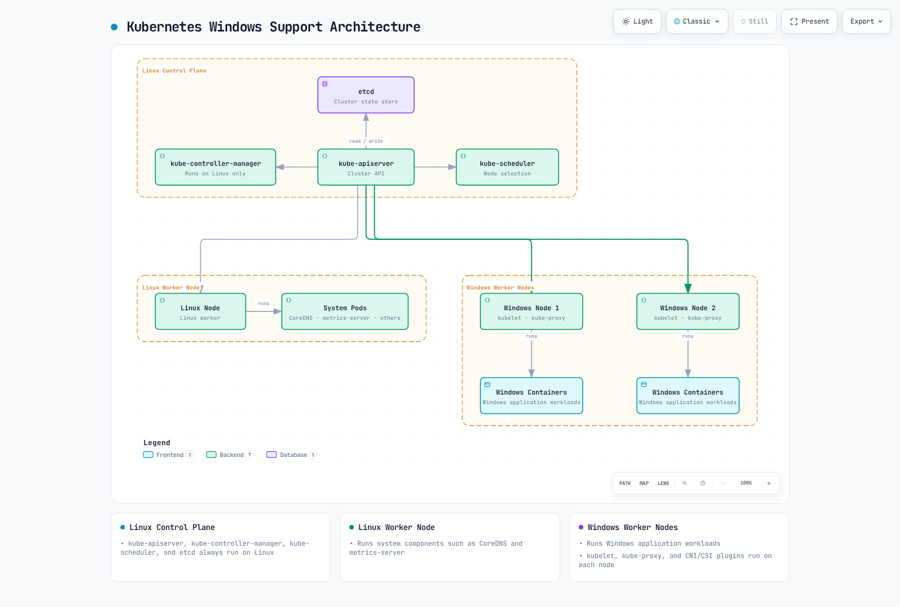
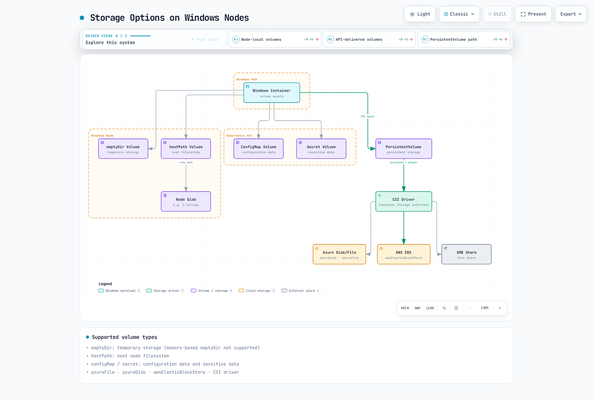
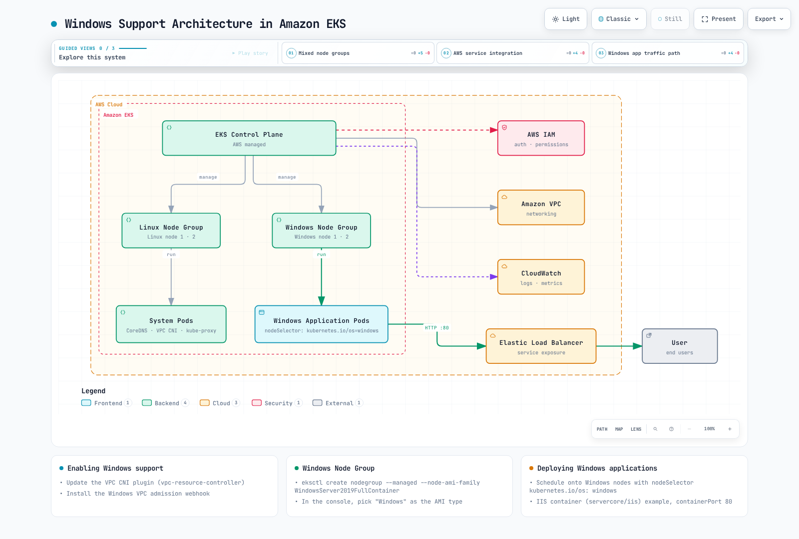

# Kubernetes における Windows

> **対応バージョン**: Kubernetes 1.32, 1.33, 1.34
> **最終更新**: February 11, 2026

Kubernetes はもともと Linux コンテナ向けに設計されましたが、Windows コンテナの本番環境サポートはバージョン 1.14 から追加されました。この章では、Kubernetes で Windows ワークロードを実行する方法、アーキテクチャ、制限事項、および Amazon EKS における Windows サポートについて説明します。

## 目次
1. [Windows コンテナの概要](#windows-container-overview)
2. [Kubernetes の Windows サポートアーキテクチャ](#kubernetes-windows-support-architecture)
3. [Windows Node の制限事項](#windows-node-limitations)
4. [Windows Node のセットアップ](#windows-node-setup)
5. [Windows コンテナのデプロイ](#deploying-windows-containers)
6. [ネットワーキング](#networking)
7. [ストレージ](#storage)
8. [モニタリングとロギング](#monitoring-and-logging)
9. [セキュリティ](#security)
10. [Amazon EKS における Windows サポート](#windows-support-in-amazon-eks)
11. [ベストプラクティス](#best-practices)
12. [まとめ](#conclusion)

## Windows コンテナの概要

Windows コンテナは Windows オペレーティングシステム上で実行されるコンテナであり、Windows アプリケーションをコンテナ化してデプロイできます。

### Windows コンテナの種類

Windows コンテナには、次の 2 種類があります。

1. **Windows Server Containers**: Linux コンテナと同様に、ホスト OS のカーネルを共有します。軽量で起動も高速ですが、ホストと同じ Windows バージョンが必要です。

2. **Hyper-V Isolation Containers**: 各コンテナは軽量 VM 内で実行され、より高いレベルの分離を提供します。ホストとは異なる Windows バージョンを実行できますが、より多くのリソースを使用します。

次の図は、2 種類の Windows コンテナのアーキテクチャ上の違いを示しています。


[🔍 インタラクティブな図を表示](https://www.atomai.click/kubernetes-docs/archmaps/en-core-10-windows-in-kubernetes-0.html)

### Windows コンテナイメージ

Windows コンテナイメージは、Microsoft が提供するベースイメージに基づいています。

1. **Windows Server Core**: 最小限の Windows Server 環境を提供する軽量イメージ
2. **Nano Server**: フットプリントがより小さい超軽量イメージ
3. **Windows**: 完全な Windows Server 環境を提供するイメージ

Dockerfile の例:

```dockerfile
FROM mcr.microsoft.com/windows/servercore:ltsc2019
WORKDIR /app
COPY . .
RUN powershell -Command "Install-WindowsFeature Web-Server"
EXPOSE 80
CMD ["powershell", "-Command", "Start-Service W3SVC; Get-Content -Path 'C:\\inetpub\\logs\\LogFiles\\W3SVC1\\u_ex*' -Wait"]
```

## Kubernetes の Windows サポートアーキテクチャ

Kubernetes の Windows サポートは混在環境に基づいています。Control Plane コンポーネントは常に Linux 上で実行され、Worker Node は Linux または Windows のいずれかにできます。

### アーキテクチャの概要

Kubernetes の Windows サポートアーキテクチャは次のとおりです。

1. **Linux Control Plane**: kube-apiserver、kube-controller-manager、kube-scheduler、etcd は常に Linux 上で実行されます。
2. **Linux Worker Nodes**: システムコンポーネント（CoreDNS、metrics-server など）を実行します。
3. **Windows Worker Nodes**: Windows アプリケーションワークロードを実行します。



[🔍 インタラクティブな図を表示](https://www.atomai.click/kubernetes-docs/archmaps/en-core-10-windows-in-kubernetes-1.html)

### Windows Node コンポーネント

Windows Node 上で実行される Kubernetes コンポーネント:

1. **kubelet**: Node 上の Pod とコンテナを管理します
2. **kube-proxy**: ネットワークルールを管理します
3. **CNI Plugin**: ネットワーク設定
4. **CSI Plugin**: ストレージ管理

## Windows Node の制限事項

Kubernetes で Windows Node を使用する際に認識しておくべき制限事項がいくつかあります。

### 機能上の制限事項

1. **Privileged Containers**: Windows は Privileged Container をサポートしていません。
2. **Host Network Mode**: Windows Pod は Host Network Mode を使用できません。
3. **Pod Security Context**: 一部の Security Context 機能（runAsUser、fsGroup など）はサポートされていません。
4. **DaemonSet**: Windows Node 上で実行する DaemonSet には特別な考慮が必要です。
5. **emptyDir Volumes**: メモリベースの emptyDir Volume は Windows ではサポートされていません。
6. **Resource Limits**: CPU Limit は Windows では異なる方法で適用されます。

### ネットワーキングの制限事項

1. **Network Mode**: Windows は L3 ネットワーキングのみをサポートします。
2. **Service Types**: Windows Node には一部の Service Type に関する制限があります。
3. **Load Balancing**: 一部の Load Balancing 機能は制限される場合があります。

### オペレーティングシステムのバージョン互換性

Windows コンテナでは、ホスト OS のバージョンに関して重要な互換性の考慮事項があります。

| コンテナベースイメージ | 互換性のあるホスト OS バージョン |
|---------------------|---------------------------|
| Windows Server 2019 | Windows Server 2019 |
| Windows Server 2022 | Windows Server 2022 |

Hyper-V 分離によりこれらの制限を緩和できますが、追加のリソースが必要になります。
## Windows Node のセットアップ

Kubernetes クラスターに Windows Node を追加する手順を見ていきましょう。

### 前提条件

Windows Node をセットアップする前に、次を確認してください。

1. **Kubernetes バージョン**: 1.14 以降
2. **Windows バージョン**: Windows Server 2019 以降
3. **Network Plugin**: Windows をサポートする CNI Plugin（Calico、Flannel など）
4. **Container Runtime**: Docker、containerd など

### Windows Node の準備

Windows Node を準備する手順:

1. **Windows Server のインストール**: Windows Server 2019 以降をインストールします
2. **Container 機能の有効化**:

```powershell
Install-WindowsFeature -Name Containers
Restart-Computer -Force
```

3. **Docker のインストール**:

```powershell
Install-Module -Name DockerMsftProvider -Repository PSGallery -Force
Install-Package -Name Docker -ProviderName DockerMsftProvider -Force
Restart-Computer -Force
```

4. **Kubernetes コンポーネントのインストール**:

```powershell
# Create directory
mkdir -p c:\k

# Download kubelet, kubeadm, kubectl
curl.exe -LO https://dl.k8s.io/v1.22.0/bin/windows/amd64/kubelet.exe
curl.exe -LO https://dl.k8s.io/v1.22.0/bin/windows/amd64/kubectl.exe
curl.exe -LO https://dl.k8s.io/v1.22.0/bin/windows/amd64/kube-proxy.exe
curl.exe -LO https://github.com/kubernetes-sigs/sig-windows-tools/releases/latest/download/wins.exe

# Move files to C:\k
mv kubelet.exe C:\k
mv kubectl.exe C:\k
mv kube-proxy.exe C:\k
mv wins.exe C:\k
```

5. **ネットワークの設定**:

```powershell
# Set firewall rules
New-NetFirewallRule -Name kubelet -DisplayName 'kubelet' -Enabled True -Direction Inbound -Protocol TCP -Action Allow -LocalPort 10250
New-NetFirewallRule -Name https -DisplayName 'https' -Enabled True -Direction Inbound -Protocol TCP -Action Allow -LocalPort 443
New-NetFirewallRule -Name http -DisplayName 'http' -Enabled True -Direction Inbound -Protocol TCP -Action Allow -LocalPort 80
```

### kubeadm を使用した Windows Node の参加

Linux Control Plane で join token を生成します:

```bash
kubeadm token create --print-join-command
```

Windows Node で join コマンドを実行します:

```powershell
# Run kubeadm join command
kubeadm join <control-plane-host>:<control-plane-port> --token <token> --discovery-token-ca-cert-hash sha256:<hash>

# Register and start kubelet service
sc.exe create kubelet binPath= "C:\k\kubelet.exe --windows-service --kubeconfig=C:\k\config"
Start-Service kubelet
```

### Windows Node ラベルの設定

ワークロードのスケジューリングを制御するため、Windows Node に適切なラベルを設定します:

```bash
kubectl label node <windows-node-name> kubernetes.io/os=windows
kubectl label node <windows-node-name> kubernetes.io/arch=amd64
```

## Windows コンテナのデプロイ

Windows コンテナを Kubernetes にデプロイする方法を見ていきましょう。

### Node Selector の使用

Windows ワークロードをデプロイする際は、Windows Node にスケジュールされるよう Node Selector を使用します:

```yaml
apiVersion: apps/v1
kind: Deployment
metadata:
  name: iis-deployment
spec:
  replicas: 2
  selector:
    matchLabels:
      app: iis
  template:
    metadata:
      labels:
        app: iis
    spec:
      nodeSelector:
        kubernetes.io/os: windows
      containers:
      - name: iis
        image: mcr.microsoft.com/windows/servercore/iis:windowsservercore-ltsc2019
        resources:
          limits:
            cpu: 1
            memory: 800Mi
          requests:
            cpu: .1
            memory: 300Mi
        ports:
        - containerPort: 80
```

### Resource Requests と Limits

Windows コンテナの Resource Request と Limit は、Linux コンテナとは異なる方法で処理されます。

1. **CPU Limits**: CPU Limit は Windows では異なる方法で適用されます。たとえば、CPU Limit が 1 の場合、単一の CPU コアの 100% を使用できます。
2. **Memory Limits**: Windows コンテナは Memory Limit を尊重しますが、一部のシステムプロセスにより追加のオーバーヘッドが発生する場合があります。

### コンテナのカスタマイズ

Windows コンテナでカスタムスクリプトを実行する例:

```yaml
apiVersion: v1
kind: Pod
metadata:
  name: windows-custom-script
spec:
  nodeSelector:
    kubernetes.io/os: windows
  containers:
  - name: windows-container
    image: mcr.microsoft.com/windows/servercore:ltsc2019
    command:
    - powershell.exe
    - -Command
    - |
      while ($true) {
        Write-Host "Hello from Windows container"
        Start-Sleep -Seconds 10
      }
```

### マルチコンテナ Pod

Windows もマルチコンテナ Pod をサポートしていますが、いくつかの制限があります。

```yaml
apiVersion: v1
kind: Pod
metadata:
  name: windows-multi-container
spec:
  nodeSelector:
    kubernetes.io/os: windows
  containers:
  - name: web
    image: mcr.microsoft.com/windows/servercore/iis:windowsservercore-ltsc2019
    ports:
    - containerPort: 80
  - name: logger
    image: mcr.microsoft.com/windows/servercore:ltsc2019
    command:
    - powershell.exe
    - -Command
    - |
      while ($true) {
        Get-Content -Path 'C:\inetpub\logs\LogFiles\W3SVC1\u_ex*' -Wait
      }
```

## ネットワーキング

Windows Node のネットワーキングには、Linux Node とは異なる特性があります。

次の図は、Windows Node と Linux Node が混在する Kubernetes クラスターのネットワーキングアーキテクチャを示しています。


[🔍 インタラクティブな図を表示](https://www.atomai.click/kubernetes-docs/archmaps/en-core-10-windows-in-kubernetes-2.html)

### サポートされる Network Plugin

Windows Node でサポートされる Network Plugin:

1. **Flannel**: VXLAN または host-gw モード
2. **Calico**: VXLAN モード
3. **Antrea**: OVS ベースのネットワーキング
4. **Azure CNI**: Azure 環境で使用
5. **AWS VPC CNI**: AWS 環境で使用

### Flannel セットアップ例

Flannel を使用した Windows ネットワーク設定:

```yaml
apiVersion: apps/v1
kind: DaemonSet
metadata:
  name: kube-flannel-ds-windows
  namespace: kube-system
  labels:
    tier: node
    app: flannel
spec:
  selector:
    matchLabels:
      app: flannel
  template:
    metadata:
      labels:
        tier: node
        app: flannel
    spec:
      affinity:
        nodeAffinity:
          requiredDuringSchedulingIgnoredDuringExecution:
            nodeSelectorTerms:
            - matchExpressions:
              - key: kubernetes.io/os
                operator: In
                values:
                - windows
      hostNetwork: true
      containers:
      - name: kube-flannel
        image: sigwindowstools/flannel:v0.13.0
        command:
        - powershell
        args:
        - -file
        - /opt/bin/flannel-host.ps1
        env:
        - name: POD_NAME
          valueFrom:
            fieldRef:
              fieldPath: metadata.name
        - name: POD_NAMESPACE
          valueFrom:
            fieldRef:
              fieldPath: metadata.namespace
        volumeMounts:
        - name: host-run
          mountPath: /run
        - name: cni
          mountPath: /etc/cni/net.d
        - name: flannel-cfg
          mountPath: /etc/kube-flannel/
      volumes:
      - name: host-run
        hostPath:
          path: /run
      - name: cni
        hostPath:
          path: /etc/cni/net.d
      - name: flannel-cfg
        configMap:
          name: kube-flannel-cfg
```

### Service の公開

Windows Node 上で Service を公開する方法:

```yaml
apiVersion: v1
kind: Service
metadata:
  name: iis-service
spec:
  selector:
    app: iis
  ports:
  - port: 80
    targetPort: 80
  type: LoadBalancer
```

### Network Policies

Windows Node で Network Policy を使用するには、Network Policy をサポートする CNI Plugin（例: Calico）が必要です:

```yaml
apiVersion: networking.k8s.io/v1
kind: NetworkPolicy
metadata:
  name: allow-frontend-to-backend
  namespace: default
spec:
  podSelector:
    matchLabels:
      app: backend
      os: windows
  ingress:
  - from:
    - podSelector:
        matchLabels:
          app: frontend
    ports:
    - protocol: TCP
      port: 80
```

## ストレージ

Windows Node で利用できるストレージオプションを見ていきましょう。

次の図は、Windows Node で利用できるさまざまなストレージオプションを示しています。



[🔍 インタラクティブな図を表示](https://www.atomai.click/kubernetes-docs/archmaps/en-core-10-windows-in-kubernetes-3.html)

### サポートされる Volume Type

Windows Node でサポートされる Volume Type:

1. **emptyDir**: 一時ストレージ（メモリベースの emptyDir はサポートされません）
2. **hostPath**: ホスト Node のファイルシステム
3. **configMap**: 設定データ
4. **secret**: 機密データ
5. **azureFile**: Azure File ストレージ
6. **awsElasticBlockStore**: AWS EBS Volume
7. **azureDisk**: Azure Disk ストレージ
8. **CSI**: Container Storage Interface Driver

### emptyDir Volume の例

```yaml
apiVersion: v1
kind: Pod
metadata:
  name: windows-emptydir
spec:
  nodeSelector:
    kubernetes.io/os: windows
  containers:
  - name: windows-container
    image: mcr.microsoft.com/windows/servercore:ltsc2019
    volumeMounts:
    - name: temp-volume
      mountPath: C:\temp
    command:
    - powershell.exe
    - -Command
    - |
      Set-Content -Path C:\temp\test.txt -Value "Hello from Windows"
      while ($true) {
        Get-Content -Path C:\temp\test.txt
        Start-Sleep -Seconds 10
      }
  volumes:
  - name: temp-volume
    emptyDir: {}
```

### hostPath Volume の例

```yaml
apiVersion: v1
kind: Pod
metadata:
  name: windows-hostpath
spec:
  nodeSelector:
    kubernetes.io/os: windows
  containers:
  - name: windows-container
    image: mcr.microsoft.com/windows/servercore:ltsc2019
    volumeMounts:
    - name: logs-volume
      mountPath: C:\logs
    command:
    - powershell.exe
    - -Command
    - |
      Set-Content -Path C:\logs\app.log -Value "Application log"
      while ($true) {
        Add-Content -Path C:\logs\app.log -Value "Log entry at $(Get-Date)"
        Start-Sleep -Seconds 10
      }
  volumes:
  - name: logs-volume
    hostPath:
      path: C:\k\logs
      type: DirectoryOrCreate
```

### ConfigMap および Secret Volume の例

```yaml
apiVersion: v1
kind: ConfigMap
metadata:
  name: windows-config
data:
  config.json: |
    {
      "setting1": "value1",
      "setting2": "value2"
    }
---
apiVersion: v1
kind: Secret
metadata:
  name: windows-secret
type: Opaque
data:
  username: YWRtaW4=  # admin
  password: cGFzc3dvcmQ=  # password
---
apiVersion: v1
kind: Pod
metadata:
  name: windows-config-secret
spec:
  nodeSelector:
    kubernetes.io/os: windows
  containers:
  - name: windows-container
    image: mcr.microsoft.com/windows/servercore:ltsc2019
    volumeMounts:
    - name: config-volume
      mountPath: C:\config
    - name: secret-volume
      mountPath: C:\secret
    command:
    - powershell.exe
    - -Command
    - |
      Get-Content -Path C:\config\config.json
      Get-Content -Path C:\secret\username
      Get-Content -Path C:\secret\password
      while ($true) { Start-Sleep -Seconds 10 }
  volumes:
  - name: config-volume
    configMap:
      name: windows-config
  - name: secret-volume
    secret:
      secretName: windows-secret
```

### CSI Driver の使用

Windows で CSI Driver を使用する例:

```yaml
apiVersion: v1
kind: PersistentVolumeClaim
metadata:
  name: windows-pvc
spec:
  accessModes:
  - ReadWriteOnce
  resources:
    requests:
      storage: 10Gi
  storageClassName: windows-csi
---
apiVersion: v1
kind: Pod
metadata:
  name: windows-csi-pod
spec:
  nodeSelector:
    kubernetes.io/os: windows
  containers:
  - name: windows-container
    image: mcr.microsoft.com/windows/servercore:ltsc2019
    volumeMounts:
    - name: data-volume
      mountPath: C:\data
    command:
    - powershell.exe
    - -Command
    - |
      Set-Content -Path C:\data\file.txt -Value "Persistent data"
      while ($true) { Start-Sleep -Seconds 10 }
  volumes:
  - name: data-volume
    persistentVolumeClaim:
      claimName: windows-pvc
```
## モニタリングとロギング

Windows Node とコンテナのモニタリングおよびロギング方法を見ていきましょう。

### モニタリング

Windows Node をモニタリングするツール:

1. **Prometheus Windows Exporter**: Windows Node メトリクスを収集
2. **metrics-server**: 基本的なリソース使用量メトリクスを提供
3. **Datadog、Dynatrace、New Relic**: 商用モニタリングソリューション

Windows Node への Prometheus Windows Exporter のインストール:

```powershell
# Download Windows Exporter
Invoke-WebRequest -Uri https://github.com/prometheus-community/windows_exporter/releases/download/v0.16.0/windows_exporter-0.16.0-amd64.msi -OutFile windows_exporter.msi

# Install Windows Exporter
Start-Process msiexec.exe -ArgumentList '/i', 'windows_exporter.msi', 'ENABLED_COLLECTORS=cpu,memory,disk,net,service,os,system', '/quiet' -Wait
```

Prometheus の設定:

```yaml
scrape_configs:
  - job_name: 'windows-nodes'
    static_configs:
      - targets: ['windows-node-1:9182', 'windows-node-2:9182']
```

### ロギング

Windows コンテナログを収集するツール:

1. **Fluent Bit**: 軽量ログコレクター
2. **Fluentd**: ログの収集と転送
3. **Elasticsearch**: ログの保存と検索
4. **Azure Monitor**: Azure 環境で使用
5. **CloudWatch Logs**: AWS 環境で使用

Windows Node への Fluent Bit のインストール:

```powershell
# Download Fluent Bit
Invoke-WebRequest -Uri https://fluentbit.io/releases/1.8/fluent-bit-1.8.11-win64.zip -OutFile fluent-bit.zip

# Extract
Expand-Archive -Path fluent-bit.zip -DestinationPath C:\fluent-bit

# Create configuration file
@"
[SERVICE]
    Flush        5
    Daemon       Off
    Log_Level    info

[INPUT]
    Name         winlog
    Channels     Application,System,Security

[OUTPUT]
    Name         es
    Match        *
    Host         elasticsearch-host
    Port         9200
    Index        windows_logs
"@ | Out-File -FilePath C:\fluent-bit\conf\fluent-bit.conf -Encoding ascii

# Register service
sc.exe create fluent-bit binPath= "C:\fluent-bit\bin\fluent-bit.exe -c C:\fluent-bit\conf\fluent-bit.conf"
Start-Service fluent-bit
```

### アプリケーションログの収集

Windows コンテナのアプリケーションログを収集する例:

```yaml
apiVersion: v1
kind: Pod
metadata:
  name: windows-logging
spec:
  nodeSelector:
    kubernetes.io/os: windows
  containers:
  - name: iis
    image: mcr.microsoft.com/windows/servercore/iis:windowsservercore-ltsc2019
    volumeMounts:
    - name: logs
      mountPath: C:\inetpub\logs\LogFiles
  - name: log-collector
    image: mcr.microsoft.com/windows/servercore:ltsc2019
    command:
    - powershell.exe
    - -Command
    - |
      while ($true) {
        Get-Content -Path 'C:\inetpub\logs\LogFiles\W3SVC1\u_ex*' -Wait
      }
    volumeMounts:
    - name: logs
      mountPath: C:\inetpub\logs\LogFiles
  volumes:
  - name: logs
    emptyDir: {}
```

## セキュリティ

Windows Node とコンテナに関するセキュリティ上の考慮事項を見ていきましょう。

### Windows Node のセキュリティ

Windows Node のセキュリティに関する推奨事項:

1. **最新アップデートの適用**: Windows セキュリティアップデートを定期的に適用します
2. **Firewall の設定**: Windows Defender Firewall を適切に設定します
3. **最小権限の原則**: 必要最小限の権限のみを付与します
4. **アンチウイルスソフトウェア**: 適切なアンチウイルスソフトウェアをインストールします
5. **Group Policy**: セキュリティ強化のために Group Policy を適用します

### Windows コンテナのセキュリティ

Windows コンテナのセキュリティに関する推奨事項:

1. **最小ベースイメージ**: 可能な限り小さいベースイメージ（Nano Server など）を使用します
2. **イメージスキャン**: コンテナイメージの脆弱性をスキャンします
3. **ReadOnlyRootFilesystem**: 可能な場合は読み取り専用の Root Filesystem を使用します
4. **非 Privileged User**: アプリケーションを非 Privileged User として実行します
5. **Network Policies**: 適切な Network Policy を適用します

### RunAsUsername

Windows コンテナでは、`runAsUser` の代わりに `runAsUsername` を使用して、コンテナ内で実行するユーザーを指定できます:

```yaml
apiVersion: v1
kind: Pod
metadata:
  name: windows-runasusername
spec:
  nodeSelector:
    kubernetes.io/os: windows
  securityContext:
    windowsOptions:
      runAsUserName: "ContainerUser"
  containers:
  - name: windows-container
    image: mcr.microsoft.com/windows/servercore:ltsc2019
    command:
    - powershell.exe
    - -Command
    - |
      whoami
      while ($true) { Start-Sleep -Seconds 10 }
```

### Group Managed Service Accounts (gMSA)

gMSA を Windows コンテナでの Active Directory 認証用に設定する手順:

1. **Active Directory で gMSA を作成**:

```powershell
# Create gMSA
New-ADServiceAccount -Name WebApp1 -DNSHostName WebApp1.contoso.com -ServicePrincipalNames http/WebApp1.contoso.com -PrincipalsAllowedToRetrieveManagedPassword "Domain Controllers", "Domain Computers"
```

2. **gMSA 認証情報を Kubernetes に保存**:

```yaml
apiVersion: v1
kind: Secret
metadata:
  name: gmsa-cred-spec
type: microsoft.com/gmsa-credential-spec
data:
  credspec.json: <base64-encoded-credential-spec>
```

3. **Pod に gMSA 設定を適用**:

```yaml
apiVersion: v1
kind: Pod
metadata:
  name: windows-gmsa
spec:
  nodeSelector:
    kubernetes.io/os: windows
  securityContext:
    windowsOptions:
      gmsaCredentialSpecName: gmsa-cred-spec
  containers:
  - name: windows-container
    image: mcr.microsoft.com/windows/servercore:ltsc2019
    command:
    - powershell.exe
    - -Command
    - |
      whoami
      while ($true) { Start-Sleep -Seconds 10 }
```

## Amazon EKS における Windows サポート

Amazon EKS で Windows ワークロードを実行する方法を見ていきましょう。

次の図は、Amazon EKS における Windows サポートアーキテクチャを示しています。



[🔍 インタラクティブな図を表示](https://www.atomai.click/kubernetes-docs/archmaps/en-core-10-windows-in-kubernetes-4.html)

### EKS での Windows サポートの有効化

Amazon EKS で Windows サポートを有効にする手順:

1. **VPC CNI Plugin の更新**:

```bash
kubectl apply -f https://raw.githubusercontent.com/aws/amazon-vpc-cni-k8s/release-1.11/config/master/vpc-resource-controller.yaml
```

2. **Windows VPC Admission Webhook のインストール**:

```bash
kubectl apply -f https://raw.githubusercontent.com/aws/amazon-vpc-cni-k8s/release-1.11/config/master/vpc-admission-webhook.yaml
```

### Windows Node Group の作成

eksctl を使用して Windows Node Group を作成します:

```bash
eksctl create nodegroup \
  --cluster my-cluster \
  --region us-west-2 \
  --name windows-ng \
  --node-type t3.large \
  --nodes 2 \
  --nodes-min 1 \
  --nodes-max 4 \
  --managed \
  --node-ami-family WindowsServer2019FullContainer
```

AWS Management Console を使用して Windows Node Group を作成する手順:

1. EKS コンソールでクラスターを選択します
2. 「Compute」タブを選択します
3. 「Add node group」をクリックします
4. Node Group の詳細を入力します
5. AMI タイプとして「Windows」を選択します
6. 残りの設定を構成して作成します

### EKS への Windows アプリケーションのデプロイ

EKS に Windows アプリケーションをデプロイする例:

```yaml
apiVersion: apps/v1
kind: Deployment
metadata:
  name: windows-server-iis
spec:
  selector:
    matchLabels:
      app: windows-server-iis
      tier: backend
      track: stable
  replicas: 2
  template:
    metadata:
      labels:
        app: windows-server-iis
        tier: backend
        track: stable
    spec:
      nodeSelector:
        kubernetes.io/os: windows
      containers:
      - name: windows-server-iis
        image: mcr.microsoft.com/windows/servercore/iis:windowsservercore-ltsc2019
        ports:
        - name: http
          containerPort: 80
        resources:
          limits:
            cpu: 1
            memory: 800Mi
          requests:
            cpu: .1
            memory: 300Mi
---
apiVersion: v1
kind: Service
metadata:
  name: windows-server-iis-service
  labels:
    app: windows-server-iis
spec:
  ports:
  - port: 80
    protocol: TCP
  selector:
    app: windows-server-iis
  type: LoadBalancer
```

### EKS における Windows コンテナのロギング

CloudWatch Logs を使用して Windows コンテナログを収集する例:

```yaml
apiVersion: v1
kind: ConfigMap
metadata:
  name: fluent-bit-config
  namespace: amazon-cloudwatch
data:
  fluent-bit.conf: |
    [SERVICE]
        Flush         5
        Log_Level     info
        Daemon        off

    [INPUT]
        Name          tail
        Tag           kube.*
        Path          /var/log/containers/*.log
        Parser        docker
        DB            /var/fluent-bit/state/flb_container.db
        Mem_Buf_Limit 50MB

    [FILTER]
        Name          kubernetes
        Match         kube.*
        Kube_URL      https://kubernetes.default.svc:443
        Merge_Log     On

    [OUTPUT]
        Name          cloudwatch_logs
        Match         kube.*
        region        us-west-2
        log_group_name /aws/eks/my-cluster/windows-logs
        log_stream_prefix windows-
        auto_create_group true
```

## ベストプラクティス

Kubernetes で Windows ワークロードを実行するためのベストプラクティスを見ていきましょう。

### クラスターデザインのベストプラクティス

1. **混在 Node Pool**: Linux Node と Windows Node を適切に組み合わせて使用します
2. **Node Label と Taint**: ワークロードを分離するため、適切な Node Label と Taint を使用します
3. **バージョン互換性**: Kubernetes バージョンと Windows バージョンの互換性を確認します
4. **Network Plugin の選定**: Windows をサポートする適切な Network Plugin を選択します
5. **高可用性**: 重要なワークロードに高可用性を構成します

### アプリケーションデザインのベストプラクティス

1. **コンテナイメージの最適化**: 小さく効率的なコンテナイメージを使用します
2. **Resource Requests と Limits**: 適切な Resource Request と Limit を設定します
3. **ステートレスデザイン**: 可能な場合はステートレスアプリケーションを設計します
4. **ロギングとモニタリング**: 効果的なロギングとモニタリングを構成します
5. **セキュリティ強化**: 適切な Security Context と Network Policy を適用します

### 運用のベストプラクティス

1. **定期的な更新**: Windows Node とコンテナイメージを定期的に更新します
2. **自動化**: デプロイおよび管理タスクを自動化します
3. **バックアップとリカバリ**: 重要なデータを定期的にバックアップします
4. **トラブルシューティングツール**: 適切なトラブルシューティングツールとプロセスを構築します
5. **ドキュメント化**: 設定と手順を文書化します

### EKS 固有のベストプラクティス

1. **Managed Node Groups**: 可能な場合は Managed Node Group を使用します
2. **IAM Roles for Service Accounts (IRSA)**: Pod ごとに IAM 権限を管理します
3. **VPC CNI の設定**: ネットワーキング要件に応じて VPC CNI を設定します
4. **Security Groups**: 適切な Security Group を設定します
5. **コスト最適化**: 適切なインスタンスタイプとサイズを選択します

## まとめ

Kubernetes における Windows サポートは進化を続けており、現在では本番環境で Windows ワークロードを実行できます。Windows Node は同じクラスター内で Linux Node と並行して実行できるため、多様なワークロードを単一の Kubernetes クラスターで管理できます。

Windows コンテナにより、.NET Framework アプリケーション、Windows サービス、その他の Windows 固有ワークロードをコンテナ化し、Kubernetes のオーケストレーション機能を活用できます。ただし、Linux コンテナと比較していくつかの制限があるため、これらの制限を適切に理解して対処することが重要です。

Amazon EKS は Windows Node 向けのマネージドサービスを提供しており、Windows ワークロードのデプロイと管理を容易にします。EKS の Windows サポートを活用することで、Windows アプリケーションを最新のコンテナ環境へ移行するプロセスを簡素化できます。

Kubernetes に Windows を正常に実装するには、適切な計画、設計、運用のベストプラクティスに従うことが重要です。これにより、Windows と Linux のワークロードを効率的に管理し、Kubernetes のすべての利点を活用できます。

## クイズ

この章で学んだ内容を確認するには、[Kubernetes における Windows クイズ](../quizzes/core/10-windows-in-kubernetes-quiz.md)に挑戦してください。
