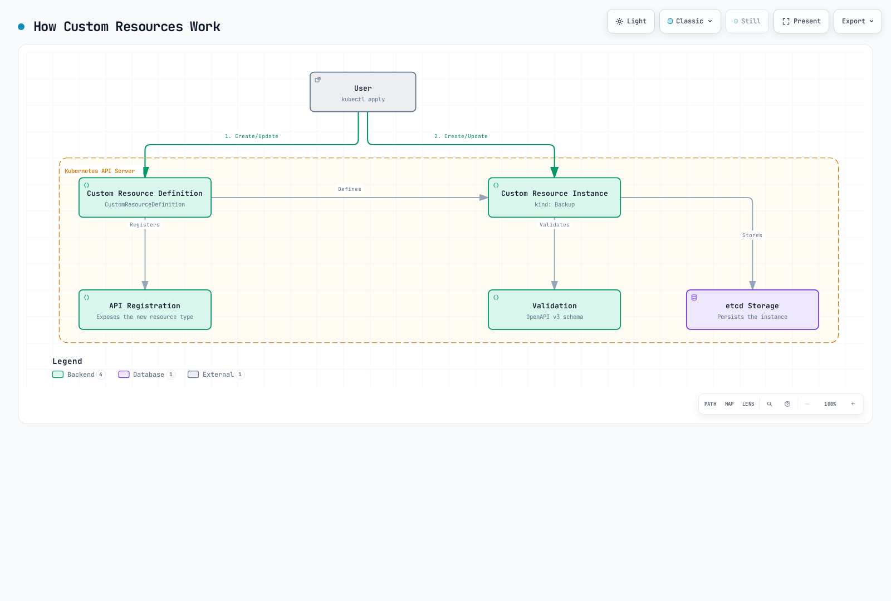

# Kubernetes の拡張

> **サポート対象バージョン**: Kubernetes 1.32, 1.33, 1.34
> **最終更新**: February 19, 2026

Kubernetes は拡張性を念頭に設計されたプラットフォームであり、さまざまな方法で機能を拡張できます。この章では、Kubernetes を拡張するさまざまな方法と、Amazon EKS で拡張機能を活用する方法について説明します。

## 目次
1. [Kubernetes 拡張の概要](#kubernetes-extension-overview)
2. [Custom Resources](#custom-resources)
3. [Operator パターン](#operator-pattern)
4. [Admission Controllers](#admission-controllers)
5. [API Server の拡張](#api-server-extensions)
6. [Scheduler の拡張](#scheduler-extensions)
7. [Cloud Controller Manager](#cloud-controller-manager)
8. [CSI (Container Storage Interface)](#csi-container-storage-interface)
9. [CNI (Container Network Interface)](#cni-container-network-interface)
10. [Device Plugins](#device-plugins)
11. [Amazon EKS の拡張機能](#extension-features-in-amazon-eks)
12. [ベストプラクティス](#best-practices)
13. [まとめ](#conclusion)

## Kubernetes 拡張の概要

Kubernetes には、基本機能を拡張およびカスタマイズするためのさまざまな拡張ポイントが用意されています。主な拡張ポイントは次のとおりです。

1. **Custom Resources**: 新しい API オブジェクトタイプを定義します
2. **Operators**: Custom Resources と Controller を組み合わせて複雑なアプリケーションを管理します
3. **Admission Controllers**: API リクエストをインターセプト、変更、または検証します
4. **API Server Extensions**: API Server に新しいエンドポイントを追加します
5. **Scheduler Extensions**: Pod のスケジューリングロジックをカスタマイズします
6. **Cloud Controller Manager**: クラウドプロバイダー固有の機能を統合します
7. **CSI (Container Storage Interface)**: ストレージシステムを統合します
8. **CNI (Container Network Interface)**: ネットワークソリューションを統合します
9. **Device Plugins**: 特殊なハードウェアを統合します

次の図は、Kubernetes の主な拡張ポイントを示しています。


[🔍 インタラクティブな図を表示](https://www.atomai.click/kubernetes-docs/archmaps/en-core-11-extending-kubernetes-0.html)

### 拡張方法の選択

適切な拡張方法を選択する際の考慮事項は次のとおりです。

1. **ユースケース**: 拡張したい機能の種類
2. **複雑さ**: 実装および保守の複雑さ
3. **パフォーマンスへの影響**: 拡張がクラスターのパフォーマンスに与える影響
4. **アップグレード互換性**: Kubernetes バージョンのアップグレードとの互換性
5. **コミュニティサポート**: 拡張方法に対するコミュニティサポートのレベル

## Custom Resources

Custom Resources は、Kubernetes API を拡張して新しいオブジェクトタイプを定義する方法です。

次の図は、Custom Resources の仕組みを示しています。



[🔍 インタラクティブな図を表示](https://www.atomai.click/kubernetes-docs/archmaps/en-core-11-extending-kubernetes-1.html)

### Custom Resource Definitions (CRD)

CRD は、新しいリソースタイプを定義する最も簡単な方法です。

```yaml
apiVersion: apiextensions.k8s.io/v1
kind: CustomResourceDefinition
metadata:
  name: backups.example.com
spec:
  group: example.com
  names:
    kind: Backup
    listKind: BackupList
    plural: backups
    singular: backup
    shortNames:
    - bk
  scope: Namespaced
  versions:
  - name: v1
    served: true
    storage: true
    schema:
      openAPIV3Schema:
        type: object
        properties:
          spec:
            type: object
            properties:
              source:
                type: string
              destination:
                type: string
              schedule:
                type: string
            required:
            - source
            - destination
          status:
            type: object
            properties:
              phase:
                type: string
              lastBackupTime:
                type: string
                format: date-time
    subresources:
      status: {}
    additionalPrinterColumns:
    - name: Status
      type: string
      jsonPath: .status.phase
    - name: Age
      type: date
      jsonPath: .metadata.creationTimestamp
```

上記の例では、`Backup` という新しいリソースタイプを定義し、リソースのスキーマと追加の表示列を指定しています。

### Custom Resource インスタンスの作成

CRD を定義した後、そのタイプのリソースインスタンスを作成できます。

```yaml
apiVersion: example.com/v1
kind: Backup
metadata:
  name: daily-backup
spec:
  source: /data
  destination: s3://my-bucket/backups
  schedule: "0 0 * * *"
```

### Custom Resource の検証

CRD 内の OpenAPI v3 スキーマを使用して Custom Resources を検証できます。

```yaml
openAPIV3Schema:
  type: object
  properties:
    spec:
      type: object
      properties:
        replicas:
          type: integer
          minimum: 1
          maximum: 10
        image:
          type: string
          pattern: '^[a-zA-Z0-9./:_-]+$'
      required:
      - replicas
      - image
```

上記の例では、`replicas` フィールドは 1 から 10 までの整数である必要があり、`image` フィールドは指定されたパターンに一致する必要があります。

### バージョン管理

CRD は複数のバージョンをサポートし、API の進化を可能にします。

```yaml
versions:
- name: v1alpha1
  served: true
  storage: false
- name: v1beta1
  served: true
  storage: false
- name: v1
  served: true
  storage: true
```

上記の例では、`v1alpha1`、`v1beta1`、`v1` の 3 つのバージョンが提供されますが、データは `v1` 形式で保存されます。

### Conversion Webhooks

Conversion Webhooks を使用して、異なるバージョン間の変換を処理できます。

```yaml
apiVersion: apiextensions.k8s.io/v1
kind: CustomResourceDefinition
metadata:
  name: backups.example.com
spec:
  # ... other fields omitted ...
  conversion:
    strategy: Webhook
    webhook:
      clientConfig:
        service:
          namespace: default
          name: example-conversion-webhook
          path: /convert
      conversionReviewVersions:
      - v1
```

## Operator パターン

Operator パターンは、Custom Resources と Controller を組み合わせて複雑なアプリケーションの運用知識を自動化する方法です。

次の図は、Operator パターンの仕組みを示しています。


[🔍 インタラクティブな図を表示](https://www.atomai.click/kubernetes-docs/archmaps/en-core-11-extending-kubernetes-2.html)

### Operator の概念

Operator は次のコンポーネントで構成されます。

1. **Custom Resource Definition (CRD)**: 管理するリソースのスキーマを定義します
2. **Controller**: Custom Resources を監視し、望ましい状態に調整するロジックです
3. **Kubernetes API Client**: Kubernetes API とやり取りするためのクライアントです

### Operator の例

データベース Operator の例:

```yaml
# Custom Resource Definition
apiVersion: apiextensions.k8s.io/v1
kind: CustomResourceDefinition
metadata:
  name: databases.example.com
spec:
  group: example.com
  names:
    kind: Database
    listKind: DatabaseList
    plural: databases
    singular: database
    shortNames:
    - db
  scope: Namespaced
  versions:
  - name: v1
    served: true
    storage: true
    schema:
      openAPIV3Schema:
        type: object
        properties:
          spec:
            type: object
            properties:
              engine:
                type: string
                enum:
                - mysql
                - postgresql
              version:
                type: string
              storageSize:
                type: string
              replicas:
                type: integer
                minimum: 1
            required:
            - engine
            - version
            - storageSize
          status:
            type: object
            properties:
              phase:
                type: string
              endpoint:
                type: string
    subresources:
      status: {}
```

```yaml
# Database Instance
apiVersion: example.com/v1
kind: Database
metadata:
  name: my-db
spec:
  engine: postgresql
  version: "13.4"
  storageSize: 10Gi
  replicas: 3
```

### Operator 開発ツール

Operator を開発するためのツール:

1. **Operator SDK**: Go、Ansible、または Helm を使用して Operator を開発します
2. **KUDO (Kubernetes Universal Declarative Operator)**: 宣言的に Operator を開発します
3. **Kubebuilder**: Go ベースの Operator 開発フレームワーク
4. **Metacontroller**: Webhook ベースの Operator 開発

#### Operator SDK の例

Operator SDK を使用した Operator の作成:

```bash
# Install Operator SDK
curl -LO https://github.com/operator-framework/operator-sdk/releases/download/v1.16.0/operator-sdk_linux_amd64
chmod +x operator-sdk_linux_amd64
mv operator-sdk_linux_amd64 /usr/local/bin/operator-sdk

# Create new operator project
operator-sdk init --domain example.com --repo github.com/example/database-operator

# Create API
operator-sdk create api --group database --version v1 --kind Database --resource --controller

# Implement controller (main.go, controllers/database_controller.go, etc.)

# Build and deploy operator
make docker-build docker-push
make deploy
```

### 人気の Operator

人気のオープンソース Operator:

1. **Prometheus Operator**: Prometheus のモニタリングスタックを管理します
2. **Elasticsearch Operator**: Elasticsearch クラスターを管理します
3. **etcd Operator**: etcd クラスターを管理します
4. **PostgreSQL Operator**: PostgreSQL データベースを管理します
5. **Jaeger Operator**: Jaeger 分散トレーシングシステムを管理します
6. **Strimzi Kafka Operator**: Apache Kafka クラスターを管理します
7. **Istio Operator**: Istio サービスメッシュを管理します
## Admission Controllers

Admission Controllers は、Kubernetes API server へのリクエストをインターセプトし、変更または検証するプラグインです。

次の図は、Admission Controllers の仕組みを示しています。


[🔍 インタラクティブな図を表示](https://www.atomai.click/kubernetes-docs/archmaps/en-core-11-extending-kubernetes-3.html)

### Admission Controller の種類

Kubernetes には 2 種類の Admission Controllers があります。

1. **Mutating Admission Controllers**: リソースを変更できます
2. **Validating Admission Controllers**: リソースの検証のみを行えます

### 組み込み Admission Controllers

Kubernetes には複数の組み込み Admission Controllers があります。

1. **NamespaceLifecycle**: 削除中の Namespace でリソースが作成されるのを防ぎます
2. **LimitRanger**: Pod と Container のデフォルトリソース制限を設定します
3. **ServiceAccount**: Service Account を自動作成し、トークンを追加します
4. **DefaultStorageClass**: PVC にデフォルトの Storage Class を割り当てます
5. **ResourceQuota**: Namespace ごとのリソース使用量を制限します
6. **PodSecurityPolicy**: Pod セキュリティポリシーを適用します
7. **NodeRestriction**: Node が変更できるリソースを制限します

### Webhook Admission Controllers

Webhook Admission Controllers を使用してカスタムロジックを実装できます。

```yaml
# Mutating Webhook Configuration
apiVersion: admissionregistration.k8s.io/v1
kind: MutatingWebhookConfiguration
metadata:
  name: pod-mutating-webhook
webhooks:
- name: pod-mutator.example.com
  clientConfig:
    service:
      namespace: default
      name: pod-mutating-webhook
      path: "/mutate"
    caBundle: <base64-encoded-ca-cert>
  rules:
  - apiGroups: [""]
    apiVersions: ["v1"]
    resources: ["pods"]
    operations: ["CREATE"]
    scope: "Namespaced"
  admissionReviewVersions: ["v1", "v1beta1"]
  sideEffects: None
  timeoutSeconds: 5
```

```yaml
# Validating Webhook Configuration
apiVersion: admissionregistration.k8s.io/v1
kind: ValidatingWebhookConfiguration
metadata:
  name: pod-validating-webhook
webhooks:
- name: pod-validator.example.com
  clientConfig:
    service:
      namespace: default
      name: pod-validating-webhook
      path: "/validate"
    caBundle: <base64-encoded-ca-cert>
  rules:
  - apiGroups: [""]
    apiVersions: ["v1"]
    resources: ["pods"]
    operations: ["CREATE", "UPDATE"]
    scope: "Namespaced"
  admissionReviewVersions: ["v1", "v1beta1"]
  sideEffects: None
  timeoutSeconds: 5
```

### Webhook Server の実装

Webhook Server では、次のようなエンドポイントを実装する必要があります。

```go
// Mutating webhook example
func mutateHandler(w http.ResponseWriter, r *http.Request) {
    var body []byte
    if r.Body != nil {
        if data, err := ioutil.ReadAll(r.Body); err == nil {
            body = data
        }
    }

    // Convert to AdmissionReview object
    admissionReview := v1.AdmissionReview{}
    if err := json.Unmarshal(body, &admissionReview); err != nil {
        http.Error(w, "Could not parse admission review request", http.StatusBadRequest)
        return
    }

    // Extract Pod object
    pod := corev1.Pod{}
    if err := json.Unmarshal(admissionReview.Request.Object.Raw, &pod); err != nil {
        http.Error(w, "Could not parse pod object", http.StatusBadRequest)
        return
    }

    // Create patch
    patches := []map[string]interface{}{
        {
            "op":    "add",
            "path":  "/metadata/labels/injected-by",
            "value": "mutating-webhook",
        },
    }

    patchBytes, _ := json.Marshal(patches)

    // Create response
    admissionResponse := v1.AdmissionResponse{
        UID:     admissionReview.Request.UID,
        Allowed: true,
        Patch:   patchBytes,
        PatchType: func() *v1.PatchType {
            pt := v1.PatchTypeJSONPatch
            return &pt
        }(),
    }

    admissionReview.Response = &admissionResponse
    resp, _ := json.Marshal(admissionReview)
    w.Header().Set("Content-Type", "application/json")
    w.Write(resp)
}
```

```go
// Validating webhook example
func validateHandler(w http.ResponseWriter, r *http.Request) {
    var body []byte
    if r.Body != nil {
        if data, err := ioutil.ReadAll(r.Body); err == nil {
            body = data
        }
    }

    // Convert to AdmissionReview object
    admissionReview := v1.AdmissionReview{}
    if err := json.Unmarshal(body, &admissionReview); err != nil {
        http.Error(w, "Could not parse admission review request", http.StatusBadRequest)
        return
    }

    // Extract Pod object
    pod := corev1.Pod{}
    if err := json.Unmarshal(admissionReview.Request.Object.Raw, &pod); err != nil {
        http.Error(w, "Could not parse pod object", http.StatusBadRequest)
        return
    }

    // Validation logic
    allowed := true
    var message string
    for _, container := range pod.Spec.Containers {
        if container.Image == "nginx:latest" {
            allowed = false
            message = "Using 'latest' tag is not allowed. Please specify a version."
            break
        }
    }

    // Create response
    admissionResponse := v1.AdmissionResponse{
        UID:     admissionReview.Request.UID,
        Allowed: allowed,
    }

    if !allowed {
        admissionResponse.Result = &metav1.Status{
            Message: message,
        }
    }

    admissionReview.Response = &admissionResponse
    resp, _ := json.Marshal(admissionReview)
    w.Header().Set("Content-Type", "application/json")
    w.Write(resp)
}
```

### 人気の Admission Controller プロジェクト

1. **OPA Gatekeeper**: Open Policy Agent を使用したポリシー適用
2. **Kyverno**: YAML ベースのポリシーエンジン
3. **Istio**: サービスメッシュのサイドカーインジェクション
4. **cert-manager**: TLS 証明書管理

## API Server の拡張

API Server の拡張は、Kubernetes API server に新しいエンドポイントを追加する方法です。

### Extension API Servers

Extension API Servers は、Kubernetes API server とは別に稼働し、カスタム API を提供するサーバーです。

```yaml
# APIService Definition
apiVersion: apiregistration.k8s.io/v1
kind: APIService
metadata:
  name: v1.example.com
spec:
  group: example.com
  version: v1
  groupPriorityMinimum: 1000
  versionPriority: 15
  service:
    name: example-api
    namespace: default
  caBundle: <base64-encoded-ca-cert>
```

### Extension API Server の実装

Extension API Server は、次のコンポーネントで構成されます。

1. **API Server**: Kubernetes API server に似たインターフェースを提供します
2. **Resource Handlers**: 特定のリソースタイプに対するリクエストを処理します
3. **Storage Backend**: リソースデータを保存します

```go
// Extension API Server Example
func main() {
    // Server configuration
    config := genericapiserver.NewRecommendedConfig(apiserver.Codecs)
    config.OpenAPIConfig = genericapiserver.DefaultOpenAPIConfig(
        sampleopenapi.GetOpenAPIDefinitions,
        openapi.NewDefinitionNamer(apiserver.Scheme),
    )
    config.EnableIndex = true
    config.EnableDiscovery = true

    // Create server
    server, err := config.Complete().New("sample-apiserver", genericapiserver.NewEmptyDelegate())
    if err != nil {
        log.Fatalf("Error creating server: %v", err)
    }

    // Set API group info
    apiGroupInfo := genericapiserver.NewDefaultAPIGroupInfo(
        samplev1alpha1.GroupName,
        apiserver.Scheme,
        metav1.ParameterCodec,
        apiserver.Codecs,
    )

    // Set storage
    apiGroupInfo.VersionedResourcesStorageMap["v1alpha1"] = map[string]rest.Storage{
        "widgets": NewWidgetStorage(),
    }

    // Install API group
    if err := server.InstallAPIGroup(&apiGroupInfo); err != nil {
        log.Fatalf("Error installing API group: %v", err)
    }

    // Run server
    if err := server.PrepareRun().Run(stopCh); err != nil {
        log.Fatalf("Error running server: %v", err)
    }
}
```

### Aggregation Layer

Aggregation Layer は、複数の API Server を単一の API Server として見せます。

```
                                   +-----------------+
                                   |                 |
                                   |  kube-apiserver |
                                   |                 |
                                   +-------+---------+
                                           |
                                           v
                      +--------------------+--------------------+
                      |                                         |
                      |                                         |
          +-----------v-----------+               +------------v------------+
          |                       |               |                         |
          |  metrics-server       |               |  example-apiserver      |
          |                       |               |                         |
          +-----------------------+               +-------------------------+
```

## Scheduler の拡張

Scheduler の拡張は、Kubernetes Scheduler の動作をカスタマイズする方法です。

### Scheduler Framework

Kubernetes 1.15 で導入された Scheduler Framework では、プラグインを通じてスケジューリングパイプラインのさまざまな段階を拡張できます。

1. **Queue Sort**: スケジューリングキュー内の Pod をソートします
2. **Pre-filter**: フィルタリングの前に Pod とクラスターの状態を確認します
3. **Filter**: Pod を実行できない Node を除外します
4. **Post-filter**: フィルタリング後にアクションを実行します
5. **Pre-score**: スコア計算前にアクションを実行します
6. **Score**: Node にスコアを割り当てます
7. **Normalize Score**: スコアを正規化します
8. **Reserve**: Pod のリソースを予約します
9. **Permit**: Pod のスケジューリングを許可、拒否、または遅延させます
10. **Pre-bind**: バインド前にアクションを実行します
11. **Bind**: Pod を Node にバインドします
12. **Post-bind**: バインド後にアクションを実行します

### Scheduler の設定

Scheduler 設定の例:

```yaml
apiVersion: kubescheduler.config.k8s.io/v1beta1
kind: KubeSchedulerConfiguration
leaderElection:
  leaderElect: true
clientConnection:
  kubeconfig: /etc/kubernetes/scheduler.conf
profiles:
- schedulerName: default-scheduler
  plugins:
    queueSort:
      enabled:
      - name: PrioritySort
    preFilter:
      enabled:
      - name: NodeResourcesFit
      - name: NodePorts
      - name: PodTopologySpread
      - name: InterPodAffinity
      - name: VolumeBinding
      - name: NodeAffinity
    filter:
      enabled:
      - name: NodeUnschedulable
      - name: NodeName
      - name: TaintToleration
      - name: NodeAffinity
      - name: NodePorts
      - name: NodeResourcesFit
      - name: VolumeRestrictions
      - name: EBSLimits
      - name: GCEPDLimits
      - name: NodeVolumeLimits
      - name: AzureDiskLimits
      - name: VolumeBinding
      - name: VolumeZone
      - name: PodTopologySpread
      - name: InterPodAffinity
    postFilter:
      enabled:
      - name: DefaultPreemption
    preScore:
      enabled:
      - name: InterPodAffinity
      - name: PodTopologySpread
      - name: TaintToleration
      - name: NodeAffinity
    score:
      enabled:
      - name: NodeResourcesBalancedAllocation
        weight: 1
      - name: ImageLocality
        weight: 1
      - name: InterPodAffinity
        weight: 1
      - name: NodeResourcesFit
        weight: 1
      - name: NodeAffinity
        weight: 1
      - name: PodTopologySpread
        weight: 2
      - name: TaintToleration
        weight: 1
    reserve:
      enabled:
      - name: VolumeBinding
    permit:
      enabled: []
    preBind:
      enabled:
      - name: VolumeBinding
    bind:
      enabled:
      - name: DefaultBinder
    postBind:
      enabled: []
```

### Custom Scheduler

Kubernetes と並行して稼働する独自の Scheduler を実装することもできます。

```yaml
apiVersion: apps/v1
kind: Deployment
metadata:
  name: custom-scheduler
  namespace: kube-system
spec:
  replicas: 1
  selector:
    matchLabels:
      app: custom-scheduler
  template:
    metadata:
      labels:
        app: custom-scheduler
    spec:
      serviceAccountName: custom-scheduler
      containers:
      - name: custom-scheduler
        image: example/custom-scheduler:v1.0.0
        command:
        - /custom-scheduler
        - --kubeconfig=/etc/kubernetes/scheduler.conf
        volumeMounts:
        - name: kubeconfig
          mountPath: /etc/kubernetes/scheduler.conf
          readOnly: true
      volumes:
      - name: kubeconfig
        hostPath:
          path: /etc/kubernetes/scheduler.conf
          type: File
```

Pod にカスタム Scheduler を指定する例:

```yaml
apiVersion: v1
kind: Pod
metadata:
  name: custom-scheduled-pod
spec:
  schedulerName: custom-scheduler
  containers:
  - name: container
    image: nginx
```

## Cloud Controller Manager

Cloud Controller Manager は、Kubernetes とクラウドプロバイダーの間のインターフェースを提供します。

### Cloud Controller Manager のコンポーネント

Cloud Controller Manager は、次の Controller で構成されます。

1. **Node Controller**: クラウドプロバイダー API を通じて Node 情報を更新します
2. **Route Controller**: クラウドネットワーク内にルートを設定します
3. **Service Controller**: クラウドの Load Balancer を作成、更新、削除します

### AWS Cloud Controller Manager

AWS Cloud Controller Manager 設定の例:

```yaml
apiVersion: v1
kind: ConfigMap
metadata:
  name: aws-cloud-controller-manager
  namespace: kube-system
data:
  cloud.conf: |
    [global]
    zone = us-east-1a
    vpc = vpc-xxx
    subnet-id = subnet-xxx
    role-arn = arn:aws:iam::xxx:role/xxx
    kubernetes.io/cluster/my-cluster = owned
---
apiVersion: apps/v1
kind: DaemonSet
metadata:
  name: aws-cloud-controller-manager
  namespace: kube-system
spec:
  selector:
    matchLabels:
      k8s-app: aws-cloud-controller-manager
  template:
    metadata:
      labels:
        k8s-app: aws-cloud-controller-manager
    spec:
      nodeSelector:
        node-role.kubernetes.io/master: ""
      tolerations:
      - key: node.cloudprovider.kubernetes.io/uninitialized
        value: "true"
        effect: NoSchedule
      - key: node-role.kubernetes.io/master
        effect: NoSchedule
      serviceAccountName: cloud-controller-manager
      containers:
      - name: aws-cloud-controller-manager
        image: k8s.gcr.io/cloud-controller-manager:v1.21.0
        command:
        - /usr/local/bin/cloud-controller-manager
        - --cloud-provider=aws
        - --cloud-config=/etc/kubernetes/cloud.conf
        - --use-service-account-credentials
        - --allocate-node-cidrs=false
        volumeMounts:
        - name: cloud-config
          mountPath: /etc/kubernetes/cloud.conf
          readOnly: true
      volumes:
      - name: cloud-config
        configMap:
          name: aws-cloud-controller-manager
```
## CSI (Container Storage Interface)

CSI は、Kubernetes とストレージシステムの間に標準インターフェースを提供します。

次の図は、CSI のアーキテクチャと動作を示しています。


[🔍 インタラクティブな図を表示](https://www.atomai.click/kubernetes-docs/archmaps/en-core-11-extending-kubernetes-4.html)

### CSI アーキテクチャ

CSI は次のコンポーネントで構成されます。

1. **CSI Controller Plugin**: ボリュームの作成、削除、スナップショットなどを処理します
2. **CSI Node Plugin**: ボリュームのマウント、アンマウントなどを処理します
3. **CSI Driver**: 特定のストレージシステムと統合する実装です

```
+-------------------+
|                   |
|  Kubernetes       |
|  (External        |
|   Provisioner)    |
|                   |
+--------+----------+
         |
         | gRPC
         v
+--------+----------+
|                   |
|  CSI Driver       |
|                   |
+--------+----------+
         |
         | Storage Protocol
         v
+--------+----------+
|                   |
|  Storage System   |
|                   |
+-------------------+
```

### CSI Driver のデプロイ

CSI Driver デプロイの例:

```yaml
# CSI Controller Service
apiVersion: apps/v1
kind: Deployment
metadata:
  name: csi-controller
spec:
  replicas: 1
  selector:
    matchLabels:
      app: csi-controller
  template:
    metadata:
      labels:
        app: csi-controller
    spec:
      serviceAccountName: csi-controller
      containers:
      - name: csi-provisioner
        image: k8s.gcr.io/sig-storage/csi-provisioner:v2.1.0
        args:
        - "--csi-address=$(ADDRESS)"
        - "--v=5"
        env:
        - name: ADDRESS
          value: /var/lib/csi/sockets/pluginproxy/csi.sock
        volumeMounts:
        - name: socket-dir
          mountPath: /var/lib/csi/sockets/pluginproxy/
      - name: csi-attacher
        image: k8s.gcr.io/sig-storage/csi-attacher:v3.1.0
        args:
        - "--csi-address=$(ADDRESS)"
        - "--v=5"
        env:
        - name: ADDRESS
          value: /var/lib/csi/sockets/pluginproxy/csi.sock
        volumeMounts:
        - name: socket-dir
          mountPath: /var/lib/csi/sockets/pluginproxy/
      - name: csi-driver
        image: example/csi-driver:v1.0.0
        args:
        - "--endpoint=$(CSI_ENDPOINT)"
        - "--nodeid=$(NODE_ID)"
        env:
        - name: CSI_ENDPOINT
          value: unix:///var/lib/csi/sockets/pluginproxy/csi.sock
        - name: NODE_ID
          valueFrom:
            fieldRef:
              fieldPath: spec.nodeName
        volumeMounts:
        - name: socket-dir
          mountPath: /var/lib/csi/sockets/pluginproxy/
      volumes:
      - name: socket-dir
        emptyDir: {}

# CSI Node Service
apiVersion: apps/v1
kind: DaemonSet
metadata:
  name: csi-node
spec:
  selector:
    matchLabels:
      app: csi-node
  template:
    metadata:
      labels:
        app: csi-node
    spec:
      serviceAccountName: csi-node
      hostNetwork: true
      containers:
      - name: csi-node-driver-registrar
        image: k8s.gcr.io/sig-storage/csi-node-driver-registrar:v2.1.0
        args:
        - "--csi-address=$(ADDRESS)"
        - "--kubelet-registration-path=$(DRIVER_REG_SOCK_PATH)"
        - "--v=5"
        env:
        - name: ADDRESS
          value: /csi/csi.sock
        - name: DRIVER_REG_SOCK_PATH
          value: /var/lib/kubelet/plugins/example.csi.k8s.io/csi.sock
        volumeMounts:
        - name: plugin-dir
          mountPath: /csi
        - name: registration-dir
          mountPath: /registration
      - name: csi-driver
        image: example/csi-driver:v1.0.0
        args:
        - "--endpoint=$(CSI_ENDPOINT)"
        - "--nodeid=$(NODE_ID)"
        env:
        - name: CSI_ENDPOINT
          value: unix:///csi/csi.sock
        - name: NODE_ID
          valueFrom:
            fieldRef:
              fieldPath: spec.nodeName
        securityContext:
          privileged: true
        volumeMounts:
        - name: plugin-dir
          mountPath: /csi
        - name: pods-mount-dir
          mountPath: /var/lib/kubelet/pods
          mountPropagation: "Bidirectional"
      volumes:
      - name: plugin-dir
        hostPath:
          path: /var/lib/kubelet/plugins/example.csi.k8s.io
          type: DirectoryOrCreate
      - name: registration-dir
        hostPath:
          path: /var/lib/kubelet/plugins_registry
          type: Directory
      - name: pods-mount-dir
        hostPath:
          path: /var/lib/kubelet/pods
          type: Directory
```

### Storage Class と PVC

CSI Driver を使用した Storage Class と PVC の例:

```yaml
# Storage Class
apiVersion: storage.k8s.io/v1
kind: StorageClass
metadata:
  name: example-csi
provisioner: example.csi.k8s.io
parameters:
  type: ssd
  fsType: ext4
reclaimPolicy: Delete
allowVolumeExpansion: true
volumeBindingMode: Immediate

# PVC
apiVersion: v1
kind: PersistentVolumeClaim
metadata:
  name: example-pvc
spec:
  accessModes:
  - ReadWriteOnce
  resources:
    requests:
      storage: 10Gi
  storageClassName: example-csi
```

### 人気の CSI Drivers

1. **AWS EBS CSI Driver**: AWS EBS ボリューム管理
2. **AWS EFS CSI Driver**: AWS EFS ファイルシステム管理
3. **GCE PD CSI Driver**: Google Compute Engine 永続ディスク管理
4. **Azure Disk CSI Driver**: Azure ディスク管理
5. **Ceph RBD CSI Driver**: Ceph RBD ボリューム管理
6. **NFS CSI Driver**: NFS ボリューム管理

## CNI (Container Network Interface)

CNI は、Kubernetes とネットワークソリューションの間に標準インターフェースを提供します。

次の図は、CNI のアーキテクチャと動作を示しています。


[🔍 インタラクティブな図を表示](https://www.atomai.click/kubernetes-docs/archmaps/en-core-11-extending-kubernetes-5.html)

### CNI アーキテクチャ

CNI は次のコンポーネントで構成されます。

1. **CNI Plugin**: コンテナネットワークインターフェースを設定します
2. **IPAM Plugin**: IP アドレスの割り当てと管理を行います
3. **Meta Plugin**: 複数のプラグインを組み合わせます

```
+-------------------+
|                   |
|  Kubernetes       |
|  (kubelet)        |
|                   |
+--------+----------+
         |
         | CNI Spec
         v
+--------+----------+
|                   |
|  CNI Plugin       |
|                   |
+--------+----------+
         |
         | Network Configuration
         v
+--------+----------+
|                   |
|  Network          |
|                   |
+-------------------+
```

### CNI Plugin の設定

CNI Plugin 設定の例:

```json
{
  "cniVersion": "0.4.0",
  "name": "example-network",
  "type": "bridge",
  "bridge": "cni0",
  "isGateway": true,
  "ipMasq": true,
  "ipam": {
    "type": "host-local",
    "subnet": "10.244.0.0/24",
    "routes": [
      { "dst": "0.0.0.0/0" }
    ]
  }
}
```

### 人気の CNI Plugins

1. **Calico**: 強化されたネットワークポリシーおよびセキュリティ機能を備えた CNI
2. **Flannel**: シンプルなオーバーレイネットワークを提供します
3. **Cilium**: eBPF ベースのネットワーキングおよびセキュリティソリューション
4. **Weave Net**: マルチホストコンテナネットワークソリューション
5. **AWS VPC CNI**: AWS VPC と統合された CNI
6. **Azure CNI**: Azure 仮想ネットワークと統合された CNI
7. **Antrea**: Open vSwitch ベースのネットワーキングソリューション

### CNI Plugin のインストール

Calico CNI Plugin のインストール例:

```bash
kubectl apply -f https://docs.projectcalico.org/manifests/calico.yaml
```

## Device Plugins

Device Plugins は、Kubernetes と特殊なハードウェアの間のインターフェースを提供します。

### Device Plugin アーキテクチャ

Device Plugins は次のコンポーネントで構成されます。

1. **Device Plugin Server**: デバイスの検出、割り当て、初期化などを処理します
2. **kubelet**: Device Plugins と通信して Pod にデバイスを割り当てます

```
+-------------------+
|                   |
|  Kubernetes       |
|  (kubelet)        |
|                   |
+--------+----------+
         |
         | Device Plugin API
         v
+--------+----------+
|                   |
|  Device Plugin    |
|                   |
+--------+----------+
         |
         | Device Management
         v
+--------+----------+
|                   |
|  Hardware Device  |
|                   |
+-------------------+
```

### NVIDIA GPU Device Plugin

NVIDIA GPU Device Plugin デプロイの例:

```yaml
apiVersion: apps/v1
kind: DaemonSet
metadata:
  name: nvidia-device-plugin-daemonset
  namespace: kube-system
spec:
  selector:
    matchLabels:
      name: nvidia-device-plugin-ds
  template:
    metadata:
      labels:
        name: nvidia-device-plugin-ds
    spec:
      tolerations:
      - key: nvidia.com/gpu
        operator: Exists
        effect: NoSchedule
      containers:
      - name: nvidia-device-plugin-ctr
        image: nvidia/k8s-device-plugin:v0.9.0
        securityContext:
          allowPrivilegeEscalation: false
          capabilities:
            drop: ["ALL"]
        volumeMounts:
        - name: device-plugin
          mountPath: /var/lib/kubelet/device-plugins
      volumes:
      - name: device-plugin
        hostPath:
          path: /var/lib/kubelet/device-plugins
```

### GPU をリクエストする Pod

GPU をリクエストする Pod の例:

```yaml
apiVersion: v1
kind: Pod
metadata:
  name: gpu-pod
spec:
  containers:
  - name: cuda-container
    image: nvidia/cuda:11.0-base
    command: ["nvidia-smi"]
    resources:
      limits:
        nvidia.com/gpu: 1
```

### 人気の Device Plugins

1. **NVIDIA GPU Device Plugin**: NVIDIA GPU 管理
2. **AMD GPU Device Plugin**: AMD GPU 管理
3. **FPGA Device Plugin**: FPGA デバイス管理
4. **InfiniBand Device Plugin**: InfiniBand デバイス管理
5. **SR-IOV Network Device Plugin**: SR-IOV ネットワークデバイス管理

## Amazon EKS の拡張機能

Amazon EKS は、Kubernetes クラスターの機能を拡張するためのさまざまな拡張機能をサポートしています。

次の図は、Amazon EKS の拡張機能アーキテクチャを示しています。


[🔍 インタラクティブな図を表示](https://www.atomai.click/kubernetes-docs/archmaps/en-core-11-extending-kubernetes-6.html)

### EKS Add-ons

Amazon EKS は次の Add-ons を提供します。

1. **Amazon VPC CNI**: AWS VPC と統合されたネットワーキング
2. **CoreDNS**: クラスター内の DNS サービス
3. **kube-proxy**: ネットワークプロキシ
4. **Amazon EBS CSI Driver**: EBS ボリューム管理
5. **AWS Load Balancer Controller**: AWS Load Balancer 管理

```bash
# List EKS add-ons
aws eks list-addons --cluster-name my-cluster

# Install EKS add-on
aws eks create-addon \
  --cluster-name my-cluster \
  --addon-name amazon-ebs-csi-driver \
  --service-account-role-arn arn:aws:iam::123456789012:role/AmazonEKS_EBS_CSI_DriverRole

# Update EKS add-on
aws eks update-addon \
  --cluster-name my-cluster \
  --addon-name amazon-ebs-csi-driver \
  --addon-version v1.5.0-eksbuild.1

# Delete EKS add-on
aws eks delete-addon \
  --cluster-name my-cluster \
  --addon-name amazon-ebs-csi-driver
```

### AWS Controllers for Kubernetes (ACK)

ACK は、Kubernetes から AWS リソースを管理できるようにする Operator のコレクションです。

```bash
# Install ACK controller
helm repo add ack-controller https://aws.github.io/aws-controllers-k8s
helm install ack-s3-controller ack-controller/s3-chart

# Create S3 bucket
cat <<EOF | kubectl apply -f -
apiVersion: s3.services.k8s.aws/v1alpha1
kind: Bucket
metadata:
  name: my-bucket
spec:
  name: my-bucket-123456
EOF
```

### AWS Load Balancer Controller

AWS Load Balancer Controller は、Kubernetes Services と Ingresses を AWS Load Balancers と統合します。

```yaml
# ALB Ingress example
apiVersion: networking.k8s.io/v1
kind: Ingress
metadata:
  name: example-ingress
  annotations:
    kubernetes.io/ingress.class: alb
    alb.ingress.kubernetes.io/scheme: internet-facing
    alb.ingress.kubernetes.io/target-type: ip
spec:
  rules:
  - host: example.com
    http:
      paths:
      - path: /
        pathType: Prefix
        backend:
          service:
            name: example-service
            port:
              number: 80
```

### IAM Roles for Service Accounts (IRSA)

IRSA では、AWS IAM ロールを Kubernetes Service Accounts に関連付けることで、Pod が AWS サービスに安全にアクセスできます。

```bash
# Create OIDC provider
eksctl utils associate-iam-oidc-provider \
  --cluster my-cluster \
  --approve

# Create IAM role and service account
eksctl create iamserviceaccount \
  --cluster my-cluster \
  --namespace default \
  --name my-service-account \
  --attach-policy-arn arn:aws:iam::aws:policy/AmazonS3ReadOnlyAccess \
  --approve

# Pod using service account
cat <<EOF | kubectl apply -f -
apiVersion: v1
kind: Pod
metadata:
  name: s3-reader
spec:
  serviceAccountName: my-service-account
  containers:
  - name: aws-cli
    image: amazon/aws-cli:latest
    command:
    - sleep
    - "3600"
EOF
```

## ベストプラクティス

Kubernetes 拡張機能を実装する際に考慮すべきベストプラクティスを見ていきましょう。

### 設計のベストプラクティス

1. **標準インターフェースを使用する**: 可能な場合は CSI、CNI などの標準インターフェースを使用します
2. **宣言的 API 設計**: 命令的ではなく宣言的な API を設計します
3. **Kubernetes 設計原則に従う**: Controller パターンやレベルトリガーなどの原則に従います
4. **バージョン管理**: API バージョンを管理し、互換性を維持します
5. **最小権限の原則**: 必要最小限の権限のみを付与します

### 実装のベストプラクティス

1. **再利用可能なライブラリを活用する**: client-go、controller-runtime などのライブラリを活用します
2. **適切なエラーハンドリング**: エラー状況を適切に処理し、ログに記録します
3. **指数バックオフ**: 再試行には指数バックオフを使用します
4. **リソース制限を設定する**: メモリと CPU の制限を設定します
5. **ステータス報告**: リソースの状態を正確に報告します

### デプロイのベストプラクティス

1. **段階的ロールアウト**: 一度にすべてを変更するのではなく、段階的にロールアウトします
2. **バージョン管理**: イメージに latest タグを使用しないようにします
3. **ヘルスチェック**: 適切な liveness および readiness probes を設定します
4. **ロギングとモニタリング**: 包括的なロギングとモニタリングを設定します
5. **ドキュメント**: API と使用方法を文書化します

### セキュリティのベストプラクティス

1. **最小権限の原則**: 必要最小限の権限のみを付与します
2. **RBAC を使用する**: 適切な RBAC ポリシーを設定します
3. **ネットワークポリシー**: 適切なネットワークポリシーを設定します
4. **イメージスキャン**: コンテナイメージの脆弱性をスキャンします
5. **Secret 管理**: Secret を安全に管理します

### EKS 固有のベストプラクティス

1. **Managed Add-ons を使用する**: 可能な場合は EKS Managed Add-ons を使用します
2. **IRSA を使用する**: Pod ごとの IAM 権限管理には IRSA を使用します
3. **VPC CNI の設定**: ネットワーク要件に従って VPC CNI を設定します
4. **Security Groups**: 適切な Security Groups を設定します
5. **コスト最適化**: 適切なインスタンスタイプとサイズを選択します

## まとめ

Kubernetes は、基本機能を拡張およびカスタマイズするためのさまざまな拡張ポイントを提供します。Custom Resources、Operators、Admission Controllers、API Server Extensions、Scheduler Extensions、CSI、CNI、Device Plugins により、Kubernetes をさまざまな環境や要件に適応させることができます。

Amazon EKS はこれらの拡張機能をサポートしており、さらに EKS Add-ons、ACK、AWS Load Balancer Controller、IRSA などの AWS 固有の機能を提供することで、Kubernetes と AWS サービスの統合を簡素化します。

Kubernetes 拡張機能を実装する際は、標準インターフェースの使用、宣言的 API 設計、最小権限の原則などのベストプラクティスに従うことが重要です。これにより、安定性とスケーラビリティに優れた Kubernetes 環境を構築できます。

## クイズ

この章で学んだ内容を確認するには、[Kubernetes の拡張クイズ](../quizzes/core/11-extending-kubernetes-quiz.md)に挑戦してください。
