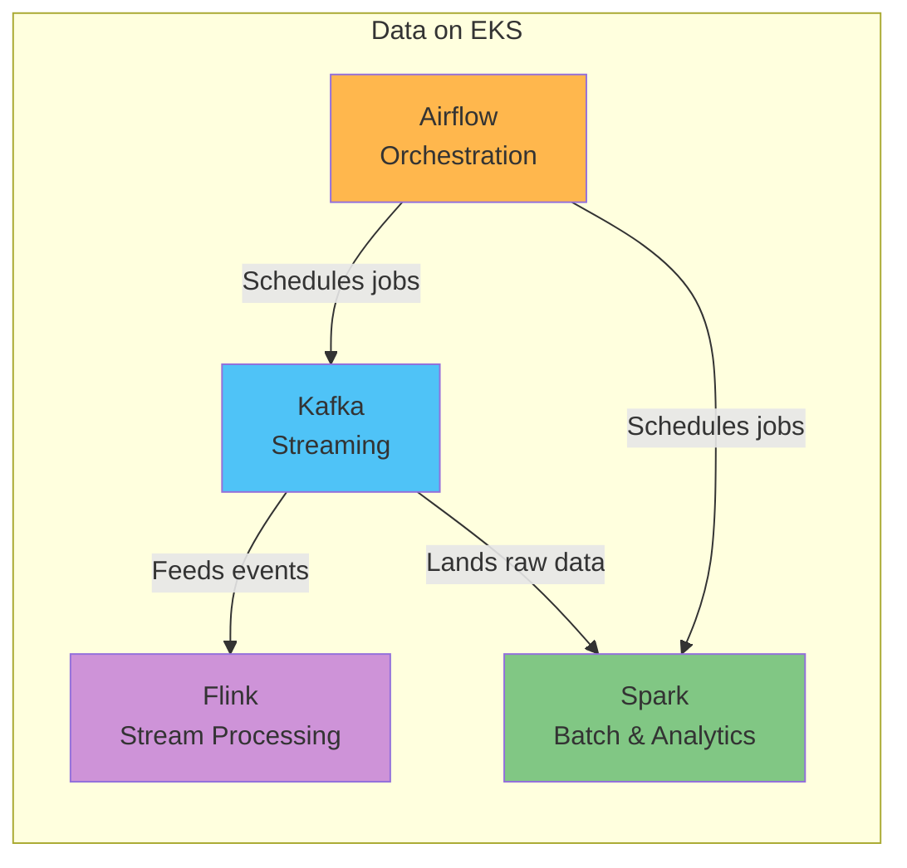

# Data on EKS

> **最終更新**: July 9, 2026

## 概要

"Data on EKS" は、AWS データエコシステムの中核的な workload（streaming、batch processing、workflow orchestration）を、完全マネージドサービスだけに依存するのではなく、Amazon EKS 上の Kubernetes-native なアプリケーションとして実行することを扱います。Kafka、Spark、Airflow、Flink などのツールを container と Operator pattern を通じてデプロイすることで、EKS 上の platform の他の部分ですでに利用しているものと同じ deployment、observability、scaling のプラクティスで data workload を管理できます。

このセクションは、Amazon MSK、Amazon EMR、Amazon MWAA などの完全マネージドサービスに反対することを目的としていません。どちらのアプローチにも実際の trade-off があり、多くのチームは operational capacity、customization needs、cost structure に基づいて、どちらかを選択するか、または組み合わせて利用します。このセクションでは、これらのツールを EKS 上で直接実行すると決めた後に知っておくべきことに焦点を当てます。

## Data Workload のカテゴリー

データプラットフォーム領域のツールは一般に 4 つのカテゴリーに分けられ、それぞれ異なる問題を解決します。

| Category | Problem It Solves | Representative Tool | Data on EKS Coverage |
|----------|--------------------|----------------------|------------------------|
| **Streaming** | リアルタイムでイベントを publish/subscribe し、systems 間の非同期通信を確実に接続する | Apache Kafka | 利用可能 — [Kafka on EKS](kafka/README.md) |
| **Batch & Analytics** | ETL、aggregation、ML pipelines 向けの大規模 dataset の分散処理 | Apache Spark | Coming soon |
| **Orchestration** | data jobs 全体の dependencies と schedules を定義し、その実行を管理する | Apache Airflow | Coming soon |
| **Stream Processing** | streaming data に対するリアルタイム aggregation、transformation、stateful computation を実行する | Apache Flink | Coming soon |

## EKS 上でこれらを実行する理由

完全マネージドサービスは operational burden を大きく減らしますが、次のような理由から、これらのツールを EKS 上で native に実行することを選ぶチームが増えています。

- **Unified operations and observability**: 別の toolchain を維持する代わりに、data workload を platform の他の部分で使用しているものと同じ `kubectl`、GitOps workflows、Prometheus/Grafana stack で管理できます。
- **Autoscaling**: [Karpenter](../autoscaling/02-karpenter.md) による node autoscaling と HPA/KEDA を組み合わせることで、workload demand に正確に合わせて broker、worker、executor を scale できます。
- **Cost efficiency**: [EKS cost optimization](../eks/07-eks-cost-optimization.md) の手法（Spot Instances、bin-packing density の改善など）は、他の service と同様に data workload にも適用できます。
- **Multi-tenancy**: Kubernetes の isolation primitives（namespaces、ResourceQuotas、NetworkPolicies）により、複数のチームと workload が単一の cluster を安全に共有できます。

このアプローチには trade-off もあります。チームは Operator management、storage design、upgrade strategy を直接担うことになります。続く deep dive では、各ツールについてそのバランスを詳しく扱います。

## 現在取り上げている内容

- [Kafka on EKS](kafka/README.md) — Strimzi Operator を使用して Apache Kafka を EKS にデプロイし運用するための 8 部構成の deep dive。

## ロードマップ

今後、次のトピックを追加する予定です。

- **Apache Spark** — EKS 上での distributed batch processing と analytics pipelines
- **Apache Airflow** — EKS 上での workflow orchestration
- **Apache Flink** — EKS 上での real-time stream processing

## 次のステップ

1. [Kafka on EKS](kafka/README.md) — Strimzi ベースの Kafka deep dive
