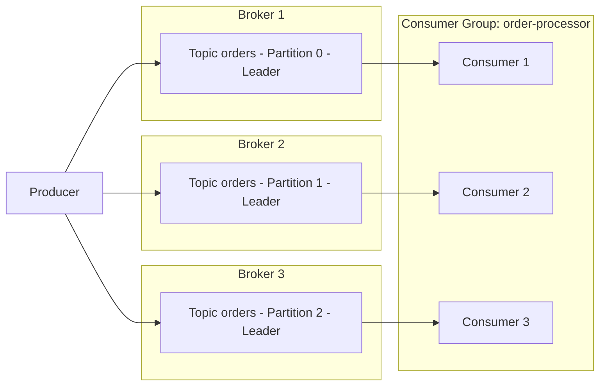

# パート 1: Kafka Fundamentals

> **サポート対象バージョン**: Apache Kafka 3.9 (KRaft mode)\
> **最終更新**: July 9, 2026

## Apache Kafka とは？

Apache Kafka は、大量のリアルタイムデータストリームを処理するために構築された、分散 event streaming platform です。もともとは LinkedIn で開発され、その後 Apache project としてオープンソース化されました。現在では、log aggregation、metrics pipeline、event-driven microservices、change data capture (CDC) pipeline に広く使用されています。

このドキュメントでは、EKS 上で Kafka を実行する前に必要な中核概念である brokers、topics、partitions、consumer groups、replication、KRaft について説明します。パート 2 では、Strimzi Operator を使用して、これらの概念を実際の EKS cluster にデプロイする手順を扱います。

## 1. Kafka Architecture Basics

### Core Terminology

* **Broker**: message を保存し、client request を処理する Kafka server process です。Kafka cluster は通常、複数の brokers で構成されます。
* **Topic**: `orders` や `payments` など、message を分類するために使用される論理 channel です。
* **Partition**: topic が分割される物理単位です。各 partition は、順序付けされた append-only の immutable log です。
* **Offset**: partition 内の各 message に割り当てられる、連続した一意の番号です。Consumers は offset を使用して「どこまで読んだか」を追跡します。
* **Replication Factor**: partition の data がコピーされる brokers の数であり、broker 障害時の data loss を防ぎます。
* **Leader/Follower Replica**: 各 partition では、1 つの replica が leader として指定され、すべての read/write を処理します。残りの follower replicas は leader から data をコピーします。
* **ISR (In-Sync Replicas)**: leader に十分追従している replicas の集合です。`acks=all` で write が送信された場合、ISR 内のすべての replica が message を受信して初めて成功と見なされます。

### Producer -> Partitions -> Consumer Group Flow



Producers は topic に message を書き込み、Kafka はそれらの message を partition level で複数の brokers に分散します。同じ consumer group に属する Consumers は、partitions を分担し（おおよそ 1 対 1）、message を並列に consume します。

## 2. Partitions and Ordering Guarantees

Partition 数は、cluster の並列 throughput を左右する最も重要な要素です。Partitions が多いほど、より多くの consumers が同時に動作できますが、partitions が多すぎると brokers 上の metadata overhead と open file handles が増加します。

> **Key Concept**: Kafka は topic 全体にわたる ordering を **保証しません**。Ordering が保証されるのは **単一 partition 内** のみです。

### Partition Key Selection Strategies

Producer が key 付きで message を送信すると、Kafka はその key の hash に基づいて message を partition に routing します。同じ key は常に同じ partition に routing されます。これにより、同じ key を共有する events 間の ordering を維持できます。

| Strategy | Description | Example Use Case |
| --- | --- | --- |
| No key (null) | Round-robin または sticky partitioner が message を partitions に分散します | ordering が重要ではない log ingestion |
| Entity ID as key | 同じ entity の events を同じ partition に固定します | 特定の order ID に対する status events の順序を維持する |
| Custom partitioner | business rules に基づいて partitions に routing します | 特定 customer の traffic を専用 partition に分離する |

```bash
# Create a topic with 6 partitions and a replication factor of 3
kafka-topics.sh --create \
  --bootstrap-server localhost:9092 \
  --topic orders \
  --partitions 6 \
  --replication-factor 3 \
  --config min.insync.replicas=2
```

不適切に選択された key は、traffic が単一 partition に集中する「hot partition」を作り出す可能性があります。そのため、load を均等に分散するのに十分な cardinality（十分に多い distinct values の数）を key が持つことを確認してください。

## 3. Consumer Groups and Rebalancing

### How Consumer Groups Work

同じ `group.id` を共有する Consumers は **consumer group** を形成します。Kafka は topic の partitions を group 内の consumer instances に自動的に割り当て、各 partition はその group 内のちょうど 1 つの consumer によって読み取られます（consumers が partitions より多い場合、一部の consumers は idle 状態になります）。

### What Triggers a Rebalance

* 新しい consumer が group に参加する
* 既存の consumer が group を離脱する（graceful shutdown）、または heartbeat timeout によって離脱したと検出される
* topic の partitions 数が変更される
* consumer が `session.timeout.ms` 内に heartbeat を送信できない、または処理に時間がかかりすぎて `max.poll.interval.ms` を超える

rebalance の進行中は、影響を受ける group の consumption が短時間停止します。そのため、過度に頻繁な rebalances は throughput を低下させます。`CooperativeStickyAssignor` を使用すると、rebalance 中の partition movement を最小化し、そのコストを削減できます。

### Offset Commit Strategies

| Strategy | Configuration | Characteristics |
| --- | --- | --- |
| Auto-commit | `enable.auto.commit=true` (default) | 便利な periodic commits ですが、processing が完了する前に offsets が commit される可能性があり、message loss のリスクがあります |
| Manual commit (sync) | `enable.auto.commit=false` + `commitSync()` | processing 完了後にのみ commit します — より安全ですが、throughput は低くなります |
| Manual commit (async) | `enable.auto.commit=false` + `commitAsync()` | throughput は高くなりますが、application は commit failures を自分で処理する必要があります |

### Delivery Semantics

* **At-most-once**: message が処理される前に offset が commit されます。障害時に messages が失われる可能性があります。
* **At-least-once**: processing 後に offset が commit されます（一般的に推奨される default）。障害時に messages が再処理される可能性があるため、consumer logic は idempotent になるよう設計する必要があります。
* **Exactly-once**: producer の idempotent option と transactional API (`transactional.id`) を組み合わせることで、Kafka 内（topic-to-topic）で exactly-once processing を実現します。外部 system にまたがる exactly-once processing には、追加の設計作業が必要です（たとえば、Kafka Connect の exactly-once sink connector）。

## 4. KRaft: Kafka Without ZooKeeper

歴史的に、Kafka は cluster metadata（topic/partition information、ACLs、controller election）を管理するために、別個の ZooKeeper ensemble に依存していました。Kafka 3.3 以降、**KRaft (Kafka Raft metadata mode)** は production-ready (GA) となり、**Kafka 4.0（2025 年 3 月リリース）** では ZooKeeper mode が完全に削除され、KRaft が唯一サポートされる metadata management mechanism になりました。

### KRaft Architecture

別個の ZooKeeper cluster の代わりに、KRaft は Kafka broker processes の一部を **controller quorum** として指定します。

* **Controller Voter**: Raft consensus protocol に参加し、metadata log を replicate する node です（quorum のため通常は 3 や 5 などの奇数）。
* **Active Controller**: leader として選出され、partition leader election、topic creation などの cluster metadata changes を実際に処理する単一の voter です。
* Controller と broker の roles は、小規模 clusters では同じ process 内で組み合わせることができます（`process.roles=broker,controller`）。大規模 deployments では、dedicated controller-only nodes（`process.roles=controller`）に分離できます。

### Before / After Comparison

| Aspect | ZooKeeper-based (default through Kafka 3.x) | KRaft-based (GA in 3.3+, only mode in 4.0+) |
| --- | --- | --- |
| Metadata storage | 別個の ZooKeeper ensemble | Kafka 自身の internal metadata topic (`__cluster_metadata`) |
| Clusters required | 2 つ — Kafka cluster と ZooKeeper cluster | 1 つ — Kafka cluster のみ |
| Controller election | ZooKeeper ephemeral znodes 経由の leader election | Raft consensus 経由で選出される active controller |
| Metadata scalability | partition 数に伴って ZooKeeper load が増加します | log-based replication は大規模な partition 数に対してよりよく scale します |
| Kubernetes operational overhead | ZooKeeper StatefulSet、別個の PVCs、別個の monitoring が必要です | 管理する別 component はありません — Kafka broker/controller pods のみです |

この違いは Kubernetes/EKS environments では非常に重要です。ZooKeeper-based deployments では、Kafka StatefulSet と ZooKeeper StatefulSet の両方を実行し、network policies、PodDisruptionBudgets、monitoring を両 components にわたって重複して用意する必要がありました。KRaft はその operational burden を取り除き、Strimzi のような operator が管理する必要のある resource types の数を減らします。パート 2 で扱う Strimzi-based deployment は、default で KRaft mode を使用します。

### Sample KRaft Node Configuration (server.properties)

```properties
# This node acts as both broker and controller (suitable for small clusters)
process.roles=broker,controller
node.id=1

# List of controller quorum voters (node.id@host:port)
controller.quorum.voters=1@kafka-0.kafka-headless:9093,2@kafka-1.kafka-headless:9093,3@kafka-2.kafka-headless:9093

listeners=BROKER://:9092,CONTROLLER://:9093
controller.listener.names=CONTROLLER
inter.broker.listener.name=BROKER

log.dirs=/var/lib/kafka/data
```

## 5. Replication and Durability Settings

producer が message が「安全に保存された」とどの程度確信できるかは、3 つの settings の組み合わせに依存します。

* **`replication.factor`** (topic-level setting): partition の data を何台の brokers にコピーするかを決定します。最小値は 3 が推奨され、data を失うことなく最大 2 台の同時 broker failures に耐えられます。
* **`min.insync.replicas`** (topic-level setting): `acks=all` で write が送信された場合、write が成功と見なされるために message を持っている必要がある ISR members の最小数を指定します。一般的な組み合わせは `replication.factor=3` と `min.insync.replicas=2` で、1 台の broker が failure しても writes を利用可能に保ちます。
* **`acks`** (producer-level setting): write が完了したと見なす前に producer が待機する confirmation の量を決定します。

| `acks` value | Behavior | Durability | Latency/Throughput |
| --- | --- | --- | --- |
| `0` | Producer は response を一切待ちません | 最低（送信直後に messages が失われる可能性があります） | 最速 |
| `1` | leader が書き込むと成功と見なされます | 中程度（leader が failure すると replicated されていない data が失われる可能性があります） | 高速 |
| `all` (`-1`) | すべての ISR replica が書き込んだ場合にのみ成功と見なされます | 最高 | 比較的低速 |

```bash
# Dynamically change min.insync.replicas on an existing topic
kafka-configs.sh --bootstrap-server localhost:9092 \
  --alter --entity-type topics --entity-name orders \
  --add-config min.insync.replicas=2
```

一般的な production-grade の組み合わせは、`replication.factor=3`、`min.insync.replicas=2`、producer `acks=all`、`enable.idempotence=true` です。この組み合わせは、data loss なしで単一の broker failure に耐え、idempotent producer setting により network retries によって発生する duplicate writes を防ぎます。`acks=all` は `acks=1` と比較して latency を追加する点に注意してください。そのため、多少の data loss を許容できる latency-sensitive workloads（metrics ingestion など）では、`acks=1` を選択して durability と引き換えに speed を優先する場合があります。

## Next Steps

このドキュメントでは、Kafka の中核概念である broker/topic/partition model、ordering guarantees の範囲、consumer group rebalancing、KRaft への移行、replication/durability settings を説明しました。パート 2 では、**Strimzi Operator** を使用して、これらすべての概念を KRaft-based Kafka cluster として Amazon EKS 上にデプロイする方法を扱います。

[メインページに戻る](./)

## Quiz

この章で学んだ内容を確認するために、[Topic Quiz](../../quizzes/data-on-eks/kafka/01-kafka-fundamentals-quiz.md) に挑戦してみてください。
