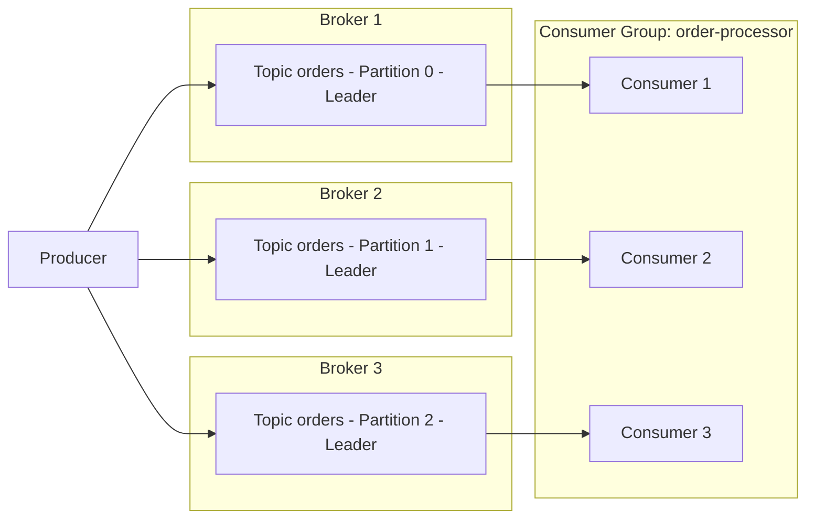

# Part 1: Kafka の基礎

> **サポート対象バージョン**: Apache Kafka 3.9 (KRaft mode)\
> **最終更新**: July 9, 2026

## Apache Kafka とは？

Apache Kafka は、大量のリアルタイムデータストリームを処理するために構築された分散イベントストリーミングプラットフォームです。もともとは LinkedIn で開発され、後に Apache プロジェクトとしてオープンソース化されました。ログ集約、メトリクスパイプライン、イベント駆動型マイクロサービス、変更データキャプチャ (CDC) パイプラインで広く使用されています。

このドキュメントでは、EKS で Kafka を実行する前に必要となる中核概念、すなわち broker、topic、partition、consumer group、replication、KRaft について説明します。Part 2 では、Strimzi Operator を使用して、これらの概念を実際の EKS cluster にデプロイする手順を説明します。

## 1. Kafka アーキテクチャの基本

### 基本用語

* **Broker**: メッセージを保存し、client request を処理する Kafka server process です。Kafka cluster は通常、複数の broker で構成されます。
* **Topic**: `orders` や `payments` など、メッセージを分類するために使用する論理チャネルです。
* **Partition**: topic を分割する物理的な単位です。各 partition は順序付けされた、追記専用かつ不変のログです。
* **Offset**: partition 内の各メッセージに割り当てられる連番の一意な番号です。consumer は offset を使用して「どこまで読み取ったか」を追跡します。
* **Replication Factor**: partition のデータをコピーする broker の数です。broker 障害時のデータ損失から保護します。
* **Leader/Follower Replica**: 各 partition では、1 つの replica が leader に指定され、すべての読み取りと書き込みを処理します。残りの follower replica は leader からデータをコピーします。
* **ISR (In-Sync Replicas)**: leader に十分追いついている replica の集合です。`acks=all` を指定して書き込みを送信する場合、ISR 内のすべての replica がメッセージを受信した時点でのみ成功と見なされます。

### Producer -> Partitions -> Consumer Group のフロー



Producer は topic にメッセージを書き込み、Kafka はそれらのメッセージを partition 単位で複数の broker に分散します。同じ consumer group に属する consumer は partition を（おおむね 1 対 1 で）分担し、並列にメッセージを消費します。

## 2. Partition と順序保証

partition 数は、cluster の並列スループットを左右する最も重要な要素です。partition を増やすと、より多くの consumer が同時に処理できますが、多すぎる partition は metadata のオーバーヘッドと broker 上の open file handle を増加させます。

> **重要な概念**: Kafka は topic 全体にわたる順序を**保証しません**。順序が保証されるのは、**単一の partition 内**のみです。

### Partition Key の選択戦略

Producer が key 付きのメッセージを送信すると、Kafka はその key の hash に基づいて partition にルーティングします。同じ key は常に同じ partition にルーティングされるため、key を共有するイベント間の順序を保持できます。

| 戦略 | 説明 | 使用例 |
| --- | --- | --- |
| key なし (null) | Round-robin または sticky partitioner がメッセージを partition 間に分散 | 順序が重要でないログ取り込み |
| Entity ID を key として使用 | 同じ entity のイベントを同じ partition に固定 | 特定の order ID に対する status event の順序保持 |
| Custom partitioner | business rule に基づいて partition をルーティング | 特定 customer のトラフィックを専用 partition に分離 |

```bash
# Create a topic with 6 partitions and a replication factor of 3
kafka-topics.sh --create \
  --bootstrap-server localhost:9092 \
  --topic orders \
  --partitions 6 \
  --replication-factor 3 \
  --config min.insync.replicas=2
```

適切に選択されていない key は、トラフィックが単一の partition に集中する「hot partition」を生み出す可能性があります。そのため、負荷を均等に分散できるよう、key に十分な cardinality（十分に多くの異なる値）があることを確認してください。

## 3. Consumer Group と Rebalancing

### Consumer Group の仕組み

同じ `group.id` を共有する consumer は、**consumer group** を形成します。Kafka は topic の partition を group 内の consumer instance に自動的に割り当て、各 partition はその group 内でちょうど 1 つの consumer によって読み取られます（consumer 数が partition 数より多い場合、一部の consumer は idle 状態になります）。

### Rebalance のトリガー

* 新しい consumer が group に参加する
* 既存の consumer が group を離脱する（graceful shutdown）、または heartbeat timeout によって離脱したと検出される
* topic の partition 数が変更される
* consumer が `session.timeout.ms` 内に heartbeat を送信できない、または処理時間が長すぎて `max.poll.interval.ms` を超過する

rebalance の実行中、影響を受ける group の消費は短時間停止します。そのため、過度に頻繁な rebalance はスループットを低下させます。`CooperativeStickyAssignor` を使用すると、rebalance 中の partition 移動を最小化し、そのコストを削減できます。

### Offset Commit 戦略

| 戦略 | 設定 | 特性 |
| --- | --- | --- |
| Auto-commit | `enable.auto.commit=true` (default) | 定期的な commit を簡単に実行できますが、処理完了前に offset が commit される可能性があり、メッセージ損失のリスクがあります |
| Manual commit (sync) | `enable.auto.commit=false` + `commitSync()` | 処理の完了後にのみ commit されます。より安全ですが、スループットは低下します |
| Manual commit (async) | `enable.auto.commit=false` + `commitAsync()` | より高いスループットを実現できますが、application 側で commit failure を処理する必要があります |

### 配信セマンティクス

* **At-most-once**: メッセージが処理される前に offset が commit されます。障害時にメッセージが失われる可能性があります。
* **At-least-once**: 処理後に offset が commit されます（一般的に推奨される default）。障害時にはメッセージが再処理される可能性があるため、consumer logic は idempotent になるよう設計する必要があります。
* **Exactly-once**: producer の idempotent option と transactional API (`transactional.id`) を組み合わせることで、Kafka 内（topic-to-topic）の exactly-once processing を実現します。外部 system にまたがる exactly-once processing には追加の設計作業が必要です（たとえば、Kafka Connect の exactly-once sink connector）。

## 4. KRaft: ZooKeeper なしの Kafka

従来、Kafka は cluster metadata（topic/partition 情報、ACL、controller election）を管理するために、別個の ZooKeeper ensemble に依存していました。Kafka 3.3 から、**KRaft (Kafka Raft metadata mode)** が本番利用可能 (GA) となり、**Kafka 4.0 (released in March 2025)** では ZooKeeper mode が完全に削除され、KRaft が唯一サポートされる metadata management mechanism になりました。

### KRaft アーキテクチャ

KRaft は別個の ZooKeeper cluster の代わりに、Kafka broker process の一部を **controller quorum** として動作するよう指定します。

* **Controller Voter**: Raft consensus protocol に参加し、metadata log を replication する node です（quorum のために通常は 3 や 5 などの奇数です）。
* **Active Controller**: leader として選出され、partition leader election、topic creation など、実際に cluster metadata の変更を処理する単一の voter です。
* 小規模な cluster では、controller と broker の role を同じ process 内で組み合わせることができます（`process.roles=broker,controller`）。大規模な deployment では、専用の controller-only node に分割できます（`process.roles=controller`）。

### Before / After の比較

| 項目 | ZooKeeper ベース (Kafka 3.x までは default) | KRaft ベース (3.3+ で GA、4.0+ では唯一の mode) |
| --- | --- | --- |
| Metadata storage | 別個の ZooKeeper ensemble | Kafka 独自の内部 metadata topic (`__cluster_metadata`) |
| 必要な cluster | 2 つ — Kafka cluster と ZooKeeper cluster | 1 つ — Kafka cluster のみ |
| Controller election | ZooKeeper ephemeral znode による leader election | Raft consensus によって選出される active controller |
| Metadata scalability | partition 数に応じて ZooKeeper の負荷が増加 | log ベースの replication は大規模な partition 数に対してより優れた拡張性を提供 |
| Kubernetes の運用オーバーヘッド | ZooKeeper StatefulSet、別個の PVC、別個の monitoring が必要 | 管理する別個の component は不要 — Kafka broker/controller pod のみ |

この違いは Kubernetes/EKS 環境で非常に重要です。ZooKeeper ベースの deployment では、Kafka StatefulSet と ZooKeeper StatefulSet の両方を実行し、両 component にわたって network policy、PodDisruptionBudget、monitoring を重複して設定する必要がありました。KRaft はこの運用負荷を排除し、Strimzi のような operator が管理する必要のある resource type の数を削減します。Part 2 で扱う Strimzi ベースの deployment では、default で KRaft mode を使用します。

### KRaft Node 設定の例 (server.properties)

```properties
# This node acts as both broker and controller (suitable for small clusters)
process.roles=broker,controller
node.id=1

# List of controller quorum voters (node.id@host:port)
controller.quorum.voters=1@kafka-0.kafka-headless:9093,2@kafka-1.kafka-headless:9093,3@kafka-2.kafka-headless:9093

listeners=BROKER://:9092,CONTROLLER://:9093
controller.listener.names=CONTROLLER
inter.broker.listener.name=BROKER

log.dirs=/var/lib/kafka/data
```

## 5. Replication と Durability の設定

Producer がメッセージを「安全に保存された」と確信できる度合いは、3 つの設定の組み合わせに依存します。

* **`replication.factor`** (topic-level setting): partition のデータをコピーする broker 数を決定します。最低 3 を推奨します。これにより、データを失うことなく最大 2 つの同時 broker failure に耐えられます。
* **`min.insync.replicas`** (topic-level setting): `acks=all` を指定して書き込みを送信する場合、書き込みを成功と見なすためにメッセージを保持している必要がある ISR member の最小数を指定します。一般的な組み合わせは、`replication.factor=3` と `min.insync.replicas=2` です。これにより、1 つの broker に障害が発生しても書き込みを利用可能な状態に保てます。
* **`acks`** (producer-level setting): 書き込み完了と見なす前に、producer が待機する confirmation の量を決定します。

| `acks` value | 動作 | Durability | Latency/Throughput |
| --- | --- | --- | --- |
| `0` | Producer はいかなる response も待機しない | 最低（送信直後にメッセージが失われる可能性がある） | 最速 |
| `1` | leader が書き込んだ時点で成功と見なされる | 中程度（leader 障害時に replication されていないデータが失われる可能性がある） | 高速 |
| `all` (`-1`) | すべての ISR replica が書き込んだ時点でのみ成功と見なされる | 最高 | 比較的低速 |

```bash
# Dynamically change min.insync.replicas on an existing topic
kafka-configs.sh --bootstrap-server localhost:9092 \
  --alter --entity-type topics --entity-name orders \
  --add-config min.insync.replicas=2
```

一般的な本番品質の組み合わせは、`replication.factor=3`、`min.insync.replicas=2`、producer の `acks=all`、および `enable.idempotence=true` です。この組み合わせはデータ損失なしで単一の broker failure に耐え、idempotent producer 設定により network retry による重複書き込みを防止します。`acks=all` は `acks=1` と比較して latency を追加することに注意してください。そのため、metrics ingestion など、ある程度のデータ損失を許容できる latency-sensitive workload では、`acks=1` を選択して durability よりも速度を優先することがあります。

## 次のステップ

このドキュメントでは、Kafka の中核概念、すなわち broker/topic/partition model、順序保証の範囲、consumer group の rebalancing、KRaft への移行、replication/durability の設定について説明しました。Part 2 では、**Strimzi Operator** を使用して、これらすべての概念を Amazon EKS 上の KRaft ベース Kafka cluster としてデプロイする方法を説明します。

[メインページに戻る](./README.md)

## クイズ

この章で学んだ内容を確認するには、[Topic クイズ](../../quizzes/data-on-eks/kafka/01-kafka-fundamentals-quiz.md)に挑戦してください。
