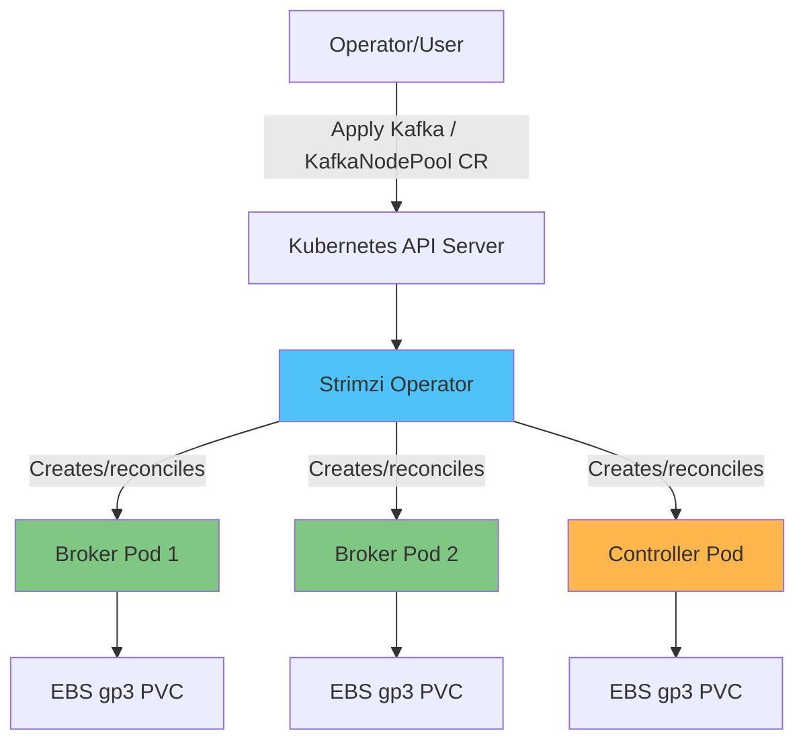

# Kafka on EKS Deep Dive

## Overview

Apache Kafka は、イベント駆動型アーキテクチャとリアルタイムストリーミングパイプラインの中核であり、microservices 間の非同期通信、ログ/メトリクス集約、CDC (Change Data Capture) パイプラインなど、さまざまなユースケースで使用されます。EKS では、生の StatefulSets を直接管理するのではなく、**Strimzi Kubernetes Operator** を通じて Kafka を実行するのが標準的なアプローチです。Strimzi を使うと、Kubernetes-native CRDs (Custom Resource Definitions) を通じて、Kafka cluster の運用ライフサイクル全体（作成、スケーリング、ローリングアップグレード、証明書管理、rack-aware 配置）を宣言的に管理できます。

> **対応バージョン**: Kafka 3.7-3.9 (KRaft mode), Strimzi Operator 0.45+
> **最終更新**: July 9, 2026

## Core Architecture Concepts

Kafka cluster は、**brokers** と呼ばれる一連のプロセスで構成されます。各 broker は 1 つ以上の **topics** を保存し、各 topic は並列性とスケーラビリティのために複数の **partitions** に分割されます。各 partition は耐久性のために異なる brokers に replicas を保持します。Producers は messages を partitions に書き込み、**consumer groups** は partitions をメンバー間で分割して messages を並列に消費し、offsets によって進捗を追跡します。

歴史的に、Kafka は cluster metadata（topics、partition assignments、ACLs など）を管理するために、別個の ZooKeeper ensemble に依存していました。Kafka 3.x 以降、**KRaft (Kafka Raft)** mode により、Kafka は Raft-based controller quorum を通じて自身の metadata を管理できるようになり、ZooKeeper が不要になり、運用する components の数を減らし、controller failover を大幅に高速化できます。Kafka 4.0 では ZooKeeper support が完全に削除され、KRaft が唯一サポートされる metadata mechanism になっています。そのため、EKS 上の新しい Kafka deployment は、最初から KRaft を前提に設計する必要があります。

Strimzi は、これらすべての components を Kubernetes resources としてラップします。`Kafka` や `KafkaNodePool` などの CRDs を通じて desired state を宣言すると、Strimzi Operator がその state を調整し、broker/controller Pods、PVCs、Services、Secrets を作成・管理します。

## Deep Dive Table of Contents

**[1. Kafka Fundamentals](01-kafka-fundamentals.md)**
- Brokers と topic/partition 構造
- Replication と durability guarantees
- Consumer groups と offset management
- KRaft controller quorum architecture

**[2. Strimzi Operator](02-strimzi-operator.md)**
- Strimzi のインストールと設定
- `Kafka` と `KafkaNodePool` CRDs の詳細
- EKS 上への Kafka cluster のデプロイ

**[3. Kafka Operations](03-kafka-operations.md)**
- EBS/gp3 を使った storage 設計
- Broker scaling strategies
- Cruise Control による partition rebalancing
- Zero-downtime rolling upgrades

**[4. Schema Registry](04-schema-registry.md)**
- Avro/Protobuf schemas の設計
- Karapace と Apicurio Registry の比較
- Compatibility strategies: BACKWARD/FORWARD/FULL

**[5. Kafka Connect and MirrorMaker](05-kafka-connect-mirrormaker.md)**
- Kafka Connect のデプロイと connectors の設定
- Source connectors と sink connectors の運用
- MirrorMaker2 による disaster recovery と cross-region replication

**[6. MSK Integration](06-msk-integration.md)**
- Amazon MSK と self-managed Strimzi の比較
- MSK Connect の使用
- Kinesis Data Streams との統合と比較

**[7. Monitoring](07-monitoring.md)**
- Prometheus/Grafana による broker metrics の収集
- Consumer lag の監視
- KEDA による consumers の autoscaling

**[8. Best Practices](08-best-practices.md)**
- Partition count と key design strategies
- Producer/consumer performance tuning
- mTLS/SASL による security
- Storage と instance cost optimization

## References

- [Strimzi Documentation](https://strimzi.io/docs/operators/latest/overview)
- [Apache Kafka Documentation](https://kafka.apache.org/documentation/)
- [KIP-500: Replace ZooKeeper with a Self-Managed Metadata Quorum](https://cwiki.apache.org/confluence/display/KAFKA/KIP-500)
- [AWS Data on EKS Project](https://awslabs.github.io/data-on-eks/)

## Quiz

このセクションで学んだ内容を確認するには、[Kafka Fundamentals Quiz](../../quizzes/data-on-eks/kafka/01-kafka-fundamentals-quiz.md) に挑戦してください。
