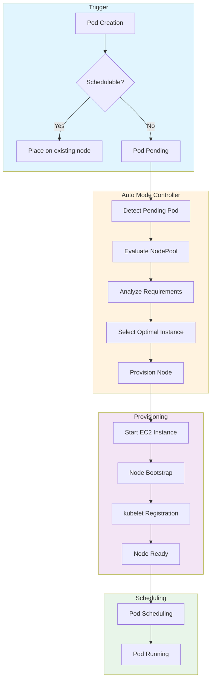
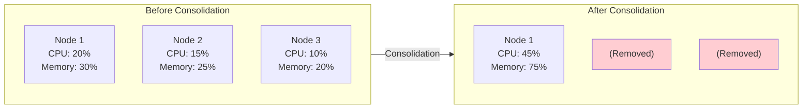

# スケーリング動作の理解

> **サポート対象バージョン**: EKS 1.29+, EKS Auto Mode GA
> **最終更新**: February 19, 2026

このガイドでは、EKS Auto Mode が node プロビジョニング、統合、drift 検出、有効期限に基づく更新をどのように処理するかを説明します。

---

## Pod Pending から Node プロビジョニングまで

EKS Auto Mode のスケーリングフローを理解すると、最適化に役立ちます。



### スケーリングのタイムライン

一般的な node プロビジョニングのタイムライン:

| Phase | Duration | Description |
|-------|----------|-------------|
| Pending Pod Detection | 1-5 seconds | Controller がスケジュール不可の pods を検出 |
| Instance Selection | 1-3 seconds | 最適な instance type の決定 |
| EC2 Instance Start | 10-30 seconds | Instance の起動とブート |
| AMI Boot | 20-40 seconds | Operating system の初期化 |
| kubelet Registration | 5-10 seconds | Node が cluster に参加 |
| Pod Scheduling | 1-5 seconds | Pod が新しい node に配置される |
| **Total** | **40-90 seconds** | エンドツーエンドのプロビジョニング時間 |

---

## 統合動作

統合は、非効率な nodes をクリーンアップすることでコストを最適化します。

### WhenEmpty Policy

空の nodes のみを削除します。

```yaml
apiVersion: karpenter.sh/v1
kind: NodePool
metadata:
  name: when-empty-example
spec:
  template:
    spec:
      requirements:
        - key: karpenter.k8s.aws/instance-category
          operator: In
          values: ["m", "c"]
      nodeClassRef:
        group: eks.amazonaws.com
        kind: NodeClass
        name: default
  disruption:
    consolidationPolicy: WhenEmpty
    consolidateAfter: 30s  # Remove after 30 seconds empty
```

### WhenEmptyOrUnderutilized Policy

空の nodes だけでなく、使用率の低い nodes も統合します。

```yaml
apiVersion: karpenter.sh/v1
kind: NodePool
metadata:
  name: when-underutilized-example
spec:
  template:
    spec:
      requirements:
        - key: karpenter.k8s.aws/instance-category
          operator: In
          values: ["m", "c"]
      nodeClassRef:
        group: eks.amazonaws.com
        kind: NodeClass
        name: default
  disruption:
    consolidationPolicy: WhenEmptyOrUnderutilized
    consolidateAfter: 1m
```

### 統合の可視化



### 統合の判断要因

Auto Mode は統合時にこれらの要因を考慮します:

| Factor | Description |
|--------|-------------|
| Node utilization | CPU と memory の使用率が threshold を下回る |
| Pod count | Node 上で実行中の pods が少ない |
| Cost efficiency | Workloads をより少なく、より安価な nodes に収容できる |
| PDB compliance | PodDisruptionBudget の制約を尊重 |
| Budget windows | 時間ベースの disruption budgets を尊重 |

---

## Drift 検出と置換

NodePool 設定が変更されると、既存の nodes は新しい設定で置き換えられます。

### Drift の検出

```bash
# Check node Drift
kubectl get nodes -o custom-columns=\
NAME:.metadata.name,\
NODEPOOL:.metadata.labels.karpenter\\.sh/nodepool,\
DRIFT:.metadata.annotations.karpenter\\.sh/drift-hash

# Check nodes with detected Drift
kubectl get nodeclaims -o wide
```

### Drift をトリガーするもの

| Change Type | Triggers Drift |
|-------------|----------------|
| NodePool requirements change | Yes |
| NodeClass AMI family change | Yes |
| NodeClass block device change | Yes |
| NodeClass subnet change | Yes |
| NodePool weight change | No |
| NodePool limits change | No |

### Drift 置換プロセス

1. Controller が設定 drift を検出
2. 更新された設定で新しい node がプロビジョニングされる
3. Pods が新しい node に段階的に移行される
4. 古い node が cordon され、drain される
5. 古い node が終了される

---

## 有効期限に基づく Node 更新

セキュリティパッチまたは AMI 更新のため、nodes を定期的に置き換えます。

```yaml
apiVersion: karpenter.sh/v1
kind: NodePool
metadata:
  name: with-expiration
spec:
  template:
    spec:
      requirements:
        - key: karpenter.k8s.aws/instance-category
          operator: In
          values: ["m", "c"]
      nodeClassRef:
        group: eks.amazonaws.com
        kind: NodeClass
        name: default
      # Set maximum node lifetime
      expireAfter: 168h  # Auto-replace after 7 days
  disruption:
    consolidationPolicy: WhenEmptyOrUnderutilized
    consolidateAfter: 1m
```

### 推奨される有効期限値

| Use Case | expireAfter | Rationale |
|----------|-------------|-----------|
| Security-critical | 24h - 72h | 頻繁なパッチ適用 |
| Standard production | 168h (7 days) | 新しさと安定性のバランス |
| Cost-sensitive | 336h (14 days) | 置換のオーバーヘッドを最小化 |
| Development | 720h (30 days) | Node の再利用を最大化 |

---

## スケーリングレイテンシーの最適化

### プロビジョニング時間の測定

```bash
# Measure node provisioning time
kubectl get events --sort-by='.lastTimestamp' | grep -E "Provisioned|Registered"

# Typical provisioning timeline
# - EC2 instance start: 10-30 seconds
# - AMI boot: 20-40 seconds
# - kubelet registration: 5-10 seconds
# - Pod scheduling: 1-5 seconds
# Total expected time: 40-90 seconds
```

### 高速ブート設定

```yaml
# NodeClass settings for fast provisioning
apiVersion: eks.amazonaws.com/v1
kind: NodeClass
metadata:
  name: fast-boot
spec:
  amiFamily: Bottlerocket  # Faster boot time than AL2023

  # EBS optimization
  blockDeviceMappings:
    - deviceName: /dev/xvda
      ebs:
        volumeSize: 50Gi  # Only as much as needed
        volumeType: gp3
        iops: 3000
        throughput: 125
```

### レイテンシー最適化のヒント

| Optimization | Impact | Trade-off |
|--------------|--------|-----------|
| Use Bottlerocket AMI | 10-20s faster boot | カスタマイズ性が低い |
| Smaller EBS volumes | 5-10s faster attach | ローカルストレージが少ない |
| Higher IOPS/throughput | 5-10s faster boot | コストが高い |
| Diverse instance types | 容量の取得が高速 | 最適性の低い instance になる場合がある |
| Pre-warm with placeholder pods | ほぼ瞬時のスケーリング | アイドルリソースのコスト |

---

## スケーリング動作のモニタリング

### 監視すべき主要メトリクス

```bash
# Check pending pods over time
kubectl get pods -A --field-selector=status.phase=Pending -w

# Monitor node provisioning events
kubectl get events --sort-by='.lastTimestamp' -w | grep -i karpenter

# Check NodeClaim status
kubectl get nodeclaims -w
```

### CloudWatch Metrics

| Metric | Description | Alert Threshold |
|--------|-------------|-----------------|
| `karpenter_pods_pending` | nodes を待機している Pods | > 10 for > 5 min |
| `karpenter_nodeclaims_created` | 要求された新しい nodes | Unusual spikes |
| `karpenter_nodeclaims_startup_duration_seconds` | プロビジョニング時間 | p99 > 120s |
| `karpenter_nodes_total` | 管理対象 nodes の合計 | Near limits |

---

< [前へ: NodePool 設定](./02-nodepool-configuration.md) | [目次](./README.md) | [次へ: Spot 戦略](./04-spot-strategies.md) >
