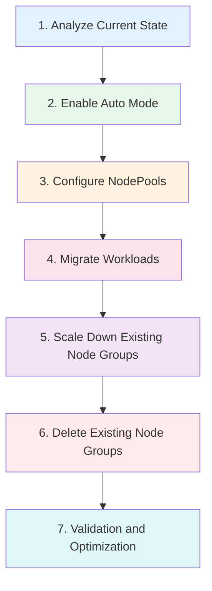

# Managed Node Groups から Auto Mode への移行

> **対応バージョン**: EKS 1.29+, EKS Auto Mode GA
> **最終更新**: July 3, 2026

このガイドでは、既存の EKS Managed Node Groups から Auto Mode へ移行する方法について、ステップごとの手順、共存戦略、重要な注意事項を含めて説明します。

---

## 移行の概要



---

## Step 1: 現在の状態を分析する

移行前に、現在の cluster 設定を十分に分析します。

```bash
# Check current node groups
eksctl get nodegroup --cluster my-cluster

# Analyze node resource usage
kubectl top nodes

# Check workload distribution
kubectl get pods -A -o wide | awk '{print $8}' | sort | uniq -c

# Nodes by current instance type
kubectl get nodes -o custom-columns=\
NAME:.metadata.name,\
TYPE:.metadata.labels.node\\.kubernetes\\.io/instance-type,\
ZONE:.metadata.labels.topology\\.kubernetes\\.io/zone

# Check for node selectors in deployments
kubectl get deployments -A -o jsonpath='{range .items[*]}{.metadata.namespace}/{.metadata.name}: {.spec.template.spec.nodeSelector}{"\n"}{end}'

# Check for node affinities
kubectl get deployments -A -o jsonpath='{range .items[*]}{.metadata.namespace}/{.metadata.name}: {.spec.template.spec.affinity.nodeAffinity}{"\n"}{end}'
```

### 移行前チェックリスト

| 項目 | 確認 | 備考 |
|------|-------|-------|
| EKS version | >= 1.29 | Auto Mode に必要 |
| Node group instance types | すべて記録 | NodePool requirements にマッピング |
| Custom AMIs | 記録 | NodeClass config が必要な場合があります |
| User data scripts | 確認 | 互換性を確認 |
| IAM roles | 記録 | Auto Mode は新しい roles を作成します |
| Security groups | 記録 | NodeClass で設定 |
| Tags | 記録 | NodeClass に追加 |
| Node selectors in workloads | 特定 | 更新が必要な場合があります |

---

## Step 2: Auto Mode を有効化する

既存の cluster で Auto Mode を有効化します。

```bash
# 1. Enable Auto Mode
aws eks update-cluster-config \
    --name my-cluster \
    --compute-config enabled=true,nodePools=general-purpose,nodePools=system

# 2. Check activation status
aws eks describe-cluster --name my-cluster \
    --query 'cluster.computeConfig'

# 3. Wait for update to complete
aws eks wait cluster-active --name my-cluster

# 4. Verify NodePools are created
kubectl get nodepools
```

---

## Step 3: Custom NodePools を設定する

現在の node group 設定に一致する NodePools を作成します。

```yaml
# custom-nodepools.yaml
apiVersion: karpenter.sh/v1
kind: NodePool
metadata:
  name: migrated-workloads
spec:
  template:
    metadata:
      labels:
        migration: auto-mode
    spec:
      requirements:
        # Instance types similar to existing node groups
        - key: karpenter.k8s.aws/instance-category
          operator: In
          values: ["m", "c", "r"]
        - key: karpenter.k8s.aws/instance-size
          operator: In
          values: ["large", "xlarge", "2xlarge"]
        - key: karpenter.sh/capacity-type
          operator: In
          values: ["on-demand"]
      nodeClassRef:
        group: eks.amazonaws.com
        kind: NodeClass
        name: default
```

### Node Groups から NodePools へのマッピング

| Node Group Config | NodePool Equivalent |
|-------------------|---------------------|
| Instance types | `karpenter.k8s.aws/instance-category`, `instance-size` |
| Capacity type | `karpenter.sh/capacity-type` |
| Labels | `template.metadata.labels` |
| Taints | `template.spec.taints` |
| Scaling limits | `spec.limits` |
| Subnet tags | NodeClass `subnetSelectorTerms` |
| Security groups | NodeClass `securityGroupSelectorTerms` |
| AMI type | NodeClass `amiFamily` |

---

## Step 4: Workloads を移行する

既存の node groups から Auto Mode nodes へ workloads を段階的に移動します。

```bash
# Apply cordon to existing nodes (prevent new Pod scheduling)
kubectl cordon -l eks.amazonaws.com/nodegroup=old-nodegroup

# Gradually drain Pods
for node in $(kubectl get nodes -l eks.amazonaws.com/nodegroup=old-nodegroup -o name); do
    kubectl drain $node --ignore-daemonsets --delete-emptydir-data
    sleep 60  # Wait time between each node
done
```

### 安全な移行スクリプト

```bash
#!/bin/bash
# migrate-workloads.sh

NODE_GROUP="old-nodegroup"
DRAIN_INTERVAL=60

# Get nodes in the old node group
NODES=$(kubectl get nodes -l eks.amazonaws.com/nodegroup=$NODE_GROUP -o name)

echo "Starting migration of node group: $NODE_GROUP"
echo "Found $(echo "$NODES" | wc -l) nodes to migrate"

# Cordon all nodes first
for node in $NODES; do
    echo "Cordoning $node..."
    kubectl cordon $node
done

echo "All nodes cordoned. Starting drain process..."

# Drain nodes one by one
for node in $NODES; do
    echo "Draining $node..."
    kubectl drain $node \
        --ignore-daemonsets \
        --delete-emptydir-data \
        --timeout=300s

    if [ $? -ne 0 ]; then
        echo "WARNING: Failed to drain $node, continuing..."
    fi

    echo "Waiting ${DRAIN_INTERVAL}s before next node..."
    sleep $DRAIN_INTERVAL
done

echo "Migration complete. Verify with: kubectl get pods -A -o wide"
```

---

## Step 5: 既存の Node Groups をスケールダウンする

Workloads の移行後、古い node groups をスケールダウンします。

```bash
# Scale down node group
eksctl scale nodegroup \
    --cluster my-cluster \
    --name old-nodegroup \
    --nodes 0 \
    --nodes-min 0

# Verify nodes are terminating
kubectl get nodes -l eks.amazonaws.com/nodegroup=old-nodegroup -w
```

---

## Step 6: 既存の Node Groups を削除する

すべての workloads が Auto Mode nodes で実行されていることを確認したら、古い node groups を削除します。

```bash
# Delete node group
eksctl delete nodegroup \
    --cluster my-cluster \
    --name old-nodegroup

# Verify deletion
eksctl get nodegroup --cluster my-cluster
```

---

## Step 7: 検証と最適化

移行を検証し、設定を最適化します。

```bash
# Verify all pods are running
kubectl get pods -A --field-selector=status.phase!=Running

# Check node distribution
kubectl get nodes -o wide -L karpenter.sh/nodepool,karpenter.sh/capacity-type

# Verify resource utilization
kubectl top nodes
kubectl top pods -A

# Check for any pending pods
kubectl get pods -A --field-selector=status.phase=Pending
```

---

## 共存期間中の運用

移行中は、既存の node groups と Auto Mode を共存させることができます。

```yaml
# coexistence-config.yaml
# Existing node group workloads
apiVersion: apps/v1
kind: Deployment
metadata:
  name: legacy-app
spec:
  replicas: 3
  template:
    spec:
      # Pin to existing node group
      nodeSelector:
        eks.amazonaws.com/nodegroup: old-nodegroup
      containers:
        - name: app
          image: legacy-app:latest
---
# Auto Mode workloads
apiVersion: apps/v1
kind: Deployment
metadata:
  name: new-app
spec:
  replicas: 3
  template:
    spec:
      # Prefer Auto Mode nodes
      affinity:
        nodeAffinity:
          preferredDuringSchedulingIgnoredDuringExecution:
            - weight: 100
              preference:
                matchExpressions:
                  - key: karpenter.sh/nodepool
                    operator: Exists
      containers:
        - name: app
          image: new-app:latest
```

### 共存のベストプラクティス

| プラクティス | 説明 |
|----------|-------------|
| Use node selectors | Workloads を特定の infrastructure に固定する |
| Gradual migration | Workloads を段階的に移動する |
| Monitor both | 両方の node types の metrics を追跡する |
| Test thoroughly | 完全移行の前に動作を検証する |
| Rollback plan | 最初は node groups を削除せず、スケールダウンした状態で保持する |

---

## Self-Managed Karpenter からの移行（公式 kubectl ベースのパス）

Managed node groups ではなく **self-managed Karpenter を直接**実行している場合、AWS は上記の node group 切り替え手順の代替として、公式にサポートされる kubectl ベースの移行パスを提供しています。

### 前提条件

- Self-managed Karpenter **v1.1 以降** が cluster にすでにインストールされている必要があります
- 既存の Karpenter NodePool/EC2NodeClass 設定を記録します

### 移行手順

1. **Auto Mode を有効化する**: 既存の Karpenter controller と NodePools を残したまま Auto Mode を有効化します。

2. **taint 付き Auto Mode NodePool を作成する**: Workloads が意図せず Auto Mode nodes に schedule されないように taint を追加します。

   ```yaml
   apiVersion: karpenter.sh/v1
   kind: NodePool
   metadata:
     name: auto-mode-migration
   spec:
     template:
       spec:
         taints:
           - key: eks.amazonaws.com/auto-mode
             value: "true"
             effect: NoSchedule
         nodeClassRef:
           group: eks.amazonaws.com
           kind: NodeClass
           name: default
   ```

3. **一致する tolerations/nodeSelector を workloads に追加する**: 上記の taint に対する toleration と、Auto Mode NodePool を対象にする `nodeSelector` を、移行したい workloads に追加します。

   ```yaml
   spec:
     template:
       spec:
         tolerations:
           - key: eks.amazonaws.com/auto-mode
             value: "true"
             effect: NoSchedule
         nodeSelector:
           karpenter.sh/nodepool: auto-mode-migration
   ```

4. **段階的に移行する**: 一度に 1 つの workload group へ toleration/nodeSelector を追加し、Karpenter-managed nodes と Auto Mode nodes を同じ cluster 内で並行稼働させながら workloads を Auto Mode nodes に移動します。

5. **self-managed Karpenter を削除する**: すべての workloads が Auto Mode nodes で実行されていることを確認したら、self-managed Karpenter controller と関連リソース（NodePools、EC2NodeClasses、IAM roles、Helm release など）を削除します。

このパスは、すでに self-managed Karpenter を実行している clusters を対象としています。Managed node groups から直接移行する場合は、代わりに上記の Step 1-7 に従ってください。

---

## 移行時の注意事項

| 項目 | 注意 | 対策 |
|------|---------|------------|
| **AMI Compatibility** | Auto Mode は AL2023 または Bottlerocket のみをサポートします | 新しい AMI で workloads をテストする |
| **User Data** | 既存の bootstrap script の互換性を確認する | userData を確認してテストする |
| **IAM Role** | Auto Mode IAM role は自動作成されます | Workloads の権限を確認する |
| **Security Groups** | NodeClass で再設定する | rules を記録して再現する |
| **Tags** | 既存の tag policies を NodeClass に反映する | tags を監査して追加する |
| **Monitoring** | 新しい metrics 収集設定が必要です | dashboards と alerts を更新する |
| **Node Selectors** | `eks.amazonaws.com/nodegroup` を持つ workloads は schedule されません | selectors を更新する |
| **Persistent Volumes** | EBS volumes は AZ 固有です | volume migration を計画する |

### よくある移行の問題

| 問題 | 症状 | 解決策 |
|-------|---------|----------|
| Pods not scheduling | Pending state | node selectors、tolerations を更新する |
| Application errors | Runtime failures | AMI compatibility を確認する |
| Performance degradation | Latency increase | instance types が一致しているか確認する |
| Cost increase | Higher EC2 bills | NodePool limits、Spot config を確認する |

---

## Rollback 手順

移行の問題が発生した場合は、rollback できます。

```bash
# 1. Scale up old node groups
eksctl scale nodegroup \
    --cluster my-cluster \
    --name old-nodegroup \
    --nodes 3 \
    --nodes-min 1 \
    --nodes-max 10

# 2. Uncordon old nodes (if cordoned)
kubectl uncordon -l eks.amazonaws.com/nodegroup=old-nodegroup

# 3. Cordon Auto Mode nodes
kubectl cordon -l karpenter.sh/nodepool

# 4. Drain Auto Mode nodes
for node in $(kubectl get nodes -l karpenter.sh/nodepool -o name); do
    kubectl drain $node --ignore-daemonsets --delete-emptydir-data
done

# 5. Verify workloads are back on old nodes
kubectl get pods -A -o wide

# 6. Optionally disable Auto Mode
aws eks update-cluster-config \
    --name my-cluster \
    --compute-config enabled=false
```

---

## 移行後の最適化

移行が成功した後は、次を行います。

1. **NodePool configurations を確認する**: 実際の workload needs に基づいて requirements を最適化する
2. **Spot instances を有効化する**: コスト削減に適した workloads に対して有効化する
3. **consolidation を設定する**: node consolidation による cost optimization を有効化する
4. **monitoring を設定する**: Auto Mode metrics 用の dashboards を作成する
5. **変更を記録する**: runbooks と documentation を更新する
6. **team をトレーニングする**: operations team が新しい management model を理解していることを確認する

---

< [前へ: Workload Optimization](./08-workload-optimization.md) | [目次](./README.md) | [EKS Topics に戻る](../README.md) >
