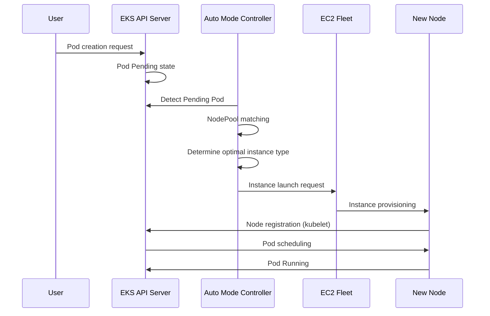

# EKS Auto Mode 運用ガイド

> **対応バージョン**: EKS 1.29+, EKS Auto Mode GA
> **最終更新**: February 23, 2026

Amazon EKS Auto Mode は、Kubernetes node management（ノード管理）を完全に自動化する機能で、workload 要件に基づいて node を自動的にプロビジョニングし最適化します。このガイドでは、EKS Auto Mode の概念、設定方法、production environment 向けの best practices について説明します。

## 目次

1. [Auto Mode の開始方法](./01-getting-started.md) - Cluster 作成と Auto Mode の有効化
2. [NodePool の設定と最適化](./02-nodepool-configuration.md) - デフォルトおよびカスタム NodePools
3. [Scaling 動作の理解](./03-scaling-behavior.md) - Provisioning、consolidation、drift detection
4. [Spot Instance 活用戦略](./04-spot-strategies.md) - Mixed capacity と interrupt handling
5. [運用と管理](./05-operations.md) - Disruption budgets、rolling replacement、monitoring
6. [Cost Management と最適化](./06-cost-management.md) - Cost analysis、Spot savings、right-sizing
7. [Node Lifecycle Management](./07-node-lifecycle.md) - Expiration、AMI management、freshness policies
8. [Workload 固有の最適化](./08-workload-optimization.md) - Web、batch、GPU、AI/ML workloads
9. [Managed Node Groups からの移行](./09-migration-guide.md) - Migration steps と coexistence

---

## EKS Auto Mode の概要

### Auto Mode とは？

EKS Auto Mode は、AWS が管理する完全自動の node management solution です。内部的には Karpenter をベースにしており、ユーザーが別途 node management components をインストールまたは設定する必要なく、AWS がすべてを管理します。

```
+-----------------------------------------------------------------------------+
|                           EKS Auto Mode Architecture                         |
+-----------------------------------------------------------------------------+
|                                                                              |
|  +---------------------------------------------------------------------+    |
|  |                    EKS Control Plane (AWS Managed)                   |    |
|  |  +------------+  +------------+  +------------+  +------------+    |    |
|  |  | API Server |  |   etcd     |  | Controller |  |  Karpenter |    |    |
|  |  |            |  |            |  |  Manager   |  | Controller |    |    |
|  |  +------------+  +------------+  +------------+  +------------+    |    |
|  +---------------------------------------------------------------------+    |
|                                    |                                         |
|                                    v                                         |
|  +---------------------------------------------------------------------+    |
|  |                        NodePool Resources                            |    |
|  |  +------------------+  +------------------+  +------------------+  |    |
|  |  |  general-purpose |  |      system      |  |   custom-pool    |  |    |
|  |  | (Default Provided)|  | (Default Provided)|  |  (User Defined)  |  |    |
|  |  +------------------+  +------------------+  +------------------+  |    |
|  +---------------------------------------------------------------------+    |
|                                    |                                         |
|                                    v                                         |
|  +---------------------------------------------------------------------+    |
|  |                     EC2 Instances (Auto Managed)                     |    |
|  |  +--------------+  +--------------+  +--------------+              |    |
|  |  |   m6i.2xl    |  |   c7g.xl     |  |   r6i.4xl    |   ...        |    |
|  |  |  (On-Demand) |  |   (Spot)     |  |  (On-Demand) |              |    |
|  |  +--------------+  +--------------+  +--------------+              |    |
|  +---------------------------------------------------------------------+    |
|                                                                              |
+-----------------------------------------------------------------------------+
```

### 既存の管理方法との比較

| 機能 | Managed Node Groups | Fargate | Auto Mode |
|---------|---------------------|---------|-----------|
| Node Management | ユーザー（ASG ベース） | 完全に AWS Managed | 完全に AWS Managed |
| Scaling Method | Cluster Autoscaler | Pod 単位 | Karpenter ベース |
| Scaling Speed | 数分 | 即時（Pod schedule） | 数十秒 |
| Instance Type Selection | 事前定義 | 自動 | 自動最適化 |
| Spot Support | 手動設定 | 非対応 | 自動管理 |
| GPU Workloads | 対応 | 制限あり | 完全対応 |
| DaemonSet Support | 対応 | 非対応 | 対応 |
| Cost Optimization | 手動 | 中程度 | 自動 |
| Complexity | 高 | 低 | 低 |
| Customization | 高 | 低 | 中 |

### 内部アーキテクチャと動作原理

EKS Auto Mode は Karpenter に基づいて動作しますが、AWS managed control plane 内で実行されます。



### 対応リージョンと制限事項

#### 対応リージョン（February 2025 時点）

EKS Auto Mode は以下の region で利用できます。

- **Americas**: us-east-1, us-east-2, us-west-1, us-west-2
- **Europe**: eu-west-1, eu-west-2, eu-central-1, eu-north-1
- **Asia Pacific**: ap-northeast-1, ap-northeast-2, ap-southeast-1, ap-southeast-2, ap-south-1

#### 制限事項

| 項目 | 制限 |
|------|-------|
| Cluster あたりの最大 NodePools 数 | 100 |
| NodePool あたりの最大 node 数 | 1000 |
| Cluster あたりの最大 node 数 | 5000 |
| 最小 EKS version | 1.29 |
| 対応 AMI families | AL2023, Bottlerocket |
| Windows nodes | 非対応 |

---

## 次のステップ

EKS Auto Mode の設定が正常に完了したら、以下のトピックを学習することをおすすめします。

1. **[EKS Cost Optimization](../eks/07-eks-cost-optimization.md)**: Spot、Savings Plans、resource optimization
2. **[EKS Monitoring and Logging](../eks/06-eks-monitoring-logging.md)**: CloudWatch、Prometheus、Grafana
3. **[EKS Security](../eks/05-eks-security.md)**: IAM、network policies、Pod security
4. **[Karpenter Deep Dive](../autoscaling/02-karpenter.md)**: 直接的な Karpenter installation と advanced features

## 関連クイズ

学習内容を確認するには、[EKS Auto Mode Quiz](../quizzes/eks-auto-mode/01-getting-started-quiz.md)に挑戦してください。

---

## 参考資料

- [AWS EKS Auto Mode 公式ドキュメント](https://docs.aws.amazon.com/eks/latest/userguide/automode.html)
- [Karpenter 公式ドキュメント](https://karpenter.sh/)
- [EKS Best Practices Guide](https://aws.github.io/aws-eks-best-practices/)
- [AWS Cost Optimization Guide](https://aws.amazon.com/pricing/cost-optimization/)
- [強化された security、network control、performance のための新しい EKS Auto Mode features（AWS Containers Blog, 2025-10-16）](https://aws.amazon.com/blogs/containers/new-amazon-eks-auto-mode-features-for-enhanced-security-network-control-and-performance/)
- [Self-managed Karpenter から EKS Auto Mode への移行](https://docs.aws.amazon.com/eks/latest/userguide/auto-migrate-karpenter.html)

---

< [EKS トピックに戻る](../README.md) | [次へ: 開始方法](./01-getting-started.md) >
