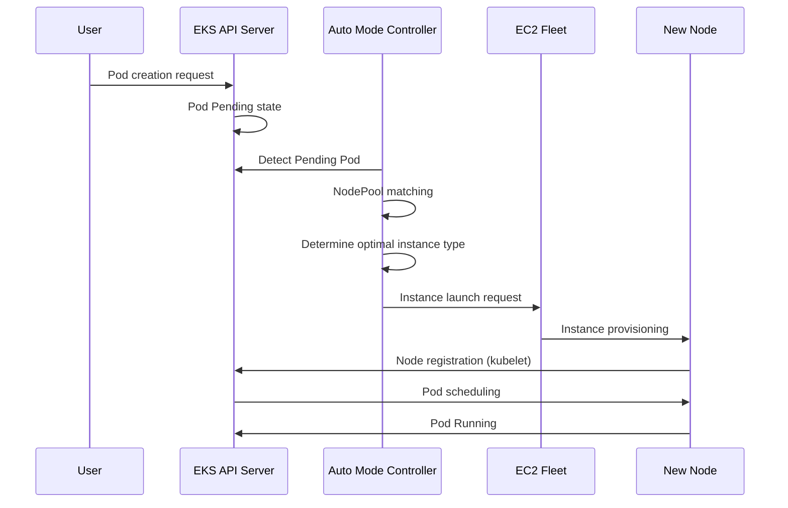

# EKS Auto Mode 運用ガイド

> **サポート対象バージョン**: EKS 1.29+, EKS Auto Mode GA
> **最終更新**: July 27, 2026

Amazon EKS Auto Mode は、ワークロード要件に基づいてノードを自動的にプロビジョニングおよび最適化する、Kubernetes ノード管理を完全に自動化する機能です。このガイドでは、EKS Auto Mode の概念、設定方法、本番環境におけるベストプラクティスを説明します。

### 2026 年 7 月のアップデート: EFA および Placement Group のサポート

2026 年 7 月 22 日、AWS は EKS Auto Mode（およびオープンソースの Karpenter）の NodePool が Elastic Fabric Adapter (EFA) ネットワークデバイス設定と EC2 placement group をサポートするようになったと発表しました。EFA 対応インスタンスのネットワークインターフェイスは EFA 専用または標準 ENI として設定できます。EFA 専用インターフェイスは完全なインターコネクト帯域幅を提供しながら VPC IP アドレスを消費しません。また、NodePool 設定から直接、cluster、spread、partition の placement strategy でインスタンスを起動できます。これは、最大スループットまたは障害分離を必要とする分散トレーニング／推論ワークロードを対象としています。詳細は[発表](https://aws.amazon.com/about-aws/whats-new/2026/07/amazon-eks-efa-placement-groups/)を参照してください。

### 2026 年 7 月のアップデート: ARC Zonal Shift のサポート

2026 年 7 月 10 日時点で、EKS Auto Mode クラスターは Amazon Application Recovery Controller (ARC) zonal shift および autoshift をサポートしています。Auto Mode はコンピューティングを管理するため、フラグの設定や Karpenter バージョンの管理をせずに zonal shift を利用できます。クラスターで ARC zonal shift を有効にするだけです。zonal shift が有効になると、Auto Mode は障害が発生している AZ での新しいキャパシティのプロビジョニングを停止し、そのゾーン内のノードに対する consolidation や drift などの自発的な中断を停止します。追加料金はかかりません。詳細は[発表](https://aws.amazon.com/about-aws/whats-new/2026/07/eks-auto-mode-arc-zonal-shift)および [ARC zonal shift ドキュメント](https://docs.aws.amazon.com/eks/latest/userguide/zone-shift.html)を参照してください。

## 目次

1. [Auto Mode の開始](./01-getting-started.md) - クラスターの作成と Auto Mode の有効化
2. [NodePool の設定と最適化](./02-nodepool-configuration.md) - デフォルトおよびカスタム NodePool
3. [スケーリング動作の理解](./03-scaling-behavior.md) - プロビジョニング、consolidation、drift 検出
4. [Spot Instance 活用戦略](./04-spot-strategies.md) - 混合キャパシティと中断処理
5. [運用と管理](./05-operations.md) - 中断バジェット、ローリング置換、モニタリング
6. [コスト管理と最適化](./06-cost-management.md) - コスト分析、Spot 節約、right-sizing
7. [ノードライフサイクル管理](./07-node-lifecycle.md) - 有効期限、AMI 管理、鮮度ポリシー
8. [ワークロード固有の最適化](./08-workload-optimization.md) - Web、バッチ、GPU、AI/ML ワークロード
9. [Managed Node Groups からの移行](./09-migration-guide.md) - 移行手順と共存

---

## EKS Auto Mode の概要

### Auto Mode とは？

EKS Auto Mode は AWS によって管理される完全自動のノード管理ソリューションです。内部的には Karpenter を基盤としており、ユーザーが個別のノード管理コンポーネントをインストールまたは設定することなく、AWS がすべてを管理します。

```
+-----------------------------------------------------------------------------+
|                           EKS Auto Mode Architecture                         |
+-----------------------------------------------------------------------------+
|                                                                              |
|  +---------------------------------------------------------------------+    |
|  |                    EKS Control Plane (AWS Managed)                   |    |
|  |  +------------+  +------------+  +------------+  +------------+    |    |
|  |  | API Server |  |   etcd     |  | Controller |  |  Karpenter |    |    |
|  |  |            |  |            |  |  Manager   |  | Controller |    |    |
|  |  +------------+  +------------+  +------------+  +------------+    |    |
|  +---------------------------------------------------------------------+    |
|                                    |                                         |
|                                    v                                         |
|  +---------------------------------------------------------------------+    |
|  |                        NodePool Resources                            |    |
|  |  +------------------+  +------------------+  +------------------+  |    |
|  |  |  general-purpose |  |      system      |  |   custom-pool    |  |
|  |  | (Default Provided)|  | (Default Provided)|  |  (User Defined)  |  |
|  |  +------------------+  +------------------+  +------------------+  |
|  +---------------------------------------------------------------------+    |
|                                    |                                         |
|                                    v                                         |
|  +---------------------------------------------------------------------+    |
|  |                     EC2 Instances (Auto Managed)                     |    |
|  |  +--------------+  +--------------+  +--------------+              |
|  |  |   m6i.2xl    |  |   c7g.xl     |  |   r6i.4xl    |   ...        |
|  |  |  (On-Demand) |  |   (Spot)     |  |  (On-Demand) |              |
|  |  +--------------+  +--------------+  +--------------+              |
|  +---------------------------------------------------------------------+    |
|                                                                              |
+-----------------------------------------------------------------------------+
```

### 既存の管理方式との比較

| 機能 | Managed Node Groups | Fargate | Auto Mode |
|---------|---------------------|---------|-----------|
| ノード管理 | ユーザー（ASG ベース） | AWS による完全管理 | AWS による完全管理 |
| スケーリング方式 | Cluster Autoscaler | Pod 単位 | Karpenter ベース |
| スケーリング速度 | 数分 | 即時（Pod のスケジューリング） | 数十秒 |
| インスタンスタイプの選択 | 事前定義 | 自動 | 自動最適化 |
| Spot サポート | 手動設定 | サポート対象外 | 自動管理 |
| GPU ワークロード | サポート | 制限あり | 完全サポート |
| DaemonSet サポート | サポート | サポート対象外 | サポート |
| コスト最適化 | 手動 | 中程度 | 自動 |
| 複雑さ | 高 | 低 | 低 |
| カスタマイズ性 | 高 | 低 | 中 |

### 内部アーキテクチャと動作原理

EKS Auto Mode は Karpenter を基盤として動作しますが、AWS が管理する Control Plane 内で実行されます。



### サポート対象リージョンと制限事項

#### サポート対象リージョン（2025 年 2 月時点）

EKS Auto Mode は以下のリージョンで利用できます。

- **南北アメリカ**: us-east-1, us-east-2, us-west-1, us-west-2
- **ヨーロッパ**: eu-west-1, eu-west-2, eu-central-1, eu-north-1
- **アジアパシフィック**: ap-northeast-1, ap-northeast-2, ap-southeast-1, ap-southeast-2, ap-south-1

#### 制限事項

| 項目 | 制限 |
|------|-------|
| クラスターあたりの NodePool の最大数 | 100 |
| NodePool あたりのノードの最大数 | 1000 |
| クラスターあたりのノードの最大数 | 5000 |
| 最小 EKS バージョン | 1.29 |
| サポート対象 AMI ファミリー | AL2023, Bottlerocket |
| Windows ノード | サポート対象外 |

---

## 次のステップ

EKS Auto Mode を正常に設定した後、以下のトピックを学ぶことをおすすめします。

1. **[EKS コスト最適化](../eks/07-eks-cost-optimization.md)**: Spot、Savings Plans、リソース最適化
2. **[EKS モニタリングとロギング](../eks/06-eks-monitoring-logging.md)**: CloudWatch、Prometheus、Grafana
3. **[EKS セキュリティ](../eks/05-eks-security.md)**: IAM、ネットワークポリシー、Pod セキュリティ
4. **[Karpenter 詳細解説](../autoscaling/02-karpenter.md)**: Karpenter の直接インストールと高度な機能

## 関連クイズ

学習内容を確認するには、[EKS Auto Mode クイズ](../quizzes/eks-auto-mode/01-getting-started-quiz.md)を試してください。

---

## 参考資料

- [AWS EKS Auto Mode 公式ドキュメント](https://docs.aws.amazon.com/eks/latest/userguide/automode.html)
- [Karpenter 公式ドキュメント](https://karpenter.sh/)
- [EKS ベストプラクティスガイド](https://aws.github.io/aws-eks-best-practices/)
- [AWS コスト最適化ガイド](https://aws.amazon.com/pricing/cost-optimization/)
- [セキュリティ、ネットワーク制御、パフォーマンスを強化する新しい EKS Auto Mode 機能（AWS Containers Blog、2025-10-16）](https://aws.amazon.com/blogs/containers/new-amazon-eks-auto-mode-features-for-enhanced-security-network-control-and-performance/)
- [セルフマネージド Karpenter から EKS Auto Mode への移行](https://docs.aws.amazon.com/eks/latest/userguide/auto-migrate-karpenter.html)

---

< [EKS トピックに戻る](../README.md) | [次へ: 開始](./01-getting-started.md) >
