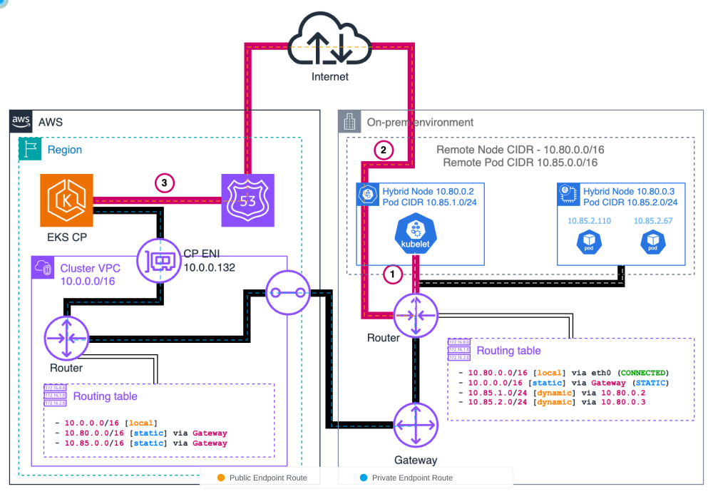
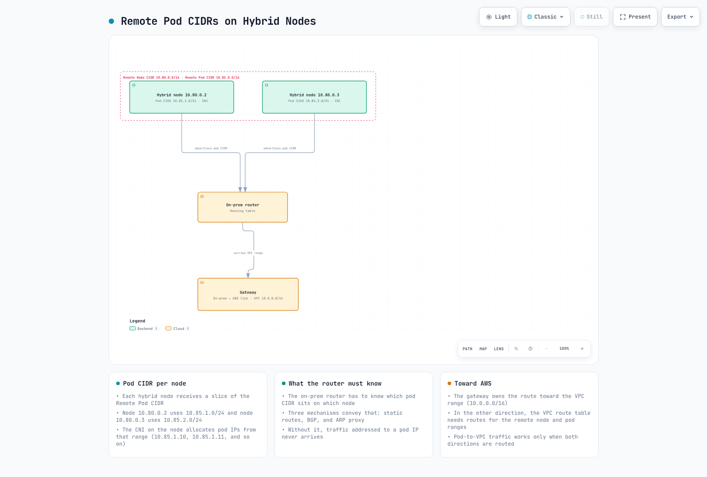

# ネットワーク設定

< [前へ: 前提条件](01-prerequisites.md) | [目次](./README.md) | [次へ: Air-Gap セットアップ](03-airgap-setup.md) >

> **サポート対象バージョン**: EKS 1.31+, nodeadm 0.1+ **最終更新**: February 23, 2026

このドキュメントでは、CIDR 要件、ファイアウォールルール、AWS エンドポイントアクセス、セキュリティグループ設定、DNS セットアップなど、EKS Hybrid Nodes に必要なネットワーク設定について説明します。

## ネットワークアーキテクチャの概要

次の図は、VPC 設定、Transit Gateway ルーティング、リモート CIDR、ファイアウォールルールを含む、EKS Hybrid Nodes の完全なネットワークトポロジーを示しています。


[🔍 インタラクティブ図を表示](https://www.atomai.click/kubernetes-docs/archmaps/en-eks-hybrid-nodes-prereq-0.html)

### ネットワークハブとしての VPC

EKS Hybrid Nodes 環境では、VPC は Hybrid Nodes と control plane 間の**ネットワークハブ**として機能します。

* **ENI の配置**: EKS control plane は VPC サブネットに ENI (Elastic Network Interface) を配置します。これらの ENI は、control plane と Hybrid Nodes 間の通信エンドポイントです。
* **トラフィック経路**: control plane と Hybrid Nodes 間のすべてのトラフィックは、これらの ENI を通過します。API server リクエスト、kubelet 通信、webhook 呼び出し、およびすべての control plane トラフィックが VPC ENI を経由します。
* **ENI IP の変更**: クラスタ更新時（例: バージョンアップグレード）に、ENI が削除および再作成され、IP アドレスが変更される場合があります。ファイアウォールルールでは個別の IP ではなくサブネット CIDR 範囲を使用することで、これらの変更に柔軟に対応できます。

```
┌─────────────────────────────────────────────────────────────────┐
│                         AWS Cloud                                │
│  ┌──────────────────┐    ┌──────────────────────────────────┐   │
│  │  EKS Control     │    │              VPC                  │   │
│  │     Plane        │◄──►│  ┌────────┐  ┌────────┐          │   │
│  │                  │    │  │  ENI   │  │  ENI   │          │   │
│  └──────────────────┘    │  │10.0.1.x│  │10.0.2.x│          │   │
│                          │  └────┬───┘  └────┬───┘          │   │
│                          └───────┼───────────┼──────────────┘   │
└──────────────────────────────────┼───────────┼──────────────────┘
                                   │           │
                           VPN / Direct Connect
                                   │           │
┌──────────────────────────────────┼───────────┼──────────────────┐
│                          On-Premises                             │
│                    ┌─────────────┴───────────┴─────────────┐    │
│                    │         Hybrid Nodes                   │    │
│                    │   ┌─────────┐    ┌─────────┐          │    │
│                    │   │  Node   │    │  Node   │          │    │
│                    │   │ kubelet │    │ kubelet │          │    │
│                    │   └─────────┘    └─────────┘          │    │
│                    └───────────────────────────────────────┘    │
└─────────────────────────────────────────────────────────────────┘
```

## CIDR 範囲の要件

オンプレミスの node CIDR および pod CIDR は、次の要件を満たす必要があります。

* **RFC-1918 範囲**内であること: `10.0.0.0/8`、`172.16.0.0/12`、`192.168.0.0/16`
* 次の CIDR と**重複しない**こと:
  * 相互（node CIDR と pod CIDR）
  * EKS クラスタの VPC CIDR
  * Kubernetes Service IPv4 CIDR

`RemoteNodeNetwork` および `RemotePodNetwork` フィールドは、EKS クラスタの作成時に指定します。

### ルーティング可能な Pod ネットワークとルーティング不可能な Pod ネットワーク

| 設定                        | ルーティング可能（推奨）                              | ルーティング不可能               |
| --------------------------- | ----------------------------------------------------- | -------------------------------- |
| セットアップ                | BGP（推奨）、静的ルート、またはカスタムルーティング   | CNI egress masquerade/NAT        |
| Webhook                     | Hybrid Nodes 上で実行可能                              | cloud nodes 上でのみ実行する必要あり |
| Pod↔Pod 通信                | cloud↔オンプレミスの直接通信                          | 不可能                           |
| AWS サービス統合            | ALB、Prometheus などが Hybrid workload に到達可能     | Hybrid workload に到達不可       |

> **推奨**: Cilium BGP Control Plane を使用して pod CIDR をルーティング可能にしてください。

***

## 必要なファイアウォールポート

### クラスタ通信ポート

オンプレミスと AWS 間の通信のため、以下のポートを開放する必要があります。

| ポート         | プロトコル   | 方向          | 用途                                                                     |
| -------------- | ------------ | ------------- | ------------------------------------------------------------------------ |
| 443            | TCP          | On-Prem → AWS | kubelet から Kubernetes API server                                       |
| 443            | TCP          | On-Prem → AWS | Pods から Kubernetes API server                                          |
| 10250          | TCP          | AWS → On-Prem | API server から kubelet                                                  |
| Webhook ポート | TCP          | AWS → On-Prem | API server から webhook（ルーティング可能な pod ネットワークのみ）       |
| 53             | TCP/UDP      | 双方向        | CoreDNS（pod CIDR ↔ pod CIDR。CoreDNS が cloud で実行される場合は VPC CIDR を含める） |
| App ポート     | ユーザー定義 | 双方向        | Pod 間のアプリケーション通信                                              |

### VPN ポート（Site-to-Site VPN を使用する場合）

| ポート | プロトコル | 方向   | 用途                        |
| ------ | ---------- | ------ | --------------------------- |
| 500    | UDP        | 双方向 | IKE (Internet Key Exchange) |
| 4500   | UDP        | 双方向 | IPSec NAT-T                 |

### Cilium CNI ポート

CNI として Cilium を使用する場合に必要となる追加ポート:

| ポート | プロトコル | 方向   | 用途                                |
| ------ | ---------- | ------ | ----------------------------------- |
| 8472   | UDP        | 双方向 | VXLAN overlay（デフォルトの tunnel mode） |
| 4240   | TCP        | 双方向 | ヘルスチェック                      |

> **注記**: Cilium および Calico の詳細なファイアウォール要件については、各プロジェクトの公式ドキュメントを参照してください。

### iptables ルールの例

```bash
# Allow Kubernetes API server communication
sudo iptables -A INPUT -p tcp --dport 443 -s 10.0.0.0/8 -j ACCEPT
sudo iptables -A OUTPUT -p tcp --dport 443 -d 10.0.0.0/8 -j ACCEPT

# Allow Kubelet API
sudo iptables -A INPUT -p tcp --dport 10250 -s 10.0.0.0/8 -j ACCEPT

# Allow Cilium VXLAN
sudo iptables -A INPUT -p udp --dport 8472 -j ACCEPT
sudo iptables -A OUTPUT -p udp --dport 8472 -j ACCEPT

# Allow Cilium health check
sudo iptables -A INPUT -p tcp --dport 4240 -j ACCEPT
sudo iptables -A OUTPUT -p tcp --dport 4240 -j ACCEPT

# Allow DNS
sudo iptables -A INPUT -p tcp --dport 53 -j ACCEPT
sudo iptables -A INPUT -p udp --dport 53 -j ACCEPT
sudo iptables -A OUTPUT -p tcp --dport 53 -j ACCEPT
sudo iptables -A OUTPUT -p udp --dport 53 -j ACCEPT

# Save rules
sudo iptables-save | sudo tee /etc/iptables/rules.v4
```

***

## オンプレミスのアウトバウンドアクセス要件

### インストールおよびアップグレードに必要なエンドポイント

nodeadm のインストールおよびアップグレード中、オンプレミスノードから HTTPS (443) 経由で次の AWS エンドポイントに到達可能である必要があります。

| コンポーネント          | URL                                                     | 注記                                  |
| ----------------------- | ------------------------------------------------------- | ------------------------------------- |
| EKS node artifact (S3)  | `https://hybrid-assets.eks.amazonaws.com`               | nodeadm バイナリと依存関係            |
| EKS サービス            | `https://eks.<region>.amazonaws.com`                    | クラスタ情報の検索                    |
| ECR サービス            | `https://api.ecr.<region>.amazonaws.com`                | コンテナイメージの pull                |
| SSM バイナリ            | `https://amazon-ssm-<region>.s3.<region>.amazonaws.com` | SSM credential provider 使用時        |
| SSM サービス            | `https://ssm.<region>.amazonaws.com`                    | SSM credential provider 使用時        |
| IAM Roles Anywhere      | `https://rolesanywhere.<region>.amazonaws.com`          | IAM RA credential provider 使用時     |
| OS package manager      | リージョン固有のエンドポイント                          | システムパッケージのインストール      |

### 継続運用に必要なエンドポイント

| 用途                      | ソース    | 宛先                  | 注記                         |
| ------------------------- | --------- | --------------------- | ---------------------------- |
| Kubelet → API server      | Node CIDR | EKS cluster IPs       | ポート 443                   |
| Pod → API server          | Pod CIDR  | EKS cluster IPs       | ポート 443                   |
| SSM credential refresh    | Node CIDR | SSM endpoint          | 5 分間の heartbeat 間隔      |
| IAM RA credential refresh | Node CIDR | IAM Anywhere endpoint | 定期的な refresh             |
| EKS Pod Identity          | Node CIDR | EKS Auth endpoint     | Pod Identity 使用時          |

### EKS クラスタ Network Interface IP の確認

ファイアウォールルールで EKS クラスタ IP が必要な場合、次のコマンドを使用します。

```bash
aws ec2 describe-network-interfaces \
  --filters "Name=vpc-id,Values=<VPC_ID>" "Name=description,Values=Amazon EKS*" \
  --query 'NetworkInterfaces[].PrivateIpAddress' \
  --output text
```

> **注記**: EKS network interface はクラスタ更新時（例: バージョンアップグレード）に削除および再作成される場合があります。制約されたサブネットサイズを使用すると IP 範囲を予測可能にでき、ファイアウォール設定が簡素化されます。

***

## VPC Private Endpoint（Air-Gap / プライベート接続）

オンプレミスノードがインターネットアクセスなしで VPN または Direct Connect 経由で AWS に接続する場合、AWS サービスにプライベートに到達するために **VPC Interface Endpoint** (PrivateLink) を設定する必要があります。

### VPC Endpoint が必要な理由

通常の AWS API 呼び出しはパブリックインターネットを経由します。air-gapped またはプライベートのみの環境にはインターネット経路がないため、AWS サービスに到達できません。VPC Interface Endpoint はプライベート IP アドレスを持つ ENI (Elastic Network Interface) を VPC 内に作成し、オンプレミスノードが VPN/Direct Connect 経由で AWS API に直接到達できるようにします。

```
On-premises node
  → VPN / Direct Connect
    → VPC Interface Endpoint ENI (private IP)
      → AWS Service (EKS, ECR, STS, SSM, etc.)
```

> **重要なポイント**: Gateway endpoint（S3 および DynamoDB 用）は VPC ルートテーブルにルートを追加するだけであり、VPN/Direct Connect 経由で**オンプレミスネットワークから到達できません**。オンプレミスから S3 にアクセスするには、**Interface type** の S3 endpoint を使用する必要があります。

### 必要な Interface VPC Endpoint

| サービス     | Endpoint Service Name                | Private DNS | 用途                                                 |
| ------------ | ------------------------------------ | ----------- | ---------------------------------------------------- |
| EKS          | `com.amazonaws.<region>.eks`         | Yes         | Kubernetes API server 通信                           |
| EKS Auth     | `com.amazonaws.<region>.eks-auth`    | Yes         | Pod Identity 認証                                    |
| ECR API      | `com.amazonaws.<region>.ecr.api`     | Yes         | イメージメタデータのクエリ                           |
| ECR DKR      | `com.amazonaws.<region>.ecr.dkr`     | Yes         | イメージ pull (Docker registry)                      |
| S3           | `com.amazonaws.<region>.s3`          | —           | イメージレイヤー、nodeadm artifact（**Interface type**） |
| STS          | `com.amazonaws.<region>.sts`         | Yes         | IAM credential exchange                              |
| SSM          | `com.amazonaws.<region>.ssm`         | Yes         | SSM credential provider 使用時                       |
| SSM Messages | `com.amazonaws.<region>.ssmmessages` | Yes         | SSM Session Manager 通信                             |

> **注記**: S3 Interface endpoint は `private_dns_enabled` を自動的にはサポートしません。S3 ドメインに対してプライベート DNS 解決が必要な場合、別途 Private Hosted Zone (PHZ) を設定する必要があります。`hybrid-assets.eks.amazonaws.com` のプライベートミラーリングパターンについては、[Air-Gap セットアップ - hybrid-assets Private Mirroring](03-airgap-setup.md#hybrid-assets-private-mirroring-s3--phz-pattern) を参照してください。

### Terraform による VPC Endpoint の作成

#### Security Group

```hcl
resource "aws_security_group" "vpc_endpoints" {
  name_prefix = "vpc-endpoints-"
  vpc_id      = var.vpc_id
  description = "Security group for VPC Interface Endpoints"

  ingress {
    description = "HTTPS from VPC and on-premises"
    from_port   = 443
    to_port     = 443
    protocol    = "tcp"
    cidr_blocks = [
      var.vpc_cidr,           # VPC internal traffic
      var.remote_node_cidr,   # On-premises node CIDR
      var.remote_pod_cidr     # On-premises pod CIDR
    ]
  }

  egress {
    from_port   = 0
    to_port     = 0
    protocol    = "-1"
    cidr_blocks = ["0.0.0.0/0"]
  }

  tags = {
    Name = "vpc-endpoints-sg"
  }
}
```

#### Interface VPC Endpoint

```hcl
# List of Interface endpoints to create
locals {
  interface_endpoints = {
    eks          = "com.amazonaws.${var.region}.eks"
    eks-auth     = "com.amazonaws.${var.region}.eks-auth"
    ecr-api      = "com.amazonaws.${var.region}.ecr.api"
    ecr-dkr      = "com.amazonaws.${var.region}.ecr.dkr"
    sts          = "com.amazonaws.${var.region}.sts"
    ssm          = "com.amazonaws.${var.region}.ssm"
    ssmmessages  = "com.amazonaws.${var.region}.ssmmessages"
  }
}

resource "aws_vpc_endpoint" "interface" {
  for_each = local.interface_endpoints

  vpc_id              = var.vpc_id
  service_name        = each.value
  vpc_endpoint_type   = "Interface"
  private_dns_enabled = true

  subnet_ids         = var.private_subnet_ids
  security_group_ids = [aws_security_group.vpc_endpoints.id]

  tags = {
    Name = "vpce-${each.key}"
  }
}

# S3 Interface endpoint (Interface type, not Gateway)
resource "aws_vpc_endpoint" "s3_interface" {
  vpc_id              = var.vpc_id
  service_name        = "com.amazonaws.${var.region}.s3"
  vpc_endpoint_type   = "Interface"
  private_dns_enabled = false  # S3 does not support auto Private DNS for Interface type

  subnet_ids         = var.private_subnet_ids
  security_group_ids = [aws_security_group.vpc_endpoints.id]

  tags = {
    Name = "vpce-s3-interface"
  }
}
```

### AWS CLI による VPC Endpoint の作成

```bash
# 1. Create security group for VPC endpoints
SG_ID=$(aws ec2 create-security-group \
  --group-name vpc-endpoints-sg \
  --description "Security group for VPC Interface Endpoints" \
  --vpc-id <VPC_ID> \
  --query 'GroupId' --output text)

# Allow port 443 inbound
aws ec2 authorize-security-group-ingress \
  --group-id $SG_ID \
  --ip-permissions '[
    {"IpProtocol": "tcp", "FromPort": 443, "ToPort": 443,
     "IpRanges": [
       {"CidrIp": "<VPC_CIDR>", "Description": "VPC internal"},
       {"CidrIp": "<REMOTE_NODE_CIDR>", "Description": "On-prem nodes"},
       {"CidrIp": "<REMOTE_POD_CIDR>", "Description": "On-prem pods"}
     ]}
  ]'

# 2. Create Interface VPC endpoint (EKS example)
aws ec2 create-vpc-endpoint \
  --vpc-id <VPC_ID> \
  --vpc-endpoint-type Interface \
  --service-name com.amazonaws.<REGION>.eks \
  --subnet-ids <SUBNET_ID_1> <SUBNET_ID_2> \
  --security-group-ids $SG_ID \
  --private-dns-enabled

# 3. Create remaining service endpoints
for SERVICE in eks-auth ecr.api ecr.dkr sts ssm ssmmessages; do
  echo "Creating endpoint for: $SERVICE"
  aws ec2 create-vpc-endpoint \
    --vpc-id <VPC_ID> \
    --vpc-endpoint-type Interface \
    --service-name com.amazonaws.<REGION>.$SERVICE \
    --subnet-ids <SUBNET_ID_1> <SUBNET_ID_2> \
    --security-group-ids $SG_ID \
    --private-dns-enabled
done

# 4. S3 Interface endpoint (without private-dns-enabled)
aws ec2 create-vpc-endpoint \
  --vpc-id <VPC_ID> \
  --vpc-endpoint-type Interface \
  --service-name com.amazonaws.<REGION>.s3 \
  --subnet-ids <SUBNET_ID_1> <SUBNET_ID_2> \
  --security-group-ids $SG_ID

# 5. Verify created endpoints
aws ec2 describe-vpc-endpoints \
  --filters "Name=vpc-id,Values=<VPC_ID>" \
  --query 'VpcEndpoints[].{ID:VpcEndpointId, Service:ServiceName, State:State}' \
  --output table
```

### オンプレミス DNS 解決フロー

VPC endpoint の `private_dns_enabled` オプションは VPC 内でのみ機能します。オンプレミスノードが AWS サービスドメイン（例: `eks.ap-northeast-2.amazonaws.com`）を VPC endpoint のプライベート IP に解決するには、DNS クエリを Route 53 Resolver Inbound Endpoint 経由でルーティングする必要があります。

```
On-premises node
  → On-premises DNS server (conditional forwarding)
    → Route 53 Resolver Inbound Endpoint (in VPC)
      → Route 53 resolves via Private Hosted Zone / VPC DNS
        → Returns VPC Endpoint ENI private IP
          → On-premises node reaches ENI directly over VPN/DX
```

#### オンプレミス DNS での条件付きフォワーディングの設定

オンプレミス DNS server（例: BIND、Windows DNS、dnsmasq）を設定し、AWS ドメインを Route 53 Inbound Endpoint にフォワードします。

```
# BIND example (/etc/named.conf)
zone "amazonaws.com" {
    type forward;
    forward only;
    forwarders {
        10.0.1.10;    # Route 53 Inbound Endpoint IP #1
        10.0.2.10;    # Route 53 Inbound Endpoint IP #2
    };
};

zone "eks.amazonaws.com" {
    type forward;
    forward only;
    forwarders {
        10.0.1.10;
        10.0.2.10;
    };
};
```

> **注記**: Route 53 Resolver Inbound Endpoint の作成については、このドキュメントの [DNS 設定](02-network-configuration.md#dns-configuration) セクションを参照してください。VPC endpoint を設定した後は、必ず `nslookup eks.<region>.amazonaws.com` でプライベート IP が返されることを確認してください。

***

## AWS Security Group 設定

EKS はクラスタ作成時に security group のインバウンドルールを自動設定しますが、アウトバウンドルールは自動作成されません（security group はデフォルトで全アウトバウンドを許可します）。

### 自動作成されるインバウンドルール

| プロトコル | ポート | ソース              | 用途                                    |
| ---------- | ------ | ------------------- | --------------------------------------- |
| TCP        | 443    | Remote node CIDR(s) | kubelet から Kubernetes API             |
| TCP        | 443    | Remote pod CIDR(s)  | Pods から Kubernetes API（非 NAT CNI）  |

### 手動で追加するアウトバウンドルール

| プロトコル | ポート         | 宛先                | 用途                    |
| ---------- | -------------- | ------------------- | ----------------------- |
| TCP        | 10250          | Remote node CIDR(s) | API server から kubelet |
| TCP        | Webhook ポート | Remote pod CIDR(s)  | API server から webhook |

```bash
# Example: Create a custom security group
aws ec2 create-security-group \
  --group-name hybrid-nodes-sg \
  --description "Security group for EKS Hybrid Nodes" \
  --vpc-id <VPC_ID>

# Add inbound rules
aws ec2 authorize-security-group-ingress \
  --group-id <SG_ID> \
  --ip-permissions '[
    {"IpProtocol": "tcp", "FromPort": 443, "ToPort": 443,
     "IpRanges": [{"CidrIp": "<REMOTE_NODE_CIDR>"}, {"CidrIp": "<REMOTE_POD_CIDR>"}]}
  ]'
```

> **注意**: security group あたりのインバウンドルールのデフォルト上限は 60 です。また、リモートネットワークが削除されても、EKS はルールを自動的に削除しません。手動でのクリーンアップが必要です。

***

## Pod CIDR ファイアウォール戦略

Pod 間通信のため、Pod CIDR の全範囲に対するファイアウォールルールを登録する必要があります。

```bash
# Pod CIDR range example: 10.244.0.0/16
# Check cluster's Pod CIDR
kubectl cluster-info dump | grep -m 1 cluster-cidr

# Add firewall rules for Pod CIDR
sudo iptables -A INPUT -s 10.244.0.0/16 -j ACCEPT
sudo iptables -A OUTPUT -d 10.244.0.0/16 -j ACCEPT
sudo iptables -A FORWARD -s 10.244.0.0/16 -j ACCEPT
sudo iptables -A FORWARD -d 10.244.0.0/16 -j ACCEPT

# Add Service CIDR as well (e.g., 172.20.0.0/16)
sudo iptables -A INPUT -s 172.20.0.0/16 -j ACCEPT
sudo iptables -A OUTPUT -d 172.20.0.0/16 -j ACCEPT
```

***

## DNS 設定

### Route 53 Resolver Inbound Endpoint

オンプレミスから AWS ドメインをクエリできるように Inbound Endpoint を作成します。

```bash
# Create Inbound Endpoint
aws route53resolver create-resolver-endpoint \
  --creator-request-id "hybrid-inbound-$(date +%s)" \
  --name "hybrid-inbound-endpoint" \
  --security-group-ids sg-0123456789abcdef0 \
  --direction INBOUND \
  --ip-addresses SubnetId=subnet-111111111,Ip=10.0.1.10 SubnetId=subnet-222222222,Ip=10.0.2.10

# Check Endpoint IPs
aws route53resolver list-resolver-endpoint-ip-addresses \
  --resolver-endpoint-id rslvr-in-xxxxxxxxxxxxx
```

### Route 53 Resolver Outbound Endpoint

AWS がオンプレミスドメインをクエリできるように Outbound Endpoint とフォワーディングルールを作成します。

```bash
# Create Outbound Endpoint
aws route53resolver create-resolver-endpoint \
  --creator-request-id "hybrid-outbound-$(date +%s)" \
  --name "hybrid-outbound-endpoint" \
  --security-group-ids sg-0123456789abcdef0 \
  --direction OUTBOUND \
  --ip-addresses SubnetId=subnet-111111111 SubnetId=subnet-222222222

# Create forwarding rule (on-premises domain)
aws route53resolver create-resolver-rule \
  --creator-request-id "forward-onprem-$(date +%s)" \
  --name "forward-to-onprem" \
  --rule-type FORWARD \
  --domain-name "internal.company.io" \
  --resolver-endpoint-id rslvr-out-xxxxxxxxxxxxx \
  --target-ips "Ip=192.168.1.10,Port=53" "Ip=192.168.1.11,Port=53"

# Associate rule with VPC
aws route53resolver associate-resolver-rule \
  --resolver-rule-id rslvr-rr-xxxxxxxxxxxxx \
  --vpc-id vpc-0123456789abcdef0
```

### CoreDNS カスタムドメイン設定

オンプレミスドメインの DNS クエリをオンプレミス DNS server にフォワードします。

```yaml
apiVersion: v1
kind: ConfigMap
metadata:
  name: coredns
  namespace: kube-system
data:
  Corefile: |
    .:53 {
        errors
        health {
            lameduck 5s
        }
        ready
        kubernetes cluster.local in-addr.arpa ip6.arpa {
            pods insecure
            fallthrough in-addr.arpa ip6.arpa
        }
        prometheus :9153
        forward . /etc/resolv.conf {
            max_concurrent 1000
        }
        cache 30
        loop
        reload
        loadbalance
    }
    internal.company.io:53 {
        errors
        cache 30
        forward . 192.168.1.10 192.168.1.11 {
            max_concurrent 1000
        }
    }
```

```bash
# Apply CoreDNS ConfigMap
kubectl apply -f coredns-configmap.yaml

# Restart CoreDNS
kubectl rollout restart deployment coredns -n kube-system

# Test DNS resolution
kubectl run dns-test --rm -it --image=busybox --restart=Never -- nslookup internal.company.io
```

### CoreDNS のデュアルロケーション Deployment（オンプレミス + Cloud）

#### デュアルロケーション Deployment が必要な理由

EKS Hybrid Nodes 環境で CoreDNS が cloud nodes 上でのみ実行されている場合、オンプレミス Pods からの DNS クエリは VPN/Direct Connect リンクを経由して cloud に到達し、戻る必要があります。逆に、CoreDNS がオンプレミスノード上でのみ実行されている場合、cloud Pods からの DNS クエリは逆方向の往復を行う必要があります。

DNS レイテンシーを最小限に抑え、片側でネットワーク障害が発生しても DNS サービスの可用性を維持するために、**CoreDNS Pods は両側に存在する必要があります**。

#### 推奨レプリカ数

最低 **4 レプリカ**（cloud 2 + オンプレミス 2）を推奨します。各ロケーションに少なくとも 2 レプリカを配置することで、高可用性を確保できます。

#### CoreDNS Deployment Patch

`topologySpreadConstraints` と `tolerations` を使用して、CoreDNS Pods を cloud nodes とオンプレミスノードに均等に分散します。

```yaml
apiVersion: apps/v1
kind: Deployment
metadata:
  name: coredns
  namespace: kube-system
spec:
  replicas: 4
  template:
    spec:
      tolerations:
        - key: "eks.amazonaws.com/compute-type"
          value: "hybrid"
          effect: "NoSchedule"
      topologySpreadConstraints:
        - maxSkew: 1
          topologyKey: "eks.amazonaws.com/compute-type"
          whenUnsatisfiable: ScheduleAnyway
          labelSelector:
            matchLabels:
              k8s-app: kube-dns
```

#### kubectl patch コマンド

```bash
kubectl patch deployment coredns -n kube-system --type=strategic -p '{
  "spec": {
    "replicas": 4,
    "template": {
      "spec": {
        "tolerations": [
          {
            "key": "eks.amazonaws.com/compute-type",
            "value": "hybrid",
            "effect": "NoSchedule"
          }
        ],
        "topologySpreadConstraints": [
          {
            "maxSkew": 1,
            "topologyKey": "eks.amazonaws.com/compute-type",
            "whenUnsatisfiable": "ScheduleAnyway",
            "labelSelector": {
              "matchLabels": {
                "k8s-app": "kube-dns"
              }
            }
          }
        ]
      }
    }
  }
}'
```

#### 配置の確認

```bash
# Verify CoreDNS Pods are distributed across both node types
kubectl get pods -n kube-system -l k8s-app=kube-dns -o wide

# Check compute-type labels on nodes
kubectl get nodes -L eks.amazonaws.com/compute-type
```

> **注記**:
>
> * EKS managed CoreDNS add-on を使用する場合、同じ設定を add-on の `configurationValues` を通じて適用できます。
> * `whenUnsatisfiable: ScheduleAnyway` を使用すると、一方にしかノードが存在しない場合でもスケジューリングがブロックされません。これにより、初期クラスタ bootstrap 中も CoreDNS が正常に起動することを保証します。

***

## トラフィックフローパターン

AWS とオンプレミス間のトラフィックフローパターンを理解することは、ファイアウォール設定とトラブルシューティングに不可欠です。以下のセクションでは、AWS 公式アーキテクチャ図とともに各トラフィックパターンを詳しく説明します。

> **出典**: [AWS EKS Hybrid Nodes Traffic Flows](https://docs.aws.amazon.com/eks/latest/userguide/hybrid-nodes-concepts-traffic-flows.html)

### パターン 1: Kubelet → EKS Control Plane

Kubelet は DNS lookup 経由で API server endpoint に HTTPS リクエストを開始します。パブリックアクセスモードでは、トラフィックはパブリックインターネットを経由します。プライベートモードでは、トラフィックは VPN/DX 経由で VPC ENI に流れます。



### パターン 2: EKS Control Plane → Kubelet

API server は node status object から node IP を取得します。トラフィックは VPC を経由し、その後 Direct Connect または VPN を介して cloud 境界を越え、ポート 10250 の kubelet に到達します。これは `kubectl logs`、`kubectl exec`、`kubectl port-forward` などで使用されます。


### パターン 3: Pod → EKS Control Plane

Pods は `kubernetes` Service (ClusterIP) 経由で Kubernetes API と通信します。kube-proxy は Service IP を control plane ENI IP に変換するため DNAT を適用し、パケットは VPN/DX 経由で VPC にルーティングされます。

* **CNI NAT なし**: Pod は kubernetes Service IP（例: 172.16.0.1）に送信し、kube-proxy が control plane ENI IP への DNAT を適用します。戻りトラフィックには pod CIDR 経由の逆方向ルーティングが必要です。
* **CNI NAT あり**: CNI は node 処理前に SNAT を適用するため、戻りルーティングが簡素化されます（追加の pod CIDR ルーティングは不要）。


### パターン 4: EKS Control Plane → Pod (Webhook)

API server は Hybrid Nodes 上で実行される webhook pods への直接接続を開始します。トラフィックはリモート pod CIDR 用に VPC を経由し、gateway を介して境界を越えます。これには**ルーティング可能な pod CIDR が必要です**。


> **重要**: オンプレミス pod CIDR がルーティング可能でない場合、**すべての webhook を cloud nodes 上で実行する必要があります**。下記の [Webhook 設定](02-network-configuration.md#webhook-configuration) を参照してください。

### パターン 5: Hybrid Nodes 上の Pod ↔ Pod

異なる Hybrid Nodes 上の Pods は、[VXLAN encapsulation](../networking/cilium/03-networking.md#vxlan-technology-deep-dive)（または Geneve、IP-in-IP などの類似した overlay protocol）を使用して通信します。CNI は、送信元/宛先 node IP を使用する外側のヘッダーで、元の pod-to-pod パケットをカプセル化します。受信 node の CNI はカプセル化を解除して宛先 pod に配信します。


#### VXLAN Encapsulation の詳細

VXLAN (Virtual Extensible LAN) は、L2 フレームを L3 パケットにカプセル化して overlay network を作成します。Hybrid Nodes 間の Pod 通信時にパケット構造がどのように変化するかを以下に示します。

**元のパケット（カプセル化前）**

```
┌────────────────────────────────────────────────┐
│  Pod-A IP (src) → Pod-B IP (dst) │   Payload   │
│    10.85.0.10       10.85.1.20   │   (data)    │
└────────────────────────────────────────────────┘
```

**VXLAN Encapsulation 後**

```
┌──────────────────────────────────────────────────────────────────────────────┐
│ Outer IP Header │ UDP Header │ VXLAN Header │      Original Packet          │
│ Node-A → Node-B │ Port 8472  │    (VNI)     │ Pod-A IP → Pod-B IP │ Payload │
│ 10.80.1.10      │            │              │ 10.85.0.10  10.85.1.20        │
│   → 10.80.1.11  │            │              │                               │
└──────────────────────────────────────────────────────────────────────────────┘
```

**Encapsulation プロセス（送信元 Node）**

1. Pod-A が Pod-B にパケットを送信します
2. 送信元 node の CNI (Cilium) が宛先 Pod IP を検索し、対象 node を特定します
3. CNI が元のパケットを VXLAN ヘッダーおよび外側 IP ヘッダーでラップします
4. 外側ヘッダーでは node IP を送信元/宛先として使用します
5. カプセル化されたパケットは UDP ポート 8472 経由で送信されます

**Decapsulation プロセス（宛先 Node）**

1. 宛先 node が UDP ポート 8472 で VXLAN パケットを受信します
2. CNI が VXLAN ヘッダーと外側 IP ヘッダーを取り除きます
3. 元のパケットが宛先 Pod に配信されます

**主要コンポーネント**

| コンポーネント                 | 説明                                                                       |
| ------------------------------ | -------------------------------------------------------------------------- |
| VNI (VXLAN Network Identifier) | pod network traffic を分離する 24-bit identifier（デフォルト: 自動割り当て） |
| UDP Port                       | Cilium デフォルト: 8472、Standard VXLAN: 4789                              |
| MTU                            | VXLAN overhead（50 bytes）を考慮する必要あり。例: 1500 → 1450              |

> **注記**: Cilium は VXLAN のほかに、Geneve や IP-in-IP などの tunnel protocol をサポートします。tunnel mode を選択するには `--tunnel` オプションを使用してください。

### パターン 6: Cloud Pod ↔ Hybrid Pod (East-West)

VPC pods（VPC CNI を使用）は Hybrid pods に直接送信します。VPC ルーティングがトラフィックをオンプレミス gateway に向け、パケットは境界を越えて Hybrid node に到達します。これには**ルーティング可能な pod CIDR**と適切な VPC route table entry が必要です。


### トラフィックフローの概要

| # | フロー                    | 方向             | ポート    | 要件                               |
| - | ------------------------- | ---------------- | --------- | ---------------------------------- |
| 1 | Kubelet → API Server      | On-Prem → AWS    | TCP 443   | VPN/DX またはインターネット         |
| 2 | API Server → Kubelet      | AWS → On-Prem    | TCP 10250 | SG outbound rule                   |
| 3 | Pod → API Server          | On-Prem → AWS    | TCP 443   | kube-proxy DNAT                    |
| 4 | API Server → Webhook Pod  | AWS → On-Prem    | TCP 8443+ | **ルーティング可能な pod CIDR**     |
| 5 | Hybrid Pod ↔ Hybrid Pod   | On-Prem 内部     | UDP 8472  | Cilium VXLAN                       |
| 6 | Cloud Pod ↔ Hybrid Pod    | AWS ↔ On-Prem    | VPC route | **ルーティング可能な pod CIDR** + VPC routes |

### kube-proxy iptables チェーン構造

kube-proxy は iptables ルールを使用して、Kubernetes Service トラフィックを実際の Pods にルーティングします。同じ 3 層のチェーン構造が Hybrid Nodes にも適用されます。

```
KUBE-SERVICES (entry point)
  └─→ KUBE-SVC-xxxx (per-service chain, load balancing)
        └─→ KUBE-SEP-xxxx (per-endpoint chain, DNAT to pod IP)
```

**チェーンの役割**

| チェーン            | 役割                                                       | 例                                   |
| ------------------- | ---------------------------------------------------------- | ------------------------------------ |
| **KUBE-SERVICES**   | 宛先 IP:Port をすべての ClusterIP Service と照合する          | `172.20.0.1:443` → `KUBE-SVC-NPX...` |
| **KUBE-SVC-xxxx**   | 確率ベースの load balancing で endpoint を選択する           | 3 Pods → 各 33% の確率               |
| **KUBE-SEP-xxxx**   | 特定の Pod IP:Port への DNAT を実行する                     | `10.85.0.15:8080` への DNAT          |

**実際の iptables ルールの例**

```bash
# KUBE-SERVICES chain (nat table)
-A KUBE-SERVICES -d 172.20.0.10/32 -p tcp -m tcp --dport 80 -j KUBE-SVC-XXXXXX

# KUBE-SVC chain (load balancing)
-A KUBE-SVC-XXXXXX -m statistic --mode random --probability 0.33333 -j KUBE-SEP-AAAAAA
-A KUBE-SVC-XXXXXX -m statistic --mode random --probability 0.50000 -j KUBE-SEP-BBBBBB
-A KUBE-SVC-XXXXXX -j KUBE-SEP-CCCCCC

# KUBE-SEP chain (DNAT)
-A KUBE-SEP-AAAAAA -p tcp -j DNAT --to-destination 10.85.0.15:8080
-A KUBE-SEP-BBBBBB -p tcp -j DNAT --to-destination 10.85.0.16:8080
-A KUBE-SEP-CCCCCC -p tcp -j DNAT --to-destination 10.85.1.20:8080
```

> **Hybrid 環境への影響**: 上記の例で、`10.85.1.20` が異なる Hybrid node 上の Pod である場合、DNAT 後のパケットは VXLAN カプセル化されてその node に送信されます。kube-proxy は Service トラフィックを Pod IP に変換し、CNI が実際のネットワークルーティングを処理します。

### kubelet Endpoint

kubelet は各 node 上で実行され、API server 通信用の REST endpoint を公開します。

**kubelet API ポートと Endpoint**

| ポート | Endpoint                              | 用途                                             |
| ------ | ------------------------------------- | ------------------------------------------------ |
| 10250  | `/pods`                               | node 上で実行されている pods を一覧表示          |
| 10250  | `/exec/{namespace}/{pod}/{container}` | コンテナ内でコマンドを実行 (`kubectl exec`)       |
| 10250  | `/logs/{namespace}/{pod}/{container}` | コンテナログをストリーミング (`kubectl logs`)     |
| 10250  | `/metrics`                            | kubelet metrics を公開（Prometheus scraping 用）  |
| 10250  | `/healthz`                            | kubelet ヘルスチェック                            |

**Node 登録とアドレス報告**

kubelet が cluster に node を登録すると、`Node.status.addresses` にアドレス情報を報告します。

```yaml
status:
  addresses:
  - address: 10.80.1.10        # Actual on-premises IP
    type: InternalIP
  - address: hybrid-node-001   # Node hostname
    type: Hostname
```

* **InternalIP**: node の実際のオンプレミス IP アドレス。API server はこのアドレスを使用して kubelet に接続します。
* **Hostname**: node の hostname。

> **ファイアウォールルールの要件**: API server は `InternalIP` を使用して kubelet に接続するため、**AWS → On-Prem からの TCP ポート 10250 を開放する必要があります**。この接続がブロックされると、`kubectl exec`、`kubectl logs`、`kubectl port-forward` などのコマンドは失敗します。

***

## ルーティング可能な Pod CIDR の設定

オンプレミス pod CIDR をルーティング可能にすることは、webhook、east-west traffic、AWS サービス統合（ALB、Prometheus など）に不可欠です。



[🔍 インタラクティブ図を表示](https://www.atomai.click/kubernetes-docs/archmaps/en-eks-hybrid-nodes-02-network-configuration-0.html)

### オプション 1: BGP（推奨）

CNI は仮想 router として機能し、node ごとの pod CIDR route をローカルのオンプレミス router に伝播します。これは最も動的で保守しやすいアプローチです。


[🔍 インタラクティブ図を表示](https://www.atomai.click/kubernetes-docs/archmaps/en-eks-hybrid-nodes-02-network-configuration-1.html)

#### Cilium BGP Control Plane 設定

```yaml
apiVersion: cilium.io/v2alpha1
kind: CiliumBGPClusterConfig
metadata:
  name: hybrid-bgp-config
spec:
  bgpInstances:
  - name: hybrid-instance
    localASN: 65001
    peers:
    - name: on-prem-router
      peerASN: 65000
      peerAddress: 10.80.0.1
      peerConfigRef:
        name: on-prem-peer
---
apiVersion: cilium.io/v2alpha1
kind: CiliumBGPPeerConfig
metadata:
  name: on-prem-peer
spec:
  families:
  - afi: ipv4
    safi: unicast
  gracefulRestart:
    enabled: true
---
apiVersion: cilium.io/v2alpha1
kind: CiliumBGPAdvertisement
metadata:
  name: pod-cidr-advert
spec:
  advertisements:
  - advertisementType: PodCIDR
  - advertisementType: Service
    service:
      addresses:
      - ClusterIP
```

#### ASN (Autonomous System Number) の理解

上記の Cilium BGP 設定では、`localASN` と `peerASN` は、各 BGP participant に割り当てられる一意の識別子である**Autonomous System Number**です。すべての BGP speaker（router、switch、またはこの場合は各 node 上の Cilium）には ASN が必要であり、接続先 peer にも ASN が必要です。

**Private ASN 範囲と Public ASN 範囲**

| 範囲                        | 種類           | ユースケース                                                                                |
| --------------------------- | -------------- | ------------------------------------------------------------------------------------------- |
| **64512 – 65534**           | 16-bit Private | 内部ネットワーク、data center、lab 環境。**EKS Hybrid Nodes にはこの範囲を使用してください。** |
| **4200000000 – 4294967294** | 32-bit Private | 多数の一意な ASN を必要とする大規模な内部 Deployment                                        |
| 1 – 64511                   | 16-bit Public  | RIR (ARIN、RIPE、APNIC) に登録されたインターネット向けネットワーク                         |

> **EKS Hybrid Nodes の場合**: 常に**private ASN 範囲**（64512–65534）を使用してください。public ASN は不要です。ここでの BGP は、Cilium nodes とオンプレミス router 間の内部ネットワーク内でのみ使用されます。

**ASN 値の選択方法**

* **`localASN`**（例: `65001`）: Hybrid Nodes 上で実行される Cilium に割り当てる ASN。同じ cluster 内のすべての Cilium nodes は通常 1 つの ASN を共有します。
* **`peerASN`**（例: `65000`）: Cilium が peer を確立するオンプレミス router の ASN。この値は router の BGP 設定で確認してください。

環境内で BGP が現在設定されていない場合は、private 範囲から異なる 2 つの数値を選ぶだけです（例: router に `65000`、Cilium に `65001`）。ネットワークチームがすでに内部で BGP を使用している場合は、ASN の競合を避けるために調整してください。

**オンプレミス Router BGP 設定例**

以下は、上記の Cilium 設定と一致するように BGP peering の**router 側**を設定する例です。各例では、router は ASN `65000` を使用し、`10.80.1.10`（ASN `65001`）にある Cilium node と peer を確立します。

**Cisco IOS / IOS-XE**

```
router bgp 65000
 neighbor 10.80.1.10 remote-as 65001
 neighbor 10.80.1.10 description "EKS Hybrid Node - Cilium BGP"
 !
 address-family ipv4 unicast
  neighbor 10.80.1.10 activate
  neighbor 10.80.1.10 soft-reconfiguration inbound
 exit-address-family
```

**Cisco NX-OS (Nexus)**

```
router bgp 65000
  address-family ipv4 unicast
  neighbor 10.80.1.10
    remote-as 65001
    description EKS-Hybrid-Cilium
    address-family ipv4 unicast
      soft-reconfiguration inbound
```

**Juniper Junos (MX / QFX / SRX)**

```
set protocols bgp group eks-hybrid type external
set protocols bgp group eks-hybrid peer-as 65001
set protocols bgp group eks-hybrid neighbor 10.80.1.10 description "EKS Hybrid Node"
set protocols bgp group eks-hybrid family inet unicast
set routing-options autonomous-system 65000
```

**Arista EOS**

```
router bgp 65000
   neighbor 10.80.1.10 remote-as 65001
   neighbor 10.80.1.10 description EKS-Hybrid-Cilium
   !
   address-family ipv4
      neighbor 10.80.1.10 activate
```

**MikroTik RouterOS**

```
/routing bgp connection
add name=eks-hybrid remote.address=10.80.1.10 remote.as=65001 \
    local.role=ebgp as=65000 address-families=ip
```

**FRRouting (FRR) — Software Router (Linux)**

FRRouting は Linux server および VM 上のソフトウェア BGP router として一般的に使用されます。

```
router bgp 65000
 neighbor 10.80.1.10 remote-as 65001
 neighbor 10.80.1.10 description EKS-Hybrid-Cilium
 !
 address-family ipv4 unicast
  neighbor 10.80.1.10 activate
 exit-address-family
```

**AWS Transit Gateway (TGW)**

Site-to-Site VPN で AWS Transit Gateway を使用する場合、TGW 側の ASN は TGW の作成時に設定します。

```bash
# TGW creation with custom ASN
aws ec2 create-transit-gateway \
  --options AmazonSideAsn=65000

# The VPN tunnel automatically establishes BGP with the TGW ASN
# On-premises router (or Cilium) uses its own ASN to peer with TGW
```

> **注記**: AWS TGW のデフォルト ASN は `64512` です。Cilium nodes が `65001` を使用する場合、Cilium 設定の TGW（または VGW）peer ASN は TGW の ASN と一致する必要があります。

**複数の Hybrid Nodes**

複数の Hybrid Nodes がある場合、各 node は**同じ `localASN`**でそれぞれの Cilium BGP speaker を実行します。オンプレミス router は各 node と個別に peer を確立します。

```
# Router config — peer with each hybrid node
router bgp 65000
 neighbor 10.80.1.10 remote-as 65001   ! hybrid-node-001
 neighbor 10.80.1.11 remote-as 65001   ! hybrid-node-002
 neighbor 10.80.1.12 remote-as 65001   ! hybrid-node-003
```

各 node は自身の pod CIDR slice（例: node-001 は `10.85.0.0/25`、node-002 は `10.85.0.128/25` を広告）を広告するため、router はすべての pod CIDR の完全な routing table を構築します。

#### BGP Peering の確認

```bash
cilium bgp peers
cilium bgp routes
```

Hybrid Nodes は Session State `established` と表示されるはずです。

### オプション 2: 静的ルート

pod CIDR を使用する手動の router 設定です。最も簡単ですが、エラーが発生しやすく、node の変更時に手動更新が必要です。


[🔍 インタラクティブ図を表示](https://www.atomai.click/kubernetes-docs/archmaps/en-eks-hybrid-nodes-02-network-configuration-2.html)

#### Cluster-Pool IPAM 割り当ての理解

Cilium の `cluster-pool` IPAM mode では、pod CIDR pool 全体が node ごとの固定サイズ block に分割されます。[04-node-bootstrap.md](04-node-bootstrap.md) の Cilium values で、次の 2 つの主要パラメータを設定します。

| パラメータ                   | 値の例         | 説明                                  |
| ---------------------------- | -------------- | ------------------------------------- |
| `clusterPoolIPv4PodCIDRList` | `10.85.0.0/16` | pod CIDR pool 全体                    |
| `clusterPoolIPv4MaskSize`    | `25`           | node ごとに割り当てる subnet size (/25 = 128 IPs) |

たとえば `10.85.0.0/16` の pool と `/25` の mask size では、最大 **512 nodes** にそれぞれ 128 個の pod IP を割り当てられます。Cilium Operator は node の登録順に block を割り当てます。

| Node            | 割り当てられた PodCIDR | 利用可能な Pod IPs            |
| --------------- | ---------------------- | ----------------------------- |
| hybrid-node-001 | `10.85.0.0/25`         | `10.85.0.1` – `10.85.0.126`   |
| hybrid-node-002 | `10.85.0.128/25`       | `10.85.0.129` – `10.85.0.254` |
| hybrid-node-003 | `10.85.1.0/25`         | `10.85.1.1` – `10.85.1.126`   |

> **重要**: この割り当て情報は **CiliumNode CR** に記録されます。Kubernetes Node object の `spec.podCIDR` と異なる場合があるため、静的ルートを設定するときは必ず CiliumNode CR を参照してください。

#### Node ごとの PodCIDR のクエリ

静的ルートを設定するには、各 node に割り当てられた PodCIDR と node IP（next hop）を特定する必要があります。クエリ方法は CNI により異なります。

**Cilium** — `CiliumNode` CR の `spec.ipam.podCIDRs` が信頼できる情報源です。

```bash
kubectl get ciliumnodes -o custom-columns='\
NAME:.metadata.name,\
NODE_IP:.spec.addresses[0].ip,\
POD_CIDR:.spec.ipam.podCIDRs[0]'
```

```
NAME                NODE_IP       POD_CIDR
hybrid-node-001     10.80.1.10    10.85.0.0/25
hybrid-node-002     10.80.1.11    10.85.0.128/25
hybrid-node-003     10.80.1.12    10.85.1.0/25
```

> CiliumNode CR 構造、scripting での使用方法、詳細については、[Cilium IPAM — CiliumNode CR による Node ごとの PodCIDR のクエリ](../networking/cilium/04-ipam-policy.md#querying-per-node-podcidrs-via-ciliumnode-cr) を参照してください。

**Calico** — `BlockAffinity` CR が node ごとの CIDR block を追跡します。

```bash
kubectl get blockaffinities -o custom-columns='\
NAME:.metadata.name,\
CIDR:.spec.cidr,\
NODE:.spec.node'
```

> **⚠ 非推奨**: Calico は EKS Hybrid Nodes で正式にはサポートされなくなりました。新しい Deployment には Cilium を使用してください。BlockAffinity の詳細なクエリについては、[Calico Advanced Topics — BlockAffinity による Node ごとの PodCIDR のクエリ](../networking/calico/07-advanced-topics.md#querying-per-node-podcidrs-via-blockaffinity) を参照してください。

#### 静的ルートの設定

CiliumNode（または Calico BlockAffinity）CR の情報に基づいて、router に静的ルートを追加します。一般的なパターンは次のとおりです。

```
Destination = Node's PodCIDR
Next Hop    = Node's InternalIP
```

**Linux (ip route)**

```bash
# Add routes for each node's pod CIDR
ip route add 10.85.0.0/25 via 10.80.1.10    # hybrid-node-001
ip route add 10.85.0.128/25 via 10.80.1.11  # hybrid-node-002
ip route add 10.85.1.0/25 via 10.80.1.12    # hybrid-node-003
```

再起動後も維持するには:

```bash
# /etc/network/interfaces.d/hybrid-routes (Debian/Ubuntu)
up ip route add 10.85.0.0/25 via 10.80.1.10
up ip route add 10.85.0.128/25 via 10.80.1.11
up ip route add 10.85.1.0/25 via 10.80.1.12

# Or for NetworkManager (RHEL/Rocky)
# /etc/NetworkManager/dispatcher.d/99-hybrid-routes
```

**Cisco IOS / IOS-XE**

```
ip route 10.85.0.0 255.255.255.128 10.80.1.10 name hybrid-node-001-pods
ip route 10.85.0.128 255.255.255.128 10.80.1.11 name hybrid-node-002-pods
ip route 10.85.1.0 255.255.255.128 10.80.1.12 name hybrid-node-003-pods
```

**FRRouting (FRR)**

```
ip route 10.85.0.0/25 10.80.1.10
ip route 10.85.0.128/25 10.80.1.11
ip route 10.85.1.0/25 10.80.1.12
```

**AWS VPC Route Table**

Pods が VPN/Direct Connect 経由で接続された AWS VPC から到達可能である必要がある場合は、集約 CIDR を使用します。

```bash
# Add VPC route with aggregate CIDR (VPN Gateway or TGW as next hop)
aws ec2 create-route \
  --route-table-id rtb-0123456789abcdef0 \
  --destination-cidr-block 10.85.0.0/16 \
  --gateway-id vgw-0123456789abcdef0
```

```hcl
# Terraform
resource "aws_route" "hybrid_pod_cidr" {
  route_table_id         = aws_route_table.main.id
  destination_cidr_block = "10.85.0.0/16"
  gateway_id             = aws_vpn_gateway.main.id
}
```

#### 自動化と BGP の比較

CiliumNode CR から `ip route` コマンドを自動生成するスクリプト例:

```bash
#!/bin/bash
# generate-static-routes.sh — Generate static route commands from CiliumNode CRs
kubectl get ciliumnodes -o json | jq -r \
  '.items[] | "ip route add \(.spec.ipam.podCIDRs[0]) via \(.spec.addresses[0].ip)"'
```

出力例:

```
ip route add 10.85.0.0/25 via 10.80.1.10
ip route add 10.85.0.128/25 via 10.80.1.11
ip route add 10.85.1.0/25 via 10.80.1.12
```

**静的ルートと BGP の比較**

| 観点                       | 静的ルート                                   | BGP（オプション 1）                         |
| -------------------------- | -------------------------------------------- | -------------------------------------------- |
| Node の追加                 | router への手動ルート追加が必要                  | ルートが自動的に伝播                         |
| Node の削除                 | router からの手動ルート削除が必要              | ルートが自動的に撤回                         |
| Node IP の変更              | すべてのルートを手動で更新する必要あり         | 更新が自動的に伝播                           |
| 障害検出                   | なし（古いルートが残る）                       | BGP keepalive により自動検出                 |
| 設定の複雑さ               | 低                                           | 中（BGP peering 設定が必要）                 |
| 拡張性                     | 1～5 nodes に適している                       | 数十～数百 nodes に拡張可能                  |

> **推奨**:
>
> * **PoC / 小規模環境**（1～5 nodes）: 静的ルートにより迅速に開始できます
> * **本番環境 / 5+ nodes**: [BGP（オプション 1）](02-network-configuration.md#option-1-bgp-recommended) を使用してください。node の変更に自動的に対応し、運用オーバーヘッドを大幅に削減します
> * **ポリシーにより BGP が許可されない環境**: 上記の自動化スクリプトと静的ルートを使用してルート変更を管理してください

### オプション 3: ARP Proxying

Nodes はホストされる pod IP の ARP リクエストに応答します。ローカル router への Layer 2 ネットワーク近接性が必要です。Cilium には組み込みの proxy ARP サポートがあります。router の BGP または静的ルート設定は不要ですが、pod CIDR が他のネットワークと重複してはなりません。


[🔍 インタラクティブ図を表示](https://www.atomai.click/kubernetes-docs/archmaps/en-eks-hybrid-nodes-02-network-configuration-3.html)

***

## Network Policy

Network policy を使用して、Hybrid node 環境の Pod 間トラフィックを制御できます。Cilium CNI を使用する場合、標準の Kubernetes NetworkPolicy と拡張された CiliumNetworkPolicy の両方がサポートされます。

### Kubernetes NetworkPolicy

標準の Kubernetes NetworkPolicy は、基本的な L3/L4 トラフィックフィルタリングを提供します。

```yaml
apiVersion: networking.k8s.io/v1
kind: NetworkPolicy
metadata:
  name: allow-frontend-to-backend
  namespace: bookinfo
spec:
  podSelector:
    matchLabels:
      app: reviews
  policyTypes:
  - Ingress
  ingress:
  - from:
    - podSelector:
        matchLabels:
          app: productpage
    ports:
    - protocol: TCP
      port: 9080
```

この policy は、`bookinfo` namespace 内で `app: productpage` label を持つ Pods のみが、`app: reviews` Pods のポート 9080 にアクセスすることを許可します。

### CiliumNetworkPolicy

CiliumNetworkPolicy は Kubernetes NetworkPolicy を、L7 filtering、DNS-aware policy、identity-based matching で拡張します。

```yaml
apiVersion: cilium.io/v2
kind: CiliumNetworkPolicy
metadata:
  name: allow-frontend-to-backend
  namespace: bookinfo
spec:
  endpointSelector:
    matchLabels:
      app: reviews
  ingress:
  - fromEndpoints:
    - matchLabels:
        app: productpage
    toPorts:
    - ports:
      - port: "9080"
        protocol: TCP
```

#### CiliumNetworkPolicy の高度な機能

**L7 HTTP Filtering**

```yaml
apiVersion: cilium.io/v2
kind: CiliumNetworkPolicy
metadata:
  name: l7-rule
  namespace: bookinfo
spec:
  endpointSelector:
    matchLabels:
      app: reviews
  ingress:
  - fromEndpoints:
    - matchLabels:
        app: productpage
    toPorts:
    - ports:
      - port: "9080"
        protocol: TCP
      rules:
        http:
        - method: "GET"
          path: "/api/v1/.*"
```

**DNS ベースの Egress Policy**

```yaml
apiVersion: cilium.io/v2
kind: CiliumNetworkPolicy
metadata:
  name: allow-external-api
  namespace: bookinfo
spec:
  endpointSelector:
    matchLabels:
      app: productpage
  egress:
  - toFQDNs:
    - matchName: "api.example.com"
    toPorts:
    - ports:
      - port: "443"
        protocol: TCP
```

### Hybrid 環境における Network Policy の考慮事項

| 考慮事項                     | 説明                                                                                                                               |
| ---------------------------- | ---------------------------------------------------------------------------------------------------------------------------------- |
| **デフォルトの動作**         | network policy がない場合、すべてのトラフィックが許可されます。NetworkPolicy を適用すると、明示的に許可されたトラフィックのみが通過します。 |
| **境界をまたぐトラフィック** | policy は cloud nodes 上の Pods と Hybrid Nodes 上の Pods 間の通信を考慮する必要があります。                                      |
| **CNI 要件**                 | Cilium が CNI として設定されている場合、両方の policy type が機能します。                                                         |
| **Policy Scope**             | CiliumNetworkPolicy はその namespace にのみ適用されます。cluster-wide policy には CiliumClusterwideNetworkPolicy を使用してください。 |

> **推奨**: Hybrid 環境では、意図しない境界をまたぐトラフィックを防ぐために明示的な network policy を定義してください。機密性の高い workload は、厳格な Ingress/Egress policy で保護する必要があります。

***

## Webhook 設定

Webhook は、Kubernetes application およびオープンソースプロジェクト（AWS Load Balancer Controller、CloudWatch Observability Agent）で、mutating および validation 機能のために使用されます。

### ルーティング可能な Pod ネットワークの場合

オンプレミス pod CIDR が（BGP、静的ルート、または ARP proxy 経由で）ルーティング可能な場合、webhook は Hybrid Nodes 上で実行できます。

### ルーティング不可能な Pod ネットワークの場合

オンプレミス pod CIDR がルーティング**不可能**な場合、node affinity を使用して、**すべての webhook を cloud nodes 上で実行してください**。

```yaml
affinity:
  nodeAffinity:
    requiredDuringSchedulingIgnoredDuringExecution:
      nodeSelectorTerms:
      - matchExpressions:
        - key: eks.amazonaws.com/compute-type
          operator: NotIn
          values:
          - hybrid
```

### Webhook を使用する Add-on

次の add-on では webhook の配置を考慮する必要があります。

| Add-on                         | Webhook の配置（ルーティング不可能な Pod CIDR） |
| ------------------------------ | ----------------------------------------------- |
| AWS Load Balancer Controller   | cloud nodes のみ                                |
| CloudWatch Observability Agent | cloud nodes のみ                                |
| ADOT (OpenTelemetry)           | cloud nodes のみ                                |
| cert-manager                   | cloud nodes のみ                                |
| Kubernetes Metrics Server      | ルーティング可能な pod CIDR が必要              |

***

< [前へ: 前提条件](01-prerequisites.md) | [目次](./README.md) | [次へ: Air-Gap セットアップ](03-airgap-setup.md) >
