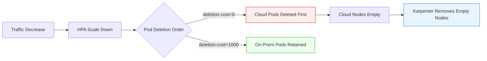

# Workload Placement 戦略

< [前へ: GPU Integration](./05-gpu-integration.md) | [目次](./README.md) | [次へ: Node Lifecycle Management](./07-node-lifecycle.md) >

> **サポート対象バージョン**: EKS 1.31+, Karpenter 1.0+
> **最終更新**: February 22, 2026

このドキュメントでは、hybrid nodes と cloud nodes にまたがって workloads を配置するための戦略について説明します。これには、node affinity、taints/tolerations、および Karpenter による cloud bursting が含まれます。

## Node Affinity と Taints/Tolerations

### Hybrid Node Taint 設定

```bash
# Add Taint to on-premises nodes
kubectl taint nodes hybrid-node-001 eks.amazonaws.com/compute-type=hybrid:NoSchedule

# Add additional Taint to GPU nodes
kubectl taint nodes hybrid-gpu-node-001 gpu=true:NoSchedule
```

### On-Premises 専用 Workload

```yaml
# on-prem-workload.yaml
apiVersion: apps/v1
kind: Deployment
metadata:
  name: data-processor
  namespace: analytics
spec:
  replicas: 3
  selector:
    matchLabels:
      app: data-processor
  template:
    metadata:
      labels:
        app: data-processor
    spec:
      affinity:
        nodeAffinity:
          requiredDuringSchedulingIgnoredDuringExecution:
            nodeSelectorTerms:
            - matchExpressions:
              - key: eks.amazonaws.com/compute-type
                operator: In
                values:
                - hybrid
      tolerations:
      - key: eks.amazonaws.com/compute-type
        operator: Equal
        value: hybrid
        effect: NoSchedule
      containers:
      - name: processor
        image: harbor.internal.company.io/analytics/data-processor:v2.1.0
        resources:
          requests:
            cpu: "2"
            memory: "4Gi"
          limits:
            cpu: "4"
            memory: "8Gi"
```

## GPU Workloads は On-Premises、CPU Workloads は Cloud のパターン

```yaml
# hybrid-deployment.yaml
apiVersion: apps/v1
kind: Deployment
metadata:
  name: ml-training
  namespace: ai-workloads
spec:
  replicas: 1
  selector:
    matchLabels:
      app: ml-training
  template:
    metadata:
      labels:
        app: ml-training
    spec:
      affinity:
        nodeAffinity:
          requiredDuringSchedulingIgnoredDuringExecution:
            nodeSelectorTerms:
            - matchExpressions:
              - key: eks.amazonaws.com/compute-type
                operator: In
                values:
                - hybrid
              - key: nvidia.com/gpu.present
                operator: In
                values:
                - "true"
      tolerations:
      - key: eks.amazonaws.com/compute-type
        operator: Equal
        value: hybrid
        effect: NoSchedule
      - key: gpu
        operator: Equal
        value: "true"
        effect: NoSchedule
      containers:
      - name: trainer
        image: harbor.internal.company.io/ai/model-trainer:v1.0.0
        resources:
          limits:
            nvidia.com/gpu: 4
          requests:
            cpu: "16"
            memory: "64Gi"
---
apiVersion: apps/v1
kind: Deployment
metadata:
  name: ml-inference-api
  namespace: ai-workloads
spec:
  replicas: 5
  selector:
    matchLabels:
      app: ml-inference-api
  template:
    metadata:
      labels:
        app: ml-inference-api
    spec:
      affinity:
        nodeAffinity:
          requiredDuringSchedulingIgnoredDuringExecution:
            nodeSelectorTerms:
            - matchExpressions:
              - key: eks.amazonaws.com/compute-type
                operator: DoesNotExist
      containers:
      - name: api
        image: 123456789012.dkr.ecr.ap-northeast-2.amazonaws.com/ai/inference-api:v1.0.0
        resources:
          requests:
            cpu: "2"
            memory: "4Gi"
          limits:
            cpu: "4"
            memory: "8Gi"
```

## Karpenter による Cloud Bursting

オンプレミスの容量を超えた場合に、自動的に AWS へスケールします。

### Karpenter NodePool 設定

```yaml
# karpenter-nodepool.yaml
apiVersion: karpenter.sh/v1
kind: NodePool
metadata:
  name: cloud-burst-pool
spec:
  template:
    metadata:
      labels:
        node-type: cloud-burst
        topology.kubernetes.io/zone: ap-northeast-2a
    spec:
      requirements:
      - key: kubernetes.io/arch
        operator: In
        values: ["amd64"]
      - key: karpenter.sh/capacity-type
        operator: In
        values: ["spot", "on-demand"]
      - key: node.kubernetes.io/instance-type
        operator: In
        values: ["m6i.xlarge", "m6i.2xlarge", "m6i.4xlarge"]
      nodeClassRef:
        group: karpenter.k8s.aws
        kind: EC2NodeClass
        name: default
  limits:
    cpu: 1000
    memory: 4000Gi
  disruption:
    consolidationPolicy: WhenEmpty
    consolidateAfter: 30s
---
apiVersion: karpenter.k8s.aws/v1
kind: EC2NodeClass
metadata:
  name: default
spec:
  amiFamily: AL2023
  subnetSelectorTerms:
  - tags:
      karpenter.sh/discovery: my-hybrid-cluster
  securityGroupSelectorTerms:
  - tags:
      karpenter.sh/discovery: my-hybrid-cluster
  role: KarpenterNodeRole-my-hybrid-cluster
```

### Topology-Aware Scheduling

```yaml
# topology-aware-deployment.yaml
apiVersion: apps/v1
kind: Deployment
metadata:
  name: latency-sensitive-app
spec:
  replicas: 10
  selector:
    matchLabels:
      app: latency-sensitive
  template:
    metadata:
      labels:
        app: latency-sensitive
    spec:
      topologySpreadConstraints:
      - maxSkew: 2
        topologyKey: topology.kubernetes.io/zone
        whenUnsatisfiable: ScheduleAnyway
        labelSelector:
          matchLabels:
            app: latency-sensitive
      affinity:
        nodeAffinity:
          preferredDuringSchedulingIgnoredDuringExecution:
          - weight: 100
            preference:
              matchExpressions:
              - key: eks.amazonaws.com/compute-type
                operator: In
                values:
                - hybrid
          - weight: 50
            preference:
              matchExpressions:
              - key: topology.kubernetes.io/zone
                operator: In
                values:
                - ap-northeast-2a
                - ap-northeast-2b
      containers:
      - name: app
        image: harbor.internal.company.io/apps/latency-app:v1.0.0
        resources:
          requests:
            cpu: "1"
            memory: "2Gi"
```

## Pod Deletion Cost による On-Premises 利用率の最大化

### Pod Deletion Cost が重要な理由

Cloud Bursting パターンでは、トラフィックが減少して workloads が scale down するとき、**どの pods を最初に削除するか**が重要です。オンプレミスの hardware は埋没費用であり最大限に活用すべき一方で、cloud pods には利用量に応じた料金が発生するため、最初に削除すべきです。

`controller.kubernetes.io/pod-deletion-cost` annotation は、scale-down 中にどの pods を最初に削除するかを ReplicaSet controller に伝えます。

| Annotation Value | Behavior |
|-----------------|----------|
| 低い値 (例: 0、デフォルト) | 最初に削除されます |
| 高い値 (例: 1000) | 最後に削除されます (保護されます) |

### 仕組み

```
Pod deletion order during scale-down:

Priority 1: Pods with low deletion-cost (cloud) → deleted first
Priority 2: Pods with high deletion-cost (on-prem) → retained

Example: replicas 10 → 4
  Cloud pods (cost=0)      : all 6 deleted
  On-premises pods (cost=1000): all 4 retained
```

### Mutating Webhook による自動割り当て

Pods の作成時に、node location に基づいて deletion-cost を自動的に割り当てる Mutating Webhook を設定します。

```yaml
# pod-deletion-cost-webhook.yaml
apiVersion: apps/v1
kind: Deployment
metadata:
  name: deletion-cost-webhook
  namespace: kube-system
spec:
  replicas: 2
  selector:
    matchLabels:
      app: deletion-cost-webhook
  template:
    metadata:
      labels:
        app: deletion-cost-webhook
    spec:
      serviceAccountName: deletion-cost-webhook
      containers:
      - name: webhook
        image: harbor.internal.company.io/platform/deletion-cost-webhook:v1.0.0
        ports:
        - containerPort: 8443
        env:
        - name: ON_PREM_COST
          value: "1000"
        - name: CLOUD_COST
          value: "0"
        - name: ON_PREM_LABEL_KEY
          value: "eks.amazonaws.com/compute-type"
        - name: ON_PREM_LABEL_VALUE
          value: "hybrid"
---
apiVersion: admissionregistration.k8s.io/v1
kind: MutatingWebhookConfiguration
metadata:
  name: pod-deletion-cost
webhooks:
- name: deletion-cost.hybrid.eks
  admissionReviewVersions: ["v1"]
  sideEffects: None
  clientConfig:
    service:
      name: deletion-cost-webhook
      namespace: kube-system
      path: /mutate
  rules:
  - apiGroups: [""]
    apiVersions: ["v1"]
    operations: ["CREATE"]
    resources: ["pods"]
  namespaceSelector:
    matchExpressions:
    - key: kubernetes.io/metadata.name
      operator: NotIn
      values: ["kube-system", "kube-node-lease"]
```

### 手動割り当て (シンプルなアプローチ)

Webhook を使用しない場合は、各 pod が実行されている node に基づいて deletion-cost を割り当てる CronJob を使用して、scheduling 後に pods に patch を適用できます。

```bash
#!/bin/bash
# patch-deletion-cost.sh
# Run as CronJob: assign high deletion-cost to pods on on-premises nodes

ON_PREM_NODES=$(kubectl get nodes -l eks.amazonaws.com/compute-type=hybrid \
  -o jsonpath='{.items[*].metadata.name}')

for NODE in $ON_PREM_NODES; do
  PODS=$(kubectl get pods --all-namespaces --field-selector spec.nodeName=$NODE \
    -o jsonpath='{range .items[*]}{.metadata.namespace}/{.metadata.name}{"\n"}{end}')

  for POD in $PODS; do
    NS=$(echo $POD | cut -d'/' -f1)
    NAME=$(echo $POD | cut -d'/' -f2)
    CURRENT=$(kubectl get pod $NAME -n $NS \
      -o jsonpath='{.metadata.annotations.controller\.kubernetes\.io/pod-deletion-cost}' 2>/dev/null)

    if [ "$CURRENT" != "1000" ]; then
      kubectl annotate pod $NAME -n $NS \
        controller.kubernetes.io/pod-deletion-cost="1000" --overwrite
    fi
  done
done
```

```yaml
# deletion-cost-cronjob.yaml
apiVersion: batch/v1
kind: CronJob
metadata:
  name: patch-deletion-cost
  namespace: kube-system
spec:
  schedule: "*/5 * * * *"
  jobTemplate:
    spec:
      template:
        spec:
          serviceAccountName: deletion-cost-patcher
          containers:
          - name: patcher
            image: bitnami/kubectl:latest
            command: ["/bin/bash", "/scripts/patch-deletion-cost.sh"]
            volumeMounts:
            - name: script
              mountPath: /scripts
          volumes:
          - name: script
            configMap:
              name: deletion-cost-script
          restartPolicy: OnFailure
```

### Karpenter との統合

Pod deletion cost は、Karpenter の consolidation policies と組み合わせることで効果的に機能します。

| Configuration | Role |
|--------------|------|
| `pod-deletion-cost` | ReplicaSet scale-down 中に cloud pod の削除を優先します |
| Karpenter `WhenEmpty` | 空の cloud nodes を自動的に削除します |
| Karpenter `WhenUnderutilized` | 利用率の低い cloud nodes を consolidation します |

```yaml
# Karpenter with deletion-cost integration example
apiVersion: karpenter.sh/v1
kind: NodePool
metadata:
  name: cloud-burst-pool
spec:
  disruption:
    consolidationPolicy: WhenUnderutilized  # Consolidate underutilized nodes
    consolidateAfter: 60s
  # ...remaining config from Karpenter NodePool Configuration above
```

エンドツーエンドの scale-down フロー:



---

< [前へ: GPU Integration](./05-gpu-integration.md) | [目次](./README.md) | [次へ: Node Lifecycle Management](./07-node-lifecycle.md) >
