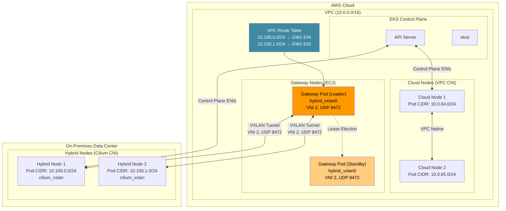
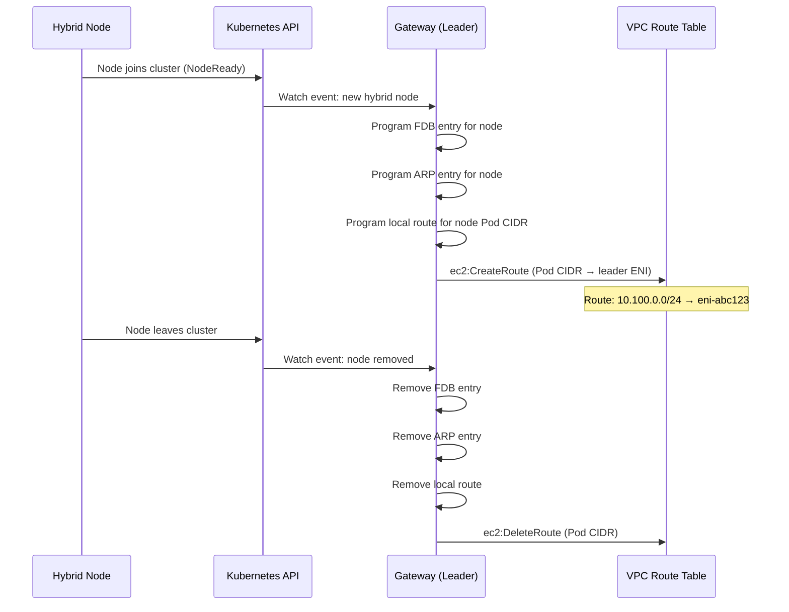
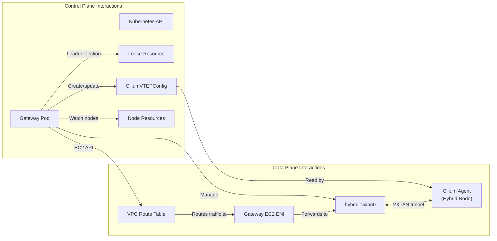
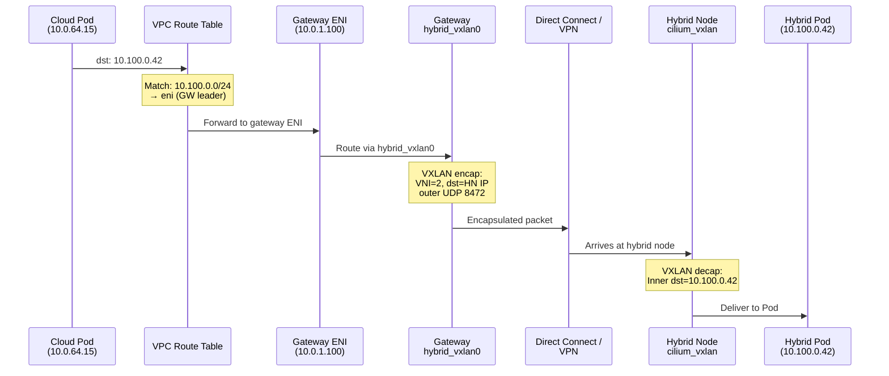
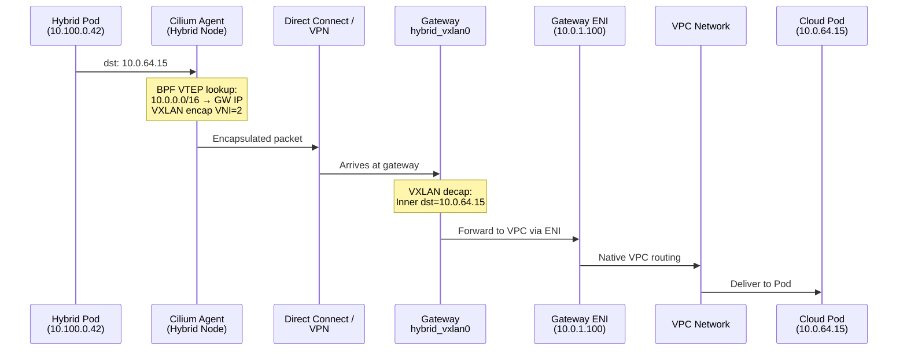
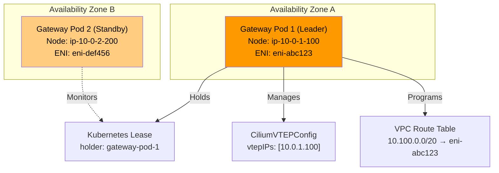
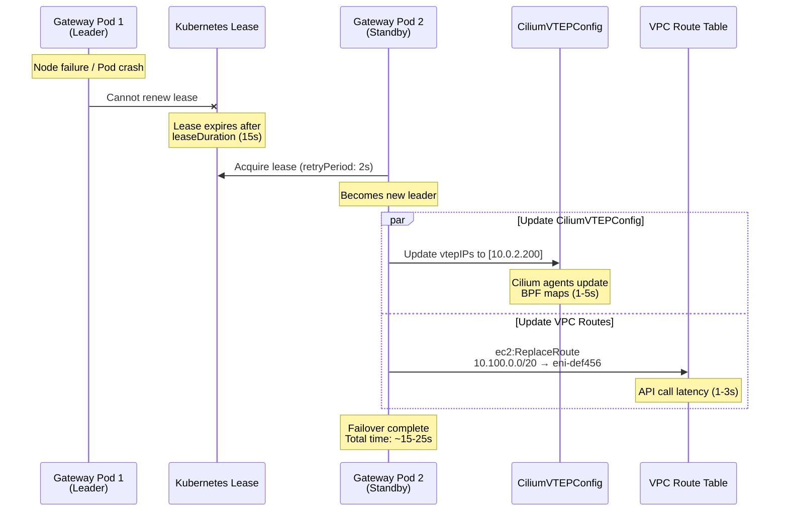

# EKS Hybrid Nodes Gateway

< [前へ: Bare Metal OS Setup](./09-bare-metal-os-setup.md) | [目次](./README.md) >

> **サポート対象バージョン**: EKS 1.31+
> **最終更新**: June 28, 2026

---

## 概要

EKS Hybrid Nodes Gateway は、Amazon VPC と、on-premises または edge environments の Hybrid Nodes 上で実行される Kubernetes Pods 間の接続を自動化する open-source の networking component です。2026 年 4 月 21 日に Generally Available として発表されたこの gateway は、cloud と on-premises workloads の間で双方向の Pod-level communication を有効にするために従来必要だった手動の route management、BGP configuration、または複雑な overlay networking setup を不要にします。

この gateway は、VPC 内の専用 EC2 gateway instances と、on-premises の Cilium-managed Hybrid Nodes の間に VXLAN tunnels を確立することで動作します。VPC route tables を自動的に program し、forwarding database (FDB) entries を管理し、Cilium VTEP (VXLAN Tunnel Endpoint) integration を設定するため、VPC 内の Pods は Hybrid Nodes 上の Pods と直接通信でき、その逆も可能です。手動作業は不要です。

**主な特徴:**

- **Open source**: [github.com/aws/eks-hybrid-nodes-gateway](https://github.com/aws/eks-hybrid-nodes-gateway) で完全に公開されています
- **追加料金なし**: Gateway software 自体は無料です。gateway を実行する EC2 instances の料金のみを支払います
- **Automated route management**: Hybrid Nodes が cluster に参加または離脱すると、VPC route tables が自動的に program されます
- **High availability**: failover のための lease-based leader election を備えた 2-replica Deployment をサポートします
- **Cilium integration**: Cilium の VTEP feature を活用し、VXLAN tunnel をまたいだ透過的な Pod-to-Pod routing を有効にします

### 学習目標

このドキュメントを完了すると、次のことができるようになります。

1. VXLAN tunneling、leader election、VPC route management を含む EKS Hybrid Nodes Gateway の **architecture を説明する**
2. IAM roles、security groups、Cilium VTEP integration を含め、Helm を使用して gateway を **deploy および configure する**
3. VPC Pods と Hybrid Node Pods の間の traffic flows を双方向に **trace する**
4. multi-replica gateway deployments による **high availability を実装し**、failover behavior を理解する
5. monitoring、scaling、一般的な failure scenarios を含め、gateway deployments を **operate および troubleshoot する**
6. Hybrid Nodes networking の approaches を **比較し**、gateway と manual routing のどちらを使用するかを判断する
7. production gateway deployments における security、performance、cost optimization の **best practices を適用する**

### 問題: Hybrid Environments における手動 Pod Routing

Gateway が利用可能になる前は、VPC と Hybrid Nodes 間の Pod-level communication を有効にするには大きな手作業が必要でした。

```
Before Gateway (Manual Approach):
=================================

1. Configure BGP peering between on-prem routers and VPC (or use static routes)
2. Manually manage VPC route table entries for every hybrid Pod CIDR
3. Set up and maintain VPN tunnels or Direct Connect with proper route propagation
4. Handle route updates when nodes join/leave the cluster
5. Troubleshoot routing asymmetries and MTU issues across multiple hops
6. Maintain custom scripts or controllers to keep routes in sync

After Gateway (Automated Approach):
====================================

1. Deploy gateway via Helm chart
2. Gateway automatically:
   - Creates VXLAN tunnels to hybrid nodes
   - Programs VPC route table entries
   - Configures Cilium VTEP for transparent routing
   - Handles failover via leader election
   - Updates routes as nodes come and go
```

Gateway は、複雑で、エラーが発生しやすく、複数 team にまたがる networking challenge を、少数の configuration values を指定する単一の Helm install に変換します。

---

## Architecture Deep Dive

### High-Level Architecture

EKS Hybrid Nodes Gateway は、VPC と on-premises network の境界に配置され、Pod traffic のための VXLAN-based bridge として機能します。次の図は全体の architecture を示しています。



### VXLAN Tunnel Mechanics

Gateway は VXLAN (Virtual Extensible LAN) を使用して、VPC と on-premises environments の間の Pod traffic を encapsulate します。Tunnel がどのように確立され、維持されるかを以下に示します。

#### Gateway-Side VXLAN Interface

Gateway pod が EC2 instance 上で起動すると、次の parameters を持つ `hybrid_vxlan0` network interface を作成します。

| Parameter | Value | Description |
|-----------|-------|-------------|
| **Interface name** | `hybrid_vxlan0` | Gateway 上の VXLAN tunnel interface |
| **VNI (VXLAN Network Identifier)** | 2 | CiliumVTEPConfig で設定された VNI と一致する必要があります |
| **UDP port** | 8472 | Standard Linux VXLAN port (IANA 4789 とは異なります) |
| **Local IP** | Gateway EC2 instance private IP | VXLAN encapsulated packets の source IP |
| **Learning** | Disabled | FDB entries は gateway によって statically programmed されます |

Gateway は、次と同等の netlink operations を使用してこの interface を作成します。

```bash
# Conceptual equivalent of what the gateway does programmatically
ip link add hybrid_vxlan0 type vxlan \
    id 2 \
    local <gateway-private-ip> \
    dstport 8472 \
    nolearning

ip link set hybrid_vxlan0 up
```

#### FDB、ARP、Route Programming

Cluster に参加する各 Hybrid Node について、gateway は 3 種類の entries を program します。

```
Per Hybrid Node, the gateway programs:
=======================================

1. FDB (Forwarding Database) Entry:
   bridge fdb append <hybrid-node-vxlan-mac> dev hybrid_vxlan0 dst <hybrid-node-ip>
   → Tells the VXLAN interface where to send encapsulated frames for this node

2. ARP Entry:
   ip neigh add <hybrid-node-vxlan-ip> lladdr <hybrid-node-vxlan-mac> dev hybrid_vxlan0
   → Pre-populates ARP so the gateway can immediately forward packets without ARP discovery

3. Route Entry:
   ip route add <hybrid-node-pod-cidr> via <hybrid-node-vxlan-ip> dev hybrid_vxlan0
   → Directs Pod traffic for this node's CIDR through the VXLAN tunnel
```

この static programming approach は、dynamic FDB learning とは異なり、決定的な forwarding behavior を保証し、VXLAN overlay 上での broadcast storms や unknown unicast flooding を回避します。

#### Hybrid Node-Side (Cilium VTEP)

Hybrid Node 側では、Cilium の VTEP (VXLAN Tunnel Endpoint) feature が tunnel termination を処理します。Gateway は `CiliumVTEPConfig` custom resource を介して自分自身を remote VTEP として登録します。これにより、各 Hybrid Node 上の Cilium agent に次のことが伝えられます。

1. VPC CIDRs 宛ての traffic は VXLAN-encapsulated されるべきである
2. Encapsulated traffic は gateway の IP address に送信されるべきである
3. VXLAN tunnel は UDP port 8472 上で VNI 2 を使用する

```yaml
# CiliumVTEPConfig created and managed by the gateway
apiVersion: cilium.io/v1alpha1
kind: CiliumVTEPConfig
metadata:
  name: cilium-vtep-config
spec:
  vtepEndpoints:
    - externalCIDR: "10.0.0.0/16"      # VPC CIDR
      virtualRouterMAC: "ee:ee:ee:ee:ee:ee"
      vtepIPs:
        - "<active-gateway-ec2-private-ip>"
```

Hybrid Node 上の Pod が VPC IP address (例: cloud-side Pod または AWS service endpoint) に traffic を送信すると、Cilium agent は次を実行します。
1. Destination を CiliumVTEPConfig の `externalCIDR` と照合する
2. Packet を VNI 2 で VXLAN-encapsulate する
3. Outer UDP packet を port 8472 の gateway IP に送信する
4. Gateway が decapsulate し、inner packet を VPC に forward する

### Leader Election と High Availability

Gateway は 2 replicas の Kubernetes Deployment として実行されます。任意の時点で 1 つの pod (leader) だけが networking resources を active に管理します。Standby pod は VXLAN tunnel を維持しますが、VPC routes は program しません。

#### Lease-Based Leader Election

Leader election は standard Kubernetes Lease resource を使用します。

```yaml
apiVersion: coordination.k8s.io/v1
kind: Lease
metadata:
  name: eks-hybrid-nodes-gateway
  namespace: eks-hybrid-nodes-gateway
spec:
  holderIdentity: "gateway-pod-abc123"
  leaseDurationSeconds: 15
  acquireTime: "2026-06-28T10:00:00Z"
  renewTime: "2026-06-28T10:00:10Z"
  leaseTransitions: 3
```

Leader election parameters は failover timing を制御します。

| Parameter | Default Value | Description |
|-----------|---------------|-------------|
| `leaseDuration` | 15s | Lease が有効な期間 |
| `renewDeadline` | 10s | Leader が renew するために持つ時間 |
| `retryPeriod` | 2s | Non-leaders が lease acquisition を retry する頻度 |

#### Leader が行うこと

Leader pod は次を担当します。

1. **VPC route table management**: 指定された VPC route tables に routes を作成および更新し、hybrid Pod CIDRs を leader の EC2 instance ENI に向けます
2. **CiliumVTEPConfig management**: CiliumVTEPConfig resource を作成および更新し、hybrid nodes の VTEP traffic を leader の EC2 instance IP に向けます
3. **FDB/ARP/route programming**: すべての hybrid nodes の entries を local VXLAN interface に program します
4. **Node watching**: Hybrid nodes の参加または離脱を Kubernetes Node objects で監視し、すべての routing entries を適宜更新します

#### Standby が行うこと

Standby pod は次を行います。

1. **VXLAN tunnel を維持**: `hybrid_vxlan0` interface を active に保ち、FDB/ARP/route entries で program します
2. **VPC routes は program しない**: Leader だけが VPC route tables を変更します
3. **CiliumVTEPConfig は update しない**: Leader だけが VTEP configuration を更新します
4. **Lease を監視**: Leader が失敗した場合に lease を取得できるよう、継続的に acquisition を試みます

### VPC Route Table Auto-Management

Gateway の最も価値の高い機能の 1 つは、automatic VPC route table management です。Leader pod は Hybrid Node events を監視し、それに応じて routes を program します。



Gateway は EC2 API を使用して routes を管理します。

| API Call | When Used | Purpose |
|----------|-----------|---------|
| `ec2:DescribeRouteTables` | Startup、periodic reconciliation | 現在の route table state を検出する |
| `ec2:CreateRoute` | New hybrid node joins | Gateway ENI を指す Pod CIDR route を追加する |
| `ec2:ReplaceRoute` | Leader failover | 既存 routes を new leader の ENI に向けるよう更新する |
| `ec2:DeleteRoute` | Hybrid node leaves | Stale Pod CIDR routes を削除する |
| `ec2:DescribeInstances` | Startup、failover | Gateway EC2 instance ENI IDs を検出する |

### Component Interaction Summary

次の図は、すべての components がどのように interact するかを示しています。



---

## 前提条件

EKS Hybrid Nodes Gateway を deploy する前に、次のすべての prerequisites が満たされていることを確認してください。

### EKS Cluster Configuration

| Requirement | Details |
|-------------|---------|
| **EKS version** | 1.31 以降 |
| **Hybrid Nodes** | 少なくとも 1 つの Hybrid Node が configure され、cluster に参加していること |
| **Authentication mode** | `API` または `API_AND_CONFIG_MAP` |
| **Endpoint access** | Public only または Private only (`Public and Private` ではない) |
| **Remote Pod Network** | Cluster 内で hybrid nodes 用の Pod CIDRs が configure されていること |

### CNI Requirements

Gateway には特定の CNI configuration が必要です。

| Location | CNI | Version | VTEP Support |
|----------|-----|---------|--------------|
| **Cloud nodes** | Amazon VPC CNI | 1.18+ | 不要 |
| **Hybrid nodes** | Cilium (EKS distribution) | 1.16.x (EKS) | 必須 (VTEP must be enabled) |

> **重要**: Gateway は hybrid nodes 上の Cilium でのみ動作します。Calico は VTEP feature をサポートしていないため、gateway approach ではサポートされません。Hybrid nodes で Calico を使用している場合は、代わりに manual routing approaches (BGP、static routes) を使用する必要があります。

### Network Connectivity

VPC と on-premises environment の間の private connectivity は、すでに確立されている必要があります。

| Connectivity Type | When to Use | Notes |
|-------------------|-------------|-------|
| **AWS Direct Connect** | 一貫した low latency が必要な production workloads | Dedicated physical connection。最も信頼性が高い |
| **AWS Site-to-Site VPN** | Standard hybrid connectivity | Public internet 上の IPsec tunnels。Tunnel あたり最大 1.25 Gbps |
| **Transit Gateway + VPN** | Multi-VPC environments | Centralized VPN termination。高 throughput のため ECMP をサポート |
| **Custom VPN (e.g., WireGuard)** | Specialized requirements | Self-managed tunnel。AWS VPN limitations が懸念される場合に有用 |

> **注記**: Gateway は VPC と on-premises の間の base connectivity を確立しません。既存の connectivity の上に、Pod-level routing 用の VXLAN overlay を追加します。

### EC2 Gateway Instances

Gateway pods を実行するために、VPC 内に少なくとも 2 つの EC2 instances が必要です。

```yaml
# Recommended EC2 instance configuration for gateway nodes
Instance type: c6i.large (2 vCPU, 4 GiB RAM) or larger
AMI: Amazon Linux 2023 (EKS optimized)
Placement: Spread across at least 2 Availability Zones
EBS: 20 GiB gp3 (minimal storage needed)
```

Gateway instances は次を満たす必要があります。
1. EKS cluster の Kubernetes nodes として登録されていること (VPC CNI を使用する standard cloud nodes)
2. 適切な IAM instance profile があること ([IAM Configuration](#iam-configuration) を参照)
3. Gateway pod scheduling 用に label されていること ([Installation](#installation-and-configuration) を参照)

### Security Group Configuration

Gateway EC2 instances には、VXLAN traffic 用の特定の security group rules が必要です。

```
Inbound Rules (Gateway Security Group):
========================================
| Protocol | Port  | Source                    | Purpose                    |
|----------|-------|---------------------------|----------------------------|
| UDP      | 8472  | On-premises CIDR(s)       | VXLAN tunnel from hybrid   |
|          |       |                           | nodes to gateway           |
| TCP      | 443   | VPC CIDR                  | Kubernetes API (kubelet)   |
| TCP      | 10250 | Control plane SG / VPC    | kubelet API                |

Outbound Rules (Gateway Security Group):
=========================================
| Protocol | Port  | Destination               | Purpose                    |
|----------|-------|---------------------------|----------------------------|
| UDP      | 8472  | On-premises node IPs      | VXLAN tunnel from gateway  |
|          |       |                           | to hybrid nodes            |
| TCP      | 443   | 0.0.0.0/0 or VPC endpoints| EKS API, EC2 API calls     |
| All      | All   | VPC CIDR                  | Forwarded pod traffic      |
```

#### Terraform Security Group Example

```hcl
resource "aws_security_group" "gateway" {
  name_prefix = "eks-hybrid-gateway-"
  vpc_id      = var.vpc_id

  # Inbound: VXLAN from on-premises hybrid nodes
  ingress {
    description = "VXLAN tunnel from hybrid nodes"
    from_port   = 8472
    to_port     = 8472
    protocol    = "udp"
    cidr_blocks = var.on_premises_cidrs  # e.g., ["192.168.0.0/16"]
  }

  # Inbound: kubelet API from control plane
  ingress {
    description     = "kubelet API"
    from_port       = 10250
    to_port         = 10250
    protocol        = "tcp"
    security_groups = [var.cluster_security_group_id]
  }

  # Outbound: VXLAN to on-premises hybrid nodes
  egress {
    description = "VXLAN tunnel to hybrid nodes"
    from_port   = 8472
    to_port     = 8472
    protocol    = "udp"
    cidr_blocks = var.on_premises_cidrs
  }

  # Outbound: API calls and forwarded traffic
  egress {
    description = "General outbound"
    from_port   = 0
    to_port     = 0
    protocol    = "-1"
    cidr_blocks = ["0.0.0.0/0"]
  }

  tags = {
    Name = "eks-hybrid-nodes-gateway"
  }
}
```

### On-Premises Firewall Configuration

On-premises firewall は、hybrid nodes と gateway の間の VXLAN traffic を許可する必要があります。

```
On-Premises Firewall Rules:
============================
| Direction | Protocol | Port  | Source/Destination        | Purpose              |
|-----------|----------|-------|---------------------------|----------------------|
| Inbound   | UDP      | 8472  | Gateway EC2 private IPs   | VXLAN from gateway   |
| Outbound  | UDP      | 8472  | Gateway EC2 private IPs   | VXLAN to gateway     |
```

> **ヒント**: Firewall rules では、gateway EC2 instance Elastic IPs または private IPs (Direct Connect/VPN 経由でアクセス可能) を使用してください。HA のために複数の gateway instances を使用する場合は、すべての gateway IPs を含めます。

### MTU Considerations

VXLAN encapsulation は各 packet に 50-byte overhead を追加します。Network path MTU がこれを考慮していることを確認してください。

| Component | Recommended MTU | Notes |
|-----------|----------------|-------|
| Gateway EC2 instance | 9001 (jumbo frames) | VPC 内のほとんどの EC2 instance types の default |
| On-premises hybrid nodes | 1500 以上 | Network infrastructure に依存します |
| VXLAN interface (effective) | Path MTU - 50 | 例: path MTU が 1500 の場合は 1450 |
| Direct Connect | 9001 (jumbo frames) | DX connection でサポートされる場合 |
| VPN tunnel | 1399-1500 | VPN configuration により異なります |

VPC と on-premises の間の network path が standard 1500 MTU を使用する場合:

```
Effective Pod MTU calculation:
Physical MTU:        1500 bytes
VXLAN overhead:      - 50 bytes (outer IP + outer UDP + VXLAN header)
VPN overhead (IPsec): - 57-73 bytes (if applicable)
Effective Pod MTU:   ~1377-1450 bytes
```

Hybrid nodes 上の Cilium は、適切な MTU で configure できます。

```yaml
# Cilium Helm values for hybrid nodes
mtu: 1400  # Conservative value accounting for VXLAN + potential VPN overhead
```

---

## IAM Configuration

Gateway pods は EC2 instances 上で実行され、VPC route tables を管理し EC2 instances を describe する permissions が必要です。これらの permissions は、gateway EC2 instances の instance profile に attached された IAM role を通じて付与されます。

### Required IAM Permissions

Gateway には次の最小 IAM permissions が必要です。

```json
{
  "Version": "2012-10-17",
  "Statement": [
    {
      "Sid": "HybridNodesGatewayRouteManagement",
      "Effect": "Allow",
      "Action": [
        "ec2:DescribeRouteTables",
        "ec2:CreateRoute",
        "ec2:ReplaceRoute",
        "ec2:DeleteRoute"
      ],
      "Resource": "*",
      "Condition": {
        "StringEquals": {
          "aws:RequestedRegion": "${var.region}"
        }
      }
    },
    {
      "Sid": "HybridNodesGatewayInstanceDiscovery",
      "Effect": "Allow",
      "Action": [
        "ec2:DescribeInstances"
      ],
      "Resource": "*",
      "Condition": {
        "StringEquals": {
          "aws:RequestedRegion": "${var.region}"
        }
      }
    }
  ]
}
```

> **Security Note**: `ec2:CreateRoute`、`ec2:ReplaceRoute`、`ec2:DeleteRoute` actions は、すべての場合に `Resource` field を介して特定の route table ARNs に scope できるわけではありません。Scope をできるだけ制限するために `Condition` keys を使用してください。

### Scoped IAM Policy (Production に推奨)

Production environments では、conditions を使用して route table permissions を特定の route table IDs に scope します。

```json
{
  "Version": "2012-10-17",
  "Statement": [
    {
      "Sid": "HybridNodesGatewayRouteManagement",
      "Effect": "Allow",
      "Action": [
        "ec2:CreateRoute",
        "ec2:ReplaceRoute",
        "ec2:DeleteRoute"
      ],
      "Resource": [
        "arn:aws:ec2:us-west-2:111122223333:route-table/rtb-0abc1234def56789a",
        "arn:aws:ec2:us-west-2:111122223333:route-table/rtb-0abc1234def56789b"
      ]
    },
    {
      "Sid": "HybridNodesGatewayDescribe",
      "Effect": "Allow",
      "Action": [
        "ec2:DescribeRouteTables",
        "ec2:DescribeInstances"
      ],
      "Resource": "*"
    }
  ]
}
```

### Terraform IAM Configuration

```hcl
# IAM Role for Gateway EC2 Instances
resource "aws_iam_role" "gateway" {
  name = "eks-hybrid-nodes-gateway-${var.cluster_name}"

  assume_role_policy = jsonencode({
    Version = "2012-10-17"
    Statement = [
      {
        Action = "sts:AssumeRole"
        Effect = "Allow"
        Principal = {
          Service = "ec2.amazonaws.com"
        }
      }
    ]
  })
}

# Gateway-specific policy
resource "aws_iam_role_policy" "gateway_route_management" {
  name = "route-management"
  role = aws_iam_role.gateway.id

  policy = jsonencode({
    Version = "2012-10-17"
    Statement = [
      {
        Sid    = "RouteManagement"
        Effect = "Allow"
        Action = [
          "ec2:CreateRoute",
          "ec2:ReplaceRoute",
          "ec2:DeleteRoute"
        ]
        Resource = [
          for rtb_id in var.route_table_ids :
          "arn:aws:ec2:${var.region}:${data.aws_caller_identity.current.account_id}:route-table/${rtb_id}"
        ]
      },
      {
        Sid    = "Describe"
        Effect = "Allow"
        Action = [
          "ec2:DescribeRouteTables",
          "ec2:DescribeInstances"
        ]
        Resource = "*"
      }
    ]
  })
}

# Attach EKS worker node policy (needed for kubelet)
resource "aws_iam_role_policy_attachment" "gateway_eks_worker" {
  policy_arn = "arn:aws:iam::aws:policy/AmazonEKSWorkerNodePolicy"
  role       = aws_iam_role.gateway.name
}

resource "aws_iam_role_policy_attachment" "gateway_ecr_read" {
  policy_arn = "arn:aws:iam::aws:policy/AmazonEC2ContainerRegistryReadOnly"
  role       = aws_iam_role.gateway.name
}

resource "aws_iam_role_policy_attachment" "gateway_cni" {
  policy_arn = "arn:aws:iam::aws:policy/AmazonEKS_CNI_Policy"
  role       = aws_iam_role.gateway.name
}

# Instance profile
resource "aws_iam_instance_profile" "gateway" {
  name = "eks-hybrid-nodes-gateway-${var.cluster_name}"
  role = aws_iam_role.gateway.name
}
```

### AWS CLI IAM Setup

AWS CLI を使用して IAM resources を作成したい場合:

```bash
# Create the IAM role
aws iam create-role \
  --role-name eks-hybrid-nodes-gateway \
  --assume-role-policy-document '{
    "Version": "2012-10-17",
    "Statement": [
      {
        "Effect": "Allow",
        "Principal": {"Service": "ec2.amazonaws.com"},
        "Action": "sts:AssumeRole"
      }
    ]
  }'

# Create and attach the route management policy
cat > /tmp/gateway-policy.json << 'EOF'
{
  "Version": "2012-10-17",
  "Statement": [
    {
      "Sid": "RouteManagement",
      "Effect": "Allow",
      "Action": [
        "ec2:DescribeRouteTables",
        "ec2:CreateRoute",
        "ec2:ReplaceRoute",
        "ec2:DeleteRoute",
        "ec2:DescribeInstances"
      ],
      "Resource": "*"
    }
  ]
}
EOF

aws iam put-role-policy \
  --role-name eks-hybrid-nodes-gateway \
  --policy-name route-management \
  --policy-document file:///tmp/gateway-policy.json

# Attach EKS worker node policies
aws iam attach-role-policy \
  --role-name eks-hybrid-nodes-gateway \
  --policy-arn arn:aws:iam::aws:policy/AmazonEKSWorkerNodePolicy

aws iam attach-role-policy \
  --role-name eks-hybrid-nodes-gateway \
  --policy-arn arn:aws:iam::aws:policy/AmazonEC2ContainerRegistryReadOnly

aws iam attach-role-policy \
  --role-name eks-hybrid-nodes-gateway \
  --policy-arn arn:aws:iam::aws:policy/AmazonEKS_CNI_Policy

# Create instance profile
aws iam create-instance-profile \
  --instance-profile-name eks-hybrid-nodes-gateway

aws iam add-role-to-instance-profile \
  --instance-profile-name eks-hybrid-nodes-gateway \
  --role-name eks-hybrid-nodes-gateway
```

---

## Installation and Configuration

### Step 1: Gateway Nodes に Label を付ける

Gateway を install する前に、gateway pods を host する EC2 instances に label を付けます。これらの nodes は、VPC CNI を実行する VPC 内の standard cloud nodes である必要があります。

```bash
# Label two nodes across different AZs for high availability
kubectl label node ip-10-0-1-100.us-west-2.compute.internal \
  node-role.kubernetes.io/gateway=true

kubectl label node ip-10-0-2-200.us-west-2.compute.internal \
  node-role.kubernetes.io/gateway=true

# Verify labels
kubectl get nodes -l node-role.kubernetes.io/gateway=true
```

Expected output:

```
NAME                                        STATUS   ROLES    AGE   VERSION
ip-10-0-1-100.us-west-2.compute.internal   Ready    <none>   10d   v1.31.2-eks-abcdef0
ip-10-0-2-200.us-west-2.compute.internal   Ready    <none>   10d   v1.31.2-eks-abcdef0
```

### Step 2: Configuration Values を収集する

Helm chart を install する前に、必要な values を収集します。

```bash
# Get your VPC CIDR
VPC_CIDR=$(aws ec2 describe-vpcs \
  --vpc-ids $VPC_ID \
  --query 'Vpcs[0].CidrBlock' \
  --output text)
echo "VPC CIDR: $VPC_CIDR"

# Get route table IDs (all route tables that need hybrid Pod routes)
ROUTE_TABLE_IDS=$(aws ec2 describe-route-tables \
  --filters "Name=vpc-id,Values=$VPC_ID" \
  --query 'RouteTables[*].RouteTableId' \
  --output text)
echo "Route Table IDs: $ROUTE_TABLE_IDS"

# Get the hybrid Pod CIDRs from your EKS cluster configuration
POD_CIDRS=$(aws eks describe-cluster \
  --name $CLUSTER_NAME \
  --query 'cluster.kubernetesNetworkConfig.remoteNetworkConfig.remotePodNetworks[*].cidrs[*]' \
  --output text)
echo "Hybrid Pod CIDRs: $POD_CIDRS"
```

### Step 3: Helm で Install する

Amazon ECR Public の OCI Helm chart を使用して gateway を install します。

```bash
helm install eks-hybrid-nodes-gateway \
  oci://public.ecr.aws/eks/eks-hybrid-nodes-gateway \
  --version 1.0.0 \
  --namespace eks-hybrid-nodes-gateway \
  --create-namespace \
  --set vpcCIDR=10.0.0.0/16 \
  --set "podCIDRs={10.100.0.0/20}" \
  --set "routeTableIDs={rtb-0abc1234def56789a,rtb-0abc1234def56789b}" \
  --set nodeSelector."node-role\.kubernetes\.io/gateway"=true
```

### Full Helm Values Reference

Production deployments では、専用の `values.yaml` file を使用します。

```yaml
# values.yaml - EKS Hybrid Nodes Gateway configuration

# --- Required settings ---

# VPC CIDR block. The gateway programs CiliumVTEPConfig with this
# so hybrid nodes know which traffic to route through the VXLAN tunnel.
vpcCIDR: "10.0.0.0/16"

# Pod CIDRs used by hybrid nodes. The gateway creates VPC route table
# entries for these CIDRs pointing to the active gateway's ENI.
podCIDRs:
  - "10.100.0.0/20"

# VPC route table IDs to manage. The gateway will create/update/delete
# routes in these tables. Include all route tables used by subnets
# that need to reach hybrid node Pods.
routeTableIDs:
  - "rtb-0abc1234def56789a"   # Private subnet route table AZ-a
  - "rtb-0abc1234def56789b"   # Private subnet route table AZ-b

# --- Deployment settings ---

# Number of replicas. 2 is recommended for high availability.
# Only the leader actively manages routes; standby is ready for failover.
replicaCount: 2

# Node selector to place gateway pods on labeled EC2 instances.
nodeSelector:
  node-role.kubernetes.io/gateway: "true"

# Topology spread to distribute gateway pods across AZs.
topologySpreadConstraints:
  - maxSkew: 1
    topologyKey: topology.kubernetes.io/zone
    whenUnsatisfiable: DoNotSchedule
    labelSelector:
      matchLabels:
        app.kubernetes.io/name: eks-hybrid-nodes-gateway

# Pod anti-affinity to ensure gateway pods run on different nodes.
affinity:
  podAntiAffinity:
    requiredDuringSchedulingIgnoredDuringExecution:
      - labelSelector:
          matchExpressions:
            - key: app.kubernetes.io/name
              operator: In
              values:
                - eks-hybrid-nodes-gateway
        topologyKey: kubernetes.io/hostname

# --- Resource configuration ---

resources:
  requests:
    cpu: 100m
    memory: 128Mi
  limits:
    cpu: 500m
    memory: 256Mi

# --- VXLAN settings (advanced, usually no need to change) ---

# VXLAN Network Identifier. Must match the VNI in CiliumVTEPConfig.
vxlanVNI: 2

# VXLAN destination port. Must match Cilium's tunnel port.
vxlanPort: 8472

# --- Leader election settings (advanced) ---

leaderElection:
  leaseDuration: 15s
  renewDeadline: 10s
  retryPeriod: 2s

# --- Logging ---

logLevel: info   # debug, info, warn, error

# --- Service account ---

serviceAccount:
  create: true
  name: eks-hybrid-nodes-gateway
  annotations: {}
```

Values file を使用して install します。

```bash
helm install eks-hybrid-nodes-gateway \
  oci://public.ecr.aws/eks/eks-hybrid-nodes-gateway \
  --version 1.0.0 \
  --namespace eks-hybrid-nodes-gateway \
  --create-namespace \
  -f values.yaml
```

### Step 4: Installation を Verify する

Installation 後、すべての components が正しく実行されていることを verify します。

```bash
# 1. Check gateway pods are running
kubectl get pods -n eks-hybrid-nodes-gateway -o wide
```

Expected output:

```
NAME                                          READY   STATUS    RESTARTS   AGE   IP           NODE
eks-hybrid-nodes-gateway-7b8f9c4d5-abc12     1/1     Running   0          2m    10.0.1.55    ip-10-0-1-100.us-west-2.compute.internal
eks-hybrid-nodes-gateway-7b8f9c4d5-def34     1/1     Running   0          2m    10.0.2.88    ip-10-0-2-200.us-west-2.compute.internal
```

```bash
# 2. Verify leader election - check which pod holds the lease
kubectl get lease -n eks-hybrid-nodes-gateway
```

Expected output:

```
NAME                        HOLDER                                     AGE
eks-hybrid-nodes-gateway    eks-hybrid-nodes-gateway-7b8f9c4d5-abc12   2m
```

```bash
# 3. Check the CiliumVTEPConfig was created
kubectl get ciliumvtepconfig
```

Expected output:

```
NAME                  AGE
cilium-vtep-config    2m
```

```bash
# 4. Verify CiliumVTEPConfig contents
kubectl get ciliumvtepconfig cilium-vtep-config -o yaml
```

Expected output:

```yaml
apiVersion: cilium.io/v1alpha1
kind: CiliumVTEPConfig
metadata:
  name: cilium-vtep-config
spec:
  vtepEndpoints:
    - externalCIDR: "10.0.0.0/16"
      virtualRouterMAC: "ee:ee:ee:ee:ee:ee"
      vtepIPs:
        - "10.0.1.100"    # Leader gateway EC2 instance IP
```

```bash
# 5. Verify VPC route table entries
aws ec2 describe-route-tables \
  --route-table-ids rtb-0abc1234def56789a \
  --query 'RouteTables[0].Routes[?DestinationCidrBlock==`10.100.0.0/20`]'
```

Expected output:

```json
[
  {
    "DestinationCidrBlock": "10.100.0.0/20",
    "InstanceId": "i-0abc123def456789a",
    "InstanceOwnerId": "111122223333",
    "NetworkInterfaceId": "eni-0abc123def456789a",
    "Origin": "CreateRoute",
    "State": "active"
  }
]
```

```bash
# 6. Check gateway logs for any errors
kubectl logs -n eks-hybrid-nodes-gateway -l app.kubernetes.io/name=eks-hybrid-nodes-gateway --tail=50
```

```bash
# 7. Test Pod connectivity from a cloud Pod to a hybrid Pod
kubectl run test-connectivity --image=busybox --rm -it --restart=Never -- \
  wget -qO- --timeout=5 http://<hybrid-pod-ip>:<port>
```

---

## CNI Configuration

### Hybrid Nodes 上の Cilium VTEP Configuration

Gateway は `CiliumVTEPConfig` resource を自動的に管理しますが、hybrid nodes 上の Cilium installation では VTEP support が有効になっている必要があります。EKS Cilium add-on または Helm を介して hybrid nodes に Cilium を install する場合は、次の values が設定されていることを確認してください。

```yaml
# Cilium Helm values for hybrid nodes (VTEP-related settings)
vtep:
  enabled: true     # Enable VXLAN Tunnel Endpoint feature
  # The gateway will create the CiliumVTEPConfig resource;
  # Cilium just needs VTEP enabled to process it.

tunnel: vxlan       # Cilium must use VXLAN tunnel mode
tunnelPort: 8472    # Must match the gateway's vxlanPort

ipam:
  mode: cluster-pool
  operator:
    clusterPoolIPv4PodCIDRList:
      - "10.100.0.0/20"    # Hybrid pod CIDR

# MTU configuration accounting for VXLAN overhead
mtu: 1400

# Enable BPF masquerade for outbound traffic
bpf:
  masquerade: true

# Node-to-node encryption (optional but recommended)
encryption:
  enabled: false     # Set to true for WireGuard encryption on the tunnel
  type: wireguard
```

#### Hybrid Nodes 上の Cilium VTEP を Verify する

Gateway が `CiliumVTEPConfig` を作成した後、hybrid nodes 上の Cilium agents がそれを処理したことを verify します。

```bash
# SSH to a hybrid node or use kubectl exec on a Cilium agent pod
kubectl exec -n kube-system ds/cilium -- cilium bpf vtep list
```

Expected output:

```
VTEP CIDR            VTEP IP        VTEP MAC              VTEP TUNNEL ID
10.0.0.0/16          10.0.1.100     ee:ee:ee:ee:ee:ee     2
```

これは、Cilium agent が VPC-bound traffic を VXLAN tunnel 経由で `10.0.1.100` の gateway に forward することを認識していることを確認します。

### Cloud Nodes 上の VPC CNI Configuration

Cloud nodes は standard Amazon VPC CNI を使用します。Gateway 用の特別な configuration は不要です。Cloud nodes 上の Pods は VPC subnet から IPs を受け取り、hybrid Pod CIDRs への traffic は gateway が管理する VPC route table entries 経由で routed されます。

Default VPC CNI configuration で動作します。

```yaml
# VPC CNI (aws-node) - standard configuration
# No changes needed for gateway integration
env:
  - name: AWS_VPC_K8S_CNI_CUSTOM_NETWORK_CFG
    value: "false"
  - name: ENABLE_PREFIX_DELEGATION
    value: "true"    # Recommended for IP efficiency
  - name: WARM_PREFIX_TARGET
    value: "1"
```

### CiliumVTEPConfig CRD Details

`CiliumVTEPConfig` は、external VXLAN tunnel endpoints について Cilium agents に伝える cluster-scoped custom resource です。Gateway は、この resource の単一 instance を作成および維持します。

```yaml
apiVersion: cilium.io/v1alpha1
kind: CiliumVTEPConfig
metadata:
  name: cilium-vtep-config
spec:
  # List of VTEP endpoints that Cilium should forward traffic to
  vtepEndpoints:
    - # The CIDR range accessible through this VTEP
      # Set to the VPC CIDR so all VPC traffic goes through the tunnel
      externalCIDR: "10.0.0.0/16"

      # Virtual MAC address used in the VXLAN inner Ethernet header
      # This is a well-known dummy MAC; actual forwarding is IP-based
      virtualRouterMAC: "ee:ee:ee:ee:ee:ee"

      # IP addresses of the VTEP endpoints (gateway EC2 instance IPs)
      # Only the active leader's IP is listed
      vtepIPs:
        - "10.0.1.100"
```

**主な behaviors:**

- **Single instance**: Cluster 内に存在できる `CiliumVTEPConfig` resource は 1 つだけです。Gateway がそれを排他的に管理します。
- **Leader updates**: Failover 中、新しい leader は `vtepIPs` を自身の EC2 instance IP に更新します。
- **Cilium reload**: `CiliumVTEPConfig` が変更されると、Cilium agents は BPF maps を更新して新しい VTEP endpoint を反映します。通常、これには 1-5 秒かかります。

---

## Traffic Flow Patterns

Gateway を通る traffic flows を理解することは、troubleshooting と capacity planning に不可欠です。この section では、主要な communication pattern ごとに packets が system をどのように通過するかを trace します。

### Pattern 1: VPC Pod から Hybrid Pod

これは最も一般的な pattern です。VPC 内の cloud node 上で実行されている Pod が、on-premises の hybrid node 上で実行されている Pod と通信する必要があります。



**Step-by-step packet flow:**

1. Cloud Pod (`10.0.64.15`) が Hybrid Pod (`10.100.0.42`) に packet を送信します
2. Packet は VPC network に入り、VPC route table が `10.100.0.0/24 -> gateway ENI` に一致します
3. Packet は gateway EC2 instance の primary ENI に到着します
4. Gateway の Linux routing table が route に一致します: `10.100.0.0/24 via <hybrid-node-vxlan-ip> dev hybrid_vxlan0`
5. Gateway は packet を VXLAN-encapsulate します (outer src: gateway IP、outer dst: hybrid node IP、VNI: 2、outer UDP dst: 8472)
6. Encapsulated packet は Direct Connect / VPN を通って on-premises network に到達します
7. Hybrid node の Cilium agent が port 8472 で UDP packet を受信します
8. Cilium が VXLAN packet を decapsulate し、inner packet を destination Pod に配信します

### Pattern 2: Hybrid Pod から VPC Pod

Hybrid node 上の Pod が VPC 内の Pod (または任意の IP) に到達する必要がある場合です。



**Step-by-step packet flow:**

1. Hybrid Pod (`10.100.0.42`) が Cloud Pod (`10.0.64.15`) に packet を送信します
2. Hybrid node 上の Cilium agent が BPF lookup を実行し、`10.0.64.15` が VTEP `externalCIDR` の `10.0.0.0/16` に一致することを見つけます
3. Cilium は packet を VXLAN-encapsulate します (outer dst: gateway IP `10.0.1.100`、VNI: 2、outer UDP dst: 8472)
4. Encapsulated packet は Direct Connect / VPN を通って VPC に到達します
5. Gateway の EC2 instance が port 8472 で UDP packet を受信します
6. Gateway は VXLAN packet を decapsulate し、inner packet (dst: `10.0.64.15`) を取り出します
7. Inner packet は gateway EC2 instance の ENI を通って VPC に forward されます
8. Standard VPC routing が packet を cloud Pod に配信します

> **重要**: この return path が動作するには、gateway EC2 instance の ENI で **source/destination check disabled** になっている必要があります。Gateway は自身のものではない source IPs (hybrid Pod の IP) を持つ packets を forward します。この check を無効にしてください。
>
> ```bash
> aws ec2 modify-instance-attribute \
>   --instance-id i-0abc123def456789a \
>   --no-source-dest-check
> ```

### Pattern 3: Control Plane から Hybrid Node 上の Webhook

Mutating または validating webhook が hybrid node 上で実行されている場合、EKS control plane はそれに到達する必要があります。

```
Traffic flow: Control Plane → Webhook on Hybrid Node
======================================================

1. Control plane receives an API request that triggers a webhook
2. Control plane sends HTTPS request to webhook service ClusterIP
3. kube-proxy / iptables on the control plane ENI node routes to the Pod IP
4. If the Pod is on a hybrid node:
   a. Packet enters VPC routing
   b. VPC route table matches hybrid Pod CIDR → gateway ENI
   c. Gateway VXLAN-encapsulates and forwards to hybrid node
   d. Cilium decapsulates and delivers to webhook Pod
5. Webhook response follows reverse path (Pattern 2)
```

これは、gateway が hybrid Pod IPs を VPC 内から routable にし、control plane ENIs が VPC 内にあるため動作します。

### Pattern 4: AWS Services から Hybrid Pods

ALB、NLB、Amazon Managed Prometheus、CloudWatch などの AWS services は、gateway を通じて hybrid Pods に到達できます。

```
AWS Service → Hybrid Pod routing:
==================================

ALB/NLB (IP target type):
  ALB → Target IP (hybrid Pod) → VPC route table → Gateway → VXLAN → Hybrid Node → Pod

Amazon Managed Prometheus (remote write):
  Not applicable (Prometheus scrapes targets, doesn't receive connections)

Amazon Managed Prometheus (scrape):
  AMP agent on hybrid node pushes metrics; no inbound from AMP needed

CloudWatch Agent:
  Agent runs on hybrid node, pushes to CloudWatch endpoint via Direct Connect/VPN
  No inbound to hybrid pods needed

AWS PrivateLink Services:
  Service → VPC Endpoint → VPC routing → Gateway → VXLAN → Hybrid Pod
```

> **Load Balancer Note**: Hybrid Pods を指す IP target type で ALB または NLB を使用する場合、load balancer は gateway-managed routes を含む route table を持つ subnet に存在する必要があります。ALB/NLB subnets の route tables が gateway の `routeTableIDs` configuration に listed されていることを確認してください。

### Pattern 5: Comparison --- With vs Without Gateway

Gateway なしで同じ Pod-level reachability を実現するには、manual networking が必要です。

```
WITHOUT Gateway:
================

VPC Pod → Hybrid Pod:
  1. Configure BGP peering between on-prem router and VPC (via TGW or VGW)
  2. Advertise hybrid Pod CIDRs via BGP from on-prem
  3. Or: manually add static routes in VPC route tables
  4. Traffic flows: VPC → Direct Connect/VPN → on-prem router → Hybrid Node
  5. Requires on-prem router to know individual Pod CIDRs per node
  6. No VXLAN — traffic is routed natively (potentially better performance)
  7. Route updates when nodes join/leave require BGP or manual intervention

WITH Gateway:
=============

VPC Pod → Hybrid Pod:
  1. Install gateway Helm chart (one-time)
  2. Traffic flows: VPC → Gateway ENI → VXLAN tunnel → Hybrid Node
  3. Routes managed automatically in VPC and CiliumVTEPConfig
  4. Node join/leave handled automatically
  5. VXLAN adds ~50 bytes overhead per packet
  6. Single choke point (gateway instances) for all cross-boundary traffic
```

---

## High Availability and Failover

### Deployment Architecture

推奨される production deployment は、Availability Zones にまたがって spread された 2 つの gateway replicas を使用します。



### Failover Sequence

Leader gateway pod が unavailable になると (node failure、pod crash、network partition)、次の failover sequence が発生します。



### Failover Timeline

| Phase | Duration | Description |
|-------|----------|-------------|
| **Detection** | 0-15s | 現在の leader が lease を renew できず、`leaseDuration` 後に lease が expire します |
| **Election** | 0-2s | Standby が次の `retryPeriod` tick で lease を取得します |
| **Route update** | 1-3s | 新しい leader が `ec2:ReplaceRoute` を呼び出して VPC routes を更新します |
| **VTEP update** | 1-5s | 新しい leader が `CiliumVTEPConfig` を更新し、Cilium agents が BPF maps を reload します |
| **Total** | **~15-25s** | End-to-end failover time |

Failover window 中:
- **VPC-to-hybrid traffic**: VPC routes が更新されるまで drop します (packets は failed gateway の ENI に送られます)
- **Hybrid-to-VPC traffic**: CiliumVTEPConfig が更新されるまで drop します (Cilium は old gateway IP に送信します)
- **Intra-hybrid traffic**: 影響を受けません (Cilium が hybrid nodes 間で直接処理します)

### Multi-AZ Deployment Recommendations

Production environments では:

```yaml
# Ensure gateway pods are spread across AZs
topologySpreadConstraints:
  - maxSkew: 1
    topologyKey: topology.kubernetes.io/zone
    whenUnsatisfiable: DoNotSchedule
    labelSelector:
      matchLabels:
        app.kubernetes.io/name: eks-hybrid-nodes-gateway

# Ensure gateway pods are on different physical nodes
affinity:
  podAntiAffinity:
    requiredDuringSchedulingIgnoredDuringExecution:
      - labelSelector:
          matchExpressions:
            - key: app.kubernetes.io/name
              operator: In
              values:
                - eks-hybrid-nodes-gateway
        topologyKey: kubernetes.io/hostname
```

### Pod Disruption Budget

Voluntary disruptions から gateway を保護します。

```yaml
apiVersion: policy/v1
kind: PodDisruptionBudget
metadata:
  name: eks-hybrid-nodes-gateway
  namespace: eks-hybrid-nodes-gateway
spec:
  minAvailable: 1
  selector:
    matchLabels:
      app.kubernetes.io/name: eks-hybrid-nodes-gateway
```

### Total Gateway Failure 後の Recovery

両方の gateway pods が同時に fail した場合:

1. **Hybrid Pods は VPC connectivity を失います** (双方向)
2. **Hybrid node-to-hybrid node traffic** は動作を継続します (Cilium が処理します)
3. Hybrid nodes への **Control plane connectivity** は継続します (gateway ではなく既存の Direct Connect/VPN path を使用します)

Recovery steps:

```bash
# 1. Check gateway pod status
kubectl get pods -n eks-hybrid-nodes-gateway

# 2. If pods are in CrashLoopBackOff, check logs
kubectl logs -n eks-hybrid-nodes-gateway -l app.kubernetes.io/name=eks-hybrid-nodes-gateway --previous

# 3. If nodes are down, verify gateway node health
kubectl get nodes -l node-role.kubernetes.io/gateway=true

# 4. If nodes are NotReady, the Deployment will schedule pods on other
#    labeled nodes (if available). Add more gateway-labeled nodes if needed:
kubectl label node <new-node> node-role.kubernetes.io/gateway=true

# 5. Once a gateway pod starts and acquires the lease, verify recovery:
kubectl get lease -n eks-hybrid-nodes-gateway
kubectl get ciliumvtepconfig
aws ec2 describe-route-tables --route-table-ids rtb-0abc1234def56789a \
  --query 'RouteTables[0].Routes[?starts_with(DestinationCidrBlock, `10.100`)]'
```

---

## Operations

### Monitoring

#### 監視すべき Key Metrics

Gateway は監視すべき Prometheus metrics を expose します。

| Metric | Type | Description | Alert Threshold |
|--------|------|-------------|-----------------|
| `gateway_leader` | Gauge | この pod が leader の場合は 1、それ以外は 0 | 全 pods の合計がちょうど 1 であること |
| `gateway_vxlan_tx_packets` | Counter | VXLAN tunnel を通じて送信された packets | 急激な drop は connectivity issues を示す可能性があります |
| `gateway_vxlan_tx_bytes` | Counter | VXLAN tunnel を通じて送信された bytes | Capacity planning のために監視します |
| `gateway_vxlan_rx_packets` | Counter | VXLAN tunnel から受信した packets | 急激な drop は issues を示す可能性があります |
| `gateway_vxlan_rx_bytes` | Counter | VXLAN tunnel から受信した bytes | Capacity planning のために監視します |
| `gateway_route_updates_total` | Counter | VPC route table updates の数 | Spike は node instability を示す可能性があります |
| `gateway_route_update_errors_total` | Counter | 失敗した VPC route table updates | 0 であるべきです。0 以外は critical です |
| `gateway_hybrid_nodes_count` | Gauge | 追跡されている hybrid nodes の数 | Expected node count と一致する必要があります |
| `gateway_lease_transitions_total` | Counter | Leader transitions の数 | Frequent transitions は instability を示します |

#### Prometheus ServiceMonitor

```yaml
apiVersion: monitoring.coreos.com/v1
kind: ServiceMonitor
metadata:
  name: eks-hybrid-nodes-gateway
  namespace: eks-hybrid-nodes-gateway
spec:
  selector:
    matchLabels:
      app.kubernetes.io/name: eks-hybrid-nodes-gateway
  endpoints:
    - port: metrics
      interval: 15s
      path: /metrics
```

#### Sample Grafana Dashboard Queries

```promql
# Leader status (should always be exactly 1 across all pods)
sum(gateway_leader{namespace="eks-hybrid-nodes-gateway"})

# VXLAN tunnel throughput (bytes per second)
rate(gateway_vxlan_tx_bytes[5m]) + rate(gateway_vxlan_rx_bytes[5m])

# VXLAN tunnel packet rate
rate(gateway_vxlan_tx_packets[5m]) + rate(gateway_vxlan_rx_packets[5m])

# Route update error rate (should be 0)
rate(gateway_route_update_errors_total[5m])

# Hybrid node count
gateway_hybrid_nodes_count
```

#### CloudWatch Integration

Gateway EC2 instances の network metrics は CloudWatch で確認できます。

```bash
# Monitor gateway ENI network throughput
aws cloudwatch get-metric-statistics \
  --namespace "AWS/EC2" \
  --metric-name "NetworkIn" \
  --dimensions Name=InstanceId,Value=i-0abc123def456789a \
  --statistics Sum \
  --period 300 \
  --start-time $(date -u -d '1 hour ago' +%Y-%m-%dT%H:%M:%S) \
  --end-time $(date -u +%Y-%m-%dT%H:%M:%S)
```

### Logging

Gateway logs は tunnel operations に関する詳細情報を提供します。

```bash
# View gateway leader logs (real-time)
kubectl logs -n eks-hybrid-nodes-gateway -l app.kubernetes.io/name=eks-hybrid-nodes-gateway -f

# Filter for specific events
kubectl logs -n eks-hybrid-nodes-gateway -l app.kubernetes.io/name=eks-hybrid-nodes-gateway | grep "route"
kubectl logs -n eks-hybrid-nodes-gateway -l app.kubernetes.io/name=eks-hybrid-nodes-gateway | grep "error"
```

主な log messages とその意味:

| Log Message | Level | Meaning |
|-------------|-------|---------|
| `"acquired leader lease"` | INFO | この pod が leader になりました |
| `"lost leader lease"` | WARN | この pod が leadership を失いました (別の pod が引き継ぎました) |
| `"created route for node"` | INFO | 新しい hybrid node 用に VPC route table entry が作成されました |
| `"replaced route for failover"` | INFO | Leader failover 中に VPC route が更新されました |
| `"removed route for node"` | INFO | Hybrid node が離脱したときに VPC route が削除されました |
| `"updated CiliumVTEPConfig"` | INFO | VTEP configuration が更新されました (通常は failover 中) |
| `"failed to create route"` | ERROR | VPC route creation が失敗しました (IAM permissions を確認) |
| `"VXLAN interface setup failed"` | ERROR | VXLAN interface を作成できません (NET_ADMIN capability を確認) |
| `"FDB entry programming failed"` | ERROR | Forwarding database entry を program できません |

#### Debug Logging を有効にする

Troubleshooting のために、debug-level logging を有効にします。

```bash
# Upgrade with debug logging
helm upgrade eks-hybrid-nodes-gateway \
  oci://public.ecr.aws/eks/eks-hybrid-nodes-gateway \
  --version 1.0.0 \
  --namespace eks-hybrid-nodes-gateway \
  --reuse-values \
  --set logLevel=debug
```

### Troubleshooting

#### Issue: Pods が Gateway をまたいで通信できない

```bash
# Step 1: Verify gateway is running and has a leader
kubectl get pods -n eks-hybrid-nodes-gateway -o wide
kubectl get lease -n eks-hybrid-nodes-gateway

# Step 2: Verify CiliumVTEPConfig exists and has correct IPs
kubectl get ciliumvtepconfig -o yaml

# Step 3: Verify VPC route table has entries for hybrid Pod CIDRs
aws ec2 describe-route-tables \
  --route-table-ids rtb-0abc1234def56789a \
  --query 'RouteTables[0].Routes[?contains(DestinationCidrBlock, `10.100`)]'

# Step 4: Verify VXLAN interface on gateway pod
kubectl exec -n eks-hybrid-nodes-gateway <gateway-pod> -- ip link show hybrid_vxlan0
kubectl exec -n eks-hybrid-nodes-gateway <gateway-pod> -- ip route show dev hybrid_vxlan0

# Step 5: Verify Cilium VTEP BPF map on hybrid node
kubectl exec -n kube-system <cilium-pod-on-hybrid-node> -- cilium bpf vtep list
```

#### Issue: Security Group Misconfiguration

Symptoms: VXLAN tunnel は確立されているが、traffic が流れない。

```bash
# Check if UDP 8472 is allowed in the gateway security group
aws ec2 describe-security-groups \
  --group-ids sg-0abc123def456789a \
  --query 'SecurityGroups[0].IpPermissions[?FromPort==`8472`]'

# Test UDP connectivity from hybrid node to gateway
# (Run from a hybrid node)
nc -uzv <gateway-ip> 8472

# Check for dropped packets on the gateway EC2 instance
kubectl exec -n eks-hybrid-nodes-gateway <gateway-pod> -- \
  cat /proc/net/snmp | grep Udp
```

#### Issue: Missing VPC Routes

Symptoms: Cloud Pods が hybrid Pods に到達できず、route table entries が存在しない。

```bash
# Check gateway logs for route errors
kubectl logs -n eks-hybrid-nodes-gateway -l app.kubernetes.io/name=eks-hybrid-nodes-gateway | grep -i "route"

# Verify IAM permissions
aws sts get-caller-identity  # Verify you're checking the right account

# Test route creation manually (to verify permissions)
aws ec2 create-route \
  --route-table-id rtb-0abc1234def56789a \
  --destination-cidr-block 10.100.99.0/24 \
  --instance-id i-0abc123def456789a \
  --dry-run

# Check if source/dest check is disabled on gateway instances
aws ec2 describe-instance-attribute \
  --instance-id i-0abc123def456789a \
  --attribute sourceDestCheck
```

#### Issue: Frequent Leader Transitions

Symptoms: Leader election log messages が頻繁に表示され、route updates により短時間の connectivity drops が発生する。

```bash
# Check lease transition count
kubectl get lease -n eks-hybrid-nodes-gateway -o yaml | grep leaseTransitions

# Check node stability
kubectl get nodes -l node-role.kubernetes.io/gateway=true -o wide

# Check for resource pressure on gateway nodes
kubectl top node <gateway-node>
kubectl describe node <gateway-node> | grep -A 5 "Conditions:"

# Check API server connectivity from gateway pods
kubectl exec -n eks-hybrid-nodes-gateway <gateway-pod> -- \
  wget -qO- --timeout=5 https://kubernetes.default.svc/healthz
```

#### Issue: MTU Problems

Symptoms: 小さい packets は動作するが、大きな transfers が失敗するか非常に遅い。TCP connections が initial handshake 後に stall する。

```bash
# Test with different packet sizes from cloud pod to hybrid pod
kubectl run mtu-test --image=busybox --rm -it --restart=Never -- \
  ping -s 1400 -c 5 -M do <hybrid-pod-ip>

# If the above fails, try smaller sizes to find the effective MTU
kubectl run mtu-test --image=busybox --rm -it --restart=Never -- \
  ping -s 1300 -c 5 -M do <hybrid-pod-ip>

# Check MTU on gateway VXLAN interface
kubectl exec -n eks-hybrid-nodes-gateway <gateway-pod> -- \
  ip link show hybrid_vxlan0 | grep mtu

# Check Cilium MTU on hybrid node
kubectl exec -n kube-system <cilium-pod-on-hybrid-node> -- \
  cilium status | grep MTU
```

#### Troubleshooting Decision Tree

```
Connectivity issue between VPC Pod and Hybrid Pod?
│
├── Can VPC Pod reach Gateway ENI IP?
│   ├── No → Check VPC security groups, NACLs, and VPC route table
│   └── Yes → Continue
│
├── Does VPC route table have entry for hybrid Pod CIDR?
│   ├── No → Check gateway logs, IAM permissions
│   └── Yes → Continue
│
├── Is the route pointing to the correct (leader) gateway ENI?
│   ├── No → Check leader election, lease status
│   └── Yes → Continue
│
├── Is UDP 8472 allowed between gateway and hybrid node?
│   ├── No → Update security groups and on-prem firewall
│   └── Yes → Continue
│
├── Does CiliumVTEPConfig exist with correct gateway IP?
│   ├── No → Check gateway VTEP management, Cilium VTEP enabled
│   └── Yes → Continue
│
├── Does Cilium BPF VTEP map contain the gateway entry?
│   ├── No → Restart Cilium agent, check VTEP config
│   └── Yes → Continue
│
└── Check MTU issues, packet captures on both sides
    tcpdump -i hybrid_vxlan0 -nn port 8472 (on gateway)
    tcpdump -i any -nn udp port 8472 (on hybrid node)
```

### Scaling

#### Hybrid Nodes を追加する

新しい hybrid nodes が cluster に参加すると、gateway は自動的に次を行います。

1. Kubernetes watch を介して新しい node を detect します
2. VXLAN interface 上に FDB、ARP、route entries を program します
3. Node の Pod CIDR 用の VPC route table entry を作成します
4. 手動作業は不要です

```bash
# Verify a new node was picked up by the gateway
kubectl logs -n eks-hybrid-nodes-gateway -l app.kubernetes.io/name=eks-hybrid-nodes-gateway \
  | grep "created route for node" | tail -5
```

#### Gateway Instance Sizing

すべての cross-boundary Pod traffic が gateway instances を通過するため、gateway の主な bottleneck は network throughput です。

| Instance Type | vCPU | Memory | Network Bandwidth | Recommended For |
|---------------|------|--------|-------------------|-----------------|
| c6i.large | 2 | 4 GiB | Up to 12.5 Gbps | Dev/test、< 10 hybrid nodes |
| c6i.xlarge | 4 | 8 GiB | Up to 12.5 Gbps | Small production、10-50 nodes |
| c6i.2xlarge | 8 | 16 GiB | Up to 12.5 Gbps | Medium production、50-100 nodes |
| c6i.4xlarge | 16 | 32 GiB | Up to 12.5 Gbps | Large production、100+ nodes |
| c6in.2xlarge | 8 | 16 GiB | Up to 50 Gbps | High-throughput workloads |
| c6in.4xlarge | 16 | 32 GiB | Up to 50 Gbps | Very high throughput |

> **注記**: Network bandwidth が主な考慮事項であり、CPU や memory ではありません。Gateway は forwarding plane です。Packets を encapsulate/decapsulate し、application-level processing は行いません。High-throughput scenarios では `c6in` (network-optimized) instances を選択してください。

#### Gateway Capacity Planning

必要な gateway throughput を見積もります。

```
Throughput estimation:
======================
Number of hybrid Pods with cross-boundary traffic:   100
Average request/response size:                        10 KB
Average requests per second per Pod:                  50
VXLAN overhead per packet:                            ~3% (50 bytes / ~1500 bytes)

Required throughput:
  100 Pods × 50 req/s × 10 KB × 2 (bidirectional) = ~100 MB/s = ~800 Mbps

Recommendation: c6i.xlarge (12.5 Gbps) with comfortable headroom
```

### Gateway の Upgrade

Helm を使用して gateway を upgrade します。

```bash
# Check current version
helm list -n eks-hybrid-nodes-gateway

# Check available versions
helm search repo oci://public.ecr.aws/eks/eks-hybrid-nodes-gateway --versions

# Upgrade to a new version
helm upgrade eks-hybrid-nodes-gateway \
  oci://public.ecr.aws/eks/eks-hybrid-nodes-gateway \
  --version 1.1.0 \
  --namespace eks-hybrid-nodes-gateway \
  --reuse-values

# Monitor the rollout
kubectl rollout status deployment/eks-hybrid-nodes-gateway -n eks-hybrid-nodes-gateway
```

Upgrade 中:
1. Standby pod が最初に replace されます (rolling update strategy を使用している場合)
2. 新しい standby pod が ready になると、古い leader pod が replace されます
3. Leader transition が発生します ([Failover Sequence](#failover-sequence) を参照)
4. Leader transition 中に短い connectivity disruption (~15-25 秒) が発生します

Disruption を最小化するには:

```yaml
# Configure rolling update strategy in values.yaml
strategy:
  type: RollingUpdate
  rollingUpdate:
    maxUnavailable: 0      # Never remove a pod before a new one is ready
    maxSurge: 1            # Allow one extra pod during upgrade
```

### Cleanup

Gateway を完全に削除するには:

```bash
# 1. Uninstall the Helm release
helm uninstall eks-hybrid-nodes-gateway -n eks-hybrid-nodes-gateway

# 2. The gateway should clean up VPC routes and CiliumVTEPConfig on shutdown.
#    If it doesn't (e.g., forced deletion), clean up manually:

# Remove VPC routes for hybrid Pod CIDRs
aws ec2 delete-route \
  --route-table-id rtb-0abc1234def56789a \
  --destination-cidr-block 10.100.0.0/20

aws ec2 delete-route \
  --route-table-id rtb-0abc1234def56789b \
  --destination-cidr-block 10.100.0.0/20

# Remove CiliumVTEPConfig
kubectl delete ciliumvtepconfig cilium-vtep-config

# 3. Remove the namespace
kubectl delete namespace eks-hybrid-nodes-gateway

# 4. Remove node labels
kubectl label node ip-10-0-1-100.us-west-2.compute.internal \
  node-role.kubernetes.io/gateway-
kubectl label node ip-10-0-2-200.us-west-2.compute.internal \
  node-role.kubernetes.io/gateway-
```

---

## Comparison: With vs Without Gateway

### Feature Comparison

| Feature | Without Gateway (Manual) | With Gateway |
|---------|-------------------------|--------------|
| **Setup complexity** | 高い --- BGP config、router coordination、または custom controllers が必要 | 低い --- 単一の Helm install |
| **VPC route management** | 手動または custom automation | 完全に automated |
| **Hybrid node join/leave** | 手動 route updates または BGP propagation delay | Automatic、event-driven |
| **CNI requirement** | Cilium または Calico | Cilium のみ (VTEP required) |
| **Encapsulation overhead** | なし (BGP による native routing) または approach により異なる | VXLAN (packet あたり約 50 bytes) |
| **Single point of traffic** | なし (distributed routing) | あり (すべての traffic が gateway を通過) |
| **High availability** | BGP/router HA に依存 | Built-in leader election |
| **Failover time** | BGP convergence (秒から分) | ~15-25 秒 |
| **Network team involvement** | 必須 (router/firewall/BGP config) | 最小限 (UDP 8472 用 security group + firewall rules) |
| **Cost** | VPN/DX のみ | VPN/DX + EC2 gateway instances |
| **Maximum throughput** | DX/VPN bandwidth により制限 | Gateway instance + DX/VPN bandwidth により制限 |
| **Observability** | Approach ごとの custom monitoring | Built-in metrics and logs |
| **AWS service integration** | さまざま | Native (ALB/NLB は routes 経由で hybrid Pods を target 可能) |

### Gateway を使用する場合

**次の場合は gateway を使用します:**

- Pod-level connectivity のために simple で automated な solution が必要
- Network team が VPC との BGP peering をサポートしていない
- AWS services (ALB、NLB) が hybrid Pods に直接到達する必要がある
- Nodes が出入りする際の automated VPC route management が必要
- Cross-boundary traffic volume が gateway instance bandwidth 内に収まる
- すでに hybrid nodes 上で Cilium を使用している

**次の場合は manual routing (BGP/static) を使用します:**

- Gateway bottleneck なしで maximum throughput が必要
- Network team がすでに AWS との BGP peering を管理している
- Calico (VTEP をサポートしない) を使用している
- VXLAN overhead を許容できない strict latency requirements がある
- Compliance requirements により centralized gateway を通る traffic が禁止されている
- すでに動作している manual routing setup があり、変更したくない

### Performance Characteristics

| Metric | Without Gateway (Native/BGP) | With Gateway (VXLAN) |
|--------|-----------------------------|--------------------|
| **Latency overhead** | ~0 ms (native routing) | ~0.1-0.5 ms (VXLAN encap/decap) |
| **Throughput** | Full DX/VPN bandwidth | Min(gateway instance BW, DX/VPN BW) |
| **Packet overhead** | 0 bytes | Packet あたり約 50 bytes |
| **Jitter** | DX/VPN に依存 | DX/VPN + minor VXLAN jitter に依存 |
| **Maximum PPS** | Network limited | 非常に高い PPS では gateway CPU limited |

### Manual Routing から Gateway への Migration

現在 manual routing を使用していて gateway に migrate したい場合:

```
Migration plan:
===============

Phase 1: Prepare (no disruption)
  - Deploy gateway EC2 instances and label them
  - Configure IAM roles
  - Install Cilium with VTEP enabled on hybrid nodes (if not already)

Phase 2: Install Gateway (brief disruption possible)
  - Install the gateway Helm chart
  - Gateway will create CiliumVTEPConfig and VPC routes
  - VPC routes from gateway may conflict with existing static/BGP routes

Phase 3: Cut Over (brief disruption)
  - Remove manual/BGP routes from VPC route tables
  - Gateway routes take over
  - Verify connectivity from all directions

Phase 4: Clean Up
  - Remove BGP peering configuration (if applicable)
  - Remove custom route management scripts/controllers
  - Update runbooks and documentation

Rollback Plan:
  - Uninstall gateway Helm chart
  - Re-add manual/BGP routes
  - Remove CiliumVTEPConfig
```

> **警告**: VPC route tables では、同じ CIDR に対する duplicate routes を持つことはできません。Manual setup に hybrid Pod CIDRs 用の routes がすでに存在する場合、gateway の `ec2:CreateRoute` calls は失敗します。既存の routes を先に削除するか、いずれかの approach でより specific な (longer prefix) CIDRs を使用する必要があります。

---

## Best Practices

### Security

#### Least-Privilege IAM

可能な場合、IAM permissions を特定の route table ARNs に scope します。

```json
{
  "Statement": [
    {
      "Effect": "Allow",
      "Action": ["ec2:CreateRoute", "ec2:ReplaceRoute", "ec2:DeleteRoute"],
      "Resource": [
        "arn:aws:ec2:us-west-2:111122223333:route-table/rtb-specific-id"
      ]
    }
  ]
}
```

#### Security Group Best Practices

- VXLAN ingress には specific on-premises IP ranges (`0.0.0.0/0` ではない) を使用します
- Gateway instances を restrictive NACLs を持つ dedicated subnets に配置します
- Outbound rules は必要なものだけに制限します (on-prem への VXLAN、API calls)

```hcl
# Example: Dedicated gateway subnet with restrictive NACL
resource "aws_network_acl_rule" "gateway_inbound_vxlan" {
  network_acl_id = aws_network_acl.gateway.id
  rule_number    = 100
  egress         = false
  protocol       = "udp"
  rule_action    = "allow"
  cidr_block     = "192.168.0.0/16"  # On-prem CIDR
  from_port      = 8472
  to_port        = 8472
}
```

#### Network Segmentation

- Gateway instances には separate VPC subnets を使用します
- Kubernetes Network Policies を適用して、cross-boundary で access できる Pods を制限します
- Hybrid nodes 上の L7 filtering には Cilium Network Policies を検討します

```yaml
# Example: Allow only specific namespaces to communicate across the gateway
apiVersion: cilium.io/v2
kind: CiliumNetworkPolicy
metadata:
  name: allow-cross-boundary
  namespace: production
spec:
  endpointSelector:
    matchLabels:
      app: frontend
  egress:
    - toCIDR:
        - "10.0.0.0/16"   # Allow traffic to VPC
  ingress:
    - fromCIDR:
        - "10.0.0.0/16"   # Allow traffic from VPC
```

### Performance

#### Gateway Instance Sizing

実際の traffic patterns に基づいて gateway instances を right-size します。

```bash
# Monitor gateway instance network utilization over time
aws cloudwatch get-metric-statistics \
  --namespace "AWS/EC2" \
  --metric-name "NetworkIn" \
  --dimensions Name=InstanceId,Value=i-0abc123def456789a \
  --statistics Average,Maximum \
  --period 3600 \
  --start-time "$(date -u -d '7 days ago' +%Y-%m-%dT%H:%M:%S)" \
  --end-time "$(date -u +%Y-%m-%dT%H:%M:%S)"
```

Decision framework:

```
If peak network utilization > 60% of instance bandwidth:
  → Upgrade to a larger instance type

If peak utilization < 20% of instance bandwidth:
  → Consider downgrading to save costs

If you need > 25 Gbps sustained:
  → Use c6in instances (network-optimized, up to 100 Gbps)
```

#### Latency Monitoring

VPC と hybrid Pods の間に latency probes を設定します。

```yaml
# Deploy a latency probe on a cloud node
apiVersion: apps/v1
kind: Deployment
metadata:
  name: latency-probe-cloud
  namespace: monitoring
spec:
  replicas: 1
  selector:
    matchLabels:
      app: latency-probe-cloud
  template:
    metadata:
      labels:
        app: latency-probe-cloud
    spec:
      nodeSelector:
        eks.amazonaws.com/compute-type: ec2  # Cloud node
      containers:
        - name: probe
          image: alpine:3.19
          command:
            - /bin/sh
            - -c
            - |
              apk add --no-cache curl
              while true; do
                START=$(date +%s%N)
                curl -s -o /dev/null -w "%{http_code}" \
                  http://hybrid-service.production.svc.cluster.local/health
                END=$(date +%s%N)
                LATENCY=$(( (END - START) / 1000000 ))
                echo "latency_ms=$LATENCY"
                sleep 10
              done
```

### Cost

#### Gateway Costs

Gateway software は無料です。Cost は EC2 instances から発生します。

| Component | Monthly Cost (us-west-2) | Notes |
|-----------|-------------------------|-------|
| 2x c6i.large (gateway instances) | ~$124 ($0.085/hr each) | On-demand pricing |
| 2x c6i.large (Reserved 1yr) | ~$78 | No upfront RI |
| 2x c6i.large (Savings Plan 1yr) | ~$81 | Compute Savings Plan |
| EBS (20 GiB gp3 x 2) | ~$3.20 | Minimal storage |
| Data transfer (VPC internal) | $0 | Intra-VPC traffic is free |
| **Total (on-demand)** | **~$127/month** | For 2 gateway instances |

> **注記**: Direct Connect または VPN costs は別途発生し、gateway を使用するかどうかに関係なく必要です。Gateway は、cross-boundary traffic に対してすでに支払う data transfer charges 以外の追加料金を発生させません。

#### Cost Optimization Tips

1. Gateway EC2 instances は 24/7 で実行されるため、**Reserved Instances または Savings Plans を使用**します
2. 実際の throughput needs に基づいて **instances を right-size** します (c6i.large から始め、必要に応じて scale up)
3. Gateway nodes には **Spot Instances を使用しない** でください --- networking component として disruption tolerance が低すぎます
4. Over-provisioning を避けるために **utilization を監視**します

### Integration with Existing Hybrid Nodes Features

Gateway は他の EKS Hybrid Nodes capabilities と seamless に integrate します。

| Feature | Gateway Integration | Notes |
|---------|-------------------|-------|
| **GPU workloads** | Full support | Hybrid nodes 上の GPU Pods は gateway 経由で到達可能 |
| **Workload placement** | Full support | `nodeSelector` と `tolerations` は期待どおりに動作します |
| **Air-gap environments** | Partial support | Gateway は EC2 API access が必要です。Hybrid nodes は air-gapped にできます |
| **SSM / IAM RA credentials** | Independent | Gateway は cloud nodes 上にあります。Credential providers は hybrid nodes 用です |
| **nodeadm lifecycle** | Compatible | Node join/leave events は gateway によって自動的に処理されます |
| **Cilium Network Policies** | Full support | Policies は VXLAN tunnel の前後で hybrid nodes 上に enforce されます |
| **Kubernetes Services** | Full support | ClusterIP/NodePort services は gateway をまたいで動作します |
| **CoreDNS** | Full support | DNS resolution は cloud nodes と hybrid nodes の間で動作します |

---

## References

### AWS Documentation

- [EKS Hybrid Nodes Overview](https://docs.aws.amazon.com/eks/latest/userguide/hybrid-nodes-overview.html)
- [EKS Hybrid Nodes Networking](https://docs.aws.amazon.com/eks/latest/userguide/hybrid-nodes-networking.html)
- [EKS Hybrid Nodes CNI Configuration](https://docs.aws.amazon.com/eks/latest/userguide/hybrid-nodes-cni.html)
- [EKS Hybrid Nodes Troubleshooting](https://docs.aws.amazon.com/eks/latest/userguide/hybrid-nodes-troubleshooting.html)
- [VPC Route Tables](https://docs.aws.amazon.com/vpc/latest/userguide/VPC_Route_Tables.html)
- [VXLAN on AWS](https://docs.aws.amazon.com/whitepapers/latest/building-scalable-secure-multi-vpc-network-infrastructure/vxlan.html)

### Open Source

- [EKS Hybrid Nodes Gateway GitHub Repository](https://github.com/aws/eks-hybrid-nodes-gateway)
- [Cilium VTEP Documentation](https://docs.cilium.io/en/stable/network/vtep/)
- [Linux VXLAN Documentation](https://www.kernel.org/doc/html/latest/networking/vxlan.html)

### Related Internal Documents

- [Prerequisites and System Requirements](./01-prerequisites.md)
- [Network Configuration](./02-network-configuration.md)
- [Node Bootstrap](./04-node-bootstrap.md)
- [Operations and Maintenance](./08-operations.md)
- [Bare Metal OS Setup](./09-bare-metal-os-setup.md)
- [Cilium Deep Dive](../networking/cilium/README.md)
- [VPC CNI](../networking/01-vpc-cni.md)

---

< [前へ: Bare Metal OS Setup](./09-bare-metal-os-setup.md) | [目次](./README.md) >
