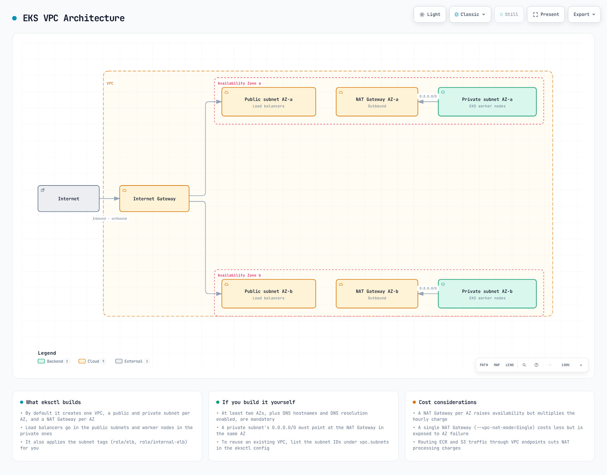

# Part 1: 前提条件

Amazon EKS クラスターを作成する方法はいくつかあります。この章では、さまざまなツールと方法を使用して EKS クラスターを作成する方法を学びます。

## 目次

1. [前提条件](02-eks-cluster-creation-part1.md#prerequisites)
2. [eksctl を使用したクラスターの作成](02-eks-cluster-creation-part1.md#creating-a-cluster-using-eksctl)
3. [AWS Management Console を使用したクラスターの作成](02-eks-cluster-creation-part1.md#creating-a-cluster-using-aws-management-console)
4. [AWS CLI を使用したクラスターの作成](02-eks-cluster-creation-part1.md#creating-a-cluster-using-aws-cli)
5. [Terraform を使用したクラスターの作成](02-eks-cluster-creation-part1.md#creating-a-cluster-using-terraform)

## 前提条件

EKS クラスターを作成する前に、次の前提条件が必要です。

### 1. AWS アカウント

有効な AWS アカウントが必要です。AWS アカウントをお持ちでない場合は、[AWS ウェブサイト](https://aws.amazon.com/)で登録できます。

### 2. IAM 権限

EKS クラスターを作成および管理するには、次の IAM 権限が必要です。

* `eks:*`
* `ec2:*`
* `iam:*`
* `cloudformation:*`

管理者権限をお持ちの場合、追加の権限設定は必要ありません。それ以外の場合は、次の IAM ポリシーをユーザーまたはロールにアタッチする必要があります。

```json
{
  "Version": "2012-10-17",
  "Statement": [
    {
      "Effect": "Allow",
      "Action": [
        "eks:*",
        "ec2:*",
        "iam:*",
        "cloudformation:*"
      ],
      "Resource": "*"
    }
  ]
}
```

### 3. ツールのインストール

EKS クラスターを作成および管理するには、次のツールをインストールする必要があります。

#### AWS CLI

AWS CLI は、コマンドラインから AWS サービスを操作するための統合ツールです。

**macOS**:

```bash
curl "https://awscli.amazonaws.com/AWSCLIV2.pkg" -o "AWSCLIV2.pkg"
sudo installer -pkg AWSCLIV2.pkg -target /
```

**Linux**:

```bash
curl "https://awscli.amazonaws.com/awscli-exe-linux-x86_64.zip" -o "awscliv2.zip"
unzip awscliv2.zip
sudo ./aws/install
```

**Windows**:

```
https://awscli.amazonaws.com/AWSCLIV2.msi
```

AWS CLI をインストールした後、次のコマンドを実行して認証情報を設定します。

```bash
aws configure
```

#### kubectl

kubectl は、Kubernetes クラスターと通信するためのコマンドラインツールです。

**macOS**:

```bash
curl -LO "https://dl.k8s.io/release/$(curl -L -s https://dl.k8s.io/release/stable.txt)/bin/darwin/amd64/kubectl"
chmod +x ./kubectl
sudo mv ./kubectl /usr/local/bin/kubectl
```

**Linux**:

```bash
curl -LO "https://dl.k8s.io/release/$(curl -L -s https://dl.k8s.io/release/stable.txt)/bin/linux/amd64/kubectl"
chmod +x ./kubectl
sudo mv ./kubectl /usr/local/bin/kubectl
```

**Windows**:

```bash
curl -LO "https://dl.k8s.io/release/v1.26.0/bin/windows/amd64/kubectl.exe"
```

#### eksctl

eksctl は、EKS クラスターを作成および管理するためのシンプルな CLI ツールです。

**macOS**:

```bash
brew tap weaveworks/tap
brew install weaveworks/tap/eksctl
```

または:

```bash
curl --silent --location "https://github.com/weaveworks/eksctl/releases/latest/download/eksctl_$(uname -s)_amd64.tar.gz" | tar xz -C /tmp
sudo mv /tmp/eksctl /usr/local/bin
```

**Linux**:

```bash
curl --silent --location "https://github.com/weaveworks/eksctl/releases/latest/download/eksctl_$(uname -s)_amd64.tar.gz" | tar xz -C /tmp
sudo mv /tmp/eksctl /usr/local/bin
```

**Windows**:

```bash
# PowerShell
$version = (Invoke-WebRequest -Uri "https://api.github.com/repos/weaveworks/eksctl/releases/latest" | ConvertFrom-Json).tag_name
Invoke-WebRequest -Uri "https://github.com/weaveworks/eksctl/releases/download/$version/eksctl_Windows_amd64.zip" -OutFile eksctl.zip
Expand-Archive -Path eksctl.zip -DestinationPath $env:USERPROFILE\.eksctl\bin
$env:PATH += ";$env:USERPROFILE\.eksctl\bin"
```

### 4. VPC とサブネット

EKS クラスターには VPC とサブネットが必要です。既存の VPC を使用することも、新しい VPC を作成することもできます。EKS クラスター用の VPC は、次の要件を満たす必要があります。



[🔍 インタラクティブな図を表示](https://www.atomai.click/kubernetes-docs/archmaps/en-eks-02-eks-cluster-creation-part1-0.html)

* 少なくとも 2 つのサブネットが異なるアベイラビリティーゾーンに存在する必要があります。
* サブネットにはインターネットアクセスが必要です（NAT Gateway またはインターネットゲートウェイ経由）。
* サブネットには十分な IP アドレスが必要です。
* サブネットには適切なタグが必要です。

#### EKS クラスター用 VPC タグ

EKS クラスターが VPC とサブネットを正しく使用できるようにするには、次のタグを適用する必要があります。

**VPC タグ**:

* `kubernetes.io/cluster/<cluster-name>`: `shared` または `owned`

**パブリックサブネットタグ**:

* `kubernetes.io/cluster/<cluster-name>`: `shared` または `owned`
* `kubernetes.io/role/elb`: `1`

**プライベートサブネットタグ**:

* `kubernetes.io/cluster/<cluster-name>`: `shared` または `owned`
* `kubernetes.io/role/internal-elb`: `1`

## クイズ

この章で学んだ内容を確認するには、[EKS クラスターの作成 - Part 1 クイズ](../quizzes/eks/02-eks-cluster-creation-part1-quiz.md)に挑戦してください。
