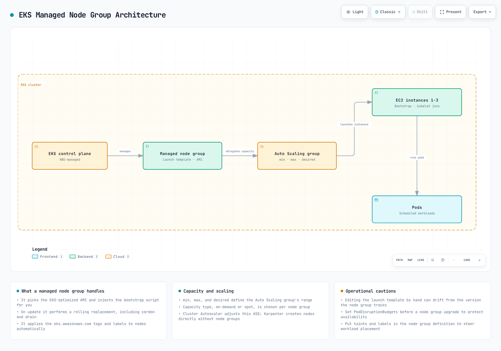
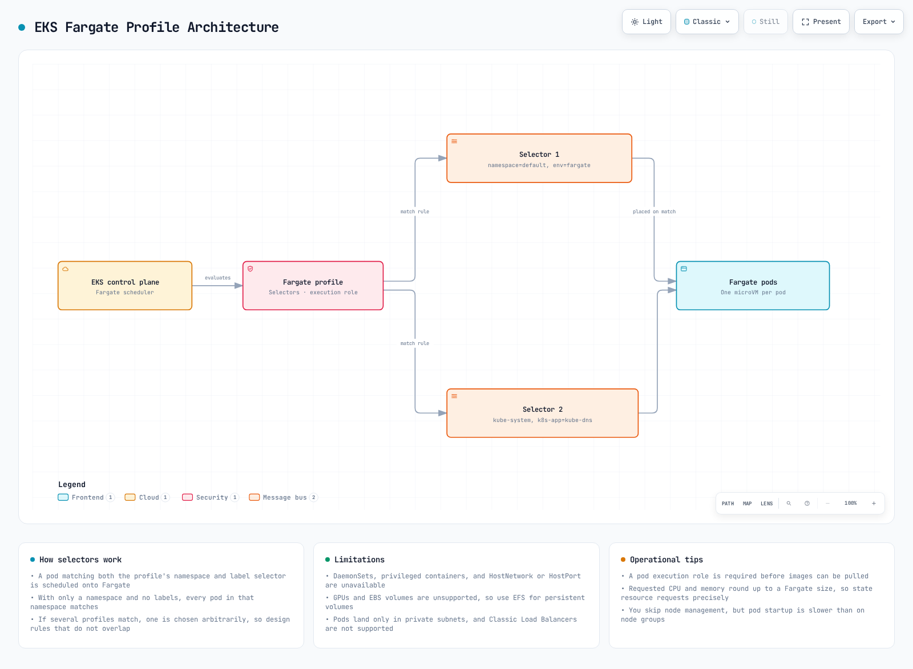
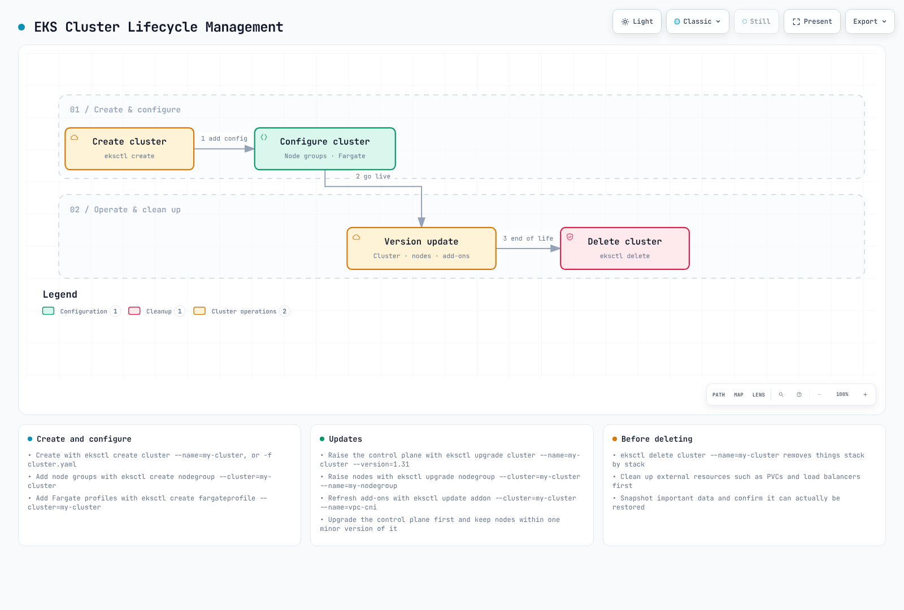

# パート 2: eksctl を使用したクラスターの作成

## eksctl を使用したクラスターの作成

eksctl は、EKS クラスターを作成および管理する最も簡単な方法です。eksctl は CloudFormation を使用して、EKS クラスターと関連リソースを作成します。

次の図は、eksctl を使用した EKS クラスター作成プロセスを示しています。


[🔍 インタラクティブな図を表示](https://www.atomai.click/kubernetes-docs/archmaps/en-eks-02-eks-cluster-creation-part2-0.html)

### 基本的なクラスターの作成

EKS クラスターの最も基本的な形式を作成するには、次のコマンドを実行します。

```bash
eksctl create cluster --name my-cluster --region us-west-2
```

このコマンドは、次のデフォルト設定でクラスターを作成します。

* m5.large node 2 台
* 新しい VPC とサブネット
* デフォルトの Amazon Linux 2 AMI
* 最新の Kubernetes バージョン

### 設定ファイルを使用したクラスターの作成

より複雑な設定の場合は、YAML ファイルを使用してクラスターを定義できます。

```yaml
# cluster.yaml
apiVersion: eksctl.io/v1alpha5
kind: ClusterConfig

metadata:
  name: my-eks-cluster
  region: us-west-2
  version: "1.26"

vpc:
  id: vpc-12345678
  subnets:
    private:
      us-west-2a:
        id: subnet-12345678
      us-west-2b:
        id: subnet-87654321
    public:
      us-west-2a:
        id: subnet-23456789
      us-west-2b:
        id: subnet-98765432

managedNodeGroups:
  - name: ng-1
    instanceType: m5.large
    desiredCapacity: 2
    minSize: 1
    maxSize: 3
    privateNetworking: true
    volumeSize: 80
    volumeType: gp3
    iam:
      withAddonPolicies:
        imageBuilder: true
        autoScaler: true
        externalDNS: true
        certManager: true
        appMesh: true
        ebs: true
        fsx: true
        efs: true
        albIngress: true
        xRay: true
        cloudWatch: true

  - name: ng-2
    instanceType: c5.xlarge
    desiredCapacity: 2
    privateNetworking: true
    spot: true

fargate:
  profiles:
    - name: fp-default
      selectors:
        - namespace: default
          labels:
            env: fargate
    - name: fp-kube-system
      selectors:
        - namespace: kube-system
          labels:
            k8s-app: kube-dns

cloudWatch:
  clusterLogging:
    enableTypes: ["api", "audit", "authenticator", "controllerManager", "scheduler"]
```

この設定ファイルを使用してクラスターを作成するには、次のコマンドを実行します。

```bash
eksctl create cluster -f cluster.yaml
```

### Managed Node Group の作成

次の図は、EKS クラスターの Managed Node Group アーキテクチャを示しています。



[🔍 インタラクティブな図を表示](https://www.atomai.click/kubernetes-docs/archmaps/en-eks-02-eks-cluster-creation-part2-1.html)

既存のクラスターに Managed Node Group を追加するには、次のコマンドを実行します。

```bash
eksctl create nodegroup \
  --cluster my-cluster \
  --region us-west-2 \
  --name my-nodegroup \
  --node-type m5.large \
  --nodes 3 \
  --nodes-min 1 \
  --nodes-max 5 \
  --ssh-access \
  --ssh-public-key my-key
```

または、設定ファイルを使用できます。

```yaml
# nodegroup.yaml
apiVersion: eksctl.io/v1alpha5
kind: ClusterConfig

metadata:
  name: my-cluster
  region: us-west-2

managedNodeGroups:
  - name: my-nodegroup
    instanceType: m5.large
    desiredCapacity: 3
    minSize: 1
    maxSize: 5
    volumeSize: 80
    volumeType: gp3
    ssh:
      allow: true
      publicKeyName: my-key
```

```bash
eksctl create nodegroup -f nodegroup.yaml
```

### Fargate Profile の作成

次の図は、EKS Fargate Profile アーキテクチャを示しています。



[🔍 インタラクティブな図を表示](https://www.atomai.click/kubernetes-docs/archmaps/en-eks-02-eks-cluster-creation-part2-2.html)

Fargate Profile を作成するには、次のコマンドを実行します。

```bash
eksctl create fargateprofile \
  --cluster my-cluster \
  --region us-west-2 \
  --name my-fargate-profile \
  --namespace default \
  --labels env=fargate
```

または、設定ファイルを使用できます。

```yaml
# fargate.yaml
apiVersion: eksctl.io/v1alpha5
kind: ClusterConfig

metadata:
  name: my-cluster
  region: us-west-2

fargate:
  profiles:
    - name: my-fargate-profile
      selectors:
        - namespace: default
          labels:
            env: fargate
```

```bash
eksctl create fargateprofile -f fargate.yaml
```

### クラスターの更新

eksctl を使用して既存のクラスターを更新できます。

```bash
# Upgrade cluster version
eksctl upgrade cluster --name=my-cluster --version=1.27

# Upgrade node group
eksctl upgrade nodegroup --cluster=my-cluster --name=my-nodegroup
```

### クラスターの削除

eksctl を使用してクラスターを削除できます。

```bash
eksctl delete cluster --name=my-cluster --region=us-west-2
```

## EKS クラスターのライフサイクル管理

次の図は、EKS クラスターの全体的なライフサイクル管理プロセスを示しています。



[🔍 インタラクティブな図を表示](https://www.atomai.click/kubernetes-docs/archmaps/en-eks-02-eks-cluster-creation-part2-3.html)

## クイズ

この章で学んだ内容を確認するには、[EKS クラスターの作成 - パート 2 クイズ](../quizzes/eks/02-eks-cluster-creation-part2-quiz.md)に挑戦してください。
