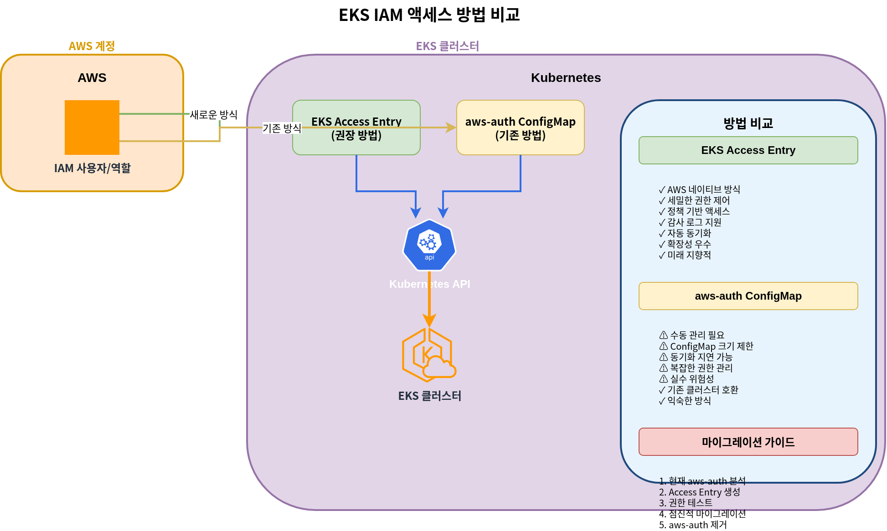
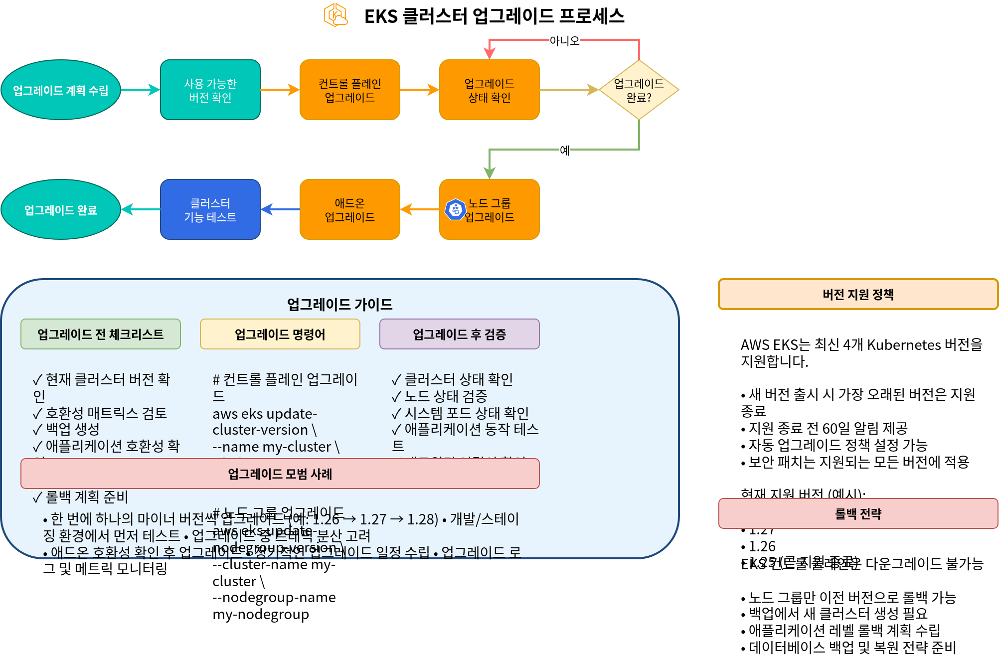

# Part 5: Cluster Access, Validation, Upgrade and Deletion

## Configuring Cluster Access

EKS cluster を作成した後、cluster にアクセスするための設定が必要です。このセクションでは、cluster access の設定方法を学びます。

### Cluster Access Configuration Process


### kubeconfig Configuration

EKS cluster にアクセスするには、kubeconfig file を設定する必要があります。AWS CLI を使用して kubeconfig を設定できます。

```bash
aws eks update-kubeconfig \
  --name my-cluster \
  --region us-west-2
```

この command は `~/.kube/config` file を更新し、EKS cluster へのアクセスを有効にします。

### Configuring IAM User and Role Access

デフォルトでは、EKS cluster を作成した IAM entity（user または role）のみが cluster にアクセスできます。他の IAM user または role に cluster access を付与する方法は 2 つあります。従来の aws-auth ConfigMap method と、新しい EKS Access Entry method です。



#### Method 1: EKS Access Entry (Recommended)

EKS Access Entry は aws-auth ConfigMap を置き換える新しい method であり、より安定していて管理しやすい approach を提供します。

1. cluster の Access Entry を有効にします。

```bash
aws eks update-cluster-config \
  --name my-cluster \
  --region us-west-2 \
  --access-config authenticationMode=API_AND_CONFIG_MAP
```

2. IAM role の Access Entry を作成します。

```bash
aws eks create-access-entry \
  --cluster-name my-cluster \
  --principal-arn arn:aws:iam::123456789012:role/MyRole \
  --username my-role \
  --kubernetes-groups system:masters
```

3. IAM user の Access Entry を作成します。

```bash
aws eks create-access-entry \
  --cluster-name my-cluster \
  --principal-arn arn:aws:iam::123456789012:user/my-user \
  --username my-user \
  --kubernetes-groups system:masters
```

4. Access Entries を一覧表示します。

```bash
aws eks list-access-entries --cluster-name my-cluster
```

5. Access Entry の詳細を確認します。

```bash
aws eks describe-access-entry \
  --cluster-name my-cluster \
  --principal-arn arn:aws:iam::123456789012:user/my-user
```

#### Method 2: aws-auth ConfigMap (Legacy)

aws-auth ConfigMap は従来の method であり、現在も support されていますが、新しい cluster には Access Entry の使用が推奨されます。

1. 現在の `aws-auth` ConfigMap を取得します。

```bash
kubectl get configmap aws-auth -n kube-system -o yaml > aws-auth.yaml
```

2. user または role を追加するために `aws-auth.yaml` file を編集します。

```yaml
apiVersion: v1
kind: ConfigMap
metadata:
  name: aws-auth
  namespace: kube-system
data:
  mapRoles: |
    - rolearn: arn:aws:iam::123456789012:role/EKSNodeRole
      username: system:node:{{EC2PrivateDNSName}}
      groups:
        - system:bootstrappers
        - system:nodes
    # Additional role
    - rolearn: arn:aws:iam::123456789012:role/MyRole
      username: my-role
      groups:
        - system:masters
  mapUsers: |
    # IAM user
    - userarn: arn:aws:iam::123456789012:user/my-user
      username: my-user
      groups:
        - system:masters
```

3. 更新した ConfigMap を適用します。

```bash
kubectl apply -f aws-auth.yaml
```

> **Note**: EKS Access Entry は 2023 年に導入され、新しい cluster には Access Entry の使用が推奨されます。既存の cluster は、両方の method を support する hybrid mode に移行できます。

### RBAC Configuration

Kubernetes Role-Based Access Control (RBAC) を使用して、cluster 内の resource への access を制御できます。

1. namespace を作成します。

```bash
kubectl create namespace dev
```

2. role を作成します。

```yaml
# role.yaml
apiVersion: rbac.authorization.k8s.io/v1
kind: Role
metadata:
  namespace: dev
  name: developer
rules:
- apiGroups: [""]
  resources: ["pods", "services", "configmaps", "secrets"]
  verbs: ["get", "list", "watch", "create", "update", "patch", "delete"]
- apiGroups: ["apps"]
  resources: ["deployments", "statefulsets", "daemonsets"]
  verbs: ["get", "list", "watch", "create", "update", "patch", "delete"]
```

```bash
kubectl apply -f role.yaml
```

3. role binding を作成します。

```yaml
# rolebinding.yaml
apiVersion: rbac.authorization.k8s.io/v1
kind: RoleBinding
metadata:
  name: developer-binding
  namespace: dev
subjects:
- kind: User
  name: my-user
  apiGroup: rbac.authorization.k8s.io
roleRef:
  kind: Role
  name: developer
  apiGroup: rbac.authorization.k8s.io
```

```bash
kubectl apply -f rolebinding.yaml
```

## Cluster Validation

EKS cluster を作成した後、cluster が正しく動作していることを確認する必要があります。このセクションでは、cluster を検証する方法を学びます。

### Cluster Validation Process


### Verify Nodes

cluster 内の nodes を確認します。

```bash
kubectl get nodes
```

すべての nodes が `Ready` state であることを確認します。

### Verify System Pods

kube-system namespace 内の pods を確認します。

```bash
kubectl get pods -n kube-system
```

すべての system pods が `Running` state であることを確認します。

### Deploy Test Application

cluster が正しく動作していることを確認するため、簡単な test application を deploy します。

```yaml
# nginx.yaml
apiVersion: apps/v1
kind: Deployment
metadata:
  name: nginx
spec:
  replicas: 3
  selector:
    matchLabels:
      app: nginx
  template:
    metadata:
      labels:
        app: nginx
    spec:
      containers:
      - name: nginx
        image: nginx:latest
        ports:
        - containerPort: 80
---
apiVersion: v1
kind: Service
metadata:
  name: nginx
spec:
  type: LoadBalancer
  ports:
  - port: 80
    targetPort: 80
  selector:
    app: nginx
```

```bash
kubectl apply -f nginx.yaml
```

deployment と service の status を確認します。

```bash
kubectl get deployments
kubectl get pods
kubectl get services
```

LoadBalancer service の external IP を使用して application にアクセスできることを確認します。

```bash
curl http://<EXTERNAL-IP>
```

### Verify Cluster Logs

CloudWatch Logs で cluster logs を確認します。

```bash
aws logs describe-log-groups \
  --log-group-name-prefix /aws/eks/my-cluster
```

## Cluster Upgrade

EKS cluster を最新の状態に保つには、定期的な upgrade が必要です。このセクションでは、cluster を upgrade する方法を学びます。

### Cluster Upgrade Process



### Control Plane Upgrade

EKS control plane を upgrade するには、次の手順に従います。

1. 利用可能な Kubernetes versions を確認します。

```bash
aws eks describe-addon-versions \
  --kubernetes-version 1.27 \
  --query "addons[].addonVersions[].compatibilities[].clusterVersion"
```

2. cluster を upgrade します。

```bash
aws eks update-cluster-version \
  --name my-cluster \
  --kubernetes-version 1.27
```

3. upgrade status を確認します。

```bash
aws eks describe-update \
  --name my-cluster \
  --update-id <UPDATE-ID>
```

### Node Upgrade

control plane を upgrade した後、nodes も upgrade する必要があります。

#### Managed Node Group Upgrade

```bash
aws eks update-nodegroup-version \
  --cluster-name my-cluster \
  --nodegroup-name my-nodegroup
```

#### Self-Managed Node Upgrade

self-managed nodes の場合、新しい node group を作成し、workloads を移行してから古い node group を削除する必要があります。

### Add-on Upgrade

EKS add-ons を upgrade するには、次の手順に従います。

1. 利用可能な add-on versions を確認します。

```bash
aws eks describe-addon-versions \
  --addon-name vpc-cni \
  --kubernetes-version 1.27
```

2. add-on を upgrade します。

```bash
aws eks update-addon \
  --cluster-name my-cluster \
  --addon-name vpc-cni \
  --addon-version <VERSION>
```

## Cluster Deletion

EKS cluster が不要になったら、cost を節約するために削除できます。このセクションでは、cluster を削除する方法を学びます。

### Cluster Deletion Process


### Resource Cleanup

cluster を削除する前に、cluster 内で作成されたすべての resources を clean up する必要があります。

1. LoadBalancer services を削除します。

```bash
kubectl get services --all-namespaces -o json | jq -r '.items[] | select(.spec.type == "LoadBalancer") | .metadata.name + " " + .metadata.namespace' | while read name namespace; do
  kubectl delete service $name -n $namespace
done
```

2. PersistentVolumeClaims を削除します。

```bash
kubectl delete pvc --all --all-namespaces
```

### Delete Cluster Using eksctl

eksctl を使用して cluster を作成した場合、次の command で削除できます。

```bash
eksctl delete cluster --name my-cluster --region us-west-2
```

### Delete Cluster Using AWS CLI

AWS CLI を使用して cluster を削除するには、次の手順に従います。

1. node group を削除します。

```bash
aws eks delete-nodegroup \
  --cluster-name my-cluster \
  --nodegroup-name my-nodegroup
```

2. Fargate profile を削除します。

```bash
aws eks delete-fargate-profile \
  --cluster-name my-cluster \
  --fargate-profile-name my-fargate-profile
```

3. cluster を削除します。

```bash
aws eks delete-cluster \
  --name my-cluster
```

### Clean Up Related Resources

EKS cluster を削除した後、次の関連 resources が残る場合があります。

1. VPC と関連 resources:

```bash
aws ec2 delete-vpc --vpc-id vpc-xxxxxxxxxxxxxxxxx
```

2. IAM roles と policies:

```bash
aws iam detach-role-policy \
  --role-name EKSClusterRole \
  --policy-arn arn:aws:iam::aws:policy/AmazonEKSClusterPolicy

aws iam delete-role --role-name EKSClusterRole

aws iam detach-role-policy \
  --role-name EKSNodeRole \
  --policy-arn arn:aws:iam::aws:policy/AmazonEKSWorkerNodePolicy

aws iam detach-role-policy \
  --role-name EKSNodeRole \
  --policy-arn arn:aws:iam::aws:policy/AmazonEKS_CNI_Policy

aws iam detach-role-policy \
  --role-name EKSNodeRole \
  --policy-arn arn:aws:iam::aws:policy/AmazonEC2ContainerRegistryReadOnly

aws iam delete-role --role-name EKSNodeRole
```

3. CloudWatch log groups:

```bash
aws logs delete-log-group \
  --log-group-name /aws/eks/my-cluster/cluster
```

## Quiz

この章で学んだ内容を確認するため、[EKS Cluster Creation - Part 5 Quiz](../quizzes/eks/02-eks-cluster-creation-part5-quiz.md) を試してください。
