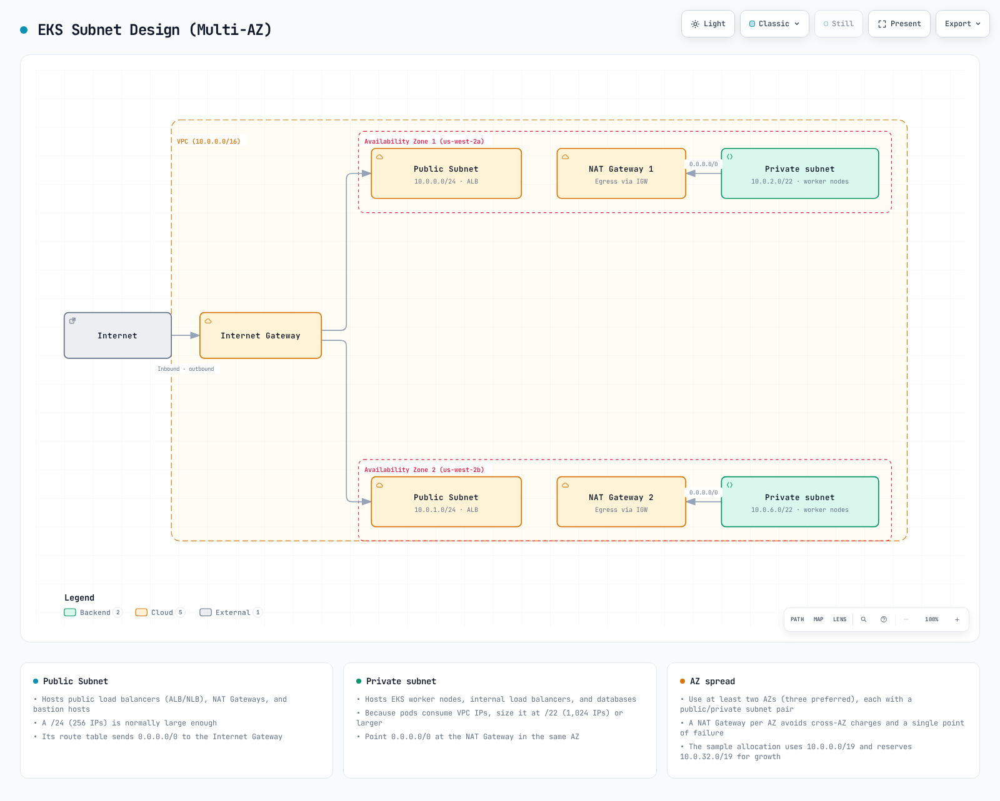
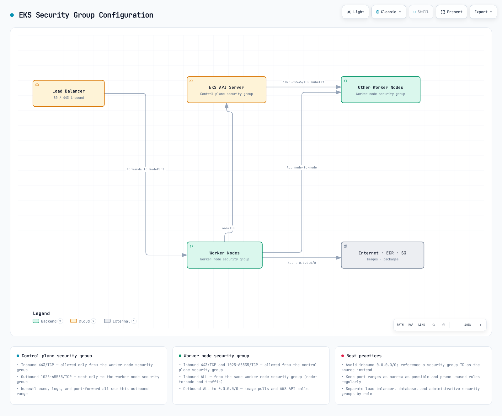

# EKS ネットワーキング

## 概要

Amazon EKS ネットワーキングは、Kubernetes クラスターの通信を管理する中核コンポーネントです。このドキュメントでは、EKS ネットワーキングの基本概念、VPC 設定、Subnet 設計、Security Group 設定について説明します。

## EKS ネットワーキングアーキテクチャ

EKS ネットワーキングアーキテクチャは、以下のコンポーネントで構成されます。


[🔍 インタラクティブ図を表示](https://www.atomai.click/kubernetes-docs/archmaps/en-eks-03-eks-networking-part1-0.html)

1. **VPC (Virtual Private Cloud)**: EKS クラスターが稼働する分離されたネットワーク環境
2. **Subnets**: VPC 内の IP アドレス範囲を分割する単位
3. **Route Tables**: ネットワークトラフィックの経路を決定するルールセット
4. **Internet Gateway**: VPC とインターネット間の通信を可能にするコンポーネント
5. **NAT Gateway**: Private Subnet 内のリソースがインターネットへアクセスできるようにするコンポーネント
6. **Security Groups**: インスタンスレベルの仮想ファイアウォール
7. **Network ACLs**: Subnet レベルの仮想ファイアウォール
8. **CNI (Container Network Interface)**: コンテナネットワーキングを管理するプラグイン

### EKS ネットワーキングフロー

EKS クラスター内のネットワークトラフィックは次のように流れます。


[🔍 インタラクティブ図を表示](https://www.atomai.click/kubernetes-docs/archmaps/en-eks-03-eks-networking-part1-1.html)

1. **Pod-to-Pod Communication**: 同一 Node または異なる Node 上の Pod 間の通信
2. **Pod-to-Service Communication**: クラスター内の Pod と Service 間の通信
3. **Internal to External Cluster Communication**: クラスター内部リソースと外部リソース間の通信
4. **Control Plane to Node Communication**: EKS Control Plane と worker node 間の通信

### EKS ネットワーキングコンポーネント間の関係


[🔍 インタラクティブ図を表示](https://www.atomai.click/kubernetes-docs/archmaps/en-eks-03-eks-networking-part1-2.html)

## VPC の要件

EKS クラスター用の VPC は、次の要件を満たす必要があります。


[🔍 インタラクティブ図を表示](https://www.atomai.click/kubernetes-docs/archmaps/en-eks-03-eks-networking-part1-3.html)

1. **Subnets**: 少なくとも 2 つの Availability Zone に Subnet が必要です
2. **IP Addresses**: 十分な数の IP アドレスを提供する必要があります
3. **DNS Hostnames**: DNS hostname と DNS resolution を有効にする必要があります
4. **Internet Access**: Node はインターネットにアクセスできる必要があります（NAT Gateway または Internet Gateway 経由）

### VPC CIDR の計画

VPC CIDR block を計画する際の考慮事項:


[🔍 インタラクティブ図を表示](https://www.atomai.click/kubernetes-docs/archmaps/en-eks-03-eks-networking-part1-4.html)

1. **Cluster Size**: 想定される Node と Pod の数
2. **IP Address Requirements**: 各 Node と Pod に必要な IP アドレス数
3. **Future Expansion**: 将来の拡張のための余裕
4. **Integration with Existing Networks**: 既存ネットワークとの重複回避

一般的な VPC CIDR block のサイズ:

* 小規模クラスター: /24（256 IP アドレス）
* 中規模クラスター: /20（4,096 IP アドレス）
* 大規模クラスター: /16（65,536 IP アドレス）

### Subnet 設計



[🔍 インタラクティブ図を表示](https://www.atomai.click/kubernetes-docs/archmaps/en-eks-03-eks-networking-part1-5.html)

EKS クラスターの Subnet 設計におけるベストプラクティス:

1. **Public Subnets**: Internet Gateway に直接接続される Subnet
   * 用途: Public Load Balancer、NAT Gateway、bastion host
   * 一般的なサイズ: /24（256 IP アドレス）
2. **Private Subnets**: Internet Gateway に直接接続されない Subnet
   * 用途: EKS worker node、Internal Load Balancer
   * 一般的なサイズ: /22（1,024 IP アドレス）
3. **Availability Zone Distribution**: 複数の Availability Zone に Subnet を分散
   * 少なくとも 2 つの Availability Zone を使用
   * 各 Availability Zone に Public Subnet と Private Subnet を配置

Subnet 設計例:

| Subnet Type | Availability Zone | CIDR Block  | Use                          |
| ----------- | ----------------- | ----------- | ---------------------------- |
| Public      | us-west-2a        | 10.0.0.0/24 | Load balancers, NAT gateways |
| Public      | us-west-2b        | 10.0.1.0/24 | Load balancers, NAT gateways |
| Private     | us-west-2a        | 10.0.2.0/22 | EKS worker nodes             |
| Private     | us-west-2b        | 10.0.6.0/22 | EKS worker nodes             |

### Subnet タグ


[🔍 インタラクティブ図を表示](https://www.atomai.click/kubernetes-docs/archmaps/en-eks-03-eks-networking-part1-6.html)

EKS は、Subnet 上の特定のタグを使用してリソースを自動検出します。

1. **Public Subnet タグ**:
   * `kubernetes.io/role/elb`: internet-facing Load Balancer で使用するには、値を `1` に設定します
   * `kubernetes.io/cluster/<cluster-name>`: 値を `shared` または `owned` に設定します
2. **Private Subnet タグ**:
   * `kubernetes.io/role/internal-elb`: Internal Load Balancer で使用するには、値を `1` に設定します
   * `kubernetes.io/cluster/<cluster-name>`: 値を `shared` または `owned` に設定します

例:

```bash
aws ec2 create-tags \
  --resources subnet-xxxxxxxxxxxxxxxxx \
  --tags Key=kubernetes.io/cluster/my-cluster,Value=shared Key=kubernetes.io/role/elb,Value=1
```

### Security Group 設定



[🔍 インタラクティブ図を表示](https://www.atomai.click/kubernetes-docs/archmaps/en-eks-03-eks-networking-part1-7.html)

EKS クラスターには、主に 2 つの Security Group があります。

1. **Cluster Security Group (Control Plane)**:
   * インバウンドルール:
     * 443/TCP: worker node の Security Group からのトラフィックを許可
   * アウトバウンドルール:
     * 1025-65535/TCP: worker node の Security Group へのトラフィックを許可
2. **Node Security Group (Worker Nodes)**:
   * インバウンドルール:
     * 443/TCP: Cluster Security Group からのトラフィックを許可
     * 1025-65535/TCP: Cluster Security Group からのトラフィックを許可
     * ALL: 同一 Security Group 内のトラフィックを許可
   * アウトバウンドルール:
     * ALL: すべての宛先へのトラフィックを許可

## まとめ

このドキュメントでは、EKS ネットワーキングの基本概念と VPC 設定について学びました。次のドキュメントでは、Service、Load Balancing、Network Policy など、より高度なネットワーキングトピックを扱います。

## クイズ

この章で学んだ内容を確認するには、[EKS Networking - Part 1 クイズ](../quizzes/eks/03-eks-networking-part1-quiz.md)に挑戦してください。
