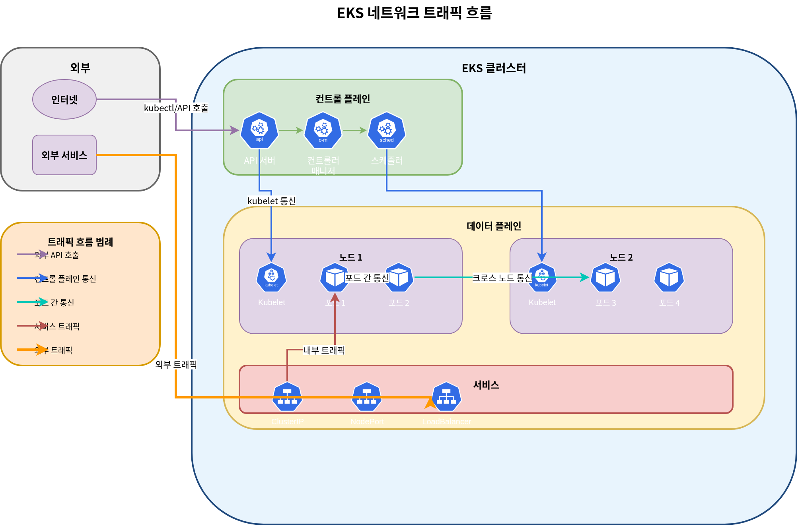

# EKS Networking

## Overview

Amazon EKS networking は、Kubernetes clusters の通信を管理する中核コンポーネントです。このドキュメントでは、EKS networking の基本概念、VPC configuration、subnet design、および security group configuration について説明します。

## EKS Networking Architecture

EKS networking architecture は、次の components で構成されます。


1. **VPC (Virtual Private Cloud)**: EKS cluster が実行される分離された network environment
2. **Subnets**: VPC 内の IP address ranges を分割する単位
3. **Route Tables**: network traffic paths を決定する rule sets
4. **Internet Gateway**: VPC と internet の間の通信を可能にする component
5. **NAT Gateway**: private subnets 内の resources が internet にアクセスできるようにする component
6. **Security Groups**: instance-level virtual firewalls
7. **Network ACLs**: subnet-level virtual firewalls
8. **CNI (Container Network Interface)**: container networking を管理する plugin

### EKS Networking Flow

EKS cluster では、network traffic は次のように流れます。



1. **Pod-to-Pod Communication**: 同じ node または異なる nodes 上の pods 間の communication
2. **Pod-to-Service Communication**: cluster 内の pods と services の間の communication
3. **Internal to External Cluster Communication**: internal cluster resources と external resources の間の communication
4. **Control Plane to Node Communication**: EKS control plane と worker nodes の間の communication

### Relationship Between EKS Networking Components


## VPC Requirements

EKS cluster 用の VPC は、次の要件を満たす必要があります。


1. **Subnets**: 少なくとも 2 つの availability zones に subnets が存在する必要があります
2. **IP Addresses**: 十分な数の IP addresses を提供する必要があります
3. **DNS Hostnames**: DNS hostnames と DNS resolution を有効にする必要があります
4. **Internet Access**: Nodes は internet にアクセスできる必要があります（NAT gateway または internet gateway 経由）

### VPC CIDR Planning

VPC CIDR blocks を計画する際の considerations:


1. **Cluster Size**: 予想される nodes と pods の数
2. **IP Address Requirements**: 各 node と pod に必要な IP addresses の数
3. **Future Expansion**: future expansion のための余地
4. **Integration with Existing Networks**: existing networks との overlap を避ける

一般的な VPC CIDR block sizes:

* 小規模 clusters: /24 (256 IP addresses)
* 中規模 clusters: /20 (4,096 IP addresses)
* 大規模 clusters: /16 (65,536 IP addresses)

### Subnet Design


EKS clusters の subnet design に関する best practices:

1. **Public Subnets**: internet gateway に直接接続された subnets
   * 用途: Public load balancers, NAT gateways, bastion hosts
   * 一般的な size: /24 (256 IP addresses)
2. **Private Subnets**: internet gateway に直接接続されていない subnets
   * 用途: EKS worker nodes, internal load balancers
   * 一般的な size: /22 (1,024 IP addresses)
3. **Availability Zone Distribution**: subnets を複数の availability zones に分散する
   * 少なくとも 2 つの availability zones を使用する
   * 各 availability zone に public と private subnets を配置する

subnet design の例:

| Subnet Type | Availability Zone | CIDR Block  | Use                          |
| ----------- | ----------------- | ----------- | ---------------------------- |
| Public      | us-west-2a        | 10.0.0.0/24 | Load balancers, NAT gateways |
| Public      | us-west-2b        | 10.0.1.0/24 | Load balancers, NAT gateways |
| Private     | us-west-2a        | 10.0.2.0/22 | EKS worker nodes             |
| Private     | us-west-2b        | 10.0.6.0/22 | EKS worker nodes             |

### Subnet Tags


EKS は resources を自動的に検出するため、subnets 上の specific tags を使用します。

1. **Public Subnet Tags**:
   * `kubernetes.io/role/elb`: internet-facing load balancers で使用するため value を `1` に設定する
   * `kubernetes.io/cluster/<cluster-name>`: value を `shared` または `owned` に設定する
2. **Private Subnet Tags**:
   * `kubernetes.io/role/internal-elb`: internal load balancers で使用するため value を `1` に設定する
   * `kubernetes.io/cluster/<cluster-name>`: value を `shared` または `owned` に設定する

例:

```bash
aws ec2 create-tags \
  --resources subnet-xxxxxxxxxxxxxxxxx \
  --tags Key=kubernetes.io/cluster/my-cluster,Value=shared Key=kubernetes.io/role/elb,Value=1
```

### Security Group Configuration


EKS clusters には 2 つの main security groups があります。

1. **Cluster Security Group (Control Plane)**:
   * Inbound rules:
     * 443/TCP: worker node security group からの traffic を許可する
   * Outbound rules:
     * 1025-65535/TCP: worker node security group への traffic を許可する
2. **Node Security Group (Worker Nodes)**:
   * Inbound rules:
     * 443/TCP: cluster security group からの traffic を許可する
     * 1025-65535/TCP: cluster security group からの traffic を許可する
     * ALL: 同じ security group 内の traffic を許可する
   * Outbound rules:
     * ALL: すべての destinations への traffic を許可する

## Conclusion

このドキュメントでは、EKS networking と VPC configuration の基本概念について学びました。次のドキュメントでは、services、load balancing、network policies など、より高度な networking topics を扱います。

## Quiz

この章で学んだ内容を確認するため、[EKS Networking - Part 1 Quiz](../quizzes/eks/03-eks-networking-part1-quiz.md) を試してみてください。
