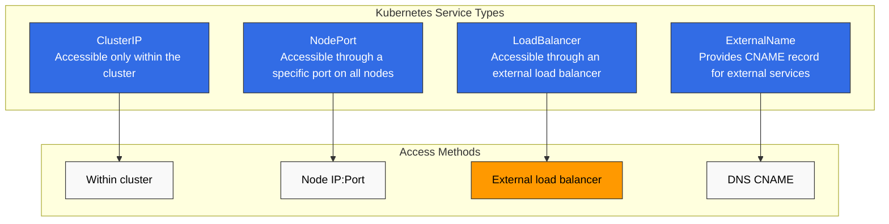
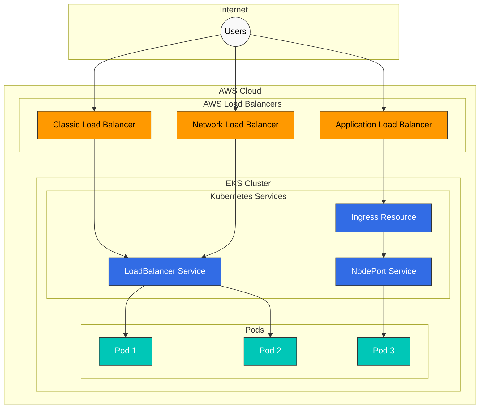
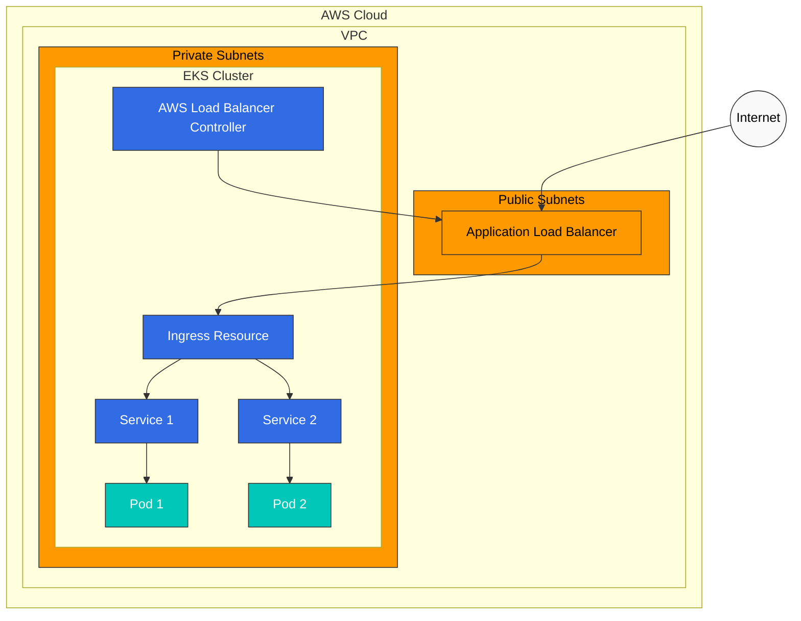
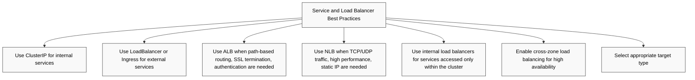
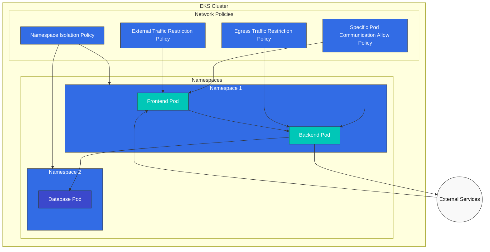
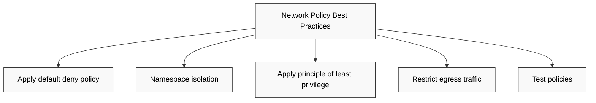
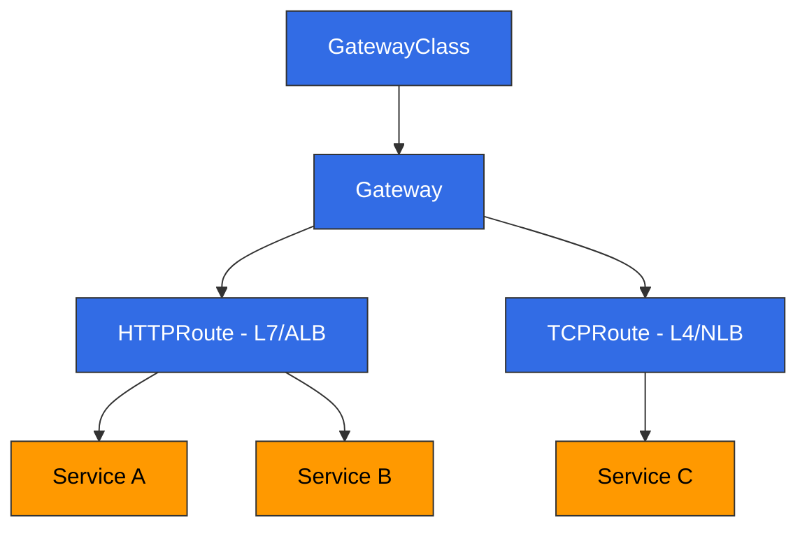

# EKS Networking - Part 2: Services, Load Balancing, and Network Policies

## Overview

このドキュメントでは、Amazon EKS における services（サービス）、load balancing、および network policies について学びます。Kubernetes services を通じて applications を公開する方法、AWS load balancers との統合、そして network policies を使用して pod 間通信を制御する方法を扱います。

## Kubernetes Service Types

Kubernetes は次の service types を提供します。



1. **ClusterIP**: cluster 内からのみアクセス可能な Service
2. **NodePort**: すべての nodes 上の特定の port を通じてアクセス可能な Service
3. **LoadBalancer**: external load balancer を通じてアクセス可能な Service
4. **ExternalName**: external services のための CNAME record を提供します

### ClusterIP Service

ClusterIP service は cluster 内からのみアクセス可能です。これはデフォルトの service type です。

```yaml
apiVersion: v1
kind: Service
metadata:
  name: my-service
spec:
  selector:
    app: my-app
  ports:
  - port: 80
    targetPort: 8080
  type: ClusterIP
```

### NodePort Service

NodePort service は、すべての nodes 上の特定の port を通じてアクセス可能です。

```yaml
apiVersion: v1
kind: Service
metadata:
  name: my-service
spec:
  selector:
    app: my-app
  ports:
  - port: 80
    targetPort: 8080
    nodePort: 30080
  type: NodePort
```

### LoadBalancer Service

LoadBalancer service は external load balancer を通じてアクセス可能です。EKS では、これは AWS load balancers（CLB、NLB、ALB）と統合されます。

```yaml
apiVersion: v1
kind: Service
metadata:
  name: my-service
spec:
  selector:
    app: my-app
  ports:
  - port: 80
    targetPort: 8080
  type: LoadBalancer
```

### ExternalName Service

ExternalName service は external services のための CNAME record を提供します。

```yaml
apiVersion: v1
kind: Service
metadata:
  name: my-service
spec:
  type: ExternalName
  externalName: my-service.example.com
```

## AWS Load Balancer Integration

EKS は Kubernetes services を AWS load balancers と統合し、applications を外部からアクセス可能にします。



### Classic Load Balancer (CLB)

デフォルトでは、`type: LoadBalancer` に設定された services は Classic Load Balancer を作成します。ただし、CLB は現在は推奨されておらず、NLB または ALB の使用が推奨されます。

```yaml
apiVersion: v1
kind: Service
metadata:
  name: my-service
spec:
  selector:
    app: my-app
  ports:
  - port: 80
    targetPort: 8080
  type: LoadBalancer
```

### Network Load Balancer (NLB)

NLB を使用するには、service に特定の annotations を追加する必要があります。

```yaml
apiVersion: v1
kind: Service
metadata:
  name: my-service
  annotations:
    service.beta.kubernetes.io/aws-load-balancer-type: nlb
spec:
  selector:
    app: my-app
  ports:
  - port: 80
    targetPort: 8080
  type: LoadBalancer
```

追加の NLB configuration options は次のとおりです。

```yaml
metadata:
  annotations:
    # Create internal NLB
    service.beta.kubernetes.io/aws-load-balancer-internal: "true"

    # Enable cross-zone load balancing
    service.beta.kubernetes.io/aws-load-balancer-cross-zone-load-balancing-enabled: "true"

    # Specify target type (instance or ip)
    service.beta.kubernetes.io/aws-load-balancer-target-group-attributes: preserve_client_ip.enabled=true

    # Enable TCP proxy protocol
    service.beta.kubernetes.io/aws-load-balancer-proxy-protocol: "*"
```

### Application Load Balancer (ALB)

ALB を使用するには、AWS Load Balancer Controller をインストールし、Ingress resources を使用する必要があります。



1. AWS Load Balancer Controller をインストールします。

```bash
# Download IAM policy
curl -o iam-policy.json https://raw.githubusercontent.com/kubernetes-sigs/aws-load-balancer-controller/main/docs/install/iam_policy.json

# Create IAM policy
aws iam create-policy \
  --policy-name AWSLoadBalancerControllerIAMPolicy \
  --policy-document file://iam-policy.json

# Create IAM role and attach policy (using eksctl)
eksctl create iamserviceaccount \
  --cluster=my-cluster \
  --namespace=kube-system \
  --name=aws-load-balancer-controller \
  --attach-policy-arn=arn:aws:iam::123456789012:policy/AWSLoadBalancerControllerIAMPolicy \
  --approve

# Add Helm repository
helm repo add eks https://aws.github.io/eks-charts
helm repo update

# Install AWS Load Balancer Controller
helm install aws-load-balancer-controller eks/aws-load-balancer-controller \
  -n kube-system \
  --set clusterName=my-cluster \
  --set serviceAccount.create=false \
  --set serviceAccount.name=aws-load-balancer-controller
```

2. Ingress resource を作成します。

```yaml
apiVersion: networking.k8s.io/v1
kind: Ingress
metadata:
  name: my-ingress
  annotations:
    kubernetes.io/ingress.class: alb
    alb.ingress.kubernetes.io/scheme: internet-facing
    alb.ingress.kubernetes.io/target-type: ip
spec:
  rules:
  - http:
      paths:
      - path: /
        pathType: Prefix
        backend:
          service:
            name: my-service
            port:
              number: 80
```

追加の ALB configuration options は次のとおりです。

```yaml
metadata:
  annotations:
    # Create internal ALB
    alb.ingress.kubernetes.io/scheme: internal

    # Specify SSL certificate
    alb.ingress.kubernetes.io/certificate-arn: arn:aws:acm:region:account-id:certificate/certificate-id

    # HTTPS redirect
    alb.ingress.kubernetes.io/actions.ssl-redirect: '{"Type": "redirect", "RedirectConfig": {"Protocol": "HTTPS", "Port": "443", "StatusCode": "HTTP_301"}}'

    # Specify target type (instance or ip)
    alb.ingress.kubernetes.io/target-type: ip

    # Specify security groups
    alb.ingress.kubernetes.io/security-groups: sg-xxxx,sg-yyyy
```

### Service and Load Balancer Best Practices



1. **内部 services には ClusterIP を使用**: cluster 内からのみアクセスされる services には ClusterIP type を使用します。
2. **external services には LoadBalancer または Ingress を使用**: 外部アクセスが必要な services には LoadBalancer type または Ingress resources を使用します。
3. **ALB を使用**: path-based routing、SSL termination、authentication などの機能が必要な場合は ALB を使用します。
4. **NLB を使用**: TCP/UDP traffic、高性能、および static IP が必要な場合は NLB を使用します。
5. **internal load balancers を使用**: cluster 内からのみアクセスされる services には internal load balancers を使用します。
6. **cross-zone load balancing を有効化**: high availability のために cross-zone load balancing を有効にします。
7. **適切な target type を選択**: pod IPs を直接 targets として使用するには `ip` target type を選択し、node IPs を targets として使用するには `instance` target type を選択します。

## Network Policies

Network policies は pod 間通信を制御するために使用されます。EKS で network policies を使用するには、network policies をサポートする CNI plugin（例: Calico、Cilium）をインストールする必要があります。



### Installing Calico

Calico は、EKS で network policies を実装するために広く使用されている CNI plugin です。

```bash
# Install Calico
kubectl apply -f https://docs.projectcalico.org/manifests/calico-vxlan.yaml

# Check Calico status
kubectl get pods -n kube-system -l k8s-app=calico-node
```

### Default Network Policy

デフォルトでは、network policies がない場合、すべての pods は互いに通信できます。network policies が適用されると、明示的に許可された traffic のみが許可されます。

### Namespace Isolation Policy

特定の namespace 内の pods 間でのみ通信を許可する policy:

```yaml
apiVersion: networking.k8s.io/v1
kind: NetworkPolicy
metadata:
  name: namespace-isolation
  namespace: my-namespace
spec:
  podSelector: {}
  policyTypes:
  - Ingress
  ingress:
  - from:
    - podSelector: {}
```

### Specific Pod Communication Allow Policy

特定の labels を持つ pods 間でのみ通信を許可する policy:

```yaml
apiVersion: networking.k8s.io/v1
kind: NetworkPolicy
metadata:
  name: allow-frontend-to-backend
  namespace: my-namespace
spec:
  podSelector:
    matchLabels:
      app: backend
  policyTypes:
  - Ingress
  ingress:
  - from:
    - podSelector:
        matchLabels:
          app: frontend
    ports:
    - protocol: TCP
      port: 80
```

### External Traffic Restriction Policy

特定の IP ranges からの traffic のみを許可する policy:

```yaml
apiVersion: networking.k8s.io/v1
kind: NetworkPolicy
metadata:
  name: allow-external-traffic
  namespace: my-namespace
spec:
  podSelector:
    matchLabels:
      app: web
  policyTypes:
  - Ingress
  ingress:
  - from:
    - ipBlock:
        cidr: 192.168.1.0/24
        except:
        - 192.168.1.10/32
    ports:
    - protocol: TCP
      port: 80
```

### Egress Traffic Restriction Policy

特定の destinations への egress traffic のみを許可する policy:

```yaml
apiVersion: networking.k8s.io/v1
kind: NetworkPolicy
metadata:
  name: limit-egress-traffic
  namespace: my-namespace
spec:
  podSelector:
    matchLabels:
      app: web
  policyTypes:
  - Egress
  egress:
  - to:
    - podSelector:
        matchLabels:
          app: db
    ports:
    - protocol: TCP
      port: 5432
  - to:
    - ipBlock:
        cidr: 0.0.0.0/0
        except:
        - 10.0.0.0/8
        - 172.16.0.0/12
        - 192.168.0.0/16
    ports:
    - protocol: TCP
      port: 443
```

### Network Policy Best Practices



1. **default deny policy を適用**: デフォルトですべての traffic を拒否し、必要な traffic のみを明示的に許可します。
2. **Namespace isolation**: namespaces 間の通信を制限することで security を強化します。
3. **least privilege の原則を適用**: 必要最小限の通信のみを許可します。
4. **egress traffic を制限**: pods から外部へ出ていく traffic を制限することで security を強化します。
5. **policies をテスト**: 意図しない通信遮断を防ぐため、network policies を適用する前にテストします。

---

## Gateway API

> **Supported Versions**: AWS Load Balancer Controller v2.13.0+
> **最終更新**: February 19, 2026

### Overview

Gateway API は、従来の Ingress resources の制限を克服し、より豊富な routing capabilities を提供する Kubernetes の次世代 service networking API です。AWS Load Balancer Controller は Gateway API をサポートしており、Gateway resources を通じて L4（NLB）および L7（ALB）の routing configuration を有効にします。



### Prerequisites

1. **AWS Load Balancer Controller v2.13.0 以降**: インストール済みであること
2. **Feature Gates の有効化**: controller をデプロイするときに `--feature-gates=EnableGatewayAPI=true` flag を追加します
3. **Gateway API CRDs のインストール**:

```bash
# Install Standard CRDs
kubectl apply -f https://github.com/kubernetes-sigs/gateway-api/releases/download/v1.2.1/standard-install.yaml

# Install Experimental CRDs (TCPRoute, etc.)
kubectl apply -f https://github.com/kubernetes-sigs/gateway-api/releases/download/v1.2.1/experimental-install.yaml

# Install AWS LBC-specific CRDs
kubectl apply -f https://raw.githubusercontent.com/kubernetes-sigs/aws-load-balancer-controller/main/config/crd/gateway-api/crds.yaml
```

### GatewayClass and Gateway Setup

GatewayClass は load balancer の type を定義し、Gateway は実際の load balancer instance を表します。

```yaml
# GatewayClass definition
apiVersion: gateway.networking.k8s.io/v1
kind: GatewayClass
metadata:
  name: amazon-alb
spec:
  controllerName: gateway.k8s.aws/alb

---
# Gateway definition (L7 - ALB)
apiVersion: gateway.networking.k8s.io/v1
kind: Gateway
metadata:
  name: my-hotel-gateway
  namespace: default
spec:
  gatewayClassName: amazon-alb
  listeners:
  - name: http
    protocol: HTTP
    port: 80
  - name: https
    protocol: HTTPS
    port: 443
    tls:
      mode: Terminate
      certificateRefs:
      - kind: Secret
        name: my-tls-secret
```

### HTTPRoute Example (L7 → ALB)

HTTPRoute は HTTP/HTTPS traffic を services に routing するための rules を定義します。Gateway にアタッチされた HTTPRoutes は、ALB を通じて traffic を分散します。

```yaml
apiVersion: gateway.networking.k8s.io/v1
kind: HTTPRoute
metadata:
  name: app-route
  namespace: default
spec:
  parentRefs:
  - name: my-hotel-gateway
    sectionName: http
  hostnames:
  - "app.example.com"
  rules:
  - matches:
    - path:
        type: PathPrefix
        value: /api
    backendRefs:
    - name: api-service
      port: 80
      weight: 90
    - name: api-service-v2
      port: 80
      weight: 10
  - matches:
    - path:
        type: PathPrefix
        value: /
    backendRefs:
    - name: frontend-service
      port: 80
```

### TCPRoute Example (L4 → NLB)

TCPRoute は TCP traffic を処理し、NLB を通じて L4-level load balancing を提供します。

```yaml
# GatewayClass for NLB
apiVersion: gateway.networking.k8s.io/v1
kind: GatewayClass
metadata:
  name: amazon-nlb
spec:
  controllerName: gateway.k8s.aws/nlb

---
# NLB Gateway
apiVersion: gateway.networking.k8s.io/v1
kind: Gateway
metadata:
  name: my-nlb-gateway
spec:
  gatewayClassName: amazon-nlb
  listeners:
  - name: tcp
    protocol: TCP
    port: 5432

---
# TCPRoute
apiVersion: gateway.networking.k8s.io/v1alpha2
kind: TCPRoute
metadata:
  name: db-route
spec:
  parentRefs:
  - name: my-nlb-gateway
    sectionName: tcp
  rules:
  - backendRefs:
    - name: postgres-service
      port: 5432
```

### QUIC/HTTP3 Support

Gateway API を通じて作成された ALBs は、QUIC/HTTP3 protocol を自動的にサポートします。HTTPS listener が設定されている場合、ALB は QUIC protocol upgrades を自動的に処理します。

```yaml
apiVersion: gateway.networking.k8s.io/v1
kind: Gateway
metadata:
  name: quic-gateway
  annotations:
    gateway.k8s.aws/quic-enabled: "true"
spec:
  gatewayClassName: amazon-alb
  listeners:
  - name: https
    protocol: HTTPS
    port: 443
    tls:
      mode: Terminate
      certificateRefs:
      - kind: Secret
        name: tls-cert
```

### Certificate Discovery

AWS Load Balancer Controller は 2 つの certificate discovery 方法をサポートしています。

1. **Static certificate reference**: Gateway の `tls.certificateRefs` で直接指定します
2. **Hostname-based auto-discovery**: HTTPRoute の `hostnames` field に基づいて、一致する certificates を ACM から自動的に検索します

```yaml
# Hostname-based auto-discovery example
apiVersion: gateway.networking.k8s.io/v1
kind: HTTPRoute
metadata:
  name: auto-cert-route
spec:
  parentRefs:
  - name: my-gateway
  hostnames:
  - "secure.example.com"  # Auto-discovers matching certificate from ACM
  rules:
  - backendRefs:
    - name: secure-service
      port: 443
```

### Security Groups

Gateway API を通じて作成された load balancers には、security groups が自動的に作成されます。

- **Frontend security group**: clients から load balancer への inbound traffic を許可します
- **Backend security group**: load balancer から target pods への traffic を許可します

custom security groups は、Gateway annotations を通じて指定することもできます。

```yaml
apiVersion: gateway.networking.k8s.io/v1
kind: Gateway
metadata:
  name: custom-sg-gateway
  annotations:
    gateway.k8s.aws/security-group-ids: sg-0123456789abcdef0,sg-0987654321fedcba0
spec:
  gatewayClassName: amazon-alb
  listeners:
  - name: http
    protocol: HTTP
    port: 80
```

### Out-of-Band Target Groups

`TargetGroupName` backendRef を使用すると、既存の target groups を Gateway API routing に接続できます。これは、既存 infrastructure との統合や migration scenarios に役立ちます。

```yaml
apiVersion: gateway.networking.k8s.io/v1
kind: HTTPRoute
metadata:
  name: oob-route
spec:
  parentRefs:
  - name: my-gateway
  rules:
  - backendRefs:
    - group: gateway.k8s.aws
      kind: TargetGroupBinding
      name: existing-target-group
```

### Gateway API vs Ingress Comparison

| Feature | Ingress | Gateway API |
|---------|---------|-------------|
| Routing Model | Host/Path based | Host/Path/Header/Query based |
| Protocol Support | HTTP/HTTPS | HTTP, HTTPS, TCP, TLS, gRPC |
| Traffic Splitting | Annotation based | Native weight-based |
| Role Separation | Single resource | GatewayClass/Gateway/Route separation |
| Extensibility | Limited via annotations | Extensible via Policy attachment |
| L4 Load Balancing | Not supported | TCPRoute/UDPRoute supported |

## Quiz

この章で学んだ内容を確認するには、[トピッククイズ](../quizzes/eks/03-eks-networking-part2-quiz.md) に挑戦してください。
