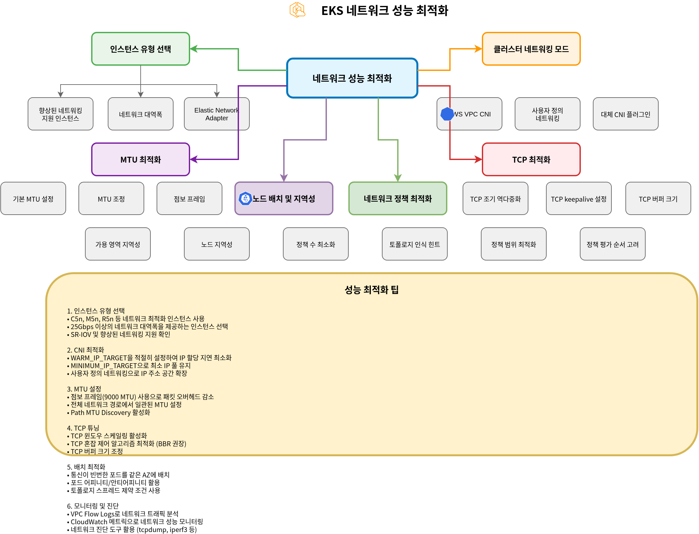
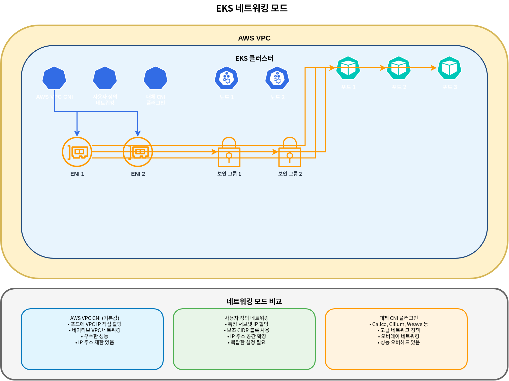
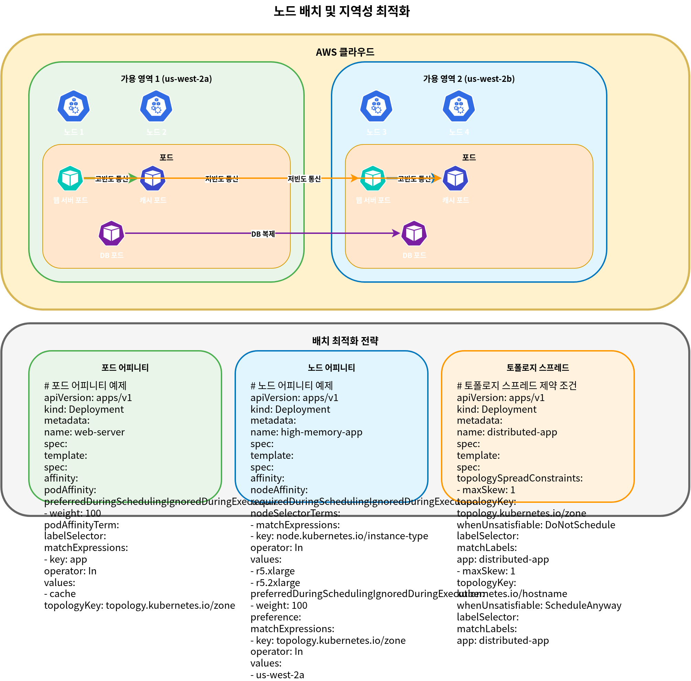
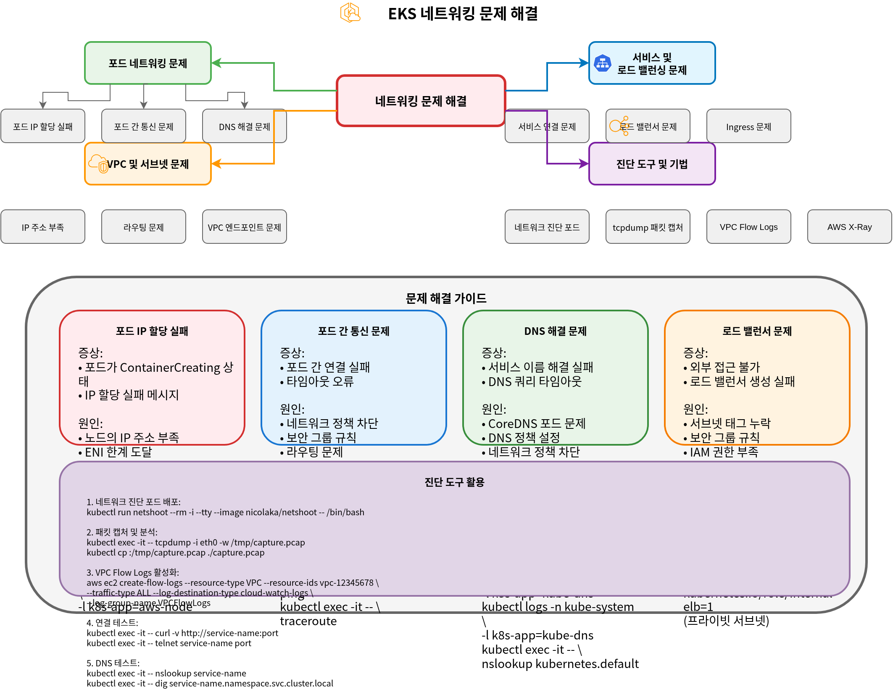

# Part 3: Troubleshooting

## Overview

このドキュメントでは、Amazon EKS networking の performance optimization、troubleshooting methods、および advanced use cases について説明します。Network performance を最適化する方法、一般的な networking issues を解決する方法、advanced networking features を活用する方法を扱います。

## Network Performance Optimization

EKS clusters で network performance を最適化するための戦略はいくつかあります。



### Instance Type Selection

Network performance は instance type によって大きく異なります。Network-intensive workloads では、enhanced networking をサポートする instance types を選択することを推奨します。

1. **Enhanced Networking Support Instances**:
   * C5、M5、R5 などの instance types は enhanced networking をサポートします。
   * これらの instances は、より高い bandwidth、低い latency、低い jitter を提供します。
2. **Network Bandwidth**:
   * より大きい instance sizes は、より高い network bandwidth を提供します。
   * たとえば、m5.large は最大 10Gbps を提供し、m5.24xlarge は最大 25Gbps の network bandwidth を提供します。
3. **Elastic Network Adapter (ENA)**:
   * ENA は最大 100Gbps の network bandwidth をサポートします。
   * ほとんどの最新 instance types は ENA をサポートします。

### Cluster Networking Modes

EKS は複数の networking modes をサポートしており、それぞれ異なる performance characteristics を持ちます。



1. **AWS VPC CNI (Default)**:
   * VPC IP addresses を pods に直接割り当てます。
   * Native VPC networking を使用するため、優れた performance を提供します。
   * 各 node には割り当て可能な IP addresses の数に制限があります。
2. **Custom Networking**:
   * 特定の subnets から IP addresses を pods に割り当てられるようにします。
   * Secondary CIDR blocks を使用して IP address space を拡張できます。
   * Network topology をより細かく制御できます。
3. **Alternative CNI Plugins**:
   * Calico や Cilium などの alternative CNI plugins を使用できます。
   * これらの plugins は追加機能（例: network policies、encryption）を提供しますが、performance overhead が発生する場合があります。

### MTU Optimization

MTU (Maximum Transmission Unit) は network performance に影響する重要な要素です。

1. **Default MTU Settings**:
   * AWS VPC CNI のデフォルト MTU は 9001 です。
   * 一部の network paths では、より小さい MTU が必要になる場合があります。
2. **MTU Adjustment**:
   * AWS VPC CNI の MTU setting は調整できます。

```bash
kubectl set env daemonset aws-node -n kube-system ENI_MTU=9001
```

3. **Jumbo Frames**:
   * Jumbo frames (MTU > 1500) を使用すると、network performance を向上させることができます。
   * VPC、subnets、security groups、load balancers を含むすべての network components が jumbo frames をサポートしている必要があります。

### TCP Optimization

TCP settings を最適化することで、network performance を向上させることができます。

1. **TCP Early Demux**:
   * TCP early demux は performance を向上させることがありますが、一部の networking modes では issues を引き起こす可能性があります。
   * 必要に応じて無効化できます。

```bash
kubectl set env daemonset aws-node -n kube-system DISABLE_TCP_EARLY_DEMUX=true
```

2. **TCP Keepalive Settings**:
   * TCP keepalive settings を調整して、connection maintenance と reuse を最適化できます。
   * これは多数の short connections を処理する workloads に特に有用です。

```bash
# System-level TCP keepalive settings
sysctl -w net.ipv4.tcp_keepalive_time=60
sysctl -w net.ipv4.tcp_keepalive_intvl=15
sysctl -w net.ipv4.tcp_keepalive_probes=6
```

3. **TCP Buffer Size**:
   * TCP buffer size を調整して throughput を最適化できます。
   * Bandwidth Delay Product (BDP) に応じて buffer size を設定することを推奨します。

```bash
# System-level TCP buffer settings
sysctl -w net.core.rmem_max=16777216
sysctl -w net.core.wmem_max=16777216
sysctl -w net.ipv4.tcp_rmem="4096 87380 16777216"
sysctl -w net.ipv4.tcp_wmem="4096 65536 16777216"
```

### Node Placement and Locality

Node placement と locality を最適化することで、network performance を向上させることができます。



1. **Availability Zone Locality**:
   * 頻繁に通信する pods を同じ availability zone に配置して latency を削減します。
   * Pod affinity と anti-affinity を使用して pod placement を制御します。

```yaml
apiVersion: apps/v1
kind: Deployment
metadata:
  name: web-server
spec:
  replicas: 3
  selector:
    matchLabels:
      app: web
  template:
    metadata:
      labels:
        app: web
    spec:
      affinity:
        podAffinity:
          preferredDuringSchedulingIgnoredDuringExecution:
          - weight: 100
            podAffinityTerm:
              labelSelector:
                matchExpressions:
                - key: app
                  operator: In
                  values:
                  - cache
              topologyKey: topology.kubernetes.io/zone
```

2. **Node Locality**:
   * 頻繁に通信する pods を同じ node に配置して network hops を削減します。
   * これは latency-sensitive applications に特に有用です。

```yaml
apiVersion: apps/v1
kind: Deployment
metadata:
  name: web-server
spec:
  replicas: 3
  selector:
    matchLabels:
      app: web
  template:
    metadata:
      labels:
        app: web
    spec:
      affinity:
        podAffinity:
          preferredDuringSchedulingIgnoredDuringExecution:
          - weight: 100
            podAffinityTerm:
              labelSelector:
                matchExpressions:
                - key: app
                  operator: In
                  values:
                  - cache
              topologyKey: kubernetes.io/hostname
```

3. **Topology Aware Hints**:
   * Topology aware hints を使用して service traffic を同じ zone 内に維持します。
   * これにより availability zones 間の data transfer costs が削減され、latency が改善されます。

```yaml
apiVersion: v1
kind: Service
metadata:
  name: my-service
  annotations:
    service.kubernetes.io/topology-aware-hints: "auto"
spec:
  selector:
    app: my-app
  ports:
  - port: 80
    targetPort: 8080
  type: ClusterIP
```

### Network Policy Optimization

Network policies は security を強化しますが、performance に影響する可能性があります。

1. **Minimize Number of Policies**:
   * 必要最小限の network policies のみを適用します。
   * Policies が多すぎると performance degradation を引き起こす可能性があります。
2. **Optimize Policy Scope**:
   * 広範な policies ではなく specific policies を使用します。
   * Label selectors を使用して policy scope を制限します。
3. **Consider Policy Evaluation Order**:
   * Network policies は累積的に評価されます。
   * Evaluation performance を最適化するために、最も頻繁に使用される rules を先に定義します。

## Networking Troubleshooting

EKS clusters で発生する可能性がある一般的な networking issues と、その解決方法を見ていきましょう。



### Pod Networking Issues


1. **Pod IP Assignment Failure**:
   * 症状: Pod が `ContainerCreating` state のまま停止している
   * 原因: Node に利用可能な IP addresses が不足している
   * 解決策:
     * Node status を確認する: `kubectl describe node <node-name>`
     * AWS VPC CNI logs を確認する: `kubectl logs -n kube-system -l k8s-app=aws-node`
     * WARM\_IP\_TARGET を増やす: `kubectl set env daemonset aws-node -n kube-system WARM_IP_TARGET=10`
     * Node instance type をアップグレードする: より多くの ENIs と IP addresses をサポートする instance type に変更します
2. **Pod-to-Pod Communication Issues**:
   * 症状: Pod が他の pods と通信できない
   * 原因: Network policies、security groups、routing issues など
   * 解決策:
     * Network policies を確認する: `kubectl get networkpolicy`
     * Security group rules を確認する: AWS console または AWS CLI を使用します
     * Pod 内から network connectivity をテストします。

```bash
kubectl exec -it <pod-name> -- ping <target-pod-ip>
kubectl exec -it <pod-name> -- curl <target-service-name>
kubectl exec -it <pod-name> -- traceroute <target-pod-ip>
```

3. **DNS Resolution Issues**:
   * 症状: Pod が service names を解決できない
   * 原因: CoreDNS issues、network policies、security groups など
   * 解決策:
     * CoreDNS pod status を確認する: `kubectl get pods -n kube-system -l k8s-app=kube-dns`
     * CoreDNS logs を確認する: `kubectl logs -n kube-system -l k8s-app=kube-dns`
     * DNS configuration を確認する: `kubectl exec -it <pod-name> -- cat /etc/resolv.conf`
     * DNS queries をテストします。

```bash
kubectl exec -it <pod-name> -- nslookup kubernetes.default.svc.cluster.local
kubectl exec -it <pod-name> -- dig kubernetes.default.svc.cluster.local
```

### Service and Load Balancing Issues


1. **Service Connection Issues**:
   * 症状: Service 経由で pods に接続できない
   * 原因: Service selector、pod status、endpoints など
   * 解決策:
     * Service status を確認する: `kubectl describe service <service-name>`
     * Endpoints を確認する: `kubectl get endpoints <service-name>`
     * Pod status を確認する: `kubectl get pods -l <selector-label>`
     * Service DNS を確認する: `kubectl exec -it <pod-name> -- nslookup <service-name>`
2. **Load Balancer Issues**:
   * 症状: 外部から load balancer に接続できない
   * 原因: Security groups、subnet tags、health checks など
   * 解決策:
     * Load balancer status を確認する: AWS console または AWS CLI を使用します
     * Security group rules を確認する: Inbound traffic が許可されていることを検証します
     * Subnet tags を確認する: 適切な tags が存在することを検証します
     * Health check configuration を確認する: Health check path、port など
3. **Ingress Issues**:
   * 症状: Ingress 経由で service に接続できない
   * 原因: Ingress controller、annotations、certificates など
   * 解決策:
     * Ingress status を確認する: `kubectl describe ingress <ingress-name>`
     * Ingress controller logs を確認する: `kubectl logs -n kube-system -l app.kubernetes.io/name=aws-load-balancer-controller`
     * ALB status を確認する: AWS console または AWS CLI を使用します
     * Target group status を確認する: Targets が healthy であることを検証します

## Quiz

この章で学んだ内容を確認するには、[topic quiz](../quizzes/eks/03-eks-networking-part3-quiz.md) に挑戦してください。
