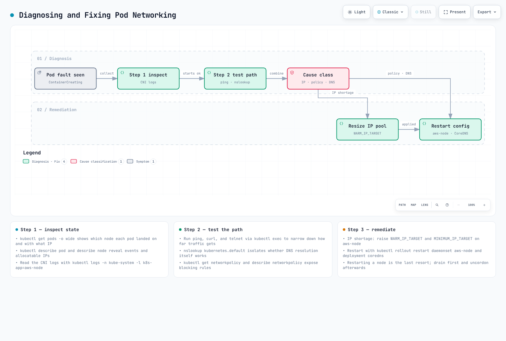

# パート 3: トラブルシューティング

## 概要

このドキュメントでは、Amazon EKS ネットワーキングのパフォーマンス最適化、トラブルシューティング手法、および高度なユースケースを扱います。ネットワークパフォーマンスを最適化する方法、一般的なネットワーキングの問題を解決する方法、および高度なネットワーキング機能を活用する方法について説明します。

## ネットワークパフォーマンスの最適化

EKS クラスターでネットワークパフォーマンスを最適化するための戦略はいくつかあります。


[🔍 インタラクティブな図を表示](https://www.atomai.click/kubernetes-docs/archmaps/en-eks-03-eks-networking-part3-0.html)

### インスタンスタイプの選択

ネットワークパフォーマンスはインスタンスタイプによって大きく異なります。ネットワーク負荷の高いワークロードでは、拡張ネットワーキングをサポートするインスタンスタイプを選択することを推奨します。

1. **拡張ネットワーキングをサポートするインスタンス**:
   * C5、M5、R5 などのインスタンスタイプは、拡張ネットワーキングをサポートします。
   * これらのインスタンスは、より高い帯域幅、より低いレイテンシー、およびより小さいジッターを提供します。
2. **ネットワーク帯域幅**:
   * より大きいインスタンスサイズは、より高いネットワーク帯域幅を提供します。
   * たとえば、m5.large は最大 10Gbps、m5.24xlarge は最大 25Gbps のネットワーク帯域幅を提供します。
3. **Elastic Network Adapter (ENA)**:
   * ENA は最大 100Gbps のネットワーク帯域幅をサポートします。
   * 最新のインスタンスタイプのほとんどは ENA をサポートします。

### クラスターネットワーキングモード

EKS は複数のネットワーキングモードをサポートしており、それぞれ異なるパフォーマンス特性を持ちます。


[🔍 インタラクティブな図を表示](https://www.atomai.click/kubernetes-docs/archmaps/en-eks-03-eks-networking-part3-1.html)

1. **AWS VPC CNI (デフォルト)**:
   * VPC IP アドレスを Pod に直接割り当てます。
   * ネイティブ VPC ネットワーキングを使用するため、優れたパフォーマンスを実現します。
   * 各ノードには、割り当て可能な IP アドレス数の上限があります。
2. **カスタムネットワーキング**:
   * 特定のサブネットからの IP アドレスを Pod に割り当てられます。
   * セカンダリ CIDR ブロックを使用して IP アドレス空間を拡張できます。
   * ネットワークトポロジーをよりきめ細かく制御できます。
3. **代替 CNI プラグイン**:
   * Calico や Cilium などの代替 CNI プラグインを使用できます。
   * これらのプラグインは追加機能（例: NetworkPolicy、暗号化）を提供しますが、パフォーマンスのオーバーヘッドが発生する場合があります。

### MTU の最適化

MTU (Maximum Transmission Unit) は、ネットワークパフォーマンスに影響する重要な要因です。

1. **デフォルトの MTU 設定**:
   * AWS VPC CNI のデフォルト MTU は 9001 です。
   * 一部のネットワークパスでは、より小さい MTU が必要になる場合があります。
2. **MTU の調整**:
   * AWS VPC CNI の MTU 設定を調整できます:

```bash
kubectl set env daemonset aws-node -n kube-system ENI_MTU=9001
```

3. **ジャンボフレーム**:
   * ジャンボフレーム (MTU > 1500) を使用すると、ネットワークパフォーマンスを改善できます。
   * VPC、サブネット、セキュリティグループ、ロードバランサーを含むすべてのネットワークコンポーネントがジャンボフレームをサポートする必要があります。

### TCP の最適化

TCP 設定を最適化することで、ネットワークパフォーマンスを改善できます。

1. **TCP Early Demux**:
   * TCP early demux はパフォーマンスを改善できますが、一部のネットワーキングモードでは問題を引き起こす可能性があります。
   * 必要に応じて無効にできます:

```bash
kubectl set env daemonset aws-node -n kube-system DISABLE_TCP_EARLY_DEMUX=true
```

2. **TCP Keepalive 設定**:
   * TCP keepalive 設定を調整して、接続の維持と再利用を最適化できます。
   * これは、多数の短時間接続を処理するワークロードで特に有用です。

```bash
# System-level TCP keepalive settings
sysctl -w net.ipv4.tcp_keepalive_time=60
sysctl -w net.ipv4.tcp_keepalive_intvl=15
sysctl -w net.ipv4.tcp_keepalive_probes=6
```

3. **TCP バッファサイズ**:
   * TCP バッファサイズを調整して、スループットを最適化できます。
   * Bandwidth Delay Product (BDP) に従ってバッファサイズを設定することを推奨します。

```bash
# System-level TCP buffer settings
sysctl -w net.core.rmem_max=16777216
sysctl -w net.core.wmem_max=16777216
sysctl -w net.ipv4.tcp_rmem="4096 87380 16777216"
sysctl -w net.ipv4.tcp_wmem="4096 65536 16777216"
```

### ノード配置と局所性

ノード配置と局所性を最適化することで、ネットワークパフォーマンスを改善できます。


[🔍 インタラクティブな図を表示](https://www.atomai.click/kubernetes-docs/archmaps/en-eks-03-eks-networking-part3-2.html)

1. **Availability Zone の局所性**:
   * レイテンシーを削減するため、頻繁に通信する Pod を同じ Availability Zone に配置します。
   * Pod affinity および anti-affinity を使用して Pod の配置を制御します。

```yaml
apiVersion: apps/v1
kind: Deployment
metadata:
  name: web-server
spec:
  replicas: 3
  selector:
    matchLabels:
      app: web
  template:
    metadata:
      labels:
        app: web
    spec:
      affinity:
        podAffinity:
          preferredDuringSchedulingIgnoredDuringExecution:
          - weight: 100
            podAffinityTerm:
              labelSelector:
                matchExpressions:
                - key: app
                  operator: In
                  values:
                  - cache
              topologyKey: topology.kubernetes.io/zone
```

2. **ノードの局所性**:
   * ネットワークホップを減らすため、頻繁に通信する Pod を同じノードに配置します。
   * これは、レイテンシーに敏感なアプリケーションで特に有用です。

```yaml
apiVersion: apps/v1
kind: Deployment
metadata:
  name: web-server
spec:
  replicas: 3
  selector:
    matchLabels:
      app: web
  template:
    metadata:
      labels:
        app: web
    spec:
      affinity:
        podAffinity:
          preferredDuringSchedulingIgnoredDuringExecution:
          - weight: 100
            podAffinityTerm:
              labelSelector:
                matchExpressions:
                - key: app
                  operator: In
                  values:
                  - cache
              topologyKey: kubernetes.io/hostname
```

3. **Topology Aware Hints**:
   * service トラフィックを同じゾーン内に保持するために topology aware hints を使用します。
   * これにより、Availability Zone 間のデータ転送コストが削減され、レイテンシーが改善されます。

```yaml
apiVersion: v1
kind: Service
metadata:
  name: my-service
  annotations:
    service.kubernetes.io/topology-aware-hints: "auto"
spec:
  selector:
    app: my-app
  ports:
  - port: 80
    targetPort: 8080
  type: ClusterIP
```

### NetworkPolicy の最適化

NetworkPolicy はセキュリティを強化しますが、パフォーマンスに影響を与える可能性があります。

1. **ポリシー数を最小化する**:
   * 必要最小限の NetworkPolicy のみを適用します。
   * ポリシーが多すぎると、パフォーマンス低下を引き起こす可能性があります。
2. **ポリシーのスコープを最適化する**:
   * 広範なポリシーではなく、特定のポリシーを使用します。
   * label selector を使用してポリシーのスコープを限定します。
3. **ポリシー評価順序を考慮する**:
   * NetworkPolicy は累積的に評価されます。
   * 評価パフォーマンスを最適化するため、最も頻繁に使用されるルールを最初に定義します。

## ネットワーキングのトラブルシューティング

EKS クラスターで発生する可能性のある一般的なネットワーキングの問題と、その解決方法を見ていきましょう。


[🔍 インタラクティブな図を表示](https://www.atomai.click/kubernetes-docs/archmaps/en-eks-03-eks-networking-part3-3.html)

### Pod ネットワーキングの問題



[🔍 インタラクティブな図を表示](https://www.atomai.click/kubernetes-docs/archmaps/en-eks-03-eks-networking-part3-4.html)

1. **Pod IP 割り当ての失敗**:
   * 症状: Pod が `ContainerCreating` 状態のままになる
   * 原因: ノードで利用可能な IP アドレスが不足している
   * 解決策:
     * ノードステータスを確認する: `kubectl describe node <node-name>`
     * AWS VPC CNI ログを確認する: `kubectl logs -n kube-system -l k8s-app=aws-node`
     * WARM\_IP\_TARGET を増やす: `kubectl set env daemonset aws-node -n kube-system WARM_IP_TARGET=10`
     * ノードのインスタンスタイプをアップグレードする: より多くの ENI と IP アドレスをサポートするインスタンスタイプに変更する
2. **Pod 間通信の問題**:
   * 症状: Pod が他の Pod と通信できない
   * 原因: NetworkPolicy、セキュリティグループ、ルーティングの問題など
   * 解決策:
     * NetworkPolicy を確認する: `kubectl get networkpolicy`
     * セキュリティグループのルールを確認する: AWS コンソールまたは AWS CLI を使用する
     * Pod 内からネットワーク接続をテストする:

```bash
kubectl exec -it <pod-name> -- ping <target-pod-ip>
kubectl exec -it <pod-name> -- curl <target-service-name>
kubectl exec -it <pod-name> -- traceroute <target-pod-ip>
```

3. **DNS 解決の問題**:
   * 症状: Pod が service 名を解決できない
   * 原因: CoreDNS の問題、NetworkPolicy、セキュリティグループなど
   * 解決策:
     * CoreDNS Pod のステータスを確認する: `kubectl get pods -n kube-system -l k8s-app=kube-dns`
     * CoreDNS ログを確認する: `kubectl logs -n kube-system -l k8s-app=kube-dns`
     * DNS 設定を確認する: `kubectl exec -it <pod-name> -- cat /etc/resolv.conf`
     * DNS クエリをテストする:

```bash
kubectl exec -it <pod-name> -- nslookup kubernetes.default.svc.cluster.local
kubectl exec -it <pod-name> -- dig kubernetes.default.svc.cluster.local
```

### Service とロードバランシングの問題


[🔍 インタラクティブな図を表示](https://www.atomai.click/kubernetes-docs/archmaps/en-eks-03-eks-networking-part3-5.html)

1. **Service 接続の問題**:
   * 症状: service 経由で Pod に接続できない
   * 原因: Service selector、Pod ステータス、endpoint など
   * 解決策:
     * service ステータスを確認する: `kubectl describe service <service-name>`
     * endpoint を確認する: `kubectl get endpoints <service-name>`
     * Pod ステータスを確認する: `kubectl get pods -l <selector-label>`
     * service DNS を確認する: `kubectl exec -it <pod-name> -- nslookup <service-name>`
2. **ロードバランサーの問題**:
   * 症状: 外部からロードバランサーに接続できない
   * 原因: セキュリティグループ、サブネットタグ、ヘルスチェックなど
   * 解決策:
     * ロードバランサーのステータスを確認する: AWS コンソールまたは AWS CLI を使用する
     * セキュリティグループのルールを確認する: インバウンドトラフィックが許可されていることを確認する
     * サブネットタグを確認する: 適切なタグが存在することを確認する
     * ヘルスチェック設定を確認する: ヘルスチェックパス、ポートなど
3. **Ingress の問題**:
   * 症状: Ingress 経由で service に接続できない
   * 原因: Ingress controller、annotation、証明書など
   * 解決策:
     * Ingress ステータスを確認する: `kubectl describe ingress <ingress-name>`
     * Ingress controller ログを確認する: `kubectl logs -n kube-system -l app.kubernetes.io/name=aws-load-balancer-controller`
     * ALB ステータスを確認する: AWS コンソールまたは AWS CLI を使用する
     * target group ステータスを確認する: target が正常であることを確認する

## クイズ

この章で学んだ内容を確認するには、[トピッククイズ](../quizzes/eks/03-eks-networking-part3-quiz.md)に挑戦してください。
